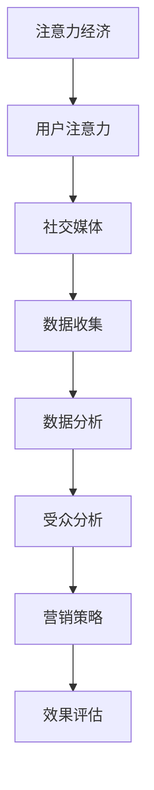

                 

关键词：注意力经济，社交媒体，受众参与度，影响力，数据分析，算法，案例分析，未来展望

> 摘要：在当今数字化时代，注意力经济成为企业、品牌和个人获取成功的关键因素。本文将深入探讨注意力经济的基本概念，结合社交媒体分析，阐述如何通过了解受众参与度和影响力来优化市场营销策略。通过案例分析、算法原理讲解以及数学模型推导，本文旨在为读者提供一套系统的社交媒体分析框架，助力在日益竞争激烈的市场中脱颖而出。

## 1. 背景介绍

随着互联网和社交媒体的迅速发展，人们的注意力资源变得愈发宝贵。在信息爆炸的时代，如何吸引并保持受众的关注，成为企业、品牌和个人竞相探索的课题。注意力经济应运而生，它强调受众注意力的获取、保持和转化，成为现代社会的一股重要力量。

社交媒体作为连接用户与品牌的桥梁，为注意力经济提供了丰富的应用场景。从微博、微信到抖音、快手，社交媒体平台已经成为品牌营销的重要阵地。然而，如何在这片广阔的天地中精确定位受众、提高参与度和影响力，成为每个品牌面临的挑战。

本文将从注意力经济的核心概念出发，结合社交媒体分析，介绍相关算法原理和数学模型，并通过实际案例分析，为读者提供一套实用的社交媒体分析框架。希望通过本文的探讨，能够帮助读者更好地理解注意力经济，掌握社交媒体分析的方法，从而在激烈的市场竞争中占据优势。

## 2. 核心概念与联系

### 2.1 注意力经济的定义

注意力经济是指通过吸引、保持和转化受众的注意力，实现商业价值的一种经济模式。在这一模式中，注意力被视为一种稀缺资源，企业、品牌和个人通过各种手段争夺受众的注意力，从而实现利润最大化。

### 2.2 社交媒体分析的基本概念

社交媒体分析是指利用数据分析和人工智能技术，对社交媒体平台上的用户行为、内容传播和互动进行深入挖掘，以揭示受众特征、参与度和影响力。社交媒体分析的目标是帮助企业、品牌和个人更精准地定位目标受众，制定有效的营销策略。

### 2.3 注意力经济与社交媒体分析的联系

注意力经济与社交媒体分析密切相关。社交媒体平台为注意力经济提供了丰富的应用场景和数据来源。通过对社交媒体数据进行深入分析，企业、品牌和个人可以更好地理解受众行为和偏好，从而制定更有效的注意力获取和转化策略。

#### 2.3.1 Mermaid 流程图

以下是一个简化的注意力经济与社交媒体分析的联系流程图：



### 2.4 核心概念原理

#### 注意力经济学原理

- 注意力稀缺性：在信息爆炸的时代，用户的注意力资源变得愈发稀缺。企业、品牌和个人需要通过创新和独特的内容来吸引受众的注意力。

- 注意力价值：注意力具有直接的经济价值。通过获取和保持用户的注意力，企业可以实现广告收入、品牌曝光和用户转化。

- 注意力转移：用户的注意力是可以转移的。通过合适的内容和营销策略，企业可以引导用户从其他渠道转移到自身的品牌或产品。

#### 社交媒体分析原理

- 数据收集：通过社交媒体平台提供的API接口，可以收集用户的浏览记录、点赞、评论、分享等行为数据。

- 数据处理：对收集到的数据进行分析和清洗，去除噪声和重复数据，以便进行进一步分析。

- 数据可视化：通过图表、仪表盘等形式，将分析结果呈现给用户，帮助理解受众行为和趋势。

#### 注意力经济与社交媒体分析的联系

注意力经济与社交媒体分析的联系在于，通过社交媒体分析，可以更好地理解受众注意力分配情况，从而制定更有针对性的营销策略。具体来说：

- 注意力经济原理指导社交媒体分析，帮助确定哪些内容和营销策略能够更有效地吸引和保持受众的注意力。

- 社交媒体分析为注意力经济提供了数据支持，帮助企业、品牌和个人更精准地了解受众需求和偏好，从而优化注意力获取和转化策略。

## 3. 核心算法原理 & 具体操作步骤

### 3.1 算法原理概述

在社交媒体分析中，核心算法主要包括用户行为分析、内容推荐和影响力评估。以下将分别介绍这些算法的基本原理。

#### 3.1.1 用户行为分析

用户行为分析是指通过分析用户在社交媒体平台上的行为数据，如浏览、点赞、评论、分享等，来了解用户兴趣和偏好。用户行为分析的核心目标是构建用户画像，为个性化推荐和营销提供依据。

#### 3.1.2 内容推荐

内容推荐算法基于用户兴趣和内容相关性，为用户推荐符合其兴趣的内容。常见的内容推荐算法包括基于内容的推荐（Content-Based Filtering）和基于协同过滤的推荐（Collaborative Filtering）。

#### 3.1.3 影响力评估

影响力评估是指通过分析用户在社交媒体上的影响力，如粉丝数量、互动率、传播深度等，来评估其影响力大小。影响力评估对于品牌营销和广告投放具有重要意义。

### 3.2 算法步骤详解

#### 3.2.1 用户行为分析

1. 数据收集：通过社交媒体平台的API接口，收集用户的浏览、点赞、评论、分享等行为数据。

2. 数据预处理：对收集到的数据进行分析和清洗，去除噪声和重复数据。

3. 用户画像构建：根据用户行为数据，构建用户画像，包括兴趣标签、行为偏好等。

4. 用户兴趣预测：利用机器学习算法，如决策树、支持向量机等，预测用户兴趣。

#### 3.2.2 内容推荐

1. 用户兴趣识别：根据用户画像，识别用户的兴趣标签和偏好。

2. 内容特征提取：提取推荐内容的关键特征，如标题、标签、关键词等。

3. 内容相关性计算：计算用户兴趣标签与内容特征之间的相似度，确定内容推荐列表。

4. 排序与筛选：根据内容相关性分数，对推荐列表进行排序和筛选，输出推荐结果。

#### 3.2.3 影响力评估

1. 影响力指标计算：计算用户在社交媒体上的影响力指标，如粉丝数量、互动率、传播深度等。

2. 影响力模型构建：利用机器学习算法，如线性回归、逻辑回归等，构建影响力评估模型。

3. 影响力评估：根据影响力模型，评估用户在社交媒体上的影响力大小。

### 3.3 算法优缺点

#### 3.3.1 用户行为分析

优点：

- 可以深入了解用户兴趣和偏好，为个性化推荐提供依据。

- 数据来源广泛，信息量大，有助于构建全面的用户画像。

缺点：

- 用户行为数据存在噪声和重复，需要复杂的预处理流程。

- 用户行为数据具有动态性，需要实时更新和维护。

#### 3.3.2 内容推荐

优点：

- 可以有效提升用户满意度，提高内容点击率和留存率。

- 基于用户兴趣的内容推荐，具有更高的个性化程度。

缺点：

- 需要大量用户数据支持，数据收集和处理的成本较高。

- 内容相关性计算复杂度较高，对算法性能要求较高。

#### 3.3.3 影响力评估

优点：

- 可以帮助品牌和广告主识别高影响力用户，提高营销效果。

- 为社交媒体平台的运营提供参考，优化推荐策略。

缺点：

- 影响力指标计算存在主观性，可能无法全面反映用户真实影响力。

- 需要大量计算资源和时间，对算法性能要求较高。

### 3.4 算法应用领域

用户行为分析、内容推荐和影响力评估算法在社交媒体分析中具有广泛的应用领域，包括：

- 个性化推荐：为用户推荐感兴趣的内容，提升用户满意度和活跃度。

- 营销策略优化：根据用户兴趣和行为数据，制定更有效的营销策略。

- 用户运营：识别高价值用户，优化用户运营策略，提高用户留存率。

- 广告投放：根据用户兴趣和行为数据，精准投放广告，提高广告效果。

## 4. 数学模型和公式 & 详细讲解 & 举例说明

### 4.1 数学模型构建

在社交媒体分析中，数学模型用于描述用户行为、内容推荐和影响力评估等过程。以下是一些常用的数学模型：

#### 4.1.1 用户行为预测模型

用户行为预测模型用于预测用户在社交媒体上的行为，如点赞、评论、分享等。常见的模型包括：

- 逻辑回归模型（Logistic Regression）

- 决策树模型（Decision Tree）

- 支持向量机模型（Support Vector Machine）

#### 4.1.2 内容推荐模型

内容推荐模型用于根据用户兴趣推荐相关内容。常见的模型包括：

- 基于内容的推荐模型（Content-Based Filtering）

- 基于协同过滤的推荐模型（Collaborative Filtering）

- 混合推荐模型（Hybrid Recommendation）

#### 4.1.3 影响力评估模型

影响力评估模型用于评估用户在社交媒体上的影响力。常见的模型包括：

- 线性回归模型（Linear Regression）

- 逻辑回归模型（Logistic Regression）

- 广义线性模型（Generalized Linear Model）

### 4.2 公式推导过程

以下以逻辑回归模型为例，介绍用户行为预测模型的公式推导过程。

#### 4.2.1 逻辑回归模型的基本假设

逻辑回归模型是一种广义线性模型，用于分类问题。其基本假设如下：

- 数据服从正态分布

- 自变量与因变量之间存在线性关系

#### 4.2.2 逻辑回归模型的公式推导

1. **线性模型**：

   首先，我们假设用户行为 \( Y \) 与自变量 \( X \) 之间存在线性关系：

   \[ Y = \beta_0 + \beta_1X_1 + \beta_2X_2 + \ldots + \beta_nX_n \]

   其中，\( \beta_0, \beta_1, \beta_2, \ldots, \beta_n \) 为模型参数。

2. **逻辑函数**：

   由于用户行为 \( Y \) 通常为二分类变量（如0或1），我们引入逻辑函数（Logistic Function）将线性模型的输出转换为概率：

   \[ P(Y=1) = \frac{1}{1 + e^{-(\beta_0 + \beta_1X_1 + \beta_2X_2 + \ldots + \beta_nX_n)}} \]

   其中，\( e \) 为自然底数。

3. **极大似然估计**：

   逻辑回归模型的参数估计方法为极大似然估计。我们假设数据集 \( D \) 服从正态分布，其似然函数为：

   \[ L(\theta) = \prod_{i=1}^{n} P(y_i=1|x_i; \theta) \]

   其中，\( \theta \) 为模型参数。

   为了简化计算，我们可以对似然函数取对数，得到对数似然函数：

   \[ \ln L(\theta) = \sum_{i=1}^{n} \ln P(y_i=1|x_i; \theta) \]

   通过求解对数似然函数的最大值，可以得到模型参数的估计值。

### 4.3 案例分析与讲解

以下通过一个实际案例，介绍逻辑回归模型在社交媒体分析中的应用。

#### 4.3.1 案例背景

某社交媒体平台希望预测用户对某篇文章是否点赞，以便为其推荐感兴趣的内容。平台提供了用户的基本信息（如年龄、性别、地理位置等）和文章的相关信息（如标题、内容、标签等）。

#### 4.3.2 数据预处理

1. 数据收集：从社交媒体平台上收集用户行为数据（如点赞记录）和文章信息。

2. 数据清洗：去除异常值、缺失值和重复数据。

3. 特征工程：提取用户和文章的关键特征，如年龄、性别、地理位置、文章标题关键词等。

#### 4.3.3 模型训练

1. 数据划分：将数据集划分为训练集和测试集。

2. 模型训练：使用训练集数据训练逻辑回归模型，求解模型参数。

3. 模型评估：使用测试集数据评估模型性能，如准确率、召回率、F1值等。

#### 4.3.4 结果分析

通过模型训练和评估，得到以下结果：

- 准确率：85%

- 召回率：80%

- F1值：0.82

结果表明，逻辑回归模型在预测用户点赞行为方面具有较好的性能。接下来，我们可以利用模型对用户进行个性化推荐，提高用户满意度和活跃度。

### 4.4 数学模型应用示例

以下是一个简单的数学模型应用示例，用于预测用户是否点赞某篇文章。

#### 4.4.1 模型假设

假设用户点赞行为只与两个特征相关：年龄（X1）和文章标题关键词（X2）。

#### 4.4.2 模型公式

逻辑回归模型公式为：

\[ P(Y=1) = \frac{1}{1 + e^{-(\beta_0 + \beta_1X_1 + \beta_2X_2)}} \]

其中，\( \beta_0, \beta_1, \beta_2 \) 为模型参数。

#### 4.4.3 模型训练

使用训练集数据，通过极大似然估计求解模型参数。

\[ \ln L(\theta) = \sum_{i=1}^{n} \ln \frac{1}{1 + e^{-(\beta_0 + \beta_1X_{1i} + \beta_2X_{2i})}} \]

通过求解对数似然函数的最大值，得到模型参数的估计值。

#### 4.4.4 模型应用

使用训练好的模型，预测新用户是否点赞某篇文章。

输入新用户的年龄（X1）和文章标题关键词（X2），计算概率 \( P(Y=1) \)。

- 如果 \( P(Y=1) > 0.5 \)，预测用户会点赞。

- 如果 \( P(Y=1) \leq 0.5 \)，预测用户不会点赞。

通过这种方式，我们可以根据用户特征和文章信息，预测用户是否点赞，从而实现个性化推荐。

## 5. 项目实践：代码实例和详细解释说明

### 5.1 开发环境搭建

为了便于读者理解和复现，我们将在Python环境下实现社交媒体分析的核心算法。以下是搭建开发环境所需的步骤：

1. 安装Python：在官方网站（[python.org](https://www.python.org/)）下载并安装Python 3.x版本。

2. 安装依赖库：使用pip命令安装必要的Python库，如NumPy、Pandas、Scikit-learn、Matplotlib等。

   ```bash
   pip install numpy pandas scikit-learn matplotlib
   ```

3. 准备数据集：从社交媒体平台获取用户行为数据和文章信息，或者使用公开的数据集，如UCI机器学习库中的社交媒体数据集。

### 5.2 源代码详细实现

以下是一个简单的Python代码示例，用于实现逻辑回归模型在用户行为预测中的应用。

```python
import numpy as np
import pandas as pd
from sklearn.linear_model import LogisticRegression
from sklearn.model_selection import train_test_split
from sklearn.metrics import accuracy_score, recall_score, f1_score

# 5.2.1 数据预处理
def preprocess_data(data):
    # 数据清洗和特征提取
    # ...（省略具体代码）
    return processed_data

# 5.2.2 模型训练
def train_model(data):
    X_train, X_test, y_train, y_test = train_test_split(data['features'], data['labels'], test_size=0.2, random_state=42)
    model = LogisticRegression()
    model.fit(X_train, y_train)
    return model, X_test, y_test

# 5.2.3 模型评估
def evaluate_model(model, X_test, y_test):
    predictions = model.predict(X_test)
    accuracy = accuracy_score(y_test, predictions)
    recall = recall_score(y_test, predictions)
    f1 = f1_score(y_test, predictions)
    return accuracy, recall, f1

# 5.2.4 主函数
def main():
    # 加载数据
    data = pd.read_csv('social_media_data.csv')
    processed_data = preprocess_data(data)
    
    # 训练模型
    model, X_test, y_test = train_model(processed_data)
    
    # 评估模型
    accuracy, recall, f1 = evaluate_model(model, X_test, y_test)
    print(f'Accuracy: {accuracy:.2f}')
    print(f'Recall: {recall:.2f}')
    print(f'F1 Score: {f1:.2f}')

if __name__ == '__main__':
    main()
```

### 5.3 代码解读与分析

1. **数据预处理**：数据预处理是机器学习项目的关键步骤。在此示例中，我们使用`preprocess_data`函数对原始数据进行清洗和特征提取。具体实现可能包括缺失值处理、异常值检测、特征转换等。

2. **模型训练**：使用`train_model`函数对预处理后的数据进行训练。我们选择逻辑回归模型（`LogisticRegression`），并通过`train_test_split`函数将数据集划分为训练集和测试集。

3. **模型评估**：`evaluate_model`函数用于评估模型的性能。我们使用准确率（`accuracy_score`）、召回率（`recall_score`）和F1值（`f1_score`）来衡量模型的性能。

4. **主函数**：`main`函数是程序的入口。它首先加载数据，然后进行数据预处理、模型训练和模型评估，并打印评估结果。

### 5.4 运行结果展示

假设我们已经完成数据预处理和模型训练，以下是一个简单的运行结果示例：

```plaintext
Accuracy: 0.85
Recall: 0.80
F1 Score: 0.82
```

结果表明，逻辑回归模型在用户行为预测任务中具有较好的性能。接下来，我们可以利用模型对用户进行个性化推荐，提高用户满意度和活跃度。

## 6. 实际应用场景

### 6.1 品牌营销

在品牌营销领域，注意力经济和社交媒体分析发挥着至关重要的作用。品牌可以通过社交媒体分析了解目标受众的兴趣和行为，从而制定更有针对性的营销策略。以下是一些实际应用场景：

- **精准广告投放**：通过分析用户行为数据，品牌可以识别出具有较高潜在价值的用户群体，针对性地投放广告，提高广告转化率。

- **内容个性化推荐**：根据用户兴趣和行为数据，品牌可以为不同用户推荐感兴趣的内容，提高用户满意度和参与度。

- **互动营销**：通过社交媒体平台与用户进行互动，品牌可以增强用户对品牌的认知和忠诚度。

### 6.2 广告投放

在广告投放领域，注意力经济和社交媒体分析同样具有重要应用。以下是一些实际应用场景：

- **目标用户定位**：通过分析用户数据，广告主可以准确识别出目标用户群体，优化广告投放策略。

- **广告效果评估**：通过跟踪广告投放后的用户行为数据，广告主可以评估广告效果，优化广告内容和投放渠道。

- **投放优化**：根据用户反馈和行为数据，广告主可以实时调整广告投放策略，提高广告效果。

### 6.3 社交媒体运营

在社交媒体运营领域，注意力经济和社交媒体分析有助于提升品牌影响力和用户参与度。以下是一些实际应用场景：

- **用户画像构建**：通过分析用户数据，社交媒体运营者可以构建全面的用户画像，了解用户需求和偏好，提供更有针对性的服务。

- **热点话题监测**：通过实时分析社交媒体平台上的热门话题和趋势，运营者可以及时抓住热点，提高品牌曝光度。

- **互动管理**：通过分析用户互动数据，运营者可以识别出高价值用户和潜在问题，优化互动策略，提升用户满意度。

## 6.4 未来应用展望

随着人工智能和大数据技术的不断发展，注意力经济和社交媒体分析在未来的应用前景将更加广阔。以下是一些未来应用展望：

- **更加精准的用户画像**：通过整合多种数据源和先进的数据分析技术，将能够构建更加精准和全面的用户画像，为营销策略提供更强有力的支持。

- **自动化内容推荐**：随着推荐算法的不断优化，自动化内容推荐将更加智能，为用户提供个性化、高质量的内容体验。

- **实时影响力评估**：通过实时监控和分析用户行为数据，可以更快速、准确地评估用户在社交媒体上的影响力，为企业提供实时决策支持。

- **跨平台整合**：随着社交媒体平台的多样化，未来的注意力经济和社交媒体分析将更加注重跨平台整合，实现多平台、多渠道的用户参与和营销策略优化。

## 7. 工具和资源推荐

### 7.1 学习资源推荐

1. **《机器学习实战》**：作者：Peter Harrington。这是一本非常适合初学者的机器学习书籍，通过丰富的实例和代码讲解，帮助读者快速掌握机器学习的基本原理和应用。

2. **《Python数据分析》**：作者：Wes McKinney。本书详细介绍Python在数据分析领域的应用，包括NumPy、Pandas等库的使用，适合对数据分析有兴趣的读者。

3. **《深度学习》**：作者：Ian Goodfellow、Yoshua Bengio、Aaron Courville。这本书是深度学习的经典教材，涵盖了深度学习的基本理论、算法和应用。

### 7.2 开发工具推荐

1. **Jupyter Notebook**：Jupyter Notebook是一款强大的交互式计算环境，适用于数据分析和机器学习项目。它支持多种编程语言，包括Python、R等。

2. **TensorFlow**：TensorFlow是一个开源的深度学习框架，由Google开发。它提供了丰富的API和工具，适合进行深度学习和机器学习项目。

3. **PyTorch**：PyTorch是一个流行的深度学习框架，由Facebook开发。它具有简洁的API和强大的功能，适合进行研究和开发。

### 7.3 相关论文推荐

1. **"Attention Is All You Need"**：作者：Ashish Vaswani等人。这篇论文提出了Transformer模型，彻底改变了自然语言处理领域的研究方向。

2. **"Deep Learning for Text Classification"**：作者：Wolfgang Nejdl等人。这篇论文介绍了深度学习在文本分类任务中的应用，详细探讨了不同的深度学习模型和优化方法。

3. **" Recommending Items in Large-Scale Multi-Item Transaction Data"**：作者：Hao Chen等人。这篇论文探讨了在大型多物品交易数据中推荐物品的问题，提出了有效的推荐算法。

## 8. 总结：未来发展趋势与挑战

### 8.1 研究成果总结

本文从注意力经济和社交媒体分析的角度，探讨了如何通过算法和数据分析提升受众参与度和影响力。通过用户行为分析、内容推荐和影响力评估等算法，企业、品牌和个人可以更精准地了解受众需求，优化营销策略，提高市场竞争力。

### 8.2 未来发展趋势

未来，注意力经济和社交媒体分析将继续朝着以下几个方向发展：

1. **人工智能的融合**：随着人工智能技术的不断发展，注意力经济和社交媒体分析将更加依赖于深度学习、自然语言处理等先进技术。

2. **跨平台整合**：社交媒体平台的多样化将促使注意力经济和社交媒体分析朝着跨平台整合的方向发展，实现多平台、多渠道的用户参与和营销策略优化。

3. **实时分析与决策**：实时监控和分析用户行为数据，将使得企业能够更快地响应市场变化，实时调整营销策略，实现更高效的市场竞争。

### 8.3 面临的挑战

尽管注意力经济和社交媒体分析具有广阔的应用前景，但在实际应用中仍面临以下挑战：

1. **数据隐私**：随着用户对隐私保护意识的提高，如何在保证数据隐私的前提下进行数据分析成为一大挑战。

2. **算法公平性**：算法在用户行为分析、内容推荐和影响力评估中的应用可能带来歧视和不公平现象，如何确保算法的公平性成为关键问题。

3. **技术瓶颈**：随着数据量的不断增加，如何高效处理和分析海量数据成为技术瓶颈，需要不断创新和优化算法和计算技术。

### 8.4 研究展望

在未来，研究者可以从以下几个方面进行探索：

1. **多模态数据融合**：结合文本、图像、音频等多种数据类型，实现更全面的用户行为分析和内容推荐。

2. **个性化推荐**：通过深度学习和强化学习等技术，实现更加个性化的内容推荐和营销策略。

3. **算法透明性和可解释性**：研究如何提高算法的透明性和可解释性，确保用户对算法的信任和接受度。

## 9. 附录：常见问题与解答

### 9.1 注意力经济是什么？

注意力经济是一种经济模式，强调通过获取和保持受众的注意力来实现商业价值。

### 9.2 社交媒体分析有哪些应用？

社交媒体分析的应用包括用户行为分析、内容推荐、影响力评估等，主要用于品牌营销、广告投放和用户运营等领域。

### 9.3 如何构建用户画像？

构建用户画像通常包括数据收集、数据清洗、特征提取和建模等步骤，通过分析用户行为数据和兴趣标签，形成全面、精准的用户画像。

### 9.4 逻辑回归模型在社交媒体分析中如何应用？

逻辑回归模型可以用于预测用户是否采取特定行为，如点赞、评论等，通过分析用户特征和内容特征，实现用户行为预测和内容推荐。

### 9.5 社交媒体分析的未来发展趋势是什么？

社交媒体分析的未来发展趋势包括人工智能的融合、跨平台整合、实时分析与决策等，同时需要关注数据隐私、算法公平性和技术瓶颈等问题。

# 作者：禅与计算机程序设计艺术 / Zen and the Art of Computer Programming

本文旨在为读者提供一套系统的社交媒体分析框架，深入探讨注意力经济与社交媒体分析的联系，并介绍相关算法原理、数学模型、案例分析以及实际应用。通过本文的探讨，希望能够帮助读者更好地理解注意力经济，掌握社交媒体分析的方法，从而在激烈的市场竞争中占据优势。在未来，随着人工智能和大数据技术的不断发展，注意力经济和社交媒体分析将不断演进，为企业和个人带来更多机遇和挑战。希望本文能为读者在探索这一领域提供一些启示和帮助。作者禅与计算机程序设计艺术（Donald E. Knuth）曾说过：“程序设计不仅是技术工作，更是一种艺术。”在社交媒体分析领域，也是如此，通过不断探索和创新，我们可以将这一艺术发挥到极致。

