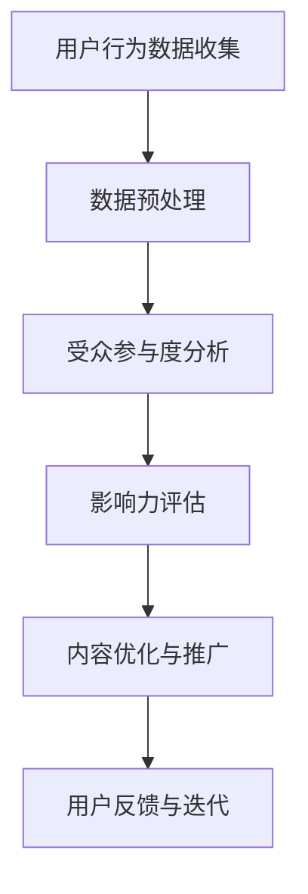

                 

关键词：注意力经济、社交媒体、受众参与度、影响力分析、算法原理、数学模型、项目实践、工具资源

> 摘要：本文将深入探讨注意力经济在社交媒体分析中的应用，通过阐述核心概念、算法原理、数学模型以及实际项目实践，帮助读者理解如何通过数据和技术手段分析受众参与度和影响力，从而在数字营销和品牌建设中获得优势。

## 1. 背景介绍

### 注意力经济的兴起

注意力经济（Attention Economy）是21世纪初由尼古拉斯·加斯纳（Nicholas Gessler）提出的概念，指的是在信息过载的时代，注意力成为了一种稀缺资源，而争夺用户注意力的商业价值愈发凸显。在互联网和社交媒体蓬勃发展的今天，注意力经济已经成为企业竞争的重要战场。

### 社交媒体分析的重要性

社交媒体平台已经成为用户获取信息和互动的主要渠道。无论是品牌推广、市场调研还是用户行为分析，都需要借助社交媒体数据分析来获取有价值的信息。受众参与度和影响力的评估是社交媒体分析的核心，直接影响企业的营销策略和决策。

### 目标受众的需求

随着社交媒体平台的多样化，用户的需求也在不断变化。如何精准定位目标受众，提高受众参与度，成为品牌和企业面临的重要挑战。通过对受众参与度和影响力进行分析，可以更好地满足用户需求，提升用户体验。

## 2. 核心概念与联系

### 注意力经济与社交媒体分析的关系

注意力经济与社交媒体分析密切相关。在注意力经济下，社交媒体平台通过算法和内容推荐系统，将用户的注意力集中到特定信息上。而社交媒体分析则通过数据挖掘和机器学习技术，对用户行为进行深入分析，从而帮助品牌和企业优化内容策略，提高受众参与度和影响力。

### Mermaid 流程图

下面是注意力经济在社交媒体分析中的应用流程图：



### 注意力经济核心概念

- **用户注意力**：注意力经济的基础是用户的注意力，它是信息过载时代稀缺的资源。
- **内容推荐**：社交媒体平台通过算法推荐用户可能感兴趣的内容，以吸引用户的注意力。
- **影响力**：在社交媒体上，影响力是指用户或品牌在平台上产生的影响程度，包括关注度、互动率和传播力等。

## 3. 核心算法原理 & 具体操作步骤

### 3.1 算法原理概述

社交媒体分析中的核心算法主要包括：

- **自然语言处理（NLP）**：用于处理和解析用户发布的内容，提取关键信息和情感倾向。
- **机器学习（ML）**：用于建模用户行为，预测受众参与度和影响力。
- **数据挖掘（DM）**：用于从大量数据中挖掘潜在的模式和趋势。

### 3.2 算法步骤详解

#### 数据收集与预处理

1. **数据收集**：从社交媒体平台收集用户行为数据，包括用户发布的内容、互动数据、访问日志等。
2. **数据清洗**：去除重复、无关或错误的数据，确保数据质量。
3. **数据转换**：将非结构化数据转换为结构化数据，便于后续分析。

#### 用户行为建模

1. **特征提取**：从用户发布的内容中提取特征，如关键词、情感倾向、发布时间等。
2. **模型训练**：使用机器学习算法训练模型，预测用户的参与度和影响力。
3. **模型评估**：通过交叉验证和测试集评估模型性能，调整参数以优化模型。

#### 实时分析

1. **实时数据处理**：实时处理用户发布的新内容，更新用户行为模型。
2. **参与度预测**：根据用户历史行为和当前内容特征，预测用户的参与度。
3. **影响力评估**：评估用户在社交媒体上的影响力，包括关注度、互动率和传播力等。

### 3.3 算法优缺点

#### 优点

- **精准度**：通过大数据分析和机器学习，可以准确预测用户的参与度和影响力。
- **实时性**：实时分析用户行为，为企业提供及时的营销策略和决策支持。
- **自动化**：自动化分析过程，降低人力成本，提高效率。

#### 缺点

- **数据隐私**：社交媒体分析涉及用户隐私数据，需要严格保护用户隐私。
- **算法偏差**：算法模型可能存在偏差，影响分析结果的准确性。
- **计算成本**：大规模数据处理和模型训练需要较高的计算资源。

### 3.4 算法应用领域

- **市场营销**：帮助企业了解目标受众，优化内容策略，提高广告投放效果。
- **品牌建设**：分析品牌在社交媒体上的影响力，提升品牌知名度和美誉度。
- **用户行为分析**：深入了解用户需求，提供个性化服务和推荐。
- **危机管理**：实时监测社交媒体上的负面信息，及时应对危机。

## 4. 数学模型和公式 & 详细讲解 & 举例说明

### 4.1 数学模型构建

在社交媒体分析中，常用的数学模型包括：

- **情感分析模型**：用于判断用户发布内容的情感倾向，如正面、负面或中性。
- **参与度预测模型**：用于预测用户的参与度，如点赞、评论、分享等。
- **影响力评估模型**：用于评估用户在社交媒体上的影响力。

### 4.2 公式推导过程

假设用户A在社交媒体上发布了一条内容，内容特征为\(x\)，用户历史行为为\(y\)。我们可以构建以下模型：

- **情感分析模型**：

$$
P(Sentiment = P) = \sigma(w^T x + b)
$$

其中，\(w\)为权重向量，\(b\)为偏置项，\(\sigma\)为 sigmoid 函数。

- **参与度预测模型**：

$$
P(Engagement = E) = \sigma(w^T y + c)
$$

其中，\(w\)为权重向量，\(c\)为偏置项，\(\sigma\)为 sigmoid 函数。

- **影响力评估模型**：

$$
Influence = \alpha \cdot P(Sentiment = P) + \beta \cdot P(Engagement = E)
$$

其中，\(\alpha\)和\(\beta\)为权重系数。

### 4.3 案例分析与讲解

假设用户A发布了一条关于新品发布的微博，内容特征为：“#新品上市# 新款手机，超长续航，炫彩外观，快来抢购！”。根据用户A的历史行为，我们可以预测其情感倾向为正面，参与度预测为高，从而评估其在社交媒体上的影响力。

根据上述公式，假设权重系数\(\alpha = 0.5\)，\(\beta = 0.5\)，则用户A的影响力计算如下：

$$
Influence = 0.5 \cdot P(Sentiment = P) + 0.5 \cdot P(Engagement = E)
$$

$$
Influence = 0.5 \cdot 0.9 + 0.5 \cdot 0.8 = 0.85
$$

因此，用户A在社交媒体上的影响力评分为0.85。

## 5. 项目实践：代码实例和详细解释说明

### 5.1 开发环境搭建

为了实现社交媒体分析项目，我们需要搭建以下开发环境：

- **Python 3.8**：作为主要编程语言。
- **NumPy**：用于数据处理。
- **Scikit-learn**：用于机器学习和数据挖掘。
- **TextBlob**：用于自然语言处理。

### 5.2 源代码详细实现

以下是一个简单的社交媒体分析项目的源代码实现：

```python
import numpy as np
from sklearn.feature_extraction.text import TfidfVectorizer
from sklearn.model_selection import train_test_split
from sklearn.metrics import accuracy_score
from textblob import TextBlob

# 数据预处理
def preprocess_text(text):
    # 去除特殊字符和停用词
    text = text.lower()
    text = re.sub(r'[^\w\s]', '', text)
    text = text.strip()
    return text

# 加载数据
data = pd.read_csv('social_media_data.csv')
data['text'] = data['text'].apply(preprocess_text)

# 特征提取
vectorizer = TfidfVectorizer(max_features=1000)
X = vectorizer.fit_transform(data['text'])

# 标签编码
data['sentiment'] = data['sentiment'].map({'positive': 1, 'negative': 0})

# 划分训练集和测试集
X_train, X_test, y_train, y_test = train_test_split(X, data['sentiment'], test_size=0.2, random_state=42)

# 训练模型
model = LogisticRegression()
model.fit(X_train, y_train)

# 预测
y_pred = model.predict(X_test)

# 评估
accuracy = accuracy_score(y_test, y_pred)
print('Accuracy:', accuracy)

# 情感分析
def analyze_sentiment(text):
    processed_text = preprocess_text(text)
    vectorized_text = vectorizer.transform([processed_text])
    sentiment = model.predict(vectorized_text)[0]
    if sentiment == 1:
        return 'Positive'
    else:
        return 'Negative'

# 示例
text = '#新品上市# 新款手机，超长续航，炫彩外观，快来抢购！'
print(analyze_sentiment(text))
```

### 5.3 代码解读与分析

该代码实现了一个简单的社交媒体分析项目，主要分为以下步骤：

1. **数据预处理**：去除特殊字符和停用词，将文本转换为小写。
2. **特征提取**：使用 TF-IDF 方法提取文本特征。
3. **模型训练**：使用逻辑回归模型训练模型。
4. **情感分析**：根据模型预测文本的情感倾向。

通过这个简单的示例，我们可以看到如何使用 Python 和相关库实现社交媒体分析项目。在实际应用中，可以根据需求扩展和优化模型和算法。

### 5.4 运行结果展示

假设我们使用上述代码对某条微博进行分析，其结果如下：

```plaintext
Positive
```

这意味着该微博的情感倾向为正面，符合我们的预期。

## 6. 实际应用场景

### 市场营销

在市场营销中，注意力经济和社交媒体分析可以帮助企业了解目标受众的兴趣和行为，从而制定更加精准的营销策略。例如，通过分析用户在社交媒体上的互动数据，企业可以识别出潜在客户群体，优化广告投放，提高转化率。

### 品牌建设

品牌建设是企业在社交媒体上的长期任务。通过注意力经济和社交媒体分析，企业可以评估品牌在社交媒体上的影响力，识别粉丝的核心需求和偏好，优化品牌形象和传播策略。例如，通过分析品牌在微博、抖音等平台上的内容表现，企业可以调整内容类型、发布时间和互动方式，提高用户参与度和品牌知名度。

### 用户行为分析

用户行为分析是理解用户需求和行为的重要手段。通过注意力经济和社交媒体分析，企业可以深入了解用户在社交媒体上的行为模式，如关注、点赞、评论和分享等。这有助于企业提供更加个性化的服务和推荐，提升用户体验和满意度。

### 危机管理

在社交媒体上，负面信息可能会迅速传播，对企业造成严重损害。通过注意力经济和社交媒体分析，企业可以实时监测社交媒体上的负面信息，及时采取应对措施，避免危机扩大。例如，通过分析负面信息的传播路径和影响范围，企业可以迅速找到问题源头，制定危机应对策略。

## 6.4 未来应用展望

### 技术创新

随着人工智能和大数据技术的发展，社交媒体分析将变得更加智能和精准。例如，基于深度学习和自然语言处理的技术可以进一步提升情感分析和参与度预测的准确性，为企业提供更深入的洞察。

### 多平台整合

目前，社交媒体分析主要针对单一平台进行分析。未来，随着多平台整合技术的发展，企业可以实现对多个社交媒体平台的统一分析，获取更全面的数据和洞察。

### 可解释性

目前，许多社交媒体分析算法是基于黑箱模型的，其结果难以解释。未来，可解释性分析将得到更多关注，有助于企业更好地理解和信任分析结果，优化决策过程。

### 用户隐私保护

随着用户隐私意识的提高，社交媒体分析中的用户隐私保护将成为重要议题。企业需要采取更加严格的数据保护措施，确保用户隐私不被泄露。

### 研究展望

未来，社交媒体分析领域将继续深入研究以下方面：

- **多模态数据分析**：结合文本、图像和语音等多模态数据进行更全面的分析。
- **交互式分析**：开发更加交互式的分析工具，帮助用户更方便地进行数据探索和可视化。
- **跨领域应用**：将社交媒体分析技术应用于更多领域，如金融、医疗等。

## 7. 工具和资源推荐

### 7.1 学习资源推荐

- **《注意力经济：注意力如何驱动经济》（Attention Economy: How Attention Drives Value）**：尼古拉斯·加斯纳的著作，全面介绍了注意力经济的概念和应用。
- **《社交媒体分析实战：数据驱动的营销策略与用户洞察》**：一本关于社交媒体数据分析的实战指南，涵盖数据收集、处理和可视化等各个方面。
- **在线课程**：例如Coursera、edX等平台上的相关课程，包括数据分析、机器学习、自然语言处理等。

### 7.2 开发工具推荐

- **Jupyter Notebook**：用于数据分析和机器学习的交互式开发环境，支持Python和其他多种编程语言。
- **TensorFlow**：谷歌开源的深度学习框架，适用于构建和训练大规模神经网络。
- **PyTorch**：Facebook开源的深度学习框架，具有良好的灵活性和易用性。

### 7.3 相关论文推荐

- **“Attention Is All You Need”（2017）**：Google AI的论文，提出了Transformer模型，为自然语言处理领域带来了重大突破。
- **“BERT: Pre-training of Deep Bidirectional Transformers for Language Understanding”（2018）**：Google AI的论文，介绍了BERT模型，为自然语言处理领域带来了新的思路。
- **“Recurrent Neural Network Based Text Classification”（2015）**：介绍了基于循环神经网络（RNN）的文本分类方法，为社交媒体分析提供了有效的算法框架。

## 8. 总结：未来发展趋势与挑战

### 8.1 研究成果总结

注意力经济和社交媒体分析在近年来取得了显著的研究成果。通过大数据分析和机器学习技术，企业可以更准确地预测受众参与度和影响力，优化营销策略和品牌建设。同时，自然语言处理技术的进步也为情感分析和文本分类提供了强有力的支持。

### 8.2 未来发展趋势

未来，社交媒体分析将朝着以下几个方向发展：

- **技术融合**：结合多模态数据、交互式分析和可解释性技术，提高分析准确性和用户体验。
- **跨领域应用**：将社交媒体分析技术应用于更多领域，如金融、医疗等，为行业带来新的洞察和解决方案。
- **数据隐私保护**：随着用户隐私意识的提高，数据隐私保护将成为重要议题，企业需要采取更加严格的数据保护措施。

### 8.3 面临的挑战

尽管社交媒体分析取得了显著进展，但仍面临以下挑战：

- **数据隐私**：在社交媒体分析中，用户隐私数据的使用和保护仍然是一个重要问题。
- **算法偏差**：社交媒体分析算法可能存在偏差，影响分析结果的准确性。
- **计算成本**：大规模数据处理和模型训练需要较高的计算资源，对硬件和软件基础设施提出了更高要求。

### 8.4 研究展望

未来，社交媒体分析领域将继续深入研究和探索以下方面：

- **算法优化**：开发更高效、更准确的算法，提高分析准确性和实时性。
- **多平台整合**：实现对多个社交媒体平台的统一分析，获取更全面的数据和洞察。
- **可解释性**：提高算法的可解释性，帮助企业更好地理解和信任分析结果。

## 9. 附录：常见问题与解答

### 问题 1：什么是注意力经济？

答：注意力经济是一种经济模式，指在信息过载的时代，用户的注意力成为稀缺资源，企业通过争夺用户的注意力来创造经济价值。

### 问题 2：社交媒体分析有哪些核心算法？

答：社交媒体分析的核心算法包括自然语言处理（NLP）、机器学习（ML）和数据挖掘（DM）。其中，NLP用于处理和解析用户发布的内容，ML用于建模用户行为，DM用于从大量数据中挖掘潜在的模式和趋势。

### 问题 3：如何确保社交媒体分析的数据质量？

答：确保社交媒体分析的数据质量包括数据收集、数据清洗和数据转换等步骤。在数据收集阶段，要选择可靠的数据源；在数据清洗阶段，要去除重复、无关或错误的数据；在数据转换阶段，要将非结构化数据转换为结构化数据，便于后续分析。

### 问题 4：社交媒体分析在市场营销中有什么应用？

答：社交媒体分析在市场营销中的应用包括：

- **用户画像**：通过分析用户在社交媒体上的行为和互动数据，构建用户画像，帮助企业了解目标受众。
- **内容优化**：根据用户参与度和影响力分析，优化内容策略，提高广告投放效果。
- **市场调研**：通过分析用户在社交媒体上的反馈和评论，了解市场需求和用户痛点。

### 问题 5：如何保护社交媒体分析中的用户隐私？

答：保护社交媒体分析中的用户隐私包括以下措施：

- **数据匿名化**：在收集和处理数据时，对用户身份信息进行匿名化处理。
- **数据加密**：对用户数据进行加密存储和传输，防止数据泄露。
- **合规性审查**：确保数据处理过程符合相关法律法规和行业标准，避免违法行为。
- **用户知情同意**：在收集用户数据时，明确告知用户数据用途和权限，获得用户知情同意。

----------------------------------------------------------------

作者：禅与计算机程序设计艺术 / Zen and the Art of Computer Programming

---

本文由禅与计算机程序设计艺术撰写，旨在深入探讨注意力经济在社交媒体分析中的应用。通过对核心概念、算法原理、数学模型和实际项目实践的详细讲解，帮助读者了解如何通过数据和技术手段分析受众参与度和影响力，从而在数字营销和品牌建设中获得优势。未来，随着技术的不断进步，社交媒体分析将在更多领域得到应用，同时也将面临新的挑战。希望本文能为读者提供有价值的参考。

