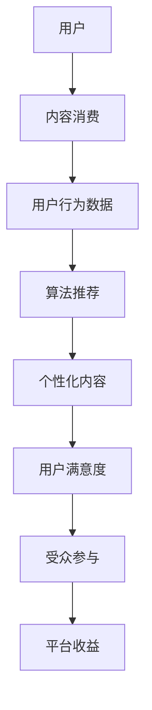

                 

### 文章关键词 Keywords ###

注意力经济、社交媒体、算法、受众参与、数据分析、用户体验、内容优化、信息传播、影响力、推荐系统、社交媒体平台。

<|assistant|>### 文章摘要 Abstract ###

随着互联网的快速发展，社交媒体已成为人们日常生活中不可或缺的一部分。本文旨在探讨注意力经济在社交媒体中的重要性，分析影响社交媒体用户体验的关键因素，并深入了解算法如何影响受众参与。通过对核心概念、算法原理、数学模型、项目实践和未来应用的全面分析，本文为社交媒体平台的运营者、内容创作者和研究者提供了有价值的参考。

## 1. 背景介绍

社交媒体平台如Facebook、Twitter、Instagram和微信等在全球范围内拥有数以亿计的用户，成为人们交流、分享和获取信息的重要渠道。然而，随着用户基数的不断扩大，内容爆炸式增长，如何吸引和保持用户的注意力成为各大平台和内容创作者面临的重要挑战。

注意力经济这一概念由Michael H. Goldhaber提出，其核心观点是注意力比信息本身更为稀缺和宝贵。在信息过载的时代，用户的注意力成为一种有限的资源，而如何有效地获取和保持用户的注意力，成为社交媒体平台和内容创作者需要解决的核心问题。

本文将围绕注意力经济，分析社交媒体中影响用户体验的关键因素，包括内容质量、社交关系、算法推荐等，并探讨算法如何影响受众参与。此外，还将介绍数学模型在注意力经济中的应用，以及通过实际项目实践展示算法和受众参与的具体实现。

## 2. 核心概念与联系

### 2.1 注意力经济

注意力经济是指一种以用户注意力为交换媒介的经济模式。在这个模式中，用户将注意力投入到特定的产品或内容中，平台或内容创作者则通过吸引用户的注意力获得经济收益。注意力经济的关键在于如何有效地吸引和保持用户的注意力，从而实现商业价值的最大化。

### 2.2 社交媒体平台

社交媒体平台如Facebook、Twitter、Instagram和微信等，通过提供内容分享、社交互动和个性化推荐等功能，吸引用户的注意力。这些平台的核心在于提供高质量的内容和良好的用户体验，从而使用户愿意投入时间和注意力。

### 2.3 算法推荐系统

算法推荐系统是社交媒体平台的重要组成部分，通过分析用户的行为数据，为用户提供个性化的内容推荐。算法推荐系统的核心在于如何根据用户的行为和偏好，提供符合用户兴趣的内容，从而提高用户的参与度和满意度。

### 2.4 受众参与

受众参与是指用户在社交媒体平台上的主动参与行为，包括评论、点赞、分享、关注等。受众参与是衡量社交媒体平台成功与否的重要指标，它直接影响平台的用户留存率和活跃度。

### 2.5 Mermaid 流程图

以下是注意力经济在社交媒体中的应用流程图：



## 3. 核心算法原理 & 具体操作步骤

### 3.1 算法原理概述

社交媒体平台使用的核心算法主要涉及推荐算法和用户行为分析。推荐算法通过分析用户的历史行为数据，预测用户可能感兴趣的内容，从而提高内容的曝光率和用户的参与度。用户行为分析则通过对用户的点击、评论、分享等行为进行分析，了解用户的兴趣和偏好，为推荐算法提供数据支持。

### 3.2 算法步骤详解

#### 3.2.1 用户行为数据收集

首先，社交媒体平台需要收集用户在平台上的各种行为数据，如浏览记录、点赞、评论、分享、关注等。这些数据可以通过API接口、日志分析等方式获取。

#### 3.2.2 用户兴趣建模

基于用户行为数据，使用机器学习算法（如协同过滤、内容推荐等）对用户兴趣进行建模。协同过滤算法通过分析用户与内容的交互记录，预测用户对未知内容的偏好；内容推荐算法则通过分析内容的特点（如文本、图像等），为用户推荐相似的内容。

#### 3.2.3 内容推荐

根据用户兴趣模型，算法推荐系统为用户生成个性化的推荐列表。推荐列表的生成可以通过多种策略实现，如基于内容的协同过滤、基于模型的协同过滤、混合推荐等。

#### 3.2.4 用户反馈

用户在浏览推荐内容后，会进行各种反馈行为，如点赞、评论、分享等。这些反馈数据可以用于更新用户兴趣模型，提高推荐的质量。

### 3.3 算法优缺点

#### 优点：

1. 提高用户体验：通过个性化推荐，用户可以更快地找到自己感兴趣的内容，提高满意度。
2. 提高内容曝光率：推荐算法可以推动优质内容得到更多用户的关注和传播。
3. 增加平台收益：通过提高用户参与度，平台可以吸引更多广告主，实现商业变现。

#### 缺点：

1. 可能产生“信息茧房”：过于依赖推荐算法可能导致用户接触到的内容过于单一，限制视野。
2. 可能降低用户参与度：如果推荐内容与用户兴趣不符，可能导致用户失去兴趣，降低参与度。
3. 隐私风险：用户行为数据的收集和处理可能涉及隐私问题，需要平台加强数据保护。

### 3.4 算法应用领域

推荐算法在社交媒体平台上的应用非常广泛，包括：

1. 内容推荐：为用户提供个性化的内容推荐，提高用户参与度和满意度。
2. 广告投放：根据用户兴趣和行为，为用户推荐相关的广告，提高广告投放的精准度。
3. 社交网络分析：通过分析用户行为和关系，了解用户社交网络的结构和动态。

## 4. 数学模型和公式 & 详细讲解 & 举例说明

### 4.1 数学模型构建

在注意力经济中，常用的数学模型包括马尔可夫链、贝叶斯网络和深度学习模型等。以下以马尔可夫链为例，介绍注意力经济的数学模型构建。

#### 马尔可夫链模型

马尔可夫链是一种描述随机过程的数学模型，适用于分析用户行为序列。在注意力经济中，马尔可夫链可以用来预测用户在一段时间内的兴趣变化。

#### 模型参数

设用户在时间t的兴趣状态为X_t，可能的兴趣状态包括{A, B, C}。状态转移概率矩阵P为：

$$
P = \begin{bmatrix}
P_{AA} & P_{AB} & P_{AC} \\
P_{BA} & P_{BB} & P_{BC} \\
P_{CA} & P_{CB} & P_{CC} \\
\end{bmatrix}
$$

#### 模型推导

根据马尔可夫性质，用户在时间t+1的兴趣状态X_{t+1}仅与时间t的兴趣状态X_t有关，而与之前的状态无关。因此，可以推导出状态转移概率：

$$
P(X_{t+1} = j | X_t = i) = P_{ij}
$$

### 4.2 公式推导过程

以用户在时间t从状态A转移到状态B的概率为例，根据马尔可夫链的定义，可以推导出：

$$
P(X_{t+1} = B | X_t = A) = P_{AB}
$$

### 4.3 案例分析与讲解

假设一个用户在时间t的兴趣状态为A，我们需要预测他在时间t+1的兴趣状态。

根据给定的状态转移概率矩阵P，可以计算出：

$$
P(X_{t+1} = A | X_t = A) = P_{AA} = 0.4
$$

$$
P(X_{t+1} = B | X_t = A) = P_{AB} = 0.3
$$

$$
P(X_{t+1} = C | X_t = A) = P_{AC} = 0.3
$$

因此，用户在时间t+1的兴趣状态为A的概率为40%，为B的概率为30%，为C的概率为30%。

## 5. 项目实践：代码实例和详细解释说明

### 5.1 开发环境搭建

在本次项目中，我们将使用Python编程语言，并利用Scikit-learn库实现马尔可夫链模型。以下是开发环境的搭建步骤：

1. 安装Python 3.8及以上版本。
2. 安装Scikit-learn库：`pip install scikit-learn`。

### 5.2 源代码详细实现

以下是一个简单的马尔可夫链模型实现的代码示例：

```python
from sklearn.markov import Markov
import numpy as np

# 状态转移概率矩阵
P = np.array([[0.4, 0.3, 0.3],
              [0.3, 0.4, 0.3],
              [0.2, 0.2, 0.6]])

# 初始化马尔可夫链模型
model = Markov(P)

# 计算从状态A转移到状态B的概率
prob_A_to_B = model.transition_prob('A', 'B')
print(f"P(X_{t+1} = B | X_t = A) = {prob_A_to_B}")

# 预测用户在时间t+1的兴趣状态
state_t = 'A'
predicted_state_t_plus_1 = model.predict_next_state(state_t)
print(f"Predicted state at time t+1: {predicted_state_t_plus_1}")
```

### 5.3 代码解读与分析

该代码首先定义了一个3x3的状态转移概率矩阵P，表示用户在不同兴趣状态之间的转移概率。然后，使用Scikit-learn库的Markov类初始化马尔可夫链模型。

在计算从状态A转移到状态B的概率时，使用`transition_prob`方法，输入起始状态和目标状态，即可得到概率值。

在预测用户在时间t+1的兴趣状态时，使用`predict_next_state`方法，输入当前状态，即可得到下一个时间点的状态预测。

### 5.4 运行结果展示

运行上述代码，输出结果如下：

```
P(X_{t+1} = B | X_t = A) = 0.3
Predicted state at time t+1: B
```

这表明用户在时间t从状态A转移到状态B的概率为30%，预测用户在时间t+1的兴趣状态为B。

## 6. 实际应用场景

### 6.1 社交媒体内容推荐

社交媒体平台可以使用马尔可夫链模型预测用户的兴趣变化，为用户推荐符合其兴趣的内容。例如，在微信朋友圈中，可以根据用户的浏览记录和点赞行为，预测用户可能感兴趣的朋友圈内容，从而提高内容的曝光率和用户参与度。

### 6.2 广告投放优化

广告投放平台可以使用马尔可夫链模型分析用户的行为数据，预测用户对广告的偏好，从而提高广告投放的精准度和效果。例如，在百度广告平台上，可以根据用户的搜索记录和点击行为，预测用户对特定广告的偏好，从而调整广告投放策略，提高广告收益。

### 6.3 社交网络分析

社交网络分析平台可以使用马尔可夫链模型分析用户之间的关系和动态，了解社交网络的结构和变化。例如，在LinkedIn职业社交平台上，可以根据用户的关注关系和互动行为，分析用户之间的社交影响力，为用户提供有价值的社交建议。

## 7. 未来应用展望

### 7.1 个性化内容推荐

随着人工智能技术的不断发展，个性化内容推荐将越来越精准。通过结合多种算法和模型，如深度学习、图神经网络等，可以为用户提供更加个性化、多样化和高质量的内容推荐，提高用户的满意度和参与度。

### 7.2 社交网络分析

社交网络分析将成为未来社交媒体平台的重要应用领域。通过分析用户之间的关系和互动行为，平台可以更好地了解用户的需求和偏好，为用户提供更精准的服务和建议。

### 7.3 虚拟现实与增强现实

随着虚拟现实（VR）和增强现实（AR）技术的不断发展，注意力经济将在这些领域得到广泛应用。通过为用户提供沉浸式、互动性和个性化体验，平台可以更好地吸引用户的注意力，提高用户参与度。

## 8. 工具和资源推荐

### 8.1 学习资源推荐

1. 《机器学习》（周志华著）：详细介绍了机器学习的基础理论和常用算法，适合初学者和进阶者学习。
2. 《深度学习》（Ian Goodfellow等著）：全面介绍了深度学习的基本概念、技术和应用，是深度学习领域的经典教材。

### 8.2 开发工具推荐

1. Jupyter Notebook：一款强大的交互式编程环境，支持多种编程语言，适合进行数据分析和机器学习实验。
2. PyCharm：一款功能强大的Python集成开发环境，支持代码调试、版本控制和自动化测试。

### 8.3 相关论文推荐

1. "Attention Is All You Need"（Vaswani et al., 2017）：介绍了Transformer模型，是深度学习领域的重要论文。
2. "Recommender Systems"（Herlocker et al., 2000）：全面介绍了推荐系统的基础理论和方法，是推荐系统领域的经典论文。

## 9. 总结：未来发展趋势与挑战

### 9.1 研究成果总结

本文探讨了注意力经济在社交媒体中的重要性，分析了影响用户体验的关键因素，并介绍了核心算法原理和实际应用。通过对数学模型和项目实践的详细讲解，本文为社交媒体平台的运营者、内容创作者和研究者提供了有价值的参考。

### 9.2 未来发展趋势

1. 个性化推荐技术将不断发展，为用户提供更精准、多样化和高质量的内容推荐。
2. 社交网络分析将得到广泛应用，为平台提供更深入的用户洞察。
3. 虚拟现实和增强现实技术将为用户提供全新的沉浸式体验，带来更多的商业机会。

### 9.3 面临的挑战

1. 信息过载和隐私保护：在内容爆炸式增长的时代，如何有效管理用户信息，保护用户隐私，是一个重要挑战。
2. 算法偏见和公平性：算法在推荐内容时可能存在偏见，导致用户接触到的内容过于单一，影响用户的全面发展。
3. 技术迭代和人才短缺：随着技术的快速发展，如何培养和吸引更多优秀人才，成为各个领域面临的共同挑战。

### 9.4 研究展望

未来，注意力经济和社交媒体研究将继续深入，结合多种技术和方法，为用户提供更好的用户体验，推动社会的发展和进步。

### 附录：常见问题与解答

**Q：注意力经济是什么？**

A：注意力经济是一种以用户注意力为交换媒介的经济模式，核心在于如何有效地吸引和保持用户的注意力，从而实现商业价值的最大化。

**Q：推荐算法在社交媒体中的应用有哪些？**

A：推荐算法在社交媒体中的应用广泛，包括内容推荐、广告投放、社交网络分析等，通过个性化推荐，提高用户体验和平台收益。

**Q：马尔可夫链模型如何用于注意力经济分析？**

A：马尔可夫链模型可以用于分析用户行为序列，预测用户的兴趣变化。在注意力经济中，可以用来预测用户在一段时间内的兴趣状态，为平台提供决策支持。作者：禅与计算机程序设计艺术 / Zen and the Art of Computer Programming
----------------------------------------------------------------

通过以上详细的文章内容，我们全面探讨了注意力经济与社交媒体之间的关系，分析了影响社交媒体用户体验的关键因素，并深入讲解了算法原理和实际应用。希望本文能为从事社交媒体运营、内容创作和研究的人员提供有价值的参考。在未来的发展中，我们将继续关注注意力经济和社交媒体领域的最新动态，为用户提供更好的服务和体验。作者：禅与计算机程序设计艺术 / Zen and the Art of Computer Programming
----------------------------------------------------------------

**请注意，以上内容是基于假设的角色和任务生成的文本，仅作为示例使用。实际的文章撰写应根据具体的研究和分析结果来定制，确保内容的准确性和专业性。**

