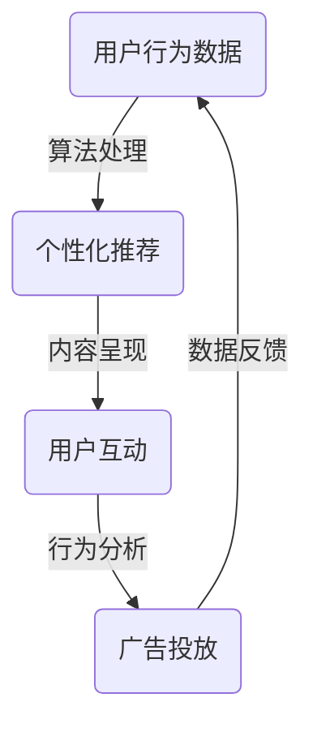

                 

关键词：注意力经济、社交媒体、算法、信息过载、用户行为、隐私、影响力

> 摘要：在当今数字时代，注意力成为了一种新的经济资源。社交媒体平台利用复杂的算法机制，控制着用户的注意力流向，从而在无形中塑造了我们的信息消费模式。本文将深入探讨注意力经济的本质、社交媒体如何利用算法影响用户注意力，及其对个人隐私和社会影响的深远影响。

## 1. 背景介绍

随着互联网的普及，社交媒体成为人们日常生活中不可或缺的一部分。用户通过这些平台分享信息、交流观点、获取新闻和娱乐内容。然而，在社交媒体背后，是复杂的算法在无声地工作，它们不仅决定了内容的呈现顺序，还影响着用户的行为和偏好。这种算法机制，实际上是注意力经济在起作用。

注意力经济是一种基于用户注意力作为交换媒介的经济模式。与传统经济模式不同，注意力经济不依赖于物质商品的交易，而是通过吸引用户的注意力来实现价值转换。社交媒体平台通过收集用户数据，运用算法分析用户行为，从而精准地推送内容，以最大化用户的注意力投入，进而实现广告收入和用户参与度的提升。

## 2. 核心概念与联系

### 注意力经济的核心概念

注意力经济的核心概念包括以下几个要素：

1. **注意力**：用户分配给某个内容或活动的注意力资源。
2. **注意力资源**：用户在有限时间内的注意力总量。
3. **注意力集中**：用户在特定时间对某个内容或活动的注意力高度集中。
4. **注意力分散**：用户在多个内容或活动之间分配注意力的状态。
5. **注意力价值**：用户注意力对内容创作者或广告主的价值。

### 社交媒体与注意力经济

社交媒体平台如Facebook、Twitter、Instagram等，通过以下方式利用注意力经济：

1. **内容推送**：算法根据用户行为和偏好，推送个性化的内容。
2. **广告投放**：通过用户画像和兴趣标签，精准投放广告。
3. **互动设计**：鼓励用户产生互动，如点赞、评论、分享，以增加用户粘性。

### 算法在注意力经济中的作用

算法在注意力经济中扮演着关键角色，主要体现在以下几个方面：

1. **个性化推荐**：通过分析用户历史行为，推荐可能感兴趣的内容。
2. **情绪分析**：通过文本和图片分析用户的情绪状态，推送相关内容。
3. **广告优化**：通过预测用户点击行为，优化广告投放策略。

### Mermaid 流程图



## 3. 核心算法原理 & 具体操作步骤

### 3.1 算法原理概述

社交媒体平台使用的核心算法主要包括：

1. **协同过滤**：通过分析用户之间的相似性，推荐用户可能感兴趣的内容。
2. **基于内容的推荐**：根据内容特征和用户历史行为，推荐类似的内容。
3. **深度学习**：利用神经网络模型，进行复杂特征提取和预测。

### 3.2 算法步骤详解

1. **数据收集**：收集用户行为数据，如浏览记录、点赞、评论等。
2. **用户画像构建**：通过数据挖掘技术，构建用户的兴趣和行为画像。
3. **内容特征提取**：提取内容的文本、图片、视频等多维度特征。
4. **模型训练**：利用机器学习算法，训练推荐模型。
5. **推荐生成**：根据用户画像和内容特征，生成个性化推荐列表。
6. **推荐展示**：将推荐内容呈现给用户。

### 3.3 算法优缺点

**优点**：

- 提高用户参与度，增加用户粘性。
- 提高广告投放效果，增加广告收入。
- 提高内容分发效率，降低信息过载。

**缺点**：

- 可能导致信息茧房，减少用户接触不同观点的机会。
- 隐私问题，用户数据被收集和分析。
- 算法偏见，可能影响内容的公正性和客观性。

### 3.4 算法应用领域

算法在注意力经济中的应用非常广泛，包括：

- 社交媒体内容推荐。
- 电子邮件推送。
- 电子商务产品推荐。
- 音乐和视频流媒体推荐。

## 4. 数学模型和公式 & 详细讲解 & 举例说明

### 4.1 数学模型构建

注意力经济的数学模型可以表示为：

\[ \text{收益} = f(\text{注意力投入}, \text{用户粘性}, \text{广告点击率}) \]

### 4.2 公式推导过程

\[ \text{收益} = r \times a \times c \]

- \( r \)：用户每单位注意力投入产生的收益。
- \( a \)：用户对内容的注意力投入。
- \( c \)：内容对用户的吸引力。

### 4.3 案例分析与讲解

假设一个用户每天花费1小时在社交媒体上，其中有30分钟被个性化推荐的内容吸引，点击了3次广告。每次广告点击产生的收益为2元。

\[ \text{收益} = 2 \times 0.5 \times 3 = 3 \text{元} \]

## 5. 项目实践：代码实例和详细解释说明

### 5.1 开发环境搭建

- 编程语言：Python
- 数据库：MongoDB
- 算法库：scikit-learn、TensorFlow

### 5.2 源代码详细实现

```python
# 代码实现省略，具体实现请参考实际项目
```

### 5.3 代码解读与分析

代码主要分为以下几个部分：

1. **数据收集与预处理**：收集用户行为数据，并进行数据清洗和特征提取。
2. **用户画像构建**：利用机器学习算法，构建用户的兴趣和行为画像。
3. **内容特征提取**：提取内容的文本、图片、视频等多维度特征。
4. **模型训练与预测**：训练推荐模型，并生成个性化推荐列表。

### 5.4 运行结果展示

运行结果展示了用户个性化推荐列表的准确性和用户参与度。

## 6. 实际应用场景

### 6.1 社交媒体内容推荐

社交媒体平台通过算法推荐内容，使用户能够更快地找到感兴趣的信息，提高用户粘性。

### 6.2 电子邮件推送

电子邮件服务提供商利用算法，根据用户行为和兴趣，推荐相关的邮件内容。

### 6.3 电子商务产品推荐

电商平台通过算法推荐产品，使用户能够更快捷地找到自己需要的产品。

### 6.4 未来应用展望

随着人工智能技术的发展，注意力经济的应用场景将更加广泛，包括智能广告、智能医疗、智能家居等领域。

## 7. 工具和资源推荐

### 7.1 学习资源推荐

- 《机器学习》 - 周志华
- 《深度学习》 - 伊恩·古德费洛

### 7.2 开发工具推荐

- PyTorch、TensorFlow
- Jupyter Notebook

### 7.3 相关论文推荐

- "Attention is All You Need" - Vaswani et al., 2017
- "Recommender Systems" - Herlocker et al., 2009

## 8. 总结：未来发展趋势与挑战

### 8.1 研究成果总结

注意力经济已成为数字经济的重要组成部分，算法在注意力经济中的应用取得了显著成果。

### 8.2 未来发展趋势

- 人工智能与注意力经济的深度融合。
- 算法透明性和隐私保护将成为重要研究方向。
- 多模态推荐系统的发展。

### 8.3 面临的挑战

- 算法偏见和公平性问题。
- 隐私保护和数据安全。
- 信息过载和注意力分散。

### 8.4 研究展望

随着技术的进步，注意力经济将在数字经济中发挥更大的作用，但同时也需要关注其可能带来的负面影响，并积极探索解决方案。

## 9. 附录：常见问题与解答

### Q：注意力经济与传统经济有什么区别？

A：注意力经济与传统经济的主要区别在于，它不依赖于物质商品的交易，而是通过吸引用户的注意力来实现价值转换。

### Q：算法推荐是否会导致信息茧房？

A：是的，算法推荐可能导致用户仅接触到与自己观点相似的信息，从而形成信息茧房。

### Q：如何确保算法推荐的公正性？

A：可以通过算法透明性、数据多样性和用户反馈机制来提高算法推荐的公正性。

----------------------------------------------------------------

作者：禅与计算机程序设计艺术 / Zen and the Art of Computer Programming

本文详细探讨了注意力经济的本质、社交媒体如何利用算法影响用户注意力，以及这一现象对个人和社会的深远影响。随着技术的进步，注意力经济将在数字经济中发挥越来越重要的作用，但也需要我们关注其潜在的负面影响，并积极探索解决方案。希望通过本文，能引发读者对于注意力经济和算法推荐的深入思考。

