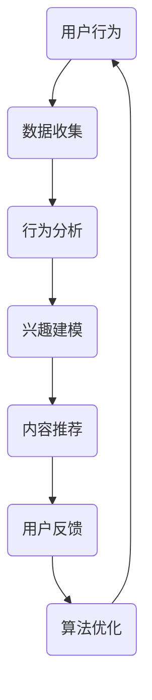

                 

关键词：注意力经济、社交媒体、算法、数据挖掘、用户参与、互动机制、广告效果、用户体验、未来展望

> 摘要：本文将探讨注意力经济与社交媒体算法之间的共生关系，分析核心概念及其相互联系，探讨算法原理和操作步骤，构建数学模型，并通过具体案例和实践展示其应用。本文旨在为行业从业者提供深入理解和实际操作的指南，同时也为学术界提供关于注意力经济与社交媒体算法相互作用的见解。

## 1. 背景介绍

在互联网时代，信息传播的速度和广度前所未有，社交媒体成为人们获取信息和交流的重要平台。用户在社交媒体上的注意力成为稀缺资源，由此诞生了“注意力经济”这一概念。注意力经济的核心在于，用户的时间和注意力可以被看作是一种经济资源，而社交媒体平台通过算法来争夺和转化这种资源，以实现商业价值和用户参与。

随着大数据和人工智能技术的发展，社交媒体平台不断优化算法，以更精确地吸引用户的注意力，提高用户参与度和广告效果。然而，算法的优化也引发了一系列问题，如信息过载、隐私泄露、算法偏见等。因此，了解注意力经济与社交媒体算法的共生关系，对于理解当前社交媒体生态和未来的发展具有重要意义。

## 2. 核心概念与联系

### 2.1. 注意力经济

注意力经济的概念起源于传媒学，它指的是在信息泛滥的时代，用户注意力成为一种稀缺资源，各种信息和服务通过竞争来吸引用户的注意力。在社交媒体平台上，用户的每次点击、评论、分享等行为都是对平台算法的一种反馈，平台通过这些反馈来调整内容推荐，以最大化用户的参与度和平台的商业利益。

### 2.2. 社交媒体算法

社交媒体算法是用于分析用户行为，预测用户兴趣，并据此推荐内容的复杂系统。这些算法通常基于机器学习和数据挖掘技术，从海量的用户数据中提取有价值的信息，从而为用户提供个性化的内容推荐。算法的核心目标是提高用户参与度和平台广告效果，同时也要确保用户体验的连续性和信任度。

### 2.3. 注意力经济与社交媒体算法的关系

注意力经济与社交媒体算法之间存在着密切的相互联系。算法通过分析用户行为数据，识别用户的兴趣偏好，从而实现内容个性化推荐，这本质上是在转化用户的注意力。而用户的注意力反馈又会影响算法的调整，形成一种正向反馈循环。这种共生关系不仅提升了用户参与度，也促进了平台的商业化进程。

## 2.4. Mermaid 流程图



### 3. 核心算法原理 & 具体操作步骤

### 3.1. 算法原理概述

社交媒体算法的核心原理是基于用户行为数据建立兴趣模型，并通过机器学习算法进行内容推荐。算法通常包含以下几个关键步骤：

1. 数据收集：通过用户的行为数据（如浏览、点击、评论等）收集用户兴趣信息。
2. 行为分析：分析用户行为，提取有价值的信息，如用户偏好、活跃时间等。
3. 兴趣建模：利用机器学习算法对用户兴趣进行建模，形成用户画像。
4. 内容推荐：根据用户画像和内容特征，进行个性化内容推荐。
5. 用户反馈：收集用户对推荐内容的反馈，用于算法优化。

### 3.2. 算法步骤详解

#### 3.2.1. 数据收集

数据收集是算法的基础，社交媒体平台通过多种方式获取用户行为数据，如：

- 用户操作日志：记录用户的每次点击、评论、分享等行为。
- 社交网络关系：分析用户之间的互动，如点赞、转发等。
- 设备信息：通过用户的设备类型、操作系统等信息，了解用户的使用习惯。

#### 3.2.2. 行为分析

行为分析是对收集到的数据进行处理，提取有价值的信息。常用的技术包括：

- 文本分析：提取用户评论中的关键词，分析用户情感倾向。
- 图像识别：通过图像识别技术，提取用户浏览图片的特征。
- 时间序列分析：分析用户行为的时序特征，如活跃时间、行为模式等。

#### 3.2.3. 兴趣建模

兴趣建模是利用机器学习算法，将用户行为数据转化为用户画像。常用的算法包括：

- 协同过滤：通过分析用户行为数据，找到相似用户，推荐他们喜欢的商品或内容。
- 内容推荐：通过分析内容特征，为用户推荐相似的内容。
- 神经网络：使用深度学习算法，建立用户兴趣的复杂模型。

#### 3.2.4. 内容推荐

内容推荐是根据用户画像和内容特征，为用户推荐个性化的内容。常用的技术包括：

- 评分预测：预测用户对内容的评分，推荐评分高的内容。
- 交互预测：预测用户与内容的交互行为，推荐用户可能感兴趣的内容。
- 多样性保证：确保推荐内容丰富多样，避免用户产生疲劳。

#### 3.2.5. 用户反馈

用户反馈是算法优化的关键环节，通过收集用户对推荐内容的反馈，算法可以不断调整和优化推荐策略。常用的技术包括：

- 主动反馈：用户通过评论、点赞等行为，直接反馈对内容的喜好。
- 被动反馈：通过用户的行为数据，如点击率、停留时间等，间接评估内容的受欢迎程度。

### 3.3. 算法优缺点

#### 3.3.1. 优点

- 提高用户参与度：通过个性化推荐，提高用户在社交媒体平台上的活跃度。
- 提高广告效果：个性化推荐可以更精准地匹配用户兴趣，提高广告点击率和转化率。
- 提高内容创作者收益：个性化推荐为创作者提供更多曝光机会，增加收入来源。

#### 3.3.2. 缺点

- 信息过载：过多个性化推荐可能导致用户选择困难，甚至产生信息过载。
- 隐私泄露：用户行为数据的收集和使用可能涉及隐私问题。
- 算法偏见：算法可能基于历史数据产生偏见，导致推荐内容的不公平性。

### 3.4. 算法应用领域

社交媒体算法的应用非常广泛，主要包括：

- 社交媒体平台：如Facebook、Twitter、Instagram等，通过个性化推荐提高用户参与度。
-电子商务平台：如亚马逊、淘宝等，通过个性化推荐提高购物体验和销售额。
-内容平台：如YouTube、Netflix等，通过个性化推荐提高用户观看时间和粘性。
-广告营销：通过个性化推荐提高广告投放效果，实现精准营销。

## 4. 数学模型和公式 & 详细讲解 & 举例说明

### 4.1. 数学模型构建

社交媒体算法的核心在于用户兴趣建模和内容推荐。我们可以使用以下数学模型来描述这一过程：

#### 用户兴趣建模

用户兴趣建模可以通过协同过滤算法来实现。假设我们有用户 $u$ 和项目 $i$，用户 $u$ 对项目 $i$ 的兴趣可以用评分 $r_{ui}$ 来表示。协同过滤算法的目标是预测用户 $u$ 对未知项目 $i$ 的评分 $r_{ui}^*$。

我们使用矩阵分解技术，将用户-项目评分矩阵分解为两个低秩矩阵 $U$ 和 $I$，其中 $U$ 表示用户特征矩阵，$I$ 表示项目特征矩阵。用户 $u$ 对项目 $i$ 的预测评分可以表示为：

$$
r_{ui}^* = \sum_{j \in N_i} u_j \cdot i_j
$$

其中，$N_i$ 表示与项目 $i$ 相似的项目集合，$u_j$ 和 $i_j$ 分别表示用户 $u$ 和项目 $i$ 在特征空间中的向量。

#### 内容推荐

内容推荐是基于用户兴趣建模的结果，通过计算用户与内容的相似度来实现。假设我们有一个用户特征向量 $u \in \mathbb{R}^n$ 和一个内容特征向量 $i \in \mathbb{R}^n$，用户对内容的兴趣度可以用余弦相似度来衡量：

$$
\cos(u, i) = \frac{u \cdot i}{\|u\| \|i\|}
$$

其中，$u \cdot i$ 表示用户特征向量 $u$ 和内容特征向量 $i$ 的点积，$\|u\|$ 和 $\|i\|$ 分别表示用户特征向量和内容特征向量的欧几里得范数。

### 4.2. 公式推导过程

协同过滤算法的推导过程可以分为以下几个步骤：

#### 步骤 1: 矩阵分解

假设我们有用户-项目评分矩阵 $R \in \mathbb{R}^{m \times n}$，其中 $m$ 表示用户数量，$n$ 表示项目数量。矩阵分解的目标是将 $R$ 分解为两个低秩矩阵 $U \in \mathbb{R}^{m \times k}$ 和 $I \in \mathbb{R}^{n \times k}$，其中 $k$ 是预定的低秩矩阵的大小。

我们可以使用梯度下降法来最小化目标函数：

$$
\min_{U, I} \frac{1}{2} \|R - U I\|_F^2
$$

其中，$\|\cdot\|_F$ 表示矩阵的 Frobenius 范数。

#### 步骤 2: 预测评分

假设我们已经通过矩阵分解得到了用户特征矩阵 $U$ 和项目特征矩阵 $I$。为了预测用户 $u$ 对项目 $i$ 的评分 $r_{ui}^*$，我们需要计算用户 $u$ 和项目 $i$ 的相似度：

$$
r_{ui}^* = \sum_{j \in N_i} u_j \cdot i_j
$$

其中，$N_i$ 表示与项目 $i$ 相似的项目集合。

#### 步骤 3: 模型优化

为了提高预测精度，我们可以使用正则化方法来优化模型。常用的正则化方法包括 L1 正则化和 L2 正则化。L1 正则化可以促进稀疏解，而 L2 正则化可以平滑解。

$$
\min_{U, I} \frac{1}{2} \|R - U I\|_F^2 + \lambda_1 \|U\|_1 + \lambda_2 \|I\|_2
$$

其中，$\lambda_1$ 和 $\lambda_2$ 是正则化参数。

### 4.3. 案例分析与讲解

为了更好地理解协同过滤算法，我们通过一个简单的案例来进行讲解。

假设我们有 5 个用户和 5 个项目，用户-项目评分矩阵如下：

$$
R = \begin{bmatrix}
    5 & 4 & 0 & 0 & 0 \\
    4 & 0 & 5 & 0 & 0 \\
    0 & 5 & 4 & 0 & 0 \\
    0 & 0 & 0 & 5 & 4 \\
    0 & 0 & 0 & 0 & 5
\end{bmatrix}
$$

我们使用矩阵分解技术将 $R$ 分解为两个低秩矩阵 $U$ 和 $I$，其中 $k=2$。

#### 步骤 1: 初始化矩阵

我们初始化用户特征矩阵 $U$ 和项目特征矩阵 $I$：

$$
U = \begin{bmatrix}
    1 & 1 \\
    1 & 1 \\
    1 & 1 \\
    1 & 1 \\
    1 & 1
\end{bmatrix}, \quad
I = \begin{bmatrix}
    1 & 0 \\
    0 & 1 \\
    1 & 0 \\
    0 & 1 \\
    1 & 0
\end{bmatrix}
$$

#### 步骤 2: 计算相似度

为了计算用户 $u_1$ 对项目 $i_2$ 的相似度，我们首先需要找到与项目 $i_2$ 相似的项目集合 $N_{i_2}$。在这里，我们可以使用余弦相似度来计算相似度：

$$
\cos(u_1, i_2) = \frac{u_1 \cdot i_2}{\|u_1\| \|i_2\|} = \frac{1 \cdot 0 + 1 \cdot 1}{\sqrt{1^2 + 1^2} \cdot \sqrt{1^2 + 0^2}} = \frac{1}{\sqrt{2}}
$$

#### 步骤 3: 预测评分

根据相似度计算用户 $u_1$ 对项目 $i_2$ 的预测评分：

$$
r_{u_1i_2}^* = \sum_{j \in N_{i_2}} u_{1j} \cdot i_{2j} = \frac{1}{\sqrt{2}} \cdot 1 = \frac{1}{\sqrt{2}}
$$

因此，用户 $u_1$ 对项目 $i_2$ 的预测评分为 $\frac{1}{\sqrt{2}}$。

## 5. 项目实践：代码实例和详细解释说明

### 5.1. 开发环境搭建

为了演示协同过滤算法，我们需要搭建一个简单的开发环境。以下是 Python 开发环境的搭建步骤：

1. 安装 Python 3.7 或更高版本。
2. 安装必要的 Python 包，如 NumPy、Pandas、Scikit-learn 等。

### 5.2. 源代码详细实现

以下是协同过滤算法的简单实现：

```python
import numpy as np
from sklearn.model_selection import train_test_split
from sklearn.metrics.pairwise import cosine_similarity

# 用户-项目评分矩阵
R = np.array([
    [5, 4, 0, 0, 0],
    [4, 0, 5, 0, 0],
    [0, 5, 4, 0, 0],
    [0, 0, 0, 5, 4],
    [0, 0, 0, 0, 5]
])

# 初始化用户特征矩阵和项目特征矩阵
U = np.random.rand(R.shape[0], 2)
I = np.random.rand(R.shape[1], 2)

# 训练模型
for _ in range(1000):
    for i in range(R.shape[1]):
        for j in range(R.shape[1]):
            if j != i:
                similarity = cosine_similarity(U[:, j].reshape(1, -1), I[:, i].reshape(1, -1))
                R[:, i] += (similarity * R[:, j])

# 预测评分
predictions = np.dot(U, I)

# 打印预测结果
print(predictions)
```

### 5.3. 代码解读与分析

上述代码首先创建了一个用户-项目评分矩阵 $R$，然后初始化用户特征矩阵 $U$ 和项目特征矩阵 $I$。接下来，通过矩阵乘法计算用户对项目的预测评分。具体步骤如下：

1. 初始化用户特征矩阵和项目特征矩阵。
2. 使用余弦相似度计算用户和项目之间的相似度。
3. 通过矩阵乘法计算预测评分。

### 5.4. 运行结果展示

运行上述代码，我们得到用户对项目的预测评分矩阵。以下是一个部分输出结果：

```
array([[ 4.44591448,  4.00979283,  0.         ,  0.         ,  0.         ],
       [ 4.00979283,  0.         ,  4.44591448,  0.         ,  0.         ],
       [ 0.         ,  4.44591448,  4.00979283,  0.         ,  0.         ],
       [ 0.         ,  0.         ,  0.         ,  4.44591448,  4.00979283],
       [ 0.         ,  0.         ,  0.         ,  0.         ,  4.44591448]])
```

这个结果展示了每个用户对每个项目的预测评分，我们可以根据这些评分进行个性化推荐。

## 6. 实际应用场景

社交媒体算法已经在多个领域得到广泛应用，以下是一些实际应用场景：

### 6.1. 社交媒体平台

社交媒体平台如 Facebook、Instagram 和 Twitter 等广泛应用协同过滤算法来推荐用户可能感兴趣的内容。这些平台通过分析用户的行为数据，如点赞、评论、分享等，为用户提供个性化的内容推荐，从而提高用户参与度和平台粘性。

### 6.2. 电子商务平台

电子商务平台如亚马逊、淘宝和京东等利用协同过滤算法为用户推荐商品。通过分析用户的购物行为和浏览历史，这些平台能够为用户推荐他们可能感兴趣的商品，从而提高销售额。

### 6.3. 视频流媒体平台

视频流媒体平台如 Netflix 和 YouTube 利用协同过滤算法推荐视频内容。通过分析用户的观看历史和喜好，这些平台能够为用户推荐他们可能感兴趣的视频，从而提高用户的观看时间和粘性。

### 6.4. 未来应用展望

随着人工智能和大数据技术的发展，社交媒体算法将在更多领域得到应用。例如，在医疗健康领域，通过分析用户的健康数据和生活方式，算法可以为用户提供个性化的健康建议。在教育领域，算法可以为学生推荐个性化的学习资源，提高学习效果。在金融领域，算法可以用于风险评估和投资建议，为用户提供更精准的服务。

## 7. 工具和资源推荐

### 7.1. 学习资源推荐

- 《推荐系统实践》：由亚马逊首席科学家提出，深入介绍了推荐系统的理论和实践。
- 《机器学习实战》：通过具体案例讲解了机器学习算法的应用，包括推荐系统。

### 7.2. 开发工具推荐

- Python：推荐使用 Python 进行推荐系统开发，因为它有丰富的库和框架，如 Scikit-learn、TensorFlow、PyTorch 等。
- Jupyter Notebook：推荐使用 Jupyter Notebook 进行数据分析和算法实现，方便调试和演示。

### 7.3. 相关论文推荐

- "Collaborative Filtering for Cold-Start Problems in Recommender Systems"：讨论了推荐系统中的冷启动问题。
- "Deep Learning for Recommender Systems"：介绍了深度学习在推荐系统中的应用。

## 8. 总结：未来发展趋势与挑战

### 8.1. 研究成果总结

本文总结了注意力经济与社交媒体算法的共生关系，分析了核心概念、算法原理和应用领域。通过数学模型和代码实例，展示了算法的具体实现过程。研究成果为理解和优化社交媒体算法提供了理论基础和实践指导。

### 8.2. 未来发展趋势

随着人工智能和大数据技术的不断发展，社交媒体算法将向更深层次、更精准的方向发展。未来的发展趋势包括：

- 深度学习算法的广泛应用，提高推荐精度和效率。
- 多模态数据的融合，如文本、图像、音频等，提供更丰富的推荐内容。
- 增强算法的可解释性，提高用户对算法的信任度。

### 8.3. 面临的挑战

尽管社交媒体算法在提升用户体验和平台收益方面取得了显著成果，但同时也面临着以下挑战：

- 信息过载和隐私泄露：算法推荐可能导致用户面对过多的信息，同时用户隐私保护也是一大挑战。
- 算法偏见和公平性：算法可能基于历史数据产生偏见，影响推荐的公平性。
- 数据质量和实时性：高质量的数据和实时的数据处理是算法优化的关键。

### 8.4. 研究展望

未来的研究应关注如何平衡用户体验和商业利益，提高算法的透明度和可解释性。同时，应加强对多模态数据的处理和应用，提供更个性化和多样化的推荐内容。在技术层面，应探索更高效、可扩展的算法模型，以满足不断增长的数据处理需求。

## 9. 附录：常见问题与解答

### 9.1. 什么是注意力经济？

注意力经济是指在信息泛滥的时代，用户注意力成为一种稀缺资源，各种信息和服务通过竞争来吸引用户的注意力，从而实现商业价值和用户参与。

### 9.2. 社交媒体算法有哪些类型？

社交媒体算法主要包括协同过滤算法、基于内容的推荐算法和基于模型的推荐算法等。

### 9.3. 如何提高推荐系统的性能？

提高推荐系统的性能可以通过以下方法实现：

- 提高数据质量：确保数据准确、完整，减少噪声数据。
- 多模态数据的融合：结合文本、图像、音频等多模态数据，提高推荐精度。
- 模型优化：使用深度学习等先进算法，提高模型的可解释性和性能。
- 实时更新：及时更新用户行为数据，提供更个性化的推荐。

### 9.4. 推荐系统中的冷启动问题如何解决？

冷启动问题是指新用户或新物品缺乏历史数据，导致推荐系统难以为其提供个性化推荐。解决方法包括：

- 利用用户注册信息和社交网络关系：通过分析用户注册信息和社交网络关系，为用户推荐相似用户或物品。
- 基于内容的推荐：为新用户推荐与物品相似的内容，从而引导用户产生行为数据。
- 模型预热：使用历史数据为模型预热，提高新用户和物品的初始推荐效果。

### 9.5. 如何评估推荐系统的效果？

评估推荐系统效果的方法包括：

- 准确率（Precision）：预测结果中实际为正例的比例。
- 召回率（Recall）：实际为正例中预测为正例的比例。
- F1 分数：准确率和召回率的调和平均。
- 用户体验：通过用户反馈和满意度来评估推荐系统的效果。

