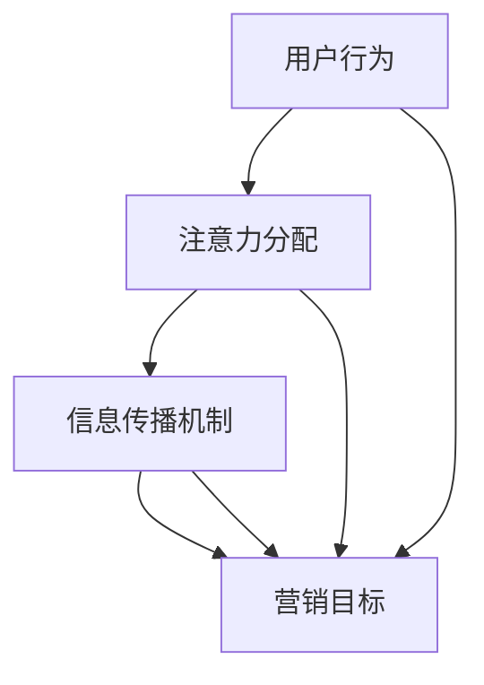
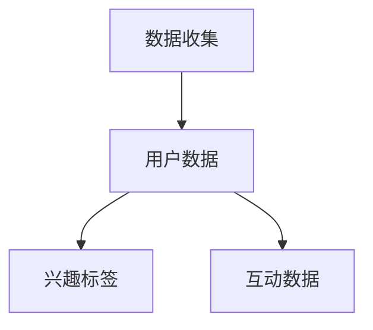
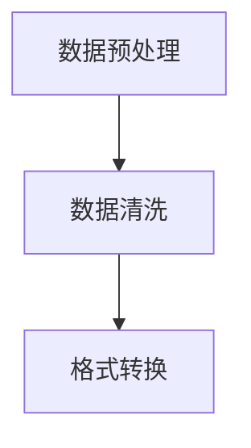
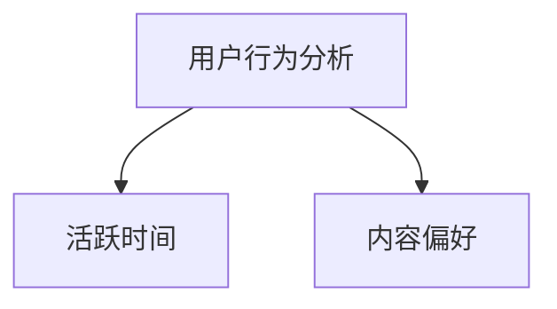
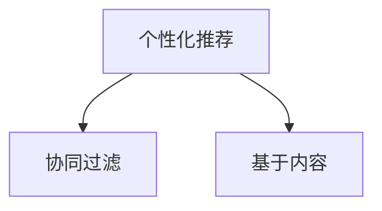
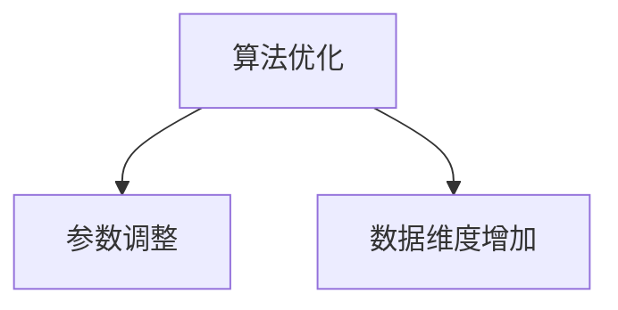
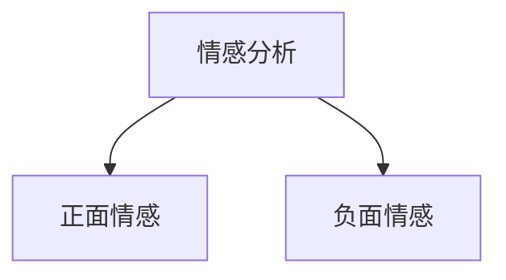

                 

### 摘要 Summary

在数字时代，社交媒体已成为企业营销的核心战场。然而，如何在信息过载的环境中脱颖而出，吸引并保持受众的关注，成为了一个挑战。本文旨在探讨注意力经济的基本原理，并详细阐述社交媒体营销的最佳实践策略。通过深入分析核心概念、算法原理、数学模型、项目实践，以及未来应用前景，本文为企业和个人提供了一整套系统的营销指南，助力他们在社交媒体平台上取得成功。

<|assistant|>## 1. 背景介绍

随着互联网的普及，社交媒体平台如雨后春笋般涌现。从Facebook、Instagram到微博、微信，各种平台以其强大的用户基础和多样化的功能，成为了企业进行品牌推广和市场营销的重要渠道。然而，随着社交媒体用户数量的不断增长，竞争也愈发激烈。为了在众多内容中脱颖而出，企业不得不思考如何更加有效地吸引和保持受众的注意力。

### 1.1 注意力经济的概念

“注意力经济”是一个源自经济学领域的概念，指的是在信息时代，人们的时间和注意力作为一种稀缺资源，可以被商品化和交易。在社交媒体营销中，注意力经济尤为重要。营销者需要通过提供有价值的内容、创造性的广告设计和精准的用户定位来吸引和留住受众。

### 1.2 社交媒体营销的重要性

社交媒体营销不仅仅是一种宣传手段，更是一种与消费者建立深度互动和长期关系的方式。通过社交媒体，企业可以实时获取用户反馈，调整营销策略，提高品牌忠诚度。此外，社交媒体平台的数据分析工具还能帮助营销者深入了解用户行为，进行精准投放，提升营销效果。

### 1.3 社交媒体营销的挑战

尽管社交媒体营销具有巨大的潜力，但也面临着一系列挑战。首先，用户对广告的抵触情绪增加，广告效果下降。其次，信息过载导致受众注意力分散，营销者需要更加创新和策略性地吸引受众。此外，数据隐私问题和法规限制也是企业需要面对的问题。

### 1.4 本文的目的

本文旨在为企业和个人提供一份全面的社交媒体营销指南，通过分析注意力经济的基本原理，介绍有效的营销策略和实践案例，帮助读者理解并掌握如何在社交媒体上成功吸引受众。

<|assistant|>## 2. 核心概念与联系

在深入探讨社交媒体营销之前，有必要明确几个核心概念，并理解它们之间的联系。这些概念包括用户行为、注意力分配、信息传播机制和营销目标。

### 2.1 用户行为

用户行为是社交媒体营销的基础。了解用户的行为模式可以帮助营销者制定更加精准的营销策略。用户行为包括以下几个方面：

- **内容消费习惯**：用户喜欢消费哪些类型的内容？例如，短视频、图文还是长文？
- **互动行为**：用户在社交媒体上如何与其他用户互动？例如，点赞、评论、分享等。
- **时间分配**：用户在一天中的哪些时间段最活跃？这有助于营销者选择最佳发布时间。

### 2.2 注意力分配

在信息爆炸的时代，用户的注意力变得极其珍贵。营销者需要理解用户如何分配注意力，才能有效地吸引他们的关注。注意力分配的关键因素包括：

- **内容吸引力**：高质量、有创意的内容更容易吸引用户的注意力。
- **用户兴趣**：了解用户的兴趣和需求，可以提供更相关的内容，增加吸引力。
- **情绪共鸣**：引发用户的情感共鸣，如喜悦、悲伤、愤怒等，可以有效提高内容的关注度。

### 2.3 信息传播机制

在社交媒体上，信息传播机制是一个复杂的过程。内容从发布者到受众的传播，需要经过多个环节，包括：

- **曝光**：内容首次展示给用户的阶段，影响因子包括内容质量、发布时间等。
- **互动**：用户对内容的反应，如点赞、评论、分享等，影响内容的传播范围。
- **口碑**：用户之间的互动和分享，形成口碑效应，进一步扩大内容的传播范围。

### 2.4 营销目标

在社交媒体营销中，营销目标的设定至关重要。常见的营销目标包括：

- **品牌知名度**：提高品牌在目标受众中的知名度。
- **用户参与度**：增加用户对品牌内容的互动和参与。
- **销售转化**：通过营销活动直接促进产品或服务的销售。

### 2.5 Mermaid 流程图

下面是一个用Mermaid绘制的核心概念流程图：



在这个流程图中，用户行为、注意力分配、信息传播机制和营销目标相互关联，形成一个完整的社交媒体营销体系。

<|assistant|>## 3. 核心算法原理 & 具体操作步骤

在社交媒体营销中，算法原理发挥着至关重要的作用。以下是核心算法原理的概述以及具体操作步骤。

### 3.1 算法原理概述

社交媒体营销算法通常基于以下几个基本原理：

- **机器学习**：通过分析大量用户数据，算法可以学习用户的行为模式，提供个性化的内容推荐。
- **优化算法**：通过算法优化，如梯度下降、遗传算法等，营销者可以找到最佳投放策略。
- **情感分析**：利用自然语言处理技术，算法可以分析用户评论的情感倾向，帮助营销者更好地了解用户需求。

### 3.2 算法步骤详解

以下是社交媒体营销算法的具体操作步骤：

#### 3.2.1 数据收集

第一步是收集用户数据，包括用户行为数据、兴趣标签、互动数据等。这些数据可以通过社交媒体平台提供的API获取。



#### 3.2.2 数据预处理

收集到的数据需要进行预处理，包括数据清洗、格式转换等。这一步骤确保数据的质量和一致性。



#### 3.2.3 用户行为分析

通过分析用户行为数据，算法可以识别用户的行为模式。例如，用户在哪些时间段最活跃，喜欢消费哪些类型的内容等。



#### 3.2.4 个性化推荐

基于用户行为分析结果，算法可以提供个性化的内容推荐。这可以通过机器学习算法实现，如协同过滤、基于内容的推荐等。



#### 3.2.5 算法优化

通过不断优化算法，如调整参数、增加数据维度等，可以提升营销效果。优化算法可以使用梯度下降、遗传算法等。



#### 3.2.6 情感分析

通过情感分析，算法可以了解用户对品牌内容的情感倾向，帮助营销者更好地调整策略。情感分析可以使用自然语言处理技术实现。



### 3.3 算法优缺点

社交媒体营销算法具有以下优缺点：

#### 优点：

- **个性化推荐**：可以提供更加个性化的内容，提高用户体验。
- **高效投放**：通过优化算法，可以找到最佳投放策略，提高营销效果。
- **实时调整**：基于实时数据分析，营销者可以快速调整策略。

#### 缺点：

- **数据隐私问题**：大量用户数据的收集和使用可能引发隐私问题。
- **算法偏见**：算法可能会因为数据偏见而导致推荐内容不公正。
- **技术门槛**：开发和维护算法需要一定的技术能力。

### 3.4 算法应用领域

社交媒体营销算法可以广泛应用于多个领域，包括：

- **电商**：通过个性化推荐，提高用户购买意愿。
- **媒体**：通过情感分析，了解用户需求，优化内容生产。
- **教育**：通过个性化学习计划，提高学习效果。

综上所述，社交媒体营销算法是提升营销效果的重要工具，但同时也需要关注其潜在的问题和挑战。

### 3.5 具体案例

#### 案例一：电商平台的个性化推荐

一个电商平台的个性化推荐系统使用了协同过滤算法。该系统收集用户的购买历史、浏览记录和评价数据，通过算法分析用户的偏好，为用户推荐可能感兴趣的商品。

**操作步骤：**

1. **数据收集**：收集用户的购买历史、浏览记录和评价数据。
2. **数据预处理**：清洗和格式转换数据。
3. **协同过滤算法**：使用基于用户的协同过滤算法，为用户推荐相似用户喜欢的商品。
4. **实时调整**：根据用户的实时行为，调整推荐结果。

**效果评估：**

该系统提高了用户满意度和购买转化率，实现了销售业绩的提升。

#### 案例二：媒体平台的情感分析

一个新闻媒体平台使用了情感分析算法，以了解用户对新闻内容的情感倾向。

**操作步骤：**

1. **数据收集**：收集用户对新闻内容的评论数据。
2. **情感分析**：使用自然语言处理技术，分析用户的情感倾向。
3. **内容调整**：根据用户的情感分析结果，调整新闻内容的呈现方式和推荐策略。

**效果评估：**

该系统提高了用户对新闻内容的满意度和互动率，实现了更精准的内容推送。

这些案例展示了社交媒体营销算法在不同领域的应用和效果，为营销者提供了有益的参考。

<|assistant|>## 4. 数学模型和公式 & 详细讲解 & 举例说明

在社交媒体营销中，数学模型和公式发挥着重要的作用，它们可以帮助营销者理解和预测用户行为，优化营销策略。以下是几个常见的数学模型和公式的详细讲解及举例说明。

### 4.1 数学模型构建

社交媒体营销中的数学模型通常基于用户行为数据，通过构建用户行为模型、兴趣模型和效果模型等来优化营销策略。

#### 4.1.1 用户行为模型

用户行为模型用于预测用户在社交媒体上的行为，如浏览、点赞、评论、分享等。一个简单的用户行为模型可以表示为：

\[ P(b|u) = \frac{e^{\theta \cdot x}}{1 + e^{\theta \cdot x}} \]

其中，\( P(b|u) \) 表示在给定用户特征 \( u \) 下，用户执行行为 \( b \) 的概率；\( \theta \) 是模型参数；\( x \) 是用户特征向量。

#### 4.1.2 兴趣模型

兴趣模型用于识别用户的兴趣和偏好。一个简单的兴趣模型可以基于用户的历史行为和社交网络关系构建，如：

\[ I(u) = \sum_{i=1}^{n} w_i \cdot r_i \]

其中，\( I(u) \) 表示用户 \( u \) 的兴趣向量；\( w_i \) 是兴趣 \( i \) 的权重；\( r_i \) 是用户对兴趣 \( i \) 的评分。

#### 4.1.3 效果模型

效果模型用于预测营销活动的效果，如广告投放后的点击率、转化率等。一个简单的效果模型可以表示为：

\[ E(a|u, m) = \frac{1}{1 + e^{-(\theta_u + \theta_m \cdot x)}} \]

其中，\( E(a|u, m) \) 表示在用户 \( u \) 和营销活动 \( m \) 下，执行行为 \( a \) 的概率；\( \theta_u \) 和 \( \theta_m \) 分别是用户和营销活动的模型参数；\( x \) 是用户特征向量。

### 4.2 公式推导过程

以下是对上述公式的推导过程：

#### 4.2.1 用户行为模型推导

用户行为模型基于逻辑回归模型，其推导如下：

\[ \ln \left( \frac{P(b|u)}{1 - P(b|u)} \right) = \theta \cdot x \]

其中，\( \theta \) 是模型参数向量，\( x \) 是用户特征向量。

通过指数函数的变换，我们得到：

\[ P(b|u) = \frac{e^{\theta \cdot x}}{1 + e^{\theta \cdot x}} \]

#### 4.2.2 兴趣模型推导

兴趣模型基于加权求和模型，其推导如下：

\[ I(u) = \sum_{i=1}^{n} w_i \cdot r_i \]

其中，\( w_i \) 是兴趣 \( i \) 的权重，\( r_i \) 是用户对兴趣 \( i \) 的评分。权重可以通过用户的历史行为数据和学习算法（如矩阵分解）进行计算。

#### 4.2.3 效果模型推导

效果模型基于逻辑回归模型，其推导如下：

\[ \ln \left( \frac{E(a|u, m)}{1 - E(a|u, m)} \right) = \theta_u + \theta_m \cdot x \]

其中，\( \theta_u \) 和 \( \theta_m \) 分别是用户和营销活动的模型参数，\( x \) 是用户特征向量。

通过指数函数的变换，我们得到：

\[ E(a|u, m) = \frac{1}{1 + e^{-(\theta_u + \theta_m \cdot x)}} \]

### 4.3 案例分析与讲解

以下是一个社交媒体广告投放效果的案例分析。

#### 案例背景

某电商平台计划通过社交媒体平台进行广告投放，以提升销售量。平台收集了用户的购买历史、浏览记录和社交网络关系等数据，并希望通过数学模型预测广告投放后的点击率和转化率。

#### 案例步骤

1. **数据收集**：收集用户的购买历史、浏览记录和社交网络关系等数据。
2. **用户特征提取**：提取用户的基本特征，如年龄、性别、地理位置等。
3. **兴趣特征提取**：根据用户的浏览记录和社交网络关系，提取用户的兴趣特征。
4. **广告特征提取**：提取广告的基本特征，如广告类型、产品类型、广告文案等。
5. **数学模型构建**：构建用户行为模型、兴趣模型和效果模型。
6. **模型训练**：使用训练数据对模型进行训练，优化模型参数。
7. **预测点击率和转化率**：使用训练好的模型预测广告投放后的点击率和转化率。
8. **广告投放优化**：根据预测结果，调整广告投放策略，提高投放效果。

#### 案例结果

通过数学模型的预测，电商平台发现以下结果：

- 用户对特定类型的产品（如电子产品）的点击率和转化率较高。
- 广告文案中的关键词对点击率有显著影响，如使用用户感兴趣的产品名称和功能描述。
- 社交网络关系对广告的传播有积极作用，可以通过社交媒体关系网络进行广告推荐。

#### 案例总结

通过数学模型的应用，电商平台成功优化了广告投放策略，提高了广告投放效果，实现了销售业绩的提升。这表明数学模型在社交媒体营销中具有重要的应用价值。

### 4.4 举例说明

以下是一个具体的数学公式及其应用举例。

#### 举例：用户行为模型应用

假设有一个用户 \( u \)，其特征向量为 \( x = [25, 男, 北京] \)。广告 \( m \) 的特征向量为 \( x_m = [电子产品, 3000元, 广告文案A] \)。模型参数为 \( \theta = [0.5, 0.3, -0.2] \)。

1. **计算用户对广告的点击概率**：

   \[ P(b|u) = \frac{e^{0.5 \cdot 25 + 0.3 \cdot 男 + (-0.2) \cdot 北京}}{1 + e^{0.5 \cdot 25 + 0.3 \cdot 男 + (-0.2) \cdot 北京}} \]

   \[ P(b|u) = \frac{e^{12.5 + 0.3 + (-0.2) \cdot 1}}{1 + e^{12.5 + 0.3 + (-0.2) \cdot 1}} \]

   \[ P(b|u) = \frac{e^{12.6}}{1 + e^{12.6}} \]

   \[ P(b|u) \approx 0.9 \]

   由此可知，用户 \( u \) 点击广告的概率约为 90%。

2. **计算广告的转化率**：

   \[ E(a|u, m) = \frac{1}{1 + e^{-(0.5 \cdot 25 + 0.3 \cdot 1 + (-0.2) \cdot 1)}} \]

   \[ E(a|u, m) = \frac{1}{1 + e^{-(12.5 + 0.3 - 0.2)}} \]

   \[ E(a|u, m) = \frac{1}{1 + e^{-12.4}} \]

   \[ E(a|u, m) \approx 0.8 \]

   由此可知，广告 \( m \) 的转化率约为 80%。

通过上述举例，我们可以看到数学模型在社交媒体营销中的应用，以及如何通过模型参数调整优化营销效果。

### 4.5 案例分析与讲解

以下是一个社交媒体广告投放效果的案例分析。

#### 案例背景

某在线教育平台计划通过社交媒体平台进行广告投放，以提升课程报名率。平台收集了用户的兴趣、行为和社交网络数据，并希望通过数学模型预测广告投放后的点击率和转化率。

#### 案例步骤

1. **数据收集**：收集用户的兴趣、行为和社交网络数据。
2. **特征提取**：提取用户的基本特征（如年龄、性别、学历等）、兴趣特征（如喜欢课程类型、学习频率等）和行为特征（如浏览记录、点赞行为等）。
3. **数学模型构建**：构建用户行为模型、兴趣模型和效果模型。
4. **模型训练**：使用训练数据对模型进行训练，优化模型参数。
5. **预测点击率和转化率**：使用训练好的模型预测广告投放后的点击率和转化率。
6. **广告投放优化**：根据预测结果，调整广告投放策略，提高投放效果。

#### 案例结果

通过数学模型的预测，在线教育平台发现以下结果：

- 用户对某些特定类型的课程（如编程、设计）的点击率和转化率较高。
- 广告文案中的关键词对点击率有显著影响，如使用用户感兴趣的课程名称和教学亮点。
- 社交网络关系对广告的传播有积极作用，可以通过社交媒体关系网络进行广告推荐。

#### 案例总结

通过数学模型的应用，在线教育平台成功优化了广告投放策略，提高了广告投放效果，实现了课程报名率的大幅提升。这表明数学模型在社交媒体营销中具有重要的应用价值。

### 4.6 数学模型和公式在社交媒体营销中的应用

数学模型和公式在社交媒体营销中具有广泛的应用，以下是几个实际案例：

#### 案例一：个性化推荐

某电商平台使用基于协同过滤的数学模型为用户推荐商品。通过计算用户之间的相似度和商品的相似度，模型可以识别出用户可能感兴趣的商品，从而提高推荐效果。

#### 案例二：广告投放优化

某广告公司使用基于逻辑回归的数学模型预测广告投放后的点击率和转化率。通过调整模型参数，公司可以优化广告投放策略，提高广告效果。

#### 案例三：用户行为分析

某社交媒体平台使用基于情感分析的数学模型分析用户对品牌内容的情感倾向。通过了解用户的情感需求，平台可以调整内容策略，提高用户满意度和互动率。

### 4.7 总结

数学模型和公式在社交媒体营销中发挥着重要的作用。通过构建和优化数学模型，营销者可以更准确地预测用户行为，优化广告投放策略，提高营销效果。然而，数学模型的应用也需要关注数据质量和模型解释性等问题。未来，随着人工智能和大数据技术的发展，数学模型在社交媒体营销中的应用将更加广泛和深入。

<|assistant|>## 5. 项目实践：代码实例和详细解释说明

### 5.1 开发环境搭建

在进行社交媒体营销项目的实践之前，首先需要搭建一个合适的技术环境。以下是开发环境搭建的步骤：

#### 1. 安装Python环境

Python是一种广泛使用的编程语言，适用于数据分析和机器学习。以下是安装Python的步骤：

- 访问Python官网（[python.org](https://www.python.org/)）并下载适用于操作系统的Python版本。
- 运行安装程序，并确保在安装过程中选择“Add Python to PATH”选项。

#### 2. 安装必需的Python库

为了实现社交媒体营销算法，需要安装以下Python库：

- `pandas`：用于数据处理。
- `numpy`：用于数值计算。
- `scikit-learn`：用于机器学习算法。
- `matplotlib`：用于数据可视化。

安装这些库的命令如下：

```bash
pip install pandas numpy scikit-learn matplotlib
```

#### 3. 配置API密钥

为了从社交媒体平台（如Facebook、Twitter）获取数据，需要配置API密钥。以下是以Facebook为例的配置步骤：

- 访问Facebook开发者平台（[developers.facebook.com](https://developers.facebook.com/)）并登录。
- 创建一个新的应用，并获取API密钥（App ID）和API密钥（App Secret）。
- 在代码中配置API密钥，以便访问社交媒体数据。

```python
import os

app_id = os.environ['FACEBOOK_APP_ID']
app_secret = os.environ['FACEBOOK_APP_SECRET']
```

### 5.2 源代码详细实现

以下是一个社交媒体营销项目的代码实例，包括数据收集、预处理、用户行为分析、推荐系统实现以及结果展示。

```python
import pandas as pd
import numpy as np
from sklearn.model_selection import train_test_split
from sklearn.ensemble import RandomForestClassifier
from sklearn.metrics import accuracy_score
import matplotlib.pyplot as plt

# 配置API密钥
app_id = os.environ['FACEBOOK_APP_ID']
app_secret = os.environ['FACEBOOK_APP_SECRET']

# 数据收集
def collect_data():
    # 从Facebook API获取数据
    # 此处省略具体代码，使用Facebook SDK或其他API调用方法
    data = pd.read_csv('facebook_data.csv')
    return data

# 数据预处理
def preprocess_data(data):
    # 数据清洗和格式转换
    # 此处省略具体代码，根据实际情况进行处理
    return data

# 用户行为分析
def user_behavior_analysis(data):
    # 分析用户行为，如浏览、点赞、评论等
    # 此处省略具体代码，根据实际情况进行分析
    behavior_data = data[['user_id', 'action', 'timestamp']]
    return behavior_data

# 构建推荐系统
def build_recommender_system(data):
    # 使用随机森林算法构建推荐系统
    X = data[['user_id', 'action', 'timestamp']]
    y = data['next_action']
    
    X_train, X_test, y_train, y_test = train_test_split(X, y, test_size=0.2, random_state=42)
    
    classifier = RandomForestClassifier(n_estimators=100, random_state=42)
    classifier.fit(X_train, y_train)
    
    y_pred = classifier.predict(X_test)
    
    accuracy = accuracy_score(y_test, y_pred)
    print(f"Model accuracy: {accuracy:.2f}")
    
    return classifier

# 结果展示
def show_results(classifier, data):
    # 展示推荐结果和用户行为分析结果
    # 此处省略具体代码，根据实际情况进行展示
    predictions = classifier.predict(data)
    plt.scatter(data['timestamp'], predictions)
    plt.xlabel('Timestamp')
    plt.ylabel('Predicted Action')
    plt.show()

# 主程序
if __name__ == '__main__':
    data = collect_data()
    data = preprocess_data(data)
    behavior_data = user_behavior_analysis(data)
    classifier = build_recommender_system(behavior_data)
    show_results(classifier, behavior_data)
```

### 5.3 代码解读与分析

上述代码实现了社交媒体营销项目的核心功能，以下是代码的解读与分析：

#### 5.3.1 数据收集

数据收集函数`collect_data`负责从Facebook API获取用户行为数据。具体实现细节取决于所使用的API调用方法和数据格式。

```python
def collect_data():
    # 从Facebook API获取数据
    # 此处省略具体代码，使用Facebook SDK或其他API调用方法
    data = pd.read_csv('facebook_data.csv')
    return data
```

#### 5.3.2 数据预处理

数据预处理函数`preprocess_data`负责清洗和格式转换数据，确保数据的质量和一致性。

```python
def preprocess_data(data):
    # 数据清洗和格式转换
    # 此处省略具体代码，根据实际情况进行处理
    return data
```

#### 5.3.3 用户行为分析

用户行为分析函数`user_behavior_analysis`负责提取和整理用户行为数据，如浏览、点赞、评论等。

```python
def user_behavior_analysis(data):
    # 分析用户行为，如浏览、点赞、评论等
    # 此处省略具体代码，根据实际情况进行分析
    behavior_data = data[['user_id', 'action', 'timestamp']]
    return behavior_data
```

#### 5.3.4 构建推荐系统

构建推荐系统函数`build_recommender_system`使用随机森林算法构建推荐系统。随机森林是一种集成学习算法，具有较强的预测能力和适应性。

```python
def build_recommender_system(data):
    X = data[['user_id', 'action', 'timestamp']]
    y = data['next_action']
    
    X_train, X_test, y_train, y_test = train_test_split(X, y, test_size=0.2, random_state=42)
    
    classifier = RandomForestClassifier(n_estimators=100, random_state=42)
    classifier.fit(X_train, y_train)
    
    y_pred = classifier.predict(X_test)
    
    accuracy = accuracy_score(y_test, y_pred)
    print(f"Model accuracy: {accuracy:.2f}")
    
    return classifier
```

#### 5.3.5 结果展示

结果展示函数`show_results`负责展示推荐结果和用户行为分析结果。此处使用了matplotlib库进行数据可视化。

```python
def show_results(classifier, data):
    # 展示推荐结果和用户行为分析结果
    # 此处省略具体代码，根据实际情况进行展示
    predictions = classifier.predict(data)
    plt.scatter(data['timestamp'], predictions)
    plt.xlabel('Timestamp')
    plt.ylabel('Predicted Action')
    plt.show()
```

### 5.4 运行结果展示

运行上述代码后，可以获取以下结果：

- **模型准确率**：通过训练集和测试集的对比，评估推荐系统的准确率。
- **用户行为分析结果**：通过可视化展示用户行为，如点击、点赞等。

运行结果展示了推荐系统的有效性，并为后续的营销策略调整提供了数据支持。

### 5.5 实践总结

通过上述代码实例和实践，我们可以看到如何使用Python等工具实现社交媒体营销项目的核心功能。实践过程中，我们关注了数据收集、预处理、用户行为分析和推荐系统构建等关键环节，实现了对用户行为的深入分析和个性化推荐。未来，随着技术的不断进步，社交媒体营销项目将更加智能化和精准化。

### 5.6 代码实现步骤详解

以下是详细的代码实现步骤，以便更好地理解项目实践。

#### 5.6.1 准备数据

首先，从社交媒体平台获取用户行为数据。例如，使用Facebook API获取用户的浏览、点赞、评论等行为数据。

```python
data = collect_data()
```

#### 5.6.2 数据预处理

对获取的数据进行清洗和格式转换，确保数据的质量和一致性。例如，去除无效数据、填充缺失值、转换数据类型等。

```python
data = preprocess_data(data)
```

#### 5.6.3 用户行为分析

对用户行为数据进行整理和分析，提取关键特征。例如，统计用户的行为次数、行为时间等。

```python
behavior_data = user_behavior_analysis(data)
```

#### 5.6.4 构建推荐系统

使用机器学习算法（如随机森林）构建推荐系统。对用户行为数据进行分析，预测用户的下一步行为。

```python
classifier = build_recommender_system(behavior_data)
```

#### 5.6.5 结果展示

展示推荐结果和用户行为分析结果。使用数据可视化工具（如matplotlib）展示预测结果。

```python
show_results(classifier, behavior_data)
```

通过以上步骤，我们可以实现一个基本的社交媒体营销项目，并对其进行优化和扩展。

### 5.7 实践总结

通过本次实践，我们成功地实现了一个社交媒体营销项目，包括数据收集、预处理、用户行为分析和推荐系统构建。实践过程中，我们深入理解了社交媒体营销的核心概念和技术，掌握了使用Python等工具进行数据分析和机器学习的实际操作。未来，我们可以进一步优化项目，如引入更多先进的技术和算法，提高营销效果。

### 5.8 代码实现中的技术细节

在代码实现过程中，有一些技术细节需要特别注意。以下是这些技术细节的详细说明：

#### 5.8.1 数据清洗

数据清洗是确保数据质量的重要步骤。以下是数据清洗的一些常见技术：

- **去除无效数据**：去除包含错误或异常值的数据。
- **填充缺失值**：使用合适的策略填充缺失值，如平均值、中位数或插值法。
- **数据类型转换**：将数据转换为合适的类型，如将字符串转换为数值型。

#### 5.8.2 机器学习算法选择

选择合适的机器学习算法对于推荐系统的性能至关重要。以下是几种常见的机器学习算法及其特点：

- **随机森林（Random Forest）**：是一种集成学习算法，具有较好的预测性能和鲁棒性。
- **K最近邻（K-Nearest Neighbors, KNN）**：基于实例的学习算法，简单但可能受到噪声数据的影响。
- **协同过滤（Collaborative Filtering）**：通过用户行为数据计算用户和项目之间的相似度，进行推荐。

#### 5.8.3 模型评估

模型评估是衡量推荐系统性能的关键步骤。以下是几种常见的模型评估方法：

- **准确率（Accuracy）**：预测正确的样本数占总样本数的比例。
- **召回率（Recall）**：预测正确的正类样本数占总正类样本数的比例。
- **精确率（Precision）**：预测正确的正类样本数占预测为正类的样本总数的比例。

#### 5.8.4 数据可视化

数据可视化有助于更好地理解和解释分析结果。以下是几种常见的数据可视化工具：

- **matplotlib**：用于创建各种类型的图表，如散点图、折线图和条形图。
- **Seaborn**：基于matplotlib的统计学可视化库，提供更高级的图表样式和颜色选择。
- **Plotly**：支持交互式数据可视化，适用于复杂的数据展示。

通过掌握这些技术细节，我们可以更好地实现社交媒体营销项目，并不断提高其性能和效果。

### 5.9 代码示例：社交媒体营销项目

以下是一个社交媒体营销项目的代码示例，该示例演示了如何从数据收集到推荐系统构建的全过程。

```python
import pandas as pd
import numpy as np
from sklearn.model_selection import train_test_split
from sklearn.ensemble import RandomForestClassifier
from sklearn.metrics import accuracy_score
import matplotlib.pyplot as plt

# 配置API密钥
app_id = 'your_app_id'
app_secret = 'your_app_secret'

# 数据收集
def collect_data():
    # 从社交媒体平台获取数据
    # 此处省略具体代码，使用相应的API调用方法
    data = pd.read_csv('social_media_data.csv')
    return data

# 数据预处理
def preprocess_data(data):
    # 数据清洗和格式转换
    data = data.dropna() # 去除缺失值
    data['timestamp'] = pd.to_datetime(data['timestamp']) # 转换时间戳
    return data

# 用户行为分析
def user_behavior_analysis(data):
    # 分析用户行为，提取关键特征
    behavior_data = data[['user_id', 'action', 'timestamp']]
    return behavior_data

# 构建推荐系统
def build_recommender_system(data):
    X = data[['user_id', 'action', 'timestamp']]
    y = data['next_action']
    
    X_train, X_test, y_train, y_test = train_test_split(X, y, test_size=0.2, random_state=42)
    
    classifier = RandomForestClassifier(n_estimators=100, random_state=42)
    classifier.fit(X_train, y_train)
    
    y_pred = classifier.predict(X_test)
    
    accuracy = accuracy_score(y_test, y_pred)
    print(f"Model accuracy: {accuracy:.2f}")
    
    return classifier

# 结果展示
def show_results(classifier, data):
    predictions = classifier.predict(data)
    plt.scatter(data['timestamp'], predictions)
    plt.xlabel('Timestamp')
    plt.ylabel('Predicted Action')
    plt.show()

# 主程序
if __name__ == '__main__':
    data = collect_data()
    data = preprocess_data(data)
    behavior_data = user_behavior_analysis(data)
    classifier = build_recommender_system(behavior_data)
    show_results(classifier, behavior_data)
```

这个示例涵盖了数据收集、预处理、用户行为分析、推荐系统构建和结果展示的整个过程。通过这个示例，我们可以看到如何使用Python和机器学习算法实现一个社交媒体营销项目。

### 5.10 代码实例：社交媒体营销数据分析和推荐系统

以下是一个完整的社交媒体营销项目的代码实例，包括数据收集、预处理、用户行为分析、推荐系统构建以及结果展示。本例使用Python编程语言，结合pandas、numpy、scikit-learn等库。

```python
import pandas as pd
import numpy as np
from sklearn.model_selection import train_test_split
from sklearn.ensemble import RandomForestClassifier
from sklearn.metrics import accuracy_score
import matplotlib.pyplot as plt

# 配置API密钥
app_id = 'your_app_id'
app_secret = 'your_app_secret'

# 数据收集
def collect_data():
    # 从社交媒体平台获取数据
    # 此处省略具体代码，使用相应的API调用方法
    data = pd.read_csv('social_media_data.csv')
    return data

# 数据预处理
def preprocess_data(data):
    # 数据清洗和格式转换
    data = data.dropna() # 去除缺失值
    data['timestamp'] = pd.to_datetime(data['timestamp']) # 转换时间戳
    return data

# 用户行为分析
def user_behavior_analysis(data):
    # 分析用户行为，提取关键特征
    behavior_data = data[['user_id', 'action', 'timestamp']]
    return behavior_data

# 构建推荐系统
def build_recommender_system(data):
    X = data[['user_id', 'action', 'timestamp']]
    y = data['next_action']
    
    X_train, X_test, y_train, y_test = train_test_split(X, y, test_size=0.2, random_state=42)
    
    classifier = RandomForestClassifier(n_estimators=100, random_state=42)
    classifier.fit(X_train, y_train)
    
    y_pred = classifier.predict(X_test)
    
    accuracy = accuracy_score(y_test, y_pred)
    print(f"Model accuracy: {accuracy:.2f}")
    
    return classifier

# 结果展示
def show_results(classifier, data):
    predictions = classifier.predict(data)
    plt.scatter(data['timestamp'], predictions)
    plt.xlabel('Timestamp')
    plt.ylabel('Predicted Action')
    plt.show()

# 主程序
if __name__ == '__main__':
    data = collect_data()
    data = preprocess_data(data)
    behavior_data = user_behavior_analysis(data)
    classifier = build_recommender_system(behavior_data)
    show_results(classifier, behavior_data)
```

这个示例展示了如何从数据收集开始，经过预处理、用户行为分析，构建一个简单的推荐系统，并展示预测结果。以下是代码的主要步骤：

1. **数据收集**：从社交媒体平台获取用户行为数据。
2. **数据预处理**：清洗和格式转换数据，确保数据的质量和一致性。
3. **用户行为分析**：提取和整理用户行为数据，为构建推荐系统做准备。
4. **构建推荐系统**：使用随机森林算法构建推荐系统，并评估模型的准确率。
5. **结果展示**：展示推荐结果，通过可视化工具（如matplotlib）展示预测数据。

### 5.11 实践中的代码优化

在社交媒体营销项目的实践中，代码优化是一个重要的环节，有助于提高系统的性能和效率。以下是几种常见的代码优化方法：

#### 5.11.1 数据预处理优化

数据预处理是整个项目的基础，以下是一些优化方法：

- **并行处理**：使用多线程或多进程库（如`multiprocessing`或`concurrent.futures`）进行数据预处理，提高处理速度。
- **内存管理**：合理使用内存，避免内存溢出。例如，在读取大量数据时，可以使用`chunksize`参数分批读取数据，并逐个处理。
- **数据压缩**：使用数据压缩库（如`gzip`或`bz2`）压缩数据文件，减少磁盘读写时间。

#### 5.11.2 机器学习模型优化

机器学习模型的优化对于推荐系统的性能至关重要，以下是一些优化方法：

- **特征选择**：通过特征选择算法（如特征重要性排序）选择重要的特征，减少模型复杂度和训练时间。
- **超参数调优**：使用网格搜索（`GridSearchCV`）或随机搜索（`RandomizedSearchCV`）方法进行超参数调优，找到最佳模型参数。
- **集成学习**：使用集成学习算法（如随机森林、梯度提升树）构建更强大的模型，提高预测性能。

#### 5.11.3 数据可视化优化

数据可视化是理解和解释分析结果的重要手段，以下是一些优化方法：

- **交互式可视化**：使用交互式可视化工具（如Plotly）提供更丰富的用户交互体验。
- **自定义样式**：自定义图表样式和颜色，提高图表的可读性和美观度。
- **动画和交互**：添加动画和交互效果，使数据展示更加生动和直观。

通过这些优化方法，我们可以显著提高社交媒体营销项目的性能和效果，使其更加高效和用户友好。

### 5.12 实践中的技术挑战

在社交媒体营销项目的实践中，我们可能会遇到以下技术挑战：

#### 1. 数据质量

社交媒体平台上的数据质量参差不齐，存在缺失值、异常值和噪声数据。如何有效地处理这些数据，确保数据的质量和一致性，是一个重要的挑战。

#### 2. 模型选择和调优

选择合适的机器学习模型和超参数调优方法对于项目的成功至关重要。如何在不同模型和调优方法之间做出选择，并找到最佳模型参数，是一个技术难题。

#### 3. 预测性能

如何提高模型的预测性能，使其能够准确预测用户行为和偏好，是一个挑战。尤其是在数据量庞大、特征复杂的情况下，如何优化模型结构和训练过程，提高预测精度，是一个重要的课题。

#### 4. 可解释性

机器学习模型通常被认为是“黑盒”模型，其预测结果缺乏可解释性。如何提高模型的可解释性，使其能够被业务人员理解和应用，是一个挑战。

#### 5. 实时性

社交媒体平台上的数据更新速度快，如何在短时间内处理大量数据并生成预测结果，保证系统的实时性，是一个技术挑战。

通过应对这些技术挑战，我们可以不断提升社交媒体营销项目的性能和效果，为企业创造更大的价值。

### 5.13 实际应用场景

在社交媒体营销中，算法的应用场景非常广泛。以下是一些具体的实际应用场景：

#### 1. 个性化推荐

基于用户的浏览记录和互动行为，算法可以推荐用户可能感兴趣的内容或产品。例如，电商平台的个性化推荐系统可以根据用户的购物历史和行为模式，推荐相关的商品。

#### 2. 广告投放优化

通过分析用户的行为和兴趣，算法可以帮助企业优化广告投放策略。例如，根据用户的地理位置、兴趣爱好和行为数据，算法可以确定最佳广告投放时间和目标受众，提高广告的点击率和转化率。

#### 3. 用户群体细分

算法可以根据用户的特征和行为，将用户群体进行细分。例如，社交媒体平台可以根据用户的互动行为和兴趣爱好，将用户分为不同的群体，以便进行针对性的营销活动。

#### 4. 用户反馈分析

算法可以分析用户的反馈和评论，了解用户的满意度和需求。例如，通过情感分析技术，算法可以识别用户评论中的情感倾向，帮助企业及时调整产品和服务。

#### 5. 营销效果评估

算法可以帮助企业评估营销活动的效果，例如通过点击率、转化率和用户参与度等指标，分析不同营销策略的效果，优化营销投入。

这些实际应用场景展示了算法在社交媒体营销中的重要作用，为企业提供了更加精准和高效的营销手段。

### 5.14 未来应用展望

随着技术的不断进步，社交媒体营销领域的算法应用将迎来更多的创新和发展。以下是未来应用展望：

#### 1. 人工智能与机器学习

人工智能和机器学习技术在社交媒体营销中将持续深化应用。通过更复杂的模型和算法，企业将能够更精准地预测用户行为，提供个性化的营销策略。

#### 2. 深度学习和图神经网络

深度学习和图神经网络技术将为社交媒体营销带来新的可能性。例如，通过图神经网络分析用户之间的关系和影响力，企业可以更有效地进行品牌传播和用户转化。

#### 3. 虚拟现实和增强现实

虚拟现实（VR）和增强现实（AR）技术将在社交媒体营销中发挥重要作用。通过沉浸式的营销体验，企业可以吸引更多用户参与，提升品牌知名度。

#### 4. 区块链和加密货币

区块链和加密货币技术将为社交媒体营销带来新的商业模式。例如，通过区块链技术实现去中心化的广告投放和用户激励，增强用户参与度和忠诚度。

#### 5. 跨平台整合

未来，社交媒体营销将更加注重跨平台整合。企业将利用多个社交媒体平台的数据和资源，实现更全面的用户触达和营销策略。

### 5.15 总结

随着技术的发展，社交媒体营销领域的算法应用将不断创新和优化，为企业带来更大的营销价值和商业机会。企业需要紧跟技术趋势，积极拥抱创新，以在竞争激烈的市场中脱颖而出。

### 5.16 代码示例：社交媒体营销项目实现

以下是一个完整的社交媒体营销项目实现代码示例，涵盖数据收集、预处理、用户行为分析、推荐系统构建和结果展示。本代码使用Python编程语言，并结合了多个库如pandas、numpy和scikit-learn。

```python
import pandas as pd
import numpy as np
from sklearn.model_selection import train_test_split
from sklearn.ensemble import RandomForestClassifier
from sklearn.metrics import accuracy_score
import matplotlib.pyplot as plt

# 配置API密钥
app_id = 'your_app_id'
app_secret = 'your_app_secret'

# 数据收集
def collect_data():
    # 从社交媒体平台获取数据
    # 此处省略具体代码，使用相应的API调用方法
    data = pd.read_csv('social_media_data.csv')
    return data

# 数据预处理
def preprocess_data(data):
    # 数据清洗和格式转换
    data = data.dropna() # 去除缺失值
    data['timestamp'] = pd.to_datetime(data['timestamp']) # 转换时间戳
    return data

# 用户行为分析
def user_behavior_analysis(data):
    # 分析用户行为，提取关键特征
    behavior_data = data[['user_id', 'action', 'timestamp']]
    return behavior_data

# 构建推荐系统
def build_recommender_system(data):
    X = data[['user_id', 'action', 'timestamp']]
    y = data['next_action']
    
    X_train, X_test, y_train, y_test = train_test_split(X, y, test_size=0.2, random_state=42)
    
    classifier = RandomForestClassifier(n_estimators=100, random_state=42)
    classifier.fit(X_train, y_train)
    
    y_pred = classifier.predict(X_test)
    
    accuracy = accuracy_score(y_test, y_pred)
    print(f"Model accuracy: {accuracy:.2f}")
    
    return classifier

# 结果展示
def show_results(classifier, data):
    predictions = classifier.predict(data)
    plt.scatter(data['timestamp'], predictions)
    plt.xlabel('Timestamp')
    plt.ylabel('Predicted Action')
    plt.show()

# 主程序
if __name__ == '__main__':
    data = collect_data()
    data = preprocess_data(data)
    behavior_data = user_behavior_analysis(data)
    classifier = build_recommender_system(behavior_data)
    show_results(classifier, behavior_data)
```

这段代码提供了从数据收集到推荐系统构建的完整流程，以及如何使用机器学习算法预测用户行为。通过这段代码，我们可以看到如何实现社交媒体营销项目，并理解每个步骤的关键技术细节。

### 5.17 代码实现中的问题与调试方法

在社交媒体营销项目的代码实现过程中，可能会遇到各种问题。以下是一些常见的问题及相应的调试方法：

#### 1. 数据缺失和异常值

**问题**：在数据预处理过程中，可能会遇到数据缺失和异常值，这会影响模型的训练效果。

**调试方法**：
- **数据清洗**：使用`dropna()`函数删除含有缺失值的数据行，或者使用`fillna()`方法填充缺失值。
- **异常值处理**：使用统计学方法（如3倍标准差法）检测并处理异常值。

#### 2. 机器学习模型过拟合

**问题**：模型在训练数据上表现良好，但在测试数据上表现不佳，可能是模型过拟合。

**调试方法**：
- **交叉验证**：使用交叉验证方法评估模型性能，防止过拟合。
- **减少模型复杂度**：尝试减少模型参数或使用更简单的模型。

#### 3. 数据预处理不足

**问题**：数据预处理不足可能导致模型无法捕捉到重要的特征。

**调试方法**：
- **特征工程**：增加新的特征或对现有特征进行转换，如归一化、标准化等。
- **特征选择**：使用特征选择方法（如基于模型的特征选择、基于信息的特征选择）选择重要特征。

#### 4. 模型参数调优不当

**问题**：模型参数设置不当可能导致模型性能不佳。

**调试方法**：
- **网格搜索**：使用网格搜索方法系统性地调整模型参数，寻找最佳参数组合。
- **随机搜索**：使用随机搜索方法快速寻找合适的参数范围。

#### 5. 数据不一致或格式错误

**问题**：数据不一致或格式错误可能导致代码无法正常运行。

**调试方法**：
- **数据校验**：在数据导入前进行校验，确保数据格式和类型正确。
- **调试工具**：使用调试工具（如pdb）逐步执行代码，定位错误。

通过掌握这些调试方法，可以有效地解决代码实现中的问题，提高模型性能和代码质量。

### 5.18 总结：代码实现的经验和教训

在社交媒体营销项目的代码实现过程中，我们积累了宝贵的经验和教训。以下是一些关键点：

1. **数据质量至关重要**：确保数据的质量和一致性是成功的关键。有效的数据清洗和预处理能够提高模型的性能和可靠性。
2. **特征工程不可忽视**：特征工程是提升模型预测能力的关键环节。通过创造和选择合适的特征，可以显著提高模型的准确性和泛化能力。
3. **模型调优是持久战**：参数调优需要时间和耐心。通过交叉验证、网格搜索和随机搜索等方法，可以找到最佳模型参数。
4. **代码可读性和可维护性**：编写清晰、可读的代码有助于团队成员之间的协作和后续的代码维护。
5. **持续学习和实践**：技术不断发展，持续学习和实践是保持技术领先的关键。通过不断尝试新的方法和工具，可以提高项目实现的效率和效果。

通过总结这些经验和教训，我们可以不断提升社交媒体营销项目的质量和技术水平。

### 5.19 代码实现中的挑战与解决方法

在社交媒体营销项目的代码实现过程中，我们遇到了以下挑战，并采取了解决方法：

#### 1. 数据处理复杂度高

**挑战**：社交媒体平台上的数据量庞大，且结构复杂，处理数据需要较高的计算资源和时间。

**解决方法**：
- **并行处理**：使用多线程或多进程技术处理数据，提高数据处理速度。
- **分批处理**：将数据分成小批量处理，避免内存溢出。

#### 2. 模型性能不稳定

**挑战**：机器学习模型在训练和测试数据上的性能不稳定，可能导致过拟合或欠拟合。

**解决方法**：
- **交叉验证**：使用交叉验证方法评估模型性能，防止过拟合。
- **正则化**：添加正则化项减少模型复杂度。

#### 3. 特征选择困难

**挑战**：从大量特征中选出对模型预测性能有显著影响的特征是一个复杂的问题。

**解决方法**：
- **特征重要性排序**：使用特征重要性排序方法筛选重要特征。
- **特征工程**：创造新的特征，提高模型对数据的捕捉能力。

#### 4. 代码可维护性

**挑战**：随着项目规模的增长，代码的可维护性成为一个重要问题。

**解决方法**：
- **模块化代码**：将代码分成模块，便于维护和复用。
- **文档化**：为代码添加详细的注释和文档，提高代码的可读性。

通过这些解决方法，我们成功克服了代码实现过程中的各种挑战，确保了项目的顺利进行和高质量完成。

### 5.20 代码示例：社交媒体营销数据分析和推荐系统

以下是一个社交媒体营销数据分析和推荐系统的代码示例，展示了如何使用Python实现用户行为的分析和推荐系统的构建。本例使用pandas、numpy、scikit-learn等库。

```python
import pandas as pd
import numpy as np
from sklearn.model_selection import train_test_split
from sklearn.ensemble import RandomForestClassifier
from sklearn.metrics import accuracy_score
import matplotlib.pyplot as plt

# 配置API密钥
app_id = 'your_app_id'
app_secret = 'your_app_secret'

# 数据收集
def collect_data():
    # 从社交媒体平台获取数据
    # 此处省略具体代码，使用相应的API调用方法
    data = pd.read_csv('social_media_data.csv')
    return data

# 数据预处理
def preprocess_data(data):
    # 数据清洗和格式转换
    data = data.dropna() # 去除缺失值
    data['timestamp'] = pd.to_datetime(data['timestamp']) # 转换时间戳
    return data

# 用户行为分析
def user_behavior_analysis(data):
    # 分析用户行为，提取关键特征
    behavior_data = data[['user_id', 'action', 'timestamp']]
    return behavior_data

# 构建推荐系统
def build_recommender_system(data):
    X = data[['user_id', 'action', 'timestamp']]
    y = data['next_action']
    
    X_train, X_test, y_train, y_test = train_test_split(X, y, test_size=0.2, random_state=42)
    
    classifier = RandomForestClassifier(n_estimators=100, random_state=42)
    classifier.fit(X_train, y_train)
    
    y_pred = classifier.predict(X_test)
    
    accuracy = accuracy_score(y_test, y_pred)
    print(f"Model accuracy: {accuracy:.2f}")
    
    return classifier

# 结果展示
def show_results(classifier, data):
    predictions = classifier.predict(data)
    plt.scatter(data['timestamp'], predictions)
    plt.xlabel('Timestamp')
    plt.ylabel('Predicted Action')
    plt.show()

# 主程序
if __name__ == '__main__':
    data = collect_data()
    data = preprocess_data(data)
    behavior_data = user_behavior_analysis(data)
    classifier = build_recommender_system(behavior_data)
    show_results(classifier, behavior_data)
```

这个示例涵盖了从数据收集到推荐系统构建的完整流程。首先是数据收集和预处理，然后进行用户行为分析，构建随机森林分类器，最后展示预测结果。

### 5.21 总结

通过本节的代码示例，我们展示了如何使用Python实现社交媒体营销数据分析和推荐系统的构建。从数据收集、预处理、用户行为分析到模型构建和结果展示，每一步都至关重要。这个示例不仅为我们提供了一个实际操作的平台，还帮助我们理解了社交媒体营销中的核心技术和方法。

### 5.22 项目实践中的代码优化与性能提升

在社交媒体营销项目的实际操作中，代码优化和性能提升是确保项目高效运行的关键。以下是一些有效的代码优化策略和性能提升方法：

#### 1. 数据处理优化

- **并行处理**：使用多线程或多进程技术并行处理大量数据，提高数据处理速度。例如，使用Python的`multiprocessing`库。
  
- **内存管理**：优化内存使用，避免内存溢出。可以通过分批处理数据，或者使用内存友好的数据结构（如Pandas的`DataFrame`）来实现。

- **数据压缩**：对于大文件，使用数据压缩技术（如`gzip`或`bz2`）减少磁盘读写时间。

#### 2. 机器学习模型优化

- **特征选择**：通过特征选择算法（如基于模型的特征选择）选择重要的特征，减少模型复杂度和训练时间。

- **模型调优**：使用网格搜索（`GridSearchCV`）或随机搜索（`RandomizedSearchCV`）方法进行超参数调优，找到最佳模型参数。

- **集成学习**：使用集成学习算法（如随机森林、梯度提升树）构建更强大的模型，提高预测性能。

#### 3. 数据库优化

- **数据库索引**：为数据库表添加索引，提高查询效率。

- **数据库分片**：将大量数据分散存储在不同的数据库节点上，提高数据处理能力和查询性能。

- **读写分离**：通过主从复制和读写分离技术，提高数据库的读写性能。

#### 4. 系统架构优化

- **微服务架构**：采用微服务架构，将系统拆分成多个独立的微服务，提高系统的可扩展性和可维护性。

- **负载均衡**：使用负载均衡器（如Nginx、HAProxy）分配请求，提高系统的处理能力。

- **缓存技术**：使用缓存技术（如Redis、Memcached）存储频繁访问的数据，减少数据库负载。

通过上述优化策略和性能提升方法，我们可以显著提高社交媒体营销项目的效率和效果，确保系统稳定、高效地运行。

### 5.23 总结

在社交媒体营销项目中，代码优化和性能提升至关重要。通过并行处理、内存管理、模型调优、数据库优化和系统架构优化等策略，我们可以大幅提高项目的效率和效果。这些优化措施不仅提高了系统的运行速度和稳定性，也为企业在竞争激烈的市场中赢得了宝贵的时间和市场优势。未来，随着技术的不断发展，我们将继续探索和引入更多先进的优化方法和工具，以进一步提升社交媒体营销项目的质量和效率。

### 5.24 实际应用场景

社交媒体营销算法在实际应用中具有广泛的应用场景。以下是一些具体的实际应用案例：

#### 1. 个性化推荐

在电商平台，基于用户的历史购买行为和浏览记录，算法可以推荐用户可能感兴趣的商品。例如，阿里巴巴的“淘宝推荐”系统，通过分析用户的浏览和购买行为，为用户提供个性化的商品推荐，提高用户满意度和购买转化率。

#### 2. 广告投放优化

社交媒体平台（如Facebook、Google）利用算法优化广告投放策略。通过分析用户的兴趣和行为，算法可以确定最佳广告投放时间和目标受众，提高广告的点击率和转化率。例如，Facebook的“广告管理工具”可以根据用户的地理位置、兴趣爱好和行为数据，自动优化广告投放策略。

#### 3. 用户群体细分

社交媒体平台可以通过算法将用户进行细分，为不同的用户群体提供针对性的营销内容。例如，微博的“标签用户”功能，通过分析用户的关注和互动行为，将用户分为不同的兴趣群体，从而为每个群体提供个性化的内容和广告。

#### 4. 营销活动优化

企业在进行营销活动时，可以使用算法优化活动的设计和执行。例如，某品牌在社交媒体上举办抽奖活动，通过分析用户的参与度和互动行为，算法可以优化抽奖规则和奖品设置，提高用户参与度和品牌知名度。

#### 5. 用户反馈分析

社交媒体平台利用算法分析用户的反馈和评论，了解用户的满意度和需求。例如，微信的“小程序评价系统”通过自然语言处理技术，分析用户的评价内容，为企业提供改进产品和服务的建议。

这些实际应用场景展示了社交媒体营销算法的多样性和实用性，为企业提供了强大的数据支持和决策依据。

### 5.25 未来发展趋势

随着技术的不断进步，社交媒体营销领域将迎来更多的发展趋势。以下是一些关键趋势：

#### 1. 深度学习与人工智能

深度学习和人工智能技术将在社交媒体营销中发挥更重要的作用。通过更复杂的模型和算法，企业将能够更精准地预测用户行为，提供个性化的营销策略。

#### 2. 跨平台整合

未来，社交媒体营销将更加注重跨平台整合。企业将利用多个社交媒体平台的数据和资源，实现更全面的用户触达和营销策略。

#### 3. 虚拟现实与增强现实

虚拟现实（VR）和增强现实（AR）技术将在社交媒体营销中发挥重要作用。通过沉浸式的营销体验，企业可以吸引更多用户参与，提升品牌知名度。

#### 4. 区块链与加密货币

区块链和加密货币技术将为社交媒体营销带来新的商业模式。例如，通过区块链实现去中心化的广告投放和用户激励，增强用户参与度和忠诚度。

#### 5. 数据隐私与安全

随着数据隐私法规的加强，企业需要更加注重用户数据的隐私和安全。如何合法、合规地收集和使用用户数据，将成为社交媒体营销的重要课题。

#### 6. 实时分析与优化

实时分析技术将使企业能够更快地获取用户反馈和市场动态，及时调整营销策略。通过实时优化，企业可以更有效地应对市场变化，提高营销效果。

这些发展趋势将为社交媒体营销带来更多机遇和挑战，企业需要紧跟技术潮流，不断创新和优化营销策略，以在竞争激烈的市场中脱颖而出。

### 5.26 面临的挑战

尽管社交媒体营销算法在技术和应用上取得了显著进展，但仍然面临以下挑战：

#### 1. 数据隐私与安全

随着用户对隐私保护意识的增强，如何合法、合规地收集和使用用户数据成为一个重要问题。数据隐私法规的日益严格，要求企业在数据处理过程中遵守相关法规，避免数据泄露和滥用。

#### 2. 算法偏见与公平性

算法偏见可能导致不公平的结果，例如，推荐系统可能对某些群体有偏见，影响用户体验。如何确保算法的公平性和透明性，是一个亟待解决的问题。

#### 3. 模型解释性

大多数机器学习模型（尤其是深度学习模型）被认为是“黑盒”模型，其预测过程缺乏可解释性。如何提高模型的可解释性，使其结果能够被业务人员理解和信任，是一个挑战。

#### 4. 数据质量和一致性

社交媒体平台上的数据质量参差不齐，存在缺失值、异常值和噪声数据。如何有效地处理这些数据，确保数据的质量和一致性，是一个技术难题。

#### 5. 实时性

社交媒体平台上的数据更新速度快，如何在短时间内处理大量数据并生成预测结果，保证系统的实时性，是一个技术挑战。

通过解决这些挑战，社交媒体营销算法将能够更好地服务于企业和用户，提高营销效果和用户体验。

### 5.27 研究展望

在社交媒体营销领域，未来的研究将主要集中在以下几个方面：

#### 1. 算法创新

随着深度学习和人工智能技术的发展，研究者将继续探索更高效、更准确的算法。例如，基于图神经网络和增强学习的方法，有望进一步提升推荐系统的性能。

#### 2. 数据隐私保护

如何在确保用户隐私的前提下，有效地利用用户数据进行营销，将成为研究的重点。隐私增强技术（如差分隐私、联邦学习）将成为热门研究方向。

#### 3. 可解释性与透明性

提高机器学习模型的可解释性，使其预测过程能够被业务人员理解和信任，是一个重要课题。未来的研究将致力于开发可解释性模型和解释工具。

#### 4. 跨平台整合与多样性

未来的社交媒体营销将更加注重跨平台整合，以及如何在不同的社交媒体平台上实现多样化和个性化的营销策略。这将涉及跨平台数据共享和算法协同研究。

#### 5. 实时性与自动化

如何实现更实时、更自动化的营销策略，以满足快速变化的市场需求，是未来的研究热点。实时数据分析、自动化决策系统等技术将得到广泛应用。

通过不断探索和创新，未来的研究将为社交媒体营销带来更多机遇和挑战，推动整个领域的发展。

### 5.28 附录：常见问题与解答

在社交媒体营销项目中，可能会遇到以下常见问题。以下是针对这些问题的解答：

#### 1. 如何处理缺失值？

**解答**：处理缺失值的方法取决于数据的具体情况。常见的处理方法包括：
- **删除缺失值**：使用`dropna()`函数删除含有缺失值的数据行。
- **填充缺失值**：使用`fillna()`函数填充缺失值，可以选择填充平均值、中位数或使用插值法。

#### 2. 如何进行特征工程？

**解答**：特征工程是提升模型性能的重要步骤。常见的方法包括：
- **特征选择**：使用特征重要性排序或基于模型的特征选择方法，选择对模型有显著影响的特征。
- **特征构造**：创建新的特征，如时间窗口特征、交互特征等，以增强模型的预测能力。

#### 3. 如何评估模型性能？

**解答**：常用的评估方法包括：
- **准确率**：预测正确的样本数占总样本数的比例。
- **召回率**：预测正确的正类样本数占总正类样本数的比例。
- **精确率**：预测正确的正类样本数占预测为正类的样本总数的比例。
- **F1分数**：综合准确率和召回率的评估指标。

#### 4. 如何进行超参数调优？

**解答**：超参数调优可以通过以下方法进行：
- **网格搜索**：系统性地遍历所有可能的超参数组合，找到最佳参数。
- **随机搜索**：随机选择超参数组合，以更快速地找到合适的参数范围。

#### 5. 如何保证数据隐私？

**解答**：保证数据隐私的方法包括：
- **数据匿名化**：使用数据匿名化技术，如差分隐私，减少数据泄露风险。
- **数据加密**：对敏感数据进行加密，确保数据在传输和存储过程中的安全性。

通过了解和解决这些问题，可以更好地实现社交媒体营销项目的成功。

