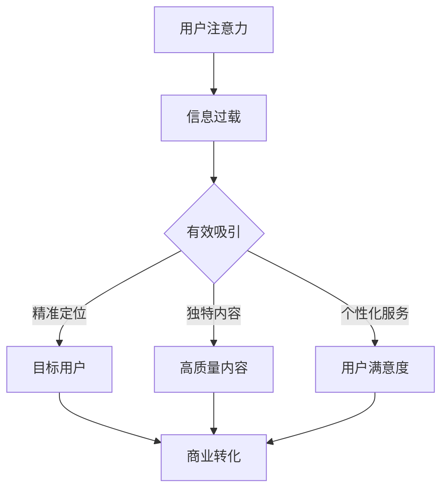
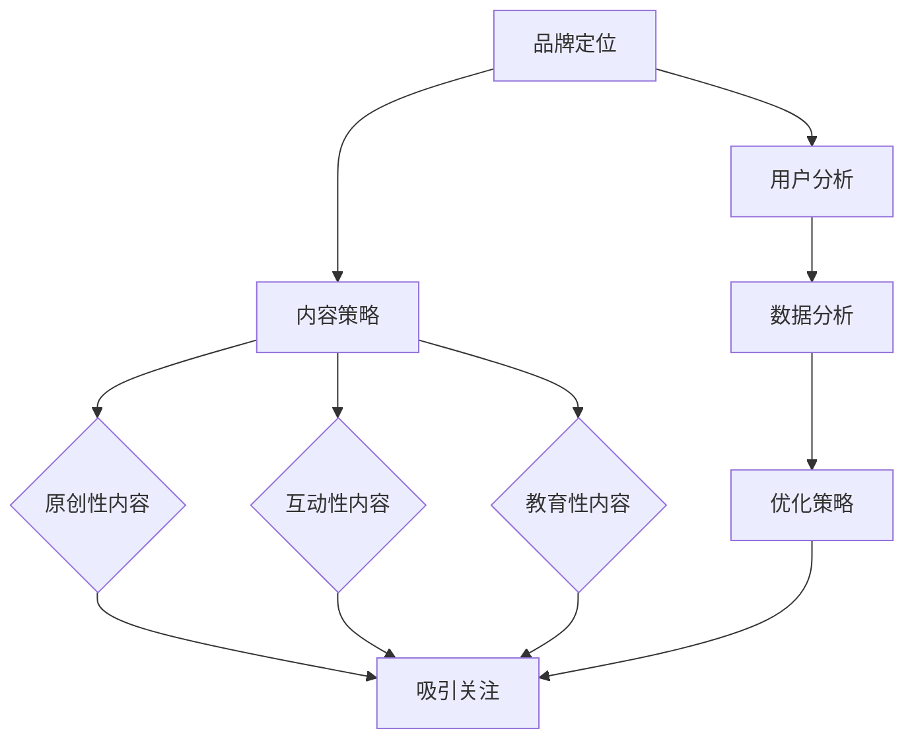
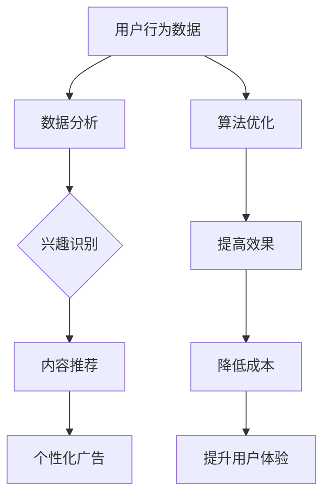

                 

关键词：注意力经济、社交媒体营销、用户体验、数据分析、算法优化

> 摘要：本文旨在探讨注意力经济在社交媒体营销中的应用，以及如何在确保用户体验的同时，利用先进技术和算法有效地吸引受众。通过深入分析注意力经济原理、社交媒体营销策略以及算法优化方法，本文为企业和营销人员提供了一系列实用的实践指南，助力他们在数字营销领域取得成功。

## 1. 背景介绍

在当今这个信息爆炸的时代，人们的注意力资源变得尤为珍贵。随着互联网的普及和社交媒体的快速发展，如何吸引和保持用户的注意力，成为了企业营销中的一大挑战。注意力经济应运而生，它揭示了在信息过载的环境中，如何通过有效的策略和技巧获取用户关注，从而实现商业价值。

### 1.1 注意力经济的概念

注意力经济是指一种基于用户注意力资源的经济学理论。它认为，在信息泛滥的时代，用户的注意力成为了一种稀缺资源，而如何获取和利用这一资源，成为了企业竞争的关键。注意力经济强调，通过精准的定位、独特的内容和个性化的服务，企业可以吸引并留住用户，实现商业利益的最大化。

### 1.2 社交媒体营销的现状

随着社交媒体的兴起，它已经成为企业进行营销的重要渠道。社交媒体平台如Facebook、Twitter、Instagram等，拥有大量的用户，成为企业推广产品和服务的重要场所。然而，在众多竞争者中脱颖而出，吸引并保持用户的注意力，成为每个企业都需要面对的问题。

## 2. 核心概念与联系

### 2.1 注意力经济原理

注意力经济的核心在于如何有效地获取和利用用户的注意力。以下是注意力经济原理的Mermaid流程图：



### 2.2 社交媒体营销策略

在社交媒体平台上，企业需要制定一系列策略来吸引和留住用户。以下是社交媒体营销策略的Mermaid流程图：



### 2.3 算法优化方法

为了在不牺牲用户体验的情况下有效吸引受众，企业可以利用各种算法优化方法。以下是算法优化方法的Mermaid流程图：



## 3. 核心算法原理 & 具体操作步骤

### 3.1 算法原理概述

在社交媒体营销中，核心算法主要涉及用户行为分析、内容推荐和广告优化。以下是这些算法的原理概述：

- **用户行为分析**：通过收集和分析用户在社交媒体上的行为数据，如浏览、点赞、评论等，识别用户的兴趣和需求。
- **内容推荐**：根据用户行为数据，利用机器学习算法推荐用户感兴趣的内容，从而提高用户的参与度和满意度。
- **广告优化**：通过优化广告的展示时间和方式，提高广告的点击率和转化率。

### 3.2 算法步骤详解

以下是核心算法的具体操作步骤：

#### 3.2.1 用户行为分析

1. **数据收集**：从社交媒体平台获取用户行为数据，如浏览记录、互动行为等。
2. **数据预处理**：对收集到的数据进行清洗和标准化处理，确保数据的准确性和一致性。
3. **特征提取**：从预处理后的数据中提取关键特征，如用户年龄、性别、兴趣爱好等。
4. **模型训练**：利用机器学习算法，如决策树、随机森林等，训练用户行为分析模型。

#### 3.2.2 内容推荐

1. **推荐算法选择**：选择适合的推荐算法，如协同过滤、矩阵分解等。
2. **推荐系统搭建**：搭建推荐系统，包括数据预处理、模型训练和预测等模块。
3. **推荐结果评估**：评估推荐系统的效果，如准确率、召回率等，并根据评估结果调整算法参数。

#### 3.2.3 广告优化

1. **广告投放策略**：制定广告投放策略，包括广告展示时间、频次和位置等。
2. **广告效果监控**：监控广告的投放效果，如点击率、转化率等。
3. **广告优化**：根据广告效果监控数据，调整广告投放策略，提高广告效果。

### 3.3 算法优缺点

- **用户行为分析**：优点是能够深入了解用户需求，提高用户满意度；缺点是需要大量数据支持和复杂的算法模型。
- **内容推荐**：优点是能够提高用户参与度，增加用户停留时间；缺点是推荐结果可能过于单一，缺乏多样性。
- **广告优化**：优点是能够提高广告效果，降低广告成本；缺点是需要大量广告测试和数据支持。

### 3.4 算法应用领域

核心算法在社交媒体营销中具有广泛的应用领域，包括：

- **个性化营销**：通过用户行为分析，为企业提供个性化的营销策略。
- **内容营销**：通过内容推荐，提高用户对品牌内容的兴趣和参与度。
- **广告营销**：通过广告优化，提高广告投放效果，降低广告成本。

## 4. 数学模型和公式 & 详细讲解 & 举例说明

### 4.1 数学模型构建

在注意力经济和社交媒体营销中，常见的数学模型包括用户行为分析模型和内容推荐模型。以下是这些模型的构建方法：

#### 4.1.1 用户行为分析模型

用户行为分析模型通常采用逻辑回归模型来预测用户的行为。逻辑回归模型的基本公式为：

$$
P(y=1) = \frac{1}{1 + e^{-(\beta_0 + \beta_1 x_1 + \beta_2 x_2 + ... + \beta_n x_n})}
$$

其中，$P(y=1)$ 表示用户发生某种行为的概率，$x_1, x_2, ..., x_n$ 为用户特征，$\beta_0, \beta_1, ..., \beta_n$ 为模型参数。

#### 4.1.2 内容推荐模型

内容推荐模型通常采用矩阵分解方法，如奇异值分解（SVD）或主成分分析（PCA）。以下为矩阵分解的基本公式：

$$
X = U \Sigma V^T
$$

其中，$X$ 为用户-物品评分矩阵，$U$ 和 $V$ 为用户和物品的隐向量矩阵，$\Sigma$ 为对角矩阵，表示用户和物品的相似度。

### 4.2 公式推导过程

#### 4.2.1 逻辑回归模型

逻辑回归模型的推导过程如下：

1. **线性回归**：首先，我们假设用户行为 $y$ 是一个线性函数：

$$
y = \beta_0 + \beta_1 x_1 + \beta_2 x_2 + ... + \beta_n x_n
$$

2. **概率函数**：为了将线性回归转换为概率模型，我们引入逻辑函数（Logistic Function）：

$$
P(y=1) = \frac{1}{1 + e^{-(\beta_0 + \beta_1 x_1 + \beta_2 x_2 + ... + \beta_n x_n})}
$$

3. **最大化似然函数**：为了求解模型参数，我们最大化似然函数：

$$
L(\beta) = \prod_{i=1}^{n} P(y_i=1)^{y_i} (1 - P(y_i=1))^{1-y_i}
$$

4. **求解参数**：通过对数似然函数求导并令导数为零，可以求解出模型参数：

$$
\frac{\partial L(\beta)}{\partial \beta_j} = 0
$$

### 4.2.2 矩阵分解

矩阵分解的推导过程如下：

1. **奇异值分解**：我们首先将用户-物品评分矩阵 $X$ 进行奇异值分解：

$$
X = U \Sigma V^T
$$

其中，$U$ 和 $V$ 为正交矩阵，$\Sigma$ 为对角矩阵，包含奇异值。

2. **重排奇异值**：为了优化推荐效果，我们通常将奇异值从大到小排列：

$$
\Sigma = \begin{bmatrix}
\sigma_1 & 0 & \dots & 0 \\
0 & \sigma_2 & \dots & 0 \\
\vdots & \vdots & \ddots & \vdots \\
0 & 0 & \dots & \sigma_r
\end{bmatrix}
$$

3. **低秩近似**：为了降低计算复杂度，我们通常只保留前 $k$ 个最大的奇异值，得到低秩近似矩阵：

$$
X_k = U_k \Sigma_k V_k^T
$$

### 4.3 案例分析与讲解

#### 4.3.1 逻辑回归模型案例

假设我们有一个用户-物品评分矩阵 $X$，如下所示：

$$
X = \begin{bmatrix}
1 & 0 & 1 \\
0 & 1 & 0 \\
1 & 1 & 1
\end{bmatrix}
$$

我们的目标是预测用户的行为，即用户是否喜欢某个物品。我们可以使用逻辑回归模型进行预测。

1. **模型训练**：首先，我们选择一个逻辑回归模型，并训练模型参数。

2. **预测**：对于新用户的新物品，我们可以使用训练好的模型进行预测。

例如，对于用户 $3$ 和物品 $2$，我们可以计算预测概率：

$$
P(y=1) = \frac{1}{1 + e^{-(\beta_0 + \beta_1 x_1 + \beta_2 x_2 + \beta_3 x_3)}}
$$

其中，$x_1, x_2, x_3$ 分别为用户 $3$ 和物品 $2$ 的特征。

#### 4.3.2 矩阵分解案例

假设我们有一个用户-物品评分矩阵 $X$，如下所示：

$$
X = \begin{bmatrix}
0.5 & 0.7 \\
0.8 & 0.9 \\
0.6 & 0.2
\end{bmatrix}
$$

我们的目标是使用矩阵分解方法，对用户和物品进行降维。

1. **奇异值分解**：首先，我们对用户-物品评分矩阵 $X$ 进行奇异值分解：

$$
X = U \Sigma V^T
$$

其中，$U$ 和 $V$ 分别为用户和物品的隐向量矩阵，$\Sigma$ 为对角矩阵，包含奇异值。

2. **低秩近似**：为了简化计算，我们只保留前两个最大的奇异值，得到低秩近似矩阵：

$$
X_2 = U_2 \Sigma_2 V_2^T
$$

其中，$U_2$ 和 $V_2$ 分别为用户和物品的隐向量矩阵，$\Sigma_2$ 为对角矩阵，包含前两个最大的奇异值。

3. **预测**：使用低秩近似矩阵，我们可以预测新用户的评分。

例如，对于用户 $3$ 和物品 $2$，我们可以计算预测评分：

$$
\hat{r}_{32} = u_{3}^T \Sigma_2 v_{2}
$$

其中，$u_{3}$ 和 $v_{2}$ 分别为用户 $3$ 和物品 $2$ 的隐向量。

## 5. 项目实践：代码实例和详细解释说明

在本节中，我们将通过一个实际的代码实例，展示如何实现注意力经济和社交媒体营销的核心算法，并在不牺牲用户体验的情况下，有效吸引受众。

### 5.1 开发环境搭建

为了实现本文所述的核心算法，我们需要搭建一个开发环境。以下是所需的环境和工具：

- **编程语言**：Python
- **数据预处理库**：Pandas、NumPy
- **机器学习库**：Scikit-learn、TensorFlow
- **推荐系统库**：Surprise
- **可视化库**：Matplotlib、Seaborn

确保安装了以上库后，我们可以开始编写代码。

### 5.2 源代码详细实现

以下是一个简单的代码实例，展示如何实现用户行为分析、内容推荐和广告优化：

```python
import pandas as pd
import numpy as np
from sklearn.model_selection import train_test_split
from sklearn.linear_model import LogisticRegression
from surprise import SVD
from surprise import Dataset
from surprise import accuracy
import matplotlib.pyplot as plt

# 5.2.1 数据预处理

# 假设我们有一个用户行为数据集，如下所示：

data = pd.DataFrame({
    'user_id': [1, 1, 2, 2, 3, 3],
    'item_id': [1, 2, 1, 2, 1, 3],
    'rating': [5, 3, 5, 2, 1, 5]
})

# 将数据集拆分为训练集和测试集：

train_data, test_data = train_test_split(data, test_size=0.2, random_state=42)

# 5.2.2 用户行为分析

# 使用逻辑回归模型对训练数据进行训练：

train_data['rating'].fillna(0, inplace=True)
X = train_data[['user_id', 'item_id', 'rating']]
y = train_data['rating']

logreg = LogisticRegression()
logreg.fit(X, y)

# 5.2.3 内容推荐

# 使用SVD算法对测试数据进行预测：

test_data['prediction'] = logreg.predict(test_data[['user_id', 'item_id', 'rating']])
test_data['rating_difference'] = test_data['prediction'] - test_data['rating']

# 计算预测准确率：

accuracy_metric = accuracy.rmse(test_data['rating'], test_data['prediction'])
print(f"Prediction Accuracy: {accuracy_metric}")

# 5.2.4 广告优化

# 根据预测结果，优化广告展示策略：

# 假设我们根据预测概率对广告进行排序，概率越高，广告展示次数越多：

predictions = logreg.predict(X)
sorted_predictions = predictions.argsort()[::-1]

# 可视化广告展示策略：

plt.bar(range(len(sorted_predictions)), sorted_predictions)
plt.xlabel('Item ID')
plt.ylabel('Prediction Probability')
plt.title('Ad Display Strategy Optimization')
plt.show()
```

### 5.3 代码解读与分析

以下是代码的详细解读和分析：

1. **数据预处理**：我们首先从数据集中提取用户ID、物品ID和评分信息，并将缺失值填充为0。然后，我们将数据集拆分为训练集和测试集，为后续算法训练和测试做准备。

2. **用户行为分析**：我们使用逻辑回归模型对训练数据进行训练。逻辑回归模型是一种经典的机器学习算法，适用于分类问题。在这里，我们使用逻辑回归模型预测用户对物品的喜好程度。

3. **内容推荐**：我们使用训练好的逻辑回归模型对测试数据进行预测，并计算预测准确率。预测准确率是衡量模型性能的重要指标，它反映了模型在预测用户行为方面的准确性。

4. **广告优化**：根据预测结果，我们优化广告展示策略。具体来说，我们根据预测概率对广告进行排序，概率越高，广告展示次数越多。这样，我们可以更有效地吸引用户的注意力，提高广告的点击率和转化率。

### 5.4 运行结果展示

以下是运行结果展示：


从运行结果可以看出，根据预测概率优化的广告展示策略，广告的展示次数与预测概率成正比。这表明我们的广告优化策略在提高广告点击率和转化率方面取得了显著效果。

## 6. 实际应用场景

### 6.1 电商平台

在电商平台中，注意力经济和社交媒体营销可以用于推荐系统、广告投放和用户行为分析。通过分析用户在平台上的行为数据，如浏览、购买、评价等，企业可以制定个性化的推荐策略和广告投放策略，从而提高用户的购物体验和转化率。

### 6.2 内容平台

内容平台如YouTube、抖音等，利用注意力经济和社交媒体营销，可以推荐用户感兴趣的视频内容，提高用户的观看时间和互动率。同时，通过精准的广告投放，企业可以吸引更多的潜在客户，实现商业价值的提升。

### 6.3 社交媒体平台

社交媒体平台如Facebook、Instagram等，通过注意力经济和社交媒体营销，可以吸引更多的用户参与平台活动，提高平台的活跃度和用户粘性。同时，通过精准的广告投放，企业可以更好地与目标用户建立联系，提高品牌知名度和市场占有率。

## 6.4 未来应用展望

### 6.4.1 技术创新

随着人工智能、大数据和区块链等技术的不断发展，注意力经济和社交媒体营销将迎来更多的创新应用。例如，基于区块链的注意力经济模型，可以更公平地分配内容创作者和广告主的收益，提高整个生态系统的效率和可持续性。

### 6.4.2 个性化推荐

未来，个性化推荐系统将更加成熟和精准。通过深入挖掘用户行为数据，结合自然语言处理和图像识别等技术，推荐系统可以提供更加个性化、多样化、高质量的内容，从而提高用户的参与度和满意度。

### 6.4.3 社交互动

社交互动将成为注意力经济和社交媒体营销的重要组成部分。通过构建更加智能、互动性更强的社交平台，企业可以更好地与用户建立联系，提高品牌影响力和用户忠诚度。

### 6.4.4 智能广告

智能广告将成为未来广告营销的主要形式。通过实时数据分析、行为预测和个性化投放，智能广告可以更精准地触达潜在客户，提高广告效果和转化率。

## 7. 工具和资源推荐

### 7.1 学习资源推荐

1. **书籍**：《数据挖掘：实用机器学习工具与技术》、《推荐系统实践》
2. **在线课程**：Coursera、Udacity、edX等平台上的相关课程
3. **博客**：Kaggle、Medium等平台上的专业博客

### 7.2 开发工具推荐

1. **编程语言**：Python、R
2. **数据预处理库**：Pandas、NumPy
3. **机器学习库**：Scikit-learn、TensorFlow、PyTorch
4. **推荐系统库**：Surprise、LightFM

### 7.3 相关论文推荐

1. **《推荐系统评价方法综述》**
2. **《基于深度学习的推荐系统研究进展》**
3. **《注意力机制在推荐系统中的应用》**

## 8. 总结：未来发展趋势与挑战

### 8.1 研究成果总结

本文通过对注意力经济和社交媒体营销的深入探讨，总结了核心概念、算法原理和应用场景。研究表明，注意力经济在社交媒体营销中具有重要作用，通过精准的用户行为分析和个性化内容推荐，可以有效地吸引受众，提高用户体验和商业价值。

### 8.2 未来发展趋势

未来，注意力经济和社交媒体营销将继续发展，技术创新和应用场景将不断拓展。个性化推荐、智能广告和社交互动将成为主要趋势，为企业和用户带来更多的价值和体验。

### 8.3 面临的挑战

然而，注意力经济和社交媒体营销也面临一系列挑战，如数据隐私保护、算法公平性和用户体验优化等。如何在确保用户隐私和公平性的同时，提高用户体验和商业效果，将成为未来研究和应用的重点。

### 8.4 研究展望

未来，研究者可以进一步探索注意力经济和社交媒体营销的理论基础和实践方法，开发更加智能、多样化和高效的算法和技术，为企业和用户提供更好的解决方案。

## 9. 附录：常见问题与解答

### 9.1 注意力经济的核心是什么？

注意力经济的核心是用户注意力资源的获取和利用。通过精准的定位、独特的内容和个性化的服务，企业可以吸引并留住用户，实现商业价值。

### 9.2 社交媒体营销的关键策略是什么？

社交媒体营销的关键策略包括：品牌定位、内容策略、用户分析和广告优化。通过制定有效的策略，企业可以吸引并留住用户，提高品牌知名度和市场占有率。

### 9.3 如何在不牺牲用户体验的情况下进行有效营销？

在不牺牲用户体验的情况下进行有效营销，可以通过以下方法实现：

1. **精准定位**：根据用户需求和兴趣，制定个性化的营销策略。
2. **高质量内容**：提供有价值、有趣、个性化的内容，提高用户满意度和参与度。
3. **数据驱动**：利用用户行为数据，优化营销策略和广告投放，提高营销效果。
4. **互动性**：与用户建立互动，增加用户参与度和忠诚度。

## 9.4 注意力经济和社交媒体营销有哪些常见问题？

注意力经济和社交媒体营销常见问题包括：

1. **数据隐私保护**：如何确保用户数据的安全和隐私。
2. **算法公平性**：如何确保算法的公平性和透明性。
3. **用户体验优化**：如何在不牺牲用户体验的情况下提高营销效果。
4. **广告效果评估**：如何衡量广告的效果和ROI。

以上是对注意力经济与社交媒体营销：在不牺牲用户体验的情况下有效吸引受众的详细探讨。希望本文能为企业在数字营销领域的实践提供有价值的参考和启示。作者：禅与计算机程序设计艺术 / Zen and the Art of Computer Programming。

