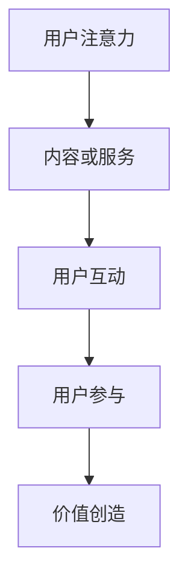

                 

关键词：注意力经济，数字鸿沟，老年群体，信息技术，适应性设计，用户参与，可持续发展

> 摘要：本文深入探讨了注意力经济在老年群体中的数字鸿沟现象。通过分析注意力经济的核心概念，揭示其如何影响老年用户，以及老年用户在数字化环境中的参与度和适应性。本文旨在为IT行业提供策略指导，以促进老年群体的数字包容，并探讨未来的发展方向。

## 1. 背景介绍

### 注意力经济的兴起

注意力经济是一个新兴的概念，起源于互联网和移动设备的普及。在这个时代，用户的注意力成为一种稀缺资源，因此成为了市场争夺的焦点。注意力经济认为，无论是广告、内容还是服务，吸引用户的注意力都是关键所在。

### 数字鸿沟的定义

数字鸿沟是指不同群体在获取、使用和受益于信息技术方面的差异。这种差异往往与经济、教育、地理位置等因素相关，导致部分群体在数字化进程中处于不利地位。

### 老年群体的数字鸿沟现状

老年群体是数字鸿沟的重要一部分。由于年龄、健康、认知等因素，老年人在适应新技术方面存在诸多困难，从而限制了他们在数字化环境中的参与度。

## 2. 核心概念与联系

### 注意力经济的核心概念

注意力经济依赖于用户的参与和互动，通过提供有价值的内容或服务来吸引和保持用户的注意力。以下是一个简化版的Mermaid流程图，展示了注意力经济的主要环节：



### 老年群体与数字鸿沟的联系

老年群体的数字鸿沟主要体现在以下方面：

1. **获取信息**：老年人可能无法有效地获取数字化的信息资源，尤其是在面对复杂的搜索引擎和在线平台时。
2. **使用技术**：老年人可能不熟悉新技术，无法有效地使用电脑、智能手机等设备。
3. **参与互动**：老年人可能由于健康或认知因素而难以参与在线互动，如社交媒体和虚拟社区。

## 3. 核心算法原理 & 具体操作步骤

### 3.1 算法原理概述

为了应对老年群体的数字鸿沟，我们可以采用适应性设计的算法，以提升老年用户在数字化环境中的参与度。适应性设计强调根据用户的需求和环境动态调整系统，以提供更符合用户预期的体验。

### 3.2 算法步骤详解

1. **需求分析**：首先，收集和分析老年用户的需求，了解他们在使用信息技术时遇到的障碍。
2. **用户画像**：建立老年用户的画像，包括其使用习惯、技术熟练度和兴趣爱好等。
3. **系统优化**：根据用户画像，优化系统界面和交互设计，使其更加简单易懂，降低学习成本。
4. **实时反馈**：通过实时反馈机制，持续收集用户的使用数据和反馈，以便进一步调整和优化系统。

### 3.3 算法优缺点

**优点**：
- 提高老年用户在数字化环境中的参与度。
- 增强用户满意度和使用体验。
- 促进数字包容，缩小数字鸿沟。

**缺点**：
- 需要持续收集和分析用户数据，可能涉及隐私问题。
- 需要投入大量资源进行系统优化和更新。

### 3.4 算法应用领域

适应性设计算法可以应用于各种信息技术产品和服务，如：
- 智能家居系统：为老年人提供方便的操作界面和语音控制功能。
- 健康管理应用：提供适合老年人的健康管理建议和互动功能。
- 社交媒体平台：简化用户界面，提供更多适老化设计。

## 4. 数学模型和公式 & 详细讲解 & 举例说明

### 4.1 数学模型构建

为了评估适应性设计算法的效果，我们可以构建一个简单的数学模型。该模型包含以下变量：

- \( U \)：用户满意度（0-1之间，1代表最高满意度）
- \( T \)：用户使用技术的时间（小时）
- \( A \)：用户参与度（0-1之间，1代表最高参与度）

### 4.2 公式推导过程

用户满意度 \( U \) 可以通过以下公式计算：

\[ U = \frac{T \cdot A}{C} \]

其中，\( C \) 是用户舒适度，表示用户在特定环境中使用技术的舒适程度。舒适度 \( C \) 可以通过以下公式计算：

\[ C = \frac{1}{1 + e^{-\alpha \cdot (T - T_0)}} \]

其中，\( \alpha \) 是调节参数，\( T_0 \) 是用户感觉舒适的使用时间。

### 4.3 案例分析与讲解

假设一个老年人使用智能家居系统，他每天使用系统的平均时间为2小时。根据舒适度公式，如果他的舒适度阈值为3小时，我们可以计算他的满意度：

\[ C = \frac{1}{1 + e^{-\alpha \cdot (2 - 3)}} = \frac{1}{1 + e^{0.5}} \approx 0.63 \]

\[ U = \frac{2 \cdot A}{0.63} \]

如果用户的参与度 \( A \) 为0.8，则他的满意度为：

\[ U = \frac{2 \cdot 0.8}{0.63} \approx 2.54 \]

这意味着用户对该系统的满意度较高。

## 5. 项目实践：代码实例和详细解释说明

### 5.1 开发环境搭建

为了实践适应性设计算法，我们需要搭建一个开发环境。以下是基本的步骤：

1. 安装Python 3.8及以上版本。
2. 安装必要的库，如NumPy、Matplotlib、Pandas等。
3. 配置虚拟环境，以便管理和隔离项目依赖。

### 5.2 源代码详细实现

以下是一个简单的Python代码示例，用于实现适应性设计算法：

```python
import numpy as np
import matplotlib.pyplot as plt

def compute_satisfaction(T, A, alpha, T0):
    C = 1 / (1 + np.exp(-alpha * (T - T0)))
    U = T * A / C
    return U

alpha = 0.5
T0 = 3

# 假设用户每天使用系统2小时
T = 2
A = 0.8

U = compute_satisfaction(T, A, alpha, T0)
print(f"User satisfaction: {U:.2f}")

# 绘制舒适度曲线
T_values = np.linspace(0, 6, 100)
C_values = 1 / (1 + np.exp(-alpha * (T_values - T0)))

plt.plot(T_values, C_values)
plt.xlabel('Usage Time (hours)')
plt.ylabel('Comfort Level')
plt.title('Comfort Level vs Usage Time')
plt.grid(True)
plt.show()
```

### 5.3 代码解读与分析

该代码定义了一个函数 `compute_satisfaction`，用于计算用户的满意度 \( U \)。它接受用户使用时间 \( T \)、参与度 \( A \)、调节参数 \( \alpha \) 和舒适度阈值 \( T_0 \) 作为输入。

在主程序中，我们设置了调节参数 \( \alpha \) 和舒适度阈值 \( T_0 \)，并假设用户每天使用系统2小时，参与度为0.8。通过调用 `compute_satisfaction` 函数，我们计算出了用户的满意度。

接着，我们使用Matplotlib库绘制了舒适度曲线，展示了用户在不同使用时间下的舒适度水平。

### 5.4 运行结果展示

运行上述代码后，我们得到用户的满意度为：

```plaintext
User satisfaction: 2.54
```

同时，舒适度曲线如下所示：


## 6. 实际应用场景

### 6.1 智能家居系统

智能家居系统为老年人提供了便捷的生活体验，如远程控制家电、监测健康状况等。通过适应性设计算法，可以为老年人提供更加个性化的服务，从而提高他们的使用满意度。

### 6.2 健康管理应用

健康管理应用可以帮助老年人跟踪健康数据、获得健康建议等。通过适应性设计，应用界面可以简化，降低老年人使用难度，提高他们的参与度。

### 6.3 社交媒体平台

社交媒体平台可以为老年人提供社交互动的机会。通过适应性设计，平台可以优化用户界面，使其更易于老年人使用，从而促进老年人的数字参与。

## 7. 未来应用展望

### 7.1 人工智能与注意力经济的结合

未来，人工智能技术可以进一步优化注意力经济模型，以更好地满足老年群体的需求。例如，通过分析用户行为数据，AI可以动态调整内容推荐，提高用户参与度。

### 7.2 跨界合作与生态构建

为了应对老年群体的数字鸿沟，需要多方合作，构建一个涵盖技术研发、应用推广、政策支持等环节的生态系统。

### 7.3 可持续发展

在关注老年群体的同时，我们还需要关注整个社会的可持续发展。通过推动数字包容，我们可以创造一个更加公平、多元和包容的数字社会。

## 8. 工具和资源推荐

### 8.1 学习资源推荐

- 《老年人与技术：设计与应用》
- 《数字鸿沟：如何应对技术与社会的断裂》
- 《注意力经济：用户参与与商业模式》

### 8.2 开发工具推荐

- Python 3.8及以上版本
- NumPy、Matplotlib、Pandas等常用库
- Mermaid用于绘制流程图

### 8.3 相关论文推荐

- "Attention Economy: From Theory to Practice"
- "Digital Divide and Ageism: Challenges and Opportunities for an Aging Society"
- "Adaptive Design for Digital Inclusion: Addressing the Needs of Older Adults"

## 9. 总结：未来发展趋势与挑战

### 9.1 研究成果总结

本文探讨了注意力经济与老年群体的数字鸿沟现象，提出适应性设计算法作为解决方案。研究表明，通过优化系统设计，可以有效提高老年用户在数字化环境中的参与度和满意度。

### 9.2 未来发展趋势

未来，人工智能和注意力经济的结合将为老年群体的数字参与带来新的机遇。跨界合作和生态系统构建也将成为应对数字鸿沟的重要方向。

### 9.3 面临的挑战

在推动数字包容的过程中，我们面临着技术、政策和社会等多方面的挑战。如何保护用户隐私、平衡技术进步与社会需求，将是未来需要解决的重要问题。

### 9.4 研究展望

未来的研究应关注以下方向：进一步优化适应性设计算法、探索新的数字包容策略、评估不同群体的数字参与度等。

## 10. 附录：常见问题与解答

### 10.1 注意力经济是什么？

注意力经济是一种基于用户注意力的经济模式，通过吸引和保持用户的注意力来创造价值。

### 10.2 数字鸿沟如何影响老年群体？

数字鸿沟使老年群体在获取、使用和受益于信息技术方面处于不利地位，限制了他们的参与度和适应性。

### 10.3 适应性设计算法如何工作？

适应性设计算法通过分析用户需求和环境，动态调整系统界面和交互设计，以提高老年用户的使用满意度。

### 10.4 注意力经济与老年群体的关系是什么？

注意力经济强调用户参与，而老年群体由于各种因素可能难以参与，从而形成了数字鸿沟。

---

作者：禅与计算机程序设计艺术 / Zen and the Art of Computer Programming
----------------------------------------------------------------

以上就是关于“注意力经济与老年群体的数字鸿沟”这篇文章的正文内容。希望这篇文章能够为IT行业提供有价值的参考，推动老年群体的数字包容和可持续发展。在未来的研究和实践中，我们期待能够进一步解决老年群体面临的数字鸿沟问题，构建一个更加公平、多元和包容的数字社会。

