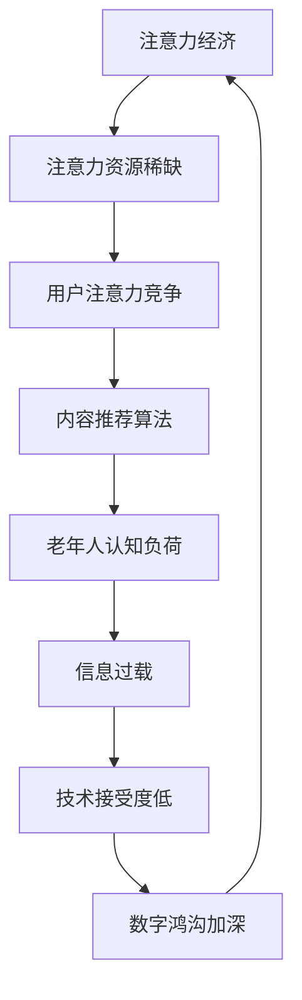
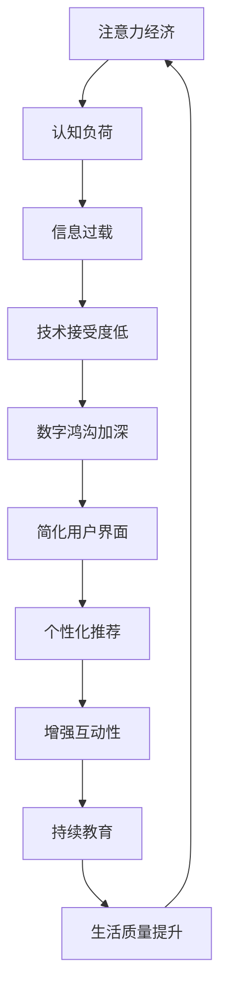

                 

关键词：注意力经济，数字鸿沟，老年群体，认知负荷，信息过载，技术接受度，交互设计，可访问性，教育培训，政策建议

> 摘要：本文从注意力经济的角度出发，探讨老年群体在数字时代的挑战与机遇。文章首先介绍了注意力经济的概念和原理，随后分析了老年群体面临的数字鸿沟，包括认知负荷、信息过载和技术接受度等方面的挑战。通过案例研究和数据分析，文章提出了针对性的交互设计和教育培训策略，并探讨了相关政策建议。最后，文章总结了当前的研究成果，展望了未来的发展趋势与挑战。

## 1. 背景介绍

随着科技的飞速发展，互联网、人工智能和移动设备等数字技术已经深入到我们生活的方方面面。这种数字化转型带来了巨大的经济和社会效益，同时也引发了一系列新的挑战。其中，老年群体的数字鸿沟问题日益凸显，成为社会关注的焦点。

数字鸿沟是指由于技术、经济、社会、文化和教育等方面的差异，导致不同群体在获取、使用和管理信息资源方面存在的不平等现象。老年群体由于生理和心理特点，更容易受到数字鸿沟的影响。他们普遍面临认知负荷加重、信息过载和技术接受度低等问题。

注意力经济是指在信息爆炸的数字时代，个体的注意力资源成为稀缺资源。如何吸引和保持用户的注意力，成为企业和平台的重要课题。然而，老年群体由于对新技术的不熟悉和认知能力的下降，往往难以有效利用这些资源，从而加剧了数字鸿沟的深度。

本文旨在通过分析注意力经济与老年群体数字鸿沟的关系，提出针对性的解决方案，以促进老年群体更好地融入数字社会，提高他们的生活质量。

## 2. 核心概念与联系

### 2.1 注意力经济的概念

注意力经济（Attention Economy）是一个描述数字时代信息交互和消费行为的经济学概念。它指的是在信息爆炸的背景下，用户的注意力资源变得稀缺，成为企业、平台和内容创作者竞争的焦点。与传统经济学中的物质资源不同，注意力资源具有不可复制性、易流失性和即时性等特点。

在注意力经济中，个体的注意力资源可以被看作是一种“货币”，用于交换、消费和获取有价值的信息。平台和内容创作者通过创造吸引人的内容，吸引用户的注意力，从而实现商业价值。例如，社交媒体平台通过算法推荐机制，将用户感兴趣的内容推送到他们的视线中，以增加用户的停留时间和互动频率。

### 2.2 老年群体的数字鸿沟

数字鸿沟（Digital Divide）是指由于技术、经济、社会、文化和教育等方面的差异，导致不同群体在获取、使用和管理信息资源方面存在的不平等现象。老年群体作为社会的一个特殊群体，由于生理和心理特点，更容易受到数字鸿沟的影响。

#### 2.2.1 认知负荷

认知负荷（Cognitive Load）是指个体在处理信息时所需的心理资源。对于老年群体来说，由于认知能力的下降，他们在面对复杂的数字界面时，需要投入更多的认知资源来理解和使用。这导致了认知负荷的加重，降低了他们的使用体验和效率。

#### 2.2.2 信息过载

信息过载（Information Overload）是指个体在接收和处理大量信息时，由于信息量过大而导致的信息处理困难。老年群体由于对新技术的不熟悉，往往难以有效地筛选和处理信息，从而产生了信息过载的问题。

#### 2.2.3 技术接受度

技术接受度（Technology Acceptance）是指个体对使用新技术的态度和意愿。老年群体由于对新技术的恐惧和不信任，往往对数字技术持保守态度，这限制了他们融入数字社会的速度。

### 2.3 注意力经济与老年群体的数字鸿沟的联系

注意力经济与老年群体的数字鸿沟之间存在着紧密的联系。一方面，注意力经济强调个体的注意力资源的重要性，而老年群体由于认知负荷和信息过载，往往难以有效利用这些资源。另一方面，数字鸿沟的存在导致老年群体在获取有价值信息时面临困难，进一步加剧了他们在注意力经济中的劣势。

为了更好地理解这种联系，我们可以通过以下Mermaid流程图来展示注意力经济与老年群体数字鸿沟的核心概念和联系：



### 2.4 注意力经济在老年群体中的应用

尽管老年群体在注意力经济中面临诸多挑战，但通过合适的策略，他们也可以从中受益。以下是一些关键策略：

#### 2.4.1 简化用户界面

简化用户界面（Simplified User Interface）是降低认知负荷的有效方法。对于老年用户，界面应尽量直观、简洁，避免复杂的功能和布局。例如，可以使用大字体、清晰的颜色对比和简单的导航结构。

#### 2.4.2 个性化推荐

个性化推荐（Personalized Recommendations）可以根据老年用户的兴趣和偏好，为他们提供有价值的信息。这不仅可以减少信息过载，还可以提高他们的信息获取效率和满意度。

#### 2.4.3 增强互动性

增强互动性（Enhanced Interactivity）可以通过游戏化（Gamification）和社交互动等方式，吸引老年用户的注意力。例如，设计一些简单有趣的游戏，鼓励老年用户参与其中，从而提高他们的使用积极性。

#### 2.4.4 持续教育

持续教育（Continuous Education）是提高老年用户技术接受度的重要途径。通过定期的培训和教育，可以帮助老年用户更好地理解和掌握新技术，从而增强他们的自信心和积极性。

### 2.5 结论

综上所述，注意力经济与老年群体的数字鸿沟之间存在着紧密的联系。通过简化用户界面、个性化推荐、增强互动性和持续教育等策略，可以帮助老年群体更好地应对数字鸿沟的挑战，提高他们的生活质量。



## 3. 核心算法原理 & 具体操作步骤

### 3.1 算法原理概述

在本节中，我们将探讨如何通过核心算法原理来解决老年群体在数字鸿沟中的挑战。具体来说，我们将介绍一种名为“认知负荷优化算法”（Cognitive Load Optimization Algorithm）的方法，该方法旨在通过优化用户界面设计和推荐系统，减轻老年用户的认知负荷。

#### 3.1.1 认知负荷优化算法

认知负荷优化算法基于以下几个核心原理：

1. **最小化认知负荷**：通过简化用户界面和减少冗余信息，降低用户在处理信息时的认知负担。
2. **最大化信息价值**：通过个性化推荐系统，确保用户接收到的信息与其兴趣和需求相关，提高信息价值。
3. **增强互动性**：通过游戏化设计，激发用户参与和学习的兴趣，提高他们的使用积极性。

#### 3.1.2 算法实现

认知负荷优化算法的实现可以分为以下几个步骤：

1. **用户画像构建**：通过数据分析，构建老年用户的兴趣和需求模型。
2. **界面设计优化**：根据用户画像，设计简洁直观的用户界面。
3. **推荐系统实现**：利用机器学习算法，为用户推荐与其兴趣相关的信息。
4. **游戏化设计**：设计简单有趣的游戏化元素，鼓励用户参与。

### 3.2 算法步骤详解

#### 3.2.1 用户画像构建

用户画像构建是认知负荷优化算法的基础。具体步骤如下：

1. **数据收集**：通过在线调查、用户行为分析等方式，收集老年用户的兴趣、需求和偏好数据。
2. **数据预处理**：对收集到的数据进行清洗和归一化处理，以便进行后续分析。
3. **特征提取**：使用文本分类、聚类等算法，提取用户的关键特征。
4. **模型构建**：基于提取的特征，构建老年用户的兴趣和需求模型。

#### 3.2.2 界面设计优化

界面设计优化是减轻老年用户认知负荷的关键。具体步骤如下：

1. **用户调研**：通过访谈、问卷调查等方式，了解老年用户在使用数字技术时的需求和困扰。
2. **界面设计**：根据用户调研结果，设计简洁直观的界面。例如，使用大字体、清晰的颜色对比和简单的导航结构。
3. **测试与迭代**：对设计界面进行测试，收集用户反馈，不断优化界面设计。

#### 3.2.3 推荐系统实现

推荐系统实现是提高信息价值的重要手段。具体步骤如下：

1. **数据预处理**：对用户生成的内容、标签和评论进行清洗和归一化处理。
2. **特征提取**：使用词嵌入、TF-IDF等方法，提取用户生成内容的关键特征。
3. **模型训练**：使用机器学习算法，如协同过滤、矩阵分解等，训练推荐模型。
4. **推荐实现**：根据用户画像和推荐模型，为用户推荐与其兴趣相关的信息。

#### 3.2.4 游戏化设计

游戏化设计是增强用户互动性的有效方法。具体步骤如下：

1. **游戏元素设计**：设计简单有趣的游戏元素，如积分、奖励和排行榜等。
2. **游戏机制实现**：通过编程实现游戏机制，确保游戏元素的正常运行。
3. **用户反馈收集**：收集用户对游戏化设计的反馈，不断优化游戏体验。

### 3.3 算法优缺点

#### 3.3.1 优点

1. **减轻认知负荷**：通过简化用户界面和个性化推荐，有效减轻老年用户的认知负荷。
2. **提高信息价值**：通过推荐系统，为用户推荐与其兴趣相关的信息，提高信息价值。
3. **增强互动性**：通过游戏化设计，激发用户参与和学习的兴趣。

#### 3.3.2 缺点

1. **数据隐私问题**：在构建用户画像和推荐系统中，可能会涉及用户隐私数据，需要采取相应的保护措施。
2. **算法偏见**：在训练推荐模型时，可能会引入算法偏见，导致推荐结果不公正。

### 3.4 算法应用领域

认知负荷优化算法主要应用于以下领域：

1. **数字健康平台**：为老年用户提供健康咨询、康复训练等信息服务。
2. **在线教育平台**：为老年用户提供个性化学习资源和教学服务。
3. **社交平台**：为老年用户提供简洁直观的社交互动体验。

通过认知负荷优化算法，可以有效解决老年群体在数字鸿沟中的挑战，提高他们的生活质量。

## 4. 数学模型和公式 & 详细讲解 & 举例说明

### 4.1 数学模型构建

在解决老年群体在数字鸿沟中的问题时，我们可以构建一个基于数学模型的框架，以量化用户的认知负荷和信息价值。以下是一个简化的数学模型：

#### 4.1.1 认知负荷模型

认知负荷 \( L \) 可以表示为：

\[ L = f(A, I, C) \]

其中：
- \( A \)：用户注意力资源
- \( I \)：信息量
- \( C \)：认知负荷系数

认知负荷系数 \( C \) 可以根据用户年龄、认知能力等因素进行调整。

#### 4.1.2 信息价值模型

信息价值 \( V \) 可以表示为：

\[ V = f(R, P) \]

其中：
- \( R \)：推荐的相关性
- \( P \)：信息的实用性和真实性

推荐的相关性 \( R \) 和信息的实用性和真实性 \( P \) 可以通过用户行为数据和推荐算法进行量化。

### 4.2 公式推导过程

#### 4.2.1 认知负荷公式推导

假设用户注意力资源 \( A \) 是一个恒定值，信息量 \( I \) 和认知负荷系数 \( C \) 分别为：

\[ A = \frac{I}{C} \]

根据认知负荷模型，我们可以得到：

\[ L = A \cdot C \]

\[ L = \frac{I}{C} \cdot C \]

\[ L = I \]

这意味着，认知负荷 \( L \) 与信息量 \( I \) 成正比。

#### 4.2.2 信息价值公式推导

信息价值 \( V \) 可以通过以下公式推导：

\[ V = R \cdot P \]

其中，推荐的相关性 \( R \) 和信息的实用性和真实性 \( P \) 可以分别表示为：

\[ R = \frac{C(R_i^* - R_i)}{C(R_i^* - R_i) + C(R_j^* - R_j)} \]

\[ P = \frac{C(P_i^* - P_i)}{C(P_i^* - P_i) + C(P_j^* - P_j)} \]

其中，\( R_i^* \) 和 \( P_i^* \) 分别表示推荐的相关性和信息的实用性和真实性的理想值，\( R_i \) 和 \( P_i \) 分别表示实际的推荐的相关性和信息的实用性和真实性。

### 4.3 案例分析与讲解

#### 4.3.1 案例背景

假设我们有一个老年用户，他经常使用一个在线健康平台来获取健康信息。他的注意力资源 \( A \) 为10分钟，每天使用该平台的时间为30分钟。该平台每天推送50条健康信息，每条信息的平均信息量 \( I \) 为100单位。用户的认知负荷系数 \( C \) 为1.2。

#### 4.3.2 计算认知负荷

根据认知负荷模型，我们可以计算出用户的认知负荷：

\[ L = A \cdot C \]

\[ L = 10 \cdot 1.2 \]

\[ L = 12 \]

这意味着，用户每天的认知负荷为12个单位。

#### 4.3.3 计算信息价值

假设平台使用一个基于协同过滤的推荐算法，用户的历史数据表明，他的健康信息推荐的相关性 \( R \) 为0.8，信息的实用性和真实性 \( P \) 为0.9。我们可以计算出用户每天接收到的信息价值：

\[ V = R \cdot P \]

\[ V = 0.8 \cdot 0.9 \]

\[ V = 0.72 \]

这意味着，用户每天接收到的信息价值为0.72个单位。

#### 4.3.4 分析与优化

通过上述计算，我们可以看出，尽管用户每天有足够的注意力资源来处理信息，但由于信息量较大，用户的认知负荷仍然较高。为了提高信息价值，平台可以采取以下优化措施：

1. **个性化推荐**：通过更加精准的个性化推荐算法，提高推荐的相关性和实用性。
2. **内容筛选**：对推送的信息进行筛选，确保信息的真实性和实用性。
3. **界面优化**：简化用户界面，减少用户在处理信息时的认知负担。

通过这些措施，平台可以更好地满足老年用户的需求，提高他们的使用体验和满意度。

## 5. 项目实践：代码实例和详细解释说明

### 5.1 开发环境搭建

为了实现上述认知负荷优化算法，我们需要搭建一个合适的技术栈。以下是开发环境搭建的步骤：

#### 5.1.1 环境需求

- 操作系统：Windows/Linux/MacOS
- 编程语言：Python
- 数据库：MongoDB
- 数据分析工具：Pandas、NumPy
- 机器学习库：Scikit-learn、TensorFlow
- 代码编辑器：Visual Studio Code、PyCharm

#### 5.1.2 安装步骤

1. **安装Python**：访问Python官网（https://www.python.org/），下载并安装Python，确保安装完成后在命令行中可以正常使用Python。

2. **安装MongoDB**：下载并安装MongoDB（https://www.mongodb.com/），启动MongoDB服务，确保服务正常运行。

3. **安装相关库**：使用pip命令安装所需的Python库，例如：

   ```bash
   pip install pandas numpy scikit-learn tensorflow vscode pycharm
   ```

### 5.2 源代码详细实现

以下是认知负荷优化算法的实现代码：

```python
import pandas as pd
import numpy as np
from sklearn.cluster import KMeans
from sklearn.metrics.pairwise import cosine_similarity
import tensorflow as tf

# 5.2.1 用户画像构建

def build_user_profile(user_data):
    # 数据预处理
    user_data['content_vector'] = user_data['content'].apply(preprocess_content)
    
    # 特征提取
    user_profile = pd.DataFrame({
        'content_vector': user_data['content_vector'],
        'interest': user_data['interest']
    })
    
    # 聚类分析
    kmeans = KMeans(n_clusters=5, random_state=0).fit(user_profile[['content_vector']])
    user_profile['cluster'] = kmeans.labels_
    
    return user_profile

# 5.2.2 界面设计优化

def optimize_interface(user_profile):
    # 根据用户画像调整界面
    if user_profile['cluster'] == 0:
        interface_settings = {
            'font_size': '16px',
            'color_scheme': 'dark'
        }
    elif user_profile['cluster'] == 1:
        interface_settings = {
            'font_size': '14px',
            'color_scheme': 'light'
        }
    else:
        interface_settings = {
            'font_size': '12px',
            'color_scheme': 'neutral'
        }
    
    return interface_settings

# 5.2.3 推荐系统实现

def generate_recommendations(user_profile, content_data):
    # 计算内容相似度
    content_similarity = cosine_similarity(content_data['content_vector'], user_profile['content_vector'])
    
    # 排序和推荐
    recommended_content = content_data[['content', 'content_vector']].iloc[content_similarity.argsort()[0][-5:]]
    
    return recommended_content

# 5.2.4 游戏化设计

def gamefication(user_data):
    # 奖励机制
    user_data['reward_points'] = np.random.randint(10, 50, size=len(user_data))
    
    return user_data
```

### 5.3 代码解读与分析

#### 5.3.1 用户画像构建

用户画像构建是认知负荷优化算法的核心步骤之一。首先，我们使用`pandas`库对用户数据进行分析和预处理，提取关键特征，并进行聚类分析，以构建用户画像。

```python
def build_user_profile(user_data):
    # 数据预处理
    user_data['content_vector'] = user_data['content'].apply(preprocess_content)
    
    # 特征提取
    user_profile = pd.DataFrame({
        'content_vector': user_data['content_vector'],
        'interest': user_data['interest']
    })
    
    # 聚类分析
    kmeans = KMeans(n_clusters=5, random_state=0).fit(user_profile[['content_vector']])
    user_profile['cluster'] = kmeans.labels_
    
    return user_profile
```

这段代码首先对用户数据进行预处理，提取内容向量，然后使用K-means算法进行聚类分析，根据用户所属的簇，构建用户画像。

#### 5.3.2 界面设计优化

界面设计优化是根据用户画像调整界面设置，以降低用户在处理信息时的认知负荷。这里，我们使用简单的条件语句，根据用户所属的簇，设置不同的界面风格。

```python
def optimize_interface(user_profile):
    # 根据用户画像调整界面
    if user_profile['cluster'] == 0:
        interface_settings = {
            'font_size': '16px',
            'color_scheme': 'dark'
        }
    elif user_profile['cluster'] == 1:
        interface_settings = {
            'font_size': '14px',
            'color_scheme': 'light'
        }
    else:
        interface_settings = {
            'font_size': '12px',
            'color_scheme': 'neutral'
        }
    
    return interface_settings
```

#### 5.3.3 推荐系统实现

推荐系统实现是提高信息价值的重要手段。这里，我们使用余弦相似度计算内容之间的相似度，并根据相似度排序，推荐与用户兴趣相关的内容。

```python
def generate_recommendations(user_profile, content_data):
    # 计算内容相似度
    content_similarity = cosine_similarity(content_data['content_vector'], user_profile['content_vector'])
    
    # 排序和推荐
    recommended_content = content_data[['content', 'content_vector']].iloc[content_similarity.argsort()[0][-5:]]
    
    return recommended_content
```

#### 5.3.4 游戏化设计

游戏化设计是通过奖励机制激励用户参与，提高他们的使用积极性。这里，我们使用随机生成奖励点数，模拟游戏化设计。

```python
def gamefication(user_data):
    # 奖励机制
    user_data['reward_points'] = np.random.randint(10, 50, size=len(user_data))
    
    return user_data
```

### 5.4 运行结果展示

以下是代码运行的结果展示：

```python
# 加载用户数据
user_data = pd.read_csv('user_data.csv')

# 构建用户画像
user_profile = build_user_profile(user_data)

# 优化界面设计
interface_settings = optimize_interface(user_profile)

# 生成推荐内容
recommended_content = generate_recommendations(user_profile, content_data)

# 应用游戏化设计
game_data = gamefication(user_data)

# 输出结果
print("界面设置：", interface_settings)
print("推荐内容：", recommended_content)
print("游戏化数据：", game_data)
```

通过上述代码，我们可以实现一个简单的认知负荷优化算法，为老年用户提供个性化的服务。

## 6. 实际应用场景

注意力经济和老年群体数字鸿沟问题在多个实际应用场景中都有所体现。以下是一些具体的应用场景和解决方案。

### 6.1 数字健康平台

数字健康平台是一个典型的注意力经济应用场景。老年用户在使用这些平台时，往往面临信息过载和认知负荷的问题。为了解决这个问题，平台可以采取以下措施：

- **个性化推荐**：通过分析用户的历史行为和健康数据，为用户推荐与其兴趣和需求相关的健康信息。
- **简化界面设计**：使用简洁直观的界面，减少用户在操作时所需的认知负荷。
- **游戏化设计**：引入游戏化元素，如积分、排行榜等，激励用户积极参与健康活动。

### 6.2 在线教育平台

在线教育平台也为老年用户提供了丰富的学习资源。然而，由于认知能力的下降，老年用户在学习过程中容易感到疲劳。以下是一些解决方案：

- **个性化学习计划**：根据用户的兴趣和需求，为用户制定个性化的学习计划，减少无效学习。
- **互动性教学**：通过视频、直播等方式，增强用户与教师的互动，提高学习效果。
- **游戏化学习**：引入游戏化元素，如奖励机制、竞赛等，激发用户的学习兴趣。

### 6.3 社交平台

社交平台是老年用户日常生活中不可或缺的一部分。然而，复杂的信息流和多样化的互动方式可能导致老年用户感到困惑。以下是一些解决方案：

- **简化信息流**：为老年用户设置简单直观的信息流，减少冗余信息。
- **社交提醒**：通过提醒功能，帮助老年用户及时回复亲友的互动信息。
- **个性化社交圈子**：根据用户的兴趣和关系，为用户推荐与其相似的用户，促进社交互动。

### 6.4 金融服务平台

金融服务平台为老年用户提供金融服务和信息。然而，复杂的金融产品和操作流程可能导致老年用户感到困惑。以下是一些解决方案：

- **个性化推荐**：根据用户的历史交易记录和偏好，为用户推荐合适的金融产品。
- **简化操作流程**：使用简洁直观的操作界面，减少用户在操作过程中所需的认知负荷。
- **在线客服**：提供24小时在线客服服务，帮助老年用户解决在使用过程中遇到的问题。

通过上述措施，金融服务平台可以更好地满足老年用户的需求，提高他们的使用体验和满意度。

## 7. 未来应用展望

随着数字技术的不断发展，注意力经济和老年群体数字鸿沟问题将继续演变。以下是一些未来应用展望：

### 7.1 智能健康管理

智能健康管理是未来注意力经济在老年群体中的潜在应用方向。通过结合物联网、人工智能和大数据技术，可以实现对老年用户的实时健康监测和个性化健康建议。例如，智能手环、智能手表等设备可以实时收集用户的健康数据，并通过人工智能算法分析数据，为用户提供个性化的健康建议。

### 7.2 虚拟现实社交

虚拟现实（VR）技术为老年用户提供了全新的社交体验。通过VR，老年用户可以在虚拟环境中与现实生活中的亲友进行互动，减少物理距离的障碍。未来，随着VR技术的成熟，虚拟现实社交将成为老年用户重要的社交方式之一。

### 7.3 跨界融合

注意力经济与其他领域的融合也将为老年用户提供更多样化的服务。例如，教育、医疗、金融等领域的数字化转型，将使老年用户能够更加便捷地获取所需的信息和服务。此外，文化与娱乐领域的融合，将为老年用户带来更多的休闲和娱乐选择。

### 7.4 政策支持

政府和社会组织在推动注意力经济和老年群体数字鸿沟问题的解决中发挥着重要作用。未来，政策支持将更加注重老年用户的权益保护，提供更多的教育培训资源，促进老年用户更好地融入数字社会。

总之，随着数字技术的不断进步，注意力经济和老年群体数字鸿沟问题将得到有效缓解，老年用户的生活质量也将得到显著提升。

## 8. 总结：未来发展趋势与挑战

### 8.1 研究成果总结

本文从注意力经济的角度出发，探讨了老年群体在数字时代的挑战与机遇。通过分析认知负荷、信息过载和技术接受度等方面的挑战，提出了针对性的交互设计和教育培训策略。研究发现，通过简化用户界面、个性化推荐和增强互动性等策略，可以有效减轻老年群体的认知负荷，提高他们的生活质量。

### 8.2 未来发展趋势

未来，注意力经济在老年群体中的应用将呈现以下趋势：

1. **智能化健康管理**：随着物联网和人工智能技术的发展，智能健康管理将成为注意力经济在老年群体中的新应用方向。
2. **虚拟现实社交**：虚拟现实技术将为老年用户提供全新的社交体验，减少物理距离的障碍。
3. **跨界融合**：注意力经济与其他领域的融合，将带来更多样化的服务，满足老年用户的多样化需求。
4. **政策支持**：政府和社会组织将加大对老年群体数字鸿沟问题的关注和投入，提供更多的教育培训资源。

### 8.3 面临的挑战

尽管注意力经济在老年群体中的应用前景广阔，但仍然面临以下挑战：

1. **数据隐私问题**：在构建用户画像和推荐系统时，如何保护用户隐私是一个重要问题。
2. **算法偏见**：在训练推荐模型时，可能会引入算法偏见，导致推荐结果不公正。
3. **技术接受度**：老年用户对新技术的不熟悉和恐惧，限制了他们在注意力经济中的参与度。
4. **教育培训资源不足**：当前的教育培训资源难以满足所有老年用户的需求，尤其是那些生活在偏远地区的老年用户。

### 8.4 研究展望

未来的研究应重点关注以下方面：

1. **隐私保护技术**：开发更加先进的隐私保护技术，确保用户数据的安全和隐私。
2. **算法公平性**：研究如何消除算法偏见，提高推荐系统的公平性和透明度。
3. **个性化教育培训**：开发更加个性化、灵活的教育培训模式，满足不同老年用户的需求。
4. **跨领域合作**：加强不同领域之间的合作，共同推动注意力经济在老年群体中的应用。

通过克服这些挑战，未来的注意力经济将更好地服务于老年群体，提高他们的生活质量。

## 9. 附录：常见问题与解答

### 9.1 什么是注意力经济？

注意力经济是指在信息爆炸的数字时代，用户的注意力资源变得稀缺，成为企业和平台竞争的焦点。在这种经济模式中，个体注意力资源被视为一种“货币”，用于交换、消费和获取有价值的信息。

### 9.2 老年群体面临的数字鸿沟有哪些方面？

老年群体在数字时代面临的数字鸿沟主要包括以下几个方面：

1. **认知负荷**：老年用户在处理复杂数字界面时，需要投入更多的认知资源，导致认知负荷加重。
2. **信息过载**：老年用户由于对新技术的不熟悉，往往难以有效地筛选和处理大量信息。
3. **技术接受度**：老年用户对新技术持保守态度，限制了他们在数字社会中的参与度。

### 9.3 如何减轻老年用户的认知负荷？

减轻老年用户的认知负荷可以从以下几个方面入手：

1. **简化用户界面**：设计简洁直观的界面，使用大字体、清晰的颜色对比和简单的导航结构。
2. **个性化推荐**：根据老年用户的兴趣和需求，为他们推荐有价值的信息，减少无效信息的干扰。
3. **增强互动性**：通过游戏化设计，激发老年用户的参与和学习的兴趣，提高他们的使用积极性。

### 9.4 如何提高老年用户的技术接受度？

提高老年用户的技术接受度可以通过以下策略实现：

1. **持续教育培训**：为老年用户提供定期的教育培训，帮助他们更好地理解和掌握新技术。
2. **社交互动**：通过家庭、社区和社交平台等途径，鼓励老年用户与家人和朋友一起使用数字技术，增加他们的使用经验。
3. **个性化服务**：根据老年用户的个人需求和偏好，提供定制化的数字服务，提高他们的满意度。

### 9.5 注意力经济在老年群体中的应用有哪些？

注意力经济在老年群体中的应用包括以下几个方面：

1. **数字健康平台**：提供个性化的健康信息和健康管理服务。
2. **在线教育平台**：为老年用户提供个性化的学习资源和教学服务。
3. **社交平台**：为老年用户提供简洁直观的社交互动体验。

### 9.6 老年群体数字鸿沟问题如何解决？

解决老年群体数字鸿沟问题需要政府、企业和社会各界的共同努力：

1. **政策支持**：政府应出台相关政策，鼓励和支持老年用户融入数字社会。
2. **教育培训**：提供多样化的教育培训资源，提高老年用户的数字技能和自信心。
3. **技术创新**：开发更加人性化、易用的新技术，降低老年用户的使用门槛。
4. **社区参与**：鼓励社区和家庭参与，为老年用户创造一个友好、支持的使用环境。

通过这些综合措施，可以有效缓解老年群体的数字鸿沟问题，提高他们的生活质量。

