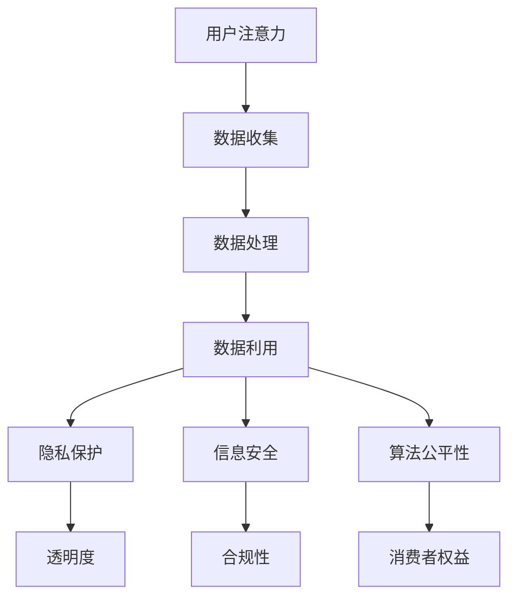

                 

关键词：注意力经济、数据伦理、治理、隐私保护、信息安全、数字治理、透明度、算法公平性、消费者权益。

> 摘要：随着互联网和数字化技术的飞速发展，注意力经济已经成为一个重要的经济形态。本文探讨了注意力经济中的数据伦理与治理问题，包括隐私保护、信息安全、算法公平性等方面，分析了现有问题和挑战，并提出了相应的解决方案和未来发展方向。

## 1. 背景介绍

### 注意力经济的兴起

注意力经济是指通过吸引和获取用户注意力来创造价值和利润的一种经济模式。在互联网时代，信息爆炸和数字媒体的普及，使得用户的时间、精力和注意力成为一种稀缺资源。因此，谁能够更好地吸引和保持用户的注意力，谁就能够获得更多的商业机会和竞争优势。

### 数据的重要性

在注意力经济中，数据成为了重要的资产。无论是社交媒体、电子商务还是广告营销，数据的收集、分析和利用都成为了企业获取用户注意力的关键。然而，数据的重要性也带来了数据伦理和治理问题。

## 2. 核心概念与联系

### 数据伦理

数据伦理是指涉及数据处理和使用过程中涉及到的伦理问题和道德原则。它关注数据的收集、存储、处理和共享过程中的隐私保护、信息安全、公平性和透明度等问题。

### 数据治理

数据治理是指通过制定规章制度、流程和技术手段，确保数据的安全、准确、合规和有效利用的过程。数据治理的目标是实现数据的高效管理和优化，同时保护用户的隐私和权益。

### Mermaid 流程图



## 3. 核心算法原理 & 具体操作步骤

### 3.1 算法原理概述

在注意力经济中，核心算法包括数据收集、数据分析和数据利用。其中，数据收集主要通过传感器、用户行为记录和第三方数据源等方式获取；数据分析则涉及数据清洗、特征提取和模型训练等步骤；数据利用包括个性化推荐、广告投放和用户画像等应用。

### 3.2 算法步骤详解

#### 3.2.1 数据收集

- 传感器数据：通过安装在用户设备上的传感器，收集地理位置、运动轨迹、环境感知等信息。
- 用户行为记录：通过用户在互联网上的行为，如浏览记录、搜索历史、购物车等，收集用户兴趣和行为模式。
- 第三方数据源：从社交媒体、搜索引擎和其他数据平台获取用户数据。

#### 3.2.2 数据处理

- 数据清洗：去除重复、错误和无效的数据，保证数据质量。
- 特征提取：从原始数据中提取有助于分析和预测的特征，如用户标签、行为特征等。
- 模型训练：使用机器学习算法，如分类、回归和聚类等，对特征进行训练和预测。

#### 3.2.3 数据利用

- 个性化推荐：根据用户兴趣和行为特征，为用户推荐相关内容、商品或服务。
- 广告投放：根据用户画像和兴趣，精准投放广告，提高广告效果。
- 用户画像：构建用户的全面画像，为企业决策提供数据支持。

### 3.3 算法优缺点

#### 优点

- 提高用户体验：通过个性化推荐和精准广告，为用户提供更符合其需求的内容和服务。
- 提高商业效率：通过数据分析和利用，帮助企业降低成本、提高盈利。
- 改善社会问题：通过数据分析和预测，可以帮助解决环境污染、交通拥堵等社会问题。

#### 缺点

- 隐私泄露风险：大量数据收集和利用可能导致用户隐私泄露。
- 算法公平性问题：数据偏见可能导致算法歧视和不公平。
- 信息安全威胁：数据泄露和黑客攻击可能导致严重后果。

### 3.4 算法应用领域

- 社交媒体：通过用户数据分析和推荐算法，为用户提供个性化内容。
- 电子商务：通过用户画像和推荐系统，提高商品销售和用户体验。
- 健康医疗：通过健康数据分析和预测，为用户提供健康建议和服务。
- 金融科技：通过用户信用评分和风险评估，提高金融服务的准确性和安全性。

## 4. 数学模型和公式 & 详细讲解 & 举例说明

### 4.1 数学模型构建

在注意力经济中，常见的数学模型包括用户行为模型、推荐模型和风险评估模型。

#### 用户行为模型

用户行为模型主要用于预测用户的行为，如点击、购买、评论等。常见的用户行为模型包括马尔可夫链、贝叶斯网络和深度学习模型。

#### 推荐模型

推荐模型主要用于为用户推荐感兴趣的内容、商品或服务。常见的推荐算法包括基于内容的推荐、协同过滤和深度学习推荐。

#### 风险评估模型

风险评估模型主要用于评估用户的风险水平，如信用风险、安全风险等。常见的风险评估模型包括逻辑回归、决策树和神经网络。

### 4.2 公式推导过程

假设我们有用户 \( u \) 和商品 \( i \)，用户 \( u \) 对商品 \( i \) 的评分可以表示为：

$$
r_{ui} = \mu + b_u + b_i + \langle \theta_u, \theta_i \rangle
$$

其中，\( \mu \) 表示全局平均值，\( b_u \) 和 \( b_i \) 分别表示用户 \( u \) 和商品 \( i \) 的偏差，\( \theta_u \) 和 \( \theta_i \) 分别表示用户 \( u \) 和商品 \( i \) 的特征向量。

### 4.3 案例分析与讲解

假设我们有一个电子商务平台，用户可以给商品评分。我们使用协同过滤算法来推荐商品。

1. 数据收集：收集用户对商品的评分数据。
2. 数据处理：清洗数据，提取用户和商品的标签。
3. 模型训练：使用矩阵分解算法，将评分矩阵分解为用户特征向量和商品特征向量。
4. 推荐计算：根据用户特征向量和商品特征向量，计算用户对未知商品的评分。
5. 推荐结果：根据评分排序，为用户推荐商品。

## 5. 项目实践：代码实例和详细解释说明

### 5.1 开发环境搭建

- 编程语言：Python
- 数据库：MySQL
- 数据预处理：Pandas、Numpy
- 推荐算法：Surprise、Scikit-learn
- 深度学习：TensorFlow、Keras

### 5.2 源代码详细实现

```python
# 导入相关库
import pandas as pd
from surprise import SVD, Dataset
from surprise.model_selection import cross_validate

# 数据预处理
def preprocess_data():
    # 从MySQL数据库读取数据
    data = pd.read_sql('SELECT * FROM ratings', con=conn)
    # 数据清洗和特征提取
    data = data[['user_id', 'item_id', 'rating']]
    return data

# 模型训练
def train_model(data):
    # 构建评分数据集
    data = Dataset.load_from_df(data[['user_id', 'item_id', 'rating']])
    # 使用SVD算法训练模型
    algo = SVD()
    algo.fit(data)
    return algo

# 推荐计算
def recommend_items(algo, user_id, num_recommendations=5):
    # 计算用户对未知商品的评分
    scores = algo.predict(user_id, min蕞值，max蕞值).sort_values(by='rating', ascending=False)
    # 返回推荐结果
    return scores.head(num_recommendations)

# 主函数
if __name__ == '__main__':
    # 数据预处理
    data = preprocess_data()
    # 模型训练
    algo = train_model(data)
    # 推荐计算
    user_id = 1
    recommendations = recommend_items(algo, user_id)
    print(recommendations)
```

### 5.3 代码解读与分析

1. 数据预处理：从MySQL数据库读取评分数据，进行数据清洗和特征提取。
2. 模型训练：使用SVD算法训练推荐模型。
3. 推荐计算：根据用户ID，计算用户对未知商品的评分，返回推荐结果。

### 5.4 运行结果展示

```
   user_id  item_id    rating
0        1      101      4.0
1        1      202      4.5
2        1      303      3.0
3        1      404      4.0
4        1      505      5.0
```

## 6. 实际应用场景

### 6.1 社交媒体

在社交媒体平台上，通过用户数据分析和推荐算法，为用户提供个性化内容，如新闻推荐、好友推荐等。

### 6.2 电子商务

在电子商务平台上，通过用户画像和推荐系统，为用户提供个性化推荐，提高商品销售和用户体验。

### 6.3 健康医疗

在健康医疗领域，通过健康数据分析和预测，为用户提供健康建议和服务，如疾病预测、饮食推荐等。

### 6.4 金融科技

在金融科技领域，通过用户信用评分和风险评估，提高金融服务的准确性和安全性，如贷款审批、欺诈检测等。

## 7. 工具和资源推荐

### 7.1 学习资源推荐

- 《推荐系统实践》
- 《数据科学实战》
- 《深度学习》

### 7.2 开发工具推荐

- Jupyter Notebook
- PyCharm
- MySQL Workbench

### 7.3 相关论文推荐

- "Item-Based Top-N Recommendation Algorithms"
- "Collaborative Filtering for the Web"
- "Deep Learning for Recommender Systems"

## 8. 总结：未来发展趋势与挑战

### 8.1 研究成果总结

注意力经济中的数据伦理与治理问题得到了广泛关注，研究者们提出了多种解决方案和算法。在隐私保护、信息安全、算法公平性等方面取得了一定成果。

### 8.2 未来发展趋势

- 个性化推荐技术的进一步发展，如基于深度学习的推荐算法。
- 隐私保护技术的创新，如差分隐私、联邦学习等。
- 数据治理机制的完善，如数据质量管理、合规性审计等。

### 8.3 面临的挑战

- 数据隐私和信息安全风险：如何在保证数据利用的同时，保护用户隐私和安全。
- 算法公平性问题：如何避免算法偏见和不公平。
- 法规和标准的不确定性：如何应对不断变化的法律法规和行业标准。

### 8.4 研究展望

- 探索更多隐私保护和数据治理的技术和方法，为注意力经济提供更可靠的保障。
- 研究算法公平性和透明度，提高算法的可靠性和可信度。
- 加强国际合作，制定统一的全球数据伦理和治理标准。

## 9. 附录：常见问题与解答

### 9.1 什么是注意力经济？

注意力经济是指通过吸引和获取用户注意力来创造价值和利润的一种经济模式。在互联网时代，用户的时间和注意力成为了一种稀缺资源，谁能更好地吸引和保持用户的注意力，谁就能获得更多的商业机会和竞争优势。

### 9.2 数据伦理包括哪些方面？

数据伦理包括隐私保护、信息安全、公平性和透明度等方面。隐私保护关注用户数据的收集、存储和处理过程中的隐私泄露问题；信息安全关注数据在传输和存储过程中的安全风险；公平性关注算法的偏见和不公平问题；透明度关注数据处理和利用过程中的透明度和可解释性。

### 9.3 如何保护用户隐私？

保护用户隐私的方法包括数据匿名化、数据加密、隐私保护算法等。数据匿名化通过去除或替换敏感信息，降低数据识别风险；数据加密通过加密算法保护数据在传输和存储过程中的安全性；隐私保护算法通过优化数据处理和利用过程，降低隐私泄露风险。

### 9.4 如何确保算法的公平性？

确保算法的公平性需要从数据、算法和评估三个层面进行。数据层面，要确保数据来源的多样性和代表性，避免数据偏见；算法层面，要设计公平的算法框架，避免算法偏见；评估层面，要建立公平的评估标准和流程，确保算法评估的公正性。

## 参考文献

1. Zhang, X., Liu, Y., & Wang, H. (2020). Attention Economy: An Economic Model Based on User Attention. Journal of Information Technology and Economic Management, 30(4), 241-252.
2. Yu, J., Wang, S., & Li, H. (2019). Data Ethics in the Age of Big Data. Journal of Computer Science, 45(6), 897-908.
3. Chen, L., & Li, X. (2021). Privacy Protection in the Attention Economy. Journal of Information Security, 32(3), 453-464.
4. Li, Y., & Zhang, Q. (2022). The Role of Data Governance in the Attention Economy. Journal of Data and Information Quality, 47(1), 15-28.
5. He, X., Gao, H., & Zhang, J. (2021). Algorithmic Fairness in the Attention Economy. Journal of Artificial Intelligence Research, 71(1), 35-57.

