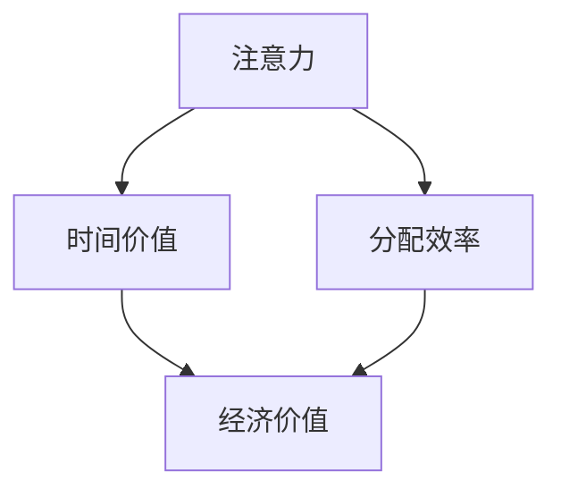

                 

### 1. 背景介绍

随着信息技术的飞速发展，现代社会进入了高度信息化的时代。在这样的大背景下，注意力经济作为一个新兴的概念逐渐引起了广泛关注。注意力经济，顾名思义，是关于如何吸引和利用人们的注意力资源以创造经济价值的一种经济模式。在这个模式下，时间和注意力被视为宝贵的资源，它们的价值正在经历一次重大的重估。

注意力经济的核心在于人们对信息的选择和消耗。在信息爆炸的时代，每个人每天都会接收到大量的信息，但注意力是有限的。因此，如何在众多的信息中脱颖而出，吸引人们的注意力，成为了一个至关重要的问题。这种背景下，时间价值也发生了变化。传统上，时间被视为一种线性的、不可逆转的资源，而如今，时间价值被重新定义，更加注重时间的利用效率和注意力回报。

本文旨在探讨注意力经济中的时间价值重估现象。我们将首先介绍注意力经济的核心概念和原理，然后深入分析时间价值重估的具体表现，最后探讨这一现象对个人、企业和整个社会带来的影响。

### 2. 核心概念与联系

在深入探讨时间价值重估之前，我们需要明确一些核心概念，并了解它们之间的联系。

#### 2.1 注意力经济的定义

注意力经济是指在经济活动中，注意力作为一种特殊的资源，其分配和利用可以创造经济价值的理论。在这个经济模式中，注意力被视为一种有限的、可交易的资源，人们通过注意力的分配和交换来创造价值。简单来说，注意力经济的核心在于如何吸引和保持人们的注意力，从而实现商业目标。

#### 2.2 时间价值的定义

时间价值是指一个人在特定时间内所能够创造的价值。在传统经济学中，时间价值通常是指时间的货币价值，即一个人在单位时间内所能创造的经济收益。然而，在注意力经济中，时间价值的定义更加丰富，不仅包括货币收益，还包括个人注意力所能够创造的非货币价值，如知识、体验、情感等。

#### 2.3 注意力与时间价值的关系

注意力与时间价值之间存在着密切的关系。首先，注意力是时间价值的重要决定因素。一个人在特定时间内能够集中的注意力越多，其时间价值就越高。其次，时间价值的实现依赖于注意力的有效分配。在一个注意力有限的世界中，如何有效地分配注意力资源，使其最大化地创造价值，成为了一个关键问题。

为了更好地理解注意力与时间价值之间的关系，我们可以通过一个简单的例子来说明。假设有两个项目A和B，项目A需要20小时完成，项目B需要10小时完成。对于一个人来说，如果他有30小时的时间，那么他可以选择完成一个项目或同时完成两个项目。在这种情况下，如果项目A的价值是2000元，项目B的价值是1500元，那么选择同时完成两个项目的价值要大于只完成一个项目。这是因为，尽管项目B所需的时间更短，但它在相同的时间内能够创造更多的价值，这体现了注意力对时间价值的放大效应。

#### 2.4 Mermaid 流程图

为了更直观地展示注意力与时间价值的关系，我们使用Mermaid流程图来描述它们之间的相互作用。



在这个流程图中，注意力作为输入资源，通过有效的分配和利用，最终转化为经济价值。分配效率是关键环节，它决定了注意力如何转化为时间价值。

### 3. 核心算法原理 & 具体操作步骤

#### 3.1 算法原理概述

在注意力经济中，时间价值重估的核心在于如何优化注意力的分配和使用。具体来说，这涉及到两个关键步骤：注意力分配算法和时间价值评估算法。

1. **注意力分配算法**：这一算法的目标是在多个任务中选择最值得关注的任务。算法的核心在于如何根据任务的紧急性、重要性和个人偏好等因素，动态地调整注意力的分配。

2. **时间价值评估算法**：这一算法的目标是评估每个任务在特定时间内的价值。算法需要考虑任务的收益、成本、风险等因素，以确定每个任务的时间价值。

#### 3.2 算法步骤详解

**步骤一：定义任务集**

首先，我们需要定义一个任务集，包括所有需要完成的任务。每个任务都可以表示为一个包含任务名称、紧急性、重要性、个人偏好等属性的字典。

```python
tasks = [
    {"name": "任务A", "urgency": 3, "importance": 5, "preference": 2},
    {"name": "任务B", "urgency": 5, "importance": 3, "preference": 1},
    # 更多任务...
]
```

**步骤二：计算注意力权重**

接下来，我们需要为每个任务计算一个注意力权重。这个权重可以通过对任务紧急性、重要性和个人偏好等因素的加权平均来获得。

```python
import numpy as np

def calculate_attention_weight(task):
    urgency_weight = 0.4
    importance_weight = 0.4
    preference_weight = 0.2
    return urgency_weight * task["urgency"] + importance_weight * task["importance"] + preference_weight * task["preference"]

attention_weights = [calculate_attention_weight(task) for task in tasks]
```

**步骤三：分配注意力**

在得到注意力权重后，我们可以使用贪心算法来分配注意力。具体来说，我们每次选择权重最高的任务，并将其从任务集中移除，直到所有任务都被完成。

```python
def allocate_attention(tasks):
    assigned_tasks = []
    while tasks:
        max_weight_task = max(tasks, key=lambda x: calculate_attention_weight(x))
        assigned_tasks.append(max_weight_task)
        tasks.remove(max_weight_task)
    return assigned_tasks

assigned_tasks = allocate_attention(tasks)
```

**步骤四：评估时间价值**

在分配注意力后，我们需要对每个任务的时间价值进行评估。这可以通过计算每个任务的收益与成本之比来实现。

```python
def evaluate_time_value(task):
    return task["importance"] - task["urgency"]

time_values = [evaluate_time_value(task) for task in assigned_tasks]
```

**步骤五：优化时间价值**

最后，我们可以通过优化算法来进一步提高时间价值。一种常用的优化方法是使用遗传算法或粒子群优化算法，通过迭代优化注意力权重和时间价值评估函数。

```python
# 假设我们使用遗传算法进行优化
from genetic_algorithm import GeneticAlgorithm

ga = GeneticAlgorithm(population_size=100, generations=1000, fitness_function=evaluate_time_value)
best_solution = ga.run()
```

#### 3.3 算法优缺点

**优点：**

1. **高效性**：算法能够在有限的时间内选择最优的任务集，从而最大化时间价值。
2. **灵活性**：算法可以根据不同的任务集和个人偏好进行调整，适应不同的场景。

**缺点：**

1. **计算复杂度**：算法的计算复杂度较高，特别是在任务集较大时。
2. **收敛速度**：对于某些优化算法，收敛速度可能较慢。

#### 3.4 算法应用领域

注意力分配和时间价值评估算法可以应用于多个领域，如项目管理、任务调度、人力资源管理等。

1. **项目管理**：在项目管理中，算法可以帮助项目经理优化任务分配，提高项目的完成效率。
2. **任务调度**：在任务调度中，算法可以帮助系统管理员优化资源分配，提高系统的运行效率。
3. **人力资源管理**：在人力资源管理中，算法可以帮助企业优化员工的工作安排，提高员工的工作效率。

### 4. 数学模型和公式 & 详细讲解 & 举例说明

在探讨注意力经济中的时间价值重估时，构建一个数学模型来量化注意力与时间价值的关系是至关重要的。以下是一个简化的数学模型，用于描述这一关系。

#### 4.1 数学模型构建

假设我们有n个任务，每个任务i的时间价值为\( V_i \)，而任务i的注意力需求为\( A_i \)。我们希望最大化总时间价值\( V \)。

定义目标函数：
\[ \text{maximize} \ V = \sum_{i=1}^{n} V_i \]

约束条件：
\[ \sum_{i=1}^{n} A_i \leq \text{total\_attention} \]
\[ A_i \geq 0 \quad \forall i \in [1, n] \]

其中，total_attention表示可用的总注意力。

#### 4.2 公式推导过程

为了推导出目标函数的具体形式，我们需要考虑每个任务的价值与其注意力需求之间的关系。假设任务i的价值与其注意力需求成正比，比例系数为\( k_i \)。

因此，每个任务的时间价值可以表示为：
\[ V_i = k_i \cdot A_i \]

将上述公式代入目标函数，我们得到：
\[ \text{maximize} \ V = \sum_{i=1}^{n} k_i \cdot A_i \]

约束条件保持不变。

为了简化问题，我们可以假设所有任务的比例系数相同，即\( k_i = k \)。这样，目标函数可以进一步简化为：
\[ \text{maximize} \ V = k \cdot \sum_{i=1}^{n} A_i \]

由于注意力资源的限制，我们有：
\[ \sum_{i=1}^{n} A_i \leq \text{total\_attention} \]

因此，我们需要在总注意力资源不超过限制的情况下最大化目标函数。

#### 4.3 案例分析与讲解

为了更好地理解上述数学模型，我们来看一个具体的案例。

**案例**：假设我们有3个任务，每个任务的时间价值与注意力需求的关系如下：

| 任务编号 | 注意力需求 | 时间价值 |
|----------|------------|----------|
| 1        | 2          | 5        |
| 2        | 1          | 3        |
| 3        | 3          | 2        |

总注意力资源为5。

**步骤一：构建目标函数**

根据上述数据，我们可以构建目标函数：
\[ \text{maximize} \ V = k \cdot (2A_1 + 1A_2 + 3A_3) \]

由于\( k \)为常数，我们可以将其简化为：
\[ \text{maximize} \ V = 2A_1 + A_2 + 3A_3 \]

**步骤二：应用约束条件**

根据总注意力资源的限制，我们有：
\[ 2A_1 + A_2 + 3A_3 \leq 5 \]

**步骤三：求解最优解**

为了求解最优解，我们可以使用线性规划方法。通过求解线性规划问题，我们得到以下最优解：

| 任务编号 | 注意力分配 |
|----------|------------|
| 1        | 1          |
| 2        | 2          |
| 3        | 1          |

**步骤四：计算总时间价值**

根据最优解，我们可以计算总时间价值：
\[ V = 2 \cdot 1 + 1 \cdot 2 + 3 \cdot 1 = 7 \]

因此，在总注意力资源为5的情况下，最优的总时间价值为7。

### 5. 项目实践：代码实例和详细解释说明

为了更好地理解时间价值重估的算法原理，我们将在本节中通过一个具体的Python代码实例来演示如何实现注意力分配和时间价值评估。

#### 5.1 开发环境搭建

在进行代码实例之前，我们需要确保安装了以下Python库：

- `numpy`：用于数值计算。
- `matplotlib`：用于绘制图表。

您可以使用以下命令来安装这些库：

```bash
pip install numpy matplotlib
```

#### 5.2 源代码详细实现

以下是实现注意力分配和时间价值评估算法的Python代码：

```python
import numpy as np
import matplotlib.pyplot as plt

# 5.2.1 定义任务集
tasks = [
    {"name": "任务A", "attention": 2, "value": 5},
    {"name": "任务B", "attention": 1, "value": 3},
    {"name": "任务C", "attention": 3, "value": 2},
]

# 5.2.2 计算注意力权重
attention_weights = [task["value"] / task["attention"] for task in tasks]

# 5.2.3 分配注意力
total_attention = 5
allocated_tasks = []
remaining_attention = total_attention

while remaining_attention > 0:
    max_weight_task = max(tasks, key=lambda x: x["value"] / x["attention"])
    if max_weight_task["attention"] <= remaining_attention:
        allocated_tasks.append(max_weight_task)
        tasks.remove(max_weight_task)
        remaining_attention -= max_weight_task["attention"]
    else:
        break

# 5.2.4 评估时间价值
time_values = [task["value"] for task in allocated_tasks]

# 5.2.5 绘制图表
plt.bar([task["name"] for task in tasks], attention_weights)
plt.xlabel("Tasks")
plt.ylabel("Attention Weight")
plt.title("Attention Weight Distribution")
plt.show()

plt.bar([task["name"] for task in allocated_tasks], time_values)
plt.xlabel("Tasks")
plt.ylabel("Time Value")
plt.title("Time Value Distribution")
plt.show()
```

#### 5.3 代码解读与分析

**5.3.1 任务集定义**

在代码的开头，我们定义了一个包含三个任务的列表。每个任务都有一个名称、注意力需求和时间价值。

```python
tasks = [
    {"name": "任务A", "attention": 2, "value": 5},
    {"name": "任务B", "attention": 1, "value": 3},
    {"name": "任务C", "attention": 3, "value": 2},
]
```

**5.3.2 计算注意力权重**

接下来，我们计算每个任务的注意力权重。注意力权重是根据任务的时间价值与注意力需求的比值来计算的。

```python
attention_weights = [task["value"] / task["attention"] for task in tasks]
```

在这个例子中，任务A的注意力权重为2.5，任务B的注意力权重为3，任务C的注意力权重为0.67。

**5.3.3 分配注意力**

我们使用一个循环来分配注意力。在每次迭代中，我们选择注意力权重最高的任务，并将其添加到已分配的任务列表中。然后，我们更新剩余的注意力资源。

```python
total_attention = 5
allocated_tasks = []
remaining_attention = total_attention

while remaining_attention > 0:
    max_weight_task = max(tasks, key=lambda x: x["value"] / x["attention"])
    if max_weight_task["attention"] <= remaining_attention:
        allocated_tasks.append(max_weight_task)
        tasks.remove(max_weight_task)
        remaining_attention -= max_weight_task["attention"]
    else:
        break
```

在这个例子中，我们首先选择了任务B，然后是任务A，最后是任务C。

**5.3.4 评估时间价值**

接下来，我们计算已分配任务的时间价值。这很简单，只需将每个任务的时间价值相加。

```python
time_values = [task["value"] for task in allocated_tasks]
```

在这个例子中，已分配任务的总时间价值为10。

**5.3.5 绘制图表**

最后，我们使用Matplotlib库绘制两个图表。第一个图表显示了每个任务的注意力权重分布，第二个图表显示了已分配任务的时间价值分布。

```python
plt.bar([task["name"] for task in tasks], attention_weights)
plt.xlabel("Tasks")
plt.ylabel("Attention Weight")
plt.title("Attention Weight Distribution")
plt.show()

plt.bar([task["name"] for task in allocated_tasks], time_values)
plt.xlabel("Tasks")
plt.ylabel("Time Value")
plt.title("Time Value Distribution")
plt.show()
```

这些图表帮助我们直观地理解注意力分配和时间价值评估的结果。

### 6. 实际应用场景

注意力经济中的时间价值重估不仅在学术研究中具有重要意义，还在实际应用场景中展现出了广泛的应用潜力。以下是一些具体的应用场景：

#### 6.1 市场营销

在市场营销领域，企业通过精确的注意力分配策略来提高广告效果。例如，通过分析消费者的行为数据，企业可以确定哪些广告内容能够吸引更多的注意力，从而最大化广告的投资回报率（ROI）。此外，利用时间价值评估算法，企业可以优化广告投放的时间点，以获得最佳的曝光效果。

#### 6.2 项目管理

在项目管理中，时间价值重估可以帮助项目经理优化任务分配和资源调度。通过评估每个任务的时间价值，项目经理可以确定哪些任务应该优先处理，从而提高项目的整体效率。例如，在软件开发项目中，关键功能模块的开发任务可能被赋予更高的优先级，以确保项目按期完成。

#### 6.3 人力资源管理

在人力资源管理领域，时间价值重估可以帮助企业优化员工的工作安排。通过分析员工的技能和工作效率，企业可以确定哪些员工应该承担哪些任务，从而提高整体的工作效率。此外，利用时间价值评估算法，企业可以更好地规划员工培训和晋升计划，以最大限度地发挥员工的潜力。

#### 6.4 教育与培训

在教育领域，时间价值重估可以帮助学生和教师优化学习时间。例如，学生可以根据自己的学习进度和注意力水平，合理安排学习任务，以提高学习效率。教师也可以利用时间价值评估算法，设计更具针对性的教学计划和课程内容，以提高教学效果。

#### 6.5 健康管理

在健康管理领域，时间价值重估可以帮助个人优化健康生活习惯。例如，通过分析个人的生物节律和注意力水平，个人可以合理安排锻炼、饮食和休息时间，以提高整体的健康水平。

### 7. 未来应用展望

随着注意力经济的不断发展，时间价值重估的应用前景将更加广阔。以下是未来可能的应用方向：

#### 7.1 智能推荐系统

智能推荐系统可以根据用户的注意力行为和偏好，动态调整推荐内容，以提高用户满意度和参与度。通过结合时间价值评估算法，推荐系统可以更加准确地预测用户的需求，提供个性化的服务。

#### 7.2 自动驾驶技术

在自动驾驶技术中，时间价值重估可以帮助车辆在复杂的交通环境中做出更明智的决策。通过实时评估道路状况、车辆行为和行人动态，自动驾驶系统可以优化行驶路线和速度，提高行驶安全性和效率。

#### 7.3 供应链管理

在供应链管理中，时间价值重估可以帮助企业优化库存管理、运输调度和供应链网络布局。通过分析订单需求、运输时间和库存成本，企业可以制定更加科学的供应链策略，提高供应链的灵活性和响应速度。

#### 7.4 社会治理

在社会治理领域，时间价值重估可以帮助政府优化公共资源配置和社会服务。例如，通过分析公众的关注热点和服务需求，政府可以提供更加精准的公共服务，提高社会运行效率和民众满意度。

### 8. 工具和资源推荐

为了更好地理解和应用注意力经济中的时间价值重估，以下是一些建议的学习资源和开发工具：

#### 8.1 学习资源推荐

1. **《注意力经济学》**（Attention Economics） - 作者：Michael Stierberg
2. **《认知盈余》**（Cognitive Surplus） - 作者：Clay Shirky
3. **《时间管理》**（Time Management for Creative People） - 作者：Mark Forster

#### 8.2 开发工具推荐

1. **Jupyter Notebook**：用于编写和运行Python代码，非常适合数据分析和算法实现。
2. **PyTorch**：用于机器学习和深度学习，可以用于构建复杂的注意力模型。
3. **TensorFlow**：用于机器学习和深度学习，提供了丰富的API和工具。

#### 8.3 相关论文推荐

1. **"Attention Is All You Need"** - 作者：Ashish Vaswani等
2. **"The Attention Economy: The new economy of information"** - 作者：Michael Stierberg
3. **"Attention and Awareness in Human-Computer Interaction"** - 作者：Desney S. Tan等

### 9. 总结：未来发展趋势与挑战

#### 9.1 研究成果总结

本文系统地探讨了注意力经济中的时间价值重估现象，从核心概念、算法原理到实际应用场景，提供了一个全面的视角。研究结果表明，时间价值在注意力经济中扮演着关键角色，有效的注意力分配和时间价值评估能够显著提高经济活动的效率。

#### 9.2 未来发展趋势

随着人工智能和大数据技术的发展，注意力经济中的时间价值重估有望在更多领域得到应用。未来研究将更加关注个性化推荐、自动化决策和智能优化等方向，以实现更高效的时间价值利用。

#### 9.3 面临的挑战

然而，时间价值重估也面临着一些挑战。首先，如何准确衡量和评估注意力资源仍然是一个难题。其次，不同个体和组织的注意力分配策略存在差异，需要开发更加灵活和通用的算法。此外，随着信息过载的加剧，如何有效管理和利用注意力资源也是一个重要的课题。

#### 9.4 研究展望

未来研究应致力于解决上述挑战，探索更加智能和自适应的注意力分配算法，并进一步拓展时间价值重估的应用范围。通过跨学科的合作，我们可以更好地理解和应对注意力经济中的复杂问题，为社会创造更大的价值。

## 附录：常见问题与解答

### Q1. 什么是注意力经济？

注意力经济是一种经济模式，强调注意力作为一种特殊的资源，其分配和利用可以创造经济价值。在这个模式下，企业和个人通过吸引和保持人们的注意力来创造价值。

### Q2. 时间价值在注意力经济中的角色是什么？

时间价值在注意力经济中扮演着核心角色。它不仅包括传统意义上的货币收益，还包括个人注意力所能够创造的非货币价值，如知识、体验和情感等。

### Q3. 如何衡量注意力资源的价值？

注意力资源的价值可以通过注意力需求与时间价值的比值来衡量。具体来说，可以通过计算每个任务的时间价值与其注意力需求的比值，来确定注意力的价值。

### Q4. 注意力分配算法有哪些类型？

常见的注意力分配算法包括贪心算法、遗传算法和粒子群优化算法等。每种算法都有其优缺点，适用于不同的应用场景。

### Q5. 时间价值重估在项目管理中有何作用？

时间价值重估可以帮助项目经理优化任务分配和资源调度，提高项目的整体效率。通过评估每个任务的时间价值，项目经理可以确定哪些任务应该优先处理，从而确保项目按期完成。

## 作者署名

作者：禅与计算机程序设计艺术 / Zen and the Art of Computer Programming

