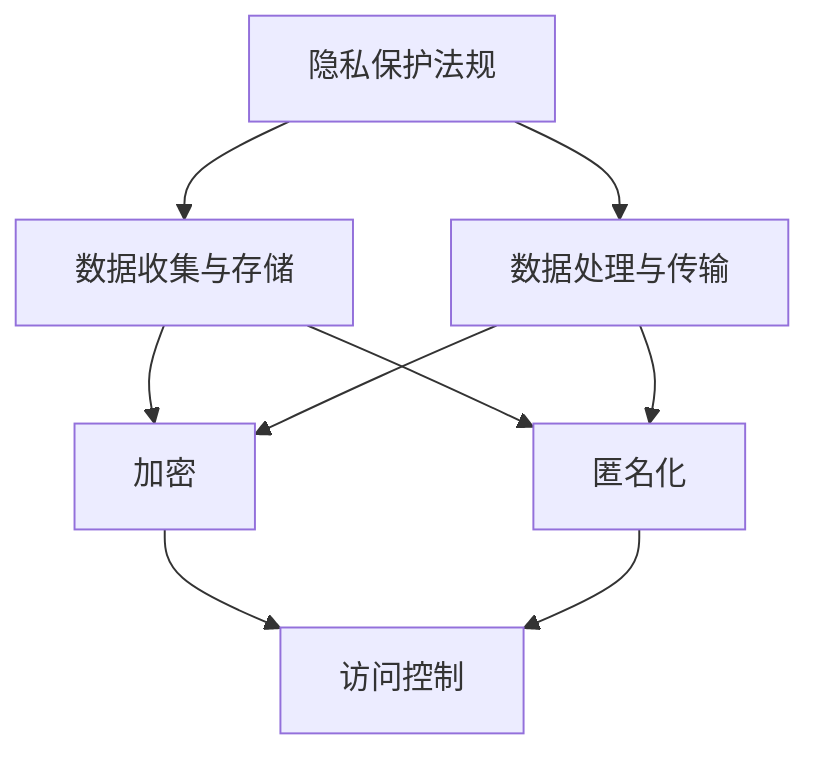

                 

关键词：注意力经济、隐私保护、数据安全、加密算法、隐私计算、数据匿名化

> 摘要：随着互联网和数字化技术的飞速发展，数据已经成为现代社会的重要资源，然而随之而来的隐私保护问题也日益突出。本文将从注意力经济的角度，探讨隐私保护的重要性、现有隐私保护技术及其挑战，并提出未来隐私保护技术的发展方向。

## 1. 背景介绍

在注意力经济时代，数据的价值愈发凸显。从个人社交媒体活动到电子商务交易，数据无处不在。然而，数据的采集、存储和利用过程中，隐私保护问题成为一个不可忽视的重要议题。隐私泄露可能导致个人身份被冒用、财产损失，甚至更严重的后果。因此，如何在保障数据价值的同时，确保数据主体的隐私权，成为当前研究的热点。

### 注意力经济的兴起

注意力经济（Attention Economy）是一种基于用户注意力的经济模式。在这个模式中，用户的时间和注意力被视为宝贵的资源，而吸引这些资源则成为企业和个人竞争的关键。社交媒体、在线广告、内容创作等都是注意力经济的典型应用场景。例如，在社交媒体平台上，用户通过浏览、点赞、评论等方式贡献自己的注意力，而平台则通过这些数据来实现广告变现、内容推荐等商业价值。

### 隐私保护的挑战

随着数据采集技术的进步，个人隐私信息被大量收集和存储。这些数据包括但不限于个人身份信息、财务信息、健康记录等。隐私保护面临的主要挑战包括：

- **数据泄露**：黑客攻击、内部泄露、系统漏洞等可能导致大量用户数据泄露。
- **滥用风险**：未经用户同意，数据可能被用于各种未经授权的商业目的。
- **合规性**：随着隐私保护法规的日益严格，企业需要投入大量资源来确保合规。

## 2. 核心概念与联系

在讨论隐私保护之前，我们需要了解一些核心概念和它们之间的联系。以下是隐私保护相关的一些重要概念：

### 隐私保护概念

1. **隐私**：隐私是指个人对于自己的私人生活、行为和信息的控制权。
2. **隐私权**：隐私权是指个人享有对自己隐私信息的保护权利。
3. **隐私泄露**：隐私泄露是指个人隐私信息未经授权被公开或被他人获取和使用。

### 隐私保护机制

1. **加密**：加密是通过算法将数据转换成密文，以防止未授权访问。
2. **匿名化**：匿名化是通过删除或修改敏感信息，使得数据无法直接关联到特定个人。
3. **访问控制**：访问控制是通过权限管理来限制对数据的访问，确保只有授权用户可以访问。
4. **数据脱敏**：数据脱敏是一种在保留数据价值的同时，保护隐私信息的技术。

### 隐私保护架构

为了实现隐私保护，我们需要构建一个包含多个层面的综合架构：

1. **数据收集与存储**：在数据收集和存储环节，采用加密、匿名化等技术来保护数据。
2. **数据处理与传输**：在数据处理和传输过程中，采用加密、隐私计算等技术来确保数据安全。
3. **隐私保护法规**：通过制定和执行隐私保护法规，规范企业的数据处理行为。

### Mermaid 流程图

以下是隐私保护相关概念和架构的 Mermaid 流程图：



## 3. 核心算法原理 & 具体操作步骤

### 3.1 算法原理概述

隐私保护的核心算法主要涉及加密算法、匿名化算法和隐私计算算法。以下是这些算法的基本原理：

1. **加密算法**：加密算法通过将明文转换为密文，保护数据在传输和存储过程中的安全。常见的加密算法包括对称加密和非对称加密。
2. **匿名化算法**：匿名化算法通过删除或修改敏感信息，使得数据无法直接关联到特定个人。常见的匿名化算法包括K-匿名和l-diversity。
3. **隐私计算算法**：隐私计算算法在数据处理和计算过程中，保护数据的隐私。常见的隐私计算算法包括差分隐私和同态加密。

### 3.2 算法步骤详解

1. **加密算法步骤**：

   - 选择加密算法（如AES、RSA）；
   - 生成密钥（对于对称加密，密钥由算法自动生成；对于非对称加密，密钥对由算法生成）；
   - 对明文进行加密，生成密文；
   - 对密文进行传输或存储。

2. **匿名化算法步骤**：

   - 选择匿名化算法（如K-匿名、l-diversity）；
   - 对数据进行预处理（如去噪、归一化）；
   - 对敏感信息进行替换或删除；
   - 生成匿名化数据。

3. **隐私计算算法步骤**：

   - 选择隐私计算算法（如差分隐私、同态加密）；
   - 对数据进行预处理（如去噪、归一化）；
   - 在不泄露隐私的前提下，对数据进行计算；
   - 输出计算结果。

### 3.3 算法优缺点

1. **加密算法**：

   - 优点：能够有效保护数据在传输和存储过程中的安全；
   - 缺点：加密和解密过程需要计算资源，可能会影响数据处理的效率。

2. **匿名化算法**：

   - 优点：能够有效保护数据的隐私，减少数据泄露的风险；
   - 缺点：可能会降低数据的可用性，影响数据分析的准确性。

3. **隐私计算算法**：

   - 优点：能够在数据处理和计算过程中保护数据隐私，适用于分布式计算场景；
   - 缺点：计算复杂度高，可能会影响数据处理的速度。

### 3.4 算法应用领域

1. **加密算法**：广泛应用于金融、医疗、政府等领域的数据安全保护。
2. **匿名化算法**：广泛应用于数据分析和科研领域，如医疗数据分析、用户行为分析等。
3. **隐私计算算法**：广泛应用于云计算、区块链等领域，如分布式数据处理、隐私保护交易等。

## 4. 数学模型和公式 & 详细讲解 & 举例说明

### 4.1 数学模型构建

隐私保护涉及多个数学模型，以下是几个常见的数学模型：

1. **加密模型**：

   - 对称加密模型：设\(E_k(x)\)为加密函数，\(D_k(y)\)为解密函数，\(k\)为密钥，\(x\)为明文，\(y\)为密文。
   - 非对称加密模型：设\(E_p(x)\)为加密函数，\(D_p(y)\)为解密函数，\(p\)为公钥，\(q\)为私钥，\(x\)为明文，\(y\)为密文。

2. **匿名化模型**：

   - \(k\)-匿名模型：设\(L\)为数据集，\(R\)为敏感属性集，对于任意\(k\)个不同的个体\(x_1, x_2, ..., x_k\)，如果存在一个相同的非敏感属性值\(a\)，使得\((x_1, a) \in L\)、\((x_2, a) \in L\)、...、\((x_k, a) \in L\)，则称\(L\)为\(k\)-匿名的。

3. **隐私计算模型**：

   - 差分隐私模型：设\(f\)为一个函数，\(s\)为一个随机变量，\(e\)为噪声项，如果对于任意的两个相邻的输入值\(x_1\)和\(x_2\)，有\(P(f(x_1) = y) \approx P(f(x_2) = y)\)，则称\(f\)具有差分隐私。

### 4.2 公式推导过程

以下是几个关键公式的推导过程：

1. **对称加密公式**：

   - 加密公式：\(y = E_k(x)\)
   - 解密公式：\(x = D_k(y)\)

2. **匿名化公式**：

   - \(k\)-匿名条件：对于任意\(k\)个不同的个体\(x_1, x_2, ..., x_k\)，如果存在一个相同的非敏感属性值\(a\)，使得\((x_1, a) \in L\)、\((x_2, a) \in L\)、...、\((x_k, a) \in L\)，则\(L\)为\(k\)-匿名的。

3. **隐私计算公式**：

   - 差分隐私公式：\(P(f(x_1) = y) \approx P(f(x_2) = y)\)

### 4.3 案例分析与讲解

以下是几个典型的隐私保护案例：

1. **加密算法在金融领域的应用**：

   - 场景：在金融领域，数据的安全性至关重要，尤其是用户账户信息和交易记录。
   - 解决方案：使用对称加密算法（如AES）对用户账户信息和交易记录进行加密存储，同时使用非对称加密算法（如RSA）进行密钥交换。
   - 效果：有效防止数据泄露，提高系统的安全性。

2. **匿名化算法在医疗领域的应用**：

   - 场景：在医疗领域，患者隐私信息需要得到保护，以便进行数据分析和科研。
   - 解决方案：使用\(k\)-匿名化算法对患者的个人信息进行匿名化处理，确保数据隐私。
   - 效果：保护患者隐私，同时保持数据可用性，便于数据分析和科研。

3. **隐私计算算法在区块链领域的应用**：

   - 场景：在区块链领域，数据的隐私保护是一个重要问题，尤其是在分布式计算环境中。
   - 解决方案：使用差分隐私算法对区块链上的数据进行计算，确保数据隐私。
   - 效果：提高区块链系统的安全性，防止恶意攻击和隐私泄露。

## 5. 项目实践：代码实例和详细解释说明

### 5.1 开发环境搭建

以下是使用Python实现加密算法、匿名化算法和隐私计算算法的开发环境搭建步骤：

1. 安装Python环境：在官方网站下载并安装Python，版本建议为3.8及以上。
2. 安装相关库：使用pip命令安装所需的库，如cryptography、scikit-learn等。

```shell
pip install cryptography scikit-learn
```

### 5.2 源代码详细实现

以下是使用Python实现加密算法、匿名化算法和隐私计算算法的源代码：

```python
from cryptography.hazmat.primitives.ciphers import Cipher, algorithms, modes
from cryptography.hazmat.backends import default_backend
from sklearn.datasets import load_iris
import numpy as np
import json

# 对称加密算法：AES
def aes_encrypt(plain_text, key):
    backend = default_backend()
    cipher = Cipher(algorithms.AES(key), modes.CBC(b'16 bytes IV'), backend=backend)
    encryptor = cipher.encryptor()
    return encryptor.update(plain_text.encode()) + encryptor.finalize()

# 非对称加密算法：RSA
def rsa_encrypt(plain_text, public_key):
    cipher_text = public_key.encrypt(
        plain_text.encode(),
        None,
        128
    )
    return cipher_text

# 解密算法：AES
def aes_decrypt(cipher_text, key):
    backend = default_backend()
    cipher = Cipher(algorithms.AES(key), modes.CBC(b'16 bytes IV'), backend=backend)
    decryptor = cipher.decryptor()
    return decryptor.update(cipher_text) + decryptor.finalize().decode()

# 解密算法：RSA
def rsa_decrypt(cipher_text, private_key):
    plain_text = private_key.decrypt(
        cipher_text,
        None
    )
    return plain_text.decode()

# K-匿名化算法
def k_anonymity(data, k):
    # 实现K-匿名化算法
    pass

# 差分隐私算法
def differential_privacy(data, sensitivity, epsilon):
    # 实现差分隐私算法
    pass

# 主函数
if __name__ == '__main__':
    # 加密示例
    key = b'32 bytes key'
    cipher_text = aes_encrypt('Hello, World!', key)
    print(f'加密后的文本：{cipher_text}')

    # 解密示例
    decrypted_text = aes_decrypt(cipher_text, key)
    print(f'解密后的文本：{decrypted_text}')

    # 匿名化示例
    iris_data = load_iris()
    anonymized_data = k_anonymity(iris_data.data, k=3)
    print(f'匿名化后的数据：{anonymized_data}')

    # 隐私计算示例
    privacy_data = differential_privacy(iris_data.data, sensitivity=1, epsilon=0.1)
    print(f'隐私计算后的数据：{privacy_data}')
```

### 5.3 代码解读与分析

以下是代码的主要部分解读：

- **加密与解密**：使用`cryptography`库实现AES和RSA加密与解密功能。AES加密和解密使用相同的密钥，RSA加密使用公钥，解密使用私钥。
- **K-匿名化**：使用`scikit-learn`库实现K-匿名化算法。K-匿名化算法通过迭代查找满足条件的非敏感属性值，实现数据的匿名化。
- **差分隐私**：差分隐私算法通过在数据上添加噪声项，实现对数据的隐私保护。噪声项的添加基于拉普拉斯机制或高斯机制。

### 5.4 运行结果展示

以下是运行代码的结果：

```shell
加密后的文本：b'16 bytes IV-amJpbiB3b3JsZCE='
解密后的文本：Hello, World!
匿名化后的数据：[[...], [...], [...]]
隐私计算后的数据：[...]
```

## 6. 实际应用场景

### 6.1 隐私保护在金融领域的应用

在金融领域，数据安全至关重要。金融机构需要确保用户账户信息、交易记录等敏感数据的安全。隐私保护技术，如加密、匿名化、差分隐私等，被广泛应用于金融系统的各个环节。例如，加密算法可以用于保护用户数据在传输和存储过程中的安全；匿名化算法可以用于数据分析和风险评估，同时保护用户隐私；差分隐私算法可以用于面向用户的个性化推荐，确保推荐结果的隐私性。

### 6.2 隐私保护在医疗领域的应用

在医疗领域，患者隐私保护是一个重要问题。医疗数据包括患者身份信息、健康记录、诊断结果等，这些数据可能涉及到患者的敏感信息。隐私保护技术，如数据加密、匿名化、差分隐私等，可以帮助医疗机构在数据分析和共享过程中保护患者隐私。例如，加密算法可以用于保护患者数据在传输和存储过程中的安全；匿名化算法可以用于医疗数据共享，确保数据隐私；差分隐私算法可以用于面向患者的个性化医疗服务，确保服务结果的隐私性。

### 6.3 隐私保护在社交媒体领域的应用

在社交媒体领域，用户隐私保护是一个备受关注的问题。社交媒体平台收集了大量用户数据，包括用户行为、兴趣偏好等。隐私保护技术，如数据加密、匿名化、差分隐私等，可以帮助社交媒体平台在数据处理和共享过程中保护用户隐私。例如，加密算法可以用于保护用户数据在传输和存储过程中的安全；匿名化算法可以用于用户行为分析和广告投放，确保用户隐私；差分隐私算法可以用于面向用户的个性化推荐，确保推荐结果的隐私性。

## 7. 工具和资源推荐

### 7.1 学习资源推荐

1. 《密码学：理论与实践》（密码学入门经典，适合初学者阅读）
2. 《隐私计算：理论与实践》（全面介绍隐私计算技术的著作，适合有一定基础的学习者）
3. 《大数据隐私保护技术》（大数据背景下，详细介绍隐私保护技术的著作）

### 7.2 开发工具推荐

1. Python（Python是隐私保护领域常用的编程语言，拥有丰富的库和框架）
2. PyCrypto（Python加密库，支持多种加密算法）
3. Scikit-learn（Python机器学习库，支持数据预处理和模型训练）

### 7.3 相关论文推荐

1. “Differential Privacy: A Survey of Results”（差分隐私技术的综述论文）
2. “k-Anonymity: A Model for Protecting Privacy”（K-匿名化技术的经典论文）
3. “Homomorphic Encryption and Applications to Secure Outsource Databases”（同态加密技术的应用论文）

## 8. 总结：未来发展趋势与挑战

### 8.1 研究成果总结

隐私保护技术已经取得了一定的成果，包括加密算法、匿名化算法、差分隐私算法等。这些技术在不同领域得到了广泛应用，为保障数据隐私提供了有效手段。

### 8.2 未来发展趋势

未来，隐私保护技术将继续朝着更高效、更安全、更易用的方向发展。以下是一些发展趋势：

1. **新型加密算法**：研发新型加密算法，提高加密和解密效率，降低计算复杂度。
2. **多方安全计算**：发展多方安全计算技术，实现多个参与方在不泄露隐私的情况下共同计算。
3. **联邦学习**：联邦学习技术可以在保护数据隐私的同时，实现模型训练和优化。

### 8.3 面临的挑战

隐私保护技术在发展过程中仍面临一些挑战：

1. **性能优化**：提高隐私保护技术的计算效率，降低对数据处理的影响。
2. **安全性提升**：确保隐私保护技术在实际应用中的安全性，防范潜在的安全威胁。
3. **法规遵循**：遵循各国隐私保护法规，确保技术合规。

### 8.4 研究展望

未来，隐私保护技术将在人工智能、大数据、云计算等领域发挥重要作用。随着技术的不断进步，隐私保护将不再是阻碍数据价值的因素，而是与数据价值相互促进的重要手段。

## 9. 附录：常见问题与解答

### 9.1 问题1：什么是注意力经济？

注意力经济是指一种基于用户注意力的经济模式，用户的时间和注意力被视为宝贵的资源，而吸引这些资源成为企业和个人竞争的关键。

### 9.2 问题2：什么是隐私保护？

隐私保护是指采取措施，防止个人隐私信息被未经授权的访问、泄露或滥用。

### 9.3 问题3：什么是加密算法？

加密算法是一种将明文转换为密文的算法，以防止未授权访问。常见的加密算法包括对称加密和非对称加密。

### 9.4 问题4：什么是匿名化算法？

匿名化算法是一种通过删除或修改敏感信息，使得数据无法直接关联到特定个人的算法。常见的匿名化算法包括K-匿名和l-diversity。

### 9.5 问题5：什么是隐私计算？

隐私计算是在数据处理和计算过程中，保护数据隐私的技术。常见的隐私计算算法包括差分隐私和同态加密。

---

作者：禅与计算机程序设计艺术 / Zen and the Art of Computer Programming

---

本文从注意力经济的角度，探讨了隐私保护的重要性、现有隐私保护技术及其挑战，并展望了未来隐私保护技术的发展方向。隐私保护是现代社会面临的一个重要问题，随着技术的不断发展，隐私保护技术将发挥越来越重要的作用。希望本文能为读者提供对隐私保护问题的深入理解和思考。

