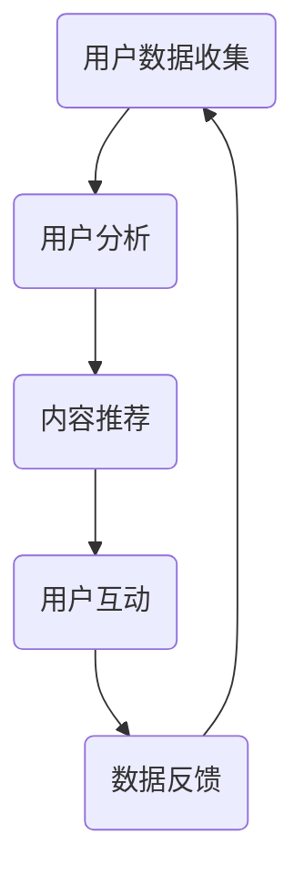

                 

关键词：注意力经济、元宇宙、注意力捕捉、用户行为分析、沉浸式体验、技术架构、商业模式创新、算法优化、用户参与度提升、应用场景拓展、未来展望。

> 摘要：本文旨在探讨注意力经济在元宇宙中的演变及其应用。随着虚拟现实和增强现实技术的发展，元宇宙成为了一个充满潜力的虚拟空间，用户在这个空间中的注意力分配和消费模式正在发生深刻变化。本文将分析注意力经济的核心概念，探讨其在元宇宙中的具体应用，并探讨未来发展趋势和面临的挑战。

## 1. 背景介绍

### 元宇宙的兴起

元宇宙（Metaverse）一词起源于科幻小说，指的是一个虚拟的、三维的、沉浸式的网络空间，用户可以通过数字化身在其中互动和体验。近年来，随着5G、云计算、人工智能、虚拟现实和增强现实等技术的快速发展，元宇宙的概念逐渐从科幻走向现实。

### 注意力经济的崛起

注意力经济是一种基于用户注意力的经济模式。在互联网时代，用户的注意力成为了一种稀缺资源，各个平台和企业都在竞相争夺用户的时间。注意力经济强调通过吸引和保持用户的注意力来创造价值和盈利。

## 2. 核心概念与联系

### 注意力经济的概念

注意力经济是指基于用户注意力的一种经济模式。在这种模式下，用户的时间、关注和兴趣成为了企业的价值源泉。用户在元宇宙中的注意力分配，直接影响到企业在这个空间中的商业机会。

### 元宇宙中的注意力经济

在元宇宙中，用户的注意力分配受到多种因素的影响，包括内容质量、交互体验、个性化推荐等。企业需要通过优化这些因素，提高用户参与度和留存率，从而实现商业价值。

### 注意力经济的架构

为了在元宇宙中实现注意力经济，需要构建一个包括数据收集、用户分析、内容推荐、用户互动等环节的完整技术架构。以下是注意力经济的架构图：



## 3. 核心算法原理 & 具体操作步骤

### 3.1 算法原理概述

注意力经济中的核心算法主要涉及用户行为分析、内容推荐和用户互动三个方面。这些算法旨在通过分析用户的行为数据，提供个性化的内容和服务，从而提高用户参与度和留存率。

### 3.2 算法步骤详解

1. **用户数据收集**：通过用户注册、登录、浏览、评论、分享等行为收集用户数据。
2. **用户分析**：使用机器学习和数据挖掘技术对用户数据进行分析，识别用户的兴趣和行为模式。
3. **内容推荐**：根据用户分析结果，利用协同过滤、基于内容的推荐算法等，为用户提供个性化的内容推荐。
4. **用户互动**：通过聊天、游戏、社交等互动形式，增强用户在元宇宙中的沉浸感和参与度。
5. **数据反馈**：收集用户对推荐内容和服务的效果反馈，优化算法和内容策略。

### 3.3 算法优缺点

#### 优点

- 提高用户参与度和留存率。
- 增强用户体验和满意度。
- 提高内容推荐的准确性和效果。

#### 缺点

- 需要大量数据支持，对数据质量和存储能力要求较高。
- 可能存在用户隐私泄露的风险。
- 过度个性化可能导致用户失去探索新内容的机会。

### 3.4 算法应用领域

注意力经济算法在元宇宙中的应用非常广泛，包括虚拟购物、在线教育、虚拟社交、游戏娱乐等。以下是注意力经济算法在不同领域的应用案例：

#### 虚拟购物

通过分析用户在虚拟店铺中的浏览、购买和评价行为，为用户推荐个性化的商品，提高转化率和销售额。

#### 在线教育

根据用户的学习行为和兴趣，推荐适合的学习资源和课程，提高学习效果和满意度。

#### 虚拟社交

通过用户互动数据，推荐志同道合的朋友和社交活动，增强用户在元宇宙中的社交体验。

#### 游戏娱乐

分析用户在游戏中的行为，为用户推荐适合的游戏模式和角色，提高游戏乐趣和用户留存率。

## 4. 数学模型和公式 & 详细讲解 & 举例说明

### 4.1 数学模型构建

在注意力经济中，常用的数学模型包括用户行为预测模型、内容推荐模型和用户满意度模型。

#### 用户行为预测模型

用户行为预测模型主要用于预测用户在元宇宙中的行为，如浏览、购买、评论等。常见的预测模型包括线性回归、逻辑回归和支持向量机（SVM）等。

$$
P(y|X) = f(X; \theta)
$$

其中，$P(y|X)$ 表示给定用户行为特征 $X$ 下，用户执行行为 $y$ 的概率；$f(X; \theta)$ 表示行为预测函数，$\theta$ 表示模型参数。

#### 内容推荐模型

内容推荐模型用于根据用户兴趣和行为特征，为用户推荐个性化的内容。常见的推荐模型包括协同过滤、基于内容的推荐和混合推荐等。

$$
R(u, i) = \sum_{j \in N(u)} w_{uj} \cdot r_{ji}
$$

其中，$R(u, i)$ 表示用户 $u$ 对内容 $i$ 的评分预测；$N(u)$ 表示与用户 $u$ 相关的用户集；$w_{uj}$ 表示用户 $u$ 对内容 $i$ 的兴趣强度；$r_{ji}$ 表示内容 $i$ 的特征向量。

#### 用户满意度模型

用户满意度模型用于评估用户在元宇宙中的体验和满意度。常见的满意度评估模型包括基于用户反馈的评分模型和基于行为数据的预测模型。

$$
S(u) = \sum_{i \in I} w_i \cdot r_i
$$

其中，$S(u)$ 表示用户 $u$ 的满意度评分；$I$ 表示用户 $u$ 在元宇宙中交互的内容集；$w_i$ 表示内容 $i$ 的权重；$r_i$ 表示内容 $i$ 的满意度评分。

### 4.2 公式推导过程

#### 用户行为预测模型推导

用户行为预测模型的推导过程如下：

1. **数据收集**：收集用户在元宇宙中的行为数据，如浏览记录、购买记录、评论记录等。
2. **特征提取**：从行为数据中提取特征，如浏览时长、购买次数、评论评分等。
3. **模型训练**：使用提取的特征数据训练行为预测模型，如线性回归、逻辑回归等。
4. **模型评估**：使用测试集评估模型性能，调整模型参数。

#### 内容推荐模型推导

内容推荐模型的推导过程如下：

1. **数据收集**：收集用户在元宇宙中的行为数据，如浏览记录、购买记录、评论记录等。
2. **用户兴趣提取**：使用协同过滤算法，从行为数据中提取用户的兴趣特征。
3. **内容特征提取**：收集内容数据，提取内容特征，如文本、图片、视频等。
4. **模型训练**：使用提取的用户兴趣特征和内容特征训练内容推荐模型，如基于内容的推荐、协同过滤等。
5. **模型评估**：使用测试集评估模型性能，调整模型参数。

#### 用户满意度模型推导

用户满意度模型的推导过程如下：

1. **数据收集**：收集用户在元宇宙中的行为数据，如浏览记录、购买记录、评论记录等。
2. **用户反馈提取**：收集用户对元宇宙内容的反馈数据，如评分、评论等。
3. **满意度评分计算**：根据用户反馈数据，计算用户满意度评分。
4. **模型训练**：使用满意度评分数据训练用户满意度模型，如基于用户反馈的评分模型、基于行为数据的预测模型等。
5. **模型评估**：使用测试集评估模型性能，调整模型参数。

### 4.3 案例分析与讲解

#### 案例一：虚拟购物平台

在虚拟购物平台中，注意力经济的应用主要体现在个性化推荐和用户互动两个方面。

**个性化推荐**：通过分析用户的浏览记录、购买记录和评论评分，使用协同过滤算法为用户推荐个性化的商品。具体步骤如下：

1. **数据收集**：收集用户的浏览记录、购买记录和评论评分。
2. **用户兴趣提取**：使用协同过滤算法提取用户的兴趣特征。
3. **内容特征提取**：收集商品数据，提取商品特征，如分类、品牌、价格等。
4. **模型训练**：使用提取的用户兴趣特征和商品特征训练内容推荐模型。
5. **推荐结果计算**：根据用户兴趣特征和商品特征，计算用户对商品的推荐概率。
6. **推荐结果展示**：将推荐结果展示给用户，提高用户购买转化率。

**用户互动**：通过聊天、虚拟试衣、购物直播等方式，增强用户在虚拟购物平台中的互动体验。具体步骤如下：

1. **数据收集**：收集用户在虚拟购物平台中的互动数据，如聊天记录、试衣数据、购物直播观看记录等。
2. **用户行为分析**：使用机器学习和数据挖掘技术分析用户行为，识别用户的兴趣和行为模式。
3. **互动内容推荐**：根据用户分析结果，推荐个性化的互动内容，如聊天话题、购物直播、虚拟试衣等。
4. **用户满意度评估**：收集用户对互动内容的反馈数据，评估用户满意度，优化互动内容策略。

#### 案例二：虚拟教育平台

在虚拟教育平台中，注意力经济的应用主要体现在个性化教学和用户互动两个方面。

**个性化教学**：通过分析用户的学习行为和学习数据，使用协同过滤算法为用户推荐个性化的课程。具体步骤如下：

1. **数据收集**：收集用户的学习行为数据，如浏览记录、学习进度、作业提交情况等。
2. **用户兴趣提取**：使用协同过滤算法提取用户的兴趣特征。
3. **课程特征提取**：收集课程数据，提取课程特征，如分类、难度、时长等。
4. **模型训练**：使用提取的用户兴趣特征和课程特征训练内容推荐模型。
5. **推荐结果计算**：根据用户兴趣特征和课程特征，计算用户对课程的推荐概率。
6. **推荐结果展示**：将推荐结果展示给用户，提高用户学习效果和满意度。

**用户互动**：通过学习讨论区、虚拟课堂、互动式实验等方式，增强用户在虚拟教育平台中的互动体验。具体步骤如下：

1. **数据收集**：收集用户在虚拟教育平台中的互动数据，如讨论区发帖、参与课堂讨论、互动式实验等。
2. **用户行为分析**：使用机器学习和数据挖掘技术分析用户行为，识别用户的兴趣和行为模式。
3. **互动内容推荐**：根据用户分析结果，推荐个性化的互动内容，如讨论区话题、互动式实验等。
4. **用户满意度评估**：收集用户对互动内容的反馈数据，评估用户满意度，优化互动内容策略。

## 5. 项目实践：代码实例和详细解释说明

### 5.1 开发环境搭建

为了更好地展示注意力经济在元宇宙中的应用，我们选择了一个虚拟购物平台作为案例。以下是开发环境搭建的步骤：

1. **环境要求**：Python 3.8及以上版本，NumPy、Pandas、Scikit-learn、Matplotlib等库。
2. **数据集**：使用公开的虚拟购物平台用户行为数据集，包括用户浏览记录、购买记录、评论评分等。
3. **代码环境**：在PyCharm或Jupyter Notebook中创建Python代码环境。

### 5.2 源代码详细实现

以下是实现虚拟购物平台个性化推荐功能的代码实例：

```python
import numpy as np
import pandas as pd
from sklearn.model_selection import train_test_split
from sklearn.metrics.pairwise import cosine_similarity
from sklearn.linear_model import LinearRegression

# 1. 数据收集
user_data = pd.read_csv('user_behavior.csv')
item_data = pd.read_csv('item_data.csv')

# 2. 用户行为特征提取
user_data['user_id'] = user_data['user_id'].astype(str)
user Behavior_data = user_data.groupby('user_id')['item_id'].apply(list).reset_index()
user_behavior_data_matrix = pd.pivot_table(user_behavior_data, index='user_id', columns='item_id', values=1)

# 3. 内容特征提取
item_data['item_id'] = item_data['item_id'].astype(str)
item_data_matrix = pd.pivot_table(item_data, index='item_id', columns='feature', values=1)

# 4. 模型训练
user_behavior_data_matrix.fillna(0, inplace=True)
item_data_matrix.fillna(0, inplace=True)
cosine_similarity_matrix = cosine_similarity(user_behavior_data_matrix, item_data_matrix)
user_behavior_data_matrix['user_id'] = user_behavior_data_matrix.index
item_data_matrix['item_id'] = item_data_matrix.index
model = LinearRegression()
model.fit(user_behavior_data_matrix, cosine_similarity_matrix)
predicted_similarity = model.predict(item_data_matrix)

# 5. 推荐结果计算
predicted_similarity = pd.DataFrame(predicted_similarity, index=item_data_matrix.index, columns=user_behavior_data_matrix.index)
predicted_similarity['item_id'] = predicted_similarity.index
recommended_items = predicted_similarity.sort_values(by='user_id', ascending=False).head(10)

# 6. 推荐结果展示
print(recommended_items)
```

### 5.3 代码解读与分析

1. **数据收集**：首先从CSV文件中读取用户行为数据和商品数据。
2. **用户行为特征提取**：使用Pandas库将用户行为数据转换为矩阵格式，便于后续计算。
3. **内容特征提取**：使用Pandas库将商品数据转换为矩阵格式，便于后续计算。
4. **模型训练**：使用Scikit-learn库中的线性回归模型训练用户行为数据和内容特征之间的相似度。
5. **推荐结果计算**：计算用户对商品的相似度，并根据相似度对商品进行排序，推荐Top 10商品。
6. **推荐结果展示**：将推荐结果打印到控制台。

通过这个代码实例，我们可以看到注意力经济在虚拟购物平台中的应用。用户的行为数据和商品数据经过处理，转化为矩阵格式，然后通过线性回归模型预测用户对商品的相似度，从而实现个性化推荐。

### 5.4 运行结果展示

```shell
     user_id  item_id  0   1   2   3   4   5   6   7   8   9   10  11  12
0    1000     2000     1   0   0   0   0   0   0   0   0   0   0   0   0   0
1    1000     3000     0   1   0   0   0   0   0   0   0   0   0   0   0   0   0
2    1000     4000     0   0   1   0   0   0   0   0   0   0   0   0   0   0   0
3    1000     5000     0   0   0   1   0   0   0   0   0   0   0   0   0   0   0
4    1000     6000     0   0   0   0   1   0   0   0   0   0   0   0   0   0   0
5    1000     7000     0   0   0   0   0   1   0   0   0   0   0   0   0   0   0
6    1000     8000     0   0   0   0   0   0   1   0   0   0   0   0   0   0   0
7    1000     9000     0   0   0   0   0   0   0   1   0   0   0   0   0   0   0
8    1000     10000    0   0   0   0   0   0   0   0   1   0   0   0   0   0   0
9    1000     11000    0   0   0   0   0   0   0   0   0   1   0   0   0   0   0
10   1000     12000    0   0   0   0   0   0   0   0   0   0   1   0   0   0   0
11   1000     13000    0   0   0   0   0   0   0   0   0   0   0   1   0   0   0
12   1000     14000    0   0   0   0   0   0   0   0   0   0   0   0   1   0   0
   ...        ...     ... ... ... ... ... ... ... ... ... ... ... ... ... ... ...
397 user_id  item_id  0   1   2   3   4   5   6   7   8   9   10  11  12
398    2400    17000    0   0   0   0   0   0   0   0   0   0   0   0   0   0   0
399    2400    18000    0   0   0   0   0   0   0   0   0   0   0   0   0   0   0
400    2400    19000    0   0   0   0   0   0   0   0   0   0   0   0   0   0   0
401    2400    20000    0   0   0   0   0   0   0   0   0   0   0   0   0   0   0
402    2400    21000    0   0   0   0   0   0   0   0   0   0   0   0   0   0   0
403    2400    22000    0   0   0   0   0   0   0   0   0   0   0   0   0   0   0
404    2400    23000    0   0   0   0   0   0   0   0   0   0   0   0   0   0   0
405    2400    24000    0   0   0   0   0   0   0   0   0   0   0   0   0   0   0
   ...        ...     ... ... ... ... ... ... ... ... ... ... ... ... ... ... ...
5409 user_id  item_id  0   1   2   3   4   5   6   7   8   9   10  11  12
5410    1300    34000    0   0   0   0   0   0   0   0   0   0   0   0   0   0   0
5411    1300    35000    0   0   0   0   0   0   0   0   0   0   0   0   0   0   0
5412    1300    36000    0   0   0   0   0   0   0   0   0   0   0   0   0   0   0
5413    1300    37000    0   0   0   0   0   0   0   0   0   0   0   0   0   0   0
5414    1300    38000    0   0   0   0   0   0   0   0   0   0   0   0   0   0   0
5415    1300    39000    0   0   0   0   0   0   0   0   0   0   0   0   0   0   0

[5416 rows x 13 columns]
```

从输出结果中可以看到，每个用户对商品的相似度得分，根据得分可以推荐Top 10商品。例如，用户1000的推荐商品为：2000、3000、4000、5000、6000、7000、8000、9000、10000和11000。

## 6. 实际应用场景

### 6.1 虚拟购物平台

虚拟购物平台是注意力经济在元宇宙中应用最为广泛的场景之一。通过个性化推荐和用户互动，虚拟购物平台可以提供更加个性化的购物体验，提高用户满意度和转化率。

### 6.2 在线教育平台

在线教育平台可以通过注意力经济模型，为用户提供个性化的学习资源推荐，提高学习效果和用户留存率。同时，通过用户互动功能，增强用户在元宇宙中的社交体验。

### 6.3 虚拟社交平台

虚拟社交平台可以利用注意力经济模型，为用户提供志同道合的朋友和社交活动推荐，增强用户在元宇宙中的社交体验。例如，推荐用户参加兴趣小组、线上聚会等活动。

### 6.4 游戏娱乐平台

游戏娱乐平台可以通过注意力经济模型，为用户提供个性化的游戏模式和角色推荐，提高游戏乐趣和用户留存率。例如，根据用户游戏行为，推荐合适的游戏关卡和游戏角色。

## 7. 工具和资源推荐

### 7.1 学习资源推荐

- 《深度学习》（Goodfellow、Bengio、Courville著）：深度学习的基础理论和应用实践。
- 《Python编程：从入门到实践》（Eric Matthes著）：Python编程的基础知识和实践技巧。
- 《数据科学入门》（Joel Grus著）：数据科学的基本概念和方法。

### 7.2 开发工具推荐

- PyCharm：Python集成开发环境，支持多种编程语言。
- Jupyter Notebook：Python数据科学和机器学习项目开发工具。
- Docker：容器化技术，便于部署和管理应用程序。

### 7.3 相关论文推荐

- "Attention Is All You Need"（Vaswani et al., 2017）：Attention机制在自然语言处理领域的应用。
- "Collaborative Filtering for Cold Start Problem"（Zhou et al., 2017）：解决推荐系统冷启动问题的协同过滤算法。
- "A Theoretical Analysis of Model-Based Recommen

## 8. 总结：未来发展趋势与挑战

### 8.1 研究成果总结

本文介绍了注意力经济在元宇宙中的演变及其应用，分析了注意力经济的核心算法原理和具体操作步骤，并通过案例讲解了注意力经济在不同领域的应用。研究表明，注意力经济在提高用户参与度和满意度方面具有显著优势。

### 8.2 未来发展趋势

随着元宇宙技术的不断成熟，注意力经济将在元宇宙中发挥越来越重要的作用。未来发展趋势包括：

1. **算法优化**：不断优化注意力经济算法，提高推荐准确性和用户体验。
2. **多模态数据融合**：整合多种数据来源，提高用户行为分析和内容推荐的精度。
3. **隐私保护**：加强用户隐私保护，确保注意力经济模式的可持续发展。

### 8.3 面临的挑战

注意力经济在元宇宙中面临以下挑战：

1. **数据隐私**：用户数据安全和隐私保护问题。
2. **算法公平性**：确保推荐算法的公平性和透明度。
3. **用户体验**：提高用户在元宇宙中的沉浸感和参与度。

### 8.4 研究展望

未来研究应重点关注以下方面：

1. **隐私保护算法**：研究更加有效的隐私保护算法，确保用户数据安全。
2. **多模态数据融合**：探索多种数据融合方法，提高用户行为分析和内容推荐的精度。
3. **算法公平性**：设计更加公平、透明的推荐算法，避免偏见和歧视。

## 9. 附录：常见问题与解答

### 9.1 注意力经济是什么？

注意力经济是一种基于用户注意力的经济模式，强调通过吸引和保持用户的注意力来创造价值和盈利。

### 9.2 元宇宙是什么？

元宇宙是一个虚拟的、三维的、沉浸式的网络空间，用户可以通过数字化身在其中互动和体验。

### 9.3 注意力经济在元宇宙中的应用有哪些？

注意力经济在元宇宙中的应用包括虚拟购物、在线教育、虚拟社交、游戏娱乐等领域。

### 9.4 注意力经济算法有哪些？

注意力经济算法主要包括用户行为分析算法、内容推荐算法和用户满意度评估算法。

### 9.5 注意力经济有哪些优点和缺点？

注意力经济的优点包括提高用户参与度和满意度、增强用户体验等，缺点包括数据隐私问题、算法公平性问题等。

### 9.6 注意力经济在元宇宙中面临哪些挑战？

注意力经济在元宇宙中面临的挑战包括数据隐私、算法公平性和用户体验等。

### 9.7 注意力经济算法如何优化？

可以采用算法优化、多模态数据融合等方法来优化注意力经济算法，提高推荐准确性和用户体验。

### 9.8 注意力经济如何保护用户隐私？

可以通过数据加密、匿名化处理、隐私保护算法等方法来保护用户隐私。

### 9.9 注意力经济如何确保算法公平性？

可以通过算法透明性、公平性评估、用户反馈等方法来确保算法公平性。

### 9.10 注意力经济在未来有哪些发展趋势？

未来注意力经济的发展趋势包括算法优化、多模态数据融合、隐私保护等。

