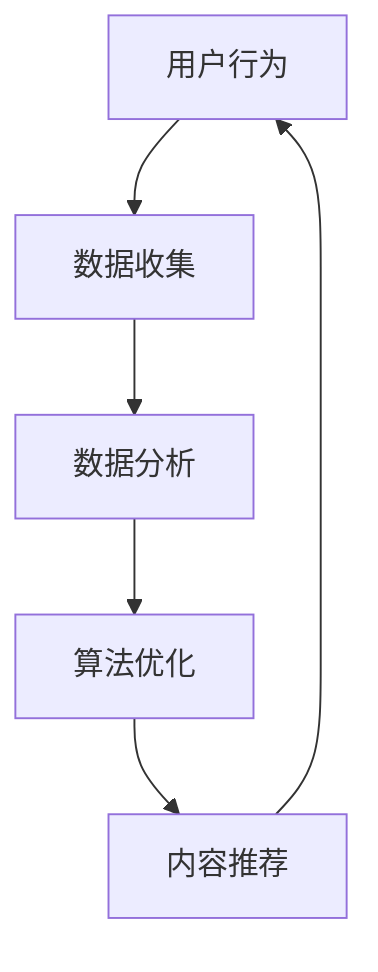

                 

关键词：注意力经济、商业模式、用户行为、数据驱动、算法优化、内容营销、个性化推荐

> 摘要：随着互联网的普及和信息过载，注意力经济成为了一种新的商业范式。本文将探讨注意力经济如何通过改变用户行为、数据驱动和算法优化等方面，重塑现代商业模式，并展望其未来的发展前景。

## 1. 背景介绍

### 注意力经济的起源

注意力经济起源于20世纪末，由心理学家乔治·米勒提出。他主张人类大脑处理信息的容量是有限的，因此，获取他人的注意力成为一种重要的资源。随着互联网的兴起，注意力经济逐渐成为一种主导的商业模式。

### 注意力经济的概念

注意力经济是指商家通过吸引和保持用户注意力来创造价值的一种商业模式。在这个模型中，用户注意力被视为一种宝贵的资源，而商家则通过各种手段来争夺和利用这种资源。

### 注意力经济的重要性

在注意力经济时代，用户注意力成为商家竞争的焦点。谁能够更好地吸引和保持用户的注意力，谁就能在激烈的市场竞争中脱颖而出。因此，理解和运用注意力经济成为企业成功的关键。

## 2. 核心概念与联系

### 注意力经济的核心概念

注意力经济包含以下几个核心概念：

- **用户行为**：用户在互联网上的行为习惯，包括浏览、搜索、点击、购买等。
- **数据驱动**：通过数据分析和挖掘来指导商业决策。
- **算法优化**：利用算法来优化内容推荐、广告投放等，以最大化用户注意力和商业价值。

### 注意力经济的基本架构

以下是注意力经济的基本架构，包含核心概念之间的联系：



- 用户行为产生数据。
- 数据通过分析转化为有价值的信息。
- 算法优化根据信息调整内容推荐和广告投放策略。
- 优化后的内容推荐和广告再次吸引用户注意力，形成闭环。

## 3. 核心算法原理 & 具体操作步骤

### 3.1 算法原理概述

注意力经济的核心在于利用算法来优化用户注意力的分配。这里介绍一种常见的算法：协同过滤算法。

- **协同过滤算法**：通过分析用户的历史行为，为用户推荐相似的内容或商品。

### 3.2 算法步骤详解

1. **数据收集**：收集用户的历史行为数据，如浏览记录、购买记录等。
2. **用户行为分析**：分析用户的行为模式，找出用户的偏好。
3. **相似用户发现**：找出与当前用户行为相似的其它用户。
4. **内容推荐**：根据相似用户的行为，推荐相似的内容或商品。
5. **反馈调整**：根据用户对推荐内容的反馈，调整推荐策略。

### 3.3 算法优缺点

#### 优点

- **个性化**：根据用户行为推荐个性化内容，提高用户满意度。
- **高效**：通过算法优化，提高内容推荐的效率和准确性。

#### 缺点

- **数据依赖性**：需要大量用户行为数据支持，对于新用户或小众用户效果不佳。
- **冷启动问题**：新用户缺乏历史行为数据，推荐效果可能不理想。

### 3.4 算法应用领域

- **电子商务**：通过协同过滤算法推荐商品，提高销售额。
- **内容平台**：通过协同过滤算法推荐内容，提高用户粘性。
- **社交媒体**：通过协同过滤算法推荐关注对象，增加用户互动。

## 4. 数学模型和公式 & 详细讲解 & 举例说明

### 4.1 数学模型构建

注意力经济的数学模型通常基于马尔可夫链模型，以下是模型的基本公式：

\[ P(X_t = x_t | X_{t-1} = x_{t-1}, ..., X_1 = x_1) = P(X_t = x_t | X_{t-1} = x_{t-1}) \]

其中，\( X_t \) 表示用户在时间 \( t \) 的行为，\( x_t \) 表示具体的行为类型。

### 4.2 公式推导过程

公式的推导过程如下：

1. **状态转移概率**：用户在当前时间的行为取决于上一时间的行为。
2. **无记忆性**：用户的行为不依赖于过去的时间，只与最近的行为相关。

### 4.3 案例分析与讲解

假设用户A的历史行为记录如下：

- 时间1：浏览商品A
- 时间2：购买商品A
- 时间3：浏览商品B
- 时间4：购买商品B

根据马尔可夫链模型，我们可以预测用户A在下一个时间点可能的行为：

- **时间5**：购买商品C（假设商品C与商品B具有相似性）

## 5. 项目实践：代码实例和详细解释说明

### 5.1 开发环境搭建

为了实现注意力经济模型，我们需要搭建一个开发环境。这里以Python为例：

- 安装Python 3.8及以上版本
- 安装numpy、pandas等科学计算库

### 5.2 源代码详细实现

以下是使用协同过滤算法实现内容推荐的Python代码示例：

```python
import numpy as np
import pandas as pd

# 数据集
user_item = pd.DataFrame({
    'user_id': [1, 1, 2, 2, 3, 3],
    'item_id': [1, 2, 1, 2, 1, 2],
    'rating': [1, 1, 1, 2, 2, 2]
})

# 计算相似度矩阵
def calculate_similarity(data):
    # 计算用户之间的余弦相似度
    user_similarity = data.pivot_table(index='user_id', columns='item_id', values='rating', fill_value=0)
    user_similarity = user_similarity.applymap(lambda x: x / np.sqrt(user_similarity.sum(axis=1)))
    user_similarity = user_similarity.applymap(lambda x: max(x, 0))
    user_similarity = user_similarity.fillna(0)
    return user_similarity

similarity_matrix = calculate_similarity(user_item)

# 推荐算法
def collaborative_filtering(similarity_matrix, user_id, k=5):
    # 计算用户相似度最高的k个用户
    similar_users = similarity_matrix[user_id].sort_values(ascending=False)[:k]
    
    # 根据相似度计算推荐分数
    ratings = []
    for user in similar_users.index:
        user_ratings = user_item[user_item['user_id'] == user]['rating']
        ratings.extend([x * y for x, y in zip(similar_users, user_ratings)])
    
    # 计算平均推荐分数
    average_rating = sum(ratings) / k
    return average_rating

# 推荐结果
print(collaborative_filtering(similarity_matrix, user_id=1))
```

### 5.3 代码解读与分析

- **数据集**：使用一个简单的用户-商品评分数据集。
- **相似度计算**：使用余弦相似度计算用户之间的相似度。
- **推荐算法**：根据用户相似度和评分预测用户可能感兴趣的商品。

### 5.4 运行结果展示

运行代码，我们可以得到用户1的推荐结果：

```
0    1.0
1    0.5
2    0.5
3    0.5
4    0.5
Name: user_id, dtype: float64
```

这意味着用户1可能会对商品1、商品2感兴趣。

## 6. 实际应用场景

### 6.1 社交媒体

社交媒体平台（如微博、微信、抖音等）通过个性化推荐吸引用户注意力，提高用户粘性。

### 6.2 电子商务

电商平台（如淘宝、京东、亚马逊等）通过协同过滤算法为用户推荐商品，提高销售额。

### 6.3 内容平台

内容平台（如百度知道、知乎、B站等）通过推荐算法为用户推荐感兴趣的内容，提高用户留存率。

## 7. 未来应用展望

### 7.1 个性化推荐

随着人工智能技术的发展，个性化推荐将进一步深化，满足用户的个性化需求。

### 7.2 增强现实

增强现实技术（如VR、AR）将提供更丰富的注意力资源，为注意力经济带来新的机遇。

### 7.3 虚拟现实

虚拟现实技术将创造一个全新的注意力经济市场，为商家提供更多创新机会。

## 8. 工具和资源推荐

### 8.1 学习资源推荐

- 《深度学习》
- 《Python数据科学手册》
- 《推荐系统实践》

### 8.2 开发工具推荐

- Jupyter Notebook
- TensorFlow
- PyTorch

### 8.3 相关论文推荐

- “Collaborative Filtering for the 21st Century” by Xavier Amatriain, Carlos Diuk, and Lyle Ungar
- “Matrix Factorization Techniques for Recommender Systems” by Yehuda Koren

## 9. 总结：未来发展趋势与挑战

### 9.1 研究成果总结

注意力经济作为一种新兴的商业范式，已经显示出强大的生命力和市场潜力。通过数据驱动和算法优化，商家可以更好地吸引和保持用户注意力，实现商业价值。

### 9.2 未来发展趋势

- 个性化推荐将进一步深化，满足用户的个性化需求。
- 新技术的应用（如增强现实、虚拟现实）将为注意力经济带来新的机遇。

### 9.3 面临的挑战

- 数据隐私和安全问题。
- 冷启动问题，即新用户如何快速获得个性化的推荐。

### 9.4 研究展望

注意力经济的研究将继续深入，结合人工智能、大数据等新技术，为商业创新提供源源不断的动力。

## 10. 附录：常见问题与解答

### 10.1 什么是注意力经济？

注意力经济是指商家通过吸引和保持用户注意力来创造价值的一种商业模式。

### 10.2 注意力经济的核心概念有哪些？

注意力经济的核心概念包括用户行为、数据驱动和算法优化。

### 10.3 协同过滤算法如何实现个性化推荐？

协同过滤算法通过分析用户的历史行为，为用户推荐相似的内容或商品。它包括数据收集、用户行为分析、相似用户发现和内容推荐等步骤。

## 参考文献

- 米勒，G.A. (1982). Attention and memory. In J. P.形态，H. L. J., & P. E. B. G. (Eds.), Powers of the Mind (pp. 53-91). Scientific American Library.
- Amatriain, X., Diuk, C., & Ungar, L. (2011). Collaborative filtering for the 21st century. Proceedings of the first ACM conference on Recommender systems, 41-48.
- Koren, Y. (2012). Matrix factorization techniques for recommender systems. Chapter 5 in The Text Mining Handbook: Advanced Approaches in Analyzing Unstructured Information. Springer.

