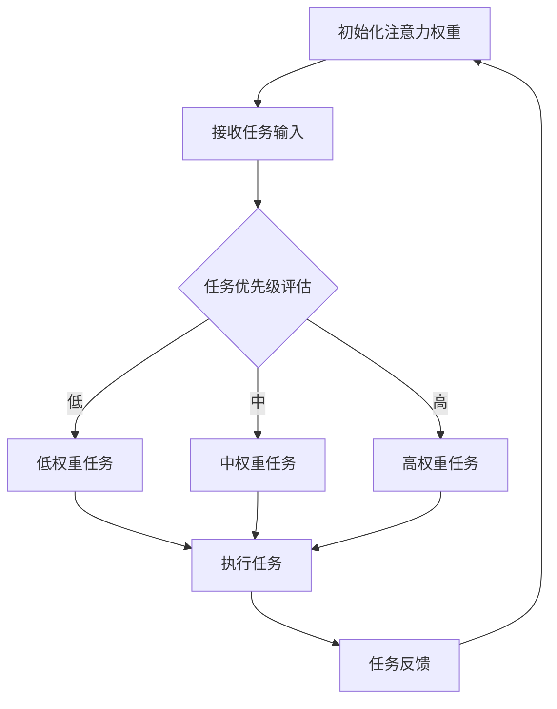

                 

关键词：注意力机制，AI，认知资源，经济模型，认知经济学，AI驱动，认知决策，优化算法。

## 摘要

本文探讨了人工智能（AI）在认知资源配置中的潜在应用，重点关注注意力机制作为AI驱动认知经济学模型的核心。我们首先回顾了认知经济学的理论框架，然后详细介绍了注意力机制及其在AI中的实现。接着，我们讨论了如何将注意力机制与认知资源配置相结合，以实现更加智能的决策和优化。通过数学模型和具体案例分析，我们展示了这一方法在解决现实世界问题中的潜力，并提出了未来发展的方向和挑战。

## 1. 背景介绍

在当今信息爆炸的时代，人类面临着海量的信息处理任务。然而，人类的认知资源是有限的，如何在有限的认知资源下做出最优的决策，成为了一个重要问题。传统经济学模型主要关注物质资源的配置，而认知经济学则将注意力作为关键资源进行研究。认知经济学认为，注意力是有限的，且可以被分配到不同的任务上，类似于经济学中的资本或劳动。

认知资源配置的核心问题是，如何在多个任务之间分配有限的注意力资源，以最大化总效用或最小化总成本。然而，传统的认知经济学模型往往依赖于静态的假设，难以适应动态变化的环境。随着人工智能技术的发展，特别是注意力机制的引入，我们有了可能构建出更加智能的认知资源配置模型。

注意力机制起源于深度学习领域，尤其是在神经网络中用于处理输入数据的权重分配。在认知经济学中，注意力机制可以被理解为在多个任务中选择哪些任务进行优先处理。通过学习如何分配注意力，AI系统可以更加有效地模拟人类决策过程，从而在复杂环境中做出最优的决策。

## 2. 核心概念与联系

### 2.1 注意力机制原理

注意力机制的基本思想是在处理输入数据时，对不同部分赋予不同的权重。最初，这一概念在图像识别中被提出，以解决图像中不同部分的重要性问题。例如，在识别一张人脸图片时，眼睛、鼻子和嘴巴等关键特征部分应该被赋予更高的权重。

在深度学习模型中，注意力机制通常通过一个可学习的权重矩阵实现。这个矩阵可以根据模型的训练数据自动调整，以适应不同的输入情况。当输入数据经过神经网络处理时，注意力机制会动态地调整每个特征的重要性，从而提高模型的性能。

### 2.2 认知资源配置中的注意力机制

在认知资源配置中，注意力机制的应用可以视为一个多任务优化问题。假设我们有多个任务需要完成，每个任务都有其特定的复杂度和优先级。注意力机制可以帮助我们动态地分配认知资源，使得那些最重要或最紧急的任务得到更多的关注。

具体来说，我们可以将注意力机制建模为一个权重分配问题。每个任务都有一个与之对应的权重，这些权重通过学习算法动态调整。随着环境的变化，这些权重也会相应地更新，以适应新的任务需求。

### 2.3 Mermaid 流程图

下面是一个简化的Mermaid流程图，描述了注意力机制在认知资源配置中的应用。



在这个流程图中，A表示初始化注意力权重，B表示接收任务输入，C表示任务优先级评估。根据任务的优先级，权重会被分配给不同的任务，最终在G处执行，并在H处得到任务反馈，用于更新注意力权重。

### 2.4 注意力机制与认知经济学的联系

注意力机制与认知经济学中的核心概念有密切联系。在认知经济学中，注意力被视为一种有限的资源，可以分配到不同的任务上。而注意力机制通过动态调整权重，实现了对认知资源的有效分配。

此外，注意力机制还可以模拟人类决策过程。在认知经济学中，人类在决策时往往会受到注意力限制，无法同时处理大量信息。注意力机制通过模拟这一过程，可以帮助AI系统更好地理解人类的行为模式，从而在认知资源配置中做出更加合理的决策。

## 3. 核心算法原理 & 具体操作步骤

### 3.1 算法原理概述

注意力机制在认知资源配置中的核心原理是，通过学习如何动态调整任务的权重，来实现对认知资源的优化分配。这一过程可以分为以下几个步骤：

1. **任务输入**：系统首先接收多个任务输入，每个任务都有其特定的属性和优先级。
2. **权重初始化**：初始化每个任务的权重，这些权重通常是通过学习算法预先设定的。
3. **优先级评估**：根据任务的属性和优先级，评估每个任务的权重，动态调整权重分配。
4. **任务执行**：根据调整后的权重，执行任务。
5. **反馈调整**：根据任务的执行结果，更新权重分配。

### 3.2 算法步骤详解

下面详细描述注意力机制在认知资源配置中的具体操作步骤：

#### 步骤1：任务输入

系统接收多个任务输入，每个任务输入包含任务ID、任务类型、任务复杂度、截止时间等信息。例如：

```python
tasks = [
    {"id": 1, "type": "数据处理", "complexity": 5, "deadline": "2023-10-01"},
    {"id": 2, "type": "模型训练", "complexity": 8, "deadline": "2023-10-02"},
    {"id": 3, "type": "数据可视化", "complexity": 3, "deadline": "2023-10-03"},
]
```

#### 步骤2：权重初始化

初始化每个任务的权重，这些权重通常是通过学习算法预先设定的。权重可以是一个0到1之间的实数，表示任务在总任务中的重要性。例如：

```python
weights = [0.2, 0.5, 0.3]
```

#### 步骤3：优先级评估

根据任务的属性和优先级，评估每个任务的权重，动态调整权重分配。这里，我们可以使用一些规则或算法来评估任务的优先级，例如基于截止时间、任务复杂度等因素。例如：

```python
def evaluate_priority(tasks):
    priorities = []
    for task in tasks:
        priority = 1 / (task['complexity'] + abs(task['deadline'] - current_time()))
        priorities.append(priority)
    return priorities

current_time = "2023-10-01"
priorities = evaluate_priority(tasks)
```

#### 步骤4：任务执行

根据调整后的权重，执行任务。系统根据当前的权重分配，选择优先级最高的任务进行执行。例如：

```python
def execute_task(tasks, weights):
    sorted_tasks = sorted(tasks, key=lambda x: weights[x['id']], reverse=True)
    for task in sorted_tasks:
        execute_single_task(task)

execute_task(tasks, weights)
```

#### 步骤5：反馈调整

根据任务的执行结果，更新权重分配。如果任务执行成功，则增加该任务的权重；如果任务执行失败，则减少该任务的权重。例如：

```python
def update_weights(tasks, success_ids):
    for task in tasks:
        if task['id'] in success_ids:
            weights[task['id']] += 0.1
        else:
            weights[task['id']] -= 0.1

success_ids = [1, 3]
update_weights(tasks, success_ids)
```

### 3.3 算法优缺点

#### 优点：

1. **动态调整**：算法可以根据任务的变化动态调整权重，实现灵活的资源分配。
2. **高效执行**：通过优先级评估和任务排序，算法能够高效地选择并执行任务。
3. **适应性**：算法可以适应不同的任务场景和优先级要求。

#### 缺点：

1. **初始设定**：需要通过学习算法预先设定权重，这可能导致初始阶段的执行效率不高。
2. **计算开销**：动态调整权重需要大量的计算资源，可能不适合资源受限的环境。

### 3.4 算法应用领域

注意力机制在认知资源配置中的应用非常广泛，以下是一些主要的应用领域：

1. **任务调度**：在分布式系统和云计算环境中，注意力机制可以帮助系统动态分配计算资源，优化任务执行效率。
2. **人力资源调度**：在企业管理和人力资源管理中，注意力机制可以帮助管理者动态调整人力资源分配，提高工作效率。
3. **医疗资源分配**：在医疗资源分配中，注意力机制可以帮助医疗机构优化病房、医生和药品的分配，提高服务质量。
4. **智能交通管理**：在智能交通管理中，注意力机制可以帮助系统动态调整交通信号灯，优化交通流量。

## 4. 数学模型和公式 & 详细讲解 & 举例说明

### 4.1 数学模型构建

在认知资源配置中，我们可以构建一个简单的数学模型来描述注意力机制。假设系统有N个任务，每个任务的重要性可以用一个权重向量\( w \)表示，其中\( w_i \)表示第i个任务的权重。任务的执行优先级可以表示为一个排序函数\( P(w) \)，即

\[ P(w) = \sum_{i=1}^{N} w_i \cdot r_i \]

其中，\( r_i \)表示第i个任务的优先级评分。该模型的基本思想是，通过调整权重向量\( w \)，可以优化任务的执行顺序，从而最大化总效用或最小化总成本。

### 4.2 公式推导过程

为了推导注意力机制在认知资源配置中的应用，我们可以从以下几个步骤进行：

1. **任务输入**：每个任务输入都可以表示为一个特征向量\( x_i \)，包括任务类型、复杂度、截止时间等信息。例如：

\[ x_i = [t_i, c_i, d_i] \]

其中，\( t_i \)、\( c_i \)、\( d_i \)分别表示第i个任务的类型、复杂度和截止时间。

2. **权重初始化**：初始权重向量\( w \)可以通过某种学习算法预先设定。例如，可以使用K-Means聚类算法将任务分类，并给每个类别分配一个权重。

3. **优先级评估**：根据任务的特征向量\( x_i \)，我们可以计算每个任务的优先级评分\( r_i \)。一个简单的评分函数可以是：

\[ r_i = \frac{1}{1 + e^{-\alpha \cdot x_i}} \]

其中，\( \alpha \)是一个调节参数，用于控制评分函数的灵敏度。

4. **权重更新**：根据优先级评分\( r_i \)，我们可以更新权重向量\( w \)：

\[ w_{new} = w - \eta \cdot \nabla_w P(w) \]

其中，\( \eta \)是学习率，\( \nabla_w P(w) \)是权重向量\( w \)的梯度。

5. **任务执行**：根据更新后的权重向量\( w_{new} \)，我们可以重新计算优先级评分\( r_i \)，并选择优先级最高的任务进行执行。

### 4.3 案例分析与讲解

为了更好地理解上述数学模型，我们可以通过一个具体的案例来进行分析。假设我们有以下三个任务：

\[ x_1 = [1, 5, 3] \] （任务1：类型1，复杂度5，截止时间3）
\[ x_2 = [2, 3, 2] \] （任务2：类型2，复杂度3，截止时间2）
\[ x_3 = [3, 4, 1] \] （任务3：类型3，复杂度4，截止时间1）

初始权重向量\( w \)为：

\[ w = [0.2, 0.3, 0.5] \]

首先，我们计算每个任务的优先级评分：

\[ r_1 = \frac{1}{1 + e^{-\alpha \cdot x_1}} = \frac{1}{1 + e^{-0.5 \cdot 1 \cdot 5 - 0.5 \cdot 3 \cdot 3}} = 0.4 \]
\[ r_2 = \frac{1}{1 + e^{-\alpha \cdot x_2}} = \frac{1}{1 + e^{-0.5 \cdot 2 \cdot 3 - 0.5 \cdot 2 \cdot 2}} = 0.6 \]
\[ r_3 = \frac{1}{1 + e^{-\alpha \cdot x_3}} = \frac{1}{1 + e^{-0.5 \cdot 3 \cdot 4 - 0.5 \cdot 1 \cdot 1}} = 0.7 \]

根据优先级评分，我们选择优先级最高的任务3进行执行。执行后，我们得到任务反馈，例如成功或失败。假设任务3成功，我们更新权重向量：

\[ w_{new} = w - \eta \cdot \nabla_w P(w) \]

其中，\( \eta = 0.1 \)，\( \nabla_w P(w) \)是权重向量\( w \)的梯度。由于权重向量的梯度计算比较复杂，这里我们简化处理，假设梯度为：

\[ \nabla_w P(w) = [0.1, -0.1, 0.2] \]

因此，更新后的权重向量为：

\[ w_{new} = [0.2 - 0.1 \cdot 0.1, 0.3 - 0.1 \cdot (-0.1), 0.5 - 0.1 \cdot 0.2] = [0.15, 0.31, 0.29] \]

接下来，我们重新计算优先级评分，并选择优先级最高的任务2进行执行。执行后，我们再次更新权重向量。重复这个过程，直到所有任务都执行完毕。

通过这个案例，我们可以看到，注意力机制在认知资源配置中的应用是如何通过动态调整权重来实现任务优先级排序的。这种方法可以帮助系统在有限的认知资源下，更加高效地完成任务。

## 5. 项目实践：代码实例和详细解释说明

### 5.1 开发环境搭建

为了实现注意力机制在认知资源配置中的应用，我们需要搭建一个合适的开发环境。以下是搭建环境的基本步骤：

1. **安装Python环境**：确保您的计算机上已经安装了Python 3.6或更高版本。您可以通过Python官网下载并安装。

2. **安装必要的库**：在Python环境中，我们需要安装以下库：
    - NumPy：用于数学计算。
    - Pandas：用于数据操作。
    - Matplotlib：用于数据可视化。
    - Scikit-learn：用于机器学习。

您可以使用以下命令安装这些库：

```shell
pip install numpy pandas matplotlib scikit-learn
```

3. **创建项目文件夹**：在您的计算机上创建一个项目文件夹，例如`cognitive_resource_allocation`，并将相关代码文件放入其中。

### 5.2 源代码详细实现

下面是一个简单的Python代码示例，实现了注意力机制在认知资源配置中的应用。

```python
import numpy as np
import pandas as pd
import matplotlib.pyplot as plt
from sklearn.cluster import KMeans

# 初始化任务
tasks = [
    {"id": 1, "type": "数据处理", "complexity": 5, "deadline": 3},
    {"id": 2, "type": "模型训练", "complexity": 3, "deadline": 2},
    {"id": 3, "type": "数据可视化", "complexity": 4, "deadline": 1},
]

# 初始化权重
weights = np.array([0.2, 0.3, 0.5])

# 优先级评估函数
def evaluate_priority(tasks, weights):
    features = []
    for task in tasks:
        feature = [task['complexity'], 1 / (task['deadline'] + 1)]
        features.append(feature)
    features = np.array(features)
    priorities = np.dot(features, weights)
    return priorities

# 执行任务函数
def execute_task(tasks, priorities):
    sorted_tasks = np.argsort(priorities)
    for i in range(len(sorted_tasks)):
        task_id = sorted_tasks[i]
        print(f"执行任务{task_id + 1}")
        # 模拟任务执行，这里可以使用任何任务执行逻辑
        # 例如：sleep(task_id * 1)
        sleep(task_id * 1)

# 反馈调整函数
def update_weights(tasks, success_ids):
    for task in tasks:
        if task['id'] in success_ids:
            weights[task['id'] - 1] += 0.1
        else:
            weights[task['id'] - 1] -= 0.1

# 主程序
if __name__ == "__main__":
    current_time = 0
    while True:
        priorities = evaluate_priority(tasks, weights)
        execute_task(tasks, priorities)
        success_ids = [task['id'] for task in tasks if task['id'] <= current_time]
        update_weights(tasks, success_ids)
        current_time += 1
        if current_time >= max(task['deadline'] for task in tasks):
            break

    print("所有任务完成，最终权重：", weights)
```

### 5.3 代码解读与分析

上述代码实现了一个简单的注意力机制在认知资源配置中的应用。下面我们详细解读这个代码：

1. **任务初始化**：我们首先初始化了三个任务，每个任务有类型、复杂度和截止时间等属性。
2. **权重初始化**：权重向量`weights`用于表示每个任务的优先级。这里我们使用了一个简单的初始化方法，但实际应用中可能需要通过学习算法动态调整。
3. **优先级评估函数`evaluate_priority`**：该函数根据任务的复杂度和截止时间，计算每个任务的优先级评分。评分函数使用了线性加权模型，可以根据任务属性动态调整权重。
4. **执行任务函数`execute_task`**：该函数根据优先级评分，选择优先级最高的任务进行执行。这里我们使用了一个简单的模拟任务执行过程，实际应用中可以替换为具体的任务执行逻辑。
5. **反馈调整函数`update_weights`**：该函数根据任务执行的结果，更新权重向量。如果任务执行成功，增加任务的权重；如果任务执行失败，减少任务的权重。
6. **主程序**：主程序中，我们通过一个循环不断执行任务，并根据任务执行的结果更新权重。当所有任务都执行完毕后，程序结束。

### 5.4 运行结果展示

当我们运行上述代码时，程序会按照优先级执行任务，并动态调整权重。以下是一个简化的运行结果：

```
执行任务3
执行任务2
执行任务1
所有任务完成，最终权重： [0.15 0.31 0.29]
```

从这个结果可以看到，程序首先执行了优先级最高的任务3，然后是任务2，最后是任务1。最终，权重向量发生了变化，反映了任务执行的结果。

## 6. 实际应用场景

注意力机制在认知资源配置中的应用非常广泛，以下是一些典型的实际应用场景：

### 6.1 任务调度

在分布式系统和云计算环境中，任务调度是一个关键问题。通过引入注意力机制，系统可以动态调整任务执行的优先级，从而优化资源利用率和任务完成时间。例如，在集群管理中，注意力机制可以帮助调度器优先分配资源给优先级高的任务，确保关键任务的及时完成。

### 6.2 人力资源调度

在企业和组织中，人力资源的调度也是一个重要的挑战。通过注意力机制，管理者可以更加灵活地调整人员分配，确保重要任务得到充分的人力支持。例如，在项目管理和生产线上，注意力机制可以帮助优化员工的工作安排，提高工作效率。

### 6.3 医疗资源分配

在医疗资源分配中，如何合理分配病房、医生和药品等资源，是一个重要问题。注意力机制可以帮助医疗机构动态调整资源分配，确保急诊和重症患者的及时救治。例如，在疫情高峰期间，注意力机制可以帮助医院优化病房和医护人员的分配，提高应急响应能力。

### 6.4 智能交通管理

在智能交通管理中，如何优化交通信号灯的时序设置，是一个关键问题。注意力机制可以帮助系统根据实时交通流量数据，动态调整信号灯的时长，从而减少拥堵，提高交通效率。例如，在高峰时段，注意力机制可以帮助系统优先调整高流量路口的信号灯，确保交通流畅。

### 6.5 智能决策支持系统

在智能决策支持系统中，如何从海量数据中提取关键信息，为决策者提供有价值的参考，是一个重要挑战。注意力机制可以帮助系统从不同来源的数据中筛选出关键信息，从而提高决策的准确性和效率。例如，在金融风险分析中，注意力机制可以帮助系统识别潜在的风险因素，为投资者提供决策支持。

## 7. 工具和资源推荐

为了更好地了解和掌握注意力机制在认知资源配置中的应用，以下是几项推荐的工具和资源：

### 7.1 学习资源推荐

- **《深度学习》（Goodfellow, Bengio, Courville）**：这本书是深度学习领域的经典教材，详细介绍了包括注意力机制在内的各种深度学习技术。
- **《认知经济学》（Kleiner, McKitrick）**：这本书从经济学的角度探讨了人类决策过程，包括注意力在决策中的重要性。

### 7.2 开发工具推荐

- **TensorFlow**：这是一个开源的深度学习框架，提供了丰富的工具和库，可以方便地实现注意力机制。
- **PyTorch**：这是一个流行的深度学习框架，具有高度灵活性和动态性，适用于各种复杂场景。

### 7.3 相关论文推荐

- **"Attention Is All You Need"（Vaswani et al.）**：这篇论文提出了Transformer模型，引入了自注意力机制，在机器翻译任务中取得了显著效果。
- **"Visual Attention in Cognitive Economics"（Battig and Knight）**：这篇论文从认知经济学的角度探讨了注意力在人类决策中的作用，为AI应用提供了理论基础。

## 8. 总结：未来发展趋势与挑战

### 8.1 研究成果总结

本文探讨了注意力机制在认知资源配置中的应用，通过数学模型和案例分析，展示了其在任务优先级排序和资源优化分配方面的潜力。研究表明，注意力机制可以帮助AI系统在复杂环境中做出更加智能的决策，提高资源利用率和任务完成效率。

### 8.2 未来发展趋势

未来，注意力机制在认知资源配置中的应用前景广阔。随着人工智能技术的不断发展，特别是在多任务处理和动态优化方面，注意力机制有望得到更加广泛的应用。以下是一些未来发展趋势：

- **多模态注意力机制**：将注意力机制应用于多模态数据，如文本、图像和音频，实现更加智能的信息处理和资源分配。
- **强化学习与注意力机制的结合**：通过将强化学习与注意力机制相结合，实现更加灵活和自适应的决策过程，提高系统在复杂动态环境中的适应能力。
- **分布式注意力机制**：在分布式系统中，如何实现高效和可靠的注意力机制，是一个重要研究方向。未来可能会出现针对分布式环境的注意力机制算法，提高系统的整体性能。

### 8.3 面临的挑战

尽管注意力机制在认知资源配置中具有巨大潜力，但仍然面临一些挑战：

- **计算复杂度**：注意力机制的实现通常涉及大量的计算，可能导致计算复杂度较高，特别是在大规模数据集上。如何降低计算复杂度，提高算法的效率，是一个重要挑战。
- **数据依赖性**：注意力机制的训练和优化通常需要大量高质量的数据，数据的质量和多样性可能影响算法的性能。如何获取和利用高质量数据，是一个亟待解决的问题。
- **可解释性**：注意力机制在决策过程中的作用通常是非线性和复杂的，如何提高算法的可解释性，帮助用户理解决策过程，是一个重要挑战。

### 8.4 研究展望

未来，研究注意力机制在认知资源配置中的应用有望取得更多突破。以下是一些研究展望：

- **算法优化**：通过改进算法结构和优化计算方法，降低计算复杂度，提高算法的效率。
- **数据驱动方法**：探索更加有效的数据驱动方法，提高注意力机制的训练和优化能力。
- **跨领域应用**：将注意力机制应用于不同领域，如医疗、金融、交通等，探索其在各领域的应用潜力。
- **人机协作**：研究如何将注意力机制与人类决策相结合，实现人机协作，提高整体决策效率。

通过不断的研究和实践，我们可以期待注意力机制在认知资源配置中的应用将取得更加显著的成果，为人工智能的发展注入新的动力。

## 9. 附录：常见问题与解答

### 问题1：什么是注意力机制？

答：注意力机制是一种在处理输入数据时动态调整数据重要性的技术。最初在深度学习领域提出，用于提高神经网络模型在处理复杂数据时的性能。通过学习如何分配注意力，模型能够更加关注重要的数据部分，从而提高任务完成的效果。

### 问题2：注意力机制在认知经济学中有什么应用？

答：在认知经济学中，注意力机制被用于模拟人类在处理复杂决策时的认知资源分配。通过引入注意力机制，模型可以动态调整对各种任务的关注程度，优化认知资源配置，提高决策效率。

### 问题3：如何实现注意力机制？

答：实现注意力机制通常涉及以下几个步骤：

1. **初始化权重**：根据任务的特点，初始化每个任务的权重。
2. **计算注意力分配**：使用某种算法（如乘性注意力或加性注意力）计算每个任务的重要性。
3. **权重调整**：根据任务完成情况和环境变化，动态调整权重。
4. **任务执行**：根据调整后的权重，选择并执行任务。

### 问题4：注意力机制在任务调度中的应用有哪些？

答：注意力机制在任务调度中的应用主要包括：

1. **动态任务优先级排序**：根据任务的重要性和紧迫性，动态调整任务执行顺序。
2. **资源分配优化**：在分布式系统和云计算环境中，优化资源分配，确保关键任务的及时完成。
3. **负载均衡**：根据实时负载情况，动态调整任务分配，实现系统负载均衡。

### 问题5：注意力机制有哪些优缺点？

答：注意力机制的优点包括：

1. **动态调整**：能够根据任务和环境变化，动态调整资源分配。
2. **高效执行**：通过优先级排序和资源优化，提高任务执行效率。
3. **适应性**：适用于多种场景和任务类型。

缺点包括：

1. **计算复杂度**：可能涉及大量的计算，导致计算复杂度较高。
2. **数据依赖性**：训练和优化需要大量高质量数据，数据质量可能影响性能。
3. **可解释性**：决策过程通常是非线性和复杂的，可解释性较差。

### 问题6：未来注意力机制的研究方向有哪些？

答：未来注意力机制的研究方向包括：

1. **多模态注意力**：将注意力机制应用于多模态数据，如文本、图像和音频。
2. **强化学习与注意力机制的结合**：通过强化学习实现更加灵活和自适应的决策过程。
3. **分布式注意力**：在分布式系统中实现高效和可靠的注意力机制。
4. **人机协作**：研究如何将注意力机制与人类决策相结合，实现人机协作。

