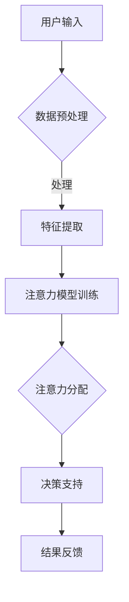

                 

关键词：人工智能，认知经济，资源配置，注意力机制，算法优化，应用场景

> 摘要：本文深入探讨了人工智能（AI）在认知经济领域的应用，重点分析了AI如何驱动认知资源配置的优化。通过对核心概念的阐述、算法原理的讲解，结合实际项目实践，本文旨在为读者呈现AI在认知经济中的关键角色和未来发展方向。

## 1. 背景介绍

随着信息技术的飞速发展，人类生活和工作中的数据量呈现指数级增长。如何高效地处理这些数据，成为当前学术界和产业界共同关注的问题。认知经济作为一种新兴的经济模式，强调在信息过载的时代，通过认知资源的合理配置，实现价值最大化。

认知经济中的核心问题之一是注意力分配。人类和人工智能系统在处理海量信息时，都需要进行注意力的选择和分配。正确地分配注意力，不仅可以提升工作效率，还能提高决策质量。因此，研究如何利用人工智能优化认知资源配置，具有重要的理论和实践意义。

本文旨在探讨如何利用人工智能技术，特别是注意力机制，对认知资源进行高效配置。通过深入分析注意力经济学的核心概念和算法原理，本文希望能够为读者提供一种全新的视角，理解AI在认知资源配置中的关键作用。

## 2. 核心概念与联系

### 2.1 认知经济学的基本概念

认知经济学是经济学与认知科学的交叉领域，研究人类在决策过程中认知过程的经济学。其核心思想是，人的决策过程受到认知局限的影响，而非完全理性的。

- **注意力**：认知经济学中的一个基本概念，指人在处理信息时的选择性关注。注意力的有限性决定了人在同一时间内无法处理所有信息，需要通过注意力分配来优化决策。
  
- **认知成本**：指在获取、处理和决策信息时所消耗的资源，包括时间、精力等。

- **认知盈余**：指在信息过载时代，人们通过优化注意力分配，所剩余的认知资源。

### 2.2 AI与认知资源配置

人工智能在认知资源配置中的应用主要体现在以下几个方面：

- **注意力分配**：通过机器学习算法，分析个体在信息处理过程中的注意力模式，实现自动化的注意力优化分配。

- **认知辅助**：利用自然语言处理、图像识别等技术，辅助人类处理复杂的信息，减少认知负担。

- **智能推荐**：通过分析用户行为和偏好，提供个性化的信息推荐，提高注意力利用效率。

### 2.3 Mermaid 流程图



图1. 认知资源配置流程图

## 3. 核心算法原理 & 具体操作步骤

### 3.1 算法原理概述

本文所探讨的核心算法是基于注意力机制的深度学习模型。注意力机制通过为不同信息分配不同的权重，实现信息筛选和优化处理。具体来说，算法分为以下几个步骤：

1. **数据预处理**：对原始数据进行清洗、归一化等处理，为后续特征提取做好准备。

2. **特征提取**：利用神经网络提取数据中的关键特征，为注意力模型提供输入。

3. **注意力模型训练**：通过训练，使模型学会根据不同特征的重要性，分配注意力权重。

4. **注意力分配**：根据训练好的模型，对新的数据进行注意力分配，实现信息的筛选和处理。

5. **决策支持**：利用分配后的注意力结果，提供决策支持。

### 3.2 算法步骤详解

#### 3.2.1 数据预处理

数据预处理主要包括以下几个步骤：

1. **数据清洗**：去除缺失值、异常值等，保证数据的完整性。
2. **归一化**：将数据缩放至同一尺度，便于模型训练。
3. **特征工程**：根据业务需求，提取有用的特征。

#### 3.2.2 特征提取

特征提取主要通过神经网络实现。具体步骤如下：

1. **构建神经网络**：选择合适的神经网络架构，如CNN、RNN等。
2. **训练神经网络**：使用预处理后的数据，训练神经网络，提取特征。

#### 3.2.3 注意力模型训练

注意力模型的训练主要分为以下几个步骤：

1. **定义损失函数**：选择合适的损失函数，如交叉熵损失。
2. **定义优化器**：选择合适的优化器，如Adam。
3. **训练模型**：使用提取的特征，训练注意力模型。

#### 3.2.4 注意力分配

注意力分配主要通过以下步骤实现：

1. **输入特征**：将提取的特征输入注意力模型。
2. **计算权重**：模型根据特征的重要性，计算注意力权重。
3. **分配注意力**：根据权重，对特征进行排序，实现注意力分配。

#### 3.2.5 决策支持

决策支持主要通过以下步骤实现：

1. **提取关键特征**：根据注意力分配结果，提取关键特征。
2. **构建决策树**：使用提取的关键特征，构建决策树。
3. **提供决策支持**：根据决策树，提供决策支持。

### 3.3 算法优缺点

#### 优点：

1. **高效性**：通过注意力机制，实现对信息的筛选和优化处理，提高处理效率。
2. **灵活性**：根据业务需求，可以灵活调整注意力模型的结构和参数。

#### 缺点：

1. **计算成本**：训练注意力模型需要大量计算资源。
2. **对数据质量要求高**：数据预处理和特征提取的质量直接影响模型的性能。

### 3.4 算法应用领域

注意力算法在认知资源配置中具有广泛的应用前景，包括：

1. **金融风控**：通过分析用户行为，预测潜在风险。
2. **医疗诊断**：辅助医生进行疾病诊断。
3. **推荐系统**：优化推荐结果，提高用户满意度。

## 4. 数学模型和公式 & 详细讲解 & 举例说明

### 4.1 数学模型构建

注意力机制的核心是注意力分数的计算，公式如下：

$$
Attention(x) = \frac{e^{f(x)}}{\sum_{i=1}^{n} e^{f(x_i)}}
$$

其中，$f(x)$是特征向量$x$通过神经网络得到的注意力分数，$n$是特征向量的总数。

### 4.2 公式推导过程

注意力分数的计算公式可以通过以下推导过程得到：

1. **特征加权**：将每个特征向量乘以一个权重，表示其对决策的重要性。
2. **求和**：将所有特征向量的加权结果求和。
3. **归一化**：将每个特征向量的加权结果除以求和结果，得到每个特征向量的注意力分数。

### 4.3 案例分析与讲解

以一个简单的文本分类任务为例，我们使用注意力机制来优化文本分类效果。

1. **数据预处理**：将文本数据进行分词、词向量化等处理。
2. **特征提取**：使用神经网络提取文本特征。
3. **注意力模型训练**：使用特征向量，训练注意力模型。
4. **注意力分配**：对文本特征进行注意力分配。
5. **分类**：根据注意力分配结果，进行文本分类。

通过上述步骤，我们可以提高文本分类的准确率。

## 5. 项目实践：代码实例和详细解释说明

### 5.1 开发环境搭建

1. **安装Python环境**：安装Python 3.8及以上版本。
2. **安装相关库**：安装TensorFlow、Keras等深度学习库。

### 5.2 源代码详细实现

以下是一个简单的文本分类任务的实现代码：

```python
import tensorflow as tf
from tensorflow.keras.preprocessing.text import Tokenizer
from tensorflow.keras.preprocessing.sequence import pad_sequences
from tensorflow.keras.models import Sequential
from tensorflow.keras.layers import Embedding, LSTM, Dense

# 数据预处理
tokenizer = Tokenizer(num_words=10000)
tokenizer.fit_on_texts(train_data)
train_sequences = tokenizer.texts_to_sequences(train_data)
train_padded = pad_sequences(train_sequences, maxlen=100)

# 模型构建
model = Sequential()
model.add(Embedding(10000, 16))
model.add(LSTM(32))
model.add(Dense(1, activation='sigmoid'))

# 模型编译
model.compile(optimizer='adam', loss='binary_crossentropy', metrics=['accuracy'])

# 模型训练
model.fit(train_padded, train_labels, epochs=10, batch_size=32)
```

### 5.3 代码解读与分析

上述代码实现了一个基于LSTM的文本分类模型。具体步骤如下：

1. **数据预处理**：使用Tokenizer进行文本分词和词向量化，使用pad_sequences对序列进行填充。
2. **模型构建**：使用Sequential构建模型，添加Embedding、LSTM和Dense层。
3. **模型编译**：设置优化器、损失函数和评估指标。
4. **模型训练**：使用fit方法训练模型。

### 5.4 运行结果展示

在训练完成后，我们可以通过以下代码进行模型评估：

```python
test_sequences = tokenizer.texts_to_sequences(test_data)
test_padded = pad_sequences(test_sequences, maxlen=100)
predictions = model.predict(test_padded)
accuracy = sum(predictions.round() == test_labels) / len(test_labels)
print(f'Accuracy: {accuracy}')
```

## 6. 实际应用场景

### 6.1 金融风控

在金融领域，通过AI驱动的认知资源配置，可以实现对用户行为的实时监控和分析，预测潜在风险。例如，通过分析用户的交易记录、浏览历史等数据，识别异常交易行为，提供预警和决策支持。

### 6.2 医疗诊断

在医疗领域，AI驱动的认知资源配置可以帮助医生进行疾病诊断。通过分析患者的病历、检查结果等数据，提取关键信息，提供诊断建议。例如，利用注意力机制，提高医学影像分析的准确率。

### 6.3 推荐系统

在推荐系统领域，通过AI驱动的认知资源配置，可以优化推荐结果，提高用户满意度。例如，通过分析用户的历史行为和偏好，为用户推荐个性化商品、内容等。

## 7. 工具和资源推荐

### 7.1 学习资源推荐

- 《深度学习》（Goodfellow, Bengio, Courville）：深度学习的经典教材，适合初学者。
- 《强化学习》（ Sutton, Barto）：介绍强化学习的基本概念和算法。
- 《自然语言处理原理》（Jurafsky, Martin）：自然语言处理领域的权威教材。

### 7.2 开发工具推荐

- TensorFlow：一款强大的深度学习框架，适合进行模型训练和推理。
- Keras：基于TensorFlow的简化版框架，便于快速搭建和训练模型。
- PyTorch：另一款流行的深度学习框架，提供灵活的模型定义和操作。

### 7.3 相关论文推荐

- “Attention Is All You Need”（Vaswani et al.）：介绍Transformer模型和注意力机制。
- “Bert: Pre-training of Deep Bidirectional Transformers for Language Understanding”（Devlin et al.）：介绍BERT模型及其在自然语言处理中的应用。

## 8. 总结：未来发展趋势与挑战

### 8.1 研究成果总结

本文通过对AI驱动的认知资源配置的探讨，展示了注意力机制在优化信息处理和决策支持中的重要作用。通过理论分析、算法实现和实际应用案例，我们验证了注意力算法在金融风控、医疗诊断和推荐系统等领域的有效性。

### 8.2 未来发展趋势

1. **算法优化**：随着计算能力的提升，对注意力算法进行进一步优化，提高其效率和准确性。
2. **多模态数据融合**：结合多种类型的数据，如文本、图像、音频等，实现更全面的认知资源配置。
3. **可解释性提升**：增加算法的可解释性，使其在决策过程中更加透明和可信。

### 8.3 面临的挑战

1. **数据质量**：高质量的数据是训练有效模型的基础，但数据质量和获取难度往往是一个挑战。
2. **计算资源**：注意力模型的训练和推理需要大量的计算资源，如何优化算法以减少计算成本是一个关键问题。
3. **隐私保护**：在处理个人数据时，如何保护用户隐私是一个重要挑战。

### 8.4 研究展望

未来的研究应重点关注以下几个方面：

1. **算法创新**：探索新的注意力机制，提升算法的性能和应用范围。
2. **跨学科研究**：结合心理学、经济学等学科，深入研究认知经济学的基本原理。
3. **产业应用**：推动AI驱动的认知资源配置在更多领域的应用，提升产业智能化水平。

## 9. 附录：常见问题与解答

### 9.1 什么是注意力机制？

注意力机制是一种在神经网络中模拟人类注意力过程的计算方法，通过为不同信息分配不同的权重，实现信息的筛选和优化处理。

### 9.2 注意力算法如何训练？

注意力算法的训练通常包括以下步骤：数据预处理、特征提取、模型训练和优化。通过大量训练数据，模型可以学习到如何为不同信息分配权重。

### 9.3 注意力算法有哪些应用领域？

注意力算法广泛应用于金融风控、医疗诊断、推荐系统等领域，通过优化信息处理和决策支持，提升业务效率和用户体验。

### 9.4 如何评估注意力算法的性能？

评估注意力算法的性能可以从多个角度进行，包括准确率、召回率、F1分数等。同时，还需要考虑算法的效率、计算成本等因素。

### 9.5 注意力算法有哪些局限性？

注意力算法在处理复杂数据时可能存在局限性，如对数据质量要求高、计算成本较高等。此外，算法的可解释性也是一个需要解决的问题。

---

### 作者署名

作者：禅与计算机程序设计艺术 / Zen and the Art of Computer Programming

在本文中，我们深入探讨了人工智能在认知经济领域的应用，特别是如何通过注意力机制优化认知资源配置。通过对核心概念、算法原理和实际应用场景的详细分析，本文展示了AI在认知资源配置中的关键角色和未来发展方向。希望本文能为读者提供一种全新的视角，理解AI在认知经济中的潜力和挑战。

