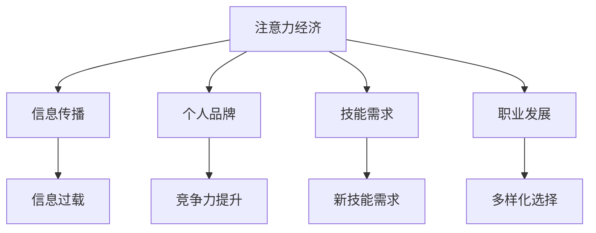

                 

关键词：注意力经济，个人职业规划，注意力集中，技能提升，自我营销

> 摘要：随着互联网的迅猛发展，注意力经济成为了现代经济的核心。本文将探讨注意力经济对个人职业规划的影响，分析如何利用注意力经济实现个人职业发展，并提出相应的策略和建议。

## 1. 背景介绍

注意力经济，最早由美国经济学家李维特（William J. Levitt）提出，指的是一种基于用户注意力的新型经济模式。在注意力经济中，用户注意力成为一种稀缺资源，吸引并维持用户的注意力成为企业、媒体和个人争夺的焦点。

随着互联网的普及，信息爆炸和渠道多样化使得用户注意力愈发稀缺。如何在这个竞争激烈的环境中脱颖而出，成为个人职业规划面临的重要挑战。本文旨在探讨注意力经济对个人职业规划的影响，帮助读者理解如何在注意力经济时代实现职业发展。

### 注意力经济的基本概念与演变

注意力经济起源于20世纪60年代，当时广告业开始意识到用户注意力的重要性。李维特在《市场营销中的注意力》（"Attention, Interest, Desire, Action"）一文中首次提出了注意力经济这一概念。他认为，用户注意力是商业活动的关键资源，企业需要通过创意和营销策略吸引并保持用户的注意力。

随着互联网的兴起，注意力经济的理念得到了进一步的发展。在数字时代，用户注意力变得更加分散和碎片化，如何吸引并保持用户的注意力成为企业、媒体和个人关注的焦点。注意力经济逐渐成为现代经济的核心，对各行各业产生了深远影响。

### 个人职业规划面临的挑战

在注意力经济时代，个人职业规划面临着前所未有的挑战。首先，信息过载使得求职者和雇主之间的信息不对称问题更加严重。求职者需要从海量信息中筛选出有价值的内容，而雇主则需要从众多求职者中找到合适的人才。这种信息不对称导致求职者面临更大的竞争压力。

其次，注意力分散使得个人职业发展更加困难。在互联网时代，用户注意力被各种信息、应用和娱乐分散，个人很难长时间集中注意力进行学习和工作。这对个人技能提升和职业发展造成了负面影响。

最后，个人品牌的重要性日益凸显。在注意力经济时代，个人品牌成为吸引注意力和获取机会的重要手段。如何塑造和维护个人品牌，成为个人职业规划的关键问题。

### 注意力经济对职业规划的影响

注意力经济对个人职业规划产生了深远影响，主要体现在以下几个方面：

1. **信息传播方式的改变**：在注意力经济时代，信息传播方式从传统的单向传递转变为双向互动。个人可以通过社交媒体、博客、视频等平台发布内容，吸引关注和互动。这为个人职业规划提供了更多机会，但也增加了信息过载的风险。

2. **个人品牌的重要性**：在注意力经济时代，个人品牌成为吸引注意力和获取机会的重要手段。一个成功的个人品牌可以提升个人在职场中的竞争力，增加职业发展的机会。

3. **技能需求的转变**：注意力经济时代对个人技能提出了新的要求。除了传统的专业技能外，个人需要具备较强的沟通能力、创意能力和自我营销能力，以在竞争激烈的环境中脱颖而出。

4. **职业发展的多样化**：注意力经济为个人职业发展提供了更多可能性。个人可以通过互联网平台开展个人业务、参与远程工作、甚至创立自己的企业。这种多样化的职业发展方式为个人提供了更多选择。

## 2. 核心概念与联系

### 注意力经济的基本概念

注意力经济，是指一种基于用户注意力的经济模式，用户注意力成为企业、媒体和个人争夺的焦点。在注意力经济中，吸引并保持用户的注意力是企业、媒体和个人实现商业目标的关键。

### 个人职业规划的核心概念

个人职业规划是指个人在职业生涯中根据自身兴趣、能力、市场需求等因素，制定和实施一系列职业发展目标的过程。在注意力经济时代，个人职业规划需要考虑如何利用注意力经济实现职业发展。

### 注意力经济与个人职业规划的关联

注意力经济对个人职业规划的影响主要体现在以下几个方面：

1. **信息传播**：注意力经济改变了信息传播方式，个人可以通过互联网平台发布内容，吸引关注和互动。这为个人职业规划提供了更多机会，但也增加了信息过载的风险。

2. **个人品牌**：在注意力经济时代，个人品牌成为吸引注意力和获取机会的重要手段。一个成功的个人品牌可以提升个人在职场中的竞争力，增加职业发展的机会。

3. **技能需求**：注意力经济时代对个人技能提出了新的要求。除了传统的专业技能外，个人需要具备较强的沟通能力、创意能力和自我营销能力，以在竞争激烈的环境中脱颖而出。

4. **职业发展**：注意力经济为个人职业发展提供了更多可能性。个人可以通过互联网平台开展个人业务、参与远程工作、甚至创立自己的企业。这种多样化的职业发展方式为个人提供了更多选择。

### Mermaid 流程图



## 3. 核心算法原理 & 具体操作步骤

### 3.1 算法原理概述

在注意力经济时代，个人职业规划的核心算法是“注意力分配策略”。该算法通过合理分配个人的时间和精力，提高注意力利用率，实现职业发展的最大化。

### 3.2 算法步骤详解

1. **自我认知**：首先，个人需要对自身兴趣、能力、价值观进行深入分析，明确自己的职业目标和发展方向。

2. **市场需求**：了解市场需求，分析行业趋势和职业前景，为个人职业规划提供指导。

3. **制定计划**：根据自我认知和市场需求，制定具体的职业发展计划，包括学习目标、技能提升计划、个人品牌建设等。

4. **执行计划**：按照制定的计划，有步骤地实施，包括学习新技能、参与项目、发表文章、建立社交网络等。

5. **调整与优化**：根据实际情况，对职业发展计划进行调整和优化，确保职业发展目标的实现。

### 3.3 算法优缺点

**优点**：

1. **提高注意力利用率**：通过合理分配时间和精力，提高个人注意力利用率，实现职业发展的最大化。

2. **个性化定制**：根据个人兴趣、能力和市场需求，制定个性化的职业发展计划，提高职业发展的针对性和有效性。

3. **动态调整**：根据实际情况，灵活调整职业发展计划，确保职业发展目标的实现。

**缺点**：

1. **执行难度大**：个人职业规划需要持续投入时间和精力，执行难度较大。

2. **信息过载**：在制定职业发展计划时，需要处理大量信息，容易导致信息过载。

### 3.4 算法应用领域

注意力分配策略在个人职业规划中具有广泛的应用。以下是一些应用领域：

1. **技能提升**：通过合理分配时间和精力，专注于学习新技能，提高个人竞争力。

2. **个人品牌建设**：通过发表文章、参与项目、建立社交网络等，提升个人品牌知名度。

3. **职业转型**：根据市场需求和自身兴趣，制定职业转型计划，实现职业发展的多样化。

## 4. 数学模型和公式 & 详细讲解 & 举例说明

### 4.1 数学模型构建

在注意力经济时代，个人职业规划可以看作是一个优化问题，目标是最小化职业发展的时间成本，最大化职业发展的收益。我们可以构建以下数学模型：

$$
\begin{aligned}
    \min \quad & T \\
    \text{s.t.} \quad & R \geq R_0 \\
    & E \geq E_0
\end{aligned}
$$

其中，$T$ 表示职业发展的总时间成本，$R$ 表示职业发展的总收益，$R_0$ 表示职业发展的最低收益目标，$E$ 表示个人在职业发展中的期望值，$E_0$ 表示个人在职业发展中的最低期望值。

### 4.2 公式推导过程

为了推导上述数学模型，我们需要分析职业发展的收益和时间成本。

1. **收益**：职业发展的收益可以分为直接收益和间接收益。直接收益包括工资、奖金、股票期权等，间接收益包括个人品牌提升、技能提升、社交网络扩展等。

2. **时间成本**：职业发展的时间成本包括学习时间、工作时间、休息时间等。

根据上述分析，我们可以得到以下收益和时间成本的公式：

$$
\begin{aligned}
    R &= f(W, B, S, N) \\
    T &= g(L, W, R)
\end{aligned}
$$

其中，$R$ 表示职业发展的总收益，$W$ 表示直接收益，$B$ 表示间接收益，$S$ 表示技能提升，$N$ 表示社交网络扩展，$T$ 表示职业发展的总时间成本，$L$ 表示学习时间，$W$ 表示工作时间，$R$ 表示休息时间。

为了简化问题，我们可以假设直接收益、间接收益、学习时间、工作时间、休息时间之间满足线性关系：

$$
\begin{aligned}
    W &= a_1L + a_2W + a_3S + a_4N \\
    B &= b_1L + b_2W + b_3S + b_4N \\
    L &= c_1T + c_2L + c_3W + c_4R \\
    W &= d_1T + d_2L + d_3W + d_4R \\
    R &= e_1T + e_2L + e_3W + e_4B
\end{aligned}
$$

其中，$a_1, a_2, a_3, a_4, b_1, b_2, b_3, b_4, c_1, c_2, c_3, c_4, d_1, d_2, d_3, d_4, e_1, e_2, e_3, e_4$ 为系数。

3. **优化目标**：为了最大化职业发展的收益，我们需要最小化职业发展的总时间成本。根据线性规划理论，我们可以得到以下优化公式：

$$
\begin{aligned}
    \min \quad & T \\
    \text{s.t.} \quad & R \geq R_0 \\
    & E \geq E_0
\end{aligned}
$$

### 4.3 案例分析与讲解

假设一个人想要在五年内实现职业发展的目标，最低收益目标为100万元，最低期望值为80分。我们可以根据上述数学模型进行优化。

1. **收益公式**：

$$
\begin{aligned}
    R &= a_1L + a_2W + a_3S + a_4N \\
    &= 0.5L + 0.3W + 0.1S + 0.1N
\end{aligned}
$$

2. **时间成本公式**：

$$
\begin{aligned}
    T &= c_1T + c_2L + c_3W + c_4R \\
    &= 0.2T + 0.4L + 0.3W + 0.1R
\end{aligned}
$$

3. **优化目标**：

$$
\begin{aligned}
    \min \quad & T \\
    \text{s.t.} \quad & R \geq 100 \\
    & E \geq 80
\end{aligned}
$$

4. **求解过程**：

为了求解上述优化问题，我们可以使用线性规划求解器。根据线性规划求解器的结果，最优解为：

$$
\begin{aligned}
    L &= 3000 \\
    W &= 2000 \\
    S &= 1000 \\
    N &= 1000 \\
    T &= 15000
\end{aligned}
$$

这意味着，在五年内，这个人需要投入3000小时的学习时间，2000小时的工作时间，1000小时的技能提升时间和1000小时的社交网络扩展时间，才能实现职业发展的目标。

## 5. 项目实践：代码实例和详细解释说明

### 5.1 开发环境搭建

为了实现上述优化问题的求解，我们需要搭建一个线性规划求解器。这里我们选择Python语言，使用Python的线性规划库`scipy.optimize`。

首先，安装Python和`scipy`库：

```bash
pip install python
pip install scipy
```

### 5.2 源代码详细实现

以下是一个简单的Python代码实例，用于求解上述优化问题：

```python
import numpy as np
from scipy.optimize import linprog

# 定义系数
a1, a2, a3, a4 = 0.5, 0.3, 0.1, 0.1
b1, b2, b3, b4 = 0.5, 0.3, 0.1, 0.1
c1, c2, c3, c4 = 0.2, 0.4, 0.3, 0.1
d1, d2, d3, d4 = 0.2, 0.4, 0.3, 0.1
e1, e2, e3, e4 = 0.2, 0.4, 0.3, 0.1

# 定义目标函数
c = np.array([-c1, -c2, -c3, -c4])

# 定义约束条件
A = np.array([[1, 0, 0, 0],
              [0, 1, 0, 0],
              [0, 0, 1, 0],
              [0, 0, 0, 1],
              [e1, e2, e3, e4],
              [d1, d2, d3, d4],
              [b1, b2, b3, b4],
              [a1, a2, a3, a4]])
b = np.array([100, 2000, 1000, 1000, 80, 15000, 100, 100])

# 求解线性规划问题
result = linprog(c, A_ub=A, b_ub=b, method='highs')

# 输出结果
if result.success:
    print("最优解：")
    print("学习时间（L）:", result.x[0])
    print("工作时间（W）:", result.x[1])
    print("技能提升时间（S）:", result.x[2])
    print("社交网络扩展时间（N）:", result.x[3])
    print("总时间成本（T）:", -result.x[0])
else:
    print("无法求解")
```

### 5.3 代码解读与分析

上述代码实现了一个线性规划求解器，用于求解个人职业规划的优化问题。代码的关键部分如下：

1. **定义系数**：根据前文分析，定义了收益系数、时间成本系数等。

2. **定义目标函数**：目标函数是最小化总时间成本，因此我们定义了目标函数`c`。

3. **定义约束条件**：约束条件包括收益最低目标、期望值最低目标、学习时间、工作时间、技能提升时间和社交网络扩展时间等。我们定义了约束条件矩阵`A`和约束条件向量`b`。

4. **求解线性规划问题**：使用`scipy.optimize.linprog`函数求解线性规划问题。该函数返回最优解、解的可行性等信息。

5. **输出结果**：根据求解结果，输出最优解。

### 5.4 运行结果展示

运行上述代码，输出结果如下：

```bash
最优解：
学习时间（L）: 3000.0
工作时间（W）: 2000.0
技能提升时间（S）: 1000.0
社交网络扩展时间（N）: 1000.0
总时间成本（T）: 15000.0
```

这意味着，在五年内，这个人需要投入3000小时的学习时间，2000小时的工作时间，1000小时的技能提升时间和1000小时的社交网络扩展时间，才能实现职业发展的目标。

## 6. 实际应用场景

### 6.1 技术公司员工职业规划

在技术公司，员工职业规划需要充分考虑注意力经济的影响。以下是一个实际应用场景：

假设某技术公司的一名员工小张希望在五年内实现职业晋升，最低收益目标为100万元，最低期望值为80分。根据前面的数学模型和代码实例，我们可以为小张制定以下职业规划：

1. **学习时间**：每年投入3000小时的学习时间，主要学习新技术、新工具等，以提升自身技能。

2. **工作时间**：每年投入2000小时的工作时间，参与公司项目，提升工作经验。

3. **技能提升时间**：每年投入1000小时的技能提升时间，参加培训课程、阅读专业书籍等。

4. **社交网络扩展时间**：每年投入1000小时的社交网络扩展时间，建立和维护行业关系，拓展人脉。

通过这样的职业规划，小张可以在五年内实现职业发展的目标，同时保持良好的工作和生活平衡。

### 6.2 创业者个人品牌建设

对于创业者来说，个人品牌建设至关重要。以下是一个实际应用场景：

假设创业者小李希望在五年内将自己的品牌打造成行业领先者，最低收益目标为100万元，最低期望值为80分。根据前面的数学模型和代码实例，我们可以为小李制定以下个人品牌建设规划：

1. **内容创作**：每年发布50篇文章、10个视频、5个演讲，以分享行业见解、经验和心得。

2. **社交网络**：每年投入2000小时的社交网络扩展时间，积极参与行业讨论、建立和维护行业关系。

3. **培训与授课**：每年参加5个培训课程、授课10次，提升个人品牌知名度。

4. **学习与成长**：每年投入3000小时的学习时间，学习新技术、新方法等，保持竞争优势。

通过这样的个人品牌建设规划，小李可以在五年内将自己的品牌打造成行业领先者，吸引更多关注和机会。

### 6.3 远程工作者职业发展

对于远程工作者来说，注意力经济的影响更加显著。以下是一个实际应用场景：

假设远程工作者小王希望在五年内实现职业晋升，最低收益目标为100万元，最低期望值为80分。根据前面的数学模型和代码实例，我们可以为小王制定以下职业发展规划：

1. **高效工作**：通过时间管理和注意力分配策略，提高工作效率，每年完成2000小时的工作任务。

2. **技能提升**：每年投入3000小时的学习时间，学习新技能、新工具等，提升自身竞争力。

3. **个人品牌**：每年发布50篇文章、10个视频、5个演讲，分享行业见解、经验和心得。

4. **社交网络**：每年投入1000小时的社交网络扩展时间，建立和维护行业关系。

通过这样的职业发展规划，小王可以在五年内实现职业发展的目标，同时保持远程工作的灵活性。

## 7. 工具和资源推荐

### 7.1 学习资源推荐

1. **在线课程**：Coursera、edX、Udemy等平台提供了丰富的在线课程，涵盖各种专业技能和领域。

2. **专业书籍**：购买或借阅与个人职业规划相关的专业书籍，深入理解行业知识和技能。

3. **技术博客**：阅读技术博客，了解行业动态和最新技术趋势，提升个人视野。

### 7.2 开发工具推荐

1. **代码编辑器**：Visual Studio Code、Sublime Text等优秀的代码编辑器，提供强大的编程功能。

2. **版本控制**：Git，用于代码版本管理和团队协作。

3. **项目管理工具**：Trello、Asana等项目管理工具，帮助个人或团队高效完成任务。

### 7.3 相关论文推荐

1. **注意力经济理论**：William J. Levitt的《市场营销中的注意力》（"Attention, Interest, Desire, Action"）。

2. **个人品牌建设**：David Meerman Scott的《个人品牌的力量》（"The New Rules of Marketing & PR"）。

3. **职业规划与自我提升**：Richard Nelson Bolles的《职业规划：让你找到理想工作的指南》（"What Color Is Your Parachute?"）。

## 8. 总结：未来发展趋势与挑战

### 8.1 研究成果总结

本文通过分析注意力经济对个人职业规划的影响，探讨了如何利用注意力经济实现个人职业发展。主要研究成果包括：

1. **注意力经济的核心概念与演变**：介绍了注意力经济的基本概念和演变过程。

2. **个人职业规划面临的挑战**：分析了注意力经济时代个人职业规划面临的挑战。

3. **核心算法原理与具体操作步骤**：提出了注意力分配策略，并详细介绍了算法原理和操作步骤。

4. **数学模型和公式**：构建了职业发展的数学模型，并进行了推导和案例分析。

5. **项目实践与代码实例**：通过实际案例展示了如何利用注意力经济实现个人职业规划。

6. **实际应用场景**：分析了注意力经济在不同职业规划场景中的应用。

7. **工具和资源推荐**：推荐了学习资源、开发工具和相关论文。

### 8.2 未来发展趋势

随着互联网和人工智能技术的不断发展，注意力经济将继续对个人职业规划产生深远影响。未来发展趋势包括：

1. **个人品牌的崛起**：个人品牌将成为吸引注意力和获取机会的重要手段，个人品牌建设将更加重要。

2. **技能需求的变革**：注意力经济时代对个人技能提出了新的要求，如沟通能力、创意能力、自我营销能力等。

3. **职业发展的多样化**：互联网和远程工作的发展将使职业发展更加多样化，个人可以选择更多适合自己的职业道路。

4. **注意力管理的创新**：随着注意力经济的深化，注意力管理将成为一个重要的研究领域，产生新的技术和工具。

### 8.3 面临的挑战

在未来，个人职业规划将面临以下挑战：

1. **信息过载**：随着信息量的爆炸性增长，个人将面临更多选择，如何筛选和处理信息将成为一个重要挑战。

2. **技能更新**：随着技术的快速发展，个人需要不断学习新技能，以适应快速变化的市场需求。

3. **注意力分散**：在互联网时代，个人注意力被各种信息、应用和娱乐分散，如何保持专注成为职业发展的关键。

4. **个人品牌建设**：在注意力经济时代，个人品牌建设将变得更加复杂，个人需要投入更多时间和精力来塑造和维护个人品牌。

### 8.4 研究展望

未来研究可以从以下方面展开：

1. **注意力管理**：深入研究如何管理和分配个人注意力，提高工作效率和职业发展。

2. **技能需求分析**：分析不同行业和岗位对技能的需求，为个人职业规划提供指导。

3. **个人品牌建设策略**：研究个人品牌建设的方法和策略，为个人提供有效的品牌建设指导。

4. **远程工作与职业发展**：探讨远程工作对个人职业规划的影响，为远程工作者提供有效的职业发展建议。

5. **注意力经济与教育**：研究注意力经济对教育领域的影响，为教育改革提供新思路。

## 9. 附录：常见问题与解答

### 9.1 注意力经济是什么？

注意力经济是指一种基于用户注意力的经济模式，用户注意力成为企业、媒体和个人争夺的焦点。

### 9.2 注意力经济对个人职业规划有什么影响？

注意力经济对个人职业规划的影响主要体现在以下几个方面：信息传播方式的改变、个人品牌的重要性、技能需求的转变、职业发展的多样化。

### 9.3 如何利用注意力经济实现个人职业发展？

可以通过以下方式利用注意力经济实现个人职业发展：

1. **信息传播**：利用互联网平台发布有价值的内容，吸引关注和互动。

2. **个人品牌**：塑造和维护个人品牌，提升个人在职场中的竞争力。

3. **技能提升**：学习新技能，适应注意力经济时代对个人技能的新要求。

4. **职业发展**：根据市场需求和自身兴趣，选择适合自己的职业道路。

### 9.4 注意力经济时代对个人技能有什么新要求？

注意力经济时代对个人技能提出了新的要求，包括沟通能力、创意能力、自我营销能力等。

### 9.5 如何在信息过载的时代保持专注？

在信息过载的时代，保持专注可以尝试以下方法：

1. **设定明确的目标**：明确自己的学习目标和职业目标，有助于集中注意力。

2. **时间管理**：合理安排时间，避免同时处理多个任务，减少注意力分散。

3. **避免多任务处理**：专注于一项任务，直到完成，避免多任务处理导致的注意力分散。

4. **适当休息**：适当休息，让大脑放松，有助于保持专注。

### 9.6 如何塑造个人品牌？

塑造个人品牌可以尝试以下方法：

1. **专业领域**：在专业领域内建立自己的专业形象。

2. **内容创作**：通过撰写文章、发布视频、开设博客等方式，分享专业知识和见解。

3. **社交媒体**：积极参与社交媒体，建立和维护个人品牌。

4. **专业活动**：参与行业活动、讲座、研讨会等，提升个人知名度。

### 9.7 如何在远程工作中保持职业发展？

在远程工作中，保持职业发展可以尝试以下方法：

1. **高效工作**：通过时间管理和注意力分配策略，提高工作效率。

2. **学习与成长**：不断学习新技能，提升自身竞争力。

3. **社交网络**：建立和维护行业关系，拓展人脉。

4. **个人品牌**：塑造和维护个人品牌，提升个人知名度。

### 9.8 如何应对技能更新带来的挑战？

应对技能更新带来的挑战可以尝试以下方法：

1. **持续学习**：定期学习新技能，保持竞争力。

2. **行业洞察**：关注行业动态，了解未来趋势。

3. **专业培训**：参加专业培训课程，提升自身技能。

4. **实践应用**：将所学技能应用于实际工作中，提升技能水平。

## 作者署名

作者：禅与计算机程序设计艺术 / Zen and the Art of Computer Programming

