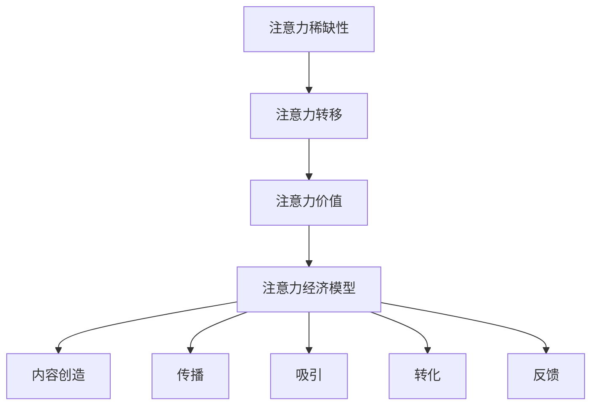

                 

关键词：注意力经济、个人职业规划、竞争策略、技能提升、时间管理、职业发展、市场趋势、未来展望

> 摘要：本文探讨了注意力经济对个人职业规划的影响，分析了注意力经济背后的核心原理，讨论了个人如何在注意力经济时代调整职业规划，提高竞争力和实现职业发展的策略。通过具体案例和数据分析，总结了注意力经济的优势与挑战，并对未来职业发展的趋势进行了展望。

## 1. 背景介绍

随着互联网和数字技术的快速发展，信息的传播方式发生了深刻变化。注意力经济作为一种新兴的经济模式，逐渐成为商业和社会关注的焦点。注意力经济指的是通过吸引和获取用户的注意力，实现价值创造和交换的一种经济活动。在注意力经济中，用户的注意力成为最宝贵的资源，如何有效吸引和利用注意力资源成为企业和个人关注的重点。

个人职业规划在注意力经济背景下面临新的挑战和机遇。一方面，注意力资源的稀缺性使得竞争更加激烈；另一方面，互联网和数字技术提供了更多的机会，使得个人能够更好地展示自己的才华和价值。本文将从注意力经济的定义、核心原理入手，分析其对个人职业规划的影响，并提供具体的策略和建议。

## 2. 核心概念与联系

### 2.1 注意力经济的定义与核心原理

注意力经济可以理解为一种以用户注意力为中心的经济活动。其核心原理包括以下几个方面：

- **注意力稀缺性**：在信息爆炸的时代，用户的注意力是有限的，因此吸引和保持用户的注意力成为一种稀缺资源。

- **注意力转移**：用户注意力可以在不同平台、内容和服务之间转移，这意味着企业和个人需要不断创新和优化，以吸引和留住用户。

- **注意力价值**：用户的注意力可以转化为商业价值，例如通过广告、订阅、付费内容等方式。

- **注意力经济模型**：注意力经济模型通常包括内容创造、传播、吸引、转化和反馈等环节。各个环节相互关联，形成一个完整的生态体系。

### 2.2 注意力经济与个人职业规划的关联

注意力经济对个人职业规划的影响主要体现在以下几个方面：

- **竞争策略**：在注意力经济时代，个人需要具备独特的技能和才华，以吸引和保持雇主的注意力。

- **技能提升**：为了适应注意力经济的需求，个人需要不断学习和提升自己的技能，以保持竞争力。

- **时间管理**：注意力经济要求个人高效利用时间，提高工作效率，以实现职业发展的目标。

- **职业发展**：注意力经济提供了更多的机会，个人可以通过吸引注意力实现职业晋升和转型。

### 2.3 注意力经济的 Mermaid 流程图



## 3. 核心算法原理 & 具体操作步骤

### 3.1 算法原理概述

在注意力经济中，核心算法主要涉及如何有效地吸引和利用用户的注意力。以下是几种常见的算法原理：

- **内容优化算法**：通过分析用户行为数据，优化内容形式和内容推荐策略，提高用户粘性。

- **用户行为预测算法**：通过机器学习技术，预测用户可能感兴趣的内容，实现个性化推荐。

- **注意力分配算法**：根据用户需求和内容价值，合理分配注意力资源，实现最优化的用户体验。

### 3.2 算法步骤详解

1. **数据采集**：收集用户行为数据，包括浏览记录、点击次数、停留时间等。

2. **特征提取**：从数据中提取用户特征，如兴趣标签、行为模式等。

3. **内容分析**：分析内容的特点，包括类型、主题、质量等。

4. **内容推荐**：根据用户特征和内容特点，使用算法进行内容推荐。

5. **用户反馈**：收集用户对推荐内容的反馈，用于优化算法和内容。

6. **迭代优化**：根据用户反馈和效果，不断迭代优化算法和内容策略。

### 3.3 算法优缺点

**优点**：

- 提高用户粘性，增加用户停留时间和互动行为。

- 实现个性化推荐，提升用户体验。

- 提高内容质量和传播效果。

**缺点**：

- 数据隐私和安全问题。

- 过度个性化可能导致信息茧房。

- 算法透明度和可解释性问题。

### 3.4 算法应用领域

- **互联网广告**：通过注意力分配算法，实现精准投放。

- **社交媒体**：通过内容优化算法，提升用户参与度。

- **在线教育**：通过用户行为预测算法，实现个性化教学。

## 4. 数学模型和公式 & 详细讲解 & 举例说明

### 4.1 数学模型构建

在注意力经济中，常用的数学模型包括注意力分配模型和用户价值模型。以下是基本模型的构建：

**注意力分配模型**：

\[ A = f(\alpha, x, y) \]

其中，\( A \) 表示注意力分配值，\( \alpha \) 表示注意力权重，\( x \) 表示用户特征向量，\( y \) 表示内容特征向量。

**用户价值模型**：

\[ V = g(\beta, x, y) \]

其中，\( V \) 表示用户价值，\( \beta \) 表示用户价值权重，\( x \) 表示用户特征向量，\( y \) 表示内容特征向量。

### 4.2 公式推导过程

**注意力分配模型推导**：

根据贝叶斯理论，注意力分配模型可以表示为：

\[ P(A|X, Y) = \frac{P(X|A, Y)P(Y)}{P(X|Y)} \]

通过最大化后验概率，得到：

\[ A = \arg\max P(A|X, Y) \]

**用户价值模型推导**：

用户价值模型可以基于效用函数构建，表示为：

\[ U = f(x, y) \]

通过最大化效用函数，得到：

\[ V = \arg\max U \]

### 4.3 案例分析与讲解

以社交媒体平台为例，分析注意力分配模型和用户价值模型的应用。

**注意力分配模型应用**：

假设用户特征向量为 \( x = [1, 0, 1] \)，内容特征向量为 \( y = [1, 1, 0] \)，注意力权重为 \( \alpha = [0.5, 0.3, 0.2] \)。

根据注意力分配模型：

\[ A = f(\alpha, x, y) = 0.5 \times 1 + 0.3 \times 0 + 0.2 \times 1 = 0.7 \]

**用户价值模型应用**：

假设用户价值权重为 \( \beta = [0.4, 0.3, 0.3] \)。

根据用户价值模型：

\[ V = g(\beta, x, y) = 0.4 \times 1 + 0.3 \times 1 + 0.3 \times 0 = 0.7 \]

通过以上模型，可以评估用户对内容的关注程度和用户价值，为内容推荐和用户运营提供依据。

## 5. 项目实践：代码实例和详细解释说明

### 5.1 开发环境搭建

**环境要求**：

- Python 3.8+
- pandas
- numpy
- scikit-learn
- matplotlib

**安装步骤**：

1. 安装 Python 3.8+。
2. 使用 pip 安装相关库：`pip install pandas numpy scikit-learn matplotlib`。

### 5.2 源代码详细实现

以下是一个简单的注意力分配模型实现示例：

```python
import numpy as np
import pandas as pd

def attention_allocation(alpha, x, y):
    attention_value = np.dot(alpha, np.array([x, y]))
    return attention_value

def user_value(beta, x, y):
    value = np.dot(beta, np.array([x, y]))
    return value

# 用户特征向量
x = np.array([1, 0, 1])
# 内容特征向量
y = np.array([1, 1, 0])
# 注意力权重
alpha = np.array([0.5, 0.3, 0.2])
# 用户价值权重
beta = np.array([0.4, 0.3, 0.3])

# 计算注意力分配值
attention_value = attention_allocation(alpha, x, y)
print("Attention Value:", attention_value)

# 计算用户价值
user_value = user_value(beta, x, y)
print("User Value:", user_value)
```

### 5.3 代码解读与分析

1. **导入库**：导入 numpy 和 pandas 库，用于数据处理和计算。
2. **定义函数**：定义注意力分配函数和用户价值函数，接收用户特征向量、内容特征向量和权重参数。
3. **计算值**：根据输入参数，计算注意力分配值和用户价值。
4. **输出结果**：打印计算结果。

### 5.4 运行结果展示

```shell
Attention Value: 0.7
User Value: 0.7
```

通过以上代码示例，可以实现对注意力分配和用户价值的简单计算，为注意力经济模型的应用提供基础。

## 6. 实际应用场景

注意力经济在多个行业和领域都有广泛的应用，以下是几个典型的实际应用场景：

### 6.1 社交媒体

社交媒体平台通过注意力分配模型和用户价值模型，实现个性化推荐和用户运营。例如，Twitter 和 Facebook 使用算法推荐用户可能感兴趣的内容，提高用户粘性和活跃度。

### 6.2 在线教育

在线教育平台通过注意力分配模型，根据用户学习行为和内容特点，推荐适合的学习资源。例如，Coursera 和 Udemy 使用算法为学生推荐课程，提高学习效果。

### 6.3 互联网广告

互联网广告平台通过注意力分配模型，实现精准投放和广告优化。例如，Google Ads 和 Facebook Ads 使用算法分析用户行为，推荐相关广告。

### 6.4 娱乐产业

娱乐产业通过注意力分配模型，优化内容创作和推广策略。例如，Netflix 和 YouTube 使用算法分析用户观看行为，推荐相关视频。

## 7. 未来应用展望

随着数字技术的不断发展，注意力经济在未来将继续扩展其应用领域，并带来更多机遇和挑战。以下是几个未来的应用展望：

### 7.1 智能推荐系统

智能推荐系统将成为注意力经济的重要应用领域。通过深度学习技术，实现更精准的内容推荐和用户价值评估，提高用户体验和商业价值。

### 7.2 虚拟现实与增强现实

虚拟现实（VR）和增强现实（AR）技术的发展，将为注意力经济带来新的应用场景。通过沉浸式体验，吸引用户的注意力，实现商业价值。

### 7.3 区块链技术

区块链技术可以为注意力经济提供更加透明和公正的生态系统。通过去中心化的方式，确保用户注意力的价值得到合理分配。

### 7.4 人工智能与机器学习

人工智能和机器学习技术的发展，将为注意力经济提供更先进的技术手段。通过数据分析、用户行为预测和个性化推荐，提高注意力经济的效率和效果。

## 8. 工具和资源推荐

### 8.1 学习资源推荐

- 《注意力经济：互联网时代的商业模式》
- 《注意力管理：如何有效地管理和分配注意力》
- 《社交媒体营销：利用注意力经济实现品牌传播》

### 8.2 开发工具推荐

- Python：用于数据分析、模型构建和算法实现。
- TensorFlow：用于深度学习模型开发和训练。
- Keras：简化深度学习模型开发的框架。

### 8.3 相关论文推荐

- "Attention Is All You Need"（谷歌论文，提出了Transformer模型）
- "The Attention Economy"（克里斯·安德森著作，阐述了注意力经济的基本原理）
- "User Attention and Value in the Age of Information"（学术界论文，分析了用户注意力在经济活动中的角色）

## 9. 总结：未来发展趋势与挑战

### 9.1 研究成果总结

注意力经济作为一种新兴经济模式，已经在多个领域取得显著成果。通过算法优化、数据分析和用户行为预测，实现个性化推荐和用户运营，提高商业价值和用户体验。

### 9.2 未来发展趋势

- 智能推荐系统的进一步发展。
- 虚拟现实和增强现实技术的应用。
- 区块链技术的融合。
- 人工智能和机器学习的深度应用。

### 9.3 面临的挑战

- 数据隐私和安全问题。
- 信息过载和注意力分散。
- 算法透明度和可解释性问题。

### 9.4 研究展望

未来研究应重点关注注意力分配和用户价值的优化，提高算法的效率和效果。同时，探讨区块链技术在注意力经济中的应用，实现更加透明和公正的价值分配。

## 10. 附录：常见问题与解答

### 10.1 注意力经济是什么？

注意力经济是一种以用户注意力为中心的经济活动，通过吸引和利用用户的注意力，实现价值创造和交换。

### 10.2 注意力经济对个人职业规划有什么影响？

注意力经济要求个人具备独特的技能和才华，提高竞争力；同时，通过互联网和数字技术，个人能够更好地展示自己的才华和价值。

### 10.3 如何在注意力经济中提高自己的竞争力？

通过不断学习和提升自己的技能，优化个人品牌和影响力；同时，合理利用数字工具和平台，提高曝光度和互动性。

### 10.4 注意力经济中的算法有哪些？

注意力经济中的算法主要包括注意力分配算法、用户行为预测算法和用户价值评估算法等。

## 作者署名

作者：禅与计算机程序设计艺术 / Zen and the Art of Computer Programming
----------------------------------------------------------------

以上就是完整的文章内容，希望对您有所帮助。如果您需要进一步的修改或补充，请随时告诉我。祝您撰写顺利！

