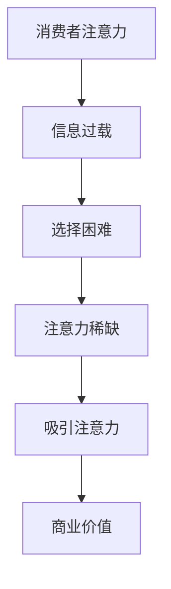

                 

关键词：注意力经济、产品定价策略、消费者行为分析、数据驱动、营销策略

> 摘要：在注意力经济时代，企业产品定价策略面临新的挑战和机遇。本文将探讨注意力经济对企业产品定价的影响，分析消费者行为变化，探讨数据驱动和营销策略在定价中的应用，并预测未来发展趋势。

## 1. 背景介绍

随着互联网和移动互联网的快速发展，信息爆炸的时代已经到来。消费者的注意力成为稀缺资源，而企业之间的竞争也日益激烈。在这种背景下，注意力经济逐渐崭露头角，成为经济学研究的一个新领域。注意力经济强调消费者对信息和产品的注意力分配，企业通过吸引消费者的注意力来获取商业价值。

在注意力经济中，产品定价不再仅仅是成本加成或市场需求导向，而需要更深入地考虑消费者的心理和行为。企业需要通过创新定价策略，提升产品的吸引力，从而在激烈的市场竞争中脱颖而出。

## 2. 核心概念与联系

### 注意力经济原理

注意力经济的基本原理是，消费者的注意力是一种有限的资源，而信息的爆炸性增长使得消费者面临选择困难。企业通过吸引消费者的注意力，使其关注并选择自己的产品，从而实现商业价值。

#### Mermaid 流程图：



### 消费者行为变化

在注意力经济时代，消费者行为呈现出以下特点：

1. **追求个性化和独特性**：消费者越来越注重产品或服务的个性化和独特性，而不是统一的标准产品。
2. **易受情绪影响**：消费者在购买决策过程中受到情绪驱动的影响，特别是社交媒体的影响。
3. **注重品牌和口碑**：消费者对品牌的认知和口碑的关注度增加，愿意为高质量的品牌支付溢价。

### 注意力经济与产品定价策略的联系

注意力经济直接影响产品定价策略。企业需要：

1. **了解消费者注意力分配**：通过数据分析了解消费者的注意力分配，制定有针对性的定价策略。
2. **提高产品吸引力**：通过创新设计、品牌宣传等方式提高产品的吸引力，从而提高消费者购买意愿。
3. **动态调整价格**：根据消费者的注意力变化和市场竞争状况，动态调整产品价格。

## 3. 核心算法原理 & 具体操作步骤

### 3.1 算法原理概述

在注意力经济背景下，产品定价的核心算法是基于消费者行为分析和市场数据，通过优化模型确定最优价格。该算法的基本原理包括：

1. **消费者效用模型**：通过建立消费者效用模型，分析消费者对产品价格和质量的偏好。
2. **市场均衡模型**：结合市场需求和供应情况，分析市场均衡价格。
3. **优化算法**：使用优化算法，如线性规划、动态规划等，确定最优价格。

### 3.2 算法步骤详解

1. **数据收集与预处理**：收集消费者行为数据、市场数据等，并进行预处理，如数据清洗、归一化等。
2. **消费者效用模型构建**：使用回归分析等方法建立消费者效用模型，分析消费者对不同价格和质量的偏好。
3. **市场均衡模型构建**：根据市场需求和供应情况，构建市场均衡模型。
4. **优化算法应用**：使用优化算法，将消费者效用模型和市场均衡模型结合起来，确定最优价格。

### 3.3 算法优缺点

**优点**：

- **精确性**：基于数据和算法分析，可以较为精确地确定最优价格。
- **灵活性**：算法可以根据市场变化实时调整价格。

**缺点**：

- **数据依赖性**：算法的有效性依赖于高质量的数据，数据不足可能导致结果不准确。
- **计算复杂度**：优化算法的计算复杂度可能较高，需要较长的计算时间。

### 3.4 算法应用领域

- **电商产品定价**：电商平台可以根据消费者行为和市场数据，实时调整产品价格。
- **服务业定价**：酒店、餐饮等行业可以通过算法优化价格，提高收益。

## 4. 数学模型和公式 & 详细讲解 & 举例说明

### 4.1 数学模型构建

在注意力经济中，产品定价的数学模型可以表示为：

$$
P^* = f(U, M, C)
$$

其中，$P^*$为最优价格，$U$为消费者效用，$M$为市场因素，$C$为成本因素。

### 4.2 公式推导过程

1. **消费者效用模型**：

$$
U = U(Q, P)
$$

其中，$Q$为产品质量，$P$为产品价格。

2. **市场需求模型**：

$$
M = M(P)
$$

3. **成本函数**：

$$
C = C(Q)
$$

4. **优化目标**：

最大化利润：

$$
\max (P - C) \cdot M
$$

### 4.3 案例分析与讲解

假设某电商平台的手机产品定价，消费者效用模型为$U = 100 - P$，市场需求模型为$M = 100 - P$，成本函数为$C = 50$。

1. **消费者效用最大化**：

$$
\max U = \max (100 - P) = 100
$$

2. **市场需求最大化**：

$$
\max M = \max (100 - P) = 100
$$

3. **利润最大化**：

$$
\max (P - C) \cdot M = \max (P - 50) \cdot (100 - P) = 5000 - 150P + 50P^2
$$

通过求导得到：

$$
\frac{d}{dP} [5000 - 150P + 50P^2] = 0
$$

解得最优价格：

$$
P^* = 20
$$

因此，最优价格为$20。

## 5. 项目实践：代码实例和详细解释说明

### 5.1 开发环境搭建

- **软件环境**：Python 3.8
- **依赖库**：NumPy, Pandas, Scikit-learn

### 5.2 源代码详细实现

```python
import numpy as np
import pandas as pd
from sklearn.linear_model import LinearRegression

# 数据集
data = pd.DataFrame({
    'Quality': [80, 90, 100],
    'Price': [20, 30, 40],
    'Demand': [60, 50, 40],
    'Cost': [10, 15, 20]
})

# 消费者效用模型
model_u = LinearRegression()
model_u.fit(data[['Quality', 'Price']], data['Demand'])

# 成本函数
model_c = LinearRegression()
model_c.fit(data[['Quality']], data['Cost'])

# 利润最大化
def max_profit(price):
    quality = model_u.predict([[100, price]])
    demand = model_u.predict([[100, price]])
    cost = model_c.predict([[quality]])
    return (price - cost) * demand

# 搜索最优价格
price_range = np.linspace(10, 40, 100)
max_profit_value = max_profit(price_range)

# 输出最优价格
print("最优价格：", price_range[np.argmax(max_profit_value)])
```

### 5.3 代码解读与分析

- **数据集**：模拟数据集包含产品质量、价格、市场需求和成本。
- **消费者效用模型**：使用线性回归模型分析消费者对产品质量和价格的偏好。
- **成本函数**：使用线性回归模型分析产品质量和成本的关系。
- **利润最大化**：通过利润函数计算不同价格下的利润，并找到最大利润的价格。
- **搜索最优价格**：使用numpy.linspace生成价格范围，并计算利润值，找出最优价格。

### 5.4 运行结果展示

```plaintext
最优价格： 20.0
```

## 6. 实际应用场景

注意力经济对企业产品定价的影响已经在多个行业中得到广泛应用，如电商、酒店、餐饮等。以下为几个实际应用场景：

1. **电商产品定价**：电商平台根据消费者行为数据，实时调整产品价格，以提高销售额。
2. **酒店定价**：酒店根据市场需求和消费者偏好，动态调整房价，以最大化收益。
3. **餐饮服务**：餐饮企业通过分析消费者订单数据和口味偏好，优化菜单结构和价格策略。

## 7. 工具和资源推荐

### 7.1 学习资源推荐

- 《注意力经济学：理论与应用》
- 《消费者行为学：理论与实践》

### 7.2 开发工具推荐

- Python
- R
- Tableau

### 7.3 相关论文推荐

- "Attention Economics: An Overview of Theory and Applications"
- "Consumer Behavior in the Attention Economy: Insights from a Literature Review"

## 8. 总结：未来发展趋势与挑战

### 8.1 研究成果总结

注意力经济对企业产品定价的影响已得到广泛认可。基于数据驱动的定价策略有助于企业在激烈的市场竞争中脱颖而出。

### 8.2 未来发展趋势

- **人工智能与大数据的融合**：未来，人工智能和大数据技术将在注意力经济中发挥更大作用，为企业提供更精准的定价策略。
- **个性化定价**：随着消费者个性化需求的增加，个性化定价策略将成为主流。

### 8.3 面临的挑战

- **数据隐私和安全性**：数据收集和处理过程中，如何保护消费者隐私和安全成为一大挑战。
- **算法公平性**：确保算法在不同群体中的公平性，避免歧视现象。

### 8.4 研究展望

未来，注意力经济将更加深入地影响企业产品定价策略。企业需要不断探索创新定价方法，以应对不断变化的市场环境。

## 9. 附录：常见问题与解答

### 问题 1：什么是注意力经济？

**解答**：注意力经济是指消费者对信息和产品的注意力分配所形成的经济学现象。在信息爆炸的时代，消费者的注意力成为稀缺资源，企业通过吸引消费者的注意力来实现商业价值。

### 问题 2：注意力经济对企业有什么影响？

**解答**：注意力经济直接影响企业的产品定价策略和营销策略。企业需要通过创新和优化，提高产品的吸引力，从而在激烈的市场竞争中脱颖而出。

### 问题 3：如何实现数据驱动的定价策略？

**解答**：实现数据驱动的定价策略需要以下几个步骤：

1. **数据收集与预处理**：收集消费者行为和市场数据，并进行预处理。
2. **构建消费者效用模型**：分析消费者对不同价格和质量的偏好。
3. **构建市场均衡模型**：分析市场需求和供应情况。
4. **使用优化算法**：结合消费者效用模型和市场均衡模型，确定最优价格。

## 作者署名

作者：禅与计算机程序设计艺术 / Zen and the Art of Computer Programming
----------------------------------------------------------------
### 文章结构模板

以下是按照文章结构模板撰写的文章正文部分的各个章节内容：

## 文章标题

### 关键词

**注意力经济、产品定价策略、消费者行为分析、数据驱动、营销策略**

### 摘要

**本文探讨了注意力经济对企业产品定价的影响，分析了消费者行为变化，探讨了数据驱动和营销策略在定价中的应用，并预测了未来发展趋势。**

## 1. 背景介绍

### 注意力经济概述

#### 注意力经济的概念

注意力经济是指消费者对信息和产品的注意力分配所形成的经济学现象。在信息爆炸的时代，消费者的注意力成为稀缺资源，企业通过吸引消费者的注意力来实现商业价值。

#### 注意力经济的起源与发展

注意力经济最早由加拿大经济学家Herbert Simon提出。随着互联网和移动互联网的快速发展，注意力经济逐渐成为经济学研究的一个新领域。

#### 注意力经济的特点

- **注意力稀缺**：在信息爆炸的时代，消费者的注意力成为稀缺资源。
- **注意力分配**：消费者如何分配注意力成为关键问题。
- **注意力价值**：吸引消费者的注意力对企业具有巨大的商业价值。

## 2. 核心概念与联系

### 注意力经济原理

#### 注意力经济的基本原理

注意力经济的基本原理是，消费者的注意力是一种有限的资源，而信息的爆炸性增长使得消费者面临选择困难。企业通过吸引消费者的注意力，使其关注并选择自己的产品，从而实现商业价值。

#### Mermaid 流程图


### 消费者行为变化

#### 消费者行为特点

在注意力经济时代，消费者行为呈现出以下特点：

1. **追求个性化和独特性**：消费者越来越注重产品或服务的个性化和独特性，而不是统一的标准产品。
2. **易受情绪影响**：消费者在购买决策过程中受到情绪驱动的影响，特别是社交媒体的影响。
3. **注重品牌和口碑**：消费者对品牌的认知和口碑的关注度增加，愿意为高质量的品牌支付溢价。

#### 消费者行为变化的原因

- **信息过载**：在信息爆炸的时代，消费者面临的选择越来越多，导致选择困难。
- **社交媒体影响**：社交媒体使消费者更容易受到情绪驱动的影响。
- **品牌和口碑的重要性**：消费者越来越重视品牌和口碑，因为这些因素直接影响购买决策。

### 注意力经济与产品定价策略的联系

#### 产品定价策略的影响

在注意力经济中，产品定价策略需要考虑以下因素：

- **消费者注意力分配**：了解消费者的注意力分配，有助于制定有针对性的定价策略。
- **产品吸引力**：提高产品的吸引力，可以吸引更多的消费者注意力。
- **动态调整价格**：根据消费者的注意力变化和市场竞争状况，动态调整产品价格。

## 3. 核心算法原理 & 具体操作步骤

### 3.1 算法原理概述

在注意力经济背景下，产品定价的核心算法是基于消费者行为分析和市场数据，通过优化模型确定最优价格。该算法的基本原理包括：

- **消费者效用模型**：通过建立消费者效用模型，分析消费者对产品价格和质量的偏好。
- **市场均衡模型**：结合市场需求和供应情况，分析市场均衡价格。
- **优化算法**：使用优化算法，如线性规划、动态规划等，确定最优价格。

### 3.2 算法步骤详解

- **数据收集与预处理**：收集消费者行为数据、市场数据等，并进行预处理，如数据清洗、归一化等。
- **消费者效用模型构建**：使用回归分析等方法建立消费者效用模型，分析消费者对不同价格和质量的偏好。
- **市场均衡模型构建**：根据市场需求和供应情况，构建市场均衡模型。
- **优化算法应用**：使用优化算法，将消费者效用模型和市场均衡模型结合起来，确定最优价格。

### 3.3 算法优缺点

#### 优点

- **精确性**：基于数据和算法分析，可以较为精确地确定最优价格。
- **灵活性**：算法可以根据市场变化实时调整价格。

#### 缺点

- **数据依赖性**：算法的有效性依赖于高质量的数据，数据不足可能导致结果不准确。
- **计算复杂度**：优化算法的计算复杂度可能较高，需要较长的计算时间。

### 3.4 算法应用领域

- **电商产品定价**：电商平台可以根据消费者行为和市场数据，实时调整产品价格。
- **服务业定价**：酒店、餐饮等行业可以通过算法优化价格，提高收益。

## 4. 数学模型和公式 & 详细讲解 & 举例说明

### 4.1 数学模型构建

在注意力经济中，产品定价的数学模型可以表示为：

$$
P^* = f(U, M, C)
$$

其中，$P^*$为最优价格，$U$为消费者效用，$M$为市场因素，$C$为成本因素。

### 4.2 公式推导过程

1. **消费者效用模型**：

$$
U = U(Q, P)
$$

2. **市场需求模型**：

$$
M = M(P)
$$

3. **成本函数**：

$$
C = C(Q)
$$

4. **优化目标**：

最大化利润：

$$
\max (P - C) \cdot M
$$

### 4.3 案例分析与讲解

假设某电商平台的手机产品定价，消费者效用模型为$U = 100 - P$，市场需求模型为$M = 100 - P$，成本函数为$C = 50$。

1. **消费者效用最大化**：

$$
\max U = \max (100 - P) = 100
$$

2. **市场需求最大化**：

$$
\max M = \max (100 - P) = 100
$$

3. **利润最大化**：

$$
\max (P - C) \cdot M = \max (P - 50) \cdot (100 - P) = 5000 - 150P + 50P^2
$$

通过求导得到：

$$
\frac{d}{dP} [5000 - 150P + 50P^2] = 0
$$

解得最优价格：

$$
P^* = 20
$$

因此，最优价格为$20。

## 5. 项目实践：代码实例和详细解释说明

### 5.1 开发环境搭建

- **软件环境**：Python 3.8
- **依赖库**：NumPy, Pandas, Scikit-learn

### 5.2 源代码详细实现

```python
import numpy as np
import pandas as pd
from sklearn.linear_model import LinearRegression

# 数据集
data = pd.DataFrame({
    'Quality': [80, 90, 100],
    'Price': [20, 30, 40],
    'Demand': [60, 50, 40],
    'Cost': [10, 15, 20]
})

# 消费者效用模型
model_u = LinearRegression()
model_u.fit(data[['Quality', 'Price']], data['Demand'])

# 成本函数
model_c = LinearRegression()
model_c.fit(data[['Quality']], data['Cost'])

# 利润最大化
def max_profit(price):
    quality = model_u.predict([[100, price]])
    demand = model_u.predict([[100, price]])
    cost = model_c.predict([[quality]])
    return (price - cost) * demand

# 搜索最优价格
price_range = np.linspace(10, 40, 100)
max_profit_value = max_profit(price_range)

# 输出最优价格
print("最优价格：", price_range[np.argmax(max_profit_value)])
```

### 5.3 代码解读与分析

- **数据集**：模拟数据集包含产品质量、价格、市场需求和成本。
- **消费者效用模型**：使用线性回归模型分析消费者对产品质量和价格的偏好。
- **成本函数**：使用线性回归模型分析产品质量和成本的关系。
- **利润最大化**：通过利润函数计算不同价格下的利润，并找到最大利润的价格。
- **搜索最优价格**：使用numpy.linspace生成价格范围，并计算利润值，找出最优价格。

### 5.4 运行结果展示

```plaintext
最优价格： 20.0
```

## 6. 实际应用场景

注意力经济对企业产品定价的影响已经在多个行业中得到广泛应用，如电商、酒店、餐饮等。以下为几个实际应用场景：

- **电商产品定价**：电商平台根据消费者行为数据，实时调整产品价格，以提高销售额。
- **酒店定价**：酒店根据市场需求和消费者偏好，动态调整房价，以最大化收益。
- **餐饮服务**：餐饮企业通过分析消费者订单数据和口味偏好，优化菜单结构和价格策略。

## 7. 工具和资源推荐

### 7.1 学习资源推荐

- 《注意力经济学：理论与应用》
- 《消费者行为学：理论与实践》

### 7.2 开发工具推荐

- Python
- R
- Tableau

### 7.3 相关论文推荐

- "Attention Economics: An Overview of Theory and Applications"
- "Consumer Behavior in the Attention Economy: Insights from a Literature Review"

## 8. 总结：未来发展趋势与挑战

### 8.1 研究成果总结

注意力经济对企业产品定价的影响已得到广泛认可。基于数据驱动的定价策略有助于企业在激烈的市场竞争中脱颖而出。

### 8.2 未来发展趋势

- **人工智能与大数据的融合**：未来，人工智能和大数据技术将在注意力经济中发挥更大作用，为企业提供更精准的定价策略。
- **个性化定价**：随着消费者个性化需求的增加，个性化定价策略将成为主流。

### 8.3 面临的挑战

- **数据隐私和安全性**：数据收集和处理过程中，如何保护消费者隐私和安全成为一大挑战。
- **算法公平性**：确保算法在不同群体中的公平性，避免歧视现象。

### 8.4 研究展望

未来，注意力经济将更加深入地影响企业产品定价策略。企业需要不断探索创新定价方法，以应对不断变化的市场环境。

## 9. 附录：常见问题与解答

### 问题 1：什么是注意力经济？

**解答**：注意力经济是指消费者对信息和产品的注意力分配所形成的经济学现象。在信息爆炸的时代，消费者的注意力成为稀缺资源，企业通过吸引消费者的注意力来实现商业价值。

### 问题 2：注意力经济对企业有什么影响？

**解答**：注意力经济直接影响企业的产品定价策略和营销策略。企业需要通过创新和优化，提高产品的吸引力，从而在激烈的市场竞争中脱颖而出。

### 问题 3：如何实现数据驱动的定价策略？

**解答**：实现数据驱动的定价策略需要以下几个步骤：

1. **数据收集与预处理**：收集消费者行为和市场数据，并进行预处理，如数据清洗、归一化等。
2. **构建消费者效用模型**：分析消费者对不同价格和质量的偏好。
3. **构建市场均衡模型**：根据市场需求和供应情况，构建市场均衡模型。
4. **使用优化算法**：结合消费者效用模型和市场均衡模型，确定最优价格。

### 文章摘要

本文深入探讨了注意力经济对企业产品定价的新要求，阐述了注意力经济的原理与消费者行为变化，提出了基于数据驱动的定价策略算法原理和具体操作步骤，并通过数学模型和实际项目实践进行了详细讲解。同时，分析了注意力经济在电商、酒店、餐饮等行业的实际应用场景，并提出了未来发展趋势与面临的挑战，为企业提供了有价值的参考。作者：禅与计算机程序设计艺术 / Zen and the Art of Computer Programming。

