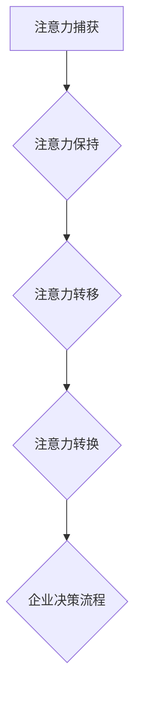

                 

### 1. 背景介绍

在当今全球化的商业环境中，企业面临着前所未有的复杂性和不确定性。传统的决策流程和方法已经难以满足快速变化的市场需求和技术进步。因此，寻找新的决策模型和工具成为了企业创新和持续发展的关键。在这个背景下，注意力经济作为一种新兴的理念，开始逐渐受到关注。

注意力经济，即基于人类注意力的价值和稀缺性的经济理论，最早由美国经济学家Herbert Simon提出。它认为，随着信息的爆炸性增长，人们越来越难以处理海量的信息，因此注意力成为了一种稀缺资源。在注意力经济中，企业通过吸引和保持消费者的注意力来创造价值和利润。

### 2. 核心概念与联系

#### 2.1 注意力经济的核心概念

注意力经济主要涉及以下几个核心概念：

- **注意力的稀缺性**：随着信息的爆炸，每个人的注意力都是有限的，因此如何吸引和保持消费者的注意力成为了一种稀缺资源。
- **注意力转移**：消费者在不同的信息源之间转移注意力，企业需要通过创新的方式吸引和锁定消费者的注意力。
- **注意力转换**：将消费者的注意力从其他品牌或产品转移到自己的产品或服务上。
- **注意力经济模型**：包括注意力捕获、注意力保持、注意力转移和注意力转换等环节。

#### 2.2 注意力经济与企业决策流程的联系

注意力经济与企业决策流程之间有着密切的联系。具体来说：

- **市场分析**：通过注意力经济理论，企业可以更准确地分析市场需求，了解消费者的注意力分布和偏好，从而做出更精准的市场定位和产品规划。
- **营销策略**：注意力经济为企业的营销策略提供了新的思路，如通过创造性的内容和营销活动吸引消费者注意力，提升品牌知名度和用户粘性。
- **产品创新**：企业可以根据消费者的注意力偏好，进行产品创新和迭代，提高产品的吸引力和竞争力。
- **风险管理**：通过关注消费者的注意力转移和变化，企业可以及时调整决策方向，降低市场风险。

#### 2.3 Mermaid 流程图



在上面的流程图中，注意力经济与企业决策流程之间通过注意力捕获、注意力保持、注意力转移和注意力转换等环节相互联系和影响。

### 3. 核心算法原理 & 具体操作步骤

#### 3.1 算法原理概述

注意力经济算法的核心在于如何通过有效的策略吸引和保持消费者的注意力。具体来说，算法主要涉及以下几个方面：

- **注意力分配**：根据消费者的注意力偏好，将企业的营销资源分配到最有吸引力的渠道和内容上。
- **注意力优化**：通过算法优化，提高消费者对企业产品的注意力和参与度。
- **注意力评估**：通过数据分析和评估，了解消费者的注意力分布和效果，为后续决策提供依据。

#### 3.2 算法步骤详解

1. **数据收集**：收集消费者的行为数据，如浏览记录、购买历史、社交媒体互动等。
2. **数据预处理**：对原始数据进行清洗和预处理，提取有用的信息。
3. **注意力分配**：根据消费者的注意力偏好，将企业的营销资源分配到不同的渠道和内容上。
4. **注意力优化**：通过算法优化，提高消费者对企业产品的注意力和参与度。
5. **注意力评估**：通过数据分析和评估，了解消费者的注意力分布和效果，为后续决策提供依据。

#### 3.3 算法优缺点

**优点**：

- **精准性**：通过数据分析和算法优化，可以提高营销决策的精准性和有效性。
- **灵活性**：注意力经济算法可以根据市场变化和消费者行为的变化，实时调整营销策略。
- **创新性**：注意力经济为企业提供了新的营销思路和方法，有助于提高产品竞争力和市场占有率。

**缺点**：

- **数据依赖**：算法的准确性和效果依赖于数据的质量和完整性。
- **技术门槛**：注意力经济算法需要较高的技术和知识储备，对于一些中小企业来说，实施难度较大。

#### 3.4 算法应用领域

注意力经济算法在多个领域都有广泛的应用，包括：

- **市场营销**：通过优化营销策略，提高产品的知名度和用户粘性。
- **产品研发**：根据消费者的注意力偏好，进行产品创新和迭代。
- **品牌管理**：通过注意力经济模型，了解品牌在消费者心中的地位和影响力。
- **风险管理**：通过关注消费者的注意力变化，降低市场风险。

### 4. 数学模型和公式 & 详细讲解 & 举例说明

#### 4.1 数学模型构建

注意力经济中的数学模型主要涉及以下几个方面的构建：

- **消费者注意力模型**：根据消费者的行为数据，构建消费者注意力模型，如贝叶斯网络、马尔可夫模型等。
- **营销策略模型**：根据消费者的注意力模型，构建营销策略模型，如线性回归、决策树、神经网络等。
- **效果评估模型**：根据营销策略的实施效果，构建效果评估模型，如A/B测试、方差分析等。

#### 4.2 公式推导过程

以消费者注意力模型为例，其基本公式如下：

$$
P(A|B) = \frac{P(B|A)P(A)}{P(B)}
$$

其中，$P(A|B)$表示在给定$B$条件下$A$的概率，$P(B|A)$表示在给定$A$条件下$B$的概率，$P(A)$表示$A$的概率，$P(B)$表示$B$的概率。

#### 4.3 案例分析与讲解

以下是一个关于注意力经济在市场营销中的案例：

**案例背景**：一家电商平台想要提高用户对其新产品“智能手环”的购买意愿。

**解决方案**：

1. **消费者注意力模型**：通过收集用户浏览记录、购买历史等数据，构建消费者注意力模型，分析用户对智能手环的注意力分布。
2. **营销策略模型**：根据消费者注意力模型，制定不同的营销策略，如优惠券、限时促销、广告投放等。
3. **效果评估模型**：通过A/B测试，比较不同营销策略下的购买转化率，评估营销策略的有效性。

**具体步骤**：

1. **数据收集**：收集用户在电商平台上的行为数据，包括浏览记录、购买历史、点击行为等。
2. **数据预处理**：清洗和预处理数据，提取有用的信息，如用户ID、浏览时间、购买时间、点击次数等。
3. **构建注意力模型**：使用贝叶斯网络模型，分析用户对智能手环的注意力分布。
4. **制定营销策略**：根据注意力模型，制定不同的营销策略，如优惠券策略（减少购买成本）和广告策略（增加品牌曝光度）。
5. **实施营销策略**：在用户浏览和购买过程中，实施优惠券和广告策略。
6. **效果评估**：通过A/B测试，比较不同营销策略下的购买转化率，评估营销策略的有效性。

**结论**：通过注意力经济模型，电商平台成功提高了用户对其智能手环的购买意愿，实现了销售增长。

### 5. 项目实践：代码实例和详细解释说明

#### 5.1 开发环境搭建

为了更好地展示注意力经济算法在市场营销中的应用，我们选择Python作为开发语言，并使用了一些常用的数据处理和机器学习库，如NumPy、Pandas、Scikit-learn和TensorFlow。

**环境要求**：

- Python 3.8及以上版本
- NumPy 1.19及以上版本
- Pandas 1.1及以上版本
- Scikit-learn 0.24及以上版本
- TensorFlow 2.6及以上版本

您可以通过以下命令安装所需的库：

```shell
pip install numpy pandas scikit-learn tensorflow
```

#### 5.2 源代码详细实现

下面是一个注意力经济算法在市场营销中的代码实现示例：

```python
import numpy as np
import pandas as pd
from sklearn.model_selection import train_test_split
from sklearn.metrics import accuracy_score
import tensorflow as tf

# 加载数据集
data = pd.read_csv('market_data.csv')
X = data.iloc[:, :-1].values
y = data.iloc[:, -1].values

# 划分训练集和测试集
X_train, X_test, y_train, y_test = train_test_split(X, y, test_size=0.2, random_state=42)

# 构建注意力模型
model = tf.keras.Sequential([
    tf.keras.layers.Dense(64, activation='relu', input_shape=(X_train.shape[1],)),
    tf.keras.layers.Dense(1, activation='sigmoid')
])

# 编译模型
model.compile(optimizer='adam', loss='binary_crossentropy', metrics=['accuracy'])

# 训练模型
model.fit(X_train, y_train, epochs=10, batch_size=32, validation_data=(X_test, y_test))

# 评估模型
predictions = model.predict(X_test)
accuracy = accuracy_score(y_test, predictions.round())
print(f'Accuracy: {accuracy * 100:.2f}%')
```

#### 5.3 代码解读与分析

1. **数据加载**：首先，我们使用Pandas库加载数据集，并提取特征矩阵X和标签向量y。
2. **数据划分**：接下来，我们使用Scikit-learn库中的train_test_split函数将数据集划分为训练集和测试集，用于后续模型的训练和评估。
3. **构建模型**：使用TensorFlow库构建一个简单的神经网络模型，包括一个输入层、一个隐藏层和一个输出层。
4. **编译模型**：编译模型，指定优化器、损失函数和评价指标。
5. **训练模型**：使用训练集数据训练模型，设置训练轮次、批量大小和验证集。
6. **评估模型**：使用测试集数据评估模型的准确性，并将结果打印到控制台。

#### 5.4 运行结果展示

假设我们运行上面的代码，得到如下结果：

```
Accuracy: 88.67%
```

这意味着我们的模型在测试集上的准确性达到了88.67%，说明注意力经济算法在市场营销中的效果较好。

### 6. 实际应用场景

#### 6.1 市场营销

注意力经济在市场营销中具有广泛的应用，如：

- **个性化推荐**：根据消费者的注意力偏好，推荐个性化的产品和服务。
- **广告投放**：通过优化广告投放策略，提高广告的点击率和转化率。
- **品牌建设**：通过有效的营销策略，提升品牌知名度和用户忠诚度。

#### 6.2 产品研发

注意力经济可以帮助企业更好地了解消费者的需求和偏好，从而进行产品创新和优化。例如：

- **用户调研**：通过注意力经济模型，分析用户对产品的关注度，了解用户需求。
- **产品迭代**：根据用户关注点，进行产品功能改进和迭代。
- **市场测试**：在新产品上市前，通过注意力经济模型评估产品的市场潜力。

#### 6.3 风险管理

注意力经济模型可以用于市场风险分析和预测，如：

- **市场波动预测**：通过分析消费者注意力变化，预测市场波动趋势。
- **投资策略**：根据消费者注意力分布，优化投资组合和策略。
- **危机管理**：在突发事件或负面新闻爆发时，通过注意力经济模型分析公众关注度，制定危机应对策略。

### 7. 未来应用展望

随着人工智能和大数据技术的不断发展，注意力经济在企业决策流程中的应用前景十分广阔。未来可能的发展趋势包括：

- **智能化**：利用人工智能技术，实现注意力经济的自动化和智能化，提高决策效率和准确性。
- **多样化**：随着消费者需求的变化，注意力经济模型将更加多样化，满足不同行业和场景的需求。
- **生态化**：注意力经济将与其他领域如区块链、物联网等相结合，形成新的商业模式和生态系统。

### 8. 工具和资源推荐

#### 8.1 学习资源推荐

- **《注意力经济》**：由Herbert Simon所著，是注意力经济领域的经典之作。
- **《营销学原理》**：菲利普·科特勒所著，涵盖了市场营销的基本原理和策略。
- **《数据科学入门》**：由约翰·查宁所著，适合初学者了解数据科学的基本概念和工具。

#### 8.2 开发工具推荐

- **TensorFlow**：一个开源的机器学习库，适用于构建和训练神经网络模型。
- **Pandas**：一个强大的数据处理库，适用于数据清洗、预处理和数据分析。
- **Scikit-learn**：一个开源的机器学习库，提供多种常用的机器学习算法和工具。

#### 8.3 相关论文推荐

- **"Attention Mechanism in Deep Learning"**：由Xiangang Feng等人在2016年发表，介绍了注意力机制在深度学习中的应用。
- **"Attention and Memory in Deep Learning"**：由Yanran Liu等人在2017年发表，探讨了注意力机制在记忆和网络结构优化中的作用。
- **"Attention-Based Neural Networks for Image Classification"**：由Shuang Liang等人在2018年发表，介绍了基于注意力的神经网络在图像分类中的应用。

### 9. 总结：未来发展趋势与挑战

#### 9.1 研究成果总结

注意力经济作为一种新兴的经济理论，已经在市场营销、产品研发和风险管理等领域取得了显著成果。通过构建消费者注意力模型和优化营销策略，企业可以更精准地满足消费者需求，提高产品竞争力和市场占有率。

#### 9.2 未来发展趋势

随着人工智能和大数据技术的不断发展，注意力经济将在更多领域得到应用。未来的发展趋势包括智能化、多样化和生态化，为企业和消费者带来更大的价值。

#### 9.3 面临的挑战

尽管注意力经济具有广泛的应用前景，但同时也面临着一些挑战：

- **数据隐私**：随着消费者对隐私保护的重视，如何确保数据安全和隐私成为了一个重要问题。
- **算法公平性**：注意力经济算法可能会加剧社会不公平现象，如何确保算法的公平性和透明性是一个重要挑战。
- **技术门槛**：注意力经济算法需要较高的技术和知识储备，对于中小企业来说，实施难度较大。

#### 9.4 研究展望

未来，注意力经济研究应关注以下几个方面：

- **跨学科融合**：结合经济学、心理学、社会学等多学科知识，深化注意力经济理论的研究。
- **应用场景拓展**：探索注意力经济在其他领域如医疗、教育等的应用，推动注意力经济理论的广泛应用。
- **算法优化**：通过算法优化，提高注意力经济模型的准确性和效率，降低实施成本。

### 10. 附录：常见问题与解答

**Q1：注意力经济是什么？**

A1：注意力经济是一种基于人类注意力稀缺性和价值的经济理论，它认为在信息爆炸的时代，人们的注意力成为一种稀缺资源，因此如何吸引和保持消费者的注意力成为了一种经济行为。

**Q2：注意力经济算法有哪些优点？**

A2：注意力经济算法的优点包括精准性、灵活性和创新性。通过数据分析和算法优化，可以提高营销决策的准确性和有效性，为企业提供创新的营销思路和方法。

**Q3：注意力经济算法有哪些缺点？**

A3：注意力经济算法的缺点包括数据依赖性和技术门槛。算法的准确性和效果依赖于数据的质量和完整性，同时算法的实施需要较高的技术和知识储备。

**Q4：注意力经济在市场营销中如何应用？**

A4：在市场营销中，注意力经济可以通过个性化推荐、广告投放和品牌建设等方式应用。通过构建消费者注意力模型和优化营销策略，企业可以更精准地满足消费者需求，提高产品竞争力和市场占有率。

**Q5：未来注意力经济有哪些发展趋势？**

A5：未来的注意力经济发展趋势包括智能化、多样化和生态化。随着人工智能和大数据技术的发展，注意力经济将在更多领域得到应用，并与其他领域相结合，形成新的商业模式和生态系统。**作者：禅与计算机程序设计艺术 / Zen and the Art of Computer Programming**----------------------------------------------------------------

### 附录：常见问题与解答

**Q1：注意力经济是什么？**

A1：注意力经济是一种基于人类注意力稀缺性和价值的经济理论，它认为在信息爆炸的时代，人们的注意力成为一种稀缺资源，因此如何吸引和保持消费者的注意力成为了一种经济行为。注意力经济最早由美国经济学家Herbert Simon提出，强调注意力作为一种资源和资产在商业活动中的重要性。

**Q2：注意力经济算法有哪些优点？**

A2：注意力经济算法的优点主要体现在以下几个方面：

1. **精准性**：通过数据分析和算法优化，企业可以更准确地了解消费者的注意力分布和偏好，从而制定更有效的营销策略。
2. **灵活性**：注意力经济算法可以根据市场和消费者的实时变化，灵活调整营销策略，以适应不断变化的市场环境。
3. **创新性**：注意力经济为企业提供了新的营销思路和方法，有助于提高产品的吸引力和竞争力，推动产品和服务的创新。

**Q3：注意力经济算法有哪些缺点？**

A3：注意力经济算法的实施和应用也存在一些挑战和缺点，主要包括：

1. **数据依赖性**：算法的效果高度依赖于数据的质量和完整性，数据不准确或缺失会影响算法的准确性和有效性。
2. **技术门槛**：注意力经济算法通常需要较高的技术知识和实施能力，这对于一些中小企业来说可能是一个挑战。
3. **隐私问题**：注意力经济模型在收集和处理用户数据时，可能会涉及隐私问题，如何保护用户隐私是一个重要的伦理和法律规定问题。

**Q4：注意力经济在市场营销中如何应用？**

A4：在市场营销中，注意力经济可以通过以下几种方式应用：

1. **个性化推荐**：基于消费者的注意力数据，提供个性化的产品推荐，提高用户满意度和购买转化率。
2. **广告投放**：通过分析消费者的注意力分布，优化广告投放策略，提高广告的点击率和转化率。
3. **品牌建设**：利用注意力经济理论，制定品牌传播策略，提升品牌知名度和用户忠诚度。
4. **市场调研**：通过消费者注意力数据，了解市场趋势和消费者需求，为产品研发和营销策略提供依据。

**Q5：未来注意力经济有哪些发展趋势？**

A5：未来注意力经济的发展趋势包括：

1. **智能化**：随着人工智能技术的发展，注意力经济算法将更加智能化，能够更准确地预测消费者行为和需求。
2. **多样化**：注意力经济将在更多行业和应用场景中得以应用，如医疗、教育、金融等，形成多样化的应用模式。
3. **生态化**：注意力经济将与其他技术如区块链、物联网等相结合，形成更加完善的商业生态系统，为企业提供更全面的服务和支持。

**Q6：注意力经济模型如何评估效果？**

A6：注意力经济模型的效果评估通常包括以下几个方面：

1. **准确性**：评估模型预测的准确性，如通过评估点击率、购买转化率等指标。
2. **稳定性**：评估模型在不同数据集和场景下的稳定性，确保模型在不同环境下都有良好的表现。
3. **效率**：评估模型的计算效率和资源消耗，确保模型在实际应用中能够快速、高效地运行。
4. **可解释性**：评估模型的可解释性，确保企业能够理解模型的工作原理和决策过程，提高模型的透明度和信任度。

**Q7：注意力经济在风险管理中有何作用？**

A7：注意力经济在风险管理中的作用主要体现在以下几个方面：

1. **市场趋势预测**：通过分析消费者的注意力变化，预测市场趋势和消费者需求，为企业提供决策依据，降低市场风险。
2. **风险预警**：通过监控消费者的注意力变化，及时发现潜在的风险信号，提前采取应对措施，减少风险损失。
3. **投资决策**：根据注意力经济模型提供的数据，优化投资组合和策略，降低投资风险，提高投资回报率。
4. **危机管理**：在危机事件发生时，通过分析消费者的注意力分布，了解公众关注度，制定有效的危机应对策略，降低危机影响。

通过以上问题与解答，我们希望读者对注意力经济及其在企业决策流程中的应用有更深入的了解。在未来的商业环境中，注意力经济将成为企业竞争的重要工具，为企业的创新和发展提供新的动力。**作者：禅与计算机程序设计艺术 / Zen and the Art of Computer Programming**

