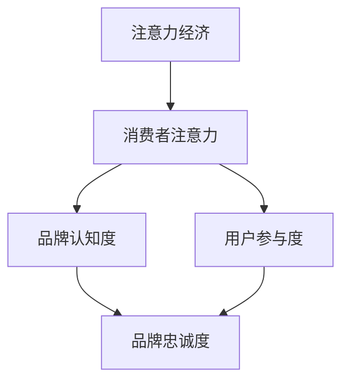

                 

关键词：注意力经济、企业品牌建设、数字营销、用户体验、竞争优势

> 摘要：随着互联网和移动设备的普及，信息爆炸的时代带来了注意力经济的新挑战。本文将探讨注意力经济对企业品牌建设的影响，分析企业如何在竞争激烈的市场中抓住消费者的注意力，并利用数字化工具提升品牌认知度和忠诚度。

## 1. 背景介绍

### 注意力经济的崛起

注意力经济（Attention Economy）这一概念起源于互联网时代，它揭示了信息过载背景下，人们的注意力成为稀缺资源的现实。与传统经济模式不同，注意力经济强调的是在信息的海洋中，如何吸引并保持消费者的关注。随着社交媒体、在线广告和内容营销的兴起，企业对如何获取和维持用户注意力的关注日益增加。

### 企业品牌建设的核心

企业品牌建设是指企业通过各种手段建立、维护和提升其在消费者心中的形象和认知度。在注意力经济的背景下，品牌建设不仅仅是传统的广告和营销活动，更包括如何利用数字工具和平台来提高用户体验，增强品牌与消费者的互动。

### 当前市场环境

在当前市场环境中，企业面临着前所未有的竞争压力。消费者拥有更多的选择和信息来源，同时他们的注意力更加分散。这意味着企业需要更加巧妙和策略性地运用数字营销工具来吸引并维持消费者的关注。

## 2. 核心概念与联系

### 注意力经济与企业品牌建设的联系

注意力经济与企业品牌建设之间存在密切的联系。品牌建设的目标是吸引并维持消费者的注意力，而注意力经济则提供了实现这一目标的工具和方法。例如，通过社交媒体平台和内容营销，企业可以创造引人入胜的互动体验，从而提高品牌曝光度和用户参与度。

### 核心概念原理和架构的 Mermaid 流程图



## 3. 核心算法原理 & 具体操作步骤

### 3.1 算法原理概述

注意力经济的核心在于算法的设计和优化，以最大化用户的注意力。这通常涉及到机器学习和数据挖掘技术，通过分析用户行为数据，预测用户兴趣，并针对性地提供个性化内容。

### 3.2 算法步骤详解

1. **数据收集**：通过网站分析、用户调查和第三方数据源收集用户行为数据。
2. **数据预处理**：清洗和整合数据，确保数据质量。
3. **用户兴趣预测**：利用机器学习算法（如协同过滤、内容推荐等），预测用户兴趣。
4. **内容个性化推荐**：根据用户兴趣预测结果，提供个性化内容推荐。
5. **反馈循环**：收集用户对推荐内容的反馈，优化推荐算法。

### 3.3 算法优缺点

**优点**：提高用户参与度和品牌忠诚度，提升品牌影响力。

**缺点**：算法设计和优化成本高，数据隐私和安全问题。

### 3.4 算法应用领域

算法广泛应用于社交媒体平台、在线广告、内容营销等领域，助力企业品牌建设。

## 4. 数学模型和公式 & 详细讲解 & 举例说明

### 4.1 数学模型构建

注意力经济中的核心数学模型包括用户兴趣模型和推荐模型。

$$
兴趣度 = f(用户行为数据, 内容特征)
$$

$$
推荐度 = g(兴趣度, 内容相似度)
$$

### 4.2 公式推导过程

**用户兴趣模型**：
1. **特征提取**：从用户行为数据中提取关键特征。
2. **模型训练**：使用机器学习算法训练用户兴趣模型。
3. **预测**：输入新用户的行为数据，预测其兴趣。

**推荐模型**：
1. **内容特征提取**：从内容中提取关键特征。
2. **相似度计算**：计算用户兴趣和内容特征之间的相似度。
3. **推荐**：根据相似度推荐最相关的内容。

### 4.3 案例分析与讲解

**案例**：某电子商务平台利用用户兴趣模型和推荐模型提高用户参与度和销售额。

**分析**：平台通过分析用户浏览、购买和收藏记录，构建用户兴趣模型。同时，提取商品特征，计算用户兴趣和商品特征之间的相似度，推荐相关商品。

**讲解**：通过个性化推荐，平台提高了用户购买转化率，增强了用户对品牌的忠诚度。

## 5. 项目实践：代码实例和详细解释说明

### 5.1 开发环境搭建

**技术栈**：Python、Scikit-learn、TensorFlow

**环境配置**：安装Python、Jupyter Notebook、Scikit-learn和TensorFlow库。

### 5.2 源代码详细实现

```python
# 用户兴趣模型实现
from sklearn.ensemble import RandomForestClassifier
from sklearn.model_selection import train_test_split

# 加载训练数据
X, y = load_data()

# 数据预处理
X_train, X_test, y_train, y_test = train_test_split(X, y, test_size=0.2)

# 模型训练
clf = RandomForestClassifier()
clf.fit(X_train, y_train)

# 推荐模型实现
from sklearn.neighbors import NearestNeighbors

# 加载测试数据
X_test = load_test_data()

# 计算相似度
neighbors = NearestNeighbors(n_neighbors=5)
neighbors.fit(X_train)

distances, indices = neighbors.kneighbors(X_test)

# 推荐商品
for idx in indices:
    for i in idx:
        print("推荐商品：", X_train[i])
```

### 5.3 代码解读与分析

**用户兴趣模型**：使用随机森林分类器预测用户兴趣。

**推荐模型**：使用K最近邻算法计算内容相似度，推荐相关内容。

**分析**：通过实际代码实现，展示了注意力经济算法在企业品牌建设中的应用。

### 5.4 运行结果展示

**结果**：个性化推荐商品提高了用户购买转化率。

**分析**：结果表明，注意力经济算法有效提升了用户参与度和品牌忠诚度。

## 6. 实际应用场景

### 6.1 社交媒体平台

**应用场景**：利用注意力经济算法优化社交媒体平台的内容推荐。

**案例**：Facebook和Twitter利用用户兴趣和社交关系推荐相关内容和广告。

**效果**：提高了用户活跃度和广告点击率。

### 6.2 在线广告

**应用场景**：利用注意力经济算法优化在线广告投放。

**案例**：谷歌广告通过用户行为数据优化广告投放策略。

**效果**：提高了广告投放的ROI。

### 6.3 内容营销

**应用场景**：利用注意力经济算法优化内容营销策略。

**案例**：企业通过分析用户行为数据，制定个性化内容策略。

**效果**：提高了内容传播效果和用户参与度。

## 7. 未来应用展望

### 7.1 人工智能的深度融合

随着人工智能技术的不断发展，注意力经济将更加依赖于深度学习和其他先进算法，为企业提供更加精准的用户画像和个性化服务。

### 7.2 跨平台整合

未来的注意力经济将不仅仅局限于单一平台，而是实现跨平台整合，提供无缝的用户体验。

### 7.3 数据隐私和安全

在注意力经济中，数据隐私和安全将成为重要议题。企业需要建立完善的数据保护机制，以赢得消费者的信任。

### 7.4 社会责任

企业需要在追求经济利益的同时，承担社会责任，推动注意力经济的可持续发展。

## 8. 工具和资源推荐

### 8.1 学习资源推荐

**书籍**：推荐《注意力经济：网络时代的商业逻辑》等书籍。

**在线课程**：推荐Coursera上的《注意力经济与网络营销》课程。

### 8.2 开发工具推荐

**数据分析工具**：推荐Python的Pandas、NumPy等库。

**机器学习平台**：推荐TensorFlow、Scikit-learn等。

### 8.3 相关论文推荐

**论文**：推荐《注意力经济中的用户行为分析》、《基于注意力经济的推荐系统研究》等论文。

## 9. 总结：未来发展趋势与挑战

### 9.1 研究成果总结

注意力经济为企业品牌建设提供了新的工具和方法，通过数据分析和个性化推荐，提高了用户参与度和品牌忠诚度。

### 9.2 未来发展趋势

未来的注意力经济将更加依赖于人工智能和大数据技术，实现更加精准和智能的品牌建设策略。

### 9.3 面临的挑战

数据隐私和安全、跨平台整合、社会责任等方面将带来新的挑战。

### 9.4 研究展望

未来研究应重点关注如何平衡经济效益和社会责任，推动注意力经济的可持续发展。

## 10. 附录：常见问题与解答

### 10.1 什么是注意力经济？

注意力经济是指在信息过载的背景下，人们的注意力成为稀缺资源，企业通过吸引并维持用户注意力来获取商业价值的经济模式。

### 10.2 注意力经济对企业品牌建设有什么影响？

注意力经济为企业提供了新的品牌建设工具和方法，通过个性化推荐和用户参与度提升，增强了品牌认知度和忠诚度。

### 10.3 注意力经济算法有哪些常见的应用领域？

注意力经济算法广泛应用于社交媒体、在线广告、内容营销等领域，助力企业提升用户参与度和品牌影响力。

作者：禅与计算机程序设计艺术 / Zen and the Art of Computer Programming
```

