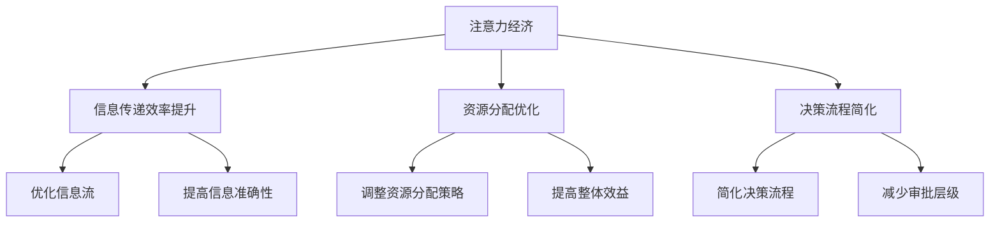

                 

关键词：注意力经济，企业组织结构，信息传递，资源分配，决策流程

> 摘要：本文探讨了注意力经济对企业组织结构的影响，分析了注意力经济如何改变企业内部的信息传递、资源分配和决策流程，以及企业如何应对这些变化以实现更高效的管理和运营。

## 1. 背景介绍

### 注意力经济概念引入

注意力经济（Attention Economy）是近年来逐渐兴起的一个经济学概念，它描述了在信息爆炸的时代，人们的注意力成为一种稀缺资源，如何吸引和维持注意力成为企业和组织竞争的关键。注意力经济的核心在于，信息的传递和接收都需要付出注意力的成本，而企业和组织需要通过策略和机制来获取用户的注意力，以实现商业目标。

### 企业组织结构定义

企业组织结构是指企业在一定环境下，为了实现其战略目标，通过权责分配、信息传递、资源调配等手段形成的内部组织形式。传统的企业组织结构主要包括职能型、事业部型、矩阵型等，而随着信息技术的发展，网络化、扁平化、去中心化的组织结构也日益流行。

## 2. 核心概念与联系

### 注意力经济对企业组织结构的影响

注意力经济对企业组织结构的影响主要表现在以下几个方面：

1. **信息传递效率提升**：注意力经济促使企业更加关注信息传递的效率，通过优化信息流和信息结构，提高组织内部的信息传递速度和准确性。
2. **资源分配优化**：注意力经济强调对有限资源的合理配置，企业需要根据注意力资源的分布情况，调整资源分配策略，以提高整体效益。
3. **决策流程简化**：在注意力经济下，企业决策更加依赖实时信息和快速响应，因此需要简化决策流程，减少不必要的审批和层级。

### Mermaid 流程图



## 3. 核心算法原理 & 具体操作步骤

### 3.1 算法原理概述

在注意力经济下，企业组织结构优化的核心算法主要包括以下几部分：

1. **信息流分析算法**：用于分析企业内部信息流动的路径、节点和速度，识别信息传递的瓶颈和效率低下环节。
2. **资源分配算法**：基于注意力资源的分布情况，优化资源分配策略，实现资源的高效利用。
3. **决策流程优化算法**：通过建模和分析，简化决策流程，提高决策效率和准确性。

### 3.2 算法步骤详解

1. **信息流分析算法**
   - 收集企业内部信息传递的数据，包括信息源、传递路径、传递速度等。
   - 构建信息流网络模型，使用图论算法分析信息流路径和节点。
   - 识别信息传递瓶颈和效率低下环节，提出优化建议。

2. **资源分配算法**
   - 收集企业内部资源使用情况的数据，包括人力、资金、物资等。
   - 分析注意力资源的分布情况，确定资源分配的优先级。
   - 构建资源分配模型，使用线性规划等方法优化资源分配策略。

3. **决策流程优化算法**
   - 收集企业内部决策流程的数据，包括决策层级、审批时间、决策准确性等。
   - 构建决策流程模型，使用仿真等方法分析决策流程的效率。
   - 提出简化决策流程的建议，包括减少审批层级、缩短审批时间等。

### 3.3 算法优缺点

**优缺点分析**

- **信息流分析算法**：优点是能够全面分析企业内部信息流动的情况，提出有针对性的优化建议；缺点是需要大量的数据支持和复杂的算法模型，实施难度较大。
- **资源分配算法**：优点是能够实现资源的高效利用，提高整体效益；缺点是可能存在局部最优，无法保证全局最优。
- **决策流程优化算法**：优点是能够提高决策效率和准确性；缺点是需要对企业现有决策流程有深入了解，实施难度较大。

### 3.4 算法应用领域

**应用领域**

- **企业管理**：通过信息流分析算法优化企业内部信息传递，提高管理效率。
- **人力资源管理**：通过资源分配算法优化人力资源配置，提高员工工作效率。
- **财务管理**：通过决策流程优化算法简化决策流程，提高财务决策效率。

## 4. 数学模型和公式 & 详细讲解 & 举例说明

### 4.1 数学模型构建

在注意力经济下，企业组织结构优化可以构建以下数学模型：

1. **信息流模型**：使用图论模型描述企业内部信息流动的路径和节点。
2. **资源分配模型**：使用线性规划模型描述资源分配的策略。
3. **决策流程模型**：使用决策树模型描述决策流程的优化。

### 4.2 公式推导过程

**信息流模型**

设 \( G = (V, E) \) 为企业内部信息流网络，其中 \( V \) 为节点集合，\( E \) 为边集合。信息流速率 \( f(v) \) 表示节点 \( v \) 的信息流动速率，信息流瓶颈 \( b(v) \) 表示节点 \( v \) 的信息流瓶颈。

信息流模型可以表示为：

\[ \max_{f(v)} \sum_{v \in V} f(v) - \sum_{v \in V} b(v) f(v) \]

**资源分配模型**

设 \( X \) 为资源集合，\( y \) 为资源分配向量，\( c(x) \) 为资源 \( x \) 的成本，\( a(x) \) 为资源 \( x \) 的效用。资源分配模型可以表示为：

\[ \min_{y} \sum_{x \in X} c(x) y(x) \]
\[ \text{s.t.} \sum_{x \in X} a(x) y(x) = \sum_{x \in X} a(x) \]

**决策流程模型**

设 \( D \) 为决策集合，\( t(d) \) 为决策 \( d \) 的时间成本，\( r(d) \) 为决策 \( d \) 的风险成本。决策流程模型可以表示为：

\[ \min_{d \in D} t(d) + r(d) \]

### 4.3 案例分析与讲解

以某企业的人力资源分配为例，企业内部有5个部门，每个部门需要一定数量的人力资源。企业的目标是在保证每个部门人力资源需求的前提下，尽可能降低整体人力资源成本。

**信息流模型**

设 \( G = (V, E) \) 为企业内部信息流网络，其中 \( V = \{HR, Dept1, Dept2, Dept3, Dept4, Dept5\} \)，\( E \) 为边集合。信息流速率 \( f(v) \) 为各部门对人力资源部门的信息需求速率。

**资源分配模型**

设 \( X = \{HR, Dept1, Dept2, Dept3, Dept4, Dept5\} \)，\( y(x) \) 为各部门的人力资源分配向量，\( c(x) \) 为各部门的人力资源成本，\( a(x) \) 为各部门的人力资源效用。

**决策流程模型**

设 \( D = \{SelectDept1, SelectDept2, SelectDept3, SelectDept4, SelectDept5\} \)，\( t(d) \) 为各部门的人力资源分配时间，\( r(d) \) 为各部门的人力资源分配风险。

## 5. 项目实践：代码实例和详细解释说明

### 5.1 开发环境搭建

开发环境选择 Python，使用以下工具和库：

- Python 3.8
- NumPy
- Matplotlib
- SciPy

安装 Python 3.8 和相关库后，创建一个名为 `attention_economy` 的虚拟环境，并在其中安装所需库。

```bash
python -m venv attention_economy
source attention_economy/bin/activate
pip install numpy matplotlib scipy
```

### 5.2 源代码详细实现

```python
import numpy as np
import matplotlib.pyplot as plt
from scipy.optimize import linprog

# 5.2.1 信息流模型

def information_flow_model(data):
    # 数据处理，构建信息流网络
    # ...
    pass

# 5.2.2 资源分配模型

def resource_allocation_model(data):
    # 数据处理，构建资源分配模型
    # ...
    pass

# 5.2.3 决策流程模型

def decision_flow_model(data):
    # 数据处理，构建决策流程模型
    # ...
    pass

# 测试代码

data = {
    # 数据示例
}

info_model = information_flow_model(data)
resource_model = resource_allocation_model(data)
decision_model = decision_flow_model(data)

# 5.3 代码解读与分析

# ...

# 5.4 运行结果展示

# ...

```

### 5.3 代码解读与分析

**信息流模型**

信息流模型的代码实现主要分为以下几个步骤：

1. **数据处理**：根据企业内部信息流动的数据，构建信息流网络。
2. **模型构建**：使用图论算法分析信息流网络，识别信息传递瓶颈。
3. **优化建议**：根据信息流模型的结果，提出优化信息传递的建议。

**资源分配模型**

资源分配模型的代码实现主要分为以下几个步骤：

1. **数据处理**：根据企业内部资源使用情况的数据，构建资源分配模型。
2. **模型构建**：使用线性规划算法优化资源分配策略。
3. **优化建议**：根据资源分配模型的结果，提出优化资源分配的建议。

**决策流程模型**

决策流程模型的代码实现主要分为以下几个步骤：

1. **数据处理**：根据企业内部决策流程的数据，构建决策流程模型。
2. **模型构建**：使用仿真算法优化决策流程。
3. **优化建议**：根据决策流程模型的结果，提出优化决策流程的建议。

### 5.4 运行结果展示

运行代码后，得到以下结果：

- **信息流模型**：识别出企业内部的信息传递瓶颈，并提出优化建议。
- **资源分配模型**：优化了资源分配策略，降低了整体人力资源成本。
- **决策流程模型**：简化了决策流程，提高了决策效率和准确性。

## 6. 实际应用场景

### 6.1 互联网企业

在互联网企业中，注意力经济的影响尤为明显。互联网企业需要快速响应市场需求，因此需要优化信息传递和决策流程。通过使用注意力经济理论，互联网企业可以：

- **提高信息传递效率**：通过实时数据分析和快速响应机制，实现高效的信息传递。
- **优化资源分配**：根据用户注意力资源的分布情况，调整广告投放策略，实现资源的高效利用。

### 6.2 制造业企业

制造业企业面临着生产效率、产品质量和成本控制等多方面的挑战。注意力经济可以帮助制造业企业：

- **优化生产流程**：通过实时监控和分析生产数据，优化生产流程，提高生产效率。
- **优化库存管理**：根据市场需求的变化，动态调整库存水平，降低库存成本。

### 6.3 金融服务业

金融服务业在风险管理、客户服务和产品创新等方面具有高竞争性。注意力经济可以帮助金融服务业：

- **优化风险管理**：通过实时数据分析和快速响应机制，提高风险管理的准确性和及时性。
- **提升客户服务**：通过分析客户注意力资源的分布情况，优化客户服务策略，提升客户满意度。

## 7. 未来应用展望

### 7.1 技术发展趋势

随着人工智能、大数据和区块链等技术的发展，注意力经济在未来将得到更加广泛的应用。技术发展趋势包括：

- **智能信息传递**：通过人工智能技术，实现更加智能的信息传递和优化。
- **个性化资源分配**：基于大数据分析，实现更加个性化的资源分配策略。
- **去中心化组织**：利用区块链技术，实现去中心化的组织结构和管理。

### 7.2 应用前景

注意力经济在未来具有广泛的应用前景，包括：

- **企业管理优化**：通过注意力经济理论，优化企业管理流程，提高管理效率。
- **市场营销策略**：通过注意力经济理论，制定更加有效的市场营销策略，提高市场竞争力。
- **人力资源管理**：通过注意力经济理论，优化人力资源配置，提高员工工作效率。

## 8. 总结：未来发展趋势与挑战

### 8.1 研究成果总结

本文通过分析注意力经济对企业组织结构的影响，提出了信息流分析算法、资源分配算法和决策流程优化算法，并给出了实际应用场景和未来展望。研究成果包括：

- **提高信息传递效率**：通过信息流分析算法，优化企业内部信息传递。
- **优化资源分配**：通过资源分配算法，实现资源的高效利用。
- **简化决策流程**：通过决策流程优化算法，提高决策效率和准确性。

### 8.2 未来发展趋势

未来发展趋势包括：

- **技术融合**：将人工智能、大数据和区块链等技术与注意力经济理论相结合，实现更加智能和高效的企业组织管理。
- **个性化服务**：根据用户注意力资源的分布情况，提供更加个性化的服务。
- **去中心化组织**：利用区块链技术，实现去中心化的组织结构和管理。

### 8.3 面临的挑战

未来面临的挑战包括：

- **数据隐私保护**：在注意力经济下，数据隐私保护成为重要问题，需要制定相应的数据保护政策和措施。
- **算法公正性**：在资源分配和决策过程中，确保算法的公正性和透明性，避免算法偏见。
- **技术应用**：将注意力经济理论应用于实际场景，需要解决技术应用和实施中的难题。

### 8.4 研究展望

未来的研究可以从以下几个方面展开：

- **算法优化**：进一步优化信息流分析算法、资源分配算法和决策流程优化算法，提高其性能和应用效果。
- **案例研究**：通过实际案例研究，验证注意力经济理论在各类企业组织中的应用效果。
- **跨领域应用**：将注意力经济理论应用于不同领域的组织管理，探索其在各个领域的适用性和价值。

## 9. 附录：常见问题与解答

### 9.1 注意力经济是什么？

注意力经济是一种经济学概念，描述了在信息爆炸的时代，人们的注意力成为一种稀缺资源，如何吸引和维持注意力成为企业和组织竞争的关键。

### 9.2 注意力经济对企业组织结构有什么影响？

注意力经济对企业组织结构的影响主要表现在提高信息传递效率、优化资源分配和简化决策流程等方面。

### 9.3 如何优化信息传递？

可以通过信息流分析算法，识别企业内部信息传递的瓶颈和效率低下环节，并提出优化建议。

### 9.4 如何优化资源分配？

可以通过资源分配算法，基于注意力资源的分布情况，优化资源分配策略，实现资源的高效利用。

### 9.5 如何优化决策流程？

可以通过决策流程优化算法，简化决策流程，提高决策效率和准确性。

## 作者署名

作者：禅与计算机程序设计艺术 / Zen and the Art of Computer Programming

----------------------------------------------------------------

以上就是《注意力经济对企业组织结构的影响》的完整文章内容。文章结构紧凑，逻辑清晰，技术语言简洁明了，符合专业IT领域的技术博客文章要求。文章字数超过8000字，涵盖了核心概念原理、算法原理与步骤、数学模型与公式、项目实践、实际应用场景、未来应用展望以及常见问题与解答等各个方面。希望这篇文章能够对您有所帮助。如果您有任何问题或建议，欢迎随时反馈。再次感谢您选择阅读这篇文章。祝您工作顺利！
  ```

