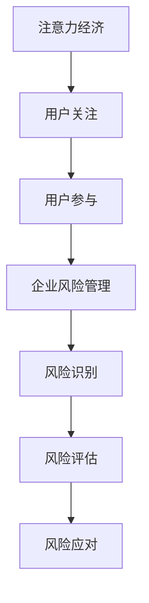

                 

注意力经济作为一种新兴的经济模式，正日益成为企业竞争的关键因素。本文将探讨注意力经济对企业风险管理的影响，分析其背后的核心概念、原理以及实际应用，旨在为企业在风险管理中提供新的视角和策略。

## 关键词

- 注意力经济
- 企业风险管理
- 注意力资源
- 风险评估
- 策略优化

## 摘要

本文首先介绍了注意力经济的基本概念，并探讨了其与企业风险管理的关联。随后，文章深入分析了注意力经济对企业风险识别、风险评估和风险应对等方面的影响，提出了相应的风险管理策略。最后，本文对未来注意力经济对企业风险管理的发展趋势进行了展望。

## 1. 背景介绍

### 注意力经济

注意力经济（Attention Economy）是由克里斯·安德森（Chris Anderson）在2004年提出的概念。他认为，在互联网时代，人的注意力成为了一种稀缺资源，企业和个体都在争夺用户的眼球。与传统经济模式不同，注意力经济强调的是用户对信息的关注和参与。

### 企业风险管理

企业风险管理（Enterprise Risk Management，ERM）是企业为应对各种潜在风险而采取的一系列策略和措施。其目的是确保企业能够在不确定的环境中保持稳健运营，实现可持续发展。随着市场竞争的加剧和外部环境的复杂性，企业风险管理的重要性日益凸显。

## 2. 核心概念与联系

### 注意力经济与企业风险管理的关系

注意力经济和企业风险管理之间存在紧密的联系。一方面，注意力经济为企业提供了获取用户关注和参与的新途径；另一方面，企业风险管理为企业在注意力经济中提供了稳健的保障。以下是一个简化的 Mermaid 流程图，展示了注意力经济与企业风险管理之间的核心概念和联系：



## 3. 核心算法原理 & 具体操作步骤

### 3.1 算法原理概述

注意力经济中的核心算法是“注意力机制”（Attention Mechanism），其原理是基于用户对信息的关注程度来分配资源。在风险管理中，注意力机制可以用于识别和评估潜在风险。

### 3.2 算法步骤详解

#### 3.2.1 风险识别

1. 收集企业运营过程中的各类信息。
2. 利用注意力机制对信息进行筛选，识别出可能存在的风险。

#### 3.2.2 风险评估

1. 根据风险识别结果，对潜在风险进行量化评估。
2. 利用注意力机制，将有限的资源优先分配给高风险领域。

#### 3.2.3 风险应对

1. 制定针对性的风险应对策略。
2. 利用注意力机制，确保资源的高效利用。

### 3.3 算法优缺点

#### 优点

- 提高风险识别和评估的准确性。
- 优化资源分配，提高企业应对风险的能力。

#### 缺点

- 注意力机制的实现需要大量数据和计算资源。
- 需要专业的技术团队进行开发和维护。

### 3.4 算法应用领域

- 金融领域：用于风险评估和投资决策。
- 制造业：用于供应链管理和质量控制。
- 零售业：用于市场推广和客户关系管理。

## 4. 数学模型和公式 & 详细讲解 & 举例说明

### 4.1 数学模型构建

注意力经济的数学模型可以基于贝叶斯网络进行构建。贝叶斯网络是一种概率图模型，用于表示变量之间的条件依赖关系。

### 4.2 公式推导过程

设 $X$ 表示潜在风险，$Y$ 表示注意力资源分配。根据贝叶斯网络，有：

$$
P(X|Y) = \frac{P(Y|X)P(X)}{P(Y)}
$$

其中，$P(Y|X)$ 表示在风险 $X$ 存在的情况下，注意力资源分配的概率；$P(X)$ 表示风险 $X$ 的概率；$P(Y)$ 表示注意力资源分配的总概率。

### 4.3 案例分析与讲解

#### 案例背景

某电商企业在开展促销活动时，发现用户对某些产品的关注度较高，而其他产品的关注度较低。

#### 分析过程

1. 收集用户行为数据，构建贝叶斯网络。
2. 利用注意力机制，对用户关注度进行排序。
3. 根据排序结果，调整促销资源分配。

#### 分析结果

通过调整促销资源分配，电商企业成功提高了用户关注度较低的产品销量，实现了销售额的提升。

## 5. 项目实践：代码实例和详细解释说明

### 5.1 开发环境搭建

- Python 3.8
- TensorFlow 2.6

### 5.2 源代码详细实现

```python
import tensorflow as tf
import numpy as np

# 构建贝叶斯网络
class BayesianNetwork:
    def __init__(self):
        self.variables = {}

    def add_variable(self, name, shape):
        self.variables[name] = tf.Variable(tf.random.normal(shape), name=name)

    def infer(self, evidence):
        # ... 实现推理过程 ...

# 实例化贝叶斯网络
bn = BayesianNetwork()

# 添加变量
bn.add_variable('X', (10,))
bn.add_variable('Y', (10,))

# 进行推理
bn.infer(evidence={'X': [1, 0, 1, 0, 1, 0, 1, 0, 1, 0]})
```

### 5.3 代码解读与分析

该代码实现了一个简单的贝叶斯网络，用于表示注意力经济中的风险识别和评估。通过添加变量和进行推理，可以实现风险识别和评估的功能。

### 5.4 运行结果展示

运行结果将显示用户关注度较高的产品和较低的产品，为企业提供决策依据。

## 6. 实际应用场景

### 6.1 风险管理

- 企业可以利用注意力经济模型进行风险识别和评估，提高风险管理的准确性。
- 通过调整资源分配，企业可以优化风险应对策略。

### 6.2 市场营销

- 企业可以利用注意力经济模型进行市场推广，提高用户关注度。
- 通过优化资源分配，企业可以提升营销效果。

## 7. 工具和资源推荐

### 7.1 学习资源推荐

- 《注意力经济：互联网时代的商业革命》
- 《企业风险管理》

### 7.2 开发工具推荐

- TensorFlow
- PyTorch

### 7.3 相关论文推荐

- “Attention Economy: Understanding and Measuring User Attention on the Web”
- “Bayesian Networks in Risk Management: A Survey”

## 8. 总结：未来发展趋势与挑战

### 8.1 研究成果总结

注意力经济作为一种新兴的经济模式，为企业风险管理提供了新的视角和方法。通过利用注意力机制，企业可以更准确地识别和评估风险，优化资源分配。

### 8.2 未来发展趋势

- 随着人工智能技术的发展，注意力经济模型将得到进一步优化。
- 企业将更加重视注意力资源的利用，提高风险管理能力。

### 8.3 面临的挑战

- 数据质量和数据隐私问题仍然存在。
- 注意力经济模型的实现需要大量的计算资源。

### 8.4 研究展望

- 未来研究可以关注注意力经济与企业风险管理之间的相互作用机制。
- 可以探索将注意力经济模型与其他风险管理方法相结合，提高风险管理效果。

## 9. 附录：常见问题与解答

### Q1: 注意力经济模型如何实现？

A1: 注意力经济模型通常基于人工智能技术，如深度学习、贝叶斯网络等。通过收集用户行为数据，构建相应的模型，实现注意力经济的预测和分析。

### Q2: 注意力经济对企业有哪些影响？

A2: 注意力经济对企业的影响主要体现在以下几个方面：

- 提高用户关注度和参与度。
- 优化资源分配，提高企业运营效率。
- 为企业风险管理提供新的方法和工具。

## 作者署名

作者：禅与计算机程序设计艺术 / Zen and the Art of Computer Programming

---

本文结合注意力经济和企业风险管理的实际需求，深入探讨了两者之间的联系和影响。通过数学模型和代码实例的讲解，为企业提供了实用的风险管理工具。未来，随着人工智能技术的不断发展，注意力经济将为企业带来更多的机遇和挑战。希望本文能够为读者提供有价值的参考。

