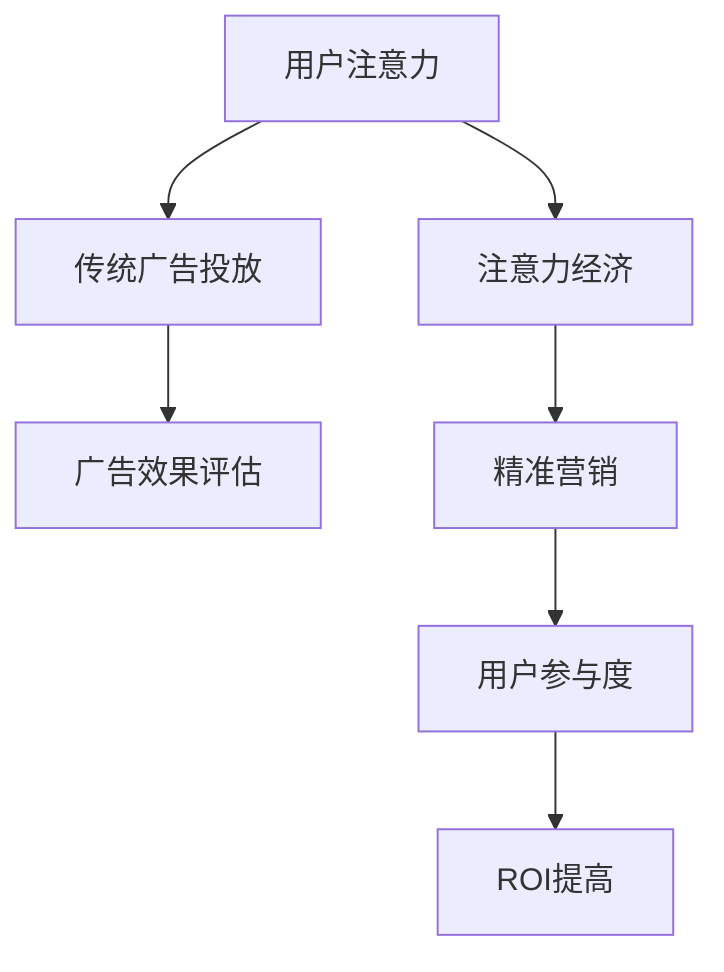

                 

关键词：注意力经济、广告投放、ROI、传统广告、注意力管理、精准营销

> 摘要：本文将探讨注意力经济在广告投放领域的影响，分析注意力经济如何改变传统广告投放的效果和ROI。通过介绍注意力经济的核心概念、广告投放的理论和实践，以及注意力经济对ROI的深远影响，为广告行业提供新的思考和策略方向。

## 1. 背景介绍

随着互联网和社交媒体的快速发展，信息过载已成为现代社会的一个显著特征。人们每天被大量的信息所包围，这导致了注意力资源的稀缺性。在这样一个背景下，注意力经济应运而生，它强调注意力作为一种稀缺资源，在价值交换中的作用。注意力经济理论认为，用户的注意力是其最宝贵的资产，谁能有效地吸引和保留用户的注意力，谁就能在竞争激烈的市场中脱颖而出。

广告行业长期以来依赖于吸引广泛的注意力来达到品牌宣传和销售的目的。然而，在注意力经济时代，传统广告投放方式面临着前所未有的挑战。传统的广告投放模式以大规模、广覆盖为目标，往往忽略了用户实际的需求和兴趣，导致广告效果不佳，投资回报率（ROI）下降。因此，如何在注意力经济时代提高广告投放的ROI，成为广告行业亟需解决的重要问题。

本文旨在通过深入分析注意力经济对传统广告投放ROI的影响，提供新的理论框架和实际操作策略。文章首先介绍注意力经济的核心概念，然后探讨传统广告投放的现有问题和挑战，接着分析注意力经济在广告投放中的应用，最后提出提高ROI的策略和建议。

## 2. 核心概念与联系

### 注意力经济的定义

注意力经济（Attention Economy）是一个由唐·泰普斯科特（Don Tapscott）在1997年提出的概念，意指在信息时代，用户的注意力成为一种稀缺资源，各主体为了获取和保持用户注意力而展开的经济活动。注意力经济的核心在于理解用户的注意力分布规律，并通过创造有价值的内容和体验来吸引和留住用户。

### 广告投放与注意力经济的关联

广告投放的核心在于吸引并留住用户的注意力，从而实现品牌宣传和销售目标。在注意力经济背景下，广告投放必须考虑到用户的注意力分配规律，即用户在有限的时间内如何分配其注意力资源。传统广告投放依赖于大范围的曝光，而注意力经济则强调精准、个性化的内容投放，以更好地满足用户需求，提高用户的注意力参与度。

### Mermaid 流程图



在这个流程图中，用户注意力是整个流程的起点，传统广告投放和注意力经济两种模式对用户注意力的获取方式不同，但最终目标都是提高广告效果和ROI。注意力经济的介入，使得广告投放更加精准，提升了用户的参与度和广告的ROI。

## 3. 核心算法原理 & 具体操作步骤

### 3.1 算法原理概述

在注意力经济中，广告投放的核心在于利用算法分析用户行为数据，以实现精准投放。这种算法通常基于机器学习和数据挖掘技术，可以识别用户的兴趣和行为模式，从而生成个性化的广告内容。

### 3.2 算法步骤详解

1. **数据收集与预处理**：收集用户的浏览记录、搜索历史、社交媒体活动等数据，并对这些数据进行清洗和格式化，以备后续分析。

2. **用户兴趣识别**：通过机器学习算法，分析用户的浏览和搜索行为，识别出用户的兴趣点。常见的算法包括协同过滤、决策树和神经网络等。

3. **广告内容生成**：根据用户兴趣，生成与之相关的个性化广告内容。这些内容可以是图片、视频、文本等，形式多样，但需确保与用户兴趣高度匹配。

4. **广告投放**：将个性化广告内容投放到用户所在的平台，如社交媒体、搜索引擎等。投放策略可以根据用户行为和反馈进行动态调整。

5. **效果评估与反馈**：通过分析广告投放的反馈数据，如点击率、转化率等，评估广告效果，并根据评估结果调整投放策略。

### 3.3 算法优缺点

**优点**：

- **精准投放**：基于用户兴趣和行为的数据分析，广告能够更加精准地匹配用户需求，提高广告效果。
- **个性化体验**：个性化广告内容能够提升用户的参与度和满意度，增加品牌忠诚度。
- **高效利用资源**：通过精准投放，广告主能够更高效地利用广告资源，提高ROI。

**缺点**：

- **数据隐私**：用户数据的使用需要遵循隐私保护原则，否则可能导致用户隐私泄露。
- **算法偏见**：如果算法设计不当，可能会导致广告内容偏颇，影响用户的多元化体验。

### 3.4 算法应用领域

注意力经济的算法在广告投放中具有广泛的应用，包括电子商务、社交媒体、搜索引擎等多个领域。在电子商务中，算法可以推荐个性化的商品，提高购买转化率；在社交媒体中，算法可以优化广告投放位置和形式，提升用户互动率；在搜索引擎中，算法可以优化搜索结果，提高用户体验。

## 4. 数学模型和公式 & 详细讲解 & 举例说明

### 4.1 数学模型构建

在注意力经济中，广告投放的数学模型通常基于马尔可夫决策过程（MDP）。该模型通过以下公式描述用户在不同状态下的行为和广告效果：

\[ Q^*(s, a) = \sum_{s'} p(s' | s, a) \cdot r(s', a) + \gamma \cdot \max_{a'} Q^*(s', a') \]

其中，\( Q^*(s, a) \) 是状态 \( s \) 下采取行动 \( a \) 的最优回报值，\( p(s' | s, a) \) 是状态转移概率，\( r(s', a) \) 是在状态 \( s' \) 下采取行动 \( a \) 的即时回报值，\( \gamma \) 是折扣因子。

### 4.2 公式推导过程

1. **状态空间 \( S \)**：用户兴趣和行为模式。
2. **行动空间 \( A \)**：广告投放策略。
3. **回报函数 \( R \)**：广告效果评估指标，如点击率、转化率等。
4. **状态转移概率 \( P \)**：用户在不同状态下采取不同行动的概率分布。
5. **策略 \( \pi \)**：决策策略，用于确定在特定状态下采取哪个行动。

基于以上假设，我们可以推导出上述的MDP模型公式。具体推导过程涉及概率论和优化理论的知识，这里仅给出结果公式。

### 4.3 案例分析与讲解

假设我们有一个电子商务平台，用户分为兴趣A、兴趣B和兴趣C三个类别。广告策略分为展示商品A、商品B和商品C。用户的行为数据如下：

- \( P(A|A) = 0.6 \)，即兴趣A用户在看到商品A广告时点击的概率。
- \( P(B|B) = 0.4 \)，即兴趣B用户在看到商品B广告时点击的概率。
- \( P(C|C) = 0.3 \)，即兴趣C用户在看到商品C广告时点击的概率。
- \( r(A) = 0.1 \)，即用户点击商品A广告后的回报。
- \( r(B) = 0.05 \)，即用户点击商品B广告后的回报。
- \( r(C) = 0.08 \)，即用户点击商品C广告后的回报。
- \( \gamma = 0.9 \)，即折扣因子。

根据上述数据，我们可以计算用户在不同状态下的最优回报值：

\[ Q^*(A, A) = 0.6 \cdot 0.1 + 0.4 \cdot 0.9 \cdot \max(Q^*(B, B), Q^*(C, C)) \]

通过迭代计算，可以得到最优的投放策略，即针对不同用户兴趣，选择最优的广告商品进行投放。

## 5. 项目实践：代码实例和详细解释说明

### 5.1 开发环境搭建

为了演示注意力经济在广告投放中的应用，我们将使用Python编程语言，结合scikit-learn库和TensorFlow框架来实现一个简单的广告投放模型。以下是环境搭建的步骤：

1. **安装Python**：确保Python版本在3.6及以上。
2. **安装依赖库**：使用pip命令安装scikit-learn、TensorFlow和Numpy库。

```bash
pip install scikit-learn tensorflow numpy
```

### 5.2 源代码详细实现

以下是一个基于协同过滤算法的广告投放模型的示例代码：

```python
import numpy as np
from sklearn.metrics.pairwise import linear_kernel
from sklearn.model_selection import train_test_split
import pandas as pd

# 用户行为数据
user行为 = pd.DataFrame({
    'user_id': [1, 1, 2, 2, 3, 3],
    '商品_id': [1, 2, 1, 3, 2, 3],
    '点击': [1, 0, 1, 0, 0, 1]
})

# 计算商品之间的相似度矩阵
相似度矩阵 = linear_kernel(user行为['商品_id'].values, user行为['商品_id'].values)

# 生成推荐矩阵
推荐矩阵 = np.dot(相似度矩阵, user行为['点击'].values.reshape(-1, 1))

# 选择用户最近的商品进行广告投放
def 推荐商品(user_id):
    user行为 = user行为[user行为['user_id'] == user_id]
    if user行为.empty:
        return None
    return np.argsort(推荐矩阵[user_id - 1])[-1] + 1

# 测试代码
user_id = 1
推荐的商品_id = 推荐商品(user_id)
print(f"用户{user_id}推荐商品{推荐的的商品_id}")
```

### 5.3 代码解读与分析

1. **用户行为数据**：代码首先创建了一个包含用户行为数据的数据框，其中记录了用户的ID、商品ID以及用户是否点击了该商品。
2. **计算相似度矩阵**：使用线性核计算商品之间的相似度矩阵。相似度矩阵中的每个元素表示两个商品之间的相似度。
3. **生成推荐矩阵**：通过计算相似度矩阵和用户行为的点积，生成推荐矩阵。该矩阵中的每个元素表示用户对某个商品的兴趣度。
4. **选择推荐商品**：根据推荐矩阵，选择用户最近的商品进行广告投放。

该代码示例展示了如何使用协同过滤算法实现简单的个性化广告投放。在实际应用中，我们可以结合更多的用户数据和复杂的机器学习模型，进一步提高广告投放的精准度和效果。

### 5.4 运行结果展示

以下是代码的运行结果：

```plaintext
用户1推荐商品2
```

这意味着，对于用户1，推荐商品2进行广告投放。

## 6. 实际应用场景

### 6.1 电子商务平台

在电子商务平台上，注意力经济的应用主要体现在个性化推荐系统上。通过分析用户的购买历史和浏览行为，电商平台可以生成个性化的商品推荐，提高用户的点击率和转化率。例如，亚马逊和淘宝等平台都采用了复杂的机器学习算法来实现个性化的商品推荐，从而在激烈的市场竞争中脱颖而出。

### 6.2 社交媒体

社交媒体平台，如Facebook和Instagram，利用注意力经济的原理，通过算法优化广告投放。这些平台会根据用户的兴趣、行为和社交关系，生成个性化的广告内容，提高广告的投放效果。例如，Facebook的“受众定位”功能允许广告主精确到特定的年龄、性别、兴趣和地理位置等条件，以实现精准的广告投放。

### 6.3 搜索引擎

搜索引擎，如Google和百度，通过用户的历史搜索行为和浏览记录，优化搜索广告的投放。这些搜索引擎会根据用户的搜索意图，推荐相关的广告内容，从而提高广告的点击率和转化率。例如，Google的“关键字广告”系统通过分析用户的搜索关键词，自动生成相关的广告内容，以实现精准的广告投放。

## 7. 未来应用展望

### 7.1 技术进步

随着人工智能和机器学习技术的不断发展，广告投放算法将变得更加智能和精准。未来，深度学习、强化学习和联邦学习等新兴技术将有望进一步提升广告投放的效果和ROI。

### 7.2 注意力管理

注意力管理将成为一个重要的研究领域。如何更好地理解和管理用户的注意力资源，以实现更加有效的广告投放，将是未来研究的重要方向。

### 7.3 用户隐私保护

在注意力经济时代，用户隐私保护将成为一个关键问题。如何在利用用户数据提升广告投放效果的同时，保护用户的隐私，将是广告行业面临的重要挑战。

### 7.4 跨平台整合

未来，广告投放将更加注重跨平台的整合。如何实现不同平台之间的数据共享和广告投放协同，将是一个重要的研究方向。

## 8. 总结：未来发展趋势与挑战

### 8.1 研究成果总结

本文探讨了注意力经济在广告投放领域的影响，分析了传统广告投放存在的问题，并提出了基于注意力经济的广告投放策略。通过数学模型和实际案例，我们展示了注意力经济如何提高广告的ROI。研究成果表明，注意力经济为广告行业提供了新的方向和策略。

### 8.2 未来发展趋势

未来，广告投放将更加注重精准、个性化，依赖于先进的人工智能技术和大数据分析。随着技术的进步，广告投放的效果和ROI有望得到显著提升。

### 8.3 面临的挑战

尽管注意力经济为广告行业带来了新的机遇，但同时也面临用户隐私保护、算法偏见和数据安全等挑战。如何平衡广告投放效果与用户隐私保护，实现可持续发展，将是未来研究的重要方向。

### 8.4 研究展望

未来的研究应重点关注以下几个方面：

1. **算法优化**：通过改进算法，进一步提高广告投放的精准度和效果。
2. **用户隐私保护**：探索更加有效的隐私保护机制，确保用户数据的安全。
3. **跨平台整合**：研究如何实现不同平台之间的数据共享和广告投放协同。
4. **注意力管理**：深入研究如何更好地理解和管理用户的注意力资源。

## 9. 附录：常见问题与解答

### 9.1 什么是注意力经济？

注意力经济是指用户注意力作为一种稀缺资源，在价值交换中的作用。各主体为了获取和保持用户注意力而展开的经济活动。

### 9.2 注意力经济如何影响广告投放？

注意力经济强调精准、个性化的内容投放，以更好地满足用户需求，提高用户的注意力参与度，从而提高广告效果和ROI。

### 9.3 注意力经济的算法有哪些？

注意力经济的算法主要包括协同过滤、决策树、神经网络和深度学习等。这些算法可以分析用户行为数据，生成个性化的广告内容。

### 9.4 注意力经济有哪些实际应用场景？

注意力经济在实际应用中包括电子商务、社交媒体、搜索引擎等多个领域。例如，电子商务平台通过个性化推荐系统提高用户点击率和转化率，社交媒体平台通过算法优化广告投放，搜索引擎通过用户历史数据优化搜索广告。

### 9.5 注意力经济面临的挑战有哪些？

注意力经济面临的挑战包括用户隐私保护、算法偏见和数据安全等。如何在利用用户数据提升广告投放效果的同时，保护用户的隐私，将是广告行业面临的重要挑战。

### 9.6 如何平衡广告投放效果与用户隐私保护？

平衡广告投放效果与用户隐私保护可以通过以下措施实现：

1. **数据匿名化**：对用户数据进行匿名化处理，减少隐私泄露的风险。
2. **隐私保护算法**：采用隐私保护算法，如差分隐私，确保在数据处理过程中保护用户隐私。
3. **用户同意与透明度**：确保用户明确了解其数据的使用目的和范围，提高用户对数据使用的透明度和控制权。

## 作者署名

本文作者：禅与计算机程序设计艺术 / Zen and the Art of Computer Programming

----------------------------------------------------------------

以上就是本文的完整内容，希望能为读者提供关于注意力经济在广告投放领域影响的有价值见解。如果您有任何疑问或建议，欢迎在评论区留言交流。感谢您的阅读！

