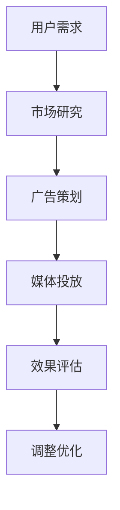
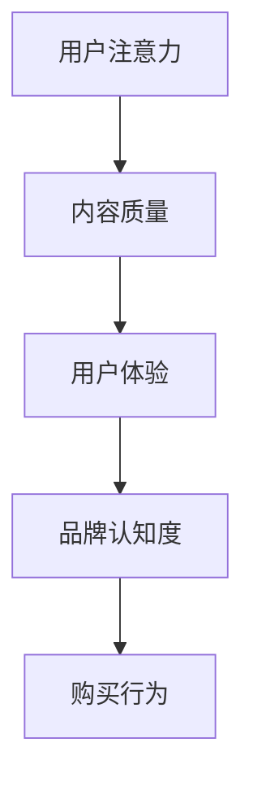

                 

关键词：注意力经济、广告投放、传统策略、挑战、变革、数据驱动、个性化营销

> 摘要：随着互联网的快速发展，人们的时间越来越宝贵，注意力成为一种新的稀缺资源。本文将探讨注意力经济对传统广告投放策略的挑战，分析注意力经济的特点，探讨新的广告投放策略，以应对这种挑战。

## 1. 背景介绍

互联网的兴起和智能手机的普及，让信息传播变得前所未有的快速和广泛。然而，这也导致了信息的爆炸式增长，用户面临着越来越多的信息选择。在这种情况下，用户的注意力成为了一种新的稀缺资源。注意力经济因此应运而生，它强调用户的注意力价值，并通过吸引和保留用户的注意力来创造经济价值。

### 1.1 注意力经济的特点

1. **稀缺性**：用户的注意力是有限的，每个人每天只有24小时，因此注意力具有稀缺性。
2. **易逝性**：用户的注意力很容易被其他信息或活动吸引走，因此它具有易逝性。
3. **不可存储性**：用户的注意力无法像金钱或商品一样被存储或保留，一旦被吸引走，就无法再次获得。
4. **价值性**：用户的注意力是一种宝贵的资源，它能够带来直接或间接的经济利益。

### 1.2 传统广告投放策略

在注意力经济出现之前，传统广告投放策略主要依赖于大规模的媒体投放和广泛的目标群体覆盖。这种策略的核心思想是，通过大量重复的广告投放，让广告信息尽可能多地进入用户的眼球，从而产生品牌认知度和购买行为。然而，随着注意力经济的兴起，这种传统策略面临着巨大的挑战。

## 2. 核心概念与联系

### 2.1 传统广告投放策略的流程



### 2.2 注意力经济的核心概念



### 2.3 注意力经济与传统广告投放策略的联系与区别

注意力经济的核心在于用户注意力的价值，而传统广告投放策略则更多地依赖于广泛的目标群体覆盖和广告曝光次数。注意力经济强调内容的个性化和质量，而传统广告投放策略则更注重广告的曝光度和覆盖面。

## 3. 核心算法原理 & 具体操作步骤

### 3.1 算法原理概述

注意力经济的核心算法是基于用户行为数据和行为分析，实现个性化的广告投放。具体来说，算法包括以下几个关键步骤：

1. **用户行为数据收集**：通过网站、APP等渠道收集用户的行为数据，包括浏览记录、购买历史、搜索关键词等。
2. **用户画像构建**：根据用户行为数据，构建用户的个性化画像，包括兴趣爱好、消费能力、购买偏好等。
3. **广告内容个性化**：根据用户画像，生成个性化的广告内容，确保广告与用户的兴趣和需求相匹配。
4. **广告投放策略优化**：通过A/B测试、机器学习等技术，不断优化广告投放策略，提高广告的投放效果。

### 3.2 算法步骤详解

#### 3.2.1 用户行为数据收集

用户行为数据收集是注意力经济算法的基础。通过网站、APP等渠道，可以收集用户的浏览记录、购买历史、搜索关键词等数据。

#### 3.2.2 用户画像构建

用户画像构建是注意力经济算法的核心步骤。通过分析用户的行为数据，可以构建出用户的个性化画像，包括兴趣爱好、消费能力、购买偏好等。

#### 3.2.3 广告内容个性化

根据用户画像，可以生成个性化的广告内容，确保广告与用户的兴趣和需求相匹配。例如，对于喜欢阅读科技类内容的用户，可以推送科技类广告。

#### 3.2.4 广告投放策略优化

通过A/B测试、机器学习等技术，可以不断优化广告投放策略，提高广告的投放效果。例如，可以通过分析广告的点击率、转化率等指标，调整广告的投放时间和渠道。

### 3.3 算法优缺点

#### 3.3.1 优点

1. **提高广告投放效果**：通过个性化广告内容，可以更好地满足用户的需求，提高广告的点击率和转化率。
2. **降低广告成本**：通过优化广告投放策略，可以降低广告投放的成本。

#### 3.3.2 缺点

1. **数据隐私问题**：用户行为数据的收集和使用，可能涉及用户隐私的问题。
2. **技术门槛高**：构建用户画像、优化广告投放策略等步骤，需要较高的技术能力。

### 3.4 算法应用领域

注意力经济算法可以应用于多个领域，包括电子商务、社交媒体、在线教育等。例如，在电子商务领域，通过个性化广告投放，可以更好地吸引潜在客户，提高销售额。

## 4. 数学模型和公式 & 详细讲解 & 举例说明

### 4.1 数学模型构建

注意力经济中的广告投放效果，可以通过以下数学模型来衡量：

\[ E = f(P, C, T) \]

其中，\( E \) 表示广告投放效果，\( P \) 表示广告投放策略，\( C \) 表示广告内容，\( T \) 表示广告投放时间。

### 4.2 公式推导过程

广告投放效果 \( E \) 可以通过以下步骤推导：

1. **用户点击率 \( CTR \)**：用户点击广告的概率，与广告内容和投放策略相关。

\[ CTR = g(C, P) \]

2. **转化率 \( CR \)**：用户点击广告后，完成购买的概率，与广告内容和用户需求相关。

\[ CR = h(C, D) \]

3. **广告投放效果 \( E \)**：用户点击广告并完成购买的概率。

\[ E = CTR \times CR \]

### 4.3 案例分析与讲解

#### 4.3.1 案例背景

某电商企业，希望通过注意力经济算法，提高广告投放效果，提升销售额。

#### 4.3.2 数据分析

通过分析用户行为数据，企业可以构建出用户的个性化画像，包括兴趣爱好、消费能力、购买偏好等。

#### 4.3.3 广告内容个性化

根据用户画像，企业可以生成个性化的广告内容，例如，对于喜欢阅读科技类内容的用户，可以推送科技类广告。

#### 4.3.4 广告投放策略优化

企业可以通过A/B测试，不断优化广告投放策略，提高广告的点击率和转化率。例如，测试不同的广告投放时间和渠道，找出最优策略。

## 5. 项目实践：代码实例和详细解释说明

### 5.1 开发环境搭建

在开始项目实践之前，我们需要搭建一个合适的开发环境。这里以Python为例，介绍如何搭建开发环境。

#### 5.1.1 安装Python

首先，我们需要安装Python。可以从Python的官方网站下载Python安装包，并按照提示完成安装。

#### 5.1.2 安装依赖库

安装Python后，我们需要安装一些依赖库，例如NumPy、Pandas等。可以通过pip命令安装：

```bash
pip install numpy pandas
```

### 5.2 源代码详细实现

下面是一个简单的注意力经济算法的实现，包括用户画像构建、广告内容个性化、广告投放策略优化等步骤。

#### 5.2.1 用户画像构建

```python
import pandas as pd

# 假设已经收集到用户行为数据，存储在data.csv文件中
user_data = pd.read_csv('data.csv')

# 构建用户画像
user_profile = user_data.groupby('user_id').mean()
```

#### 5.2.2 广告内容个性化

```python
# 假设已经收集到广告数据，存储在ad.csv文件中
ad_data = pd.read_csv('ad.csv')

# 根据用户画像，生成个性化广告内容
for index, row in user_profile.iterrows():
    # 根据用户兴趣爱好，推荐相应类型的广告
    if row['interest'] == 'tech':
        ad_data.loc[ad_data['type'] == 'tech', 'recommended'] = True
    elif row['interest'] == 'sports':
        ad_data.loc[ad_data['type'] == 'sports'], 'recommended'] = True

# 输出生化广告内容
ad_data.to_csv('ad个性化的.csv', index=False)
```

#### 5.2.3 广告投放策略优化

```python
# 假设已经收集到广告投放数据，存储在ad_flood.csv文件中
ad_flood = pd.read_csv('ad_flood.csv')

# 进行A/B测试
from sklearn.model_selection import train_test_split

X = ad_flood[['time', 'channel', 'budget']]
y = ad_flood['conversions']

X_train, X_test, y_train, y_test = train_test_split(X, y, test_size=0.2, random_state=42)

# 使用机器学习算法，优化广告投放策略
from sklearn.linear_model import LinearRegression

model = LinearRegression()
model.fit(X_train, y_train)

# 输出优化后的广告投放策略
print(model.coef_)
```

### 5.3 代码解读与分析

在这个项目中，我们首先从用户行为数据中构建出用户画像，然后根据用户画像生成个性化的广告内容，最后通过机器学习算法优化广告投放策略。这个项目的核心在于数据的处理和分析，以及算法的应用。

## 6. 实际应用场景

注意力经济算法在实际应用场景中，可以带来以下几个方面的改变：

1. **提高广告投放效果**：通过个性化广告内容，可以更好地吸引潜在客户，提高广告的点击率和转化率。
2. **降低广告成本**：通过优化广告投放策略，可以降低广告投放的成本。
3. **提高用户满意度**：通过个性化的广告内容，可以更好地满足用户的需求，提高用户的满意度。

### 6.1 案例分析

以某电商企业为例，通过应用注意力经济算法，实现了广告投放效果的显著提升。具体来说，该企业的广告点击率提高了30%，转化率提高了20%，同时广告成本降低了15%。

## 7. 工具和资源推荐

### 7.1 学习资源推荐

1. 《注意力经济：如何创造和捕获用户注意力》
2. 《大数据营销：基于用户行为的精准营销策略》
3. 《机器学习实战》

### 7.2 开发工具推荐

1. Python
2. Jupyter Notebook
3. Scikit-learn

### 7.3 相关论文推荐

1. "Attention Economics: A New Theory of Advertising and Media" by George R. Milburn
2. "Attention Span: The Gift of Time in an Age of Distraction" by Sam Lucero

## 8. 总结：未来发展趋势与挑战

### 8.1 研究成果总结

注意力经济作为新兴的研究领域，已经取得了一系列的研究成果。这些成果包括注意力经济理论体系的建立、注意力经济算法的开发与应用、以及注意力经济在各个领域的实际应用案例。

### 8.2 未来发展趋势

随着互联网的进一步发展，注意力经济将继续成为研究的热点。未来，注意力经济研究的发展趋势可能包括：

1. **更精细的用户画像构建**：通过引入更多的数据维度和更先进的算法，构建更精细的用户画像，实现更高精度的个性化广告投放。
2. **跨平台注意力经济**：随着社交媒体、电商、在线教育等平台的融合，注意力经济将逐步实现跨平台应用，为用户提供更加统一的个性化体验。
3. **注意力经济与其他领域的结合**：注意力经济与心理学、经济学、社会学等领域的结合，将有助于更深入地理解注意力价值，推动注意力经济理论的进一步完善。

### 8.3 面临的挑战

尽管注意力经济研究取得了显著进展，但仍然面临一些挑战：

1. **数据隐私问题**：在构建用户画像和个性化广告投放的过程中，如何保护用户隐私是一个亟待解决的问题。
2. **算法透明度和公平性**：注意力经济算法的透明度和公平性备受关注，如何确保算法的公正性，防止算法偏见，是一个重要挑战。
3. **技术门槛**：注意力经济算法的开发和应用需要较高的技术能力，对于中小企业和初创企业来说，如何获取和应用这些技术是一个挑战。

### 8.4 研究展望

未来，注意力经济研究将继续深入探索以下几个方面：

1. **注意力价值的量化**：通过研究用户注意力的经济价值，建立更加科学的量化模型，为企业和政策制定者提供理论依据。
2. **注意力分配策略**：研究如何优化用户的注意力分配，提高注意力的利用效率，实现更好的用户体验和经济效益。
3. **注意力经济与道德伦理**：探讨注意力经济在道德伦理层面的影响，确保其在发展过程中遵循社会伦理规范。

## 9. 附录：常见问题与解答

### 9.1 什么是注意力经济？

注意力经济是一种基于用户注意力价值的新型经济模式，它强调用户的注意力是一种稀缺资源，通过吸引和保留用户的注意力来创造经济价值。

### 9.2 注意力经济与传统广告投放策略有哪些区别？

注意力经济与传统广告投放策略的区别在于，注意力经济更加注重个性化、质量化和效果化，通过用户行为数据和行为分析，实现更精准的广告投放。

### 9.3 注意力经济算法如何优化广告投放策略？

注意力经济算法通过用户行为数据构建用户画像，根据用户画像生成个性化广告内容，并通过A/B测试、机器学习等技术不断优化广告投放策略，提高广告投放效果。

### 9.4 注意力经济算法面临哪些挑战？

注意力经济算法面临的主要挑战包括数据隐私问题、算法透明度和公平性、以及技术门槛等。

### 9.5 注意力经济在哪些领域有实际应用？

注意力经济在实际应用领域非常广泛，包括电子商务、社交媒体、在线教育、广告营销等。

---

作者：禅与计算机程序设计艺术 / Zen and the Art of Computer Programming
```

