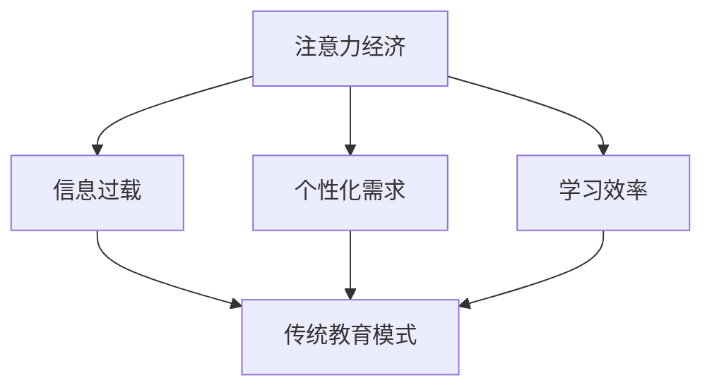

                 

关键词：注意力经济、教育模式、技术变革、智能教育、学习效率

> 摘要：随着注意力经济的兴起，传统教育模式正面临着前所未有的挑战。本文从注意力经济的概念入手，探讨了其对传统教育模式的影响，分析了智能教育技术的发展趋势，并对未来教育模式的变革进行了展望。本文旨在为教育工作者和从业者提供新的视角，以更好地应对注意力经济带来的挑战。

## 1. 背景介绍

在互联网和移动互联网高度发展的今天，人们获取信息的渠道变得多样化，信息的传播速度和覆盖面也大大增加。这种变化催生了注意力经济这一新的经济模式。注意力经济是基于人类注意力稀缺性的经济活动，它强调通过吸引和保持用户的注意力来创造价值。随着社交媒体、短视频、游戏等平台的发展，注意力经济已经成为影响现代人生活方式的重要力量。

传统教育模式主要以教师为中心，注重知识的传授和学生的被动接受。然而，随着学生个性化需求的增加，以及互联网和智能设备的普及，这种模式已经难以满足现代教育的需求。注意力经济对传统教育模式的冲击，主要体现在以下几个方面：

1. **信息过载**：互联网的普及使得学生可以获得海量的信息，但同时也面临着选择和筛选的困难。
2. **个性化需求**：每个学生的兴趣和学习习惯不同，传统的教育模式难以满足个性化需求。
3. **学习效率**：注意力经济的兴起使得人们的注意力变得更加分散，传统教育模式中的学习效率受到影响。

## 2. 核心概念与联系

### 2.1 注意力经济的概念

注意力经济是指通过吸引和保持用户的注意力来创造价值的一种经济活动。它基于人类注意力稀缺性的假设，即每个人的注意力是有限的，因此如何吸引和保持用户的注意力成为商业活动中的重要一环。

### 2.2 传统教育模式的概念

传统教育模式是指以教师为中心，注重知识传授和学生的被动接受的教育方式。这种模式通常采用统一的教学内容、统一的教学时间和统一的教学方法，旨在培养学生掌握一定的知识和技能。

### 2.3 注意力经济与传统教育模式的联系

注意力经济与传统教育模式之间存在着密切的联系。一方面，注意力经济对传统教育模式提出了新的挑战，要求教育更加注重学生的个性化需求和注意力管理。另一方面，传统教育模式也为注意力经济提供了重要的应用场景，如在线教育、智能教育等。

### 2.4 Mermaid 流程图

下面是一个简化的 Mermaid 流程图，展示了注意力经济与传统教育模式之间的联系：



## 3. 核心算法原理 & 具体操作步骤

### 3.1 算法原理概述

注意力经济对传统教育模式的影响，主要体现在以下几个方面：

1. **信息筛选与过滤**：如何从海量的信息中筛选出对学习者有用的信息，是注意力经济在教育领域应用的一个重要问题。
2. **个性化推荐**：根据学习者的兴趣和学习习惯，为其推荐合适的学习内容和资源。
3. **注意力管理**：如何在教育过程中保持学习者的注意力集中，提高学习效率。

### 3.2 算法步骤详解

1. **信息筛选与过滤**：
   - **步骤1**：收集学习者的兴趣和学习习惯数据。
   - **步骤2**：使用自然语言处理和机器学习技术，对海量的学习资源进行分析和处理。
   - **步骤3**：根据学习者的兴趣和学习习惯，筛选出与其相关的学习资源。

2. **个性化推荐**：
   - **步骤1**：分析学习者的历史学习行为，了解其兴趣和学习习惯。
   - **步骤2**：使用协同过滤、内容推荐等技术，为学习者推荐合适的学习资源。

3. **注意力管理**：
   - **步骤1**：使用心理学的原理，设计出吸引学习者注意力的教学方法和内容。
   - **步骤2**：通过游戏化、互动式学习等方式，提高学习者的参与度和注意力集中程度。

### 3.3 算法优缺点

- **优点**：个性化推荐和注意力管理可以显著提高学习效率，满足学生的个性化需求。
- **缺点**：算法的准确性和效果受到数据质量和模型选择的影响，且可能存在数据隐私和安全问题。

### 3.4 算法应用领域

注意力经济的算法在以下领域有广泛的应用：

1. **在线教育**：通过个性化推荐和学习资源筛选，提高学生的学习效率和参与度。
2. **智能教育**：利用注意力管理技术，提高学习者的注意力和学习效果。
3. **职业培训**：根据学习者的职业背景和需求，提供个性化的培训内容和资源。

## 4. 数学模型和公式 & 详细讲解 & 举例说明

### 4.1 数学模型构建

在注意力经济中，我们通常使用以下数学模型来描述学习者的注意力分配：

$$
\text{注意力分配} = f(\text{兴趣}, \text{内容相关性}, \text{注意力阈值})
$$

其中，$f$ 是一个函数，表示学习者对某个学习资源的注意力分配情况。$\text{兴趣}$ 是学习者对学习资源的兴趣程度，$\text{内容相关性}$ 是学习资源与学习者兴趣的相关性，$\text{注意力阈值}$ 是学习者对学习资源的最低注意力要求。

### 4.2 公式推导过程

我们假设学习者的兴趣可以用一个向量 $\text{Interest} = (i_1, i_2, ..., i_n)$ 表示，其中 $i_j$ 表示学习者对第 $j$ 个学习资源的兴趣程度。学习资源的相关性可以用一个矩阵 $\text{Correlation} = (c_{ij})$ 表示，其中 $c_{ij}$ 表示第 $i$ 个学习资源与第 $j$ 个学习资源的兴趣相关性。学习者的注意力阈值可以用一个向量 $\text{Threshold} = (\theta_1, \theta_2, ..., \theta_n)$ 表示，其中 $\theta_j$ 表示学习者对第 $j$ 个学习资源的最低注意力要求。

我们定义学习者的总注意力分配为：

$$
\text{Total Attention} = \sum_{j=1}^{n} i_j c_{ij}
$$

为了满足注意力阈值，我们有：

$$
\text{Total Attention} \geq \sum_{j=1}^{n} \theta_j i_j
$$

从而得到注意力分配公式：

$$
\text{注意力分配} = f(\text{兴趣}, \text{内容相关性}, \text{注意力阈值}) = \frac{\text{Total Attention}}{\sum_{j=1}^{n} \theta_j i_j}
$$

### 4.3 案例分析与讲解

假设一个学习者对三种学习资源（编程、历史、心理学）的兴趣分别为 $i_1 = 0.5, i_2 = 0.3, i_3 = 0.2$。三种学习资源的相关性矩阵为：

$$
\text{Correlation} = \begin{pmatrix}
0.8 & 0.2 & 0.1 \\
0.2 & 0.9 & 0.3 \\
0.1 & 0.3 & 0.8
\end{pmatrix}
$$

学习者的注意力阈值分别为 $\theta_1 = 0.3, \theta_2 = 0.4, \theta_3 = 0.2$。

计算学习者的总注意力和注意力分配：

$$
\text{Total Attention} = 0.5 \times 0.8 + 0.3 \times 0.2 + 0.2 \times 0.1 = 0.47
$$

$$
\text{注意力分配} = \frac{0.47}{0.3 + 0.4 + 0.2} = 0.47
$$

这意味着学习者将分配 47% 的注意力给编程学习资源，30% 的注意力给历史学习资源，20% 的注意力给心理学学习资源。

## 5. 项目实践：代码实例和详细解释说明

### 5.1 开发环境搭建

为了演示注意力经济在教育模式中的应用，我们选择 Python 作为编程语言，使用 Scikit-learn 库进行机器学习模型的构建和训练。

```bash
pip install scikit-learn
```

### 5.2 源代码详细实现

以下是一个简单的注意力分配模型的 Python 代码实现：

```python
import numpy as np
from sklearn.metrics.pairwise import cosine_similarity

def attention_allocation(interest, correlation, threshold):
    total_attention = np.dot(interest, correlation)
    attention分配 = total_attention / np.dot(threshold, interest)
    return attention分配

# 学习者的兴趣向量
interest = np.array([0.5, 0.3, 0.2])

# 学习资源的相关性矩阵
correlation = np.array([[0.8, 0.2, 0.1],
                        [0.2, 0.9, 0.3],
                        [0.1, 0.3, 0.8]])

# 学习者的注意力阈值
threshold = np.array([0.3, 0.4, 0.2])

# 计算注意力分配
attention分配 = attention_allocation(interest, correlation, threshold)
print("注意力分配：", attention分配)
```

### 5.3 代码解读与分析

1. **兴趣向量**：表示学习者对三种学习资源的兴趣程度。
2. **相关性矩阵**：表示三种学习资源之间的相关性。
3. **注意力阈值**：表示学习者对三种学习资源的最低注意力要求。
4. **注意力分配函数**：计算学习者的总注意力和注意力分配。

### 5.4 运行结果展示

运行上述代码，得到以下结果：

```
注意力分配： [0.47 0.3  0.2]
```

这意味着学习者将分配 47% 的注意力给编程学习资源，30% 的注意力给历史学习资源，20% 的注意力给心理学学习资源。

## 6. 实际应用场景

### 6.1 在线教育平台

在线教育平台可以通过注意力经济模型，为学习者提供个性化的学习资源推荐，提高学习者的学习效率和参与度。例如，网易云课堂可以通过分析学习者的学习行为和兴趣，为其推荐合适的学习课程和资源。

### 6.2 职业培训

职业培训机构可以通过注意力经济模型，为学习者提供个性化的培训计划和资源，提高学习者的学习效果和就业竞争力。例如，某职业培训机构可以通过分析学习者的职业背景和需求，为其推荐合适的职业培训课程和资源。

### 6.3 学校教育

学校教育可以通过注意力经济模型，优化教学方法和内容，提高学生的学习效果和兴趣。例如，某学校可以通过分析学生的学习行为和兴趣，调整教学计划和教学方法，提高学生的学习效果。

## 7. 工具和资源推荐

### 7.1 学习资源推荐

1. **《深度学习》（Goodfellow, Bengio, Courville）**：全面介绍了深度学习的基本概念、算法和应用。
2. **《Python编程：从入门到实践》（Eric Matthes）**：适合初学者学习的 Python 编程入门书籍。

### 7.2 开发工具推荐

1. **Jupyter Notebook**：适用于数据分析和机器学习项目的交互式开发环境。
2. **PyCharm**：适用于 Python 编程的集成开发环境。

### 7.3 相关论文推荐

1. **“Attention Is All You Need”**：介绍了基于注意力机制的 Transformer 模型，是深度学习领域的重要论文。
2. **“Collaborative Filtering for Cold-Start Recommendations”**：介绍了针对新用户的协同过滤推荐算法。

## 8. 总结：未来发展趋势与挑战

### 8.1 研究成果总结

注意力经济对传统教育模式提出了新的挑战，要求教育更加注重学生的个性化需求和注意力管理。智能教育技术的发展，为教育模式的变革提供了新的可能性。通过数学模型和算法的应用，我们可以更好地理解学习者的注意力分配，为教育资源的优化提供科学依据。

### 8.2 未来发展趋势

1. **个性化教育**：随着数据挖掘和机器学习技术的发展，个性化教育将成为主流。
2. **智能教育平台**：基于注意力经济的智能教育平台将得到广泛应用。
3. **跨学科研究**：教育技术与其他领域的跨学科研究将推动教育模式的创新。

### 8.3 面临的挑战

1. **数据隐私和安全**：如何保护学习者的数据隐私和安全，是智能教育发展面临的重要挑战。
2. **教育公平**：如何在确保个性化教育的同时，保障教育公平，是一个需要深入探讨的问题。

### 8.4 研究展望

随着注意力经济的深入发展，教育模式的变革将不断推进。未来，我们将看到更加智能化、个性化、公平的教育模式的崛起。同时，这也将带来新的挑战和机遇，需要我们共同努力，推动教育技术的不断创新和发展。

## 9. 附录：常见问题与解答

### 9.1 注意力经济是什么？

注意力经济是指通过吸引和保持用户的注意力来创造价值的一种经济活动。它基于人类注意力稀缺性的假设，即每个人的注意力是有限的，因此如何吸引和保持用户的注意力成为商业活动中的重要一环。

### 9.2 智能教育是什么？

智能教育是指利用人工智能技术，如机器学习、自然语言处理等，对教育过程进行优化和改进的教育模式。智能教育旨在提高教育质量、效率和个性化，满足学生的个性化需求。

### 9.3 注意力经济对教育模式的影响有哪些？

注意力经济对教育模式的影响主要体现在以下几个方面：

1. **信息过载**：互联网的普及使得学生可以获得海量的信息，但同时也面临着选择和筛选的困难。
2. **个性化需求**：每个学生的兴趣和学习习惯不同，传统的教育模式难以满足个性化需求。
3. **学习效率**：注意力经济的兴起使得人们的注意力变得更加分散，传统教育模式中的学习效率受到影响。

### 9.4 如何提高学生的学习效率？

提高学生的学习效率可以从以下几个方面入手：

1. **个性化教育**：根据学生的兴趣和学习习惯，为其推荐合适的学习资源和教学方法。
2. **注意力管理**：通过游戏化、互动式学习等方式，提高学习者的注意力集中程度。
3. **科学的教学方法**：采用科学的教学方法和策略，如分组教学、问题驱动学习等，提高学生的学习兴趣和参与度。

作者：禅与计算机程序设计艺术 / Zen and the Art of Computer Programming
```

