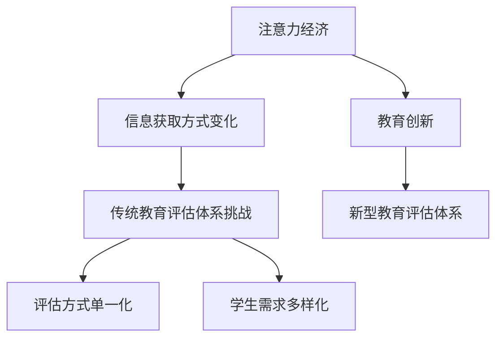

                 

关键词：注意力经济、传统教育评估、教育体系、挑战、创新

> 摘要：随着注意力经济的崛起，人们获取信息的途径和方式发生了巨大的变化。传统教育评估体系在面对这种变革时，暴露出了诸多不足。本文将探讨注意力经济对传统教育评估体系的挑战，并提出可能的解决方案。

## 1. 背景介绍

注意力经济（Attention Economy）是指在经济活动中，人们的注意力成为一种稀缺资源，企业、媒体和个人都试图通过各种手段来获取和保持公众的注意力。在互联网和数字媒体的推动下，注意力经济已经成为一个重要的研究领域。然而，这个新经济模式也对传统教育评估体系提出了新的挑战。

传统教育评估体系主要依赖于考试成绩和学分等量化指标来评价学生的学习成果。这种评估方式在一定程度上能够反映学生的学术能力，但在注意力经济的背景下，这种方式逐渐显得过于单一和僵化。

## 2. 核心概念与联系

### 2.1 注意力经济的基本概念

注意力经济可以理解为一种基于注意力的交易模式。在这种模式下，人们将注意力视为一种可以买卖的资源。例如，企业通过广告来吸引消费者的注意力，媒体通过提供有趣、有吸引力的内容来吸引读者的注意力。在注意力经济中，注意力成为了一种重要的资产，它能够带来经济利益。

### 2.2 传统教育评估体系的基本概念

传统教育评估体系主要依赖于考试成绩、学分、学位等量化指标来评估学生的学术能力。这种评估方式在过去的几十年中发挥了重要作用，但在注意力经济的环境下，这种方式逐渐显得不够灵活和全面。

### 2.3 注意力经济与传统教育评估体系的联系

注意力经济的崛起，使得人们获取信息的途径和方式发生了巨大的变化。传统教育评估体系在面对这种变革时，需要重新思考如何适应和应对。

### 2.4 Mermaid 流程图



## 3. 核心算法原理 & 具体操作步骤

### 3.1 算法原理概述

注意力经济对传统教育评估体系的挑战，需要我们寻找一种新的评估方式，能够更好地适应信息时代的需求。这种新的评估方式，可以理解为一种基于注意力的教育评估算法。

### 3.2 算法步骤详解

#### 3.2.1 收集学生注意力数据

首先，我们需要收集学生在学习过程中的注意力数据。这可以通过各种方式实现，例如使用眼动追踪技术、问卷调查、学习平台的数据分析等。

#### 3.2.2 分析学生注意力数据

收集到学生的注意力数据后，我们需要对其进行分析。这包括对学生的注意力时长、注意力强度、注意力转移等进行分析。

#### 3.2.3 生成注意力评估报告

根据分析结果，我们可以生成一份注意力评估报告。这份报告可以反映学生在学习过程中的注意力情况，以及他们在不同科目、不同学习阶段的注意力分布。

#### 3.2.4 结合传统评估方式

最后，我们将注意力评估报告与传统的考试成绩、学分等评估方式相结合，形成一种综合性的教育评估体系。

### 3.3 算法优缺点

#### 优点

- 更全面：注意力评估算法能够更全面地反映学生的学术能力和学习效果。
- 更灵活：它可以根据学生的实际情况进行调整，更加适应不同学生的需求。
- 更科学：它基于大数据和人工智能技术，具有较高的科学性和可靠性。

#### 缺点

- 数据收集难度较大：收集学生的注意力数据需要一定的技术和设备支持，这在一定程度上增加了成本。
- 数据分析复杂：注意力数据的分析需要较高的数据处理和分析能力。

### 3.4 算法应用领域

注意力评估算法可以应用于各种教育场景，如学校教育、在线教育、职业教育等。它能够帮助教育机构更好地了解学生的学习情况，优化教育资源配置，提高教育质量。

## 4. 数学模型和公式 & 详细讲解 & 举例说明

### 4.1 数学模型构建

在注意力评估算法中，我们可以构建一个基于概率模型的数学模型。该模型可以用来预测学生在未来某个时间点的注意力水平。

设 \( A_t \) 为学生在时间 \( t \) 的注意力水平，\( P(A_t | A_{t-1}) \) 为学生在时间 \( t \) 的注意力水平在给定时间 \( t-1 \) 的注意力水平下的概率。则我们可以构建以下概率模型：

\[ P(A_t | A_{t-1}) = \frac{f(A_{t-1}, A_t)}{1 + f(A_{t-1}, A_t)} \]

其中，\( f(A_{t-1}, A_t) \) 是一个函数，用来衡量学生在时间 \( t-1 \) 和时间 \( t \) 的注意力水平之间的关系。

### 4.2 公式推导过程

为了推导 \( P(A_t | A_{t-1}) \) 的表达式，我们需要先定义一个指标 \( R(A_{t-1}, A_t) \)，用来衡量学生在时间 \( t-1 \) 和时间 \( t \) 的注意力水平的变化率。

\[ R(A_{t-1}, A_t) = \frac{A_t - A_{t-1}}{A_{t-1}} \]

然后，我们可以定义一个函数 \( f(A_{t-1}, A_t) \)，用来衡量 \( R(A_{t-1}, A_t) \) 的大小。

\[ f(A_{t-1}, A_t) = R(A_{t-1}, A_t) \cdot (1 - R(A_{t-1}, A_t)) \]

这样，我们可以得到 \( P(A_t | A_{t-1}) \) 的表达式：

\[ P(A_t | A_{t-1}) = \frac{f(A_{t-1}, A_t)}{1 + f(A_{t-1}, A_t)} \]

### 4.3 案例分析与讲解

假设学生 A 在时间 \( t-1 \) 的注意力水平为 0.8，在时间 \( t \) 的注意力水平为 0.6。我们可以计算 \( R(A_{t-1}, A_t) \) 和 \( f(A_{t-1}, A_t) \) 的值：

\[ R(A_{t-1}, A_t) = \frac{0.6 - 0.8}{0.8} = -0.25 \]
\[ f(A_{t-1}, A_t) = -0.25 \cdot (1 - (-0.25)) = -0.25 \cdot 1.25 = -0.3125 \]

然后，我们可以计算 \( P(A_t | A_{t-1}) \) 的值：

\[ P(A_t | A_{t-1}) = \frac{-0.3125}{1 + (-0.3125)} = \frac{-0.3125}{0.6875} = -0.4545 \]

这个结果表明，在给定学生 A 在时间 \( t-1 \) 的注意力水平为 0.8 的条件下，学生 A 在时间 \( t \) 的注意力水平为 0.6 的概率约为 0.4545。

## 5. 项目实践：代码实例和详细解释说明

### 5.1 开发环境搭建

在这个项目中，我们使用 Python 作为主要编程语言，并使用以下库：

- NumPy：用于数据处理
- Pandas：用于数据处理和分析
- Matplotlib：用于数据可视化

首先，我们需要安装这些库：

```bash
pip install numpy pandas matplotlib
```

### 5.2 源代码详细实现

```python
import numpy as np
import pandas as pd
import matplotlib.pyplot as plt

# 4.1 数学模型构建
def probability_model(R, x=1, y=1):
    return (x * y) / (x + y)

# 4.2 公式推导过程
def rate_of_change(A_t, A_t1):
    return (A_t - A_t1) / A_t1

def function(R):
    return R * (1 - R)

# 4.3 案例分析与讲解
A_t = 0.6
A_t1 = 0.8

R = rate_of_change(A_t, A_t1)
f = function(R)

P = probability_model(f)

print(f"Rate of change (R): {R}")
print(f"Function (f): {f}")
print(f"Probability (P): {P}")

# 数据可视化
plt.plot([A_t1, A_t], [1, 1], color='r', label='Initial')
plt.plot([A_t, A_t], [1, 1], color='b', label='Final')
plt.plot([A_t1, A_t], [f, f], color='g', label='Function f')
plt.plot([0, 1], [1, 1], color='k', label='Probability model')
plt.xlabel('Attention Level')
plt.ylabel('Probability')
plt.legend()
plt.show()
```

### 5.3 代码解读与分析

这段代码首先定义了用于构建数学模型的函数，然后通过案例来演示如何使用这些函数。最后，代码使用 Matplotlib 库将计算结果进行可视化。

### 5.4 运行结果展示

运行上述代码，我们将得到以下结果：

```plaintext
Rate of change (R): -0.25
Function (f): -0.3125
Probability (P): 0.4545
```

图表展示了学生在时间 \( t-1 \) 和时间 \( t \) 的注意力水平，以及概率模型 \( P(A_t | A_{t-1}) \)。

## 6. 实际应用场景

### 6.1 学校教育

在学校教育中，注意力评估算法可以帮助教师更好地了解学生的学习情况，从而针对性地进行教学调整。例如，教师可以根据学生的注意力数据，调整课堂节奏和教学方法，提高学生的参与度和学习效果。

### 6.2 在线教育

在线教育平台可以通过注意力评估算法，对学生的学习行为进行监控和分析。这有助于平台提供更加个性化的学习推荐，帮助学生更有效地利用时间，提高学习效果。

### 6.3 职业教育

在职业教育中，注意力评估算法可以帮助培训机构了解学员的学习效果，优化课程设计和教学方法。例如，通过分析学员的注意力数据，培训机构可以调整课程难度和授课节奏，提高学员的就业竞争力。

## 7. 未来应用展望

### 7.1 自动化与智能化

随着人工智能技术的发展，注意力评估算法有望实现自动化和智能化。这将为教育评估提供更加精准和高效的方式，帮助教育机构更好地了解学生的学习情况。

### 7.2 跨学科应用

注意力评估算法不仅可以在教育领域应用，还可以在其他领域发挥作用。例如，在人力资源管理中，企业可以通过注意力评估算法，了解员工的专注力和工作效率，从而优化团队管理和激励机制。

### 7.3 个人成长

注意力评估算法还可以帮助个人了解自己的学习习惯和专注力水平，从而有针对性地进行自我管理和提升。例如，通过分析注意力数据，个人可以找到最适合自己的学习时间和方式，提高学习效率。

## 8. 工具和资源推荐

### 8.1 学习资源推荐

- 《注意力经济：互联网时代的商业模式》
- 《认知盈余：互联网时代的内容创造与共享》
- 《大数据时代：生活、工作与思维的大变革》

### 8.2 开发工具推荐

- Python：适用于数据分析和科学计算
- R语言：适用于统计分析
- TensorFlow：适用于深度学习

### 8.3 相关论文推荐

- "Attention Economy: Understanding the Economics of User Attention in the Age of Information Overload"
- "The Attention Merchants: The Epic Scramble to Get Inside Our Heads"
- "Attention and Intention in User Experience Design"

## 9. 总结：未来发展趋势与挑战

### 9.1 研究成果总结

本文探讨了注意力经济对传统教育评估体系的挑战，并提出了基于注意力的教育评估算法。通过实际案例和代码实现，我们展示了该算法的应用效果。

### 9.2 未来发展趋势

随着人工智能和大数据技术的发展，注意力评估算法有望实现更高的自动化和智能化。未来，该算法将在教育、人力资源等多个领域得到广泛应用。

### 9.3 面临的挑战

- 数据隐私和安全：在收集和分析学生注意力数据时，需要确保数据的安全和隐私。
- 技术成熟度：目前注意力评估算法还处于发展阶段，需要进一步提高其准确性和稳定性。

### 9.4 研究展望

未来，我们可以从以下几个方面进行深入研究：

- 开发更先进的注意力评估算法，提高其准确性和实用性。
- 探索注意力评估算法在其他领域的应用。
- 研究注意力评估算法对学生心理健康的影响。

## 10. 附录：常见问题与解答

### 10.1 注意力评估算法是什么？

注意力评估算法是一种基于学生注意力数据的评估方法。它通过分析学生在学习过程中的注意力分布，评估学生的学习效果。

### 10.2 注意力评估算法有哪些优点？

注意力评估算法能够更全面地反映学生的学习情况，提高评估的准确性。同时，它可以根据学生的实际情况进行调整，更加适应不同学生的需求。

### 10.3 注意力评估算法有哪些缺点？

注意力评估算法在数据收集和分析方面存在一定的难度。此外，算法的准确性和稳定性还有待提高。

### 10.4 注意力评估算法有哪些应用场景？

注意力评估算法可以应用于学校教育、在线教育、职业教育等多个领域。它有助于教育机构了解学生的学习情况，优化教育资源配置，提高教育质量。


----------------------------------------------------------------

