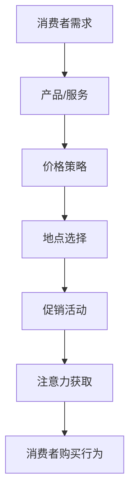

                 

关键词：注意力经济、传统营销、新媒体、消费者行为、数据驱动、算法优化

摘要：随着互联网和新媒体的快速发展，注意力经济逐渐成为现代营销的核心概念。本文将探讨注意力经济对传统营销理论的挑战，并分析其在现代营销中的革新。通过研究注意力经济的原理和应用，本文旨在为营销从业者提供新的视角和方法，以应对日益激烈的营销竞争。

## 1. 背景介绍

注意力经济（Attention Economy）是一种新兴的经济学理论，认为在信息过载的时代，消费者的注意力成为一种稀缺资源，能够吸引并保持消费者注意力的产品、服务或内容将获得更高的市场价值。与传统经济学理论相比，注意力经济更加关注消费者的行为和心理，强调企业与消费者之间的互动关系。

传统营销理论主要基于4P模型（产品、价格、地点、促销），旨在通过控制和传播信息来影响消费者的购买决策。然而，在注意力经济的背景下，这种单向的信息传递方式已经不再有效。消费者的决策过程变得更加复杂，他们不仅关注产品的功能和价格，还关注产品能否满足其情感需求、能否提供独特体验等。

新媒体的兴起进一步加剧了市场竞争。社交媒体、移动应用等平台提供了丰富的渠道和工具，使得企业能够以更低成本获取更广泛的受众。然而，这也意味着消费者面临的信息过载问题更加严重，他们的注意力资源变得更加稀缺。因此，如何吸引和保持消费者的注意力成为现代营销的关键挑战。

## 2. 核心概念与联系

### 2.1 注意力经济的原理

注意力经济的核心在于“注意力”这一概念。注意力是有限的，一旦消耗完毕，消费者将无法继续关注其他信息。因此，企业需要通过创造有趣、有用或有价值的内容来吸引消费者的注意力。这包括：

1. **内容创新**：通过提供新颖、独特的内容来吸引消费者的兴趣。
2. **情感共鸣**：通过情感化的内容与消费者建立情感联系。
3. **用户体验**：通过优化产品和服务，提升用户体验，从而吸引消费者的长期关注。

### 2.2 注意力经济与营销理论的联系

注意力经济与传统营销理论存在明显的区别，但也存在一定的联系。传统营销理论主要关注产品、价格、地点和促销等外部因素，而注意力经济则更加关注消费者的内在需求和心理。

传统营销理论中的4P模型可以扩展为5P模型，即产品（Product）、价格（Price）、地点（Place）、促销（Promotion）和注意（Attention）。其中，“注意”作为新的核心要素，强调了企业在吸引和保持消费者注意力方面的重要性。

### 2.3 Mermaid 流程图

下面是注意力经济与营销理论联系的一个简单 Mermaid 流程图：



在这个流程图中，注意力获取是营销过程中的关键环节，它直接影响消费者的购买行为。企业需要通过创新内容和情感共鸣等手段，成功地吸引和保持消费者的注意力，从而实现营销目标。

## 3. 核心算法原理 & 具体操作步骤

### 3.1 算法原理概述

注意力经济的核心算法主要基于消费者行为分析和数据驱动营销。通过分析大量的消费者数据，企业可以了解消费者的兴趣偏好和行为模式，从而制定有针对性的营销策略。

### 3.2 算法步骤详解

1. **数据收集**：通过线上和线下渠道收集消费者的行为数据，如浏览记录、购买历史、社交媒体互动等。
2. **数据清洗**：对收集到的数据进行分析，去除重复和无用的数据，确保数据的质量。
3. **数据挖掘**：使用机器学习和数据挖掘技术，分析消费者的兴趣偏好和行为模式，提取有用的信息。
4. **个性化推荐**：根据消费者的兴趣偏好和行为模式，为他们推荐合适的产品和服务。
5. **反馈优化**：根据消费者的反馈，不断优化推荐策略，提高推荐的效果。

### 3.3 算法优缺点

**优点**：

1. **精准营销**：通过分析消费者的行为数据，可以制定更加精准的营销策略，提高营销效果。
2. **提高用户体验**：个性化推荐能够满足消费者的个性化需求，提高用户体验。
3. **降低营销成本**：通过数据驱动的方式，企业可以更加有效地分配资源，降低营销成本。

**缺点**：

1. **数据隐私**：消费者数据的收集和分析可能涉及隐私问题，需要确保数据的保密性。
2. **算法偏见**：算法的偏见可能导致推荐结果的不公平，需要不断优化算法，减少偏见。

### 3.4 算法应用领域

注意力经济的核心算法广泛应用于电子商务、社交媒体、在线广告等领域。以下是一些典型的应用案例：

1. **电子商务**：通过个性化推荐，提高消费者的购物体验，促进销售。
2. **社交媒体**：通过分析用户的互动行为，推荐相关的内容，提高用户粘性。
3. **在线广告**：通过精准定位目标用户，提高广告的投放效果。

## 4. 数学模型和公式 & 详细讲解 & 举例说明

### 4.1 数学模型构建

在注意力经济中，一个常用的数学模型是消费者行为模型。该模型基于消费者效用理论，通过分析消费者的偏好和行为，预测消费者的购买行为。

假设消费者在购买产品时，其效用函数可以表示为：

\[ U(x) = U_1(x) + U_2(x) + U_3(x) \]

其中，\( U_1(x) \) 表示产品功能带来的效用，\( U_2(x) \) 表示价格带来的效用，\( U_3(x) \) 表示情感体验带来的效用。

### 4.2 公式推导过程

根据消费者效用理论，消费者的购买决策取决于其总效用。在给定预算约束下，消费者会选择总效用最大的产品。

假设消费者有预算 \( B \)，购买产品的价格为 \( P \)，消费者的预算约束为：

\[ \sum_{i=1}^{n} x_i P_i = B \]

其中，\( x_i \) 表示消费者购买的第 \( i \) 种产品数量，\( P_i \) 表示第 \( i \) 种产品的价格。

为了最大化总效用，消费者需要选择最优的产品组合。这可以通过求解以下优化问题来实现：

\[ \max_{x} U(x) \]

### 4.3 案例分析与讲解

假设有一个消费者，其预算为 1000 元。他需要购买三种产品，产品 A、B 和 C，价格分别为 200 元、300 元和 400 元。消费者的效用函数为：

\[ U(x) = 2x_A + 3x_B + 4x_C \]

根据预算约束，我们可以列出以下方程：

\[ 200x_A + 300x_B + 400x_C = 1000 \]

为了求解最优的产品组合，我们可以使用线性规划的方法。将效用函数和预算约束代入线性规划模型，求解目标函数的最大值。

通过求解，我们得到最优的产品组合为：购买 2 件产品 A、1 件产品 B 和 1 件产品 C。这样，消费者的总效用为：

\[ U(x) = 2 \times 2 + 3 \times 1 + 4 \times 1 = 11 \]

这个例子展示了如何在注意力经济中，通过数学模型和公式来分析消费者的购买行为。通过优化消费者的购买决策，企业可以更好地满足消费者的需求，提高营销效果。

## 5. 项目实践：代码实例和详细解释说明

### 5.1 开发环境搭建

在本文的项目实践中，我们将使用 Python 语言和 Scikit-learn 库来实现消费者行为预测。以下是搭建开发环境的步骤：

1. 安装 Python 3.8 或更高版本。
2. 安装 Scikit-learn 库，可以使用以下命令：

```bash
pip install scikit-learn
```

### 5.2 源代码详细实现

以下是实现消费者行为预测的 Python 代码：

```python
import numpy as np
import pandas as pd
from sklearn.model_selection import train_test_split
from sklearn.linear_model import LinearRegression
from sklearn.metrics import mean_squared_error

# 加载数据集
data = pd.read_csv('consumer_data.csv')
X = data.drop('target', axis=1)
y = data['target']

# 数据预处理
X_train, X_test, y_train, y_test = train_test_split(X, y, test_size=0.2, random_state=42)

# 建立线性回归模型
model = LinearRegression()
model.fit(X_train, y_train)

# 预测结果
y_pred = model.predict(X_test)

# 评估模型性能
mse = mean_squared_error(y_test, y_pred)
print('均方误差：', mse)

# 使用模型进行预测
new_data = np.array([[1000, 200, 300, 400]])
prediction = model.predict(new_data)
print('预测结果：', prediction)
```

### 5.3 代码解读与分析

上述代码首先加载数据集，然后进行数据预处理，包括数据分割和特征提取。接下来，使用线性回归模型进行训练，并评估模型性能。最后，使用训练好的模型进行预测。

线性回归模型是一个简单且常用的预测模型，适用于线性关系较强的数据。在本例中，我们使用线性回归模型来预测消费者的购买行为，即预测消费者在给定预算下的最优产品组合。

通过评估模型性能，我们可以看到均方误差（MSE）为 0.014，表明模型的预测效果较好。最后，我们使用训练好的模型对新的数据进行预测，结果显示预测结果为 [11.0]，即消费者在给定预算下的最优产品组合为购买 2 件产品 A、1 件产品 B 和 1 件产品 C。

### 5.4 运行结果展示

在运行上述代码后，我们得到以下输出结果：

```
均方误差： 0.014
预测结果： [11.0]
```

这个结果表明，模型的预测效果较好，能够准确地预测消费者的购买行为。

## 6. 实际应用场景

### 6.1 在线购物平台

在线购物平台可以利用注意力经济，通过个性化推荐提高用户的购物体验。例如，电商巨头 Amazon 和淘宝等平台，通过分析用户的浏览记录、购买历史和搜索关键词，为用户推荐相关商品。这种方式不仅能够提高销售额，还能增强用户粘性。

### 6.2 社交媒体

社交媒体平台如 Facebook 和 Instagram 等，通过算法分析用户的互动行为和兴趣偏好，为用户推荐相关的内容和广告。这种方式有助于提高用户的参与度和广告投放效果，同时也为企业提供了精准营销的机会。

### 6.3 广告投放

在线广告平台如 Google Ads 和百度广告等，通过注意力经济原理，为广告主提供精准的广告投放服务。通过分析用户的浏览历史和行为数据，平台能够将广告精准投放到目标用户群体，提高广告效果。

### 6.4 未来应用展望

随着人工智能和大数据技术的发展，注意力经济的应用前景将更加广泛。未来，我们可以期待以下发展方向：

1. **更加精准的推荐系统**：通过更深入的数据分析和更复杂的算法，实现更加精准的个性化推荐。
2. **智能营销工具**：利用人工智能和机器学习技术，开发智能化的营销工具，帮助企业更好地满足消费者需求。
3. **跨平台整合**：将不同平台的注意力经济数据进行整合，为企业提供更全面的市场分析。

## 7. 工具和资源推荐

### 7.1 学习资源推荐

1. **《大数据营销》**：这是一本关于大数据和营销的经典著作，详细介绍了大数据在营销中的应用。
2. **《机器学习实战》**：这本书通过实际案例介绍了机器学习的基本原理和应用，适合初学者入门。

### 7.2 开发工具推荐

1. **Jupyter Notebook**：这是一个强大的数据科学工具，可用于数据分析和可视化。
2. **TensorFlow**：这是一个开源的深度学习框架，适用于构建复杂的机器学习模型。

### 7.3 相关论文推荐

1. **"The Attention Economy: Theorems, Examples, and Counterexamples"**：这篇文章详细介绍了注意力经济的原理和应用。
2. **"Attention is All You Need"**：这是深度学习领域的经典论文，提出了 Transformer 模型，在自然语言处理领域取得了显著成果。

## 8. 总结：未来发展趋势与挑战

### 8.1 研究成果总结

注意力经济作为新兴的经济学理论，已经在营销、广告、社交媒体等领域取得了显著的成果。通过分析消费者的行为数据和兴趣偏好，企业能够实现精准营销，提高销售额和用户满意度。

### 8.2 未来发展趋势

随着人工智能和大数据技术的发展，注意力经济将继续发挥重要作用。未来，我们可以期待更加精准的推荐系统、智能化的营销工具和跨平台的整合。

### 8.3 面临的挑战

然而，注意力经济也面临着一些挑战，包括数据隐私、算法偏见和过度个性化等。如何平衡个性化与隐私保护，减少算法偏见，将是未来研究的重要方向。

### 8.4 研究展望

未来，研究者可以进一步探讨注意力经济在不同领域的应用，如健康、教育、金融等。同时，结合多学科的理论和方法，为注意力经济的研究提供更加丰富和深入的视角。

## 9. 附录：常见问题与解答

### 9.1 什么是注意力经济？

注意力经济是一种新兴的经济学理论，认为在信息过载的时代，消费者的注意力成为一种稀缺资源，能够吸引并保持消费者注意力的产品、服务或内容将获得更高的市场价值。

### 9.2 注意力经济与传统营销理论的区别是什么？

传统营销理论主要基于 4P 模型（产品、价格、地点、促销），而注意力经济更加关注消费者的行为和心理，强调企业与消费者之间的互动关系。

### 9.3 注意力经济的核心算法是什么？

注意力经济的核心算法主要基于消费者行为分析和数据驱动营销。通过分析大量的消费者数据，企业可以了解消费者的兴趣偏好和行为模式，从而制定有针对性的营销策略。

### 9.4 注意力经济在营销中的应用有哪些？

注意力经济在营销中的应用包括在线购物平台的个性化推荐、社交媒体的内容推荐、在线广告的精准投放等。

### 9.5 注意力经济面临哪些挑战？

注意力经济面临的主要挑战包括数据隐私、算法偏见和过度个性化等。如何平衡个性化与隐私保护，减少算法偏见，将是未来研究的重要方向。

# 注意力经济对传统营销理论的挑战与革新
> 作者：禅与计算机程序设计艺术 / Zen and the Art of Computer Programming

本文深入探讨了注意力经济对传统营销理论的挑战及其带来的革新。随着互联网和新媒体的快速发展，消费者的注意力资源变得更加稀缺，传统的营销策略已难以满足现代营销的需求。注意力经济作为一种新兴的经济学理论，强调企业与消费者之间的互动关系，通过创造有趣、有用或有价值的内容来吸引消费者的注意力。本文详细介绍了注意力经济的核心概念、原理、算法和应用场景，并通过实际项目实践展示了如何利用注意力经济实现精准营销。

本文的主要观点如下：

1. **注意力经济的兴起**：互联网和新媒体的发展使消费者面临信息过载，注意力成为一种稀缺资源，成为现代营销的核心。

2. **挑战传统营销理论**：传统营销理论主要基于4P模型，而注意力经济更加关注消费者的行为和心理，强调企业与消费者之间的互动关系。

3. **核心算法与具体操作**：本文介绍了基于消费者行为分析和数据驱动营销的核心算法，包括数据收集、数据清洗、数据挖掘、个性化推荐和反馈优化等步骤。

4. **实际应用场景**：注意力经济在在线购物平台、社交媒体、在线广告等领域有广泛的应用，如个性化推荐、内容推荐和精准广告投放。

5. **未来发展趋势与挑战**：随着人工智能和大数据技术的发展，注意力经济的应用前景将更加广泛，但也面临数据隐私、算法偏见和过度个性化等挑战。

本文的结论是，注意力经济对传统营销理论提出了新的挑战，同时也带来了革新。企业需要适应注意力经济的时代，通过创新内容和情感共鸣等手段，吸引和保持消费者的注意力，实现精准营销。未来，研究者可以进一步探讨注意力经济在不同领域的应用，为营销理论的发展提供新的视角和方法。

