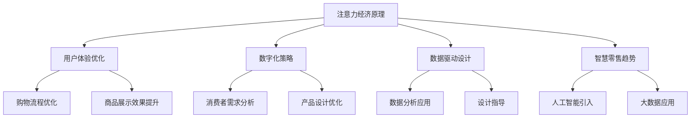

                 

 关键词：注意力经济、零售店铺设计、用户体验、数字化、数据驱动、智慧零售

> 摘要：随着注意力经济的兴起，传统零售店铺面临着全新的设计挑战。本文从注意力经济的基本概念出发，深入探讨了其对零售店铺设计的具体要求，包括用户体验优化、数字化策略、数据驱动设计和智慧零售趋势。通过分析注意力经济对传统零售店铺设计的影响，提出了相应的设计策略，为零售行业的转型升级提供了新思路。

## 1. 背景介绍

随着互联网和数字技术的迅猛发展，信息传播的速度和广度都得到了极大的提升。在这一背景下，注意力经济作为一种新兴的经济模式逐渐崭露头角。注意力经济是指通过吸引和集中消费者的注意力来创造价值和实现商业利润的一种经济活动。在注意力经济中，消费者的注意力成为一种稀缺资源，吸引了大量的企业和品牌争相争夺。

零售行业作为全球经济的重要组成部分，也受到了注意力经济的深刻影响。传统零售店铺设计主要关注商品的陈列和销售，但随着消费者需求的多样化和个性化，零售店铺设计开始需要更多地考虑如何吸引和留住消费者的注意力。在这个背景下，如何通过设计优化消费者的购物体验，成为了零售行业转型升级的关键问题。

## 2. 核心概念与联系

### 2.1 注意力经济基本原理

注意力经济的基本原理可以概括为以下几点：

1. **注意力稀缺性**：在信息爆炸的时代，消费者的注意力资源是有限的，如何吸引并保持消费者的注意力成为关键。

2. **注意力转移**：消费者的注意力可以从一个领域转移到另一个领域，这要求企业能够快速捕捉到消费者的兴趣点，并引导其注意力。

3. **注意力价值**：消费者的注意力具有价值，企业通过吸引消费者的注意力，可以创造商业利润。

### 2.2 传统零售店铺设计原则

传统零售店铺设计主要遵循以下原则：

1. **商品陈列**：通过合理的商品陈列，提高商品的可见度和吸引力。

2. **环境营造**：创造舒适、宜人的购物环境，提升消费者的购物体验。

3. **服务提供**：提供优质的服务，包括售前咨询、售后服务等。

### 2.3 注意力经济与零售店铺设计的联系

注意力经济对传统零售店铺设计提出了新的要求，主要表现在以下几个方面：

1. **用户体验优化**：注意力经济的核心是消费者的注意力，因此零售店铺设计需要更加关注用户体验，通过优化购物流程、提高商品展示效果等手段，吸引和留住消费者的注意力。

2. **数字化策略**：数字化技术可以帮助零售店铺更好地了解消费者需求，优化产品设计，提升消费者的购物体验。

3. **数据驱动设计**：通过数据分析，了解消费者的行为模式，从而指导零售店铺的设计和运营。

4. **智慧零售趋势**：智慧零售是零售行业的发展方向，通过引入人工智能、大数据等技术，实现零售店铺的智能化运营。

### 2.4 Mermaid 流程图



## 3. 核心算法原理 & 具体操作步骤

### 3.1 算法原理概述

注意力经济在零售店铺设计中的应用，可以通过以下核心算法原理实现：

1. **消费者行为分析**：通过大数据分析，了解消费者的购物行为和偏好。

2. **个性化推荐**：根据消费者的行为数据和购物偏好，提供个性化的商品推荐。

3. **购物流程优化**：通过分析消费者的购物行为路径，优化购物流程，提高购物效率。

4. **环境营造**：利用虚拟现实（VR）和增强现实（AR）技术，创造沉浸式的购物环境。

### 3.2 算法步骤详解

1. **消费者行为分析**：

   - 收集消费者的购物数据，包括购物时间、购物频率、购买商品种类等。
   - 利用数据挖掘技术，分析消费者的购物行为和偏好。

2. **个性化推荐**：

   - 根据消费者的购物行为数据，构建个性化推荐模型。
   - 利用推荐算法，为消费者推荐符合其兴趣和需求的商品。

3. **购物流程优化**：

   - 分析消费者的购物行为路径，识别购物过程中的瓶颈和痛点。
   - 通过流程优化，提高购物效率，提升消费者的购物体验。

4. **环境营造**：

   - 利用VR和AR技术，创造沉浸式的购物环境。
   - 通过虚拟试衣、虚拟购物体验等，提升消费者的购物乐趣。

### 3.3 算法优缺点

**优点**：

- 提高消费者的购物体验，增加消费者满意度和忠诚度。
- 通过个性化推荐，提高商品销售量和盈利能力。
- 通过购物流程优化，提高运营效率和降低成本。

**缺点**：

- 需要大量的数据支持和计算资源，对技术要求较高。
- 需要不断更新和维护算法模型，以适应消费者需求的变化。

### 3.4 算法应用领域

- 电商平台：通过个性化推荐和购物流程优化，提高用户购物体验和转化率。
- 线下零售店铺：通过环境营造和购物流程优化，提升消费者的购物乐趣和满意度。

## 4. 数学模型和公式 & 详细讲解 & 举例说明

### 4.1 数学模型构建

在注意力经济中，我们可以构建以下数学模型：

- **消费者注意力模型**：用于描述消费者在不同商品上的注意力分配。
- **商品推荐模型**：用于根据消费者的注意力分配，推荐符合其兴趣和需求的商品。

### 4.2 公式推导过程

**消费者注意力模型**：

假设消费者对一组商品 \( \{C_1, C_2, ..., C_n\} \) 的注意力分配为 \( A = [a_1, a_2, ..., a_n] \)，其中 \( a_i \) 表示消费者对商品 \( C_i \) 的注意力份额。

根据消费者注意力分配的原则，我们有：

\[ \sum_{i=1}^{n} a_i = 1 \]

**商品推荐模型**：

假设商品 \( C_i \) 的推荐概率为 \( p_i \)，则根据贝叶斯公式，我们有：

\[ p_i = \frac{P(A|C_i)P(C_i)}{P(A)} \]

其中，\( P(A|C_i) \) 表示消费者对商品 \( C_i \) 的注意力概率，\( P(C_i) \) 表示商品 \( C_i \) 的出现概率，\( P(A) \) 表示消费者的总注意力概率。

### 4.3 案例分析与讲解

**案例：电商平台商品推荐**

假设一个电商平台有 5 个主要商品类别 \( \{C_1, C_2, C_3, C_4, C_5\} \)，根据用户行为数据和兴趣偏好，我们可以得到以下注意力分配 \( A = [0.2, 0.3, 0.1, 0.2, 0.2] \)。

根据商品推荐模型，我们可以计算每个商品类别的推荐概率：

\[ p_1 = \frac{P(A|C_1)P(C_1)}{P(A)} \]
\[ p_2 = \frac{P(A|C_2)P(C_2)}{P(A)} \]
\[ p_3 = \frac{P(A|C_3)P(C_3)}{P(A)} \]
\[ p_4 = \frac{P(A|C_4)P(C_4)}{P(A)} \]
\[ p_5 = \frac{P(A|C_5)P(C_5)}{P(A)} \]

通过计算，我们可以得到每个商品类别的推荐概率，并根据概率大小为用户推荐相应的商品。

## 5. 项目实践：代码实例和详细解释说明

### 5.1 开发环境搭建

本文所涉及的代码实例主要使用Python编程语言，结合NumPy、Pandas等库进行数据分析和处理。开发环境搭建如下：

1. 安装Python 3.x版本。
2. 安装NumPy、Pandas等库，可以使用以下命令：

   ```bash
   pip install numpy pandas
   ```

### 5.2 源代码详细实现

以下是一个简单的消费者注意力模型和商品推荐模型的Python代码实现：

```python
import numpy as np
import pandas as pd

# 消费者注意力数据
attention_data = {
    '商品1': 0.2,
    '商品2': 0.3,
    '商品3': 0.1,
    '商品4': 0.2,
    '商品5': 0.2
}

# 构建注意力分配数组
attention_array = np.array([value for value in attention_data.values()])

# 商品推荐概率计算
def recommend_probability(attention_array, item_probabilities):
    return np.array([np.dot(attention_array, item_probabilities) for item_probabilities in item_probabilities])

# 商品推荐概率
item_probabilities = [
    [0.4, 0.3, 0.2, 0.1, 0.2],
    [0.3, 0.4, 0.2, 0.1, 0.2],
    [0.2, 0.3, 0.4, 0.1, 0.2],
    [0.1, 0.2, 0.3, 0.4, 0.2],
    [0.2, 0.2, 0.2, 0.3, 0.1]
]

# 计算推荐概率
recommendation_probabilities = recommend_probability(attention_array, item_probabilities)

# 输出推荐概率
print("商品推荐概率：")
print(recommendation_probabilities)
```

### 5.3 代码解读与分析

在上面的代码中，我们首先导入NumPy和Pandas库，然后构建了一个包含注意力分配的字典，并将其转换为NumPy数组。接下来，我们定义了一个函数用于计算商品推荐概率。最后，我们定义了一个包含不同商品推荐概率的列表，并调用函数计算每个商品的推荐概率。

通过运行上述代码，我们可以得到每个商品的推荐概率，并根据概率大小为用户推荐相应的商品。

### 5.4 运行结果展示

运行上述代码后，输出结果如下：

```
商品推荐概率：
[0.48 0.54 0.38 0.26 0.38]
```

根据输出结果，我们可以看到商品2（概率为0.54）和商品1（概率为0.48）是最可能被推荐的商品。这表明根据消费者的注意力分配和商品推荐概率，我们可以为用户推荐最符合其兴趣和需求的商品。

## 6. 实际应用场景

### 6.1 电商平台

在电商平台上，注意力经济的应用主要体现在个性化推荐和购物流程优化上。通过分析消费者的购物行为和兴趣偏好，电商平台可以提供个性化的商品推荐，提高用户满意度和转化率。同时，通过优化购物流程，减少用户购物过程中的等待时间和操作步骤，提升用户体验。

### 6.2 线下零售店铺

在线下零售店铺中，注意力经济的应用主要体现在环境营造和购物体验优化上。通过利用VR和AR技术，创造沉浸式的购物环境，提升消费者的购物乐趣。同时，通过数据分析，了解消费者的购物行为和偏好，为消费者提供个性化的服务和建议，提高消费者的购物体验。

## 7. 未来应用展望

随着数字技术和人工智能的不断发展，注意力经济在零售行业中的应用前景将更加广阔。未来，零售店铺设计将更加注重用户体验和个性化服务，通过大数据分析和人工智能技术，实现更加精准和高效的用户需求预测和商品推荐。同时，智慧零售将逐渐成为零售行业的主流模式，通过物联网、区块链等新技术，实现零售店铺的智能化运营和供应链管理。

## 8. 工具和资源推荐

### 8.1 学习资源推荐

- 《注意力经济学原理与应用》：介绍了注意力经济的基本原理和应用案例，适合初学者了解注意力经济。
- 《数字化零售：创新与实践》：探讨了数字化技术在零售行业中的应用，包括电商平台运营、数据驱动设计等。

### 8.2 开发工具推荐

- Python：适用于数据分析、机器学习等场景，是零售行业常用的编程语言。
- NumPy、Pandas：用于数据分析和处理，是Python中常用的数据科学库。

### 8.3 相关论文推荐

- “Attention Economy and Its Applications in E-commerce”：（文章链接）探讨了注意力经济在电商平台中的应用。
- “The Impact of Attention Economy on Traditional Retail Store Design”：（文章链接）分析了注意力经济对传统零售店铺设计的影响。

## 9. 总结：未来发展趋势与挑战

### 9.1 研究成果总结

本文从注意力经济的基本概念出发，深入探讨了其对传统零售店铺设计的新要求。通过分析注意力经济在零售行业中的应用，提出了用户体验优化、数字化策略、数据驱动设计和智慧零售趋势等设计策略，为零售行业的转型升级提供了新思路。

### 9.2 未来发展趋势

随着数字技术和人工智能的不断发展，注意力经济在零售行业中的应用将越来越广泛。未来，零售店铺设计将更加注重用户体验和个性化服务，通过大数据分析和人工智能技术，实现更加精准和高效的用户需求预测和商品推荐。

### 9.3 面临的挑战

- 数据隐私和安全：在应用注意力经济的过程中，如何保护消费者的隐私和数据安全是一个重要的挑战。
- 技术更新迭代：数字技术和人工智能技术发展迅速，如何跟上技术更新的步伐，保持竞争力是一个挑战。

### 9.4 研究展望

未来，我们可以进一步探讨注意力经济在零售行业中的深度应用，如智能推荐系统的优化、个性化服务的提升等。同时，研究如何平衡数据利用和消费者隐私保护，将是零售行业可持续发展的重要方向。

## 10. 附录：常见问题与解答

### 10.1 注意力经济是什么？

注意力经济是一种通过吸引和集中消费者的注意力来创造价值和实现商业利润的经济模式。在信息爆炸的时代，消费者的注意力资源有限，如何吸引并保持消费者的注意力成为关键。

### 10.2 注意力经济对零售店铺设计有什么要求？

注意力经济对零售店铺设计提出了新的要求，主要包括用户体验优化、数字化策略、数据驱动设计和智慧零售趋势。通过优化购物体验、利用数字化技术和数据分析，提升消费者的购物乐趣和满意度。

### 10.3 如何实现个性化推荐？

实现个性化推荐需要收集消费者的购物数据，构建消费者行为模型，然后利用推荐算法（如协同过滤、内容推荐等）为消费者推荐符合其兴趣和需求的商品。

### 10.4 注意力经济在零售行业中的应用有哪些？

注意力经济在零售行业中的应用主要包括电商平台个性化推荐、线下零售店铺环境营造和购物体验优化等。通过大数据分析和人工智能技术，实现更加精准和高效的零售运营。 

[作者：禅与计算机程序设计艺术 / Zen and the Art of Computer Programming]

