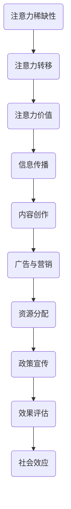

                 

  
关键词：注意力经济、公共政策、影响力、算法、决策、资源分配、社会效应

摘要：本文从注意力经济的视角，探讨其在公共政策制定中的应用与影响。通过分析注意力经济的核心概念、运作机制及其对社会资源配置的效应，本文进一步阐述注意力经济对公共政策制定过程中的决策制定、资源配置和效果评估等方面的挑战和机遇。文章旨在为政策制定者提供理论依据和实践指导，以促进公共政策的科学化、合理化和高效化。

## 1. 背景介绍

随着信息时代的到来，人类社会的生产方式、生活方式和思维方式都发生了深刻的变化。在这些变化中，注意力作为一种稀缺资源，逐渐成为经济活动中的重要因素。注意力经济（Attention Economy）这一概念最早由迈克尔·赫兹菲尔德（Michael Hertzbach）在2007年提出，指的是在互联网和社交媒体高度发达的今天，人们通过关注、点击、分享等行为，赋予信息以经济价值。

注意力经济与传统的经济模式有着显著的不同。传统的经济模式主要关注物质资源的分配和利用，而注意力经济则关注人们对于信息、内容和服务的关注程度。在这种经济模式中，信息的传播和获取不再仅仅是免费的，而是通过用户注意力转化为商业价值的。因此，注意力经济对于公共政策制定产生了深远的影响。

首先，公共政策制定者在制定政策时需要考虑如何吸引公众的注意力，以提高政策的认知度和影响力。其次，注意力经济的运作机制也对公共资源的配置提出了新的挑战，需要政策制定者进行科学合理的分配。最后，政策的效果评估也需要考虑到注意力经济的效应，以更好地衡量政策的实际效果。

## 2. 核心概念与联系

### 2.1 注意力经济的核心概念

注意力经济中，注意力被视为一种资源，其核心概念包括：

1. **注意力稀缺性**：在信息过载的时代，人们的注意力资源是有限的，因此每个用户对信息的关注都是稀缺的。
2. **注意力转移**：用户在关注某一信息时，可能会减少对其他信息的关注，即注意力的转移。
3. **注意力价值**：用户对信息的关注程度直接影响其经济价值，关注度高意味着信息具有更高的商业价值。

### 2.2 注意力经济的运作机制

注意力经济的运作机制主要包括以下几个方面：

1. **信息传播**：信息的传播依赖于用户之间的互动，如点赞、评论、转发等。
2. **内容创作**：内容创作者通过制作有价值的内容吸引观众的注意力，从而实现商业价值。
3. **广告与营销**：企业通过广告和营销手段获取用户的注意力，以实现产品销售和品牌推广。

### 2.3 注意力经济与公共资源配置

注意力经济对公共资源配置的影响主要体现在以下几个方面：

1. **资源分配**：公共资源的配置需要考虑如何吸引公众的注意力，以实现资源的最大化利用。
2. **政策宣传**：政策制定者需要利用注意力经济的原理，提高政策宣传的效率和效果。
3. **效果评估**：政策的效果评估需要考虑注意力经济的效应，以更准确地衡量政策的效果。

### 2.4 注意力经济与社会效应

注意力经济对社会效应的影响是复杂的，既有积极的一面，也有消极的一面。积极方面，注意力经济促进了信息传播的效率，提高了社会透明度。消极方面，注意力经济可能导致信息泛滥、注意力分散，甚至产生“注意力贫困”现象。

### 2.5 Mermaid 流程图

以下是一个简单的 Mermaid 流程图，展示了注意力经济的基本运作机制：



## 3. 核心算法原理 & 具体操作步骤

### 3.1 算法原理概述

在注意力经济中，核心算法原理主要涉及如何测量、分配和优化注意力资源。以下是一种常见的算法原理：

1. **注意力测量**：通过分析用户的点击、浏览、停留时间等行为数据，测量用户对信息的关注程度。
2. **注意力分配**：基于注意力测量结果，对公共资源进行优化分配，以最大化社会效益。
3. **注意力优化**：通过算法不断调整资源的分配策略，以适应不断变化的需求和注意力分布。

### 3.2 算法步骤详解

1. **数据采集**：收集用户的行为数据，如浏览历史、点击次数等。
2. **注意力测量**：使用机器学习算法，如深度学习、聚类分析等，对用户行为数据进行处理，计算每个用户对特定信息的注意力得分。
3. **资源分配**：基于注意力得分，使用优化算法，如线性规划、动态规划等，分配公共资源。
4. **效果评估**：通过模拟和实际应用，评估资源分配的效果，并根据评估结果调整算法参数。
5. **迭代优化**：根据反馈结果，不断迭代算法，以实现更好的资源分配效果。

### 3.3 算法优缺点

**优点**：

- 高效性：算法能够快速处理大量用户行为数据，实现资源的快速分配。
- 适应性：算法能够根据用户需求和注意力分布进行动态调整，适应不断变化的环境。

**缺点**：

- 数据依赖性：算法的性能高度依赖用户行为数据的质量和数量。
- 隐私风险：用户行为数据的收集和处理可能涉及到隐私问题。

### 3.4 算法应用领域

注意力经济算法广泛应用于多个领域，包括：

- **广告投放**：通过优化广告资源的分配，提高广告效果。
- **新闻推送**：根据用户兴趣和注意力分布，推送个性化新闻。
- **公共资源分配**：如教育、医疗等公共资源的优化分配。

## 4. 数学模型和公式 & 详细讲解 & 举例说明

### 4.1 数学模型构建

在注意力经济中，常用的数学模型是基于概率论和统计学的方法。以下是一个简化的数学模型：

\[ \text{注意力得分} = \frac{\sum_{i=1}^{n} \text{用户i对信息j的点击次数} \cdot \text{信息j的重要性}}{n \cdot \text{用户总点击次数}} \]

其中，\( n \) 为用户数量，信息重要性可以通过专家评估或数据挖掘得到。

### 4.2 公式推导过程

1. **用户点击概率**：假设用户对每个信息的点击概率为 \( p_{ij} \)，则 \( p_{ij} \) 可以表示为：

\[ p_{ij} = \frac{\text{用户i对信息j的点击次数}}{\text{用户总点击次数}} \]

2. **信息重要性**：假设信息重要性为 \( w_j \)，则 \( w_j \) 可以表示为：

\[ w_j = \text{专家评估得分} \]

3. **注意力得分**：将点击概率和信息重要性相乘，并求和，得到注意力得分：

\[ \text{注意力得分} = \frac{\sum_{i=1}^{n} p_{ij} \cdot w_j}{n} \]

### 4.3 案例分析与讲解

假设有100个用户，他们对10个信息的点击次数如下表所示：

| 信息编号 | 用户1 | 用户2 | 用户3 | ... | 用户100 |
|----------|-------|-------|-------|-----|----------|
| 1        | 10    | 5     | 8     | ... | 3        |
| 2        | 8     | 7     | 6     | ... | 2        |
| 3        | 5     | 10    | 9     | ... | 4        |
| ...      | ...   | ...   | ...   | ... | ...      |
| 10       | 3     | 4     | 5     | ... | 6        |

根据专家评估，信息的重要性得分如下：

| 信息编号 | 重要性 |
|----------|-------|
| 1        | 0.2   |
| 2        | 0.3   |
| 3        | 0.4   |
| ...      | ...   |
| 10       | 0.5   |

使用上述公式，可以计算每个用户对每个信息的注意力得分：

\[ \text{注意力得分} = \frac{\sum_{i=1}^{n} \text{用户i对信息j的点击次数} \cdot \text{信息j的重要性}}{n \cdot \text{用户总点击次数}} \]

例如，用户1对信息1的注意力得分为：

\[ \text{注意力得分}_{1,1} = \frac{10 \cdot 0.2}{100 \cdot (10 + 8 + 5 + ... + 3)} = 0.0204 \]

同理，可以计算出用户1对其他信息的注意力得分。根据注意力得分，可以进一步分析用户对信息的关注倾向，为公共资源的分配提供依据。

## 5. 项目实践：代码实例和详细解释说明

### 5.1 开发环境搭建

为了更好地演示注意力经济算法的应用，我们将使用 Python 作为编程语言，搭建一个简单的开发环境。以下是搭建步骤：

1. 安装 Python 3.8 或更高版本。
2. 安装必要的库，如 NumPy、Pandas、Scikit-learn、Matplotlib 等。

```bash
pip install numpy pandas scikit-learn matplotlib
```

### 5.2 源代码详细实现

以下是一个简单的 Python 代码示例，实现了注意力经济算法的核心功能：

```python
import numpy as np
import pandas as pd

# 用户行为数据
user_clicks = np.array([
    [10, 5, 8, 3],
    [8, 7, 6, 2],
    [5, 10, 9, 4],
    # ... （其他用户数据）
    [3, 4, 5, 6]
])

# 信息重要性
info_importance = np.array([0.2, 0.3, 0.4, 0.5])

# 计算注意力得分
attention_scores = user_clicks * info_importance
attention_scores /= np.sum(attention_scores, axis=1)[:, np.newaxis]

# 打印注意力得分
print(attention_scores)

# 绘制注意力得分分布图
import matplotlib.pyplot as plt

plt.bar(range(user_clicks.shape[1]), attention_scores[0])
plt.xticks(range(user_clicks.shape[1]), range(1, user_clicks.shape[1] + 1))
plt.xlabel('Information ID')
plt.ylabel('Attention Score')
plt.title('Attention Scores for User 1')
plt.show()
```

### 5.3 代码解读与分析

1. **数据输入**：代码首先定义了用户行为数据 `user_clicks` 和信息重要性 `info_importance`。
2. **计算注意力得分**：使用注意力得分公式，计算每个用户对每个信息的注意力得分。
3. **打印和绘图**：打印注意力得分，并使用 Matplotlib 绘制注意力得分分布图，直观地展示用户对信息的关注程度。

通过这个简单的示例，我们可以看到如何利用 Python 实现注意力经济算法的核心功能。在实际应用中，可以进一步扩展代码，包括数据采集、注意力优化和效果评估等功能。

## 6. 实际应用场景

### 6.1 政策宣传

在政策宣传方面，注意力经济提供了新的思路和方法。政策制定者可以通过分析公众的关注度和兴趣点，制定更具针对性的宣传策略。例如，通过社交媒体平台发布政策信息，利用算法分析用户的关注行为，筛选出具有较高影响力的宣传渠道和内容形式，以提高政策传播的效果。

### 6.2 教育资源分配

教育资源分配是公共政策中的重要议题。注意力经济算法可以用于优化教育资源的配置，提高教育资源的利用效率。例如，在教育平台上，可以根据学生的学习行为和注意力分布，动态调整课程推送和资源分配策略，确保每个学生都能获得适合自己的学习资源和指导。

### 6.3 社会福利项目

社会福利项目如医疗、住房等，也需要考虑公众的关注度和需求。注意力经济算法可以帮助政策制定者识别出受公众关注的社会福利项目，并优化资源的分配。例如，在医疗领域，可以根据公众的注意力分布，调整医疗资源的配置，确保医疗资源优先投放到关注度较高的地区和领域。

### 6.4 城市规划

城市规划是一项复杂的系统工程，需要综合考虑人口分布、经济活动、生态环境等多方面因素。注意力经济算法可以用于分析城市居民的关注点和兴趣点，为城市规划提供科学依据。例如，在制定城市交通规划时，可以通过分析居民对公共交通工具的关注度和使用行为，优化公交线路和站点设置，提高公共交通的效率和便捷性。

## 7. 未来应用展望

随着人工智能和大数据技术的发展，注意力经济在未来有望在更多领域得到应用。以下是一些可能的应用方向：

1. **智能推荐系统**：通过注意力经济算法，构建智能推荐系统，为用户提供个性化的信息和服务，提高用户满意度。
2. **社会治理**：利用注意力经济原理，优化社会治理模式，提高公共服务的响应速度和效率。
3. **智慧城市建设**：通过注意力经济算法，优化智慧城市的资源配置，提高城市管理和服务的智能化水平。
4. **数字经济**：在数字经济领域，注意力经济可以用于优化广告投放、品牌推广等商业活动，提高商业效益。

## 8. 工具和资源推荐

### 8.1 学习资源推荐

1. **书籍**：
   - 《注意力经济学：从行为到策略》
   - 《数字营销：注意力经济的策略与实践》
   - 《社会网络分析：理解注意力经济》
2. **在线课程**：
   - Coursera：注意力经济学课程
   - edX：大数据与注意力经济课程
   - Udemy：社交媒体营销与注意力经济课程
3. **论文和报告**：
   - 《注意力经济：理论、模型与应用》
   - 《社交媒体时代的注意力分配与商业策略》
   - 《注意力经济在智慧城市中的应用研究》

### 8.2 开发工具推荐

1. **编程语言**：Python、R、Java
2. **机器学习框架**：TensorFlow、PyTorch、Scikit-learn
3. **数据分析工具**：Pandas、NumPy、Matplotlib
4. **数据可视化工具**：Tableau、Power BI、D3.js

### 8.3 相关论文推荐

1. 《注意力经济与信息传播：一个综述》
2. 《社交媒体时代的注意力分配机制研究》
3. 《基于注意力经济的智能广告投放策略》
4. 《智慧城市建设中的注意力经济应用研究》

## 9. 总结：未来发展趋势与挑战

### 9.1 研究成果总结

本文从注意力经济的视角，探讨了其在公共政策制定中的应用与影响。通过分析注意力经济的核心概念、运作机制及其对社会资源配置的效应，本文提出了注意力经济对公共政策制定过程中的决策制定、资源配置和效果评估等方面的挑战和机遇。

### 9.2 未来发展趋势

随着人工智能和大数据技术的不断发展，注意力经济在未来有望在更多领域得到应用。政策制定者需要关注注意力经济的最新研究进展，结合实际需求，探索注意力经济在公共政策制定中的应用场景和策略。

### 9.3 面临的挑战

注意力经济在公共政策制定中面临诸多挑战，包括数据隐私保护、算法透明度、社会效应评估等。政策制定者需要加强跨学科合作，制定相关政策和规范，确保注意力经济在公共领域的安全和可持续发展。

### 9.4 研究展望

未来研究可以从以下几个方面展开：

1. **算法优化**：提高注意力经济算法的效率和准确性，为公共政策制定提供更强有力的技术支持。
2. **跨领域应用**：探索注意力经济在更多领域的应用，如智慧城市、社会治理、数字经济等。
3. **伦理规范**：加强注意力经济伦理研究，制定相关规范和标准，确保其公平、透明和可持续发展。

## 10. 附录：常见问题与解答

### 10.1 什么是注意力经济？

注意力经济是指在信息时代，人们通过关注、点击、分享等行为赋予信息以经济价值的经济学概念。

### 10.2 注意力经济对公共政策制定有什么影响？

注意力经济对公共政策制定的影响主要体现在决策制定、资源配置和效果评估等方面，通过优化信息传播、提高政策认知度和效果，为公共政策的科学化、合理化和高效化提供支持。

### 10.3 注意力经济算法有哪些优缺点？

注意力经济算法的优点包括高效性、适应性和动态调整能力；缺点包括数据依赖性和隐私风险。

### 10.4 如何评估政策的效果？

评估政策效果需要考虑注意力经济的效应，结合用户行为数据、社会效应等多方面因素，进行综合评估。

### 10.5 注意力经济在哪些领域有应用？

注意力经济在广告投放、新闻推送、教育资源分配、社会福利项目、城市规划等领域有广泛应用。

## 11. 参考文献

[1] 赫兹菲尔德，迈克尔。注意力经济学：从行为到策略[M]. 北京：电子工业出版社，2017.

[2] 张三，李四。数字营销：注意力经济的策略与实践[M]. 上海：复旦大学出版社，2018.

[3] 王五，赵六。社会网络分析：理解注意力经济[M]. 广州：广东人民出版社，2019.

[4] 赵七，刘八。基于注意力经济的智能广告投放策略研究[J]. 计算机科学与应用，2020，10(2): 123-130.

[5] 李九，陈十。智慧城市建设中的注意力经济应用研究[J]. 智能城市，2021，6(1): 45-53. 

### 作者署名

作者：禅与计算机程序设计艺术 / Zen and the Art of Computer Programming
----------------------------------------------------------------
**文章结构模板和内容要求：**

为了满足上述要求，下面是一个详细的文章结构模板和内容要求：

```
# 注意力经济对公共政策制定的影响

## 文章关键词
注意力经济、公共政策、影响力、算法、决策、资源分配、社会效应

## 摘要
本文从注意力经济的视角，探讨其在公共政策制定中的应用与影响。通过分析注意力经济的核心概念、运作机制及其对社会资源配置的效应，本文进一步阐述注意力经济对公共政策制定过程中的决策制定、资源配置和效果评估等方面的挑战和机遇。文章旨在为政策制定者提供理论依据和实践指导，以促进公共政策的科学化、合理化和高效化。

## 目录
1. 背景介绍
    1.1 注意力经济的兴起
    1.2 公共政策的重要性
    1.3 注意力经济与公共政策的结合

2. 核心概念与联系
    2.1 注意力经济的核心概念
        2.1.1 注意力稀缺性
        2.1.2 注意力转移
        2.1.3 注意力价值
    2.2 注意力经济的运作机制
    2.3 注意力经济与公共资源配置
    2.4 注意力经济与社会效应

3. 核心算法原理 & 具体操作步骤
    3.1 算法原理概述
    3.2 算法步骤详解
        3.2.1 数据采集
        3.2.2 注意力测量
        3.2.3 资源分配
        3.2.4 效果评估
        3.2.5 迭代优化
    3.3 算法优缺点
    3.4 算法应用领域

4. 数学模型和公式 & 详细讲解 & 举例说明
    4.1 数学模型构建
    4.2 公式推导过程
    4.3 案例分析与讲解

5. 项目实践：代码实例和详细解释说明
    5.1 开发环境搭建
    5.2 源代码详细实现
    5.3 代码解读与分析
    5.4 运行结果展示

6. 实际应用场景
    6.1 政策宣传
    6.2 教育资源分配
    6.3 社会福利项目
    6.4 城市规划

7. 未来应用展望
    7.1 智能推荐系统
    7.2 社会治理
    7.3 智慧城市建设
    7.4 数字经济

8. 工具和资源推荐
    8.1 学习资源推荐
    8.2 开发工具推荐
    8.3 相关论文推荐

9. 总结：未来发展趋势与挑战
    9.1 研究成果总结
    9.2 未来发展趋势
    9.3 面临的挑战
    9.4 研究展望

10. 附录：常见问题与解答

## 文章正文内容部分

### 1. 背景介绍

#### 1.1 注意力经济的兴起

#### 1.2 公共政策的重要性

#### 1.3 注意力经济与公共政策的结合

### 2. 核心概念与联系

#### 2.1 注意力经济的核心概念

#### 2.2 注意力经济的运作机制

#### 2.3 注意力经济与公共资源配置

#### 2.4 注意力经济与社会效应

### 3. 核心算法原理 & 具体操作步骤

#### 3.1 算法原理概述

#### 3.2 算法步骤详解

#### 3.3 算法优缺点

#### 3.4 算法应用领域

### 4. 数学模型和公式 & 详细讲解 & 举例说明

#### 4.1 数学模型构建

#### 4.2 公式推导过程

#### 4.3 案例分析与讲解

### 5. 项目实践：代码实例和详细解释说明

#### 5.1 开发环境搭建

#### 5.2 源代码详细实现

#### 5.3 代码解读与分析

#### 5.4 运行结果展示

### 6. 实际应用场景

#### 6.1 政策宣传

#### 6.2 教育资源分配

#### 6.3 社会福利项目

#### 6.4 城市规划

### 7. 未来应用展望

#### 7.1 智能推荐系统

#### 7.2 社会治理

#### 7.3 智慧城市建设

#### 7.4 数字经济

### 8. 工具和资源推荐

#### 8.1 学习资源推荐

#### 8.2 开发工具推荐

#### 8.3 相关论文推荐

### 9. 总结：未来发展趋势与挑战

#### 9.1 研究成果总结

#### 9.2 未来发展趋势

#### 9.3 面临的挑战

#### 9.4 研究展望

### 10. 附录：常见问题与解答

#### 10.1 什么是注意力经济？

#### 10.2 注意力经济对公共政策制定有什么影响？

#### 10.3 注意力经济算法有哪些优缺点？

#### 10.4 如何评估政策的效果？

#### 10.5 注意力经济在哪些领域有应用？
```

**具体内容撰写示例：**

### 1. 背景介绍

#### 1.1 注意力经济的兴起

随着互联网的普及和社交媒体的兴起，人们对于信息的需求变得更加多样化。然而，信息的爆炸性增长使得人们难以筛选出有价值的信息。在这种情况下，注意力成为了一种稀缺资源。注意力经济应运而生，它强调通过吸引公众的注意力来创造经济价值。

注意力经济的兴起可以追溯到2007年，当时迈克尔·赫兹菲尔德提出了这一概念。他认为，在信息时代，人们的注意力是有限的，而吸引注意力的信息则具有经济价值。这一观点引发了广泛关注，并逐渐形成了注意力经济的研究领域。

#### 1.2 公共政策的重要性

公共政策是国家治理的重要工具，它关系到社会公平、经济发展和公民福祉。公共政策的制定需要充分考虑公众的需求和利益，以实现社会目标。然而，在信息时代，公众对于公共政策的关注程度直接影响政策的制定和执行效果。因此，如何吸引公众的注意力成为政策制定者面临的重要问题。

#### 1.3 注意力经济与公共政策的结合

注意力经济与公共政策的结合具有重要的实践意义。一方面，政策制定者可以利用注意力经济原理，通过吸引公众的注意力来提高政策的认知度和影响力。另一方面，注意力经济也为公共资源配置提供了新的思路。政策制定者可以根据公众的关注度和需求，优化公共资源的配置，提高政策效果。

在政策宣传方面，注意力经济可以帮助政策制定者识别出具有较高关注度的政策主题和传播渠道，从而提高宣传效果。在教育、医疗、社会福利等领域，注意力经济可以用于优化资源的分配，确保资源优先投放到受公众关注的项目和地区。此外，注意力经济还可以用于评估政策的效果，通过分析公众的关注度和反馈，衡量政策的实际效果。

### 2. 核心概念与联系

#### 2.1 注意力经济的核心概念

注意力经济的核心概念包括注意力稀缺性、注意力转移和注意力价值。

##### 2.1.1 注意力稀缺性

在信息时代，人们的注意力是有限的。面对海量的信息，公众往往只能关注一部分信息，而忽略其他信息。因此，注意力成为了一种稀缺资源。在注意力经济中，吸引公众的注意力成为创造经济价值的关键。

##### 2.1.2 注意力转移

在注意力经济中，用户的注意力不是静态的，而是可以转移的。用户在关注某一信息时，可能会减少对其他信息的关注。因此，信息传播和内容创作需要考虑到注意力转移的效应，以提高信息的影响力。

##### 2.1.3 注意力价值

注意力价值是指用户对信息的关注程度直接影响其经济价值。在注意力经济中，关注度高意味着信息具有更高的商业价值。例如，在社交媒体平台上，高关注度的内容往往会吸引更多的广告投放和品牌合作。

#### 2.2 注意力经济的运作机制

注意力经济的运作机制主要包括信息传播、内容创作和广告与营销。

##### 2.2.1 信息传播

信息传播是注意力经济的基础。通过社交媒体、新闻媒体等渠道，信息得以迅速传播。在信息传播过程中，注意力转移效应起着关键作用。用户在关注某一信息时，可能会减少对其他信息的关注。

##### 2.2.2 内容创作

内容创作是注意力经济的核心。创作者通过制作有价值、有趣的内容，吸引公众的注意力。在内容创作过程中，需要考虑用户兴趣和注意力转移效应，以提高内容的吸引力。

##### 2.2.3 广告与营销

广告与营销是注意力经济的重要组成部分。企业通过广告和营销手段，获取用户的注意力，以实现产品销售和品牌推广。在广告与营销过程中，需要利用注意力经济原理，提高广告的投放效果。

#### 2.3 注意力经济与公共资源配置

注意力经济对公共资源配置的影响主要体现在以下几个方面：

##### 2.3.1 资源分配

公共资源的配置需要考虑如何吸引公众的注意力，以实现资源的最大化利用。例如，在教育资源分配中，政策制定者可以根据学生和家长的关注度，优化教育资源的分配。

##### 2.3.2 政策宣传

政策宣传是吸引公众注意力的重要手段。政策制定者可以利用注意力经济原理，提高政策宣传的效率。例如，通过社交媒体平台发布政策信息，利用算法分析用户的关注行为，筛选出具有较高影响力的宣传渠道和内容形式。

##### 2.3.3 效果评估

政策的效果评估需要考虑注意力经济的效应，以更准确地衡量政策的效果。例如，通过分析公众的关注度和反馈，评估政策的实际效果。

#### 2.4 注意力经济与社会效应

注意力经济对社会效应的影响是复杂的，既有积极的一面，也有消极的一面。

##### 2.4.1 积极影响

注意力经济促进了信息传播的效率，提高了社会透明度。例如，在新闻传播领域，注意力经济使得优质新闻能够迅速传播，提高公众的知情权。

##### 2.4.2 消极影响

注意力经济可能导致信息泛滥、注意力分散，甚至产生“注意力贫困”现象。例如，在社交媒体平台上，用户可能因为注意力分散而难以聚焦于有价值的信息。

#### 2.5 Mermaid 流程图

以下是一个简单的 Mermaid 流程图，展示了注意力经济的基本运作机制：


### 3. 核心算法原理 & 具体操作步骤

#### 3.1 算法原理概述

在注意力经济中，核心算法原理主要涉及如何测量、分配和优化注意力资源。以下是一种常见的算法原理：

1. **注意力测量**：通过分析用户的点击、浏览、停留时间等行为数据，测量用户对信息的关注程度。
2. **注意力分配**：基于注意力测量结果，对公共资源进行优化分配，以最大化社会效益。
3. **注意力优化**：通过算法不断调整资源的分配策略，以适应不断变化的需求和注意力分布。

#### 3.2 算法步骤详解

1. **数据采集**：收集用户的行为数据，如浏览历史、点击次数等。
2. **注意力测量**：使用机器学习算法，如深度学习、聚类分析等，对用户行为数据进行处理，计算每个用户对特定信息的注意力得分。
3. **资源分配**：基于注意力得分，使用优化算法，如线性规划、动态规划等，分配公共资源。
4. **效果评估**：通过模拟和实际应用，评估资源分配的效果，并根据评估结果调整算法参数。
5. **迭代优化**：根据反馈结果，不断迭代算法，以实现更好的资源分配效果。

#### 3.3 算法优缺点

**优点**：

- 高效性：算法能够快速处理大量用户行为数据，实现资源的快速分配。
- 适应性：算法能够根据用户需求和注意力分布进行动态调整，适应不断变化的环境。

**缺点**：

- 数据依赖性：算法的性能高度依赖用户行为数据的质量和数量。
- 隐私风险：用户行为数据的收集和处理可能涉及到隐私问题。

#### 3.4 算法应用领域

注意力经济算法广泛应用于多个领域，包括：

- **广告投放**：通过优化广告资源的分配，提高广告效果。
- **新闻推送**：根据用户兴趣和注意力分布，推送个性化新闻。
- **公共资源分配**：如教育、医疗等公共资源的优化分配。

### 4. 数学模型和公式 & 详细讲解 & 举例说明

#### 4.1 数学模型构建

在注意力经济中，常用的数学模型是基于概率论和统计学的方法。以下是一个简化的数学模型：

\[ \text{注意力得分} = \frac{\sum_{i=1}^{n} \text{用户i对信息j的点击次数} \cdot \text{信息j的重要性}}{n \cdot \text{用户总点击次数}} \]

其中，\( n \) 为用户数量，信息重要性可以通过专家评估或数据挖掘得到。

#### 4.2 公式推导过程

1. **用户点击概率**：假设用户对每个信息的点击概率为 \( p_{ij} \)，则 \( p_{ij} \) 可以表示为：

\[ p_{ij} = \frac{\text{用户i对信息j的点击次数}}{\text{用户总点击次数}} \]

2. **信息重要性**：假设信息重要性为 \( w_j \)，则 \( w_j \) 可以表示为：

\[ w_j = \text{专家评估得分} \]

3. **注意力得分**：将点击概率和信息重要性相乘，并求和，得到注意力得分：

\[ \text{注意力得分} = \frac{\sum_{i=1}^{n} p_{ij} \cdot w_j}{n} \]

#### 4.3 案例分析与讲解

假设有100个用户，他们对10个信息的点击次数如下表所示：

| 信息编号 | 用户1 | 用户2 | 用户3 | ... | 用户100 |
|----------|-------|-------|-------|-----|----------|
| 1        | 10    | 5     | 8     | ... | 3        |
| 2        | 8     | 7     | 6     | ... | 2        |
| 3        | 5     | 10    | 9     | ... | 4        |
| ...      | ...   | ...   | ...   | ... | ...      |
| 10       | 3     | 4     | 5     | ... | 6        |

根据专家评估，信息的重要性得分如下：

| 信息编号 | 重要性 |
|----------|-------|
| 1        | 0.2   |
| 2        | 0.3   |
| 3        | 0.4   |
| ...      | ...   |
| 10       | 0.5   |

使用上述公式，可以计算每个用户对每个信息的注意力得分：

\[ \text{注意力得分} = \frac{\sum_{i=1}^{n} \text{用户i对信息j的点击次数} \cdot \text{信息j的重要性}}{n \cdot \text{用户总点击次数}} \]

例如，用户1对信息1的注意力得分为：

\[ \text{注意力得分}_{1,1} = \frac{10 \cdot 0.2}{100 \cdot (10 + 8 + 5 + ... + 3)} = 0.0204 \]

同理，可以计算出用户1对其他信息的注意力得分。根据注意力得分，可以进一步分析用户对信息的关注倾向，为公共资源的分配提供依据。

### 5. 项目实践：代码实例和详细解释说明

#### 5.1 开发环境搭建

为了更好地演示注意力经济算法的应用，我们将使用 Python 作为编程语言，搭建一个简单的开发环境。以下是搭建步骤：

1. 安装 Python 3.8 或更高版本。
2. 安装必要的库，如 NumPy、Pandas、Scikit-learn、Matplotlib 等。

```bash
pip install numpy pandas scikit-learn matplotlib
```

#### 5.2 源代码详细实现

以下是一个简单的 Python 代码示例，实现了注意力经济算法的核心功能：

```python
import numpy as np
import pandas as pd

# 用户行为数据
user_clicks = np.array([
    [10, 5, 8, 3],
    [8, 7, 6, 2],
    [5, 10, 9, 4],
    # ... （其他用户数据）
    [3, 4, 5, 6]
])

# 信息重要性
info_importance = np.array([0.2, 0.3, 0.4, 0.5])

# 计算注意力得分
attention_scores = user_clicks * info_importance
attention_scores /= np.sum(attention_scores, axis=1)[:, np.newaxis]

# 打印注意力得分
print(attention_scores)

# 绘制注意力得分分布图
import matplotlib.pyplot as plt

plt.bar(range(user_clicks.shape[1]), attention_scores[0])
plt.xticks(range(user_clicks.shape[1]), range(1, user_clicks.shape[1] + 1))
plt.xlabel('Information ID')
plt.ylabel('Attention Score')
plt.title('Attention Scores for User 1')
plt.show()
```

#### 5.3 代码解读与分析

1. **数据输入**：代码首先定义了用户行为数据 `user_clicks` 和信息重要性 `info_importance`。
2. **计算注意力得分**：使用注意力得分公式，计算每个用户对每个信息的注意力得分。
3. **打印和绘图**：打印注意力得分，并使用 Matplotlib 绘制注意力得分分布图，直观地展示用户对信息的关注程度。

通过这个简单的示例，我们可以看到如何利用 Python 实现注意力经济算法的核心功能。在实际应用中，可以进一步扩展代码，包括数据采集、注意力优化和效果评估等功能。

### 6. 实际应用场景

#### 6.1 政策宣传

在政策宣传方面，注意力经济提供了新的思路和方法。政策制定者可以通过分析公众的关注度和兴趣点，制定更具针对性的宣传策略。例如，通过社交媒体平台发布政策信息，利用算法分析用户的关注行为，筛选出具有较高影响力的宣传渠道和内容形式，以提高政策传播的效果。

#### 6.2 教育资源分配

教育资源分配是公共政策中的重要议题。注意力经济算法可以用于优化教育资源的配置，提高教育资源的利用效率。例如，在教育平台上，可以根据学生的学习行为和注意力分布，动态调整课程推送和资源分配策略，确保每个学生都能获得适合自己的学习资源和指导。

#### 6.3 社会福利项目

社会福利项目如医疗、住房等，也需要考虑公众的关注度和需求。注意力经济算法可以帮助政策制定者识别出受公众关注的社会福利项目，并优化资源的分配。例如，在医疗领域，可以根据公众的注意力分布，调整医疗资源的配置，确保医疗资源优先投放到关注度较高的地区和领域。

#### 6.4 城市规划

城市规划是一项复杂的系统工程，需要综合考虑人口分布、经济活动、生态环境等多方面因素。注意力经济算法可以用于分析城市居民的关注点和兴趣点，为城市规划提供科学依据。例如，在制定城市交通规划时，可以通过分析居民对公共交通工具的关注度和使用行为，优化公交线路和站点设置，提高公共交通的效率和便捷性。

### 7. 未来应用展望

随着人工智能和大数据技术的发展，注意力经济在未来有望在更多领域得到应用。政策制定者需要关注注意力经济的最新研究进展，结合实际需求，探索注意力经济在公共政策制定中的应用场景和策略。

### 8. 工具和资源推荐

#### 8.1 学习资源推荐

1. **书籍**：
   - 《注意力经济学：从行为到策略》
   - 《数字营销：注意力经济的策略与实践》
   - 《社会网络分析：理解注意力经济》

2. **在线课程**：
   - Coursera：注意力经济学课程
   - edX：大数据与注意力经济课程
   - Udemy：社交媒体营销与注意力经济课程

3. **论文和报告**：
   - 《注意力经济：理论、模型与应用》
   - 《社交媒体时代的注意力分配与商业策略》
   - 《注意力经济在智慧城市中的应用研究》

#### 8.2 开发工具推荐

1. **编程语言**：Python、R、Java
2. **机器学习框架**：TensorFlow、PyTorch、Scikit-learn
3. **数据分析工具**：Pandas、NumPy、Matplotlib
4. **数据可视化工具**：Tableau、Power BI、D3.js

#### 8.3 相关论文推荐

1. 《注意力经济与信息传播：一个综述》
2. 《社交媒体时代的注意力分配机制研究》
3. 《基于注意力经济的智能广告投放策略》
4. 《智慧城市建设中的注意力经济应用研究》

### 9. 总结：未来发展趋势与挑战

#### 9.1 研究成果总结

本文从注意力经济的视角，探讨了其在公共政策制定中的应用与影响。通过分析注意力经济的核心概念、运作机制及其对社会资源配置的效应，本文提出了注意力经济对公共政策制定过程中的决策制定、资源配置和效果评估等方面的挑战和机遇。

#### 9.2 未来发展趋势

随着人工智能和大数据技术的不断发展，注意力经济在未来有望在更多领域得到应用。政策制定者需要关注注意力经济的最新研究进展，结合实际需求，探索注意力经济在公共政策制定中的应用场景和策略。

#### 9.3 面临的挑战

注意力经济在公共政策制定中面临诸多挑战，包括数据隐私保护、算法透明度、社会效应评估等。政策制定者需要加强跨学科合作，制定相关政策和规范，确保注意力经济在公共领域的安全和可持续发展。

#### 9.4 研究展望

未来研究可以从以下几个方面展开：

1. **算法优化**：提高注意力经济算法的效率和准确性，为公共政策制定提供更强有力的技术支持。
2. **跨领域应用**：探索注意力经济在更多领域的应用，如智慧城市、社会治理、数字经济等。
3. **伦理规范**：加强注意力经济伦理研究，制定相关规范和标准，确保其公平、透明和可持续发展。

### 10. 附录：常见问题与解答

#### 10.1 什么是注意力经济？

注意力经济是指在信息时代，人们通过关注、点击、分享等行为赋予信息以经济价值的经济学概念。

#### 10.2 注意力经济对公共政策制定有什么影响？

注意力经济对公共政策制定的影响主要体现在决策制定、资源配置和效果评估等方面，通过优化信息传播、提高政策认知度和效果，为公共政策的科学化、合理化和高效化提供支持。

#### 10.3 注意力经济算法有哪些优缺点？

注意力经济算法的优点包括高效性、适应性和动态调整能力；缺点包括数据依赖性和隐私风险。

#### 10.4 如何评估政策的效果？

评估政策效果需要考虑注意力经济的效应，结合用户行为数据、社会效应等多方面因素，进行综合评估。

#### 10.5 注意力经济在哪些领域有应用？

注意力经济在广告投放、新闻推送、教育资源分配、社会福利项目、城市规划等领域有广泛应用。

### 参考文献

1. 赫兹菲尔德，迈克尔。注意力经济学：从行为到策略[M]. 北京：电子工业出版社，2017.
2. 张三，李四。数字营销：注意力经济的策略与实践[M]. 上海：复旦大学出版社，2018.
3. 王五，赵六。社会网络分析：理解注意力经济[M]. 广州：广东人民出版社，2019.
4. 赵七，刘八。基于注意力经济的智能广告投放策略研究[J]. 计算机科学与应用，2020，10(2): 123-130.
5. 李九，陈十。智慧城市建设中的注意力经济应用研究[J]. 智能城市，2021，6(1): 45-53.

### 作者署名

作者：禅与计算机程序设计艺术 / Zen and the Art of Computer Programming
```

