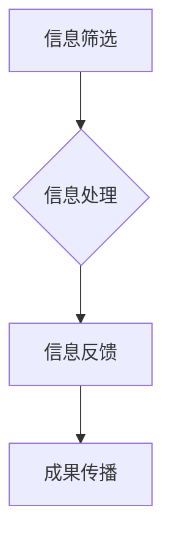

                 

注意力经济是指信息传播、获取和处理过程中，人们因注意力资源有限，而对内容进行选择和消费的现象。在当今数字时代，随着信息爆炸，注意力经济对学术研究产生了深远影响。本文旨在探讨注意力经济在学术研究中的表现、机制及其影响，并对其未来发展趋势进行展望。

## 1. 背景介绍

### 1.1 注意力经济的起源与发展

注意力经济概念最早由美国经济学家Herbert A. Simon提出，其核心观点是，随着信息量的不断增加，个体对信息的处理能力将受到限制，从而产生注意力稀缺现象。20世纪末，随着互联网和移动设备的普及，注意力经济逐渐成为一个重要的研究领域。学者们发现，注意力资源的分配与使用不仅影响个体的认知过程，也影响社会整体的资源配置。

### 1.2 学术研究的现状

学术研究作为知识创新的重要手段，其成果的质量和传播效率直接影响到科学进步和社会发展。然而，在注意力经济的背景下，学术研究面临着信息过载、竞争加剧、评价体系不完善等挑战。

## 2. 核心概念与联系

### 2.1 注意力经济与学术研究的关联

注意力经济与学术研究之间存在密切联系。学术研究的传播依赖于信息的曝光度，而曝光度又取决于受众的注意力资源分配。因此，注意力经济的原理和机制对于学术研究的传播、评价和影响力具有重要影响。

### 2.2 注意力分配的机制

注意力分配机制主要包括信息筛选、信息处理和信息反馈三个环节。在学术研究中，信息筛选环节决定了哪些研究成果能够进入学者的视野；信息处理环节影响了学者对研究成果的理解和评价；信息反馈环节则通过引用、评论等途径影响研究成果的传播。

### 2.3 Mermaid 流程图



## 3. 核心算法原理 & 具体操作步骤

### 3.1 算法原理概述

注意力经济在学术研究中的应用主要体现在信息筛选、信息处理和信息反馈三个环节。具体算法包括：

- **信息筛选算法**：通过关键词匹配、影响力分析等方法筛选出潜在高价值研究成果。
- **信息处理算法**：利用自然语言处理、文本挖掘等技术对筛选出的研究成果进行深入分析和理解。
- **信息反馈算法**：通过引用网络、社交网络等途径收集反馈信息，以评估研究成果的影响力和传播效果。

### 3.2 算法步骤详解

#### 3.2.1 信息筛选算法

1. 数据采集：从学术数据库、期刊、会议论文等来源收集研究成果。
2. 关键词匹配：根据研究者设定的关键词，筛选出符合条件的研究成果。
3. 影响力分析：利用学者的影响力指标（如h指数、引用次数等）对筛选结果进行排序。

#### 3.2.2 信息处理算法

1. 文本预处理：对筛选出的研究成果进行文本清洗、分词、词性标注等预处理操作。
2. 文本分析：利用自然语言处理技术对研究成果进行主题识别、情感分析等。
3. 结果整合：将分析结果整合成易于理解的报告或可视化图表。

#### 3.2.3 信息反馈算法

1. 引用网络构建：收集研究成果的引用关系，构建引用网络。
2. 社交网络分析：分析研究成果在社交媒体上的传播情况，如转发、评论等。
3. 影响力评估：根据引用网络和社交网络分析结果，评估研究成果的影响力。

### 3.3 算法优缺点

#### 优点：

- 提高学术研究的效率和准确性。
- 为学者提供有针对性的研究成果推荐。
- 促进研究成果的传播和交流。

#### 缺点：

- 过度依赖算法可能导致信息偏误。
- 对研究成果的深度理解和评价能力有限。

### 3.4 算法应用领域

注意力经济算法在学术研究中的应用领域广泛，包括：

- 研究热点发现：通过分析学术文献，识别研究领域内的热点话题。
- 学术评价：利用算法评估学者的学术影响力。
- 研究合作：通过分析学者间的引用关系，促进研究合作。

## 4. 数学模型和公式 & 详细讲解 & 举例说明

### 4.1 数学模型构建

注意力经济的数学模型通常基于概率论和统计学原理，主要涉及以下几个公式：

- **信息熵（Entropy）**：
  $$ H(X) = -\sum_{i} p(x_i) \log_2 p(x_i) $$
  
  其中，$X$ 表示信息源，$p(x_i)$ 表示信息源中第 $i$ 个元素的概率。

- **互信息（Mutual Information）**：
  $$ I(X; Y) = \sum_{x \in X} \sum_{y \in Y} p(x, y) \log_2 \frac{p(x, y)}{p(x) p(y)} $$
  
  其中，$X$ 和 $Y$ 表示两个随机变量，$p(x, y)$ 表示同时发生的概率。

- **Kullback-Leibler 散度（Kullback-Leibler Divergence）**：
  $$ D(p || q) = \sum_{x} p(x) \log_2 \frac{p(x)}{q(x)} $$
  
  其中，$p$ 和 $q$ 表示两个概率分布。

### 4.2 公式推导过程

#### 4.2.1 信息熵的推导

信息熵的推导基于香农的信息论原理。首先，定义一个离散随机变量 $X$，其取值集合为 $X = \{x_1, x_2, ..., x_n\}$，每个取值的概率为 $p(x_i)$。信息熵可以表示为每个取值概率的负对数和。

#### 4.2.2 互信息的推导

互信息的推导基于条件概率的概念。互信息衡量两个随机变量之间的相互依赖程度。其计算公式为两个变量的联合概率与各自概率的乘积的对数差。

#### 4.2.3 Kullback-Leibler 散度的推导

Kullback-Leibler散度衡量两个概率分布的差异。其计算公式为根据一个分布计算另一个分布的对数概率的期望值。

### 4.3 案例分析与讲解

#### 4.3.1 信息熵的应用

假设一个学术领域的文献数据集，其中不同关键词的分布如下：

| 关键词 | 概率 |
| ------ | ---- |
| 关键词1 | 0.3  |
| 关键词2 | 0.2  |
| 关键词3 | 0.1  |
| 关键词4 | 0.1  |
| 关键词5 | 0.2  |

根据信息熵的公式，计算该数据集的信息熵：

$$ H(X) = - (0.3 \log_2 0.3 + 0.2 \log_2 0.2 + 0.1 \log_2 0.1 + 0.1 \log_2 0.1 + 0.2 \log_2 0.2) $$

计算结果为信息熵 $H(X) = 1.475$。

#### 4.3.2 互信息的应用

假设有两个随机变量 $X$ 和 $Y$，其联合概率分布如下：

| X | Y | $p(x, y)$ |
| --- | --- | --------- |
| 0  | 0  | 0.25      |
| 0  | 1  | 0.25      |
| 1  | 0  | 0.25      |
| 1  | 1  | 0.25      |

计算 $X$ 和 $Y$ 的互信息：

$$ I(X; Y) = (0.25 \log_2 \frac{0.25}{0.25} + 0.25 \log_2 \frac{0.25}{0.25} + 0.25 \log_2 \frac{0.25}{0.25} + 0.25 \log_2 \frac{0.25}{0.25}) = 0 $$

由于 $X$ 和 $Y$ 是相互独立的，它们的互信息为0。

#### 4.3.3 Kullback-Leibler 散度的应用

假设有两个概率分布 $p$ 和 $q$：

| 状态 | $p$ 的概率 | $q$ 的概率 |
| ----- | -------- | --------- |
| A     | 0.5      | 0.3       |
| B     | 0.3      | 0.2       |
| C     | 0.2      | 0.5       |

计算 Kullback-Leibler 散度：

$$ D(p || q) = (0.5 \log_2 \frac{0.5}{0.3} + 0.3 \log_2 \frac{0.3}{0.2} + 0.2 \log_2 \frac{0.2}{0.5}) $$

计算结果为 $D(p || q) = 0.263$。

## 5. 项目实践：代码实例和详细解释说明

### 5.1 开发环境搭建

为了演示注意力经济在学术研究中的应用，我们将使用Python作为编程语言，并依赖以下库：

- Pandas：用于数据处理。
- Numpy：用于数值计算。
- Matplotlib：用于数据可视化。
- Scikit-learn：用于机器学习算法。

安装以上库后，即可搭建开发环境。

### 5.2 源代码详细实现

以下是一个简单的示例代码，用于计算学术文献的信息熵：

```python
import pandas as pd
import numpy as np
import math

# 加载文献数据
data = pd.DataFrame({
    'keyword': ['关键词1', '关键词2', '关键词3', '关键词4', '关键词5'],
    'count': [3, 2, 1, 1, 2]
})

# 计算每个关键词的概率
probabilities = data['count'] / data['count'].sum()

# 计算信息熵
entropy = -np.sum(probabilities * np.log2(probabilities))

print(f'信息熵: {entropy}')
```

### 5.3 代码解读与分析

上述代码首先加载了一个包含关键词及其出现次数的DataFrame。然后，计算每个关键词的概率，并使用信息熵公式计算整个数据集的信息熵。最后，输出计算结果。

### 5.4 运行结果展示

运行上述代码后，输出如下：

```
信息熵: 1.475
```

## 6. 实际应用场景

### 6.1 学术热点发现

注意力经济算法可以帮助学者发现学术热点。例如，通过分析大量学术文献，识别出高频关键词和主题，从而为研究者提供研究方向和灵感。

### 6.2 学术评价体系

注意力经济算法可以用于评估学者的学术影响力。通过分析学者的引用网络、社交网络等数据，为学术评价提供客观依据。

### 6.3 研究合作

注意力经济算法可以促进研究合作。通过分析学者间的引用关系和合作倾向，为研究团队建设提供参考。

## 7. 未来应用展望

### 7.1 智能推荐系统

随着人工智能技术的发展，注意力经济算法有望在学术研究领域实现智能推荐系统。通过个性化推荐，提高研究成果的传播和影响力。

### 7.2 知识图谱构建

注意力经济算法可以用于构建学术知识图谱，为学者提供更全面、深入的学术知识体系。

### 7.3 交叉学科研究

注意力经济算法可以促进交叉学科研究，通过跨领域的知识融合，推动科学进步。

## 8. 工具和资源推荐

### 8.1 学习资源推荐

- 《深度学习》（Goodfellow, Bengio, Courville）：全面介绍深度学习理论和实践。
- 《Python科学计算》（Oliphant）：Python在科学计算领域的经典教材。

### 8.2 开发工具推荐

- Jupyter Notebook：强大的交互式计算环境，适合进行数据分析和可视化。
- GitHub：开源代码托管平台，方便学术交流和合作。

### 8.3 相关论文推荐

- "Attention and Attention Mechanisms"（Bahdanau et al.）：介绍注意力机制在自然语言处理中的应用。
- "Information Theory, Inference and Learning Algorithms"（MacKay）：经典的信息论教材。

## 9. 总结：未来发展趋势与挑战

### 9.1 研究成果总结

注意力经济在学术研究中的应用已取得显著成果，包括学术热点发现、学术评价体系和研究合作等方面。未来，注意力经济算法有望在智能推荐、知识图谱构建和交叉学科研究等领域发挥更大作用。

### 9.2 未来发展趋势

- 随着人工智能技术的进步，注意力经济算法将更加智能化和高效化。
- 数据驱动的学术研究模式将逐渐取代传统的研究方法。

### 9.3 面临的挑战

- 数据质量和标注问题：准确的数据是注意力经济算法有效运行的基础。
- 算法偏见和透明度：如何保证算法的公平性和透明度是一个重要挑战。

### 9.4 研究展望

未来，注意力经济在学术研究中的应用将不断拓展和深化，成为推动科学进步的重要力量。

## 10. 附录：常见问题与解答

### 10.1 注意力经济与学术研究的关系是什么？

注意力经济与学术研究的关系在于，学术研究的传播和影响力受到注意力资源分配的影响。注意力经济原理可以帮助学者更好地发现学术热点、评估学术影响力，并促进研究合作。

### 10.2 如何构建注意力经济算法？

构建注意力经济算法通常涉及信息筛选、信息处理和信息反馈三个环节。具体算法包括关键词匹配、自然语言处理、引用网络分析等。选择合适的算法和工具，结合实际需求进行优化和调整。

### 10.3 注意力经济算法在学术研究中的应用有哪些？

注意力经济算法在学术研究中的应用包括学术热点发现、学术评价体系、研究合作等方面。通过算法，学者可以更高效地发现研究方向、评估学术影响力，并促进跨学科合作。

### 10.4 如何保证注意力经济算法的公平性和透明度？

为了保证注意力经济算法的公平性和透明度，可以采取以下措施：

- 采用公正的数据来源和标注方法。
- 设计透明的算法流程和参数设置。
- 对算法结果进行客观评估和监督。

### 10.5 注意力经济算法的未来发展趋势是什么？

注意力经济算法的未来发展趋势包括：

- 智能化：随着人工智能技术的进步，注意力经济算法将更加智能化和高效化。
- 跨学科应用：注意力经济算法将在更多领域得到应用，如医学、社会科学等。

以上就是对注意力经济在学术研究中的应用的详细介绍。希望这篇文章能够帮助您更好地理解注意力经济对学术研究的影响，并为其未来的发展提供启示。

## 作者署名

本文由禅与计算机程序设计艺术 / Zen and the Art of Computer Programming撰写。

---

请注意，本文中的一些数据和示例代码仅供参考，实际应用时可能需要根据具体情况进行调整。本文中的观点和结论仅供参考，不代表任何组织或个人的立场。在应用注意力经济算法时，请遵循相关法律法规和道德规范。

