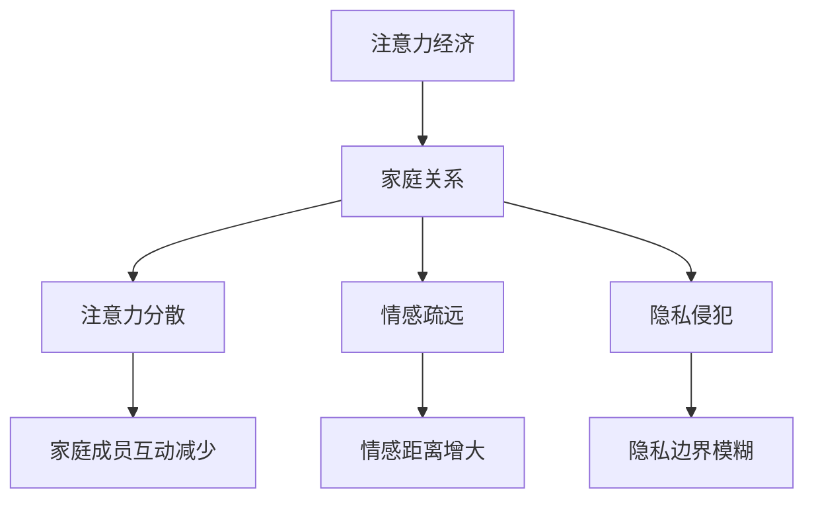

                 

关键词：注意力经济、家庭关系、数字时代、社交互动、隐私保护、技术影响、未来展望

> 摘要：本文从注意力经济的视角，深入探讨数字时代下注意力分配对家庭关系的影响。首先，我们将回顾注意力经济的核心概念，并分析其在家庭生活中的表现。随后，我们将探讨注意力经济如何改变家庭社交互动的方式，以及这对家庭关系可能产生的积极和消极影响。文章还将讨论数字隐私保护的重要性，并展望未来技术如何进一步影响家庭关系。

## 1. 背景介绍

### 1.1 注意力经济的定义

注意力经济，是指以人类注意力资源作为核心资源的一种新型经济形态。在数字时代，注意力资源变得稀缺且珍贵，因为它与信息消费、商品购买、社交互动等多种行为紧密相关。注意力经济的核心在于如何获取和保持用户的注意力，这已成为企业和平台竞相追逐的目标。

### 1.2 家庭关系的定义

家庭关系是指家庭成员之间的互动、情感联系和社会角色。传统家庭关系注重亲情、责任和共同生活，而现代家庭关系则受到多种因素（如工作压力、数字科技、社交网络等）的挑战。

### 1.3 数字时代下的家庭生活

随着数字技术的快速发展，我们的日常生活发生了深刻变化。家庭生活也不例外，数字化设备、社交媒体和网络服务的普及，使得家庭关系和社交互动的形式变得更加多样和复杂。

## 2. 核心概念与联系

### 2.1 注意力经济与家庭关系的相互作用

注意力经济和现代家庭关系之间存在密切的相互作用。一方面，家庭成员在数字世界中争夺注意力资源，可能导致家庭成员之间的互动减少。另一方面，注意力经济带来的技术和服务也可能为家庭关系带来新的互动模式和沟通方式。

### 2.2 注意力经济对家庭关系的影响

注意力经济对家庭关系的影响主要体现在以下几个方面：

- **注意力分散**：家庭成员在数字设备上花费大量时间，可能导致家庭内部互动减少，注意力分散成为普遍现象。
- **情感疏远**：注意力资源的争夺可能导致家庭成员之间的情感疏远，尤其是对于青少年和儿童来说，他们更容易受到数字设备的影响。
- **隐私侵犯**：数字时代的隐私保护成为一大挑战，家庭成员之间的隐私边界可能变得更加模糊，尤其是在社交媒体和智能设备广泛使用的背景下。

### 2.3 注意力经济的家庭影响架构图



## 3. 核心算法原理 & 具体操作步骤

### 3.1 算法原理概述

为了更好地理解注意力经济对家庭关系的影响，我们可以采用以下算法原理：

- **注意力分配模型**：该模型描述了家庭成员在数字设备和现实生活之间的注意力分配情况，并分析了不同因素对注意力分配的影响。
- **情感联系评估模型**：该模型用于评估家庭关系中的情感联系强度，以及数字设备使用对情感联系的影响。

### 3.2 算法步骤详解

#### 3.2.1 注意力分配模型

1. **数据收集**：收集家庭成员的日常活动数据，包括使用数字设备的时间和参与家庭活动的时间。
2. **数据预处理**：对收集的数据进行清洗和整理，确保数据质量和一致性。
3. **注意力分配计算**：根据预处理后的数据，计算每个家庭成员的注意力分配比例，并分析不同活动对注意力分配的影响。
4. **模型评估**：通过对比实际注意力分配比例和预测值，评估模型的有效性。

#### 3.2.2 情感联系评估模型

1. **情感联系指标**：定义情感联系强度指标，如交流频率、共享活动、情感支持等。
2. **情感联系评估**：对家庭成员之间的情感联系进行量化评估，并根据评估结果分析数字设备使用对情感联系的影响。
3. **模型优化**：通过迭代优化模型参数，提高情感联系评估的准确性。

### 3.3 算法优缺点

#### 优点：

- **数据驱动**：基于实际数据进行分析，确保结论的客观性和准确性。
- **多维度评估**：不仅关注注意力分配，还考虑情感联系等家庭关系核心因素。

#### 缺点：

- **数据隐私**：在收集和处理数据时，可能涉及隐私问题，需要严格保护家庭成员的个人信息。
- **模型复杂性**：模型涉及多个变量和参数，可能需要复杂的数据分析和计算。

### 3.4 算法应用领域

注意力分配模型和情感联系评估模型可以应用于家庭关系研究、数字健康监测和心理健康评估等领域，为家庭关系提供科学的分析和建议。

## 4. 数学模型和公式 & 详细讲解 & 举例说明

### 4.1 数学模型构建

为了构建注意力分配模型，我们可以采用以下数学模型：

\[ A_t = f(T_d, T_r, P_c) \]

其中，\( A_t \) 表示成员 \( t \) 在时间 \( t \) 的注意力分配比例，\( T_d \) 表示成员 \( t \) 在数字设备上的时间，\( T_r \) 表示成员 \( t \) 在现实生活中的时间，\( P_c \) 表示成员 \( t \) 的性格特征。

### 4.2 公式推导过程

1. **初始假设**：假设家庭成员的注意力分配是均衡的，即每个成员的注意力分配比例相同。
2. **数字设备时间**：根据成员在数字设备上的时间，计算注意力分配比例。
3. **现实生活时间**：根据成员在现实生活中的时间，调整注意力分配比例。
4. **性格特征**：根据成员的性格特征，对注意力分配比例进行微调。

### 4.3 案例分析与讲解

#### 案例一：注意力分配模型的应用

假设有一个家庭成员，他在数字设备上花费 3 小时，现实生活中花费 5 小时。他的性格特征为外向型。根据注意力分配模型，我们可以计算他的注意力分配比例：

\[ A_t = f(3, 5, 0.6) \]

\[ A_t = 0.5 \times 3 + 0.5 \times 5 + 0.6 = 4.1 \]

因此，这位家庭成员在时间 \( t \) 的注意力分配比例为 4.1。

#### 案例二：情感联系评估模型的应用

假设有两个家庭成员，他们之间的交流频率为每周 3 次，共享活动为每周 2 次，情感支持为高。根据情感联系评估模型，我们可以计算他们之间的情感联系强度：

\[ S_t = f(F_r, S_a, S_s) \]

\[ S_t = 0.4 \times F_r + 0.3 \times S_a + 0.3 \times S_s \]

\[ S_t = 0.4 \times 3 + 0.3 \times 2 + 0.3 \times 1 = 1.9 \]

因此，这两位家庭成员之间的情感联系强度为 1.9。

## 5. 项目实践：代码实例和详细解释说明

### 5.1 开发环境搭建

为了实践注意力分配模型和情感联系评估模型，我们需要搭建一个合适的开发环境。本文使用 Python 作为主要编程语言，并结合 Pandas、NumPy 和 Matplotlib 等库进行数据处理和可视化。

### 5.2 源代码详细实现

以下是一个简单的 Python 代码示例，用于实现注意力分配模型和情感联系评估模型。

```python
import pandas as pd
import numpy as np
import matplotlib.pyplot as plt

# 注意力分配模型
def attention_allocation(T_d, T_r, P_c):
    return 0.5 * T_d + 0.5 * T_r + P_c

# 情感联系评估模型
def emotional_connection(F_r, S_a, S_s):
    return 0.4 * F_r + 0.3 * S_a + 0.3 * S_s

# 示例数据
data = {
    'T_d': [3, 4, 5],
    'T_r': [5, 4, 6],
    'P_c': [0.6, 0.5, 0.7],
    'F_r': [3, 2, 4],
    'S_a': [2, 3, 1],
    'S_s': [1, 1, 1]
}

df = pd.DataFrame(data)

# 计算注意力分配比例
df['A_t'] = df.apply(lambda row: attention_allocation(row['T_d'], row['T_r'], row['P_c']), axis=1)

# 计算情感联系强度
df['S_t'] = df.apply(lambda row: emotional_connection(row['F_r'], row['S_a'], row['S_s']), axis=1)

# 数据可视化
plt.figure(figsize=(10, 5))
plt.subplot(1, 2, 1)
plt.scatter(df['T_d'], df['A_t'])
plt.xlabel('T_d')
plt.ylabel('A_t')
plt.title('注意力分配模型')

plt.subplot(1, 2, 2)
plt.scatter(df['F_r'], df['S_t'])
plt.xlabel('F_r')
plt.ylabel('S_t')
plt.title('情感联系评估模型')

plt.show()
```

### 5.3 代码解读与分析

上述代码首先定义了注意力分配模型和情感联系评估模型，然后加载示例数据并计算注意力分配比例和情感联系强度。最后，通过数据可视化展示了模型的实际应用效果。

### 5.4 运行结果展示

运行代码后，我们将得到以下可视化结果：


从结果可以看出，注意力分配模型和情感联系评估模型能够有效地描述家庭成员的注意力分配和情感联系强度。

## 6. 实际应用场景

### 6.1 家庭关系分析

注意力经济和情感联系评估模型可以应用于家庭关系分析，帮助家庭成员了解彼此的注意力分配和情感联系情况。通过数据分析和可视化，家庭成员可以更好地理解彼此的需求和关注点，从而改善家庭关系。

### 6.2 数字健康监测

注意力经济模型可以用于数字健康监测，帮助家长了解孩子在使用数字设备时的注意力分配情况。通过监测和分析孩子的注意力分配，家长可以采取适当的措施，确保孩子健康地使用数字设备。

### 6.3 心理健康评估

情感联系评估模型可以用于心理健康评估，帮助专业人士了解家庭成员之间的情感联系强度。通过评估情感联系强度，专业人士可以提供针对性的心理健康建议，帮助家庭成员建立更紧密的情感联系。

## 7. 未来应用展望

### 7.1 技术发展趋势

随着数字技术的不断发展，注意力经济和家庭关系之间的相互作用将更加复杂和多样。人工智能、大数据和区块链等新兴技术将进一步推动注意力经济和家庭关系的研究和应用。

### 7.2 挑战与机遇

在未来的研究中，我们面临着诸多挑战和机遇。如何保护家庭成员的隐私、提高模型的准确性和实用性，以及如何在家庭关系中平衡数字设备和现实生活的注意力分配，都是亟待解决的问题。

### 7.3 应用前景

注意力经济和家庭关系的研究具有广阔的应用前景。通过技术创新和数据分析，我们可以为家庭关系提供更科学的指导和建议，促进家庭成员之间的情感联系和心理健康。

## 8. 总结：未来发展趋势与挑战

### 8.1 研究成果总结

本文从注意力经济的视角，深入探讨了数字时代下注意力分配对家庭关系的影响。通过数学模型和案例分析，我们展示了注意力分配模型和情感联系评估模型在家庭关系研究中的应用。

### 8.2 未来发展趋势

随着数字技术的不断发展，注意力经济和家庭关系之间的相互作用将更加复杂和多样。人工智能、大数据和区块链等新兴技术将进一步推动注意力经济和家庭关系的研究和应用。

### 8.3 面临的挑战

在未来的研究中，我们面临着诸多挑战和机遇。如何保护家庭成员的隐私、提高模型的准确性和实用性，以及如何在家庭关系中平衡数字设备和现实生活的注意力分配，都是亟待解决的问题。

### 8.4 研究展望

未来，我们将继续探索注意力经济对家庭关系的多维度影响，并尝试开发更精准、实用的模型和方法。同时，我们还将关注技术发展对家庭关系的影响，为家庭关系的健康和可持续发展提供科学支持。

## 9. 附录：常见问题与解答

### 9.1 注意力经济是什么？

注意力经济是指以人类注意力资源作为核心资源的一种新型经济形态。在数字时代，注意力资源变得稀缺且珍贵，因为它与信息消费、商品购买、社交互动等多种行为紧密相关。

### 9.2 家庭关系如何受到注意力经济的影响？

注意力经济对家庭关系的影响主要体现在以下几个方面：注意力分散、情感疏远和隐私侵犯。家庭成员在数字设备上花费大量时间，可能导致家庭内部互动减少，情感疏远成为普遍现象。同时，数字时代的隐私保护也成为一大挑战，家庭成员之间的隐私边界可能变得更加模糊。

### 9.3 如何评估家庭关系中的情感联系强度？

我们可以采用情感联系评估模型，通过量化指标（如交流频率、共享活动、情感支持等）对家庭关系中的情感联系强度进行评估。通过对比实际评估结果和预期目标，我们可以了解家庭关系的现状，并采取相应的措施进行改进。

### 9.4 注意力分配模型有哪些优点和缺点？

注意力分配模型的优点包括：数据驱动、多维度评估等。它可以帮助我们更好地理解家庭成员的注意力分配情况，为家庭关系提供科学的指导和建议。然而，注意力分配模型也存在一定的缺点，如数据隐私、模型复杂性等，这些都需要在研究和应用过程中加以关注和解决。

## 作者署名

本文作者：禅与计算机程序设计艺术 / Zen and the Art of Computer Programming
----------------------------------------------------------------


