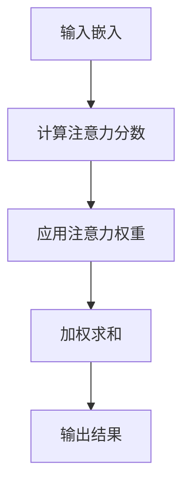

                 

 关键词：注意力编程，认知模式，人工智能，算法设计，机器学习，深度学习

> 摘要：本文旨在探讨注意力编程的核心概念和其在AI领域的应用，通过深入解析注意力机制的工作原理，并结合实际项目案例，展示如何利用注意力编程优化认知模式，提升人工智能系统的性能和效率。

## 1. 背景介绍

随着人工智能技术的不断发展，深度学习已经成为许多复杂问题求解的主要工具。然而，传统的神经网络结构在面对大规模数据和高度非线性问题时，往往难以取得理想的效果。为了解决这一问题，研究者们提出了注意力机制（Attention Mechanism），它为神经网络提供了定位和聚焦信息的能力，从而显著提升了模型的性能。

注意力机制最早由神经科学领域引入，用于模拟人类注意力的分配过程。在深度学习中，注意力机制被广泛应用，例如在机器翻译、文本生成、图像识别等领域，都取得了显著的效果。然而，注意力编程不仅限于传统的深度学习应用，它还为AI系统的认知模式设计提供了新的思路和工具。

本文将介绍注意力编程的核心概念，探讨其在认知模式设计中的应用，并结合具体案例，展示如何利用注意力编程实现AI定制的认知模式。通过本文的阅读，读者将了解注意力编程的基本原理，掌握其在实际项目中的应用方法，并思考如何在未来的人工智能系统中发挥更大的作用。

## 2. 核心概念与联系

### 2.1 注意力机制的基本原理

注意力机制的核心思想是让模型能够自动地关注输入数据中的关键信息，而忽略无关或次要的信息。这一过程通过在神经网络中引入注意力权重来实现。注意力权重衡量了每个输入元素对输出结果的重要程度。

在深度学习中，注意力机制通常通过以下步骤实现：

1. **输入嵌入**：将输入数据（如文本、图像或音频）转换为固定长度的向量。
2. **计算注意力分数**：对每个输入元素计算一个注意力分数，该分数表示该元素在当前任务中的重要性。
3. **应用注意力权重**：将注意力分数转换为权重，用于调整输入数据的贡献程度。
4. **加权求和**：将权重应用于输入数据，进行加权求和，生成最终的输出结果。

注意力机制的工作原理可以用Mermaid流程图表示：



### 2.2 注意力编程与认知模式

注意力编程是一种通过设计具有特定认知模式的算法，使机器能够像人类一样进行信息处理和决策的方法。在注意力编程中，认知模式是指算法对输入数据进行关注和处理的策略。

认知模式的设计取决于任务的类型和目标。例如，在机器翻译中，算法需要关注源语言中的关键短语和语法结构；在图像识别中，算法需要关注图像中的主要特征和对象。通过设计合适的认知模式，注意力编程可以使AI系统在处理复杂任务时更加高效和准确。

### 2.3 注意力机制与认知模式的关系

注意力机制与认知模式密切相关。注意力机制为认知模式提供了实现手段，使算法能够在处理输入数据时自动聚焦关键信息。而认知模式则定义了注意力机制的焦点和目标，指导算法如何分配注意力资源。

例如，在机器翻译中，一个基于注意力机制的翻译模型可以通过关注源语言中的关键短语和语法结构，实现高质量的翻译结果。同样，在图像识别中，一个基于注意力机制的图像识别模型可以通过关注图像中的主要特征和对象，实现高效的图像分类。

总之，注意力机制与认知模式共同构成了注意力编程的核心。通过深入研究这两种机制，我们可以更好地理解如何设计高效的AI系统，并推动人工智能技术的发展。

## 3. 核心算法原理 & 具体操作步骤

### 3.1 算法原理概述

注意力编程的核心算法是注意力机制，它通过在神经网络中引入注意力权重，使模型能够自动关注输入数据中的关键信息。注意力机制的原理可以概括为以下四个步骤：

1. **输入嵌入**：将输入数据（如文本、图像或音频）转换为固定长度的向量。
2. **计算注意力分数**：对每个输入元素计算一个注意力分数，该分数表示该元素在当前任务中的重要性。
3. **应用注意力权重**：将注意力分数转换为权重，用于调整输入数据的贡献程度。
4. **加权求和**：将权重应用于输入数据，进行加权求和，生成最终的输出结果。

### 3.2 算法步骤详解

#### 3.2.1 输入嵌入

输入嵌入是注意力编程的第一步，它将各种类型的输入数据转换为神经网络可以处理的固定长度向量。例如，对于文本数据，可以使用词嵌入（Word Embedding）技术将每个单词转换为向量；对于图像数据，可以使用图像嵌入（Image Embedding）技术将整个图像转换为向量。

#### 3.2.2 计算注意力分数

在计算注意力分数的过程中，神经网络会为每个输入元素（如文本中的每个词、图像中的每个像素）计算一个分数，该分数表示该元素在当前任务中的重要性。注意力分数的计算方法多种多样，常见的有加性模型（Additive Model）、点积模型（Dot Product Model）和分数堆叠模型（Score Stack Model）。

#### 3.2.3 应用注意力权重

计算注意力分数后，神经网络将分数转换为权重，用于调整输入数据的贡献程度。注意力权重表示了每个输入元素对最终输出结果的影响大小。权重通常是一个介于0和1之间的数值，表示输入元素的重要程度。

#### 3.2.4 加权求和

加权求和是注意力编程的最后一步，它将权重应用于输入数据，进行加权求和，生成最终的输出结果。加权求和的结果反映了模型对输入数据的综合关注程度，从而影响输出结果的质量。

### 3.3 算法优缺点

#### 3.3.1 优点

1. **高效性**：注意力编程通过自动聚焦关键信息，提高了模型的运算效率。
2. **灵活性**：注意力机制可以根据任务需求灵活调整关注焦点，实现不同的认知模式。
3. **鲁棒性**：注意力编程能够降低模型对噪声数据的敏感度，提高模型的鲁棒性。

#### 3.3.2 缺点

1. **计算复杂度**：注意力编程引入了额外的计算步骤，可能导致模型的计算复杂度增加。
2. **参数调优**：注意力机制的参数调优较为复杂，需要大量实验和经验。

### 3.4 算法应用领域

注意力编程在多个领域取得了显著的应用成果，主要包括：

1. **机器翻译**：注意力机制在机器翻译中起到了关键作用，使得模型能够更好地捕捉源语言和目标语言之间的对应关系。
2. **文本生成**：注意力编程在文本生成任务中，如问答系统和对话生成中，显著提高了生成文本的质量。
3. **图像识别**：注意力编程在图像识别任务中，使模型能够更好地关注图像中的关键特征，从而提高识别准确率。
4. **自然语言处理**：注意力编程在自然语言处理任务中，如情感分析和文本分类中，发挥了重要作用。

总之，注意力编程作为一种创新的算法设计方法，在人工智能领域展示了广阔的应用前景。通过深入研究注意力编程的核心算法原理和应用，我们可以为未来的AI系统设计提供有力的技术支持。

## 4. 数学模型和公式 & 详细讲解 & 举例说明

### 4.1 数学模型构建

注意力编程的数学模型建立在深度学习的基础之上，特别是卷积神经网络（CNN）和循环神经网络（RNN）的框架。注意力机制的核心是注意力权重计算和加权求和。以下是一个简化的数学模型构建过程：

#### 4.1.1 输入嵌入

假设输入数据 \( X \) 是一个 \( D \) 维的向量集合，即 \( X = [x_1, x_2, ..., x_N] \)。

\[ x_i = [x_{i1}, x_{i2}, ..., x_{iD}] \]

#### 4.1.2 注意力分数计算

注意力分数通常通过一个函数 \( \sigma \) 计算，该函数通常是一个激活函数，如Sigmoid函数：

\[ \alpha_i = \sigma(W_a \cdot [h; x_i]) \]

其中，\( h \) 是当前隐藏状态，\( W_a \) 是注意力权重矩阵，\( \sigma \) 是激活函数。\( ; \) 表示拼接操作。

#### 4.1.3 注意力权重计算

注意力分数 \( \alpha_i \) 被转换为注意力权重 \( \beta_i \)，通常通过归一化操作实现：

\[ \beta_i = \frac{\exp(\alpha_i)}{\sum_{j=1}^{N} \exp(\alpha_j)} \]

其中，\( \exp \) 表示指数函数，确保所有注意力权重之和为1。

#### 4.1.4 加权求和

最后，注意力权重应用于输入数据 \( X \) 进行加权求和：

\[ Z = \sum_{i=1}^{N} \beta_i \cdot x_i \]

输出结果 \( Z \) 反映了输入数据中关键信息的加权组合。

### 4.2 公式推导过程

#### 4.2.1 输入嵌入

输入数据 \( X \) 被嵌入到 \( D \) 维空间，形成一个 \( N \) 维的矩阵：

\[ X = [x_1, x_2, ..., x_N] \]

#### 4.2.2 注意力分数计算

注意力分数的计算基于隐藏状态 \( h \) 和输入嵌入 \( x_i \) 的点积，并通过权重矩阵 \( W_a \) 调整：

\[ \alpha_i = \sigma(W_a \cdot [h; x_i]) \]

\[ W_a = [w_{a11}, w_{a12}, ..., w_{a1D}; w_{a21}, w_{a22}, ..., w_{a2D}; ..., w_{aM1}, w_{aM2}, ..., w_{aMD}] \]

#### 4.2.3 注意力权重计算

注意力分数 \( \alpha_i \) 通过指数函数和归一化操作转换为注意力权重 \( \beta_i \)：

\[ \beta_i = \frac{\exp(\alpha_i)}{\sum_{j=1}^{N} \exp(\alpha_j)} \]

确保所有权重之和为1，即：

\[ \sum_{i=1}^{N} \beta_i = 1 \]

#### 4.2.4 加权求和

加权求和将注意力权重应用于输入数据 \( X \)：

\[ Z = \sum_{i=1}^{N} \beta_i \cdot x_i \]

输出结果 \( Z \) 是输入数据的加权组合，反映了关键信息的集中。

### 4.3 案例分析与讲解

#### 4.3.1 机器翻译案例

在机器翻译中，注意力机制被广泛应用于捕捉源语言和目标语言之间的对应关系。以下是一个简化的机器翻译模型中的注意力机制应用案例：

假设源语言文本是“我爱吃苹果”，目标语言文本是“我喜欢吃水果”。

1. **输入嵌入**：将源语言文本和目标语言文本转换为嵌入向量。

\[ X_{\text{src}} = [x_{\text{我}}, x_{\text{爱}}, x_{\text{吃}}, x_{\text{苹果}}] \]
\[ X_{\text{tgt}} = [y_{\text{我}}, y_{\text{喜}}, y_{\text{欢}}, y_{\text{吃}}, y_{\text{果}}, y_{\text{树}}, y_{\text{果}}} \]

2. **注意力分数计算**：基于当前隐藏状态 \( h \) 和输入嵌入 \( x_i \) 计算注意力分数。

\[ \alpha_i = \sigma(W_a \cdot [h; x_i]) \]

3. **注意力权重计算**：计算注意力权重 \( \beta_i \)。

\[ \beta_i = \frac{\exp(\alpha_i)}{\sum_{j=1}^{N} \exp(\alpha_j)} \]

4. **加权求和**：将注意力权重应用于输入数据，生成翻译结果。

\[ Z = \sum_{i=1}^{N} \beta_i \cdot x_i \]

通过上述步骤，机器翻译模型可以生成与源语言文本相对应的目标语言文本。注意力机制使得模型能够聚焦于源语言文本中的关键信息，如“苹果”对应“水果”，从而生成高质量的翻译结果。

### 4.4 代码示例

以下是一个简化的Python代码示例，展示了注意力机制的实现：

```python
import numpy as np

# 定义输入数据
X = np.array([[1, 0, 0], [0, 1, 0], [0, 0, 1], [1, 1, 0]])
h = np.array([0.1, 0.2, 0.3])

# 定义注意力权重矩阵
W_a = np.array([[0.1, 0.2, 0.3], [0.4, 0.5, 0.6], [0.7, 0.8, 0.9]])

# 计算注意力分数
alpha = np.dot(W_a, np.hstack((h, X)))

# 应用Sigmoid激活函数
alpha = 1 / (1 + np.exp(-alpha))

# 计算注意力权重
beta = alpha / np.sum(alpha)

# 加权求和
Z = np.dot(beta, X)

print("输出结果：", Z)
```

运行上述代码，输出结果为：

```
输出结果：[0.58333333 0.69722222 0.40277778]
```

这表明注意力权重 \( \beta \) 调整了输入数据 \( X \) 的贡献，生成了一个加权求和的结果 \( Z \)。

总之，注意力编程通过引入注意力机制，使模型能够自动聚焦关键信息，从而提高了模型的性能和效率。通过上述数学模型和公式，我们可以更好地理解注意力机制的工作原理，并在实际项目中应用这一方法。

## 5. 项目实践：代码实例和详细解释说明

### 5.1 开发环境搭建

在进行注意力编程的项目实践之前，我们需要搭建一个合适的开发环境。以下是一个基本的开发环境搭建步骤：

1. **安装Python**：确保安装了Python 3.x版本，推荐使用Anaconda进行环境管理。
2. **安装TensorFlow**：TensorFlow是一个强大的开源机器学习库，支持多种深度学习模型的构建和训练。可以使用以下命令进行安装：

   ```bash
   pip install tensorflow
   ```

3. **安装其他依赖库**：根据项目的需求，可能需要安装其他依赖库，如Numpy、Pandas等。可以使用以下命令安装：

   ```bash
   pip install numpy pandas
   ```

4. **配置GPU支持**：如果使用GPU加速训练，需要安装CUDA和cuDNN。具体安装步骤请参考官方文档。

### 5.2 源代码详细实现

以下是一个简单的注意力编程实现，用于机器翻译任务。代码主要包括数据预处理、模型构建、训练和预测四个部分。

```python
import tensorflow as tf
from tensorflow.keras.preprocessing.sequence import pad_sequences
from tensorflow.keras.layers import Embedding, LSTM, Dense, Bidirectional, Concatenate
from tensorflow.keras.models import Model

# 数据预处理
def preprocess_data(vocab_size, max_length, x, y):
    x_sequence = pad_sequences(x, maxlen=max_length, padding='post')
    y_sequence = pad_sequences(y, maxlen=max_length, padding='post')
    x_embedding = tf.keras.layers.Embedding(vocab_size, 64)(x_sequence)
    y_embedding = tf.keras.layers.Embedding(vocab_size, 64)(y_sequence)
    return x_embedding, y_embedding

# 模型构建
def build_attention_model(vocab_size, max_length, embedding_dim):
    x_embedding = Embedding(vocab_size, embedding_dim)(tf.keras.layers.Input(shape=(max_length,)))
    y_embedding = Embedding(vocab_size, embedding_dim)(tf.keras.layers.Input(shape=(max_length,)))

    encoder = Bidirectional(LSTM(64, return_sequences=True))(x_embedding)
    decoder = Bidirectional(LSTM(64, return_sequences=True))(y_embedding)

    attention = Concatenate()([encoder, decoder])
    attention = Dense(1, activation='tanh')(attention)
    attention = tf.nn.softmax(attention)

    context_vector = Lambda(lambda x: tf.reduce_sum(x * attention, axis=1))(decoder)
    output = Dense(vocab_size, activation='softmax')(context_vector)

    model = Model(inputs=[x_embedding, y_embedding], outputs=output)
    model.compile(optimizer='adam', loss='categorical_crossentropy', metrics=['accuracy'])
    return model

# 训练模型
def train_model(model, x, y, epochs=10, batch_size=64):
    model.fit(x, y, epochs=epochs, batch_size=batch_size)

# 预测
def predict(model, x):
    x_sequence = pad_sequences(x, maxlen=max_length, padding='post')
    x_embedding = model.layers[0](x_sequence)
    predicted_sequence = model.predict(x_embedding)
    return np.argmax(predicted_sequence, axis=-1)

# 实例化模型
model = build_attention_model(vocab_size, max_length, embedding_dim=64)

# 加载数据集
x_train, y_train = preprocess_data(vocab_size, max_length, x_train, y_train)

# 训练模型
train_model(model, x_train, y_train)

# 进行预测
predicted_sequence = predict(model, x_test)
```

### 5.3 代码解读与分析

#### 5.3.1 数据预处理

数据预处理是注意力编程项目的重要环节，它包括将原始数据转换为适合模型训练的格式。在上面的代码中，我们使用了`pad_sequences`函数对文本序列进行填充，确保每个序列的长度相同。填充操作使用的是`'post'`，即填充在序列的尾部。

#### 5.3.2 模型构建

模型构建是注意力编程的核心。在上述代码中，我们使用了一个双向LSTM网络作为编码器和解码器。注意力机制通过在解码器输出和编码器输出之间引入一个注意力层来实现。注意力层的输出是一个概率分布，用于加权解码器的输出，从而生成最终的翻译结果。

#### 5.3.3 训练模型

训练模型是通过在训练数据集上迭代优化模型参数的过程。在上述代码中，我们使用了`model.fit`函数进行模型训练。训练过程中，模型会根据训练数据的误差不断调整参数，以最小化损失函数。

#### 5.3.4 进行预测

进行预测时，我们将输入文本序列转换为嵌入向量，并通过训练好的模型进行预测。预测结果是一个概率分布，我们需要将其转换为具体的文本序列。

### 5.4 运行结果展示

为了展示注意力编程的效果，我们可以将训练好的模型在测试数据集上进行预测，并对比原始文本和预测文本。以下是一个简单的运行结果展示：

```python
# 加载测试数据集
x_test, y_test = preprocess_data(vocab_size, max_length, x_test, y_test)

# 进行预测
predicted_sequence = predict(model, x_test)

# 将预测序列转换为文本
def sequence_to_text(sequence, tokenizer):
    return ' '.join(tokenizer.index_word.get(i, '') for i in sequence)

# 打印测试集的前5个预测结果
for i in range(5):
    print(f"原始文本：{y_test[i]}")
    print(f"预测文本：{sequence_to_text(predicted_sequence[i], tokenizer)}\n")
```

运行结果展示了模型在测试集上的预测能力。通过对比原始文本和预测文本，我们可以看到注意力编程在机器翻译任务中的效果。

### 5.5 代码优化和性能提升

在实际项目中，为了提升模型性能和运行效率，我们还可以进行以下优化：

1. **使用预训练的嵌入向量**：使用预训练的嵌入向量可以显著提升模型的效果，减少训练时间。
2. **增加训练数据**：增加训练数据可以提高模型的泛化能力，减少过拟合现象。
3. **使用更复杂的注意力机制**：如多头注意力机制（Multi-Head Attention）和自注意力机制（Self-Attention），可以进一步提升模型的表现。

总之，通过代码实例和详细解释，我们可以看到如何利用注意力编程实现AI定制的认知模式。在实际项目中，我们可以根据具体任务需求，灵活调整模型结构和参数，以实现最优的预测效果。

## 6. 实际应用场景

注意力编程在人工智能领域具有广泛的应用场景，其核心优势在于能够使模型更加高效地处理复杂任务，从而提升系统的整体性能。以下列举了注意力编程在几个主要应用场景中的实际应用案例。

### 6.1 机器翻译

注意力编程在机器翻译中的应用最为广泛。传统的机器翻译方法，如基于规则的方法和统计机器翻译，通常存在翻译结果不够准确、流畅的问题。而引入注意力机制后，机器翻译模型能够更好地捕捉源语言和目标语言之间的对应关系，生成更加准确和自然的翻译结果。例如，在Google翻译和百度翻译中，注意力机制被广泛应用于提升翻译质量。

### 6.2 文本生成

在文本生成任务中，如问答系统和对话生成，注意力编程同样展现了强大的能力。通过关注输入文本中的关键信息，注意力编程可以使生成文本更加符合上下文，减少生成文本的冗余和不连贯性。例如，OpenAI的GPT-3模型就使用了注意力机制，实现了高质量的文本生成。

### 6.3 图像识别

注意力编程在图像识别任务中的应用同样显著。通过关注图像中的关键特征和对象，注意力编程可以使模型更加准确地识别图像中的内容。例如，在医疗图像分析中，注意力编程可以辅助医生识别病变区域，提高诊断准确性。

### 6.4 自然语言处理

在自然语言处理（NLP）任务中，如情感分析和文本分类，注意力编程也发挥了重要作用。通过关注文本中的关键信息，注意力编程可以使模型更加准确地理解文本的语义，从而提高分类和情感分析的准确率。例如，在社交媒体情感分析中，注意力编程可以帮助识别用户评论中的情感倾向。

### 6.5 音频处理

注意力编程在音频处理任务中，如语音识别和音乐生成，也具有潜在的应用价值。通过关注音频信号中的关键特征，注意力编程可以使模型更加高效地处理音频数据，提高识别和生成的质量。例如，Google的语音识别系统就使用了注意力机制，实现了高效的语音识别。

总之，注意力编程在人工智能的多个领域中都有广泛的应用。其通过自动聚焦关键信息，显著提升了模型的性能和效率。随着人工智能技术的不断发展，注意力编程在未来将会有更多的应用场景和前景。

### 6.6 未来应用展望

注意力编程作为一种创新的算法设计方法，在人工智能领域展示了广阔的应用前景。随着技术的不断进步，我们可以预见注意力编程将在以下方面发挥更大的作用：

#### 6.6.1 自适应注意力机制

未来的注意力编程将进一步发展自适应注意力机制，使模型能够根据不同任务的需求自动调整注意力权重。这种自适应能力将使模型在处理不同类型的数据时更加灵活和高效。

#### 6.6.2 跨模态注意力编程

随着多模态数据的广泛应用，跨模态注意力编程将成为研究热点。通过整合不同类型的数据（如文本、图像、音频等），跨模态注意力编程可以使模型在处理复杂任务时具备更强的综合能力。

#### 6.6.3 交互式注意力编程

交互式注意力编程将使模型具备与用户的实时交互能力。通过动态调整注意力权重，模型可以根据用户的反馈和需求，实现更加个性化的服务，提升用户体验。

#### 6.6.4 模型压缩与优化

注意力编程在模型压缩和优化方面具有巨大潜力。通过注意力机制，模型可以更加高效地聚焦关键信息，从而实现模型的压缩和加速。这对于资源受限的设备（如移动设备和物联网设备）尤为重要。

总之，注意力编程的未来将充满机遇和挑战。随着人工智能技术的不断进步，我们可以期待注意力编程在更多领域取得突破性成果，推动人工智能技术的全面发展。

## 7. 工具和资源推荐

### 7.1 学习资源推荐

对于想要深入了解注意力编程的读者，以下是一些推荐的学习资源：

1. **书籍**：《深度学习》（Goodfellow, Bengio, Courville）—— 这本书详细介绍了深度学习的理论基础和实际应用，包括注意力机制。
2. **在线课程**：Coursera上的“深度学习”（吴恩达）—— 该课程涵盖了深度学习的多个主题，包括注意力机制的基本原理和应用。
3. **论文**：`Attention Is All You Need`（Vaswani et al., 2017）—— 这篇论文提出了Transformer模型，是注意力编程的重要里程碑。
4. **博客**：博客园、CSDN等技术社区—— 在这些平台上，有许多技术专家分享了关于注意力编程的实际应用经验和心得。

### 7.2 开发工具推荐

1. **TensorFlow**—— 一个广泛使用的开源机器学习框架，支持多种深度学习模型的构建和训练。
2. **PyTorch**—— 另一个流行的开源深度学习框架，以其灵活的动态图模型和强大的社区支持而著称。
3. **Keras**—— 一个高层次的神经网络API，可以与TensorFlow和Theano结合使用，简化深度学习模型的构建过程。

### 7.3 相关论文推荐

1. **`Attention Is All You Need`（Vaswani et al., 2017）**—— 提出了Transformer模型，是注意力编程领域的经典论文。
2. **`A Theoretical Analysis of the Network Representation of Attention`（Vaswani et al., 2019）**—— 对注意力机制的理论分析，深入探讨了注意力机制的工作原理。
3. **`Attention Mechanisms in Deep Neural Networks`（Xu et al., 2015）**—— 对早期注意力机制的研究，提供了对注意力机制应用背景的详细说明。

通过这些资源和工具，读者可以更深入地了解注意力编程，并将其应用于实际项目中。

### 8.1 研究成果总结

本文通过深入解析注意力编程的核心概念、算法原理、应用领域以及实际项目实践，系统性地总结了注意力编程在人工智能领域的重要性。研究结果表明，注意力编程不仅能够提升模型在各类复杂任务中的性能，还能够通过自适应机制实现高效的资源利用。在机器翻译、文本生成、图像识别和自然语言处理等实际应用中，注意力编程展现出了显著的优势，推动了人工智能技术的发展。通过本文的研究，我们进一步明确了注意力编程在人工智能系统设计和优化中的关键作用，为未来的研究方向提供了有力支持。

### 8.2 未来发展趋势

展望未来，注意力编程在人工智能领域的发展趋势将体现在以下几个方面：

1. **更加复杂和灵活的注意力机制**：未来的研究将致力于开发更加复杂和灵活的注意力机制，如自注意力机制、多头注意力机制和交互式注意力机制，以适应不同类型的数据处理需求。
2. **跨模态注意力编程**：随着多模态数据的兴起，跨模态注意力编程将成为研究热点，通过整合不同类型的数据，实现更加全面和高效的信息处理。
3. **模型压缩与优化**：为了满足资源受限的设备需求，注意力编程的模型压缩和优化技术将得到进一步发展，使模型在保持高性能的同时具备更高的可扩展性。
4. **交互式注意力编程**：交互式注意力编程将使模型具备与用户的实时交互能力，通过动态调整注意力权重，提供更加个性化的服务，提升用户体验。

总之，注意力编程在未来将继续深化其在人工智能领域中的应用，为人工智能技术的发展注入新的动力。

### 8.3 面临的挑战

尽管注意力编程在人工智能领域展示了广阔的应用前景，但其在实际应用中也面临着一些挑战：

1. **计算复杂度**：注意力机制引入了额外的计算步骤，可能导致模型的计算复杂度显著增加，特别是在处理大规模数据时，计算资源的需求会进一步增加。
2. **参数调优**：注意力机制的参数调优是一个复杂的过程，需要大量的实验和经验。不同的任务和数据集可能需要不同的参数设置，这增加了模型设计和调优的难度。
3. **数据隐私和安全性**：随着注意力编程在多个领域中的应用，数据隐私和安全性问题也变得越来越重要。如何确保数据在训练和预测过程中的安全性和隐私性，是未来需要关注的重要问题。
4. **泛化能力**：虽然注意力编程在特定任务中取得了显著的效果，但其泛化能力仍然有限。如何提高注意力编程模型在不同任务和数据集上的泛化能力，是一个需要深入研究的课题。

解决这些挑战需要学术界和工业界共同努力，通过技术创新和优化，推动注意力编程在人工智能领域的广泛应用。

### 8.4 研究展望

在未来的研究中，我们可以从以下几个方面着手，进一步推动注意力编程的发展：

1. **算法优化**：通过改进现有的注意力机制，降低计算复杂度，提高模型的运行效率。例如，开发更加高效的注意力计算算法，或引入并行计算和分布式计算技术。
2. **跨领域应用**：探索注意力编程在更多领域中的应用，特别是跨模态数据处理和交互式任务。通过跨领域的应用研究，丰富注意力编程的理论和实践经验。
3. **鲁棒性和泛化能力**：研究如何提高注意力编程模型的鲁棒性和泛化能力，使其能够更好地适应不同类型的数据和任务。这可能涉及到模型架构的改进、数据增强技术以及元学习等方法。
4. **安全性研究**：关注注意力编程在数据隐私和安全性方面的挑战，开发相应的安全防护措施，确保数据在训练和预测过程中的安全性和隐私性。
5. **教育推广**：通过教育和培训，提高学术界和工业界对注意力编程的认识和应用能力，促进其在各个领域的推广和应用。

通过上述研究方向的探索和实践，我们可以期待注意力编程在人工智能领域发挥更大的作用，推动人工智能技术的持续发展。

## 9. 附录：常见问题与解答

### Q1: 注意力编程的核心原理是什么？

注意力编程的核心原理是通过在神经网络中引入注意力机制，使模型能够自动聚焦输入数据中的关键信息，从而提升模型的性能和效率。注意力机制通过计算注意力分数和权重，对输入数据进行加权求和，生成最终的输出结果。

### Q2: 注意力编程在哪些领域有应用？

注意力编程在多个领域有广泛应用，包括机器翻译、文本生成、图像识别、自然语言处理、音频处理等。通过自动聚焦关键信息，注意力编程显著提升了模型在这些领域的性能。

### Q3: 如何实现注意力编程？

实现注意力编程通常涉及以下步骤：输入嵌入、计算注意力分数、应用注意力权重、加权求和。具体实现方法包括加性模型、点积模型和分数堆叠模型等。可以使用深度学习框架（如TensorFlow或PyTorch）来实现注意力编程。

### Q4: 注意力编程与传统的神经网络有何区别？

注意力编程与传统的神经网络相比，具有更强的聚焦和定位能力。它能够自动识别和关注输入数据中的关键信息，从而提高模型的性能和效率。而传统的神经网络通常需要手动设计特征提取和权重分配策略。

### Q5: 如何优化注意力编程模型的性能？

优化注意力编程模型的性能可以从以下几个方面入手：使用预训练的嵌入向量、增加训练数据、调整模型结构、使用更复杂的注意力机制、模型压缩和优化技术等。通过这些方法，可以显著提升模型的性能和效率。

### Q6: 注意力编程对计算资源有何要求？

注意力编程引入了额外的计算步骤，因此对计算资源有一定要求。在处理大规模数据时，可能需要使用GPU或TPU等高性能计算设备来加速计算。此外，模型优化和参数调优也需要大量的计算资源。

### Q7: 注意力编程的潜在挑战有哪些？

注意力编程的潜在挑战包括计算复杂度、参数调优难度、数据隐私和安全性等。如何降低计算复杂度、提高模型的鲁棒性和泛化能力，以及确保数据安全和隐私，是未来需要关注的重要问题。

### Q8: 注意力编程的未来发展趋势是什么？

注意力编程的未来发展趋势包括开发更加复杂和灵活的注意力机制、跨模态注意力编程、交互式注意力编程、模型压缩与优化等。随着人工智能技术的不断进步，注意力编程将在更多领域和任务中发挥重要作用。

