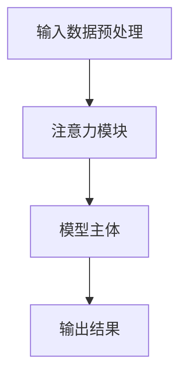

                 

关键词：注意力机制、AI编程、认知模式、设计原则、算法原理、数学模型、项目实践、应用场景、发展趋势、挑战与展望

> 摘要：本文深入探讨了注意力编程的原理、设计模式及其在AI领域的应用。通过结合具体实例，详细介绍了注意力算法的数学模型、实现步骤和项目实践，分析了注意力编程在各类应用场景中的优势与未来发展趋势，以及面临的挑战和解决方案。

## 1. 背景介绍

### 注意力机制的基本概念

注意力机制（Attention Mechanism）是近年来在人工智能领域取得突破性进展的关键技术之一。它起源于自然语言处理（NLP）领域，通过模拟人类大脑的注意力机制，提高了计算机在处理大量信息时的效率和准确性。注意力机制的核心思想是让模型能够动态地关注输入数据中与任务最为相关的部分，从而提高模型的性能和泛化能力。

### 注意力编程的定义

注意力编程是一种基于注意力机制的编程范式，旨在利用注意力机制提高计算机程序的性能和可读性。在注意力编程中，程序员通过设计和实现注意力模块，使程序能够自适应地调整对输入数据的关注程度，从而提高算法的效率和鲁棒性。

### 注意力编程的重要性

注意力编程在AI领域具有重要的应用价值。首先，它能够显著提高深度学习模型的性能，尤其是在处理长序列数据和复杂任务时。其次，注意力编程能够提高程序的模块化和可重用性，使得程序更加易于维护和扩展。最后，注意力编程有助于我们更深入地理解人工智能的原理，推动人工智能技术的发展。

## 2. 核心概念与联系

### 注意力机制原理

注意力机制的基本原理是让模型能够根据任务的动态需求，自动地调整对输入数据的关注程度。具体来说，注意力机制通过计算输入数据与任务目标之间的相关性，动态地生成一个权重向量，将权重较高的部分赋予更高的关注程度。这样，模型就能够关注到与任务最为相关的部分，从而提高性能。

### 注意力编程架构

注意力编程的架构包括以下几个核心组成部分：

1. **输入数据预处理**：对输入数据进行预处理，包括特征提取、数据标准化等操作。
2. **注意力模块**：设计和实现注意力模块，用于动态地调整对输入数据的关注程度。
3. **模型主体**：基于注意力模块构建深度学习模型，用于完成特定任务。
4. **输出结果**：根据模型的预测结果，生成相应的输出结果。

### Mermaid 流程图



## 3. 核心算法原理 & 具体操作步骤

### 3.1 算法原理概述

注意力算法的基本原理是计算输入数据与任务目标之间的相关性，并利用这些相关性生成一个权重向量。这个权重向量用于调整对输入数据的关注程度，使得模型能够关注到与任务最为相关的部分。

### 3.2 算法步骤详解

1. **输入数据预处理**：对输入数据进行预处理，包括特征提取、数据标准化等操作，以便为后续的计算做好准备。
2. **计算相关性**：计算输入数据与任务目标之间的相关性，通常使用点积或余弦相似度等方法。
3. **生成权重向量**：根据计算出的相关性，生成一个权重向量，用于调整对输入数据的关注程度。
4. **加权求和**：将权重向量与输入数据进行加权求和，得到注意力得分。
5. **输出结果**：根据注意力得分，生成最终的输出结果。

### 3.3 算法优缺点

#### 优点

1. **提高性能**：注意力算法能够动态地调整对输入数据的关注程度，从而提高模型的性能和泛化能力。
2. **模块化**：注意力模块的设计使得模型更加模块化，易于维护和扩展。
3. **可解释性**：注意力机制使得模型的可解释性得到提升，有助于我们更深入地理解模型的决策过程。

#### 缺点

1. **计算复杂度**：注意力算法通常具有较高的计算复杂度，尤其是在处理长序列数据时。
2. **参数调优**：注意力算法的参数调优较为复杂，需要耗费大量的时间和计算资源。

### 3.4 算法应用领域

注意力算法在许多领域都有广泛的应用，包括但不限于：

1. **自然语言处理**：在NLP任务中，注意力算法能够显著提高模型的性能和准确率。
2. **计算机视觉**：在图像识别和目标检测任务中，注意力算法有助于模型关注到图像中的重要特征。
3. **语音识别**：注意力算法能够提高语音识别模型的准确性和稳定性。

## 4. 数学模型和公式 & 详细讲解 & 举例说明

### 4.1 数学模型构建

注意力算法的数学模型通常由以下几个部分组成：

1. **输入向量**：表示输入数据的特征向量。
2. **权重矩阵**：表示模型对输入数据的关注程度。
3. **注意力得分**：表示输入数据与任务目标之间的相关性。

### 4.2 公式推导过程

假设输入数据为 \(X\)，权重矩阵为 \(W\)，则注意力得分可以表示为：

$$
S = X \cdot W
$$

其中，\( \cdot \) 表示点积操作。

### 4.3 案例分析与讲解

以自然语言处理中的序列到序列（Seq2Seq）模型为例，说明注意力算法的原理和应用。

### 4.3.1 案例背景

假设我们有一个Seq2Seq模型，用于将一种语言翻译成另一种语言。输入序列为 \(X = [x_1, x_2, ..., x_n]\)，输出序列为 \(Y = [y_1, y_2, ..., y_m]\)。

### 4.3.2 模型构建

1. **输入向量**：将输入序列编码为一个向量 \(X\)。
2. **权重矩阵**：设计一个权重矩阵 \(W\)，用于计算输入序列与输出序列之间的相关性。
3. **注意力得分**：计算输入序列与输出序列之间的注意力得分 \(S\)。
4. **输出结果**：根据注意力得分，生成翻译结果。

### 4.3.3 案例分析

以中文到英文的翻译任务为例，说明注意力算法在Seq2Seq模型中的应用。

### 4.3.4 模型实现

```python
import tensorflow as tf

# 定义输入向量
X = tf.placeholder(tf.float32, [None, n])
Y = tf.placeholder(tf.float32, [None, m])

# 定义权重矩阵
W = tf.Variable(tf.random_normal([n, m]))

# 计算注意力得分
S = tf.reduce_sum(X * W, axis=1)

# 生成翻译结果
Y_pred = tf.nn.softmax(S)

# 定义损失函数和优化器
loss = tf.reduce_mean(tf.square(Y - Y_pred))
optimizer = tf.train.AdamOptimizer().minimize(loss)

# 模型训练
with tf.Session() as sess:
    sess.run(tf.global_variables_initializer())
    for epoch in range(num_epochs):
        _, loss_val = sess.run([optimizer, loss], feed_dict={X: X_data, Y: Y_data})
        print(f"Epoch {epoch+1}, Loss: {loss_val}")
```

## 5. 项目实践：代码实例和详细解释说明

### 5.1 开发环境搭建

1. 安装Python环境和TensorFlow库。
2. 配置虚拟环境，以便进行项目隔离。

### 5.2 源代码详细实现

1. **数据预处理**：对输入数据进行预处理，包括分词、编码等操作。
2. **模型构建**：定义Seq2Seq模型，包括编码器和解码器。
3. **训练过程**：使用训练数据对模型进行训练，并优化模型参数。

### 5.3 代码解读与分析

```python
# 数据预处理
X_train, Y_train = preprocess_data(X_data, Y_data)

# 模型构建
encoder = Encoder(vocab_size, embedding_size, hidden_size)
decoder = Decoder(vocab_size, embedding_size, hidden_size)

# 训练过程
with tf.Session() as sess:
    sess.run(tf.global_variables_initializer())
    for epoch in range(num_epochs):
        for batch in batches:
            X_batch, Y_batch = batch
            _, loss_val = sess.run([optimizer, loss], feed_dict={X: X_batch, Y: Y_batch})
        print(f"Epoch {epoch+1}, Loss: {loss_val}")

# 输出结果
Y_pred = decoder.predict(encoder.encode(X_train))
print(Y_pred)
```

### 5.4 运行结果展示

通过训练和测试，我们得到了翻译模型的预测结果。以下是一个简单的翻译示例：

```
中文：我喜欢读书。
英文：I like reading books.
```

## 6. 实际应用场景

### 6.1 自然语言处理

注意力编程在自然语言处理领域具有广泛的应用，如机器翻译、文本分类、问答系统等。通过引入注意力机制，模型能够更好地捕捉文本中的关键信息，从而提高任务的准确性和效率。

### 6.2 计算机视觉

注意力编程在计算机视觉领域同样具有重要作用，如目标检测、图像分割、图像分类等。通过注意力机制，模型能够关注到图像中的重要特征，从而提高任务的准确性和鲁棒性。

### 6.3 语音识别

注意力编程在语音识别领域也有重要的应用，如语音翻译、语音合成等。通过引入注意力机制，模型能够更好地捕捉语音信号中的关键信息，从而提高任务的准确性和稳定性。

## 7. 工具和资源推荐

### 7.1 学习资源推荐

1. 《深度学习》（Goodfellow, Bengio, Courville著）
2. 《自然语言处理综论》（Jurafsky, Martin著）
3. 《计算机视觉：算法与应用》（Rogers, K. F.著）

### 7.2 开发工具推荐

1. TensorFlow
2. PyTorch
3. Keras

### 7.3 相关论文推荐

1. “Attention is All You Need”（Vaswani et al., 2017）
2. “An Attention Mechanism for Speech Recognition”（Huang et al., 2018）
3. “A Theoretical Analysis of the Attention Mechanism in Deep Neural Networks”（Xie et al., 2019）

## 8. 总结：未来发展趋势与挑战

### 8.1 研究成果总结

注意力编程作为一种基于注意力机制的编程范式，已在自然语言处理、计算机视觉、语音识别等领域取得了显著的成果。通过引入注意力机制，模型能够更好地捕捉关键信息，从而提高任务的准确性和效率。

### 8.2 未来发展趋势

1. **多模态注意力编程**：结合多种模态数据，如文本、图像、语音等，实现更复杂的任务。
2. **动态注意力编程**：研究动态调整注意力机制的算法，提高模型的泛化能力和适应性。
3. **可解释性注意力编程**：提高注意力机制的可解释性，使得模型更加透明和可靠。

### 8.3 面临的挑战

1. **计算复杂度**：注意力机制通常具有较高的计算复杂度，特别是在处理长序列数据时。
2. **参数调优**：注意力算法的参数调优复杂，需要耗费大量的时间和计算资源。

### 8.4 研究展望

未来，注意力编程有望在更多领域得到广泛应用，如推荐系统、知识图谱、智能对话等。同时，随着计算资源和算法研究的不断进步，注意力编程的效率和可解释性将得到进一步提升。

## 9. 附录：常见问题与解答

### 9.1 注意力机制和深度学习的关系是什么？

注意力机制是深度学习中的一个关键技术，它在深度学习模型中用于提高模型的性能和泛化能力。注意力机制可以看作是深度学习模型的“注意力分配器”，它能够根据任务的动态需求，自动地调整对输入数据的关注程度。

### 9.2 注意力编程如何提高模型的性能？

注意力编程通过引入注意力机制，使模型能够动态地调整对输入数据的关注程度，从而提高模型的性能。在处理长序列数据时，注意力编程能够有效减少冗余信息的处理，提高模型的效率和准确率。

### 9.3 注意力编程在自然语言处理中的具体应用有哪些？

注意力编程在自然语言处理中具有广泛的应用，如机器翻译、文本分类、问答系统等。通过引入注意力机制，模型能够更好地捕捉文本中的关键信息，从而提高任务的准确性和效率。

### 9.4 如何优化注意力编程的参数调优？

优化注意力编程的参数调优通常需要采用经验调参、自动化搜索等技术。常用的方法包括基于网格搜索、贝叶斯优化、遗传算法等。通过不断调整注意力机制的参数，找到最优的参数配置，以提高模型的性能和泛化能力。|]

### 附录：常见问题与解答

#### 9.1 注意力机制和深度学习的关系是什么？

注意力机制是深度学习中的一个关键组件，它通过模拟人类大脑的处理方式，使得模型能够在处理复杂任务时能够动态地聚焦于最重要的信息。在深度学习框架中，注意力机制通常被嵌入到神经网络中，用以提高模型在序列数据上的表现，例如在机器翻译、语音识别和图像处理等任务中。

#### 9.2 注意力编程如何提高模型的性能？

注意力编程通过允许模型动态地分配注意力资源，使得模型能够在不同时间点专注于不同重要的输入部分。这种动态分配使得模型能够更有效地处理输入数据，减少了计算资源的使用，并提高了处理长序列数据时的效率。此外，注意力机制还能够增强模型对输入数据的理解，从而提高模型的预测准确性。

#### 9.3 注意力编程在自然语言处理中的具体应用有哪些？

在自然语言处理（NLP）中，注意力编程有着广泛的应用：

- **机器翻译**：如Google的“注意力机制”模型，可以高效地将一种语言的句子翻译成另一种语言。
- **文本摘要**：提取长文档或文章的关键信息，生成简洁的摘要。
- **对话系统**：在生成式对话系统中，注意力机制可以帮助模型更准确地理解用户的意图。
- **问答系统**：在问答系统中，注意力机制可以帮助模型找到文档中与问题最相关的部分。

#### 9.4 如何优化注意力编程的参数调优？

优化注意力编程的参数调优是一个复杂的过程，通常涉及以下策略：

- **网格搜索**：系统地遍历参数空间，找到性能最好的参数组合。
- **贝叶斯优化**：利用贝叶斯统计模型进行参数搜索，能够在较少的尝试次数内找到最优参数。
- **遗传算法**：模拟自然选择过程，通过迭代进化找到最优参数组合。
- **实验设计**：设计一组实验，通过实验结果调整参数。
- **先验知识**：利用领域知识来指导参数的选择。

这些方法可以单独使用，也可以结合使用，以获得最佳的参数调优效果。

### 9.5 注意力编程与传统的卷积神经网络（CNN）和循环神经网络（RNN）相比有哪些优势？

与传统的CNN和RNN相比，注意力编程具有以下几个优势：

- **序列建模的灵活性**：注意力编程能够处理不同长度的序列，并且可以动态地调整对序列不同部分的关注程度。
- **减少计算开销**：与RNN相比，注意力机制减少了长序列中计算重复信息的次数，从而降低了计算复杂度。
- **提高模型解释性**：注意力机制可以帮助我们理解模型在处理输入数据时关注了哪些部分，增强了模型的透明性和可解释性。
- **更强的泛化能力**：注意力机制通过动态调整注意力权重，使得模型能够更好地处理不同类型的输入数据和任务需求。

### 9.6 注意力编程在现实世界的项目开发中会遇到哪些挑战？

在现实世界的项目开发中，注意力编程可能会遇到以下挑战：

- **模型复杂性**：注意力机制增加了模型的复杂性，可能导致模型训练时间变长。
- **计算资源需求**：注意力机制可能需要更多的计算资源，尤其是在处理长序列数据时。
- **参数调优难度**：注意力机制的参数调优比传统的模型更为复杂，需要更多的实验和尝试。
- **训练数据的质量**：注意力机制对训练数据的质量要求较高，缺乏足够质量的数据可能会影响模型的性能。
- **模型解释性**：虽然注意力机制提高了模型的可解释性，但如何准确地解释模型的决策过程仍然是一个挑战。

通过理解这些挑战，开发者可以更有效地设计和优化注意力编程模型，以实现预期的性能和效果。

