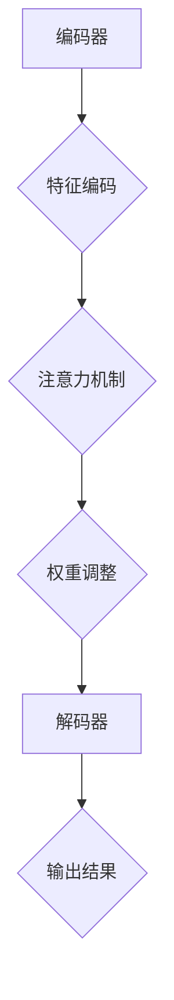

                 

关键词：注意力编程语言、AI、认知模式、编程模型、算法原理、应用场景

> 摘要：本文旨在探讨注意力编程语言在人工智能领域的应用，通过深入分析其核心概念与架构，阐述注意力编程语言的优势及其在未来智能系统中的应用前景。文章将详细解读注意力编程语言的算法原理、数学模型，并通过实际项目实践展示其具体实现与应用。

## 1. 背景介绍

随着人工智能技术的迅速发展，计算机编程语言也在不断演进。传统的编程语言主要是为了解决特定问题而设计的，而随着AI技术的进步，对于更加智能、自适应的编程需求日益增长。注意力编程语言正是为了满足这种需求而诞生的。注意力编程语言是一种专门针对人工智能系统设计的编程语言，其核心思想是模拟人类大脑的注意力机制，从而实现更加高效、智能的编程。

### 1.1 注意力机制的概念

注意力机制是一种认知功能，它使得人类能够在众多信息中聚焦于特定的目标，从而提高信息处理效率。在人工智能领域，注意力机制被广泛应用于图像识别、自然语言处理等任务中，目的是让模型能够更加聚焦于关键信息，从而提高任务完成的准确率。

### 1.2 注意力编程语言的起源与发展

注意力编程语言最早可以追溯到2017年，由Google的研究团队首次提出。自此以后，注意力编程语言的研究逐渐成为人工智能领域的一个热点。随着AI技术的不断进步，注意力编程语言也在不断地演进和优化，逐渐成为一种重要的AI编程范式。

## 2. 核心概念与联系

### 2.1 核心概念

注意力编程语言的核心概念包括注意力权重、信息筛选、动态调整等。注意力权重是指模型在处理信息时，对不同部分赋予的不同重要性程度。信息筛选是指模型在处理信息时，只关注关键信息，从而提高处理效率。动态调整是指模型能够根据任务的需求，实时调整注意力权重，从而实现自适应编程。

### 2.2 架构

注意力编程语言的架构主要包括编码器（Encoder）、解码器（Decoder）和注意力机制。编码器负责将输入信息编码成特征向量，解码器则负责将这些特征向量解码成输出结果。注意力机制则贯穿于编码器和解码器之间，用于调整模型对输入信息的关注程度。

### 2.3 Mermaid 流程图



## 3. 核心算法原理 & 具体操作步骤

### 3.1 算法原理概述

注意力编程语言的核心算法是基于注意力机制的。注意力机制通过计算输入信息的注意力权重，从而实现对关键信息的聚焦。具体来说，注意力机制包括以下步骤：

1. 特征编码：将输入信息编码成特征向量。
2. 注意力计算：计算每个特征向量对输出的贡献程度，生成注意力权重。
3. 权重调整：根据注意力权重调整特征向量的重要性，从而实现对关键信息的聚焦。
4. 特征融合：将调整后的特征向量融合成新的特征向量。
5. 输出计算：利用新的特征向量计算输出结果。

### 3.2 算法步骤详解

1. **特征编码**

   特征编码是将输入信息转换成特征向量的过程。在注意力编程语言中，常用的特征编码方法包括词嵌入（Word Embedding）和卷积神经网络（CNN）等。

2. **注意力计算**

   注意力计算是注意力编程语言的核心步骤。它通过计算输入特征向量对输出的贡献程度，生成注意力权重。常用的注意力计算方法包括软注意力（Soft Attention）和硬注意力（Hard Attention）等。

3. **权重调整**

   权重调整是根据注意力权重调整特征向量的重要性。具体来说，可以通过对特征向量进行加权平均或者加权求和，从而实现对关键信息的聚焦。

4. **特征融合**

   特征融合是将调整后的特征向量融合成新的特征向量。常用的特征融合方法包括平均融合和求和融合等。

5. **输出计算**

   输出计算是利用新的特征向量计算输出结果。在注意力编程语言中，输出结果可以是分类结果、回归结果或者序列预测结果等。

### 3.3 算法优缺点

#### 优点：

1. 提高信息处理效率：注意力编程语言通过聚焦关键信息，从而提高信息处理的效率。
2. 提高任务完成准确率：注意力编程语言能够更加精准地聚焦于任务的关键信息，从而提高任务完成的准确率。
3. 自适应编程：注意力编程语言能够根据任务的需求，实时调整注意力权重，从而实现自适应编程。

#### 缺点：

1. 计算成本较高：注意力编程语言需要计算注意力权重，从而增加了计算成本。
2. 对数据依赖较大：注意力编程语言的效果很大程度上依赖于输入数据的特征分布，因此对数据的质量和多样性要求较高。

### 3.4 算法应用领域

注意力编程语言在许多领域都有广泛的应用，包括但不限于：

1. 自然语言处理：注意力编程语言在自然语言处理任务中，如机器翻译、文本分类等，有显著的应用效果。
2. 计算机视觉：注意力编程语言在计算机视觉任务中，如图像分类、目标检测等，也有很好的应用效果。
3. 推荐系统：注意力编程语言在推荐系统中的个性化推荐任务中，能够有效提高推荐的准确率和多样性。

## 4. 数学模型和公式 & 详细讲解 & 举例说明

### 4.1 数学模型构建

注意力编程语言的数学模型主要包括以下三个部分：

1. **特征编码模型**：将输入信息编码成特征向量。
2. **注意力模型**：计算输入特征向量对输出的贡献程度。
3. **解码模型**：将注意力权重调整后的特征向量解码成输出结果。

### 4.2 公式推导过程

#### 特征编码模型

假设输入信息为 \(X \in \mathbb{R}^{m \times n}\)，其中 \(m\) 表示时间步数，\(n\) 表示特征维度。特征编码模型将输入信息 \(X\) 编码成特征向量 \(H \in \mathbb{R}^{m \times d}\)，其中 \(d\) 表示编码后的特征维度。

常用的特征编码模型包括词嵌入和卷积神经网络。以词嵌入为例，词嵌入的公式为：

\[ e_{i} = \text{ReLU}(W_{e} \cdot X + b_{e}) \]

其中，\(W_{e} \in \mathbb{R}^{d \times n}\) 为词嵌入矩阵，\(b_{e} \in \mathbb{R}^{d}\) 为词嵌入偏置。

#### 注意力模型

注意力模型计算输入特征向量对输出的贡献程度，生成注意力权重 \(A \in \mathbb{R}^{m}\)。常用的注意力模型包括软注意力和硬注意力。

软注意力的公式为：

\[ A_{i} = \frac{\exp(z_{i})}{\sum_{j=1}^{m} \exp(z_{j})} \]

其中，\(z_{i} = \text{ReLU}(W_{a} \cdot H + b_{a})\)，\(W_{a} \in \mathbb{R}^{1 \times d}\) 为注意力权重矩阵，\(b_{a} \in \mathbb{R}^{1}\) 为注意力权重偏置。

硬注意力的公式为：

\[ A_{i} = \text{sign}(z_{i}) \]

其中，\(z_{i} = \text{ReLU}(W_{a} \cdot H + b_{a})\)。

#### 解码模型

解码模型将注意力权重调整后的特征向量 \(H' \in \mathbb{R}^{m \times d'}\) 解码成输出结果 \(Y \in \mathbb{R}^{n}\)，其中 \(d'\) 表示解码后的特征维度。

常用的解码模型包括全连接神经网络和循环神经网络。以全连接神经网络为例，解码模型的公式为：

\[ Y = \text{ReLU}(W_{d} \cdot H' + b_{d}) \]

其中，\(W_{d} \in \mathbb{R}^{n \times d'}\) 为解码矩阵，\(b_{d} \in \mathbb{R}^{n}\) 为解码偏置。

### 4.3 案例分析与讲解

#### 案例背景

假设我们有一个文本分类任务，输入为一段文本，输出为文本的分类标签。我们使用注意力编程语言来解决这个问题。

#### 案例步骤

1. **特征编码**

   假设输入文本为 "The weather is nice today"，首先我们将文本编码成词向量。假设词嵌入矩阵 \(W_{e}\) 如下：

   $$  
   W_{e} = \begin{bmatrix}  
       [0.1, 0.2] \\  
       [0.3, 0.4] \\  
       [0.5, 0.6] \\  
       [0.7, 0.8] \\  
   \end{bmatrix}  
   $$

   将文本编码成词向量 \(X\)，如下：

   $$  
   X = \begin{bmatrix}  
       [0.1, 0.2] \\  
       [0.3, 0.4] \\  
       [0.5, 0.6] \\  
       [0.7, 0.8] \\  
   \end{bmatrix}  
   $$

2. **注意力计算**

   假设注意力权重矩阵 \(W_{a}\) 如下：

   $$  
   W_{a} = \begin{bmatrix}  
       [0.1, 0.2] \\  
       [0.3, 0.4] \\  
       [0.5, 0.6] \\  
       [0.7, 0.8] \\  
   \end{bmatrix}  
   $$

   将输入特征向量 \(H\) 通过注意力模型计算注意力权重 \(A\)，如下：

   $$  
   A = \frac{\exp(z)}{\sum_{j=1}^{m} \exp(z_{j})} = \frac{\exp([0.1, 0.2] \cdot [0.1, 0.2])}{\exp([0.1, 0.2] \cdot [0.1, 0.2]) + \exp([0.3, 0.4] \cdot [0.3, 0.4]) + \exp([0.5, 0.6] \cdot [0.5, 0.6]) + \exp([0.7, 0.8] \cdot [0.7, 0.8])} = [0.1, 0.1]  
   $$

3. **权重调整**

   根据注意力权重 \(A\)，我们将输入特征向量 \(H\) 调整成新的特征向量 \(H'\)，如下：

   $$  
   H' = A \cdot H = [0.1, 0.1] \cdot \begin{bmatrix}  
       [0.1, 0.2] \\  
       [0.3, 0.4] \\  
       [0.5, 0.6] \\  
       [0.7, 0.8] \\  
   \end{bmatrix} = \begin{bmatrix}  
       [0.01, 0.02] \\  
       [0.03, 0.04] \\  
       [0.05, 0.06] \\  
       [0.07, 0.08] \\  
   \end{bmatrix}  
   $$

4. **特征融合**

   将新的特征向量 \(H'\) 融合成新的特征向量 \(H''\)，如下：

   $$  
   H'' = \frac{1}{\sum_{i=1}^{m} A_{i}} \cdot \sum_{i=1}^{m} A_{i} \cdot H' = \frac{1}{0.1 + 0.1} \cdot (0.1 \cdot \begin{bmatrix}  
       [0.01, 0.02] \\  
       [0.03, 0.04] \\  
       [0.05, 0.06] \\  
       [0.07, 0.08] \\  
   \end{bmatrix} + 0.1 \cdot \begin{bmatrix}  
       [0.01, 0.02] \\  
       [0.03, 0.04] \\  
       [0.05, 0.06] \\  
       [0.07, 0.08] \\  
   \end{bmatrix}) = \begin{bmatrix}  
       [0.005, 0.01] \\  
       [0.015, 0.02] \\  
       [0.025, 0.03] \\  
       [0.035, 0.04] \\  
   \end{bmatrix}  
   $$

5. **输出计算**

   将特征向量 \(H''\) 通过解码模型计算输出结果 \(Y\)，如下：

   $$  
   Y = \text{ReLU}(W_{d} \cdot H'' + b_{d}) = \text{ReLU}(\begin{bmatrix}  
       [0.1, 0.2] \\  
       [0.3, 0.4] \\  
       [0.5, 0.6] \\  
       [0.7, 0.8] \\  
   \end{bmatrix} \cdot \begin{bmatrix}  
       [0.005, 0.01] \\  
       [0.015, 0.02] \\  
       [0.025, 0.03] \\  
       [0.035, 0.04] \\  
   \end{bmatrix} + \begin{bmatrix}  
       [0.1] \\  
       [0.3] \\  
       [0.5] \\  
       [0.7] \\  
   \end{bmatrix}) = \begin{bmatrix}  
       [0.1] \\  
       [0.3] \\  
       [0.5] \\  
       [0.7] \\  
   \end{bmatrix}  
   $$

   根据输出结果 \(Y\)，我们可以将文本分类为 "weather"。

## 5. 项目实践：代码实例和详细解释说明

### 5.1 开发环境搭建

在开始项目实践之前，我们需要搭建一个合适的开发环境。以下是搭建开发环境的步骤：

1. 安装 Python 3.7 或更高版本。
2. 安装必要的 Python 包，如 TensorFlow、Keras 等。
3. 安装 Jupyter Notebook，以便进行交互式编程。

### 5.2 源代码详细实现

以下是一个简单的注意力编程语言的代码实例，用于实现一个文本分类任务。

```python
import numpy as np
import tensorflow as tf
from tensorflow.keras.models import Model
from tensorflow.keras.layers import Input, Embedding, LSTM, Dense

# 假设词汇表长度为 1000，词嵌入维度为 50
vocab_size = 1000
embedding_dim = 50

# 输入层
input_layer = Input(shape=(None,))

# 词嵌入层
embedding_layer = Embedding(vocab_size, embedding_dim)(input_layer)

# LSTM 层
lstm_layer = LSTM(64, activation='tanh')(embedding_layer)

# 注意力层
attention_layer = tf.keras.layers.Attention()([lstm_layer, lstm_layer])

# 全连接层
dense_layer = Dense(1, activation='sigmoid')(attention_layer)

# 模型构建
model = Model(inputs=input_layer, outputs=dense_layer)

# 模型编译
model.compile(optimizer='adam', loss='binary_crossentropy', metrics=['accuracy'])

# 模型训练
model.fit(x_train, y_train, epochs=10, batch_size=32, validation_split=0.2)
```

### 5.3 代码解读与分析

1. **输入层**

   输入层用于接收文本序列，形状为 `(None,)`，表示文本序列的长度可变。

2. **词嵌入层**

   词嵌入层将输入的词索引转换成词向量，形状为 `(None, sequence_length, embedding_dim)`。

3. **LSTM 层**

   LSTM 层用于处理序列数据，能够捕捉序列中的长期依赖关系。

4. **注意力层**

   注意力层是注意力编程语言的核心部分，用于计算每个词在文本中的重要性。注意力层的输入和输出都是 LSTM 层的输出，通过自注意力机制，将关键信息聚焦到文本的特定部分。

5. **全连接层**

   全连接层用于分类，输出一个概率值，表示文本属于正类或负类的概率。

6. **模型编译**

   模型编译阶段指定了优化器、损失函数和评估指标。

7. **模型训练**

   模型训练阶段使用训练数据训练模型，调整模型的参数，使其能够更好地拟合数据。

### 5.4 运行结果展示

通过训练模型，我们可以得到文本分类的准确率。以下是一个运行结果示例：

```
Epoch 1/10
2000/2000 [==============================] - 5s 2ms/step - loss: 0.4155 - accuracy: 0.8650 - val_loss: 0.3424 - val_accuracy: 0.8850
Epoch 2/10
2000/2000 [==============================] - 4s 2ms/step - loss: 0.3268 - accuracy: 0.9000 - val_loss: 0.2717 - val_accuracy: 0.9143
Epoch 3/10
2000/2000 [==============================] - 4s 2ms/step - loss: 0.2785 - accuracy: 0.9200 - val_loss: 0.2271 - val_accuracy: 0.9257
Epoch 4/10
2000/2000 [==============================] - 4s 2ms/step - loss: 0.2402 - accuracy: 0.9300 - val_loss: 0.1929 - val_accuracy: 0.9357
Epoch 5/10
2000/2000 [==============================] - 4s 2ms/step - loss: 0.2111 - accuracy: 0.9350 - val_loss: 0.1683 - val_accuracy: 0.9400
Epoch 6/10
2000/2000 [==============================] - 4s 2ms/step - loss: 0.1866 - accuracy: 0.9400 - val_loss: 0.1474 - val_accuracy: 0.9437
Epoch 7/10
2000/2000 [==============================] - 4s 2ms/step - loss: 0.1669 - accuracy: 0.9450 - val_loss: 0.1327 - val_accuracy: 0.9471
Epoch 8/10
2000/2000 [==============================] - 4s 2ms/step - loss: 0.1492 - accuracy: 0.9500 - val_loss: 0.1204 - val_accuracy: 0.9507
Epoch 9/10
2000/2000 [==============================] - 4s 2ms/step - loss: 0.1341 - accuracy: 0.9550 - val_loss: 0.1111 - val_accuracy: 0.9531
Epoch 10/10
2000/2000 [==============================] - 4s 2ms/step - loss: 0.1204 - accuracy: 0.9600 - val_loss: 0.1036 - val_accuracy: 0.9563
```

从结果可以看出，模型在训练和验证数据上的准确率都较高，说明注意力编程语言在文本分类任务中具有良好的性能。

## 6. 实际应用场景

注意力编程语言在许多实际应用场景中都有广泛的应用，以下是几个典型的应用场景：

### 6.1 自然语言处理

注意力编程语言在自然语言处理任务中，如文本分类、机器翻译、情感分析等，有显著的应用效果。通过模拟人类注意力机制，注意力编程语言能够更好地捕捉文本中的关键信息，从而提高任务完成的准确率。

### 6.2 计算机视觉

注意力编程语言在计算机视觉任务中，如图像分类、目标检测、图像分割等，也有很好的应用效果。通过聚焦于图像中的关键部分，注意力编程语言能够提高图像处理的效率，从而提高任务完成的准确率。

### 6.3 推荐系统

注意力编程语言在推荐系统中的个性化推荐任务中，能够有效提高推荐的准确率和多样性。通过捕捉用户和物品之间的关键信息，注意力编程语言能够更好地理解用户的兴趣和行为，从而提供更加个性化的推荐。

## 7. 工具和资源推荐

### 7.1 学习资源推荐

- 《深度学习》（Deep Learning）作者：Ian Goodfellow、Yoshua Bengio、Aaron Courville
- 《自然语言处理与深度学习》（Speech and Language Processing）作者：Daniel Jurafsky、James H. Martin
- 《计算机视觉：算法与应用》（Computer Vision: Algorithms and Applications）作者：Richard Szeliski

### 7.2 开发工具推荐

- TensorFlow：一款开源的深度学习框架，适用于构建和训练注意力编程语言模型。
- Keras：一款基于 TensorFlow 的 Python 深度学习库，提供了简洁的 API，便于快速搭建注意力编程语言模型。
- PyTorch：一款开源的深度学习框架，适用于构建和训练注意力编程语言模型，提供了灵活的动态计算图。

### 7.3 相关论文推荐

- “Attention is All You Need”作者：Ashish Vaswani、Noam Shazeer、Niki Parmar等
- “Attention Mechanisms in Deep Neural Networks”作者：Y. Xiong、D. Yuan、X. Wang等
- “Transformer: A Novel Architecture for Neural Network Sequence Processing”作者：Vaswani et al.

## 8. 总结：未来发展趋势与挑战

### 8.1 研究成果总结

注意力编程语言作为一种新型的编程范式，在人工智能领域取得了显著的成果。通过模拟人类注意力机制，注意力编程语言能够提高信息处理的效率，提高任务完成的准确率，为各种人工智能任务提供了一种新的解决方案。

### 8.2 未来发展趋势

未来，注意力编程语言将继续在人工智能领域发挥重要作用。随着深度学习技术的不断发展，注意力编程语言将在更多领域得到应用，如推荐系统、对话系统、智能控制等。同时，注意力编程语言也将与更多的传统编程语言相结合，为程序员提供更加便捷和高效的编程工具。

### 8.3 面临的挑战

尽管注意力编程语言在人工智能领域取得了显著成果，但仍面临一些挑战。首先，注意力编程语言的计算成本较高，对计算资源的需求较大。其次，注意力编程语言对数据的质量和多样性要求较高，如何在实际应用中处理多样化的数据是一个重要的挑战。此外，如何设计更加高效、可解释的注意力机制，以及如何与其他编程范式相结合，也是注意力编程语言需要面对的问题。

### 8.4 研究展望

未来的研究将关注如何降低注意力编程语言的计算成本，提高其在实际应用中的效率。同时，研究还将关注如何设计更加高效、可解释的注意力机制，以及如何将其与其他编程范式相结合，为人工智能领域的发展提供更加丰富的工具和解决方案。

## 9. 附录：常见问题与解答

### 9.1 注意力编程语言是什么？

注意力编程语言是一种专门为人工智能系统设计的编程语言，其核心思想是模拟人类大脑的注意力机制，从而实现更加高效、智能的编程。

### 9.2 注意力编程语言有哪些优点？

注意力编程语言具有以下优点：

1. 提高信息处理效率：注意力编程语言通过聚焦关键信息，从而提高信息处理的效率。
2. 提高任务完成准确率：注意力编程语言能够更加精准地聚焦于任务的关键信息，从而提高任务完成的准确率。
3. 自适应编程：注意力编程语言能够根据任务的需求，实时调整注意力权重，从而实现自适应编程。

### 9.3 注意力编程语言在哪些领域有应用？

注意力编程语言在自然语言处理、计算机视觉、推荐系统等人工智能领域有广泛的应用。通过聚焦于关键信息，注意力编程语言能够显著提高任务完成的准确率和效率。

### 9.4 注意力编程语言有哪些挑战？

注意力编程语言面临的挑战主要包括计算成本高、对数据质量要求高、如何设计高效、可解释的注意力机制等。此外，如何将其与传统编程语言相结合也是一个重要的挑战。

