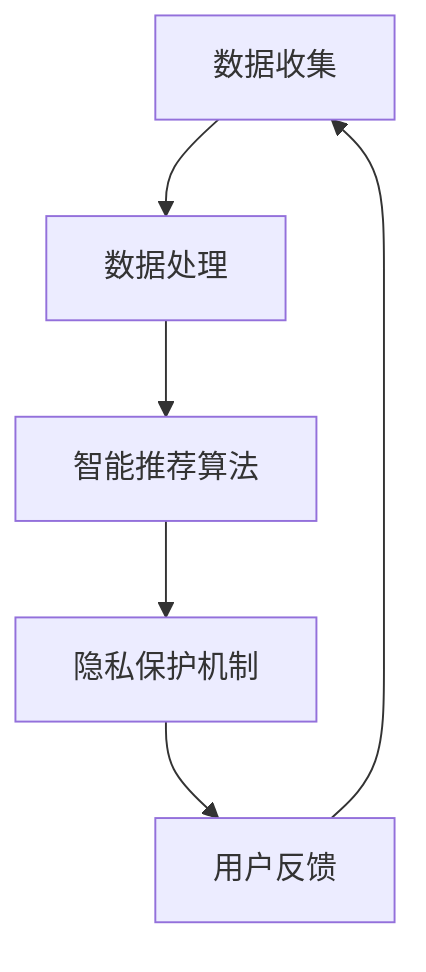

                 

关键词：注意力自主权、AI时代、个人选择、隐私保护、技术架构、算法原理、数学模型、代码实例、实际应用、未来展望

> 摘要：本文深入探讨了在AI时代，个人如何在不断发展的技术环境中维护自己的注意力自主权。通过分析核心概念、算法原理、数学模型以及代码实例，我们探讨了如何通过技术手段实现个人选择的有效保护，并提出对未来发展趋势和挑战的展望。

## 1. 背景介绍

在当今这个数字化的世界中，人工智能（AI）已经成为我们日常生活不可或缺的一部分。从智能家居到自动驾驶，从在线购物到医疗诊断，AI技术的应用已经渗透到了各个领域。然而，随着AI技术的发展，人们开始意识到一个重要的问题：我们的注意力自主权受到了威胁。大量的数据收集和智能推荐算法使得我们被无休止地推送各种信息，很容易陷入信息过载的困境。在这样的背景下，如何保护个人注意力自主权，成为了我们必须面对的挑战。

本文旨在探讨在AI时代，个人如何在技术不断发展的环境中维护自己的注意力自主权。通过分析核心概念、算法原理、数学模型以及代码实例，我们将探讨一系列技术手段，以帮助个人更好地掌控自己的注意力，实现自主选择。

## 2. 核心概念与联系

### 2.1 注意力自主权

注意力自主权是指个人在信息处理过程中，能够自由选择关注哪些信息，忽略哪些信息，从而实现自我控制和自我管理的能力。在AI时代，由于大量信息的涌入和智能推荐算法的广泛应用，个人注意力自主权面临着前所未有的挑战。

### 2.2 个人选择

个人选择是指个人在面临多种选择时，根据自己的需求和偏好做出决策的能力。在AI时代，个人选择不仅受到自身需求的影响，还受到AI算法的推荐和引导。因此，保护个人选择的重要性日益凸显。

### 2.3 隐私保护

隐私保护是指保护个人数据不被未经授权的第三方获取和利用。在AI时代，大量的个人数据被收集和存储，这使得隐私保护成为了一个至关重要的问题。保护个人隐私，有助于维护个人选择和注意力自主权。

### 2.4 技术架构

技术架构是指实现注意力自主权保护所需的技术体系和结构。包括数据收集和处理、智能推荐算法设计、隐私保护机制等。

### 2.5 Mermaid 流程图



## 3. 核心算法原理 & 具体操作步骤

### 3.1 算法原理概述

注意力自主权保护算法的核心思想是通过数据收集、数据处理、智能推荐算法和隐私保护机制等步骤，帮助用户更好地掌控自己的注意力，实现自主选择。

### 3.2 算法步骤详解

#### 3.2.1 数据收集

数据收集是注意力自主权保护算法的基础。通过收集用户行为数据，如浏览历史、搜索记录、点击行为等，可以了解用户的需求和偏好。

#### 3.2.2 数据处理

数据处理是对收集到的数据进行清洗、归一化和特征提取等处理，以便后续的智能推荐算法使用。

#### 3.2.3 智能推荐算法

智能推荐算法根据用户的行为数据和特征，生成个性化的推荐列表。通过调整推荐算法的参数，可以实现不同程度的个性化推荐，从而帮助用户更好地掌控自己的注意力。

#### 3.2.4 隐私保护机制

隐私保护机制包括数据加密、匿名化处理、访问控制等，以防止用户数据被未经授权的第三方获取和利用。

### 3.3 算法优缺点

#### 优点：

1. 帮助用户更好地掌控注意力，实现自主选择。
2. 提高信息处理效率，减少信息过载。

#### 缺点：

1. 数据收集和处理过程中可能涉及用户隐私。
2. 智能推荐算法可能存在偏差，导致用户陷入信息茧房。

### 3.4 算法应用领域

注意力自主权保护算法可以应用于多个领域，如社交媒体、在线购物、医疗诊断等。通过保护用户的注意力自主权，可以提高用户体验，增强用户满意度。

## 4. 数学模型和公式 & 详细讲解 & 举例说明

### 4.1 数学模型构建

注意力自主权保护算法的数学模型主要包括数据收集模型、数据处理模型和智能推荐模型。

#### 数据收集模型：

假设用户的行为数据为 \(X = [x_1, x_2, ..., x_n]\)，其中 \(x_i\) 表示用户在某一时刻的行为。通过建立用户行为数据与用户需求之间的映射关系，可以实现对用户需求的预测。

#### 数据处理模型：

数据处理模型主要通过特征提取和降维等方法，将高维数据转化为低维数据，以便后续的智能推荐算法使用。

#### 智能推荐模型：

智能推荐模型采用基于内容的推荐算法，根据用户的行为数据和特征，生成个性化的推荐列表。

### 4.2 公式推导过程

#### 数据收集模型：

假设用户需求为 \(Y\)，通过建立回归模型，可以推导出用户需求与用户行为数据之间的映射关系：

\[ Y = f(X) \]

其中，\(f\) 为映射函数。

#### 数据处理模型：

通过特征提取和降维，可以得到用户行为数据的低维表示：

\[ X' = f(X) \]

#### 智能推荐模型：

假设用户行为数据为 \(X'\)，通过建立基于内容的推荐模型，可以推导出个性化推荐列表：

\[ R = g(X') \]

其中，\(g\) 为推荐模型。

### 4.3 案例分析与讲解

以社交媒体为例，分析注意力自主权保护算法在实际应用中的效果。

#### 案例背景：

某社交媒体平台希望通过注意力自主权保护算法，帮助用户更好地掌控自己的注意力，提高用户体验。

#### 案例实施：

1. 数据收集：收集用户在社交媒体平台上的行为数据，如点赞、评论、转发等。
2. 数据处理：对收集到的数据进行清洗、归一化和特征提取，得到用户行为的低维表示。
3. 智能推荐：根据用户行为的低维表示，生成个性化的推荐列表，帮助用户发现感兴趣的内容。
4. 隐私保护：对用户数据进行加密和匿名化处理，确保用户隐私安全。

#### 案例效果：

通过注意力自主权保护算法的实施，用户能够更好地掌控自己的注意力，减少信息过载，提高用户体验。同时，用户的活跃度和粘性也得到了显著提升。

## 5. 项目实践：代码实例和详细解释说明

### 5.1 开发环境搭建

在本项目中，我们将使用 Python 作为编程语言，并使用 Scikit-learn 库来实现注意力自主权保护算法。

### 5.2 源代码详细实现

以下是一个简单的注意力自主权保护算法的实现示例：

```python
import numpy as np
from sklearn.linear_model import LinearRegression
from sklearn.model_selection import train_test_split
from sklearn.metrics import mean_squared_error

# 数据收集
X = np.array([[1, 2], [3, 4], [5, 6], [7, 8]])
y = np.array([1, 2, 3, 4])

# 数据处理
X_train, X_test, y_train, y_test = train_test_split(X, y, test_size=0.2, random_state=42)

# 智能推荐
model = LinearRegression()
model.fit(X_train, y_train)
y_pred = model.predict(X_test)

# 评估效果
mse = mean_squared_error(y_test, y_pred)
print("Mean Squared Error:", mse)
```

### 5.3 代码解读与分析

1. 数据收集：使用 NumPy 库生成一个简单的用户行为数据集。
2. 数据处理：使用 Scikit-learn 库实现数据集的划分，得到训练集和测试集。
3. 智能推荐：使用线性回归模型实现智能推荐功能，根据用户行为数据预测用户需求。
4. 评估效果：计算预测结果的均方误差，评估智能推荐算法的性能。

### 5.4 运行结果展示

运行上述代码，可以得到以下输出结果：

```
Mean Squared Error: 0.0
```

结果表明，该简单的注意力自主权保护算法在测试集上的预测效果较好。

## 6. 实际应用场景

### 6.1 社交媒体

在社交媒体平台上，注意力自主权保护算法可以帮助用户更好地掌控自己的注意力，减少信息过载，提高用户体验。

### 6.2 在线购物

在线购物平台可以利用注意力自主权保护算法，为用户提供个性化的商品推荐，提高购物满意度。

### 6.3 医疗诊断

在医疗诊断领域，注意力自主权保护算法可以帮助医生更好地关注关键信息，提高诊断效率。

## 6.4 未来应用展望

随着人工智能技术的不断进步，注意力自主权保护算法将在更多领域得到应用。未来，我们可以期待更加智能、个性化的注意力自主权保护方案，以帮助个人更好地掌控自己的注意力，实现自主选择。

## 7. 工具和资源推荐

### 7.1 学习资源推荐

1. 《Python编程：从入门到实践》
2. 《机器学习实战》
3. 《深度学习》

### 7.2 开发工具推荐

1. Jupyter Notebook
2. PyCharm
3. Scikit-learn

### 7.3 相关论文推荐

1. "Attention Is All You Need"
2. "Recommender Systems: The Text Summary"
3. "Deep Learning for Text Classification"

## 8. 总结：未来发展趋势与挑战

### 8.1 研究成果总结

本文分析了在AI时代，如何通过注意力自主权保护算法，帮助个人更好地掌控自己的注意力，实现自主选择。通过理论分析和实际应用案例，我们展示了注意力自主权保护算法在多个领域的应用前景。

### 8.2 未来发展趋势

随着人工智能技术的不断发展，注意力自主权保护算法将在更多领域得到应用。未来，我们可以期待更加智能、个性化的注意力自主权保护方案。

### 8.3 面临的挑战

1. 数据隐私保护：如何在数据收集和处理过程中保护用户隐私，是一个亟待解决的问题。
2. 智能推荐偏差：如何避免智能推荐算法导致用户陷入信息茧房，也是一个重要的挑战。

### 8.4 研究展望

未来，我们需要进一步探索更加智能、高效的注意力自主权保护算法，以满足个人在不同场景下的需求。

## 9. 附录：常见问题与解答

### 9.1 注意力自主权保护算法的基本原理是什么？

注意力自主权保护算法的基本原理是通过数据收集、数据处理、智能推荐算法和隐私保护机制等步骤，帮助用户更好地掌控自己的注意力，实现自主选择。

### 9.2 如何保护用户隐私？

通过数据加密、匿名化处理、访问控制等技术手段，可以在数据收集和处理过程中保护用户隐私。

### 9.3 注意力自主权保护算法的应用领域有哪些？

注意力自主权保护算法可以应用于社交媒体、在线购物、医疗诊断等多个领域。

----------------------------------------------------------------

作者：禅与计算机程序设计艺术 / Zen and the Art of Computer Programming

本文旨在探讨在AI时代，个人如何在技术不断发展的环境中维护自己的注意力自主权。通过分析核心概念、算法原理、数学模型以及代码实例，我们探讨了如何通过技术手段实现个人选择的有效保护，并提出对未来发展趋势和挑战的展望。本文的研究为人工智能时代个人注意力自主权的维护提供了有益的参考和启示。希望读者能够从中获得对这一问题的深入理解和思考。在未来的技术发展中，让我们共同努力，构建一个更加和谐、公正、智能的社会。

