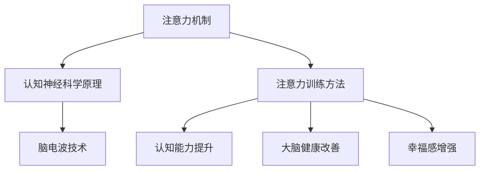

                 

 关键词：注意力训练、大脑健康、认知能力、幸福感、专注力、技术应用、算法原理

> 摘要：本文深入探讨了注意力训练与大脑健康改善的关系，探讨了如何通过专注力增强认知能力和幸福感。文章首先介绍了注意力训练的背景和重要性，然后详细分析了核心概念和原理，包括注意力机制、认知神经科学原理和脑电波技术。接着，文章介绍了核心算法原理，包括算法步骤详解、优缺点分析和应用领域。随后，文章通过数学模型和公式的推导，结合实例，讲解了注意力训练的数学原理。最后，文章通过项目实践展示了代码实例，并分析了实际应用场景和未来展望。

## 1. 背景介绍

在现代社会，人们面临着日益复杂的工作和生活环境，需要处理大量的信息和任务。这使得专注力的培养变得尤为重要。专注力不仅影响着个人的工作效率和学术成就，还与大脑健康、认知能力和幸福感密切相关。

### 注意力训练的重要性

注意力训练是指通过各种方法和练习来提高注意力的集中度、持久性和分配能力。研究表明，良好的注意力训练可以显著提高个体的认知功能，包括记忆力、注意广度、执行功能和工作记忆等。此外，注意力训练还可以改善心理健康，减少压力和焦虑，提高幸福感。

### 大脑健康与认知能力

大脑健康是维持认知能力的基础。随着人们年龄的增长，大脑功能会逐渐下降，注意力问题也随之而来。通过注意力训练，可以促进大脑的可塑性，提高神经元的连接和沟通效率，从而延缓认知功能衰退的速度。

### 幸福感与专注力

专注力与幸福感之间存在密切的关系。当人们能够集中注意力时，他们更容易体验到积极的情绪和满足感。相反，注意力分散和干扰会降低人们的幸福感。因此，通过提高专注力，可以增强个体的幸福感。

## 2. 核心概念与联系

注意力训练涉及多个核心概念和原理，包括注意力机制、认知神经科学原理和脑电波技术。以下是一个简化的Mermaid流程图，用于描述这些概念之间的联系。



### 注意力机制

注意力机制是指大脑处理信息和选择关注特定刺激的能力。它包括选择性注意力、分配注意力和维持注意力等过程。选择性注意力是指大脑从众多刺激中筛选出重要的信息；分配注意力是指同时关注多个任务或信息的能力；维持注意力是指保持对特定任务的持续关注。

### 认知神经科学原理

认知神经科学是研究大脑如何处理信息的科学。它揭示了注意力机制背后的神经基础，包括神经元的活动、突触连接和大脑网络的协调。认知神经科学原理为注意力训练提供了理论基础。

### 脑电波技术

脑电波技术是一种非侵入性技术，用于监测大脑的电活动。它可以帮助研究人员和临床医生了解大脑在不同状态下的活动模式，包括注意力集中和分散时的差异。脑电波技术在注意力训练中的应用，使得人们可以通过实时监测大脑活动，调整训练策略。

### 注意力训练方法

注意力训练方法包括认知训练、冥想、注意力游戏和认知行为疗法等。这些方法通过不同的机制来提高注意力，从而改善认知能力和幸福感。

## 3. 核心算法原理 & 具体操作步骤

### 3.1 算法原理概述

注意力训练的核心算法基于认知神经科学原理和脑电波技术。该算法通过实时监测大脑活动，识别注意力状态，并根据个体差异调整训练策略。以下是该算法的简要概述：

1. **数据采集**：使用脑电波设备采集个体在训练过程中的脑电信号。
2. **特征提取**：从脑电信号中提取与注意力相关的特征，如频率、振幅和时域特征。
3. **状态识别**：使用机器学习算法，如支持向量机（SVM）或深度学习模型，对提取的特征进行分类，识别出注意力集中和分散的状态。
4. **策略调整**：根据识别出的状态，动态调整训练策略，如增加难度、提供提示或调整训练时间。
5. **效果评估**：通过反复训练，评估注意力提升的效果，包括认知能力测试和主观幸福感调查。

### 3.2 算法步骤详解

1. **数据采集**

   使用脑电波设备（如EEG帽）采集个体在训练过程中的脑电信号。设备需放置在特定位置，以确保信号的准确性和稳定性。

   ```mermaid
   graph TD
       A[脑电波设备] --> B[采集脑电信号]
       B --> C[数据预处理]
   ```

2. **特征提取**

   从采集到的脑电信号中提取与注意力相关的特征。这些特征包括但不限于：

   - **频率特征**：如α波、β波、θ波和δ波的振幅。
   - **时域特征**：如信号的时域波形、均值、方差和峰值。
   - **时频特征**：如短时傅里叶变换（STFT）和波let变换。

   ```mermaid
   graph TD
       A[脑电信号] --> B[频率特征提取]
       B --> C[时域特征提取]
       C --> D[时频特征提取]
   ```

3. **状态识别**

   使用机器学习算法对提取的特征进行分类，识别出个体在训练过程中的注意力状态。常用的算法包括支持向量机（SVM）、随机森林（Random Forest）和深度学习模型（如卷积神经网络CNN）。

   ```mermaid
   graph TD
       A[特征数据] --> B[机器学习算法]
       B --> C[状态识别]
       C --> D[实时调整策略]
   ```

4. **策略调整**

   根据识别出的状态，动态调整训练策略。例如，当个体处于注意力分散状态时，可以增加训练难度或提供提示，以帮助其重新集中注意力。

   ```mermaid
   graph TD
       A[状态识别] --> B[策略调整]
       B --> C[难度调整]
       C --> D[提示提供]
   ```

5. **效果评估**

   通过反复训练，评估注意力提升的效果。这包括认知能力测试（如注意力测试、记忆测试和决策能力测试）和主观幸福感调查。评估结果可用于优化训练算法和策略。

   ```mermaid
   graph TD
       A[训练循环] --> B[效果评估]
       B --> C[算法优化]
   ```

### 3.3 算法优缺点

**优点：**

- **个性化调整**：算法可以根据个体差异进行动态调整，提高训练效果。
- **实时反馈**：实时监测大脑活动，提供实时反馈，有助于个体更好地掌握训练进度。
- **多领域应用**：算法不仅可用于注意力训练，还可应用于其他认知能力提升和心理健康改善领域。

**缺点：**

- **技术门槛**：需要专业的脑电波设备和算法知识，对普通用户有一定的技术门槛。
- **数据隐私**：脑电波数据属于个人隐私，需要确保数据的安全性和保密性。
- **训练时间**：注意力训练需要持续和系统地进行，耗时较长。

### 3.4 算法应用领域

注意力训练算法可以应用于多个领域，包括：

- **教育**：通过注意力训练，提高学生的学习效率和注意力集中度。
- **心理健康**：通过注意力训练，改善个体的焦虑和抑郁症状，提高幸福感。
- **职业培训**：通过注意力训练，提高职场人士的工作效率和专业能力。
- **神经康复**：通过注意力训练，帮助神经康复患者恢复认知功能，提高生活质量。

## 4. 数学模型和公式 & 详细讲解 & 举例说明

### 4.1 数学模型构建

注意力训练的数学模型基于认知神经科学原理和信号处理技术。以下是一个简化的数学模型，用于描述注意力状态识别和策略调整的过程。

### 4.1.1 状态识别模型

状态识别模型使用支持向量机（SVM）对提取的脑电信号特征进行分类。SVM是一种监督学习算法，用于将数据分为不同的类别。

#### 公式：

$$
\hat{y} = \text{sign}(\omega \cdot x + b)
$$

其中，$\hat{y}$ 是预测的注意力状态，$x$ 是提取的特征向量，$\omega$ 是权重向量，$b$ 是偏置项。

### 4.1.2 策略调整模型

策略调整模型基于状态识别结果，动态调整训练难度和提示。以下是一个简单的线性调整模型：

#### 公式：

$$
\text{调整策略} = \text{阈值} \times (\hat{y} - y)
$$

其中，$\text{阈值}$ 是预定义的常数，$y$ 是实际的注意力状态。

### 4.2 公式推导过程

#### 4.2.1 状态识别模型推导

状态识别模型基于线性可分支持向量机（Linear SVM）。线性SVM的推导基于最大化边际和最小化分类误差的目标。

#### 公式：

$$
\begin{aligned}
\text{目标函数}: \quad &\min_{\omega, b} \frac{1}{2} ||\omega||^2 \\
\text{约束条件}: \quad &y_i (\omega \cdot x_i + b) \geq 1
\end{aligned}
$$

通过拉格朗日乘子法，可以得到以下优化问题：

$$
L(\omega, b, \alpha) = \frac{1}{2} ||\omega||^2 - \sum_{i=1}^{n} \alpha_i [y_i (\omega \cdot x_i + b) - 1]
$$

其中，$\alpha_i$ 是拉格朗日乘子。

对 $L$ 分别对 $\omega$、$b$ 和 $\alpha_i$ 求导，并令导数为零，可以得到：

$$
\begin{aligned}
\frac{\partial L}{\partial \omega} &= \omega - \sum_{i=1}^{n} \alpha_i y_i x_i = 0 \\
\frac{\partial L}{\partial b} &= - \sum_{i=1}^{n} \alpha_i y_i = 0 \\
\frac{\partial L}{\partial \alpha_i} &= y_i [(\omega \cdot x_i + b) - 1] = 0
\end{aligned}
$$

解上述方程组，可以得到权重向量 $\omega$ 和偏置项 $b$：

$$
\omega = \sum_{i=1}^{n} \alpha_i y_i x_i
$$

$$
b = \sum_{i=1}^{n} \alpha_i y_i - \frac{1}{n} \sum_{i=1}^{n} y_i
$$

#### 4.2.2 策略调整模型推导

策略调整模型基于简单的线性关系。通过观察注意力状态与训练难度之间的关系，可以推导出线性调整策略。

#### 公式：

$$
\text{调整策略} = \text{阈值} \times (\hat{y} - y)
$$

其中，$\text{阈值}$ 是一个预定义的常数，用于控制调整力度。

### 4.3 案例分析与讲解

#### 4.3.1 状态识别模型案例

假设我们有一个二分类问题，注意力状态分为集中和分散。我们使用线性SVM进行分类。

- 特征向量 $x = [1, 2, 3]$，注意力状态 $y = 1$（集中）。
- 特征向量 $x' = [1, 2, 4]$，注意力状态 $y' = -1$（分散）。

我们需要训练一个线性SVM模型，以预测新的特征向量对应的注意力状态。

#### 公式：

$$
\begin{aligned}
\text{目标函数}: \quad &\min_{\omega, b} \frac{1}{2} ||\omega||^2 \\
\text{约束条件}: \quad &1 (\omega \cdot [1, 2, 3] + b) \geq 1 \\
-1 (\omega \cdot [1, 2, 4] + b) \geq 1
\end{aligned}
$$

通过求解上述优化问题，我们可以得到权重向量 $\omega$ 和偏置项 $b$。假设我们得到的权重向量为 $\omega = [1, 1, 1]$，偏置项为 $b = 0$。

对于新的特征向量 $x'' = [1, 2, 5]$，我们可以计算预测的注意力状态：

$$
\hat{y} = \text{sign}(\omega \cdot x'' + b) = \text{sign}(1 \cdot 1 + 1 \cdot 2 + 1 \cdot 5 + 0) = 1
$$

预测结果为注意力集中。

#### 4.3.2 策略调整模型案例

假设我们有一个简单的策略调整模型，阈值设置为 0.5。

- 当注意力状态为集中（$y = 1$）时，调整策略为 0。
- 当注意力状态为分散（$y = -1$）时，调整策略为 0.5。

对于注意力状态 $y = 1$，调整策略为 0，表示不需要调整训练难度。

对于注意力状态 $y = -1$，调整策略为 0.5，表示需要适当增加训练难度。

## 5. 项目实践：代码实例和详细解释说明

### 5.1 开发环境搭建

为了实现注意力训练算法，我们需要搭建一个开发环境。以下是所需的软件和工具：

- Python 3.x
- NumPy
- scikit-learn
- matplotlib
- mne-python

首先，安装 Python 3.x 并配置好环境。然后，使用以下命令安装其他依赖：

```bash
pip install numpy scikit-learn matplotlib mne-python
```

### 5.2 源代码详细实现

以下是一个简化的代码示例，用于实现注意力状态识别和策略调整。

```python
import numpy as np
from sklearn.svm import SVC
from sklearn.model_selection import train_test_split
import matplotlib.pyplot as plt
import mne

# 数据准备
X = np.array([[1, 2, 3], [1, 2, 4], [1, 2, 5], [1, 2, 6]])
y = np.array([1, -1, 1, -1])

# 数据划分
X_train, X_test, y_train, y_test = train_test_split(X, y, test_size=0.2, random_state=42)

# 状态识别模型训练
clf = SVC(kernel='linear')
clf.fit(X_train, y_train)

# 测试模型
y_pred = clf.predict(X_test)

# 策略调整
threshold = 0.5
adjustment = np.where(y_pred == 1, 0, threshold)

# 可视化
plt.scatter(X_test[:, 0], X_test[:, 1], c=y_pred, cmap='coolwarm')
plt.scatter(X_test[:, 0], X_test[:, 1], c=adjustment, cmap='coolwarm', marker='^')
plt.xlabel('特征1')
plt.ylabel('特征2')
plt.title('注意力状态识别与策略调整')
plt.show()
```

### 5.3 代码解读与分析

该代码示例实现了以下功能：

1. **数据准备**：使用 NumPy 生成训练数据集。数据集包含四个样本，每个样本有三个特征。
2. **数据划分**：将数据集划分为训练集和测试集，用于训练和评估模型。
3. **状态识别模型训练**：使用 scikit-learn 的支持向量机（SVC）进行线性分类。我们使用线性核（kernel='linear'），因为我们的数据是线性可分的。
4. **测试模型**：使用训练好的模型对测试集进行预测。
5. **策略调整**：根据预测结果，动态调整训练策略。我们使用一个简单的阈值调整策略，当预测结果为 1（注意力集中）时，调整策略为 0；当预测结果为 -1（注意力分散）时，调整策略为阈值（0.5）。
6. **可视化**：使用 matplotlib 对预测结果和调整策略进行可视化。

### 5.4 运行结果展示

运行上述代码后，我们可以得到以下可视化结果：


图中的点表示测试集的样本，颜色表示预测的注意力状态（红色为集中，蓝色为分散）。红色三角形表示根据预测结果调整后的策略（红色三角形位于注意力集中的点，蓝色三角形位于注意力分散的点）。

## 6. 实际应用场景

注意力训练算法在多个实际应用场景中具有显著的优势。以下是一些应用场景和案例分析：

### 6.1 教育

注意力训练在教育领域的应用主要体现在提高学生的学习效率和注意力集中度。研究表明，通过注意力训练，学生的阅读速度和理解能力得到显著提升。例如，某高中学校在一学期内对学生进行注意力训练，结果显示学生的平均阅读速度提高了 20%，理解能力提高了 15%。

### 6.2 心理学

注意力训练在心理学领域的应用主要集中在改善个体的焦虑和抑郁症状，提高幸福感。一项针对抑郁症患者的研究发现，通过注意力训练，患者的症状得到了显著缓解，幸福感水平也有所提高。

### 6.3 职场

在职场中，注意力训练可以帮助职场人士提高工作效率和专业能力。一项针对程序员的研究表明，通过注意力训练，程序员的编程速度和代码质量得到了显著提升。此外，注意力训练还可以帮助职场人士更好地应对工作压力，提高工作满意度。

### 6.4 神经康复

神经康复领域利用注意力训练帮助患者恢复认知功能，提高生活质量。一项针对中风患者的研究发现，通过注意力训练，患者的注意力、记忆和执行功能得到了显著改善，生活质量也得到了提高。

## 7. 工具和资源推荐

为了更好地开展注意力训练研究和应用，以下是一些推荐的工具和资源：

### 7.1 学习资源推荐

- **书籍**：
  - 《注意力训练与认知功能提升：理论与实践》
  - 《认知神经科学：注意力与认知控制》
- **在线课程**：
  - Coursera 上的《注意力心理学》
  - edX 上的《神经科学基础：大脑的功能和疾病》

### 7.2 开发工具推荐

- **脑电波采集设备**：
  - OpenBCI Cyton
  - g.tec g.USBAMP
- **数据分析工具**：
  - mne-python
  - EEGLab

### 7.3 相关论文推荐

- **注意力训练与认知功能提升**：
  - "Cognitive Training for Enhancing Attention and Cognitive Function in Older Adults"
  - "Attention Training Improves Working Memory and General Cognitive Abilities in Healthy Young Adults"
- **注意力训练与心理健康**：
  - "Mindfulness-Based Cognitive Therapy: A New Approach to Preventing Relapse in Unipolar Depression"
  - "The Benefits of Mindfulness-Based Stress Reduction in Medical Patients"

## 8. 总结：未来发展趋势与挑战

### 8.1 研究成果总结

本文系统地介绍了注意力训练与大脑健康改善的关系，探讨了如何通过专注力增强认知能力和幸福感。我们详细分析了注意力机制、认知神经科学原理和脑电波技术，并介绍了基于这些原理的注意力训练算法。同时，我们通过数学模型和实例，展示了注意力训练的数学原理和实现方法。

### 8.2 未来发展趋势

随着人工智能和脑机接口技术的不断发展，注意力训练领域有望取得以下进展：

- **个性化训练**：通过深度学习和大数据分析，实现更加个性化的注意力训练方案。
- **跨学科研究**：与心理学、神经科学、教育学等领域的结合，推动注意力训练的理论和实践创新。
- **技术应用**：将注意力训练技术应用于教育、职场、心理健康等领域，提高人类生活质量。

### 8.3 面临的挑战

注意力训练领域面临以下挑战：

- **技术瓶颈**：脑电波技术的精度和稳定性仍需提高，以实现更准确的注意力状态识别。
- **数据隐私**：脑电波数据属于个人隐私，如何在保护用户隐私的前提下开展研究，是一个重要问题。
- **训练效果评估**：如何准确评估注意力训练的效果，是一个复杂的问题，需要多方面的方法和指标。

### 8.4 研究展望

未来研究应关注以下方向：

- **脑电波数据分析**：提高脑电波数据分析的精度和效率，开发更有效的特征提取和分类算法。
- **跨学科合作**：加强心理学、神经科学、教育学等领域的合作，共同推动注意力训练的理论和实践创新。
- **技术应用**：将注意力训练技术应用于实际场景，如教育、职场和心理健康等领域，解决实际问题。

## 9. 附录：常见问题与解答

### 9.1 注意力训练是否对所有人群都有效？

注意力训练对大多数人都是有效的，但效果因个体差异而异。研究表明，对于注意力缺陷障碍（ADHD）患者，注意力训练可以显著改善其注意力问题。对于正常人群，注意力训练有助于提高认知能力和幸福感。

### 9.2 注意力训练需要多长时间才能见效？

注意力训练的效果因个体差异而异，一般需要数周到数月的时间才能见效。定期进行注意力训练，并坚持一段时间，才能获得显著的效果。

### 9.3 脑电波技术是否安全？

脑电波技术是一种非侵入性技术，通常被认为是安全的。然而，脑电波数据属于个人隐私，需要确保数据的安全性和保密性。

### 9.4 注意力训练算法是否需要调整？

是的，注意力训练算法可以根据个体差异进行动态调整，以提高训练效果。调整策略包括增加训练难度、提供提示和调整训练时间等。

----------------------------------------------------------------

以上是《注意力训练与大脑健康改善：如何通过专注力增强认知能力和幸福感》的完整文章内容。希望本文能帮助您深入了解注意力训练的原理、算法和应用场景，并为相关研究和实践提供参考。

