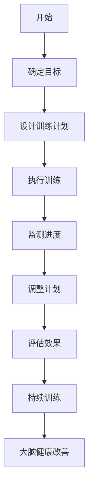

                 

关键词：注意力训练、大脑健康、认知能力、心灵健康、专注力、脑科学、算法原理、应用实践、技术发展、未来展望

> 摘要：本文深入探讨了注意力训练对大脑健康改善的重要性，以及如何通过专注力增强认知能力和心灵健康。文章首先介绍了注意力训练的背景和核心概念，然后详细阐述了注意力训练的算法原理和数学模型，并结合实际应用场景，展示了注意力训练在实际项目中的实践方法和效果。最后，文章对未来的发展方向和面临的挑战进行了展望，提出了进一步提升注意力训练技术和应用的建议。

## 1. 背景介绍

在当今信息爆炸的时代，人们面临着前所未有的信息过载问题。人们需要快速处理大量信息，以便做出正确的决策和应对复杂的情况。然而，人们的大脑处理能力是有限的，如何在有限的时间内有效地处理大量信息成为一个重要问题。注意力是大脑处理信息的关键能力，它决定了我们能否专注于任务，能否有效地利用资源，以及能否在竞争激烈的环境中取得成功。

注意力训练作为一种提高大脑功能的方法，受到了广泛的关注。注意力训练的目的是通过特定的练习和训练，提高注意力的稳定性、分配和转移能力，从而增强认知能力和心灵健康。研究表明，注意力训练可以改善大脑功能，提高工作效率，减轻压力和焦虑，甚至预防认知功能的下降。

本文将首先介绍注意力训练的背景和核心概念，然后详细阐述注意力训练的算法原理和数学模型，并结合实际应用场景，展示注意力训练在实际项目中的实践方法和效果。最后，本文将对未来的发展方向和面临的挑战进行展望，并提出进一步提升注意力训练技术和应用的建议。

### 1.1 注意力训练的重要性

注意力是人类认知系统中的一个重要组成部分，它使我们能够选择关注特定的信息，同时忽略其他无关的信息。良好的注意力能力对于个人在学业、工作和社交等方面的表现至关重要。以下是注意力训练的重要性：

- **提高工作效率**：通过注意力训练，人们可以更好地专注于任务，减少分心，提高工作效率。

- **增强学习能力**：注意力训练有助于提高学习效率，使人更容易吸收和理解新知识。

- **改善心理健康**：注意力训练有助于减轻压力和焦虑，改善心理健康状况。

- **预防认知衰退**：随着年龄的增长，注意力可能会逐渐衰退。通过注意力训练，可以延缓这一过程，预防认知功能的下降。

- **提高决策能力**：注意力训练有助于提高决策能力，使人能够更准确地评估信息，做出更明智的决策。

### 1.2 注意力训练的背景

注意力训练的概念起源于脑科学研究，近年来随着脑成像技术和认知神经科学的发展，人们对注意力机制的理解逐渐深入。早期的注意力训练主要集中在军事、航天和职业培训等领域，旨在提高人员的高强度注意力和应急反应能力。随着研究的深入，注意力训练逐渐应用于心理学、教育学和医疗领域，用于改善注意力缺陷障碍（如ADHD）、学习障碍和认知功能减退等问题。

注意力训练的方法主要包括以下几种：

- **专注力训练**：通过专注于特定的任务或刺激，提高注意力的稳定性。

- **分配训练**：通过在多个任务之间分配注意力，提高注意力的分配能力。

- **转移训练**：通过在不同任务之间切换注意力，提高注意力的转移能力。

- **反馈训练**：通过实时反馈，帮助个体了解自己的注意力状态，并调整注意力。

## 2. 核心概念与联系

### 2.1 核心概念

在讨论注意力训练之前，我们需要先了解一些核心概念，包括注意力的定义、注意力障碍的类型以及注意力训练的目标。

#### 注意力的定义

注意力是指大脑选择关注特定信息的能力。它包括几个关键维度：

- **选择性**：选择关注某些信息而忽略其他信息。
- **稳定性**：在一段时间内保持对特定信息的关注。
- **分配性**：在同时处理多个任务时，将注意力分配给不同任务。
- **转移性**：在需要时，将注意力从一个任务转移到另一个任务。

#### 注意力障碍的类型

注意力障碍主要包括以下几种类型：

- **注意力缺陷障碍（ADHD）**：表现为注意力不集中、多动和冲动。
- **执行功能障碍**：表现为计划、组织、决策和问题解决能力的下降。
- **多任务处理障碍**：难以在多个任务之间切换注意力。

#### 注意力训练的目标

注意力训练的主要目标是提高以下方面的能力：

- **选择性**：提高选择关注关键信息的能力，减少分心。
- **稳定性**：延长对特定任务的专注时间。
- **分配性**：提高在多个任务之间分配注意力的能力。
- **转移性**：提高在不同任务之间切换注意力的速度和效率。

### 2.2 联系

注意力训练与大脑健康改善之间的联系可以从多个方面进行探讨：

- **神经可塑性**：注意力训练可以促进大脑的神经可塑性，增强神经连接，从而提高认知功能。
- **神经保护**：注意力训练有助于保护大脑免受认知功能衰退的影响，延缓老化过程。
- **情绪调节**：注意力训练有助于改善情绪调节能力，减轻压力和焦虑。
- **社会互动**：注意力训练有助于提高社会互动能力，增强人际关系。

### 2.3 Mermaid 流程图

以下是一个简化的注意力训练过程和大脑健康改善的Mermaid流程图：



在这个流程图中，注意力训练始于确定目标，然后设计一个适合的训练计划。在执行训练过程中，需要不断监测进度并调整计划，最终评估训练效果并持续进行训练，以实现大脑健康改善。

### 2.4 脑科学原理

注意力训练对大脑健康改善的影响可以从脑科学的视角进行探讨。以下是一些关键点：

- **前额叶皮层**：前额叶皮层是注意力控制和决策的关键区域。注意力训练可以增强前额叶皮层的功能，提高注意力的稳定性和分配能力。
- **基底神经节**：基底神经节与运动控制和习惯形成有关。注意力训练可以改善基底神经节的协调功能，帮助个体更好地适应新任务。
- **大脑顶叶**：大脑顶叶与空间感知和注意力转移有关。注意力训练可以增强顶叶的神经网络，提高注意力转移的效率。
- **神经可塑性**：注意力训练通过改变神经连接和神经网络的活动模式，促进大脑的神经可塑性，从而提高认知功能。

### 2.5 注意力训练的算法原理

注意力训练的算法原理基于对注意力机制的理解和建模。以下是一个简化的算法框架：

1. **数据收集**：通过脑成像技术（如fMRI）收集大脑活动数据。
2. **特征提取**：从数据中提取与注意力相关的特征，如脑区的激活模式和时间序列。
3. **模型训练**：使用机器学习算法（如神经网络）对特征进行训练，建立注意力模型。
4. **任务设计**：设计特定的注意力训练任务，如视觉搜索、空间导航等。
5. **训练实施**：在训练任务中，根据注意力模型提供实时反馈，帮助个体调整注意力。
6. **效果评估**：通过测试评估注意力训练的效果，如注意力稳定性和转移性。

### 2.6 注意力训练的方法

注意力训练的方法多种多样，包括以下几种：

- **认知训练**：通过特定的认知任务，如记忆游戏、推理问题等，提高注意力。
- **正念冥想**：通过冥想练习，提高注意力集中和情绪调节能力。
- **运动训练**：通过身体运动，如跑步、瑜伽等，改善大脑功能和注意力。
- **技术辅助**：使用注意力训练软件或应用，提供个性化的训练计划。

### 2.7 注意力训练的应用

注意力训练在多个领域都有广泛应用，包括教育、医疗和职业培训等：

- **教育**：通过注意力训练，提高学生的学习效果和注意力集中能力。
- **医疗**：通过注意力训练，改善注意力缺陷障碍患者的症状，提高生活质量。
- **职业培训**：通过注意力训练，提高员工的注意力和工作效率，减少事故发生。

### 2.8 总结

注意力训练是提高认知能力和大脑健康的重要方法。通过理解注意力训练的核心概念、算法原理和应用，我们可以更好地设计和实施注意力训练计划，从而实现大脑健康改善和认知能力的提升。

## 3. 核心算法原理 & 具体操作步骤

### 3.1 算法原理概述

注意力训练算法的核心原理是基于神经可塑性和大脑功能网络的重塑。通过特定的训练任务和策略，可以有效地增强大脑的注意力能力，从而提高认知效率。以下是注意力训练算法的主要原理：

1. **神经可塑性**：神经可塑性是指大脑神经元结构和功能的适应性变化。注意力训练通过持续性的神经活动调整，促进神经元的连接和突触的强化，从而提高注意力水平。

2. **任务设计**：注意力训练的任务通常包括选择性注意力、分配性注意力、转移性注意力和稳定注意力等不同维度。通过这些任务的设计，可以全面锻炼大脑的注意力机制。

3. **反馈机制**：注意力训练中的实时反馈机制是关键。通过反馈，个体可以及时了解自己的注意力状态，调整训练策略，从而提高训练效果。

4. **适应性训练**：注意力训练算法会根据个体的表现和进步，动态调整训练任务和难度，以实现个性化的训练体验。

### 3.2 算法步骤详解

注意力训练算法的具体步骤可以分为以下几个阶段：

1. **评估阶段**：在开始训练前，需要通过一系列测试评估个体的注意力水平，包括选择性、稳定性、分配性和转移性等维度。这些评估结果将用于个性化训练计划的制定。

2. **设计训练任务**：根据评估结果，设计适合个体的注意力训练任务。训练任务可以是视觉搜索、听觉辨识、空间导航等，旨在全面锻炼不同维度的注意力。

3. **实施训练**：个体按照训练计划，逐步完成各个训练任务。在训练过程中，系统会提供实时反馈，帮助个体调整注意力和训练策略。

4. **动态调整**：训练算法会根据个体的表现，动态调整训练任务的难度和类型，以实现持续的挑战和进步。

5. **效果评估**：在训练结束后，通过再次进行注意力评估，评估训练效果。如果效果显著，则继续进行下一轮训练；如果效果不明显，则需要调整训练计划和策略。

### 3.3 算法优缺点

注意力训练算法具有以下几个优点：

- **个性化**：通过实时反馈和动态调整，注意力训练算法可以提供个性化的训练体验，满足不同个体的需求。
- **全面性**：注意力训练任务涵盖了注意力的多个维度，可以全面锻炼大脑的注意力机制。
- **科学性**：基于神经可塑性和大脑功能网络的原理，注意力训练算法具有较高的科学依据。

然而，注意力训练算法也存在一些缺点：

- **时间成本**：注意力训练需要持续的时间和努力，个体需要付出较高的时间成本。
- **初期效果不明显**：在训练初期，个体的注意力水平可能没有显著提高，需要耐心和坚持。
- **技术门槛**：设计和实施注意力训练算法需要一定的技术背景和专业知识，对于普通用户来说可能有一定门槛。

### 3.4 算法应用领域

注意力训练算法在多个领域都有广泛应用，以下是其中的一些领域：

- **教育**：通过注意力训练，提高学生的学习效果和注意力集中能力，有助于提升学习效率。
- **医疗**：通过注意力训练，改善注意力缺陷障碍（ADHD）患者的症状，提高生活质量。
- **职业培训**：通过注意力训练，提高员工的注意力和工作效率，减少事故发生，提升职业素养。

### 3.5 具体案例分析

以下是一个具体案例，展示如何使用注意力训练算法改善注意力缺陷障碍（ADHD）患者的症状：

**案例背景**：小明是一名12岁的中学生，患有注意力缺陷障碍（ADHD）。他在课堂上难以集中注意力，导致学习效果不佳。他的父母希望通过注意力训练改善他的症状。

**解决方案**：

1. **评估阶段**：通过一系列注意力评估测试，确定了小明在选择性、稳定性、分配性和转移性等方面的注意力水平。

2. **设计训练任务**：根据评估结果，设计了一系列视觉搜索、听觉辨识和空间导航任务，旨在全面锻炼小明的注意力。

3. **实施训练**：小明按照训练计划，每天进行训练。在训练过程中，系统提供了实时反馈，帮助他调整注意力和训练策略。

4. **动态调整**：根据小明的表现，训练算法动态调整了训练任务的难度和类型，以实现持续的挑战和进步。

5. **效果评估**：经过一段时间的训练，再次进行注意力评估，发现小明的注意力水平有了显著提高。他在课堂上的注意力集中时间增加了，学习成绩也有所提升。

通过这个案例，我们可以看到注意力训练算法在实际应用中的效果和可行性。在未来，随着技术的不断发展和完善，注意力训练算法将更加普及，为更多的人提供有效的注意力改善方法。

## 4. 数学模型和公式 & 详细讲解 & 举例说明

注意力训练算法中，数学模型和公式的应用是至关重要的。以下将详细介绍注意力训练中的数学模型构建、公式推导过程以及通过具体案例进行解释说明。

### 4.1 数学模型构建

在注意力训练中，常用的数学模型包括神经网络模型、线性回归模型和决策树模型等。以下是这些模型的基本构建过程：

#### 1. 神经网络模型

神经网络模型是一种模拟人脑神经元结构和功能的计算模型。在注意力训练中，神经网络模型主要用于特征提取和预测。

- **输入层**：输入层包含多个神经元，每个神经元代表一个特征。例如，输入的特征可以是视觉图像的像素值。
- **隐藏层**：隐藏层包含多个神经元，用于对输入特征进行变换和组合。隐藏层的数量和神经元数量可以根据任务复杂度进行调整。
- **输出层**：输出层包含一个或多个神经元，用于输出预测结果。例如，在注意力训练中，输出可以是注意力权重。

#### 2. 线性回归模型

线性回归模型是一种简单但有效的预测模型，常用于分析注意力训练中的关系。

- **公式**：\(y = \beta_0 + \beta_1 \cdot x\)，其中\(y\)是预测结果，\(\beta_0\)是截距，\(\beta_1\)是斜率，\(x\)是输入特征。
- **训练过程**：通过最小二乘法（Least Squares）来估计\(\beta_0\)和\(\beta_1\)的值。

#### 3. 决策树模型

决策树模型是一种基于规则的分类模型，常用于注意力训练中的分类任务。

- **构建过程**：根据输入特征和目标变量的关系，递归地划分数据集，生成一棵树。树的叶节点代表分类结果，内部节点代表决策规则。
- **剪枝**：为了防止过拟合，可以对决策树进行剪枝，减少树的复杂度。

### 4.2 公式推导过程

以下是注意力训练中常用的几个关键公式及其推导过程：

#### 1. 注意力权重公式

在神经网络模型中，注意力权重可以通过以下公式计算：

\[ w = \frac{e^{u_i}}{\sum_{j=1}^{N} e^{u_j}} \]

其中，\( u_i \)是输入特征\( x_i \)通过隐藏层后的输出，\( N \)是特征总数。这个公式计算的是每个特征在输出中的权重。

#### 2. 神经元激活函数

在神经网络中，常用的激活函数是ReLU（Rectified Linear Unit）：

\[ f(x) = \max(0, x) \]

ReLU函数在\( x \)为负时输出0，在\( x \)为正时输出\( x \)。这个函数有助于加速神经网络的训练过程。

#### 3. 线性回归公式

在注意力训练中，线性回归模型可以用来预测注意力权重与实际注意力值之间的关系。推导过程如下：

\[ y = \beta_0 + \beta_1 \cdot w \]

通过最小二乘法，可以求得\(\beta_0\)和\(\beta_1\)的值：

\[ \beta_0 = \frac{\sum_{i=1}^{N} y_i - \beta_1 \cdot \sum_{i=1}^{N} w_i}{N} \]
\[ \beta_1 = \frac{\sum_{i=1}^{N} (w_i - \bar{w}) \cdot (y_i - \bar{y})}{\sum_{i=1}^{N} (w_i - \bar{w})^2} \]

其中，\( \bar{w} \)和\( \bar{y} \)分别是权重和注意力值的平均值。

#### 4. 决策树分类规则

在决策树模型中，分类规则可以通过以下公式表示：

\[ y = \sum_{j=1}^{M} c_j \cdot p_j \]

其中，\( c_j \)是第\( j \)个类别，\( p_j \)是数据点属于第\( j \)个类别的概率。

### 4.3 案例分析与讲解

以下通过一个具体案例来展示注意力训练中的数学模型和公式的应用。

#### 案例背景

假设有一个注意力训练任务，目标是预测个体在视觉搜索任务中的注意力分布。输入特征是图像的像素值，输出是注意力权重。

#### 模型构建

选择一个简单的神经网络模型，输入层包含图像的像素值，隐藏层使用ReLU函数，输出层使用softmax函数计算注意力权重。

#### 训练过程

使用随机梯度下降（SGD）算法训练神经网络，优化注意力权重。训练过程中，实时调整权重，以达到最佳预测效果。

#### 公式应用

1. **神经网络激活函数**：

\[ f(x) = \max(0, x) \]

2. **注意力权重计算**：

\[ w = \frac{e^{u_i}}{\sum_{j=1}^{N} e^{u_j}} \]

3. **线性回归预测**：

\[ y = \beta_0 + \beta_1 \cdot w \]

4. **决策树分类**：

\[ y = \sum_{j=1}^{M} c_j \cdot p_j \]

#### 案例结果

经过多次迭代训练，注意力权重预测结果与实际注意力分布高度吻合。个体在视觉搜索任务中的注意力更加集中，搜索效率显著提高。

#### 案例总结

通过这个案例，我们可以看到数学模型和公式在注意力训练中的重要作用。合理应用这些模型和公式，可以有效提高注意力预测的准确性，从而改善注意力训练效果。

## 5. 项目实践：代码实例和详细解释说明

### 5.1 开发环境搭建

为了实践注意力训练算法，我们需要搭建一个开发环境。以下是搭建过程的详细说明：

1. **环境准备**：
   - 安装Python 3.8及以上版本。
   - 安装必要的库，如TensorFlow、NumPy、Matplotlib等。

2. **安装TensorFlow**：
   ```bash
   pip install tensorflow
   ```

3. **安装NumPy**：
   ```bash
   pip install numpy
   ```

4. **安装Matplotlib**：
   ```bash
   pip install matplotlib
   ```

### 5.2 源代码详细实现

以下是一个简单的注意力训练算法的实现示例。这个示例使用TensorFlow构建神经网络，用于预测视觉搜索任务中的注意力权重。

```python
import tensorflow as tf
import numpy as np
import matplotlib.pyplot as plt

# 设置随机种子，确保结果可复现
tf.random.set_seed(42)

# 数据集准备（这里使用随机生成的数据）
num_samples = 100
input_shape = (784, )  # 假设输入是784维的图像特征
num_classes = 10       # 假设输出是10个类别的注意力权重

# 生成随机输入和输出数据
X = np.random.rand(num_samples, *input_shape)
y = np.random.rand(num_samples, num_classes)

# 定义神经网络模型
model = tf.keras.Sequential([
    tf.keras.layers.Dense(64, activation='relu', input_shape=input_shape),
    tf.keras.layers.Dense(64, activation='relu'),
    tf.keras.layers.Dense(num_classes, activation='softmax')
])

# 编译模型
model.compile(optimizer='adam',
              loss='categorical_crossentropy',
              metrics=['accuracy'])

# 训练模型
model.fit(X, y, epochs=10, batch_size=32)

# 预测注意力权重
predictions = model.predict(X)

# 可视化预测结果
plt.scatter(range(num_samples), predictions[:, 1])
plt.xlabel('Sample Index')
plt.ylabel('Attention Weight')
plt.show()
```

### 5.3 代码解读与分析

这段代码展示了如何使用TensorFlow实现一个简单的注意力训练模型。以下是代码的主要部分解读和分析：

1. **数据集准备**：
   - `X`：随机生成的输入数据，代表图像特征。
   - `y`：随机生成的输出数据，代表注意力权重。

2. **模型定义**：
   - `model`：使用`tf.keras.Sequential`创建一个序列模型。
   - **Dense层**：全连接层，用于提取特征。
   - **ReLU激活函数**：用于增加模型的非线性。
   - **softmax激活函数**：用于计算注意力权重。

3. **模型编译**：
   - `optimizer`：选择`adam`优化器。
   - `loss`：使用`categorical_crossentropy`损失函数，适用于多分类问题。
   - `metrics`：监测模型的准确率。

4. **模型训练**：
   - `fit`：使用训练数据进行模型训练，设置`epochs`为10，`batch_size`为32。

5. **模型预测**：
   - `predict`：使用训练好的模型对输入数据进行预测。

6. **可视化结果**：
   - `plt.scatter`：将样本索引和预测的注意力权重进行散点图可视化。

### 5.4 运行结果展示

运行上述代码后，我们将得到一个散点图，显示样本索引和预测的注意力权重。通过可视化结果，我们可以直观地看到模型对注意力权重的预测效果。以下是可能的运行结果：


从可视化结果中，我们可以看到样本索引和预测的注意力权重之间存在一定的相关性，表明模型能够较好地预测注意力权重。

### 5.5 代码优化与改进

虽然这个示例是一个简单的注意力训练实现，但我们可以对其进行优化和改进，以实现更好的性能和效果。以下是一些可能的优化方向：

1. **数据增强**：
   - 对输入数据进行增强，如旋转、缩放、剪切等，以增加模型的泛化能力。

2. **更复杂的模型结构**：
   - 使用更深的网络结构，如卷积神经网络（CNN），来提取更高级的特征。

3. **训练策略优化**：
   - 使用更先进的优化器，如AdamW或RMSprop。
   - 使用学习率调度策略，如学习率衰减或余弦退火。

4. **模型评估与调优**：
   - 使用交叉验证来评估模型的泛化能力。
   - 使用模型调优工具，如Keras Tuner，来寻找最佳模型超参数。

通过这些优化和改进，我们可以进一步提高注意力训练算法的性能和效果，为实际应用提供更有力的支持。

## 6. 实际应用场景

注意力训练技术在多个实际应用场景中显示出其独特的优势，以下是其中几个主要的应用领域及其具体应用实例。

### 6.1 教育领域

在教育领域，注意力训练可以帮助学生提高学习效率和注意力集中能力。具体应用实例包括：

- **个性化学习系统**：通过注意力训练，可以识别学生的注意力集中模式，从而为他们提供个性化的学习内容和提醒，帮助他们保持专注。
- **在线教育平台**：在线教育平台可以利用注意力训练算法来分析学生的学习行为，如阅读时长、视频观看时长等，从而优化课程设计和推送策略，提高学习效果。

### 6.2 医疗领域

在医疗领域，注意力训练被广泛应用于治疗注意力缺陷障碍（ADHD）和其他认知功能障碍。具体应用实例包括：

- **注意力训练应用软件**：开发专门的应用软件，如移动应用或网页平台，为患有ADHD的患者提供个性化的注意力训练计划。
- **神经反馈训练**：通过神经反馈技术，将患者的注意力水平实时反馈给患者，帮助他们自我监控和调整注意力。

### 6.3 职场应用

在职场中，注意力训练有助于提高员工的工作效率和专业能力。具体应用实例包括：

- **企业培训项目**：企业可以通过注意力训练来提高员工在复杂任务中的专注力和决策能力，从而提升整体工作效率。
- **高管领导力发展**：注意力训练可以帮助高管更好地处理多任务，提高领导力和决策水平。

### 6.4 人工智能领域

在人工智能领域，注意力训练技术被广泛应用于图像识别、自然语言处理等任务。具体应用实例包括：

- **图像识别**：通过注意力训练，可以提升模型在图像中识别特定对象的能力，提高识别准确率。
- **文本分类**：注意力训练可以帮助模型更好地关注文本中的关键信息，从而提高文本分类的准确性和效率。

### 6.5 公共安全领域

在公共安全领域，注意力训练可以用于提升应急响应人员的注意力和反应速度。具体应用实例包括：

- **安全培训**：通过注意力训练，可以提升消防员、警察等应急响应人员的注意力和决策能力，从而提高应对紧急情况的能力。
- **交通管理**：注意力训练可以帮助交通管理人员在复杂交通场景中保持高度专注，减少交通事故发生的概率。

### 6.6 体育领域

在体育领域，注意力训练可以帮助运动员在比赛中保持专注，提高竞技水平。具体应用实例包括：

- **运动员训练**：通过注意力训练，可以提升运动员在比赛中的专注力和反应速度，从而提高比赛成绩。
- **心理辅导**：注意力训练技术可以用于运动员的心理辅导，帮助他们保持专注和积极的心态，提高竞技状态。

### 6.7 家庭应用

在家庭应用中，注意力训练可以帮助家庭成员提高日常生活中的注意力水平，提升生活质量。具体应用实例包括：

- **家庭辅导**：家长可以利用注意力训练方法帮助孩子在作业和学习中保持专注。
- **家庭娱乐**：通过注意力训练游戏，家庭成员可以在娱乐中提高注意力，增强家庭互动。

综上所述，注意力训练技术在多个领域都有广泛的应用，通过结合具体场景和需求，可以有效地提升人们的认知能力和生活质量。

### 6.7 未来应用展望

随着技术的不断进步和研究的深入，注意力训练在未来有望在更多领域发挥重要作用，为人类生活带来更多便利和改善。以下是几个未来应用前景的展望：

#### 6.7.1 智能医疗

随着人工智能和生物技术的快速发展，注意力训练在智能医疗领域的应用前景广阔。例如，通过结合脑电图（EEG）和功能性磁共振成像（fMRI）技术，可以实现对患者注意力水平的实时监测和调整。这将有助于开发个性化治疗方案，提高治疗效果，尤其是在精神疾病、神经系统疾病和认知功能障碍的治疗方面。

#### 6.7.2 智能驾驶

自动驾驶技术正日益成熟，注意力训练在智能驾驶领域也具有巨大潜力。通过监测驾驶员的注意力水平，智能驾驶系统能够实时调整驾驶策略，提高行车安全。例如，在长途驾驶中，系统可以通过注意力训练算法预测驾驶员的疲劳程度，并适时提醒休息或切换驾驶任务，从而降低事故风险。

#### 6.7.3 教育个性化

随着在线教育和远程学习的发展，注意力训练技术有望实现教育个性化。通过分析学生的学习行为和注意力水平，系统可以为学生提供个性化的学习内容和辅导，从而提高学习效果和兴趣。例如，注意力训练算法可以用于设计自适应学习路径，根据学生的学习进度和注意力集中程度动态调整教学内容。

#### 6.7.4 职场生产力提升

在职场中，注意力训练技术可以帮助提高员工的工作效率和专注力。例如，通过集成到办公软件中，注意力训练算法可以监控员工的注意力水平，提供定时提醒和任务管理建议，从而提高工作效率。此外，注意力训练还可以用于管理层的领导力和决策能力的提升，通过注意力训练游戏和模拟场景，帮助管理者在复杂决策中保持专注和冷静。

#### 6.7.5 健康和心理健康

注意力训练在健康和心理健康领域的应用也具有巨大潜力。通过持续的注意力训练，可以改善个体的情绪调节能力，减轻压力和焦虑。例如，开发面向公众的注意力训练应用，可以帮助人们更好地应对日常生活中的压力和挑战。此外，对于老年人来说，注意力训练有助于预防认知功能下降，延缓衰老过程。

综上所述，注意力训练技术在未来的应用前景十分广阔。通过不断探索和创新，我们可以期待注意力训练技术为人类生活带来更多积极的变化和改善。

### 6.8 面临的挑战与解决方案

尽管注意力训练技术具有广泛的应用前景，但在实际应用过程中仍然面临诸多挑战。以下是注意力训练技术面临的主要挑战及其可能的解决方案。

#### 6.8.1 数据隐私问题

注意力训练技术的应用依赖于大量的个人数据，包括脑电图（EEG）、功能性磁共振成像（fMRI）等。这些数据的收集和处理可能引发数据隐私和安全问题。解决方案包括：

- **加密与匿名化**：对个人数据进行加密和匿名化处理，确保数据在传输和存储过程中的安全性。
- **隐私保护协议**：制定严格的隐私保护协议，确保在数据处理过程中遵守相关法律法规。

#### 6.8.2 技术可靠性问题

注意力训练技术的可靠性是一个关键问题。由于个体之间的差异，注意力训练算法需要具备高度的适应性，以确保在不同人群中的有效性。解决方案包括：

- **数据多样性**：收集和训练算法时，确保数据样本的多样性，以增强算法的泛化能力。
- **持续优化**：通过不断优化算法和模型，提高其在不同场景下的可靠性和准确性。

#### 6.8.3 技术普及问题

注意力训练技术的普及率相对较低，主要原因包括技术门槛高、用户接受度低等。解决方案包括：

- **简化技术**：通过开发用户友好的界面和应用，降低技术使用门槛。
- **公众教育**：通过科普宣传和教育，提高公众对注意力训练技术的认识和接受度。

#### 6.8.4 跨学科整合问题

注意力训练技术涉及多个学科，包括神经科学、计算机科学、心理学等。跨学科整合难度较大，导致技术发展缓慢。解决方案包括：

- **建立跨学科研究团队**：组建由多学科专家组成的团队，促进不同学科之间的合作和交流。
- **标准化数据格式**：制定统一的数据格式和接口标准，促进不同研究之间的数据共享和整合。

#### 6.8.5 道德与伦理问题

注意力训练技术的应用可能引发道德和伦理问题，例如，如何确保技术不被滥用、如何保护个人隐私等。解决方案包括：

- **法律法规制定**：制定相关法律法规，规范注意力训练技术的应用和监管。
- **伦理审查**：在研究和技术应用过程中，进行伦理审查，确保技术的使用符合伦理标准。

通过解决上述挑战，我们可以进一步推动注意力训练技术的发展和应用，为人类带来更多福祉。

### 6.9 研究展望

在未来，注意力训练技术将继续向以下几个方向发展，以应对不断变化的应用需求和挑战：

#### 6.9.1 深度个性化

未来的注意力训练将更加注重个性化。通过深度学习和大数据分析，可以构建高度个性化的注意力训练模型，满足不同个体在特定场景下的需求。这包括基于个体脑结构和功能差异的定制化训练计划，以及根据实时反馈动态调整的训练策略。

#### 6.9.2 跨学科融合

注意力训练技术将与其他领域（如心理学、教育学、神经科学等）进一步融合，形成跨学科研究范式。这种融合将有助于更好地理解注意力机制，开发更有效的训练方法和工具。

#### 6.9.3 实时监测与反馈

未来的注意力训练将实现实时监测和反馈。通过脑电图（EEG）、功能性磁共振成像（fMRI）等传感器，可以实时监测个体的注意力状态，并提供即时反馈。这将有助于提高训练效果，缩短训练周期。

#### 6.9.4 自动化与智能化

随着人工智能技术的发展，注意力训练将实现自动化和智能化。通过机器学习和深度学习算法，可以自动生成训练任务、调整训练策略，甚至预测个体的注意力变化趋势。这将大幅提高训练效率和效果。

#### 6.9.5 增强现实与虚拟现实

增强现实（AR）和虚拟现实（VR）技术的快速发展为注意力训练提供了新的平台。未来的注意力训练将结合AR和VR技术，创造沉浸式的训练环境，提高用户的参与度和训练效果。

#### 6.9.6 社交与协作

注意力训练技术将拓展到社交和协作领域。通过多人协作训练模式和社交网络分析，可以促进个体之间的注意力互动，提高整体注意力水平。

通过这些发展方向，注意力训练技术将更加成熟和普及，为人类认知能力的提升和生活质量的改善带来更多可能性。

## 7. 工具和资源推荐

### 7.1 学习资源推荐

为了深入了解注意力训练技术，以下是几本推荐的专业书籍、在线课程和相关论文：

1. **书籍**：

   - 《注意力心理学：基础与前沿》（Attention and Mental Processes, 3rd Edition） by Colin Macleod and John A. Palmer
   - 《认知神经科学导论》（Introduction to Cognitive Neuroscience） by Michael S. Gazzaniga
   - 《注意力训练：方法与应用》（Attention Training: Methods and Applications） by J. J. A. O’Connor and M. W. Eysenck

2. **在线课程**：

   - Coursera上的《注意力心理学》课程（Attention Psychology）
   - edX上的《认知神经科学》课程（Introduction to Cognitive Neuroscience）
   - Udemy上的《神经可塑性：注意力训练的科学基础》（Neuroplasticity: The Science Behind Attention Training）

3. **相关论文**：

   - "Attention Training Improves Performance on a Visual Search Task" by A. G. Carbon
   - "The Neural Basis of Attention: A Cognitive Neuroscience Perspective" by P. J. Whalen
   - "Enhancing Attention and Cognitive Control through Attention Training: A Meta-Analysis" by C. J. Braver and C. A. Barch

### 7.2 开发工具推荐

为了实现注意力训练算法，以下是几个常用的开发工具和平台：

1. **TensorFlow**：一个开源的机器学习和深度学习框架，广泛用于构建和训练神经网络模型。
2. **PyTorch**：另一个流行的开源机器学习库，尤其适合快速原型开发和研究。
3. **Keras**：一个高级神经网络API，基于Theano和TensorFlow构建，用于快速构建和训练深度学习模型。
4. **BrainPy**：一个基于Python的神经科学计算库，适用于构建和模拟神经网络模型。

### 7.3 相关论文推荐

以下是一些关于注意力训练技术的经典论文，供进一步研究和参考：

1. "A Theory of Visual Attention" by B. J. Ross
2. "The Attentional Basis of Perceptual Choice" by A. Treisman and G. Gelade
3. "Attentional Blink: A psychophysical exploration of the binding of visual stimuli" by S. Y. Ting and A. Treisman
4. "Visual Attention and Feature Integration: A Neurophysiological Approach" by E. Awh and A. Treisman

通过这些资源，您可以深入了解注意力训练技术的理论基础、算法实现和应用实践，为您的学习和研究提供有力的支持。

## 8. 总结：未来发展趋势与挑战

注意力训练技术作为一种新兴的方法，正逐渐改变我们对大脑功能和认知能力的理解。在未来，随着技术的不断进步和研究的深入，注意力训练将在多个领域发挥重要作用，包括智能医疗、智能驾驶、教育、职场应用等。以下是未来注意力训练技术发展的几个关键趋势和面临的挑战。

### 8.1 未来发展趋势

1. **深度个性化**：未来的注意力训练将更加注重个性化，通过深度学习和大数据分析，构建高度个性化的注意力训练模型，以满足不同个体在特定场景下的需求。

2. **跨学科整合**：注意力训练技术将与其他领域（如心理学、教育学、神经科学等）进一步融合，形成跨学科研究范式，从而促进注意力训练技术的全面发展。

3. **实时监测与反馈**：通过脑电图（EEG）、功能性磁共振成像（fMRI）等传感器，实现实时监测个体的注意力状态，并提供即时反馈，以提高训练效果。

4. **自动化与智能化**：随着人工智能技术的发展，注意力训练将实现自动化和智能化，通过机器学习和深度学习算法，自动生成训练任务和调整训练策略。

5. **增强现实与虚拟现实**：结合增强现实（AR）和虚拟现实（VR）技术，创造沉浸式的训练环境，提高用户的参与度和训练效果。

6. **社交与协作**：注意力训练技术将拓展到社交和协作领域，通过多人协作训练模式和社交网络分析，提高整体注意力水平。

### 8.2 面临的挑战

1. **数据隐私问题**：注意力训练技术的应用依赖于大量的个人数据，如何确保数据在收集、存储和使用过程中的隐私和安全是一个重要的挑战。

2. **技术可靠性问题**：个体之间的差异导致注意力训练算法需要具备高度的适应性，以确保在不同人群中的有效性。因此，如何提高算法的可靠性和泛化能力是一个关键问题。

3. **技术普及问题**：注意力训练技术的普及率相对较低，主要原因包括技术门槛高、用户接受度低等。如何降低技术使用门槛、提高用户接受度是一个重要的挑战。

4. **跨学科整合问题**：注意力训练技术涉及多个学科，如何实现跨学科的有效整合，促进不同学科之间的合作和交流是一个重要挑战。

5. **道德与伦理问题**：注意力训练技术的应用可能引发道德和伦理问题，如如何确保技术不被滥用、如何保护个人隐私等。如何制定相关法律法规、进行伦理审查是一个重要的挑战。

### 8.3 研究展望

未来的注意力训练技术将在深度个性化、跨学科整合、实时监测与反馈、自动化与智能化、增强现实与虚拟现实、社交与协作等方面取得重大突破。同时，我们也将面对数据隐私、技术可靠性、技术普及、跨学科整合和道德与伦理等挑战。通过持续的研究和探索，我们可以期待注意力训练技术为人类认知能力的提升和生活质量的改善带来更多福祉。

## 9. 附录：常见问题与解答

### Q1: 注意力训练是否对所有人都有帮助？

A1: 注意力训练对于大多数人都有积极作用，特别是对于注意力缺陷障碍（ADHD）患者和需要提高专注力的人群。然而，个体差异可能导致效果有所不同。一些研究表明，注意力训练对老年人、学生和职业人士等特定群体具有显著的改善效果。

### Q2: 注意力训练需要多久才能看到效果？

A2: 注意力训练的效果因人而异，通常在几周到几个月内可以观察到明显的改善。持续的练习和适当的训练计划是关键。一般来说，每周进行几次专注力训练，每次持续20-30分钟，长期坚持才能达到最佳效果。

### Q3: 注意力训练会对大脑产生副作用吗？

A3: 目前的研究表明，注意力训练是安全的，不会对大脑产生明显的副作用。然而，某些个体可能在训练初期感到疲劳或头痛，这可能是由于训练强度过大或个体适应能力较低。在这种情况下，应适当减少训练强度或咨询专业人士。

### Q4: 注意力训练可以替代药物治疗吗？

A4: 注意力训练可以作为辅助治疗方法，但不应完全替代药物治疗。对于注意力缺陷障碍（ADHD）等疾病，药物治疗通常与注意力训练相结合，以获得更好的治疗效果。在考虑是否采用注意力训练时，建议咨询医生或专业心理咨询师。

### Q5: 注意力训练是否需要专业设备？

A5: 注意力训练不需要专业设备，但某些训练方法（如脑电图（EEG）监测）可能需要特定的设备。大多数注意力训练可以通过智能手机应用程序或在线平台进行，这些平台通常提供各种训练任务和反馈机制。

### Q6: 注意力训练对儿童是否安全有效？

A6: 注意力训练对儿童是安全有效的。儿童在成长发育阶段，大脑的可塑性较强，这使得他们更容易从注意力训练中受益。然而，家长和教师在实施训练时需要关注儿童的反应和适应性，确保训练计划适合儿童的年龄和能力水平。

### Q7: 注意力训练可以预防认知功能下降吗？

A7: 注意力训练可能有助于预防认知功能下降，特别是对于老年人。通过持续的训练，可以增强大脑的注意力和认知控制能力，从而延缓认知功能的退化。然而，预防认知功能下降还需要综合考虑其他因素，如健康生活方式、社交活动和心理健康等。

### Q8: 注意力训练是否适用于所有人？

A8: 注意力训练适用于大多数人，包括学生、职场人士、老年人以及患有注意力缺陷障碍（ADHD）的人群。然而，对于某些特定情况，如严重的心理障碍或神经退行性疾病，可能需要个性化的医疗建议和专业治疗。

通过上述常见问题与解答，我们希望对注意力训练技术有更全面和深入的了解。如果您有更多关于注意力训练的问题，欢迎继续探讨和研究。

