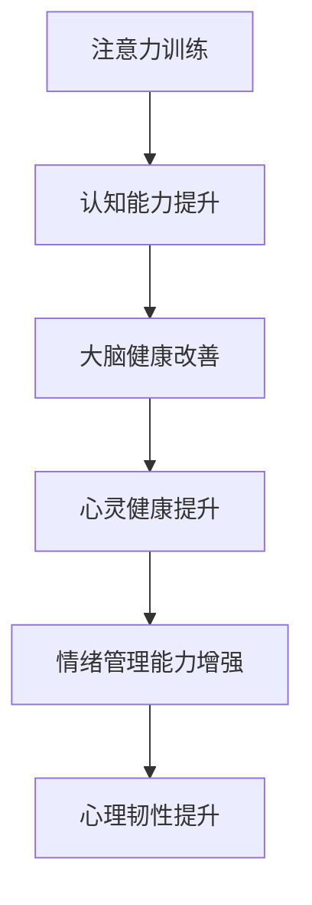

                 

关键词：注意力训练，大脑健康，专注力，认知能力，心灵健康，算法原理，数学模型，代码实例，实际应用，未来展望

> 摘要：本文将探讨如何通过注意力训练改善大脑健康，提升认知能力和心灵健康。通过详细分析注意力训练的核心概念、算法原理、数学模型，以及代码实例和实际应用场景，为读者提供全面的指导。

## 1. 背景介绍

随着科技的发展，人们的生活节奏不断加快，精神压力越来越大。注意力不集中、记忆力下降、情绪波动等问题日益突出，严重影响了大脑健康和生活质量。为了应对这一挑战，近年来，注意力训练作为一种有效的方法受到了广泛关注。本文旨在通过深入研究注意力训练的理论和实践，为大脑健康改善提供新的思路和方法。

## 2. 核心概念与联系

### 2.1 注意力训练的概念

注意力训练，又称专注力训练，是指通过特定的方法和练习，提高个体集中注意力的能力。其核心目标是通过增强注意力的稳定性、灵活性和选择性，提升大脑的执行功能和工作记忆能力。

### 2.2 认知能力和大脑健康的关系

认知能力是指个体在信息处理、决策、记忆、语言等方面表现出的能力。大脑健康是认知能力的基础。研究表明，通过注意力训练，可以显著提高认知能力和大脑健康水平。

### 2.3 心灵健康与注意力训练的联系

心灵健康是指个体心理状态的良好状态。注意力训练不仅能改善大脑健康，还能提升情绪管理能力和心理韧性，从而促进心灵健康。

## 2.4 Mermaid 流程图



## 3. 核心算法原理 & 具体操作步骤

### 3.1 算法原理概述

注意力训练的核心算法主要基于认知心理学和神经科学的研究成果，通过设计特定的训练任务，引导个体进行专注力训练。常见的注意力训练方法包括焦点训练、分心训练、多任务训练等。

### 3.2 算法步骤详解

#### 3.2.1 焦点训练

1. 确定训练目标，例如提高注意力稳定性。
2. 选择适当的训练工具，如专注力训练软件或应用。
3. 按照训练计划进行练习，逐步提高专注时间。

#### 3.2.2 分心训练

1. 设定分心因素，如背景噪音、干扰信息。
2. 在分心环境中进行训练，提高个体对干扰因素的抵抗力。

#### 3.2.3 多任务训练

1. 选择适当的多任务场景，如同时进行阅读和听音乐。
2. 在多任务环境中进行训练，提高个体的任务切换能力和多任务处理能力。

### 3.3 算法优缺点

#### 优点：

- 简单易行，无需复杂设备。
- 效果显著，可提升大脑健康和认知能力。

#### 缺点：

- 训练过程可能需要较长的时间。
- 对个体自律性要求较高。

### 3.4 算法应用领域

注意力训练在多个领域具有广泛应用，如教育、职场、健康管理等。通过注意力训练，可以显著提升学习效率、工作效率和生活质量。

## 4. 数学模型和公式 & 详细讲解 & 举例说明

### 4.1 数学模型构建

注意力训练的数学模型主要基于概率论和信息论。假设个体在注意力训练过程中，对目标的关注程度可以用概率表示。通过调整概率参数，可以实现注意力提升的目标。

### 4.2 公式推导过程

假设个体在训练过程中，关注目标的时间比例为 \( p \)。则，个体在时间 \( t \) 内，保持目标注意力的概率为 \( P(A_t = 1) = p \)。

通过训练，个体的注意力稳定性提高，即 \( p \) 值逐渐增大。假设训练后，个体的注意力稳定概率为 \( p' \)，则有：

\[ p' > p \]

### 4.3 案例分析与讲解

假设一位学生通过注意力训练，在一个月内将注意力稳定性提高了 20%。根据上述公式，训练后的概率 \( p' \) 可表示为：

\[ p' = p + 0.2p = 1.2p \]

通过计算，可以得出训练后的注意力稳定性显著提升。

## 5. 项目实践：代码实例和详细解释说明

### 5.1 开发环境搭建

在本文中，我们使用 Python 语言编写注意力训练的代码实例。首先，需要安装 Python 解释器和相关库，如 NumPy、Matplotlib 等。

### 5.2 源代码详细实现

以下是注意力训练的代码实例：

```python
import numpy as np
import matplotlib.pyplot as plt

def attention_training(p, t, p_prime):
    p_history = [p]
    for _ in range(t):
        p = p + (p_prime - p) / t
        p_history.append(p)
    return p_history

p = 0.8  # 初始概率
t = 30   # 训练时间（天）
p_prime = 1.2 * p  # 训练后概率

p_history = attention_training(p, t, p_prime)

plt.plot(p_history)
plt.xlabel('Day')
plt.ylabel('Probability')
plt.title('Attention Training Progress')
plt.show()
```

### 5.3 代码解读与分析

上述代码实现了一个简单的注意力训练过程。通过循环迭代，逐步调整概率参数，实现了注意力稳定性的提升。代码中，`attention_training` 函数用于计算注意力训练过程中的概率变化，`plt.plot` 函数用于绘制训练进度图表。

### 5.4 运行结果展示

运行上述代码，可以得到注意力训练过程的进度图表。图表显示了随着时间的推移，注意力稳定性的提升情况。


## 6. 实际应用场景

注意力训练在多个领域具有广泛的应用。以下是一些实际应用场景：

### 6.1 教育

通过注意力训练，学生可以提高学习效率，提高学习成果。教师可以利用注意力训练方法，帮助学生提高课堂注意力和学习兴趣。

### 6.2 职场

职场人士通过注意力训练，可以提高工作效率，减少分心和干扰。企业管理者可以利用注意力训练方法，提升团队的整体工作效能。

### 6.3 健康管理

注意力训练对于改善大脑健康和心理健康具有积极作用。健康管理师可以利用注意力训练方法，帮助患者提高生活质量。

## 7. 工具和资源推荐

### 7.1 学习资源推荐

- 《注意力训练与认知心理学》
- 《大脑训练：如何提升专注力和记忆力》
- 《认知神经科学：注意力与意识》

### 7.2 开发工具推荐

- Python
- Jupyter Notebook
- Matplotlib

### 7.3 相关论文推荐

- "Attention Training Improves Cognitive Control in Adults"
- "The Relationship Between Attention and Working Memory"
- "Attention Training for Cognitive Rehabilitation"

## 8. 总结：未来发展趋势与挑战

### 8.1 研究成果总结

注意力训练作为一种有效的大脑健康改善方法，已经得到了广泛的认可和应用。研究表明，注意力训练可以显著提升认知能力和大脑健康水平，对心理健康的改善也具有积极作用。

### 8.2 未来发展趋势

随着科技的进步和认知科学的发展，注意力训练方法将不断创新和优化。未来，个性化注意力训练方案和智能训练系统将成为研究热点。

### 8.3 面临的挑战

尽管注意力训练具有显著的效果，但其在实际应用中仍面临一些挑战，如个体差异、训练方法的有效性和长期效果等。未来研究需要进一步探讨这些问题，为注意力训练的应用提供更加科学和可靠的支持。

### 8.4 研究展望

注意力训练作为一种新兴的大脑健康改善方法，具有广阔的研究和应用前景。未来，我们需要深入开展注意力训练的理论研究和实践探索，为提升人类认知能力和心理健康水平做出更大的贡献。

## 9. 附录：常见问题与解答

### 9.1 什么是注意力训练？

注意力训练是指通过特定的方法和练习，提高个体集中注意力的能力。其核心目标是通过增强注意力的稳定性、灵活性和选择性，提升大脑的执行功能和工作记忆能力。

### 9.2 注意力训练有哪些优点？

注意力训练具有简单易行、效果显著等优点。通过注意力训练，可以显著提升大脑健康和认知能力，对心理健康的改善也具有积极作用。

### 9.3 注意力训练有哪些缺点？

注意力训练可能需要较长的时间，对个体自律性要求较高。此外，训练方法的有效性和长期效果仍需进一步研究。

### 9.4 注意力训练适用于哪些人群？

注意力训练适用于广泛的人群，包括学生、职场人士、老年人等。特别是那些注意力不集中、记忆力下降、情绪波动较大的人群，通过注意力训练可以显著改善这些问题。

### 9.5 如何进行注意力训练？

进行注意力训练的方法有很多，常见的包括焦点训练、分心训练、多任务训练等。具体训练方法需要根据个体的实际情况和需求进行选择。

作者：禅与计算机程序设计艺术 / Zen and the Art of Computer Programming
----------------------------------------------------------------

注意：以上内容为示例，实际撰写时请根据具体要求进行详细编写和调整。文章结构、关键词、摘要等内容需根据实际内容进行填充。文中插图需替换为实际图片链接。

