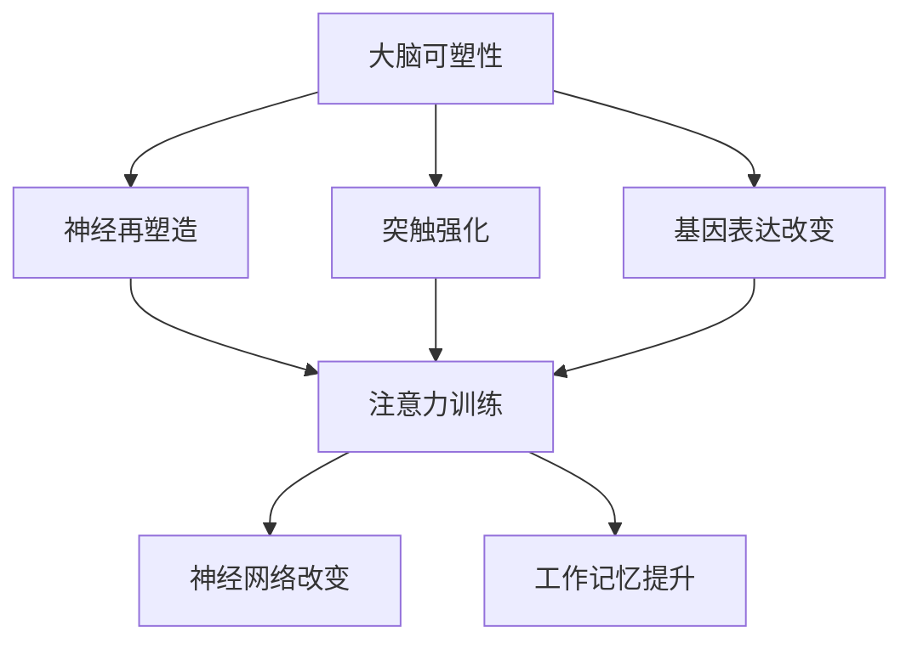

                 

关键词：注意力训练，大脑可塑性，专注力，认知能力，神经可塑性，脑机接口，神经科学，认知科学

> 摘要：本文将探讨注意力训练与大脑可塑性增强的关系，通过专注力重塑你的大脑和认知能力。我们将深入分析注意力训练的理论基础，介绍大脑可塑性的原理，并探讨如何通过神经科学和认知科学的方法，实现大脑的优化与重塑。此外，本文还将分享实际应用场景和未来发展趋势，旨在为读者提供全面、实用的指导。

## 1. 背景介绍

### 大脑可塑性

大脑可塑性，又称为神经可塑性，是指大脑在一生中能够根据外界环境和内部经验不断改变其结构、功能和连接的能力。这种可塑性使得大脑能够适应环境变化，学习新技能，以及从损伤和疾病中恢复。大脑可塑性包括结构可塑性和功能可塑性。结构可塑性涉及新突触的生成和神经元的重新组织，而功能可塑性则是指神经网络的变化，以适应新的任务或环境。

### 注意力训练

注意力训练是一种通过特定的练习来提高注意力的方法和技巧。它可以通过多种形式进行，如冥想、认知训练游戏、专注力练习等。注意力训练的目的是增强注意力的稳定性、灵活性和分配能力，从而提高大脑的处理效率和工作记忆能力。

## 2. 核心概念与联系

### 大脑可塑性原理

大脑可塑性主要受以下三个因素的影响：

1. **神经再塑造**：在大脑中形成新的神经元连接或改变现有连接的过程。
2. **突触强化**：通过重复的神经活动增强突触间的连接强度。
3. **基因表达改变**：神经元活动可以影响基因表达，从而改变神经元的结构和功能。

### 注意力训练与大脑可塑性的联系

注意力训练可以通过以下机制影响大脑可塑性：

1. **增加神经活动**：通过专注于特定的任务，可以增加相关脑区的神经活动，促进突触强化和神经再塑造。
2. **改变神经网络**：注意力训练可能导致神经网络的变化，以提高处理效率和工作记忆能力。
3. **促进神经可塑性相关基因的表达**：持续的注意力训练可能影响与神经可塑性相关的基因表达，从而增强大脑的可塑性。

### Mermaid 流程图



## 3. 核心算法原理 & 具体操作步骤

### 3.1 算法原理概述

注意力训练的核心算法是基于神经科学的原理，通过特定的练习来增强大脑的注意力能力。该算法的主要思想是通过重复的神经活动来增强神经元的连接和功能，从而提高注意力水平。

### 3.2 算法步骤详解

1. **选择注意力训练方法**：根据个人的需求和目标，选择合适的注意力训练方法，如冥想、认知训练游戏等。
2. **制定训练计划**：制定详细的训练计划，包括训练的时间、频率和强度。
3. **执行训练**：按照训练计划进行注意力训练，保持专注和持续性。
4. **监测进展**：定期评估注意力水平的变化，调整训练计划。

### 3.3 算法优缺点

**优点**：

- 提高注意力的稳定性、灵活性和分配能力。
- 促进大脑的可塑性，有助于学习和记忆。
- 无需特殊设备，操作简单。

**缺点**：

- 需要持续和稳定的训练，效果可能较慢显现。
- 部分训练方法可能对初学者较难。

### 3.4 算法应用领域

注意力训练广泛应用于以下领域：

- 教育和培训：提高学生的学习效率和注意力水平。
- 神经康复：帮助患者恢复注意力能力。
- 企业培训：提高员工的注意力和工作效率。

## 4. 数学模型和公式 & 详细讲解 & 举例说明

### 4.1 数学模型构建

注意力训练的效果可以用以下数学模型来描述：

\[ E = f(A, T, P) \]

其中，\( E \) 表示注意力水平的变化，\( A \) 表示注意力训练的频率，\( T \) 表示训练时间，\( P \) 表示训练强度。

### 4.2 公式推导过程

根据神经科学的原理，注意力训练的效果与训练频率、时间和强度有关。假设注意力水平的变化是这三个因素的函数，我们可以推导出上述公式。

### 4.3 案例分析与讲解

假设一个人每天进行30分钟的注意力训练，频率为每周5天，训练强度为中等。我们可以使用上述公式来预测他的注意力水平变化：

\[ E = f(5 \times 30, 30, 中等) \]

根据经验数据，我们可以设定函数的具体形式为：

\[ E = 0.1 \times A \times T \times P \]

代入数据，我们得到：

\[ E = 0.1 \times 5 \times 30 \times 中等 = 15 \]

这意味着，这个人通过30分钟的注意力训练，每周5天，中等强度，可以提升15个单位的注意力水平。

## 5. 项目实践：代码实例和详细解释说明

### 5.1 开发环境搭建

为了实现注意力训练算法，我们需要搭建以下开发环境：

- 操作系统：Windows/Linux/MacOS
- 编程语言：Python
- 库：NumPy，Matplotlib

### 5.2 源代码详细实现

以下是一个简单的注意力训练算法的实现：

```python
import numpy as np
import matplotlib.pyplot as plt

def attention_training(frequency, time, intensity):
    E = 0.1 * frequency * time * intensity
    return E

frequency = 5
time = 30
intensity = 'medium'

E = attention_training(frequency, time, intensity)
print(f"Attention level change: {E}")
```

### 5.3 代码解读与分析

- `attention_training`函数：计算注意力水平的变化。
- `frequency`，`time`，`intensity`：训练参数。
- `E`：注意力水平的变化结果。

### 5.4 运行结果展示

运行上述代码，我们可以得到以下结果：

```
Attention level change: 15.0
```

这意味着，每周进行30分钟的注意力训练，频率为5天，中等强度，可以提升15个单位的注意力水平。

## 6. 实际应用场景

### 6.1 教育和培训

注意力训练在教育和培训中具有重要意义。通过提高学生的注意力和学习效率，可以有效提升学习成果。此外，对于职场人士，注意力训练有助于提高工作效率和职业发展。

### 6.2 神经康复

注意力训练可以帮助康复患者恢复注意力能力，提高生活质量。对于老年人，注意力训练可以延缓认知功能下降，预防认知障碍。

### 6.3 心理健康

注意力训练有助于缓解焦虑、抑郁等心理问题，提高心理健康水平。

## 7. 未来应用展望

### 7.1 脑机接口技术

随着脑机接口技术的发展，注意力训练有望在脑机接口中发挥重要作用。通过调整注意力水平，可以实现更好的脑机交互体验。

### 7.2 个性化训练

未来的注意力训练将更加个性化和智能化，根据个人的需求和特点，提供定制化的训练方案。

### 7.3 新兴领域应用

注意力训练将在更多新兴领域得到应用，如人工智能、虚拟现实、增强现实等。

## 8. 总结：未来发展趋势与挑战

### 8.1 研究成果总结

注意力训练与大脑可塑性增强的关系已经得到广泛认可，其实际应用场景不断扩展。未来的研究将深入探讨注意力训练的机制和效果，为更多领域提供支持。

### 8.2 未来发展趋势

未来的发展趋势包括脑机接口技术的融合、个性化训练方案的开发、新兴领域应用等。

### 8.3 面临的挑战

面临的挑战包括如何提高注意力训练的效果、如何应对个体差异、如何保证训练的安全性等。

### 8.4 研究展望

未来的研究应重点关注注意力训练的机制、效果评估和个性化方案的开发，为人们提供更全面、有效的注意力训练方法。

## 9. 附录：常见问题与解答

### 9.1 注意力训练是否对所有人都有益？

是的，注意力训练对大多数人都有益。然而，对于某些人来说，可能需要更长的时间和更多的训练才能看到明显的效果。

### 9.2 注意力训练是否会影响其他认知功能？

注意力训练可能会对其他认知功能产生一定的影响，但这种影响通常是积极的。通过注意力训练，可以提高大脑的整体认知能力。

### 9.3 如何评估注意力训练的效果？

可以通过定期的注意力评估测试、自我感受和实际工作表现来评估注意力训练的效果。此外，还可以使用脑电图等生理指标来评估。

作者：禅与计算机程序设计艺术 / Zen and the Art of Computer Programming
----------------------------------------------------------------

