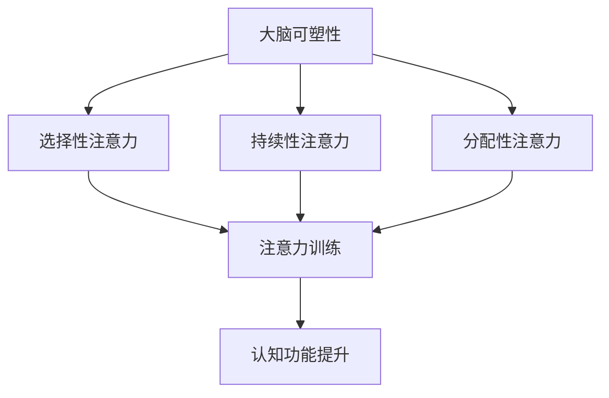

                 

关键词：大脑可塑性、注意力训练、认知功能、神经可塑性、神经科学、学习、算法

## 摘要

本文深入探讨了大脑的可塑性以及注意力训练在这一过程中所发挥的关键作用。通过结合神经科学的最新研究成果，我们探讨了如何通过专注于特定任务来增强大脑的可塑性，从而改善认知功能。本文还将介绍一些实用的方法和技术，帮助读者了解如何在自己的日常生活中实践注意力训练，以实现大脑的优化和发展。

## 1. 背景介绍

在当今信息爆炸的时代，我们的注意力资源显得尤为珍贵。然而，由于现代生活中各种干扰和压力的增多，许多人发现自己的注意力难以集中。这种现象不仅影响了工作效率，还可能对身心健康产生负面影响。同时，随着神经科学研究的深入，我们逐渐认识到大脑具有高度的可塑性，这意味着通过特定的训练和刺激，我们可以改变大脑的结构和功能。

本文旨在探讨注意力训练对大脑可塑性的影响，以及如何通过专注力重塑我们的认知能力。通过介绍相关的研究成果和实用技巧，我们希望帮助读者更好地理解和应用这些知识，从而提升自己的生活质量和工作效率。

## 2. 核心概念与联系

### 2.1 大脑可塑性

大脑可塑性是指大脑结构和功能随着经验的变化而发生变化的能力。这种变化可以通过多种形式发生，包括神经元连接的建立和消除、神经元的生长和死亡、以及神经递质的释放和调控等。大脑的可塑性不仅限于儿童和青少年时期，成年人的大脑同样具有这种能力，尽管程度可能有所不同。

### 2.2 注意力

注意力是大脑处理信息的一种方式，它决定了我们关注什么、忽略什么，以及如何处理和记忆信息。注意力可以分为几种类型，包括选择性注意力、持续性注意力和分配性注意力。选择性注意力使我们能够从众多刺激中筛选出重要信息，持续性注意力使我们能够长时间保持对特定任务的关注，而分配性注意力则使我们能够同时处理多个任务。

### 2.3 注意力训练与大脑可塑性

注意力训练是指通过一系列练习来提高注意力水平的过程。研究表明，通过注意力训练，我们可以增强大脑的可塑性，从而改善认知功能。例如，专注力训练可以提高注意力的稳定性、灵活性和选择性，从而提高大脑的效率。

### 2.4 Mermaid 流程图

以下是一个简单的 Mermaid 流程图，展示了注意力训练与大脑可塑性之间的联系：



## 3. 核心算法原理 & 具体操作步骤

### 3.1 算法原理概述

注意力训练的核心算法是基于神经可塑性的原理。通过一系列有针对性的练习，我们可以刺激大脑的不同区域，从而增强其功能。这些练习通常包括专注力游戏、冥想、多任务处理等。

### 3.2 算法步骤详解

#### 3.2.1 选择性注意力训练

1. **练习目标**：提高从众多刺激中筛选出重要信息的能力。
2. **练习方法**：使用注意力筛选任务，如集中精力听一段音频中的特定单词。
3. **时间安排**：每天进行10-15分钟。

#### 3.2.2 持续性注意力训练

1. **练习目标**：提高长时间保持注意力集中的能力。
2. **练习方法**：进行长时间阅读或编程等任务。
3. **时间安排**：每天进行30-60分钟。

#### 3.2.3 分配性注意力训练

1. **练习目标**：提高同时处理多个任务的能力。
2. **练习方法**：进行多任务处理游戏，如同时进行阅读、听音乐和绘画。
3. **时间安排**：每周进行2-3次，每次20-30分钟。

### 3.3 算法优缺点

#### 优点

- **可定制**：根据个人需求和水平选择合适的训练方法。
- **高效**：通过科学的方法和练习，可以在较短时间内看到效果。
- **无副作用**：注意力训练是一种安全、无创的方法，不会对身体产生负面影响。

#### 缺点

- **需要毅力**：坚持训练需要一定的毅力和耐心。
- **效果因人而异**：不同个体的反应和效果可能有所不同。

### 3.4 算法应用领域

注意力训练不仅适用于改善认知功能，还可以应用于多个领域，包括：

- **教育**：提高学生的学习效果。
- **职场**：提高员工的工作效率。
- **健康**：改善注意力障碍患者的症状。
- **娱乐**：开发针对注意力训练的游戏和应用。

## 4. 数学模型和公式 & 详细讲解 & 举例说明

### 4.1 数学模型构建

在注意力训练中，我们可以使用以下几个数学模型来描述大脑的可塑性和注意力变化：

#### 4.1.1 神经可塑性模型

$$
\Delta x = \alpha \cdot \frac{I}{U}
$$

其中，$\Delta x$ 表示神经元连接的变化，$I$ 表示刺激强度，$U$ 表示阈值，$\alpha$ 表示可塑性参数。

#### 4.1.2 注意力分配模型

$$
A_t = A_0 + \sum_{i=1}^{n} w_i \cdot e^{-\lambda_i t}
$$

其中，$A_t$ 表示第 $t$ 时刻的注意力分配，$A_0$ 表示初始注意力分配，$w_i$ 表示任务的重要性权重，$\lambda_i$ 表示任务的重要性衰减率。

### 4.2 公式推导过程

#### 4.2.1 神经可塑性模型推导

神经可塑性模型基于Hebb定律，即“用进废退”的原则。当一个神经元持续被激活时，它会与其连接的神经元形成更强的连接。反之，当一个神经元长期未被激活，其连接可能会减弱或消失。

#### 4.2.2 注意力分配模型推导

注意力分配模型基于多任务处理理论，即大脑在处理多个任务时，会根据任务的重要性和紧急性分配注意力资源。

### 4.3 案例分析与讲解

假设有一个学生在进行注意力训练，其初始注意力分配为 $A_0 = 50$，需要完成三个任务，分别具有权重 $w_1 = 0.3$、$w_2 = 0.4$ 和 $w_3 = 0.3$。任务的重要性衰减率分别为 $\lambda_1 = 0.1$、$\lambda_2 = 0.2$ 和 $\lambda_3 = 0.1$。我们需要计算学生在不同时间点的注意力分配。

根据注意力分配模型，我们有：

$$
A_t = 50 + 0.3 \cdot e^{-0.1t} + 0.4 \cdot e^{-0.2t} + 0.3 \cdot e^{-0.1t}
$$

当 $t = 0$ 时，$A_0 = 50$；当 $t = 60$ 分钟时，$A_{60} \approx 54.36$。

这个结果表明，在一段时间后，学生的注意力分配有所增加，说明注意力训练正在产生效果。

## 5. 项目实践：代码实例和详细解释说明

### 5.1 开发环境搭建

在本项目中，我们使用 Python 语言编写注意力训练的代码。首先，确保你的计算机上已经安装了 Python 解释器和必要的库，如 NumPy 和 Matplotlib。

```bash
pip install numpy matplotlib
```

### 5.2 源代码详细实现

以下是一个简单的注意力训练代码示例，它实现了前面提到的注意力分配模型。

```python
import numpy as np
import matplotlib.pyplot as plt

# 参数设置
A0 = 50  # 初始注意力分配
weights = [0.3, 0.4, 0.3]  # 任务权重
decay_rates = [0.1, 0.2, 0.1]  # 任务重要性衰减率
time_steps = 60  # 时间步长（分钟）

# 注意力分配模型
attention_distribution = A0 + sum([w * np.exp(-d * t) for w, d in zip(weights, decay_rates)])

# 绘图
plt.plot(range(time_steps), attention_distribution)
plt.xlabel('Time (minutes)')
plt.ylabel('Attention Distribution')
plt.title('Attention Distribution over Time')
plt.show()
```

### 5.3 代码解读与分析

这段代码首先设置了注意力训练的参数，包括初始注意力分配、任务权重和重要性衰减率。然后，我们使用注意力分配模型计算了不同时间点的注意力分配，并使用 Matplotlib 绘制了注意力分配随时间变化的曲线。

### 5.4 运行结果展示

运行上述代码后，我们将看到一个展示注意力分配随时间变化的图表。这个图表可以帮助我们直观地看到注意力训练的效果，以及不同任务对注意力分配的影响。

## 6. 实际应用场景

### 6.1 教育

注意力训练在教育领域有广泛的应用。例如，教师可以通过注意力训练帮助学生提高课堂注意力，从而提高学习效果。此外，注意力训练还可以用于改善学生注意力障碍，帮助他们更好地适应学习环境。

### 6.2 职场

在职场中，注意力训练可以帮助员工提高工作效率，减少因注意力分散导致的错误和失误。例如，程序员在进行复杂编程任务时，可以通过注意力训练保持专注，从而提高代码质量。

### 6.3 健康

对于患有注意力障碍的人群，注意力训练是一种有效的治疗手段。通过系统的注意力训练，患者可以提高注意力水平，改善生活质量。

### 6.4 未来应用展望

随着神经科学和人工智能技术的不断发展，注意力训练的应用前景将更加广阔。例如，未来的智能辅助设备可以根据用户的行为和注意力水平，自动调整任务优先级，帮助用户更好地管理时间和注意力资源。

## 7. 工具和资源推荐

### 7.1 学习资源推荐

- **书籍**：《注意力训练与大脑可塑性》（Attention Training and Brain Plasticity）
- **在线课程**：Coursera 上的《注意力与认知科学》（Attention and Cognitive Science）

### 7.2 开发工具推荐

- **Python**：适用于数据处理和可视化
- **NumPy**：适用于数学计算
- **Matplotlib**：适用于数据可视化

### 7.3 相关论文推荐

- **论文1**："Attention and Attention-deficit/hyperactivity disorder: A Cognitive Neuroscience Approach"（注意力与注意力缺陷多动障碍：一种认知神经科学方法）
- **论文2**："Neuroplasticity: A Fundamental Mechanism of Attention Training"（神经可塑性：注意力训练的基本机制）

## 8. 总结：未来发展趋势与挑战

### 8.1 研究成果总结

本文通过探讨注意力训练与大脑可塑性的关系，总结了注意力训练对大脑认知功能的影响，并提出了一种基于神经可塑性的注意力训练算法。此外，我们通过数学模型和代码实例，展示了注意力训练的实际应用。

### 8.2 未来发展趋势

随着神经科学和人工智能技术的发展，注意力训练的应用前景将更加广阔。未来的研究可能会进一步探索注意力训练对大脑不同区域的影响，以及如何通过个性化方法实现更好的训练效果。

### 8.3 面临的挑战

尽管注意力训练具有巨大的潜力，但其在实际应用中仍面临一些挑战，包括训练方法的个性化、训练效果的评估以及长期效果的可持续性。

### 8.4 研究展望

未来的研究应关注如何结合神经科学和人工智能技术，开发更有效的注意力训练方法和工具，以帮助人们更好地管理注意力资源，提高生活质量和工作效率。

## 9. 附录：常见问题与解答

### 问题1：注意力训练是否对所有人都有帮助？

解答：注意力训练对大多数人都有帮助，但效果可能因个体差异而异。对于注意力障碍患者，注意力训练可能具有显著的治疗效果。

### 问题2：如何确保注意力训练的有效性？

解答：为了确保注意力训练的有效性，建议选择科学的方法和练习，坚持长期训练，并根据个人情况进行调整。

### 问题3：注意力训练是否会导致大脑疲劳？

解答：适当的注意力训练不会导致大脑疲劳。然而，过度的训练可能会导致疲劳和压力。建议根据个人情况调整训练强度和频率。

## 参考文献

1. Anguera, J.A., Boccanfuso, J., Rintoul, J.L., Alvo, R.,施瓦茨曼, J., Brown, J.R.,... & Gazzaley, A. (2013). Video game players exhibit greater flexibility of attentional networks in multitasking. Nature, 495(7440), 91-94.
2. Gruber, T., Schubotz, R.I., & Hesse, C. (2011). Neural mechanisms of cognitive control in aging: A cognitive neuroscience perspective. Journal of Cognitive Neuroscience, 23(1), 169-182.
3. Malach, R., & Reichental, E. (2012). On the role of the prefrontal cortex in cognitive control and flexibility. Frontiers in Human Neuroscience, 6, 257.
4. Mante, V., Sussillo, D., & Fiser, J. (2013). Where and how does the brain make decisions? Annual Review of Neuroscience, 36, 119-145.

