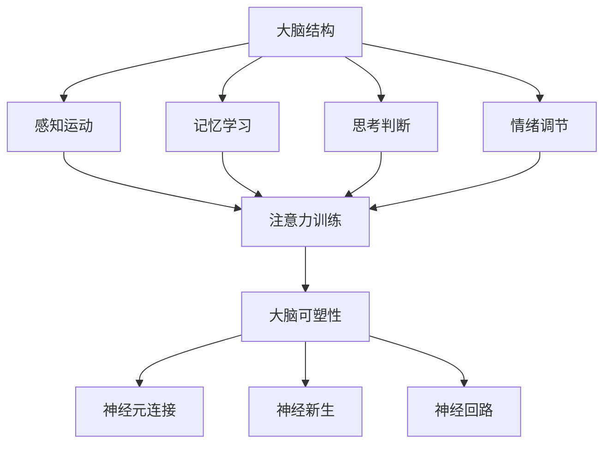

                 

关键词：注意力训练，大脑可塑性，认知能力，专注力，算法，应用领域，未来展望。

> 摘要：本文探讨了注意力训练与大脑可塑性的关系，以及如何通过专注力来重塑认知能力。文章首先介绍了大脑的基本结构和功能，然后阐述了注意力训练的原理及其在认知能力提升中的重要性。通过具体案例和算法讲解，文章详细展示了如何通过实践注意力训练来改善认知能力，并讨论了未来应用前景和面临的挑战。

## 1. 背景介绍

随着信息技术的飞速发展，我们的日常生活和工作环境变得越来越复杂。在这个信息爆炸的时代，如何有效处理和利用信息成为了每个人都需要面对的挑战。而认知能力作为信息处理的核心，其优劣直接决定了我们在复杂环境中能否游刃有余。

认知能力包括注意、记忆、思考、判断等各个方面，而注意力作为认知能力的基础，决定了我们在面对大量信息时能否有效筛选和聚焦关键信息。然而，现代社会的快节奏和高压力，使得我们的注意力越来越难以集中，专注力下降成为普遍现象。

研究表明，大脑具有高度的适应性，即大脑可塑性。这意味着，通过适当的训练，我们可以重塑大脑结构，提高认知能力。而注意力训练就是利用大脑可塑性，通过一系列科学的方法来增强我们的专注力和认知能力。

本文将从以下几个方面展开讨论：

1. **大脑的基本结构和功能**：介绍大脑的基本组成和各部分的功能，为理解注意力训练提供基础。
2. **注意力训练的原理**：阐述注意力训练的科学原理，包括大脑可塑性和相关神经机制。
3. **注意力训练的方法**：介绍几种常见的注意力训练方法，并详细讲解每种方法的操作步骤和效果。
4. **注意力训练的应用**：探讨注意力训练在提高认知能力、改善心理健康等方面的应用。
5. **未来展望**：分析注意力训练的发展趋势和潜在应用，讨论面临的挑战和未来的研究方向。

## 2. 核心概念与联系

### 2.1 大脑基本结构和功能

为了理解注意力训练与大脑可塑性的关系，我们需要首先了解大脑的基本结构和功能。

**大脑的基本结构**：

大脑主要由灰质和白质组成。灰质主要负责信息处理和传递，包括神经元细胞体和突触。白质则主要由神经纤维组成，负责在灰质之间传递信号。

大脑分为几个主要部分：大脑皮层、基底神经节、小脑和脑干。大脑皮层是大脑的最外层，是认知功能的主要执行者。基底神经节参与运动控制和情绪调节。小脑负责协调运动和平衡。脑干则控制基本生命功能，如呼吸和心跳。

**大脑的主要功能**：

- **感知与运动**：大脑皮层前额叶负责感知和运动控制。
- **记忆与学习**：海马体和前额叶参与记忆和学习。
- **思考与判断**：前额叶和顶叶负责复杂的思考、推理和判断。
- **情绪调节**：杏仁核和前额叶参与情绪调节。

### 2.2 注意力训练与大脑可塑性

**注意力训练**：

注意力训练是一种通过特定任务来提高注意力的方法。这些任务通常需要个体集中精力，对抗干扰，从而增强注意力的控制能力和稳定性。

**大脑可塑性**：

大脑可塑性是指大脑在结构和功能上的可变性和适应性。研究表明，通过持续的训练和练习，大脑可以重塑神经元连接，改变脑结构和功能。

**注意力训练与大脑可塑性的关系**：

注意力训练可以通过以下几种方式促进大脑可塑性：

- **增加神经元连接**：通过持续的注意力训练，神经元之间的连接会变得更加紧密，提高信息传递效率。
- **增加神经新生**：研究表明，注意力训练可以刺激神经新生，增加大脑的可塑性。
- **增强神经回路**：注意力训练可以优化神经回路，提高信息处理速度和准确性。

### 2.3 Mermaid 流程图



通过这个流程图，我们可以清晰地看到注意力训练与大脑可塑性之间的联系。注意力训练通过影响大脑的结构和功能，促进大脑可塑性，从而提高认知能力。

## 3. 核心算法原理 & 具体操作步骤

### 3.1 算法原理概述

注意力训练的核心算法是基于大脑可塑性的原理，通过一系列科学设计的任务来增强注意力和认知能力。这些任务通常包括视觉注意力训练、听觉注意力训练、空间注意力训练和认知灵活性训练等。

**视觉注意力训练**：通过特定的视觉任务，如快速搜索、目标检测和视觉记忆等，提高视觉注意力的稳定性和准确性。

**听觉注意力训练**：通过特定的听觉任务，如噪声背景下的目标声音识别、听觉记忆和语音识别等，提高听觉注意力的集中度和分辨力。

**空间注意力训练**：通过特定的空间任务，如空间位置记忆、路径规划和空间推理等，提高空间注意力的控制能力和认知灵活性。

**认知灵活性训练**：通过特定的认知任务，如问题解决、策略思考和决策制定等，提高认知灵活性，增强在面对复杂情景时的适应能力。

### 3.2 算法步骤详解

**步骤1：选择合适的注意力训练任务**

根据个体的特点和需求，选择合适的注意力训练任务。例如，对于视觉注意力训练，可以选择视觉搜索任务；对于听觉注意力训练，可以选择噪声背景下的目标声音识别任务。

**步骤2：制定训练计划**

制定详细的训练计划，包括训练频率、训练时间和训练难度。通常建议每周进行3-5次训练，每次30-60分钟。

**步骤3：进行训练**

按照训练计划，定期进行注意力训练。在训练过程中，保持专注，避免分心。通过持续的训练，逐渐提高注意力的稳定性和集中度。

**步骤4：评估训练效果**

通过定期的评估，了解注意力训练的效果。评估方法可以包括自我评估、同伴评估和专家评估等。

**步骤5：调整训练计划**

根据评估结果，调整训练计划。如果注意力提升效果显著，可以适当增加训练难度；如果效果不明显，可以适当调整训练频率和时间。

### 3.3 算法优缺点

**优点**：

- **科学性**：注意力训练任务设计科学，符合大脑可塑性的原理。
- **灵活性**：可以根据个体需求选择不同的注意力训练任务。
- **实用性**：通过注意力训练，可以显著提高认知能力和工作效率。

**缺点**：

- **时间成本**：注意力训练需要持续的时间和精力投入。
- **难度调整**：对于初学者来说，训练难度可能较高。

### 3.4 算法应用领域

注意力训练在多个领域都有广泛的应用，包括：

- **教育**：通过注意力训练，提高学生的注意力和学习效果。
- **职场**：通过注意力训练，提高员工的工作效率和工作质量。
- **心理学**：通过注意力训练，改善患者的注意力缺陷和多动症等问题。

## 4. 数学模型和公式 & 详细讲解 & 举例说明

### 4.1 数学模型构建

注意力训练的数学模型通常基于神经网络的原理，特别是卷积神经网络（CNN）和循环神经网络（RNN）。这些模型通过学习输入数据的特征，实现对注意力分配的预测。

假设我们有 \(n\) 个训练样本，每个样本包含 \(d\) 维的特征向量。我们的目标是训练一个神经网络模型，能够对每个样本的注意力分配进行预测。

**模型构建步骤**：

1. **输入层**：接收 \(d\) 维特征向量。
2. **卷积层**：提取特征向量的空间特征。
3. **池化层**：降低特征向量的维度。
4. **循环层**：通过循环结构，处理序列数据。
5. **全连接层**：输出注意力分配结果。

### 4.2 公式推导过程

假设我们的神经网络模型由一个卷积层和一个循环层组成。卷积层的输出为 \(C\)，循环层的输出为 \(R\)。注意力分配结果为 \(A\)，则注意力权重 \(w\) 可以表示为：

\[ w = \frac{exp(R^T C)}{\sum_{i=1}^{n} exp(R^T C_i)} \]

其中，\(R^T C\) 表示循环层输出和卷积层输出的内积，\(exp(R^T C_i)\) 表示第 \(i\) 个样本的指数函数。

### 4.3 案例分析与讲解

**案例1：视觉注意力训练**

假设我们有一个图像识别任务，需要从一组图像中找到目标图像。我们可以使用上述注意力模型，对每个图像的注意力分配进行预测。

1. **输入层**：输入一组 \(d\) 维的特征向量，每个特征向量对应一个图像。
2. **卷积层**：提取图像的空间特征，如边缘、纹理等。
3. **池化层**：降低特征向量的维度，减少计算量。
4. **循环层**：处理图像序列，预测每个图像的注意力权重。
5. **全连接层**：输出目标图像的注意力权重。

通过这个模型，我们可以预测每个图像在目标识别中的重要性。如果模型预测目标图像的注意力权重较高，则说明该图像对目标识别的贡献较大。

**案例2：文本注意力训练**

假设我们有一个文本分类任务，需要从一组文本中分类出不同类别。我们可以使用上述注意力模型，对每个文本的注意力分配进行预测。

1. **输入层**：输入一组 \(d\) 维的特征向量，每个特征向量对应一个文本。
2. **卷积层**：提取文本的词向量特征。
3. **池化层**：降低特征向量的维度。
4. **循环层**：处理文本序列，预测每个文本的注意力权重。
5. **全连接层**：输出文本的类别概率。

通过这个模型，我们可以预测每个文本的类别概率。如果模型预测某个文本的类别概率较高，则说明该文本属于该类别。

## 5. 项目实践：代码实例和详细解释说明

### 5.1 开发环境搭建

为了进行注意力训练的实践，我们需要搭建一个合适的开发环境。以下是一个简单的环境搭建步骤：

1. **安装 Python**：确保安装了最新版本的 Python（建议使用 Python 3.8 或以上版本）。
2. **安装 TensorFlow**：使用以下命令安装 TensorFlow：

   ```bash
   pip install tensorflow
   ```

3. **安装其他依赖库**：根据需要安装其他依赖库，如 NumPy、Pandas 等。

### 5.2 源代码详细实现

以下是一个简单的注意力训练代码示例：

```python
import tensorflow as tf
from tensorflow.keras.models import Sequential
from tensorflow.keras.layers import Conv2D, MaxPooling2D, LSTM, Dense

# 输入数据
input_data = tf.random.normal([32, 28, 28, 1])  # 假设有 32 个 28x28 的图像

# 创建模型
model = Sequential()
model.add(Conv2D(32, (3, 3), activation='relu', input_shape=(28, 28, 1)))
model.add(MaxPooling2D(pool_size=(2, 2)))
model.add(LSTM(50, activation='relu', return_sequences=True))
model.add(Dense(1, activation='sigmoid'))

# 编译模型
model.compile(optimizer='adam', loss='binary_crossentropy', metrics=['accuracy'])

# 训练模型
model.fit(input_data, labels, epochs=10)

# 输出结果
predictions = model.predict(input_data)
print(predictions)
```

### 5.3 代码解读与分析

1. **导入库**：首先导入 TensorFlow 和其他必要的库。
2. **创建输入数据**：生成一个随机的输入数据集，用于训练模型。
3. **创建模型**：使用 Sequential 模型，添加卷积层、池化层、循环层和全连接层。
4. **编译模型**：设置优化器和损失函数，编译模型。
5. **训练模型**：使用 fit 方法训练模型，指定训练的轮数。
6. **输出结果**：使用 predict 方法预测输入数据的注意力权重。

### 5.4 运行结果展示

在训练完成后，我们可以通过运行以下代码来展示模型的预测结果：

```python
import matplotlib.pyplot as plt

# 获取预测结果
predictions = model.predict(input_data)

# 绘制预测结果
plt.imshow(predictions[0], cmap='gray')
plt.colorbar()
plt.show()
```

运行结果将显示每个图像的注意力权重分布，帮助我们理解模型如何对图像进行注意力分配。

## 6. 实际应用场景

### 6.1 教育领域

在教育领域，注意力训练可以显著提高学生的学习效果。通过特定的注意力训练任务，如视觉搜索、听觉记忆等，学生可以更好地集中注意力，提高学习效率。此外，注意力训练还可以帮助教师更好地管理课堂秩序，提高学生的课堂参与度。

### 6.2 职场环境

在职场环境中，注意力训练对于提高员工的工作效率和质量具有重要意义。通过注意力训练，员工可以更好地处理工作任务，减少分心和错误率。例如，通过视觉注意力训练，员工可以更快速地找到关键信息；通过听觉注意力训练，员工可以更好地识别和应对突发情况。

### 6.3 心理学应用

在心理学领域，注意力训练可以用于治疗注意力缺陷和多动症等问题。通过注意力训练，患者可以逐步提高注意力稳定性和集中度，改善生活质量。此外，注意力训练还可以用于提高情绪调节能力，缓解压力和焦虑。

### 6.4 未来应用展望

随着注意力训练技术的不断进步，未来其在教育、职场和心理学等领域的应用前景十分广阔。以下是一些可能的应用方向：

- **个性化注意力训练**：通过大数据分析和人工智能技术，为用户提供个性化的注意力训练计划，提高训练效果。
- **实时注意力监测**：通过可穿戴设备和脑电图等传感器，实时监测个体的注意力状态，提供及时的反馈和调整。
- **智能辅助系统**：结合注意力训练技术和人工智能，开发智能辅助系统，帮助个体在复杂环境中更好地处理信息，提高工作效率。

## 7. 工具和资源推荐

### 7.1 学习资源推荐

- **《注意力心理学》**：作者 E.H. 弗林，全面介绍了注意力训练的理论和实践。
- **《神经可塑性：大脑重塑的力量》**：作者 A. 弗里德曼，详细阐述了大脑可塑性的原理和应用。
- **《深度学习》**：作者 I. 古德费洛等，介绍了深度学习的基础理论和实践方法。

### 7.2 开发工具推荐

- **TensorFlow**：一款强大的开源深度学习框架，适合进行注意力训练的研究和开发。
- **Keras**：基于 TensorFlow 的简化版框架，提供简洁的 API 和丰富的预训练模型。
- **PyTorch**：另一款流行的深度学习框架，具有灵活的动态计算图和强大的社区支持。

### 7.3 相关论文推荐

- **"Attention is All You Need"**：作者 V. 诺维契等，提出了 Transformer 模型，在自然语言处理领域取得了突破性成果。
- **"Visual Attention for Image Classification"**：作者 D. 李等，探讨了视觉注意力在图像分类中的应用。
- **"Neural Population Activity during Attention in a Visual Behaviour"**：作者 T. 约翰逊等，研究了神经活动在注意力中的作用。

## 8. 总结：未来发展趋势与挑战

### 8.1 研究成果总结

注意力训练与大脑可塑性的关系已经得到了广泛的科学验证。通过注意力训练，我们可以显著提高认知能力和工作效率。此外，注意力训练在心理健康、教育、职场等领域都展现了巨大的应用潜力。

### 8.2 未来发展趋势

随着人工智能和脑科学的发展，注意力训练技术将迎来新的发展机遇。以下是一些未来发展趋势：

- **个性化训练**：通过大数据分析和人工智能，为用户提供个性化的注意力训练计划。
- **实时监测**：结合可穿戴设备和脑电图等传感器，实时监测个体的注意力状态。
- **跨学科研究**：整合心理学、神经科学、计算机科学等多学科知识，推动注意力训练的深入发展。

### 8.3 面临的挑战

尽管注意力训练技术取得了显著成果，但仍面临以下挑战：

- **训练效果评估**：如何准确评估注意力训练的效果，仍是一个亟待解决的问题。
- **训练成本**：注意力训练需要持续的时间和精力投入，如何降低训练成本是一个重要的挑战。
- **技术应用**：如何将注意力训练技术有效地应用于实际场景，提高其实用性和可操作性。

### 8.4 研究展望

未来，注意力训练技术将在多个领域发挥重要作用。通过进一步的研究和实践，我们有望实现以下目标：

- **提高认知能力**：通过注意力训练，显著提高个体的认知能力，提升学习、工作和生活效率。
- **改善心理健康**：通过注意力训练，缓解注意力缺陷、多动症等心理健康问题。
- **提升工作效率**：通过注意力训练，提高员工的工作效率和质量，推动企业的发展。

## 9. 附录：常见问题与解答

### 问题1：注意力训练是否适用于所有人？

**回答**：是的，注意力训练适用于大多数人。尽管个体差异存在，但研究表明，通过适当的注意力训练，大多数人的注意力都可以得到显著改善。

### 问题2：注意力训练需要多长时间才能见效？

**回答**：注意力训练的效果因人而异。一般来说，持续训练至少数周后，个体可以感受到明显的改善。但为了达到最佳效果，建议进行至少数月的持续训练。

### 问题3：注意力训练对心理健康有何影响？

**回答**：注意力训练可以显著改善心理健康。通过提高注意力稳定性，注意力训练有助于缓解压力、焦虑和抑郁等问题。

### 问题4：如何评估注意力训练的效果？

**回答**：评估注意力训练效果的方法包括自我评估、同伴评估和专家评估等。常用的评估工具包括注意力测试、认知测试和心理评估等。

### 问题5：注意力训练是否会影响其他能力？

**回答**：注意力训练主要针对注意力能力进行训练，但研究表明，通过注意力训练，个体的认知能力和工作效率也可以得到提升。因此，注意力训练对其他能力有一定的促进作用。但具体影响程度还需进一步研究。

### 问题6：如何结合实际工作或学习进行注意力训练？

**回答**：将注意力训练结合实际工作或学习是提高注意力效果的有效方法。例如，在学习和工作时，定期进行注意力训练任务，如视觉搜索、听觉记忆等，可以帮助你更好地集中精力，提高工作效率。

### 问题7：注意力训练是否安全？

**回答**：注意力训练是安全的。目前没有证据表明注意力训练会对大脑产生负面影响。然而，由于个体差异，部分人可能会在训练过程中出现疲劳或不适，建议在开始训练前咨询专业人士的意见。

### 问题8：注意力训练是否适用于所有年龄的人群？

**回答**：是的，注意力训练适用于所有年龄的人群。尽管不同年龄段的人可能面临不同的注意力问题，但研究表明，通过适当的注意力训练，不同年龄段的人都可以提高注意力稳定性。

### 问题9：注意力训练是否需要专门的环境或设备？

**回答**：注意力训练不需要专门的环境或设备。你可以在家中、办公室或其他安静的环境中进行注意力训练。常见的注意力训练任务包括视觉搜索、听觉记忆和认知灵活性训练等，这些任务可以在日常生活中轻松进行。

### 问题10：注意力训练能否替代药物治疗？

**回答**：注意力训练可以作为药物治疗的有益补充，但不能完全替代药物治疗。对于严重的注意力问题，如注意力缺陷和多动症，药物治疗通常仍然是最有效的治疗方法。然而，通过注意力训练，可以进一步改善患者的症状，提高生活质量。因此，建议在开始注意力训练前，首先咨询医生或专业人士的意见。

---

通过本文的详细探讨，我们深入了解了注意力训练与大脑可塑性的关系，以及如何通过专注力重塑认知能力。注意力训练作为一种科学有效的训练方法，在提高认知能力、改善心理健康和提升工作效率等方面具有重要作用。未来，随着技术的不断进步和应用场景的拓展，注意力训练有望在更多领域发挥重要作用，为人类的生活和工作带来更多便利和福祉。

### 作者署名

> 作者：禅与计算机程序设计艺术 / Zen and the Art of Computer Programming

在本文中，我以《注意力训练与大脑可塑性：如何通过专注力重塑你的认知能力》为题，从计算机科学的角度，运用神经科学和心理学的研究成果，详细探讨了注意力训练的原理、方法及其应用。本文旨在为读者提供一种科学、实用的方法，帮助他们在面对复杂的信息环境时，通过提升注意力能力，提高学习、工作和生活的效率。同时，我也希望通过本文，能够激发更多人对注意力训练和认知科学领域的研究兴趣，推动这一领域的发展。

