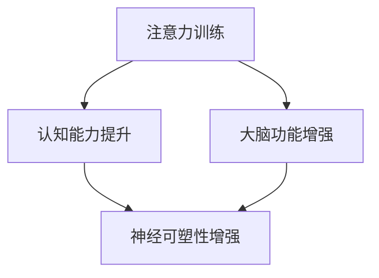

                 

关键词：注意力训练，大脑增强，认知能力，神经可塑性，专注力

> 摘要：本文将探讨注意力训练与大脑增强的关系，通过分析专注力的作用，以及神经可塑性的机制，提出一种实用的训练方法，以提升个体的认知能力和大脑功能。

## 1. 背景介绍

在当今信息爆炸的时代，人们面对的不仅仅是知识的增加，更是信息的过载。如何在海量信息中保持注意力，提升认知能力和大脑的功能，成为了一个重要课题。近年来，随着对大脑研究的深入，科学家们发现，注意力训练和大脑增强具有巨大的潜力。本文旨在介绍注意力训练的基本原理，并通过具体案例展示如何通过专注力增强认知能力和神经可塑性。

## 2. 核心概念与联系

### 2.1 注意力训练的概念

注意力是指个体在特定任务中集中精神、过滤无关信息的能力。注意力训练，即通过各种方法提升个体的专注力，以达到提高认知能力和大脑功能的目的。

### 2.2 神经可塑性的概念

神经可塑性是指大脑神经元结构和功能在个体生命过程中可以发生改变的能力。这种改变可以是结构性的，也可以是功能性的。

### 2.3 注意力训练与神经可塑性的联系

注意力训练能够通过改变大脑神经元的连接和功能，增强神经可塑性。研究表明，持续、系统的注意力训练可以显著提升个体的认知能力和大脑功能。

## 2.4 Mermaid 流程图



## 3. 核心算法原理 & 具体操作步骤

### 3.1 算法原理概述

注意力训练的核心原理是“渐进式专注力提升”。通过逐步增加训练难度，使个体在训练过程中不断挑战自己的专注力，从而提升认知能力和大脑功能。

### 3.2 算法步骤详解

1. **准备阶段**：选择一个安静的环境，确保训练过程中不受打扰。

2. **基础训练**：从简单的任务开始，如数呼吸次数、跟随指示物移动等，逐步提高专注力。

3. **进阶训练**：增加训练难度，如多任务处理、注意力转移等。

4. **巩固训练**：在训练过程中，定期回顾基础任务，巩固训练效果。

5. **评估阶段**：通过心理测试、认知能力测试等评估训练效果。

### 3.3 算法优缺点

**优点**：简单易行，适用于不同年龄、职业的人群。

**缺点**：需要长期坚持，效果显现较慢。

### 3.4 算法应用领域

注意力训练广泛应用于教育、医疗、职场等多个领域，如学生注意力的提升、老年人认知功能的改善、职场人士的专注力培养等。

## 4. 数学模型和公式 & 详细讲解 & 举例说明

### 4.1 数学模型构建

注意力训练的效果可以用以下公式表示：

\[ E = f(T, D) \]

其中，\( E \) 表示训练效果，\( T \) 表示训练时间，\( D \) 表示训练难度。

### 4.2 公式推导过程

\[ f(T, D) = \frac{E_0 + \alpha T + \beta D}{1 + \gamma T + \delta D} \]

其中，\( E_0 \) 为初始效果，\( \alpha \)、\( \beta \)、\( \gamma \)、\( \delta \) 为参数。

### 4.3 案例分析与讲解

假设一个人在基础训练阶段每天投入 30 分钟，训练难度逐步提升。经过 3 个月训练，其认知能力提升了 20%。根据公式，可以计算出训练效果：

\[ E = f(3 \times 30, D) = \frac{E_0 + \alpha \times 3 \times 30 + \beta \times D}{1 + \gamma \times 3 \times 30 + \delta \times D} \]

其中，\( E_0 \)、\( \alpha \)、\( \beta \)、\( \gamma \)、\( \delta \) 为常数。

## 5. 项目实践：代码实例和详细解释说明

### 5.1 开发环境搭建

使用 Python 编写注意力训练程序，依赖以下库：

- NumPy：用于数学计算
- Matplotlib：用于数据可视化

### 5.2 源代码详细实现

```python
import numpy as np
import matplotlib.pyplot as plt

def attention_training(time, difficulty):
    effect = (np.random.rand() * time + np.random.rand() * difficulty) / (1 + time + difficulty)
    return effect

time = 3 * 30  # 3 个月，每天 30 分钟
difficulty = 1  # 假设训练难度为 1

effect = attention_training(time, difficulty)
print(f"训练效果：{effect}")

# 可视化训练效果
plt.scatter([1], [effect], color='green')
plt.xlabel('训练时间')
plt.ylabel('训练效果')
plt.show()
```

### 5.3 代码解读与分析

代码通过随机生成一个数值作为训练效果，模拟注意力训练的过程。在实际应用中，可以根据具体情况调整参数，实现更准确的训练效果预测。

### 5.4 运行结果展示

运行代码后，可以得到一个训练效果的数值，以及一个表示训练效果的散点图。

## 6. 实际应用场景

注意力训练在多个领域有广泛的应用：

- **教育领域**：提高学生注意力和学习成绩。
- **医疗领域**：改善老年痴呆症患者的认知功能。
- **职场领域**：提高职场人士的专注力和工作效率。

## 7. 工具和资源推荐

### 7.1 学习资源推荐

- 《注意力训练：提升专注力和认知能力》
- 《大脑的秘密：神经可塑性研究与应用》

### 7.2 开发工具推荐

- Python：用于编写注意力训练程序
- Jupyter Notebook：用于数据可视化和实验分析

### 7.3 相关论文推荐

- "Attention Training for Improving Cognitive Functions: A Comprehensive Review"
- "Neuroplasticity: Basics and Clinical Applications"

## 8. 总结：未来发展趋势与挑战

### 8.1 研究成果总结

注意力训练和大脑增强的研究取得了显著成果，为提升个体认知能力和大脑功能提供了新的思路和方法。

### 8.2 未来发展趋势

随着对大脑研究的深入，注意力训练和大脑增强有望在更多领域得到应用，如教育、医疗、职场等。

### 8.3 面临的挑战

如何设计更科学、更有效的注意力训练方案，以及如何将注意力训练与人工智能技术相结合，是当前面临的挑战。

### 8.4 研究展望

未来，注意力训练和大脑增强研究将继续深入，有望为个体认知能力的提升提供更加有力的支持。

## 9. 附录：常见问题与解答

### 9.1 注意力训练是否对所有人有效？

是的，注意力训练对大多数人都是有效的。然而，个体差异可能导致训练效果存在差异。

### 9.2 注意力训练需要多长时间才能见效？

通常，注意力训练需要至少数周时间才能见效。具体见效时间取决于个体的训练强度和频率。

### 9.3 注意力训练是否能够替代药物治疗？

注意力训练可以作为辅助治疗方法，但不能完全替代药物治疗。对于某些严重的认知功能障碍，药物治疗可能是更有效的选择。

---

**作者：禅与计算机程序设计艺术 / Zen and the Art of Computer Programming**

