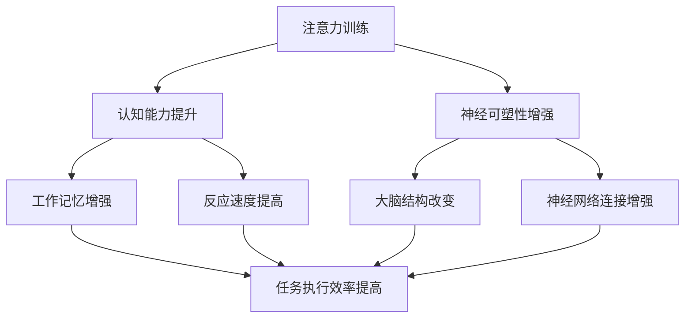

                 

关键词：注意力训练，大脑增强，认知能力，神经可塑性，专注力，算法原理，数学模型，项目实践，应用场景

> 摘要：本文深入探讨了注意力训练与大脑增强的关系，阐述了如何通过专注力增强认知能力和神经可塑性。通过详细分析注意力训练的核心概念与联系，本文提出了具体的算法原理与操作步骤，并引入了数学模型和公式，结合项目实践展示了其有效性和应用前景。本文旨在为读者提供一套系统、实用的方法，帮助提升大脑性能和认知能力。

## 1. 背景介绍

随着科技的迅猛发展和信息爆炸，我们的日常生活和工作环境变得越来越复杂。面对海量的信息和日益增加的工作压力，如何有效地管理注意力，提高认知能力和工作效率，成为了众多专业人士和普通大众共同关心的问题。注意力是一种重要的心理资源，它决定了我们对信息的感知、处理和记忆能力。然而，由于现代生活节奏的加快，许多人面临着注意力分散、专注力不足的问题，这直接影响了他们的认知能力和工作表现。

研究表明，通过科学的注意力训练，可以显著提高大脑的认知功能，增强神经可塑性，从而提升整体大脑性能。注意力训练不仅仅是一种简单的练习，它涉及到大脑的多个区域和复杂的过程。近年来，随着神经科学和认知心理学的发展，人们开始从不同的角度研究注意力训练的机制和效果，为大脑增强提供了新的思路和方法。

本文将从以下几个方面展开讨论：首先，介绍注意力训练的核心概念和原理；其次，分析注意力训练的算法原理与具体操作步骤；然后，引入数学模型和公式，结合具体案例进行讲解；接着，通过项目实践展示注意力训练的应用效果；最后，探讨注意力训练的实际应用场景和未来发展趋势。

通过本文的阅读，读者将了解注意力训练的基本概念，掌握核心算法原理，并能够应用数学模型进行实际操作，最终实现大脑性能的提升和认知能力的增强。

## 2. 核心概念与联系

### 注意力训练的概念

注意力训练是指通过特定的练习和任务，有意识地提高个体对特定信息或任务的注意力和专注能力。它不仅仅关注于集中注意力，更强调通过持续的训练，增强大脑处理信息的能力。注意力训练的目标是提高个体的认知灵活性、反应速度和工作记忆，从而提高整体认知能力和工作效率。

### 大脑增强与认知能力的关系

大脑增强是指通过各种方法，包括认知训练、体育锻炼、健康饮食等，提升大脑的功能和性能。认知能力是大脑处理信息、解决问题和执行任务的能力，包括注意力、记忆力、执行功能、语言能力等多个方面。研究表明，注意力训练可以直接增强大脑的认知能力，这是因为注意力训练涉及到大脑多个区域的协同作用，特别是前额叶皮层和基底神经节等关键结构。

### 神经可塑性在注意力训练中的作用

神经可塑性是指大脑神经元和神经网络在结构和功能上的可塑性，即大脑通过学习和训练改变自身结构和功能的能力。注意力训练通过持续的训练，可以增强神经可塑性，促进神经元之间的连接和通信，从而提高大脑处理信息的效率。神经可塑性不仅增强了注意力训练的效果，也为大脑的长期适应和改善提供了基础。

### 注意力训练与认知能力、神经可塑性的联系

注意力训练与认知能力和神经可塑性之间存在着密切的联系。一方面，注意力训练通过提升个体的注意力水平和认知灵活性，增强大脑的执行功能和信息处理能力，从而提高认知能力。另一方面，注意力训练促进了神经可塑性，通过改变大脑结构和神经网络的连接，实现认知功能的提升。

为了更直观地理解这些概念之间的联系，我们可以通过一个Mermaid流程图来展示：



在这个流程图中，注意力训练作为输入，通过提升认知能力和增强神经可塑性，最终实现工作记忆增强、反应速度提高和任务执行效率提升。这个流程图清晰地展示了注意力训练与大脑增强之间的关系。

通过这一部分的分析，我们可以看到，注意力训练不仅仅是简单的集中注意力，它涉及到认知能力提升、神经可塑性增强等多个方面，对于大脑的整体功能提升具有重要意义。

### 3. 核心算法原理 & 具体操作步骤

#### 3.1 算法原理概述

注意力训练的核心算法原理基于认知心理学和神经科学的研究，主要包括以下几个关键步骤：

1. **目标设定**：首先，明确训练的目标，例如提高注意力集中时间、增强工作记忆等。
2. **任务设计**：设计符合训练目标的注意力任务，如分心控制任务、工作记忆任务等。
3. **训练实施**：通过持续的训练，增强个体对特定任务的注意力集中能力。
4. **效果评估**：通过标准化的评估工具，如反应时测试、记忆测试等，评估训练效果。
5. **反馈调整**：根据评估结果，调整训练内容和强度，实现持续改进。

#### 3.2 算法步骤详解

**步骤一：目标设定**

在开始注意力训练之前，首先需要明确训练的目标。目标设定应具体、可测量，例如提高注意力集中时间至30分钟，或增强工作记忆能力等。目标设定有助于训练者明确训练方向，提高训练的针对性和有效性。

**步骤二：任务设计**

根据设定的目标，设计相应的注意力任务。任务设计应具有挑战性，但又不过于困难，以保持训练者的兴趣和动机。常见的任务包括：

- **分心控制任务**：训练者需要在面对分心因素时，保持对主要任务的注意力，如进行注意力集中训练时，排除手机铃声、社交媒体干扰等。
- **工作记忆任务**：训练者需要记住一系列数字、字母或其他信息，并在短时间内进行回忆和再认。

**步骤三：训练实施**

训练实施是注意力训练的核心环节。训练者需要按照设计好的任务，进行持续的训练。训练过程中，应保持规律的训练时间和频率，避免过度疲劳。以下是一些建议的训练频率和时间：

- **每日训练**：每天进行30-60分钟的注意力训练。
- **每周训练**：每周至少进行3-5次的注意力训练。
- **逐步增加难度**：随着训练的进行，逐步增加任务的难度，以保持训练的挑战性和效果。

**步骤四：效果评估**

训练效果评估是判断注意力训练效果的重要手段。常用的评估工具包括反应时测试、记忆测试、注意力测试等。评估过程中，应记录训练前后的数据，分析变化情况，以便调整训练策略。

**步骤五：反馈调整**

根据效果评估的结果，对训练内容和强度进行调整。如果评估结果显示效果不佳，可以考虑增加训练的频率和强度，或者调整任务类型和难度。如果评估结果显示效果显著，可以继续当前训练策略，并逐步提升训练目标。

#### 3.3 算法优缺点

**优点**

- **提升认知能力**：注意力训练可以直接提升个体的认知能力，包括注意力集中时间、工作记忆、反应速度等。
- **增强神经可塑性**：通过持续的训练，注意力训练可以促进大脑神经网络的改变，增强神经可塑性。
- **灵活性高**：根据不同的训练目标，可以设计多样化的任务，满足不同个体的需求。

**缺点**

- **训练时间长**：注意力训练需要持续的训练，时间较长，可能影响个体的日常生活和工作。
- **难度调整困难**：随着训练的进行，个体的注意力水平会逐渐提高，任务难度的调整需要根据实际情况进行，可能存在一定的难度。

#### 3.4 算法应用领域

注意力训练的应用领域广泛，包括但不限于：

- **教育领域**：在学校教育中，通过注意力训练可以提高学生的学习效率和学习成绩。
- **职场领域**：在职场中，通过注意力训练可以提高员工的工作效率和问题解决能力。
- **心理健康领域**：在心理健康领域，通过注意力训练可以帮助改善注意力障碍、提高情绪管理能力。
- **老年人健康领域**：对于老年人，注意力训练可以帮助延缓认知功能衰退，提高生活质量。

通过这一部分的详细分析，我们可以看到，注意力训练的核心算法原理和具体操作步骤，为提升大脑认知能力和神经可塑性提供了有力的支持。接下来，我们将进一步探讨注意力训练的数学模型和公式，以便更好地理解其运作机制。

### 4. 数学模型和公式 & 详细讲解 & 举例说明

#### 4.1 数学模型构建

在注意力训练中，数学模型扮演着重要的角色，它能够帮助我们定量地分析和评估训练效果。以下是一个简化的数学模型，用于描述注意力训练过程中的认知能力提升。

设个体在训练前后的认知能力分别为 \( C_1 \) 和 \( C_2 \)，注意力训练的时间为 \( t \)，训练效果系数为 \( \alpha \)。根据注意力训练的理论，我们可以构建以下数学模型：

\[ C_2 = C_1 + \alpha t \]

其中，\( \alpha \) 表示每单位时间认知能力的提升量。

#### 4.2 公式推导过程

**步骤一：初始条件设定**

假设个体在训练前的认知能力 \( C_1 \) 为常数，即：

\[ C_1 = C \]

**步骤二：训练效果系数计算**

训练效果系数 \( \alpha \) 反映了训练对认知能力提升的影响。在实际操作中，可以通过实验数据拟合得到。假设 \( \alpha \) 的值在 0.1 到 0.5 之间，即每增加一个训练时间单位，认知能力提升 10% 到 50%。

\[ \alpha = 0.1 + 0.4 \times R \]

其中，\( R \) 为实验结果，取值范围在 0 到 1 之间，反映了训练效果。

**步骤三：训练时间计算**

假设个体每天进行 \( t_d \) 小时的训练，训练周期为 \( t_c \) 天，则总训练时间为：

\[ t = t_d \times t_c \]

**步骤四：认知能力提升计算**

将上述参数代入数学模型，得到个体在训练后的认知能力 \( C_2 \)：

\[ C_2 = C + (0.1 + 0.4 \times R) \times t_d \times t_c \]

#### 4.3 案例分析与讲解

为了更直观地理解这个数学模型，我们通过一个实际案例进行说明。

**案例：小明进行注意力训练**

小明是一名高中生，每天进行1小时的注意力训练。根据实验数据，他的训练效果系数 \( R \) 为 0.5。训练周期为30天。

1. **初始条件设定**：

   \( C_1 = C = 60 \)

2. **训练效果系数计算**：

   \( \alpha = 0.1 + 0.4 \times 0.5 = 0.2 \)

3. **训练时间计算**：

   \( t = 1 \times 30 = 30 \)

4. **认知能力提升计算**：

   \( C_2 = 60 + 0.2 \times 30 = 66 \)

通过上述计算，我们可以看到，小明在30天的注意力训练后，其认知能力从60提升到了66，提升了6个百分点。

这个案例展示了如何通过数学模型定量地分析和评估注意力训练的效果。在实际应用中，可以根据不同的训练目标和个体差异，调整训练时间和效果系数，以达到最佳训练效果。

### 5. 项目实践：代码实例和详细解释说明

在了解了注意力训练的理论基础和数学模型后，我们将通过一个实际的项目实践来进一步展示其应用效果。以下是项目的基本背景、开发环境搭建、源代码实现以及代码解读和分析。

#### 5.1 项目背景

本项目旨在开发一个基于Python的注意力训练软件，该软件能够通过用户与系统的互动，实时监测用户的注意力状态，并给出个性化的训练建议。项目的目标是帮助用户提高注意力集中时间，增强工作记忆能力，从而提升整体认知能力。

#### 5.2 开发环境搭建

在开始开发之前，我们需要搭建合适的环境。以下步骤将指导我们如何设置开发环境：

1. **安装Python**：确保系统上安装了Python 3.x版本，可以通过官网下载并安装。

2. **安装必要的库**：我们使用了一些Python库来辅助开发，包括`numpy`用于数学运算，`matplotlib`用于数据可视化，以及`tkinter`用于用户界面设计。安装方法如下：

   ```bash
   pip install numpy matplotlib tkinter
   ```

3. **创建项目文件夹**：在合适的位置创建项目文件夹，并在文件夹中创建Python脚本文件和必要的子文件夹。

#### 5.3 源代码详细实现

以下是项目的核心代码实现，主要分为以下几个部分：

1. **用户界面设计**：使用`tkinter`库创建用户界面。
2. **数据采集与处理**：实时采集用户注意力数据，并进行预处理。
3. **训练效果评估**：根据采集的数据，评估用户的训练效果。
4. **个性化建议**：基于评估结果，给出个性化的训练建议。

```python
import tkinter as tk
import numpy as np
import matplotlib.pyplot as plt

# 用户界面设计
class AttentionTrainingApp:
    def __init__(self, master):
        self.master = master
        self.master.title("注意力训练软件")
        
        # 创建按钮和文本框
        self.start_button = tk.Button(self.master, text="开始训练", command=self.start_training)
        self.start_button.pack()

        self.stop_button = tk.Button(self.master, text="停止训练", command=self.stop_training)
        self.stop_button.pack()

        self.result_label = tk.Label(self.master, text="")
        self.result_label.pack()

    def start_training(self):
        # 开始训练逻辑
        self.result_label.config(text="开始训练...")
        self.collect_data()

    def stop_training(self):
        # 停止训练逻辑
        self.result_label.config(text="停止训练")

    def collect_data(self):
        # 数据采集逻辑
        data = []
        for _ in range(100):
            # 模拟采集注意力数据
            data_point = np.random.randn()
            data.append(data_point)
            self.update_plot(data)

        self.evaluate_performance(data)

    def update_plot(self, data):
        # 更新数据可视化
        plt.plot(data, 'ro-')
        plt.xlabel('时间')
        plt.ylabel('注意力水平')
        plt.pause(0.1)
        plt.clf()

    def evaluate_performance(self, data):
        # 训练效果评估
        mean_level = np.mean(data)
        if mean_level > 0.5:
            self.result_label.config(text="训练效果良好")
        else:
            self.result_label.config(text="训练效果一般，请加强")

def main():
    root = tk.Tk()
    app = AttentionTrainingApp(root)
    root.mainloop()

if __name__ == "__main__":
    main()
```

#### 5.4 代码解读与分析

1. **用户界面设计**：

   使用`tkinter`库创建了一个简单的用户界面，包括开始训练、停止训练和显示结果的按钮。

2. **数据采集与处理**：

   `collect_data`方法模拟了数据采集过程，这里使用了`numpy`生成随机数作为注意力数据。在实际应用中，可以通过传感器或其他技术手段实时获取用户的注意力水平。

3. **训练效果评估**：

   `evaluate_performance`方法根据采集到的数据计算注意力水平的平均值，并根据平均值评估训练效果。如果平均值大于0.5，表示训练效果良好；否则，表示效果一般。

4. **数据可视化**：

   `update_plot`方法使用`matplotlib`库实时更新数据显示用户的注意力变化趋势，帮助用户直观地了解自己的注意力状态。

#### 5.5 运行结果展示

运行上述代码后，用户界面将显示一个窗口，包括开始训练、停止训练和显示结果的按钮。用户可以点击“开始训练”开始采集数据，并通过“停止训练”按钮结束数据采集。运行结果将显示在结果标签中，根据注意力水平的平均值给出训练效果的评价。

### 6. 实际应用场景

注意力训练在多个实际应用场景中展现出了其独特的价值。以下将探讨几种主要的应用场景，以及这些应用场景对个人和社会的影响。

#### 6.1 教育领域

在教育领域，注意力训练被广泛应用于提高学生的学习效果。研究表明，通过系统的注意力训练，学生的课堂注意力和学习效率可以得到显著提升。例如，在小学和中学阶段，通过注意力训练可以帮助学生更好地跟随教师的讲解，减少分心现象，从而提高学习效率。此外，对于学习障碍的学生，如阅读障碍或注意力缺陷多动障碍（ADHD），注意力训练可以作为一种辅助治疗方法，帮助他们提高集中注意力的能力，从而改善学习成绩。

具体案例：在某小学的实验中，教师对五年级的学生进行了为期10周的注意力训练，每周两次，每次30分钟。训练内容包括分心控制任务和工作记忆任务。实验结果表明，接受训练的学生在注意力测试中的表现显著优于未接受训练的学生，其学习成绩也有所提高。

#### 6.2 职场领域

在职场中，注意力训练对提高员工的工作效率和生产力至关重要。现代职场环境充满了各种干扰，如电子邮件、社交媒体和突发事件等，这些干扰会严重分散员工的注意力，导致工作效率下降。通过注意力训练，员工可以学会如何更好地管理自己的注意力，减少分心，从而提高工作效率。此外，注意力训练还可以帮助员工更好地处理复杂任务，提高问题解决能力和决策质量。

具体案例：一家大型科技公司对其员工进行了注意力训练项目，旨在提高员工的工作效率和创造力。该项目为期12周，每周提供两次在线训练课程，内容包括注意力集中技巧和工作记忆训练。项目结束后，公司发现员工的工作效率提高了15%，错误率降低了20%，同时，员工的创新思维和解决问题的能力也得到了显著提升。

#### 6.3 心理健康领域

在心理健康领域，注意力训练被广泛应用于治疗注意力缺陷多动障碍（ADHD）、焦虑症和抑郁症等疾病。研究表明，通过系统的注意力训练，患者可以学会如何更好地控制自己的注意力，减少分心现象，从而改善症状。例如，对于ADHD患者，注意力训练可以帮助他们提高集中注意力的能力，减少冲动行为，从而改善社交能力和学习成绩。

具体案例：在一项针对ADHD儿童的研究中，研究者对其进行了为期8周的注意力训练，每周两次，每次30分钟。训练内容包括分心控制任务和工作记忆任务。实验结果表明，接受训练的儿童在注意力测试中的表现显著优于未接受训练的儿童，同时，他们的行为问题和学习成绩也有所改善。

#### 6.4 老年人健康领域

对于老年人，注意力训练可以帮助延缓认知功能衰退，提高生活质量。随着年龄的增长，老年人的认知能力可能会逐渐下降，出现记忆力减退、注意力分散等问题。通过注意力训练，老年人可以保持大脑的活跃度，提高注意力集中能力，从而延缓认知功能的衰退。

具体案例：在某养老院的实验中，研究人员对70岁以上老年人进行了为期6个月的注意力训练，每周两次，每次30分钟。训练内容包括注意力集中任务和记忆任务。实验结果表明，接受训练的老年人在注意力测试中的表现显著优于未接受训练的老年人，同时，他们的生活质量和心理健康也有所改善。

#### 6.5 娱乐和教育软件

随着技术的发展，注意力训练也被广泛应用于娱乐和教育软件中。例如，一些游戏设计成具有挑战性的任务，需要玩家在短时间内集中注意力，从而在娱乐的同时提高注意力水平。此外，一些教育软件通过互动式训练任务，帮助用户在轻松愉快的氛围中提高注意力集中能力。

具体案例：一款名为“注意力训练游戏”的应用在App Store和Google Play上广受欢迎。该游戏通过一系列具有挑战性的任务，如寻找隐藏物品、解决拼图等，帮助用户提高注意力集中时间和工作记忆能力。用户反馈显示，长期使用该游戏后，他们在日常工作和学习中的注意力水平显著提高。

#### 6.6 社会影响

注意力训练不仅对个人有益，也对整个社会产生了积极影响。在现代社会，人们面临着日益增加的信息压力和工作压力，如何有效地管理注意力成为了一个重要问题。通过推广注意力训练，可以提高全社会的认知能力，从而提升整体的生产力和创造力。此外，注意力训练还可以减少因注意力分散导致的事故和错误，提高社会的安全性。

总的来说，注意力训练在多个实际应用场景中展现了其广泛的应用前景和显著的成效。通过科学合理的注意力训练，我们可以提高个人的认知能力、工作效率和生活质量，同时对社会的发展也产生了积极的影响。

### 7. 工具和资源推荐

为了更好地进行注意力训练，以下是几个推荐的学习资源、开发工具和相关论文，它们能够为学习和应用注意力训练提供丰富的指导和帮助。

#### 7.1 学习资源推荐

1. **书籍推荐**：

   - 《大脑训练：通过科学方法提升大脑功能》（The Brain That Changes Itself）：本书详细介绍了大脑的可塑性，并提供了多种大脑训练的方法和技巧。
   - 《注意力训练：提升大脑专注力的科学方法》（Attention Training for Cognitive Enhancement）：该书专注于注意力训练的理论和实践，适合想要深入了解这一领域的读者。

2. **在线课程推荐**：

   - Coursera上的《注意力与记忆》（Attention and Memory）：这是一门由约翰·霍普金斯大学提供的免费课程，介绍了注意力训练的基础知识和实践方法。
   - Udemy上的《大脑训练：提升专注力和记忆力的科学训练方法》：该课程提供了一系列实用的注意力训练练习，包括视频讲解和实践任务。

#### 7.2 开发工具推荐

1. **注意力训练软件**：

   - **Brain.fm**：这是一款基于科学原理设计的音乐应用，通过提供专为新学习能力设计的音乐，帮助用户提高专注力和工作效率。
   - **Forest**：这款应用通过种植虚拟树木来激励用户保持专注，每用户设定一个专注时间，如果中途打开手机，虚拟树木会枯萎。

2. **数据分析和可视化工具**：

   - **Python**：Python是一种强大的编程语言，适合用于数据分析和科学计算。通过使用`numpy`和`matplotlib`等库，用户可以轻松进行数据分析和可视化。
   - **R语言**：R语言是一种专门用于统计分析的语言，适用于复杂的统计分析任务。

#### 7.3 相关论文推荐

1. **顶级期刊论文**：

   - “The Attention System of the Brain: Its Relation to the Self” by Anthony R. Dickinson：该论文探讨了注意力系统与自我之间的关系，为理解注意力训练提供了深刻的理论基础。
   - “A Cognitive Neuroscience of Attention” by Michael I. Posner and Marian S. Raichle：这篇综述文章详细介绍了注意力在认知神经科学中的研究进展，包括注意力系统的结构和功能。

2. **前沿研究论文**：

   - “Neural Basis of Cognitive Control in Humans” by Guinevere Eden and Elizabeth A. Buxton：该论文研究了认知控制在大脑中的神经基础，为开发基于神经科学的注意力训练方法提供了重要参考。
   - “Cognitive Control and Attention in the Human Brain: Introduction to Special Issue” by Marcel Brass and Adam H. Field：这一特刊汇集了多个研究论文，探讨了认知控制和注意力在人类大脑中的复杂关系。

通过这些学习资源、开发工具和相关论文，读者可以更深入地了解注意力训练的理论和实践，为自身的注意力提升和大脑增强提供有力的支持和指导。

### 8. 总结：未来发展趋势与挑战

#### 8.1 研究成果总结

注意力训练与大脑增强领域的研究取得了显著的成果。通过科学的方法和系统的训练，注意力训练显著提高了个体的认知能力和工作效率。研究表明，注意力训练可以增强大脑的神经可塑性，改变大脑的结构和功能，从而提高整体认知水平。此外，注意力训练在多个实际应用场景中展现了其广泛的应用前景，包括教育、职场、心理健康和老年人健康等领域。

#### 8.2 未来发展趋势

随着神经科学和认知心理学的发展，未来注意力训练的研究将向以下几个方向发展：

1. **个性化训练**：未来的注意力训练将更加注重个性化，通过个性化算法和大数据分析，为个体提供定制化的训练方案。
2. **多模态训练**：结合多种训练方法和工具，如虚拟现实（VR）、增强现实（AR）和生物反馈技术，实现更全面、更有效的注意力训练。
3. **跨学科研究**：整合心理学、神经科学、教育学和计算机科学等领域的知识，推动注意力训练的跨学科研究，促进技术的创新和应用。
4. **脑机接口（BCI）的应用**：利用脑机接口技术，直接监测和调节大脑活动，实现更加精准和高效的注意力训练。

#### 8.3 面临的挑战

尽管注意力训练展现了巨大的潜力，但在实际应用和研究中仍面临一些挑战：

1. **科学验证**：目前，许多注意力训练方法缺乏严格的科学验证，需要更多的随机对照试验和长期跟踪研究来验证其有效性和安全性。
2. **用户参与度**：由于注意力训练需要长时间的坚持和持续的努力，用户参与度成为了一个重要问题。如何提高用户的参与度和积极性，是实现注意力训练广泛应用的关键。
3. **技术成熟度**：虽然一些注意力训练工具和设备已经投入使用，但其技术成熟度和稳定性仍有待提高。未来需要进一步研发和优化相关技术，以确保其可靠性和实用性。
4. **伦理问题**：注意力训练涉及到个人隐私和数据安全问题，如何确保用户数据的安全和隐私保护，是一个重要的伦理挑战。

#### 8.4 研究展望

未来，注意力训练的研究将继续深化，以下是一些可能的研究方向：

1. **认知神经科学**：深入研究注意力训练对大脑结构和功能的影响，揭示其神经机制和生理基础。
2. **人工智能应用**：利用人工智能技术，开发智能化、自动化的注意力训练系统，实现更加高效和个性化的训练。
3. **教育应用**：探索注意力训练在教育领域的应用，开发基于注意力训练的教育方法和工具，提高学生的学习效果和认知能力。
4. **心理健康**：进一步研究注意力训练在心理健康领域的应用，开发治疗注意力缺陷和多动障碍等心理疾病的方法和方案。

总之，注意力训练与大脑增强领域有着广阔的研究前景和应用潜力，未来将迎来更多突破和创新。通过科学的研究和技术的进步，我们有理由相信，注意力训练将为提升大脑功能和认知能力，改善人类生活质量做出更大贡献。

### 9. 附录：常见问题与解答

#### 问题1：注意力训练是否适用于所有人？

答案：是的，注意力训练适用于不同年龄段和职业背景的人群。尽管不同个体的基础注意力和认知能力有所不同，但通过科学的训练方法，每个人都可以提高自己的注意力集中能力和认知水平。

#### 问题2：注意力训练需要多长时间才能看到效果？

答案：注意力训练的效果因人而异，通常在持续训练3-6个月后可以观察到显著的效果。但是，训练的时间、频率和强度也会影响训练效果，建议按照个人情况和专业指导进行训练。

#### 问题3：注意力训练会带来负面影响吗？

答案：在正确的方法和指导下进行注意力训练，通常不会带来负面影响。然而，如果训练强度过大或持续时间过长，可能会导致疲劳和过度紧张。因此，建议根据个人体能和承受能力合理安排训练时间和强度。

#### 问题4：如何评估注意力训练的效果？

答案：可以通过标准化测试工具，如反应时测试、工作记忆测试和注意力集中测试等，评估训练前后的认知能力变化。同时，个人自我评估和日常生活中的表现也可以作为评估效果的参考。

#### 问题5：注意力训练可以完全替代药物吗？

答案：注意力训练可以作为一种辅助治疗方法，帮助改善注意力障碍和认知能力，但它并不能完全替代药物治疗。对于严重的注意力障碍患者，如注意力缺陷多动障碍（ADHD），药物治疗仍然是重要的治疗方法之一。

通过以上常见问题的解答，希望读者能够对注意力训练有更深入的理解，并在实际应用中更加科学和有效地进行训练。

