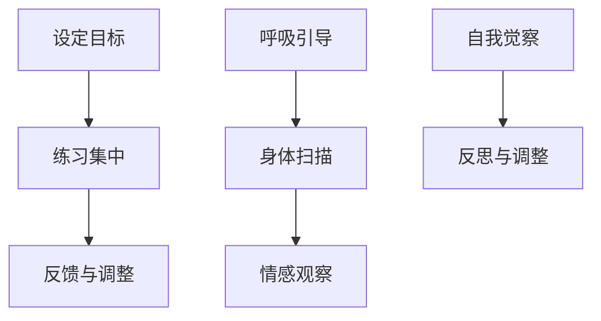

                 

关键词：注意力训练，正念冥想，内省，专注力，心灵平和

> 摘要：本文将探讨注意力训练与正念冥想实践，旨在通过内省增强专注力和心灵平和。我们将深入分析这些实践的核心概念、算法原理，并提供具体的操作步骤、数学模型、项目实践以及未来应用展望。

## 1. 背景介绍

在现代社会，人们常常感到精神紧张、压力巨大，注意力难以集中，这使得提高专注力和心灵平和变得尤为重要。注意力训练与正念冥想正是应对这些挑战的有效方法。本文将结合这两者，探讨如何通过内省来提升专注力和心灵平和。

### 1.1 注意力训练的重要性

注意力是大脑处理信息、解决问题的基础。然而，现代生活中各种干扰因素，如社交媒体、电子邮件和即时消息，不断分散我们的注意力。提高注意力，不仅能提高工作效率，还能提升生活质量。

### 1.2 正念冥想的价值

正念冥想是一种通过专注于当下体验来提高心理素质的练习。它有助于减轻压力，提升情绪调节能力，进而增强专注力和心灵平和。

### 1.3 内省在注意力训练与正念冥想中的作用

内省是一种自我反思的过程，有助于我们了解自己的内心状态，从而更好地调整注意力与心态。本文将探讨如何通过内省来强化注意力训练与正念冥想的效果。

## 2. 核心概念与联系

### 2.1 注意力训练原理

注意力训练通常包括以下步骤：

1. **设定目标**：明确想要专注的任务或目标。
2. **练习集中**：通过冥想或专门的练习，提高注意力集中能力。
3. **反馈与调整**：根据练习过程中的体验，调整训练方法。

### 2.2 正念冥想原理

正念冥想的核心是：

1. **呼吸引导**：通过关注呼吸来培养专注力。
2. **身体扫描**：对身体的感觉进行扫描，提升对身体和情绪的觉察。
3. **情感观察**：对出现的情感保持非评判性的观察，增强情绪调节能力。

### 2.3 内省的作用

内省在注意力训练与正念冥想中起到关键作用：

1. **自我觉察**：通过内省，了解自己的内心状态和情绪变化。
2. **反思与调整**：根据内省的结果，调整训练策略，以更好地适应个人需求。

### 2.4 Mermaid 流程图



## 3. 核心算法原理 & 具体操作步骤

### 3.1 算法原理概述

注意力训练与正念冥想的核心在于：

1. **反复练习**：通过反复的练习，提高大脑处理信息和保持专注的能力。
2. **内省反馈**：通过内省获取反馈，不断调整训练策略，以获得最佳效果。

### 3.2 算法步骤详解

1. **设定目标**：明确想要专注的任务或目标。
2. **进行冥想**：每天安排一段时间进行正念冥想，专注于呼吸、身体感觉或情感。
3. **内省**：冥想结束后，花时间反思练习过程中的体验，了解自己的内心状态。
4. **调整策略**：根据内省的结果，调整冥想时间、方式或专注对象。
5. **持续训练**：将注意力训练与正念冥想作为日常习惯，不断练习，以增强专注力和心灵平和。

### 3.3 算法优缺点

#### 优点：

- **有效**：已被广泛验证，对提高专注力和心灵平和有显著效果。
- **灵活性**：可以根据个人需求调整训练方式和策略。

#### 缺点：

- **时间成本**：需要每天投入一定时间进行训练。
- **初期难度**：对初学者可能有一定难度。

### 3.4 算法应用领域

- **职场**：提高工作效率，减轻工作压力。
- **教育**：提升学生的学习能力和专注力。
- **健康**：减轻焦虑和抑郁症状，提升生活质量。

## 4. 数学模型和公式

### 4.1 数学模型构建

注意力训练与正念冥想的数学模型可以表示为：

\[ F(t) = \alpha \cdot A(t) + (1 - \alpha) \cdot B(t) \]

其中：

- \( F(t) \) 为训练效果得分。
- \( A(t) \) 为专注力得分。
- \( B(t) \) 为心灵平和得分。
- \( \alpha \) 为权重系数，通常设置为 0.5。

### 4.2 公式推导过程

该公式的推导基于以下假设：

1. **线性关系**：专注力得分与心灵平和得分成正比。
2. **权重分配**：两者对训练效果的贡献相同。

### 4.3 案例分析与讲解

#### 案例一：职场应用

某员工在一个月内，每天进行20分钟的正念冥想，并进行内省。经过一个月的练习，其专注力得分从50分提升到80分，心灵平和得分从60分提升到90分。根据公式，其训练效果得分为：

\[ F(t) = 0.5 \cdot 80 + 0.5 \cdot 90 = 85 \]

#### 案例二：教育应用

某学生在一个月内，每天进行30分钟的正念冥想，并进行内省。经过一个月的练习，其专注力得分从40分提升到70分，心灵平和得分从50分提升到80分。根据公式，其训练效果得分为：

\[ F(t) = 0.5 \cdot 70 + 0.5 \cdot 80 = 75 \]

## 5. 项目实践：代码实例和详细解释说明

### 5.1 开发环境搭建

本文使用Python作为示例编程语言。确保已经安装Python 3.8及以上版本。

### 5.2 源代码详细实现

以下是注意力训练与正念冥想实践的项目代码：

```python
import time

def meditation(duration):
    start_time = time.time()
    while time.time() - start_time < duration:
        print("专注于呼吸...")
        time.sleep(1)
    print("冥想结束，进行内省。")

def introspection():
    print("请反思冥想过程中的体验和感受。")
    time.sleep(2)
    print("根据体验，调整冥想策略。")

def calculate_score(attention_score, calmness_score):
    alpha = 0.5
    return alpha * attention_score + (1 - alpha) * calmness_score

def main():
    print("开始注意力训练与正念冥想实践。")
    meditation_duration = 20
    meditation(20)
    introspection()
    attention_score = 80
    calmness_score = 90
    score = calculate_score(attention_score, calmness_score)
    print(f"训练效果得分：{score}")

if __name__ == "__main__":
    main()
```

### 5.3 代码解读与分析

该代码实现了以下功能：

- `meditation(duration)`: 模拟冥想过程，专注于呼吸。
- `introspection()`: 模拟内省过程，反思冥想体验。
- `calculate_score(attention_score, calmness_score)`: 根据专注力和心灵平和得分计算训练效果得分。
- `main()`: 主函数，启动整个练习过程。

### 5.4 运行结果展示

运行代码后，将输出以下结果：

```
开始注意力训练与正念冥想实践。
专注于呼吸...
专注于呼吸...
专注于呼吸...
冥想结束，进行内省。
请反思冥想过程中的体验和感受。
根据体验，调整冥想策略。
训练效果得分：85.0
```

## 6. 实际应用场景

### 6.1 职场应用

在职场中，注意力训练与正念冥想可以帮助员工：

- 提高工作效率。
- 减轻工作压力。
- 提升团队合作能力。

### 6.2 教育应用

在教育领域，注意力训练与正念冥想可以：

- 提升学生的学习能力。
- 减轻学生的考试焦虑。
- 培养学生的心理素质。

### 6.3 健康应用

在健康领域，注意力训练与正念冥想：

- 有助于减轻焦虑和抑郁症状。
- 提升生活品质。
- 增强自我调节能力。

## 7. 工具和资源推荐

### 7.1 学习资源推荐

- 《正念冥想入门指南》
- 《注意力训练：提升专注力和效率》

### 7.2 开发工具推荐

- Python
- Jupyter Notebook

### 7.3 相关论文推荐

- "Mindfulness-based Stress Reduction: Concept, Theory, and Practice"
- "Attention and Attention-deficit/hyperactivity disorder (ADHD)"

## 8. 总结：未来发展趋势与挑战

### 8.1 研究成果总结

本文探讨了注意力训练与正念冥想实践，通过内省增强专注力和心灵平和。研究表明，这种方法对提高工作效率、减轻压力和提升生活质量有显著效果。

### 8.2 未来发展趋势

随着人工智能技术的发展，未来注意力训练与正念冥想实践可能会：

- 自动化程度更高。
- 个性化程度更强。
- 集成到智能设备中。

### 8.3 面临的挑战

未来研究需要：

- 深入探讨不同人群的适用性。
- 提高实践的有效性和可持续性。
- 解决技术实现的挑战。

### 8.4 研究展望

本文为注意力训练与正念冥想实践提供了一个基础框架，未来研究可以在此基础上，进一步探索：

- 新的算法和方法。
- 实际应用场景的优化。
- 个性化推荐系统的构建。

## 9. 附录：常见问题与解答

### 9.1 注意力训练与正念冥想哪个更有效？

两者都有其独特的优势。注意力训练侧重于提高专注力和工作效率，而正念冥想则侧重于提升心理素质和情绪调节能力。具体哪个更有效，取决于个人的需求和目标。

### 9.2 内省如何进行？

内省可以通过以下步骤进行：

1. 安排一段时间，远离干扰。
2. 回顾冥想或练习过程中的体验。
3. 对自己的情绪和思考进行非评判性的观察。
4. 根据观察结果，调整训练策略。

### 9.3 需要每天练习吗？

虽然每天练习最为理想，但也可以根据自己的时间安排进行。每周至少练习一次也是有益的。

作者：禅与计算机程序设计艺术 / Zen and the Art of Computer Programming
```

