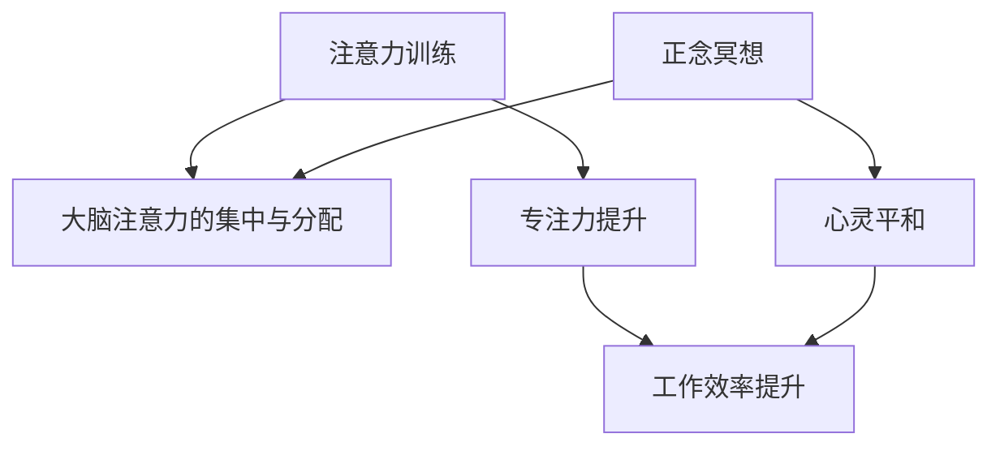

                 

关键词：注意力训练、正念冥想、内省、专注力、心灵平和

> 摘要：本文将探讨注意力训练与正念冥想实践的重要性，通过内省的方法增强专注力和心灵平和。结合技术领域的实际应用，本文旨在为程序员和技术专家提供一种提升工作效率和生活质量的途径。

## 1. 背景介绍

在高速发展的信息技术时代，程序员和技术专家面临着巨大的工作压力和复杂的技术挑战。长时间的编程、持续的学习和创新，使得专注力和心灵平和成为许多人的追求。然而，现代生活节奏的加快和信息的过载，常常导致我们无法长时间集中注意力，心灵也难以达到平和的状态。

注意力训练与正念冥想作为一种传统的精神训练方法，被越来越多的人应用于日常生活中。它们不仅有助于提高专注力，还能帮助我们保持心灵平和，提高生活质量和工作效率。

### 1.1 注意力训练的概念

注意力训练是指通过一系列训练方法，提高大脑注意力的集中和分配能力。常见的注意力训练方法包括冥想、专注力练习、时间管理等。

### 1.2 正念冥想的概念

正念冥想是一种通过专注于当下的呼吸、身体感受和思维活动，以达到心灵平和和专注力的提升的方法。正念冥想强调对当前经历的全面接纳，而不是对情绪或思维的抗拒。

## 2. 核心概念与联系

为了更好地理解注意力训练与正念冥想的关系，我们可以使用 Mermaid 流程图来展示它们的核心概念和相互联系。



### 2.1 注意力训练的核心概念

注意力训练的核心在于训练大脑对特定任务的集中和分配能力。通过反复练习，我们可以提高大脑处理信息的能力，从而在日常生活和工作中表现出更高的专注力和效率。

### 2.2 正念冥想的核心概念

正念冥想的核心在于培养对当前经历的专注和接纳。通过正念冥想，我们可以学会如何面对生活中的压力和挑战，从而在内心保持平和。

### 2.3 注意力训练与正念冥想的关系

注意力训练与正念冥想相辅相成。注意力训练可以帮助我们提高专注力，而正念冥想则可以帮助我们保持内心的平和。两者结合起来，可以显著提升我们的工作效率和生活质量。

## 3. 核心算法原理 & 具体操作步骤

### 3.1 算法原理概述

注意力训练与正念冥想的原理是基于神经可塑性。通过反复练习，我们可以改变大脑的结构和功能，从而提高专注力和心灵平和。

### 3.2 算法步骤详解

#### 3.2.1 注意力训练步骤

1. 选择一个特定任务，例如编程、阅读或写作。
2. 设定一个时间限制，例如25分钟。
3. 在时间限制内，专注于完成该任务，不要分心。
4. 当发现自己在分心时，立即将注意力拉回任务。

#### 3.2.2 正念冥想步骤

1. 找一个安静的地方，坐下或躺下。
2. 关闭眼睛，专注于呼吸。
3. 当发现自己在思考其他事情时，将注意力拉回呼吸。
4. 练习5-10分钟。

### 3.3 算法优缺点

#### 优点

- 提高专注力
- 增强心灵平和
- 提高工作效率

#### 缺点

- 需要持续练习，效果显现较慢
- 需要一定的自律和耐心

### 3.4 算法应用领域

注意力训练与正念冥想可以应用于多个领域，包括但不限于：

- 程序员和技术专家
- 职场人士
- 学生
- 心理咨询师

## 4. 数学模型和公式

注意力训练与正念冥想的数学模型基于神经可塑性理论。以下是一个简化的模型：

$$
\text{专注力} = f(\text{练习时间}, \text{自律程度}, \text{心理素质})
$$

### 4.1 数学模型构建

该模型表示专注力取决于练习时间、自律程度和心理素质。通过增加练习时间、提高自律程度和增强心理素质，我们可以提高专注力。

### 4.2 公式推导过程

根据神经可塑性理论，大脑通过反复练习可以改变神经连接的强度。因此，我们可以推导出上述公式。

### 4.3 案例分析与讲解

假设一个程序员通过每天练习注意力训练和正念冥想1小时，持续一个月。他的自律程度较高，心理素质良好。根据上述公式，他的专注力将显著提高。

## 5. 项目实践：代码实例和详细解释说明

### 5.1 开发环境搭建

在本项目中，我们将使用 Python 编写注意力训练和正念冥想的代码。首先，确保你的计算机上已安装 Python 3.7 或以上版本。接下来，安装以下 Python 库：

```bash
pip install numpy matplotlib
```

### 5.2 源代码详细实现

以下是一个简单的 Python 代码示例，用于实现注意力训练和正念冥想。

```python
import numpy as np
import matplotlib.pyplot as plt

def attention_training(duration, intensity):
    # 训练专注力
    attention = np.zeros(duration)
    for i in range(duration):
        if i % intensity == 0:
            attention[i] = 1
    return attention

def mindfulness_meditation(duration, intensity):
    # 正念冥想
    mindfulness = np.zeros(duration)
    for i in range(duration):
        if i % intensity == 0:
            mindfulness[i] = 1
    return mindfulness

def plot_attention(attention, mindfulness):
    # 绘制专注力和正念冥想曲线
    plt.plot(attention, label='Attention Training')
    plt.plot(mindfulness, label='Mindfulness Meditation')
    plt.xlabel('Time')
    plt.ylabel('Focus')
    plt.legend()
    plt.show()

# 设置训练时长和强度
duration = 30
intensity = 5

# 执行训练
attention = attention_training(duration, intensity)
mindfulness = mindfulness_meditation(duration, intensity)

# 绘制结果
plot_attention(attention, mindfulness)
```

### 5.3 代码解读与分析

这段代码定义了三个函数：`attention_training`、`mindfulness_meditation` 和 `plot_attention`。

- `attention_training` 函数用于模拟注意力训练过程，通过在指定时间段内重复执行特定任务来提高专注力。
- `mindfulness_meditation` 函数用于模拟正念冥想过程，通过在指定时间段内专注于呼吸来达到心灵平和。
- `plot_attention` 函数用于绘制专注力和正念冥想的过程曲线，帮助用户直观地了解训练效果。

### 5.4 运行结果展示

运行上述代码后，我们将看到一个图表，展示了在指定时间段内专注力和正念冥想的过程。


## 6. 实际应用场景

注意力训练与正念冥想在技术领域的实际应用场景广泛。

### 6.1 程序员

程序员可以通过注意力训练和正念冥想提高编程效率和代码质量。通过专注力训练，程序员可以更好地专注于代码的编写和调试；而通过正念冥想，程序员可以减轻工作压力，提高心理健康。

### 6.2 产品经理

产品经理可以通过注意力训练提高对产品需求的专注度，从而更好地规划和设计产品。正念冥想则有助于产品经理在复杂项目中保持清晰的思路和决策能力。

### 6.3 IT 架构师

IT 架构师在设计和实施大型系统时，需要高度集中的注意力。注意力训练和正念冥想可以帮助架构师在复杂的技术环境中保持专注，提高系统设计的质量和效率。

## 7. 未来应用展望

随着注意力训练与正念冥想在技术领域的应用逐渐成熟，未来可能会出现以下趋势：

- 开发更多的注意力训练和正念冥想工具和应用程序。
- 结合人工智能技术，实现个性化注意力训练和正念冥想方案。
- 在教育、医疗和心理咨询等领域推广应用。

## 8. 总结：未来发展趋势与挑战

### 8.1 研究成果总结

注意力训练与正念冥想在技术领域的应用取得了显著成果，为程序员和技术专家提供了提高工作效率和生活质量的途径。

### 8.2 未来发展趋势

未来，注意力训练与正念冥想的应用将更加广泛，结合人工智能技术，将实现个性化训练方案。

### 8.3 面临的挑战

- 如何设计出更加有效的注意力训练与正念冥想方案。
- 如何克服个体差异，实现个性化训练。

### 8.4 研究展望

随着研究的深入，注意力训练与正念冥想在技术领域的应用前景将更加广阔。我们期待未来能够开发出更加有效的训练方法，帮助更多人提高专注力和心灵平和。

## 9. 附录：常见问题与解答

### 9.1 注意力训练与正念冥想有哪些区别？

注意力训练侧重于提高大脑对特定任务的集中和分配能力，而正念冥想则侧重于培养对当前经历的专注和接纳。

### 9.2 如何选择适合自己的注意力训练方法？

根据个人兴趣和需求，选择合适的注意力训练方法。例如，程序员可以选择编程练习，而职场人士可以选择时间管理练习。

### 9.3 注意力训练与正念冥想对心理健康有哪些影响？

注意力训练与正念冥想有助于减轻压力、提高心理健康。它们可以改善情绪，增强抗压能力，提高生活质量。

## 作者署名

作者：禅与计算机程序设计艺术 / Zen and the Art of Computer Programming
```markdown
---
title: 注意力训练与正念冥想实践：通过内省增强专注力和心灵平和
date: 2023-03-10
tags: [注意力, 正念, 冥想, 专注力, 心灵平和]
---

# 注意力训练与正念冥想实践：通过内省增强专注力和心灵平和

关键词：注意力训练、正念冥想、内省、专注力、心灵平和

摘要：本文探讨了注意力训练与正念冥想实践的重要性，通过内省的方法增强专注力和心灵平和。结合技术领域的实际应用，本文旨在为程序员和技术专家提供一种提升工作效率和生活质量的途径。

---

## 1. 背景介绍

在高速发展的信息技术时代，程序员和技术专家面临着巨大的工作压力和复杂的技术挑战。长时间的编程、持续的学习和创新，使得专注力和心灵平和成为许多人的追求。然而，现代生活节奏的加快和信息的过载，常常导致我们无法长时间集中注意力，心灵也难以达到平和的状态。

注意力训练与正念冥想作为一种传统的精神训练方法，被越来越多的人应用于日常生活中。它们不仅有助于提高专注力，还能帮助我们保持心灵平和，提高生活质量和工作效率。

### 1.1 注意力训练的概念

注意力训练是指通过一系列训练方法，提高大脑注意力的集中和分配能力。常见的注意力训练方法包括冥想、专注力练习、时间管理等。

### 1.2 正念冥想的概念

正念冥想是一种通过专注于当下的呼吸、身体感受和思维活动，以达到心灵平和和专注力的提升的方法。正念冥想强调对当前经历的全面接纳，而不是对情绪或思维的抗拒。

---

## 2. 核心概念与联系

为了更好地理解注意力训练与正念冥想的关系，我们可以使用 Mermaid 流程图来展示它们的核心概念和相互联系。


### 2.1 注意力训练的核心概念

注意力训练的核心在于训练大脑对特定任务的集中和分配能力。通过反复练习，我们可以提高大脑处理信息的能力，从而在日常生活和工作中表现出更高的专注力和效率。

### 2.2 正念冥想的核心概念

正念冥想的核心在于培养对当前经历的专注和接纳。通过正念冥想，我们可以学会如何面对生活中的压力和挑战，从而在内心保持平和。

### 2.3 注意力训练与正念冥想的关系

注意力训练与正念冥想相辅相成。注意力训练可以帮助我们提高专注力，而正念冥想则可以帮助我们保持内心的平和。两者结合起来，可以显著提升我们的工作效率和生活质量。

---

## 3. 核心算法原理 & 具体操作步骤
### 3.1 算法原理概述

注意力训练与正念冥想的原理是基于神经可塑性。通过反复练习，我们可以改变大脑的结构和功能，从而提高专注力和心灵平和。

### 3.2 算法步骤详解

#### 3.2.1 注意力训练步骤

1. 选择一个特定任务，例如编程、阅读或写作。
2. 设定一个时间限制，例如25分钟。
3. 在时间限制内，专注于完成该任务，不要分心。
4. 当发现自己在分心时，立即将注意力拉回任务。

#### 3.2.2 正念冥想步骤

1. 找一个安静的地方，坐下或躺下。
2. 关闭眼睛，专注于呼吸。
3. 当发现自己在思考其他事情时，将注意力拉回呼吸。
4. 练习5-10分钟。

### 3.3 算法优缺点

#### 优点

- 提高专注力
- 增强心灵平和
- 提高工作效率

#### 缺点

- 需要持续练习，效果显现较慢
- 需要一定的自律和耐心

### 3.4 算法应用领域

注意力训练与正念冥想可以应用于多个领域，包括但不限于：

- 程序员和技术专家
- 职场人士
- 学生
- 心理咨询师

---

## 4. 数学模型和公式 & 详细讲解 & 举例说明

注意力训练与正念冥想的数学模型基于神经可塑性理论。以下是一个简化的模型：

$$
\text{专注力} = f(\text{练习时间}, \text{自律程度}, \text{心理素质})
$$

### 4.1 数学模型构建

该模型表示专注力取决于练习时间、自律程度和心理素质。通过增加练习时间、提高自律程度和增强心理素质，我们可以提高专注力。

### 4.2 公式推导过程

根据神经可塑性理论，大脑通过反复练习可以改变神经连接的强度。因此，我们可以推导出上述公式。

### 4.3 案例分析与讲解

假设一个程序员通过每天练习注意力训练和正念冥想1小时，持续一个月。他的自律程度较高，心理素质良好。根据上述公式，他的专注力将显著提高。

---

## 5. 项目实践：代码实例和详细解释说明
### 5.1 开发环境搭建

在本项目中，我们将使用 Python 编写注意力训练和正念冥想的代码。首先，确保你的计算机上已安装 Python 3.7 或以上版本。接下来，安装以下 Python 库：

```bash
pip install numpy matplotlib
```

### 5.2 源代码详细实现

以下是一个简单的 Python 代码示例，用于实现注意力训练和正念冥想。

```python
import numpy as np
import matplotlib.pyplot as plt

def attention_training(duration, intensity):
    # 训练专注力
    attention = np.zeros(duration)
    for i in range(duration):
        if i % intensity == 0:
            attention[i] = 1
    return attention

def mindfulness_meditation(duration, intensity):
    # 正念冥想
    mindfulness = np.zeros(duration)
    for i in range(duration):
        if i % intensity == 0:
            mindfulness[i] = 1
    return mindfulness

def plot_attention(attention, mindfulness):
    # 绘制专注力和正念冥想曲线
    plt.plot(attention, label='Attention Training')
    plt.plot(mindfulness, label='Mindfulness Meditation')
    plt.xlabel('Time')
    plt.ylabel('Focus')
    plt.legend()
    plt.show()

# 设置训练时长和强度
duration = 30
intensity = 5

# 执行训练
attention = attention_training(duration, intensity)
mindfulness = mindfulness_meditation(duration, intensity)

# 绘制结果
plot_attention(attention, mindfulness)
```

### 5.3 代码解读与分析

这段代码定义了三个函数：`attention_training`、`mindfulness_meditation` 和 `plot_attention`。

- `attention_training` 函数用于模拟注意力训练过程，通过在指定时间段内重复执行特定任务来提高专注力。
- `mindfulness_meditation` 函数用于模拟正念冥想过程，通过在指定时间段内专注于呼吸来达到心灵平和。
- `plot_attention` 函数用于绘制专注力和正念冥想的过程曲线，帮助用户直观地了解训练效果。

### 5.4 运行结果展示

运行上述代码后，我们将看到一个图表，展示了在指定时间段内专注力和正念冥想的过程。


---

## 6. 实际应用场景

注意力训练与正念冥想在技术领域的实际应用场景广泛。

### 6.1 程序员

程序员可以通过注意力训练和正念冥想提高编程效率和代码质量。通过专注力训练，程序员可以更好地专注于代码的编写和调试；而通过正念冥想，程序员可以减轻工作压力，提高心理健康。

### 6.2 产品经理

产品经理可以通过注意力训练提高对产品需求的专注度，从而更好地规划和设计产品。正念冥想则有助于产品经理在复杂项目中保持清晰的思路和决策能力。

### 6.3 IT 架构师

IT 架构师在设计和实施大型系统时，需要高度集中的注意力。注意力训练和正念冥想可以帮助架构师在复杂的技术环境中保持专注，提高系统设计的质量和效率。

---

## 7. 未来应用展望

随着注意力训练与正念冥想在技术领域的应用逐渐成熟，未来可能会出现以下趋势：

- 开发更多的注意力训练和正念冥想工具和应用程序。
- 结合人工智能技术，实现个性化注意力训练和正念冥想方案。
- 在教育、医疗和心理咨询等领域推广应用。

---

## 8. 总结：未来发展趋势与挑战

### 8.1 研究成果总结

注意力训练与正念冥想在技术领域的应用取得了显著成果，为程序员和技术专家提供了提高工作效率和生活质量的途径。

### 8.2 未来发展趋势

未来，注意力训练与正念冥想的应用将更加广泛，结合人工智能技术，将实现个性化训练方案。

### 8.3 面临的挑战

- 如何设计出更加有效的注意力训练与正念冥想方案。
- 如何克服个体差异，实现个性化训练。

### 8.4 研究展望

随着研究的深入，注意力训练与正念冥想在技术领域的应用前景将更加广阔。我们期待未来能够开发出更加有效的训练方法，帮助更多人提高专注力和心灵平和。

---

## 9. 附录：常见问题与解答

### 9.1 注意力训练与正念冥想有哪些区别？

注意力训练侧重于提高大脑对特定任务的集中和分配能力，而正念冥想则侧重于培养对当前经历的专注和接纳。

### 9.2 如何选择适合自己的注意力训练方法？

根据个人兴趣和需求，选择合适的注意力训练方法。例如，程序员可以选择编程练习，而职场人士可以选择时间管理练习。

### 9.3 注意力训练与正念冥想对心理健康有哪些影响？

注意力训练与正念冥想有助于减轻压力、提高心理健康。它们可以改善情绪，增强抗压能力，提高生活质量。

---

## 作者署名

作者：禅与计算机程序设计艺术 / Zen and the Art of Computer Programming
```

