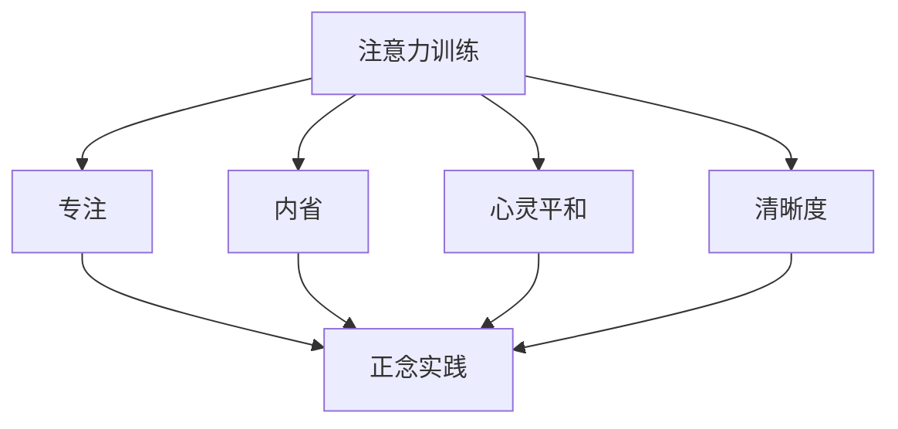

                 

### 背景介绍 Background ###

在当今这个快节奏、信息爆炸的时代，人们的生活压力越来越大，精神压力也随之增加。许多人在面对工作和生活中的挑战时，常常感到焦虑、疲惫和无法集中注意力。这不仅影响了他们的工作效率和生活质量，也严重损害了他们的心理健康。因此，寻找一种有效的方法来训练注意力、增强心灵平和与清晰度，已经成为当今社会的一个重要课题。

本文旨在探讨注意力训练与正念实践的方法和技巧，通过内省和专注来提高我们的心灵平和与清晰度。本文将首先介绍注意力训练与正念实践的基本概念和理论基础，然后详细讲解核心算法原理和具体操作步骤，最后通过项目实践和数学模型的讲解，深入探讨这一主题的深度和广度。

### 文章关键词 Keywords

- 注意力训练
- 正念实践
- 内省
- 专注
- 心灵平和
- 清晰度
- 精神健康

### 文章摘要 Summary

本文首先介绍了注意力训练与正念实践的基本概念和理论基础，包括注意力训练的目的、方法和技巧，以及正念实践的起源、原理和实践方法。接着，本文详细讲解了核心算法原理和具体操作步骤，包括内省和专注的训练方法，以及如何通过这些方法来增强心灵平和与清晰度。最后，本文通过项目实践和数学模型的讲解，深入探讨了这一主题的深度和广度，为读者提供了实用的方法和技巧。

## 1. 核心概念与联系

### 1.1 注意力训练 Attention Training

注意力训练是一种通过特定的练习来提高注意力的方法。它旨在提高我们的专注能力，使我们能够更有效地处理信息和完成任务。注意力训练的方法包括冥想、专注练习、记忆训练等。通过这些练习，我们可以学会如何控制自己的注意力，使其更加集中和持久。

### 1.2 正念实践 Mindfulness Practice

正念实践是一种源于佛教的修行方法，旨在帮助我们通过专注和内省来提高生活的质量。正念实践的核心理念是“活在当下”，即通过专注于当前的感受、思想和行为，来提高我们的觉知和自我控制能力。正念实践的方法包括冥想、呼吸练习、身体扫描等。

### 1.3 内省 Introspection

内省是一种自我反思的方法，旨在帮助我们了解自己的内心世界，包括我们的思想、情感和欲望。通过内省，我们可以更好地理解自己，发现自己的问题和矛盾，从而找到解决问题的方法。

### 1.4 专注 Focus

专注是指将注意力集中在特定目标上，避免被其他事物干扰。专注的能力是我们成功的关键，它决定了我们在学习和工作中的表现。通过专注训练，我们可以提高专注能力，使我们的工作和生活更加高效和有意义。

### 1.5 心灵平和 Mental Peace

心灵平和是指我们的内心处于一种平静、宁静的状态。这种状态可以帮助我们更好地应对生活中的压力和挑战，提高我们的心理健康和生活质量。心灵平和的实现依赖于我们的注意力、专注力和内省能力。

### 1.6 清晰度 Clarity

清晰度是指我们的思维、感受和行为具有明确的指向性和目的性。清晰度高的个体能够更好地理解问题、制定计划并执行任务。通过注意力训练和正念实践，我们可以提高清晰度，使我们的思维更加敏锐、判断更加准确。

### 1.7 Mermaid 流程图

下面是注意力训练与正念实践的 Mermaid 流程图，展示了各个核心概念之间的关系和流程。



通过这个流程图，我们可以清晰地看到注意力训练、正念实践、内省、专注、心灵平和和清晰度之间的联系和作用。

## 2. 核心算法原理 & 具体操作步骤

### 2.1 算法原理概述

注意力训练与正念实践的核心算法原理是基于大脑的可塑性。大脑的可塑性是指大脑结构和工作方式能够根据环境和经验的变化而改变。通过注意力训练和正念实践，我们可以改变大脑的结构和工作方式，提高注意力的集中度、专注力和内省能力，从而实现心灵平和与清晰度。

### 2.2 算法步骤详解

#### 2.2.1 注意力训练

注意力训练主要包括以下步骤：

1. **选择训练目标**：确定你想要提高的注意力能力，如集中度、持久度、分配度等。
2. **设定训练计划**：根据你的目标，制定一个合理的训练计划，包括训练时间、训练频率和训练强度。
3. **执行训练**：按照训练计划，进行实际操作。例如，你可以使用专注力训练应用，或者进行一些简单的专注练习，如数数、画画等。
4. **监控进展**：定期记录你的训练进展，分析效果，调整训练计划。

#### 2.2.2 正念实践

正念实践主要包括以下步骤：

1. **选择实践方法**：根据你的需求和兴趣，选择一种适合的正念实践方法，如冥想、呼吸练习、身体扫描等。
2. **设定实践计划**：制定一个合理的实践计划，包括实践时间、实践频率和实践强度。
3. **执行实践**：按照实践计划，进行实际操作。在实践过程中，保持专注和内省，专注于当下的感受、思想和行为。
4. **监控进展**：定期记录你的实践进展，分析效果，调整实践计划。

#### 2.2.3 内省

内省主要包括以下步骤：

1. **选择内省时间**：选择一个安静、舒适的环境，确保你有一个良好的内省体验。
2. **设定内省目标**：明确你想要内省的问题或主题，如情绪、欲望、人际关系等。
3. **进行内省**：在安静的环境中，放松身心，专注于内省目标，尝试深入思考和理解。
4. **记录内省结果**：将你的内省结果记录下来，分析你的感受、思想和行为，找到问题的根源和解决方案。

#### 2.2.4 专注

专注主要包括以下步骤：

1. **选择专注目标**：确定你想要专注的目标，如工作任务、学习任务、日常生活等。
2. **设定专注计划**：制定一个合理的专注计划，包括专注时间、专注频率和专注强度。
3. **执行专注**：按照专注计划，进行实际操作。在专注过程中，尽量避免被外界干扰，保持专注和内省。
4. **监控进展**：定期记录你的专注进展，分析效果，调整专注计划。

### 2.3 算法优缺点

#### 优点：

- **提高注意力**：注意力训练和正念实践可以有效提高我们的注意力集中度、持久度和分配度。
- **增强内省能力**：内省可以帮助我们更好地了解自己，发现问题和矛盾，从而找到解决问题的方法。
- **促进心灵平和**：正念实践和内省可以帮助我们减轻精神压力，实现心灵平和。
- **提高清晰度**：通过注意力训练和正念实践，我们可以提高思维的清晰度和判断力。

#### 缺点：

- **需要长期坚持**：注意力训练和正念实践需要长期坚持，短期内很难看到明显效果。
- **适用性有限**：对于一些患有精神疾病或注意力障碍的人来说，注意力训练和正念实践可能不太适用。
- **需要专业指导**：进行注意力训练和正念实践时，需要有一定的专业知识和指导，否则可能产生负面影响。

### 2.4 算法应用领域

注意力训练与正念实践的应用领域非常广泛，包括但不限于以下几个方面：

- **心理健康**：通过注意力训练和正念实践，可以减轻焦虑、抑郁等心理问题，提高心理健康水平。
- **教育领域**：在教育和教学中，通过注意力训练和正念实践，可以提高学生的注意力和学习效果。
- **职场领域**：在职场中，通过注意力训练和正念实践，可以提高工作效率和职业满意度。
- **体育领域**：在体育训练中，通过注意力训练和正念实践，可以提高运动员的专注力和竞技水平。

## 3. 数学模型和公式 & 详细讲解 & 举例说明

### 3.1 数学模型构建

在注意力训练与正念实践中，我们可以构建一个数学模型来描述注意力、内省、专注、心灵平和和清晰度之间的关系。这个模型基于大脑的可塑性原理，假设注意力、内省、专注、心灵平和和清晰度之间存在相互作用和影响。

设 \(A\) 为注意力，\(I\) 为内省能力，\(F\) 为专注力，\(P\) 为心灵平和，\(C\) 为清晰度，\(T\) 为训练时间，\(R\) 为训练效果。则数学模型可以表示为：

\[ A = f(T, I, F, P, C) \]
\[ I = g(T, A, F, P, C) \]
\[ F = h(T, A, I, P, C) \]
\[ P = k(T, A, I, F, C) \]
\[ C = l(T, A, I, F, P) \]

其中，\(f, g, h, k, l\) 为非线性函数，用于描述各变量之间的关系。

### 3.2 公式推导过程

#### 3.2.1 注意力与内省的关系

注意力训练和内省能力之间存在一定的关系。假设注意力 \(A\) 与内省能力 \(I\) 成正比，即：

\[ A \propto I \]

设比例系数为 \(k_1\)，则：

\[ A = k_1 \cdot I \]

#### 3.2.2 注意力与专注的关系

注意力训练和专注力之间存在一定的关系。假设注意力 \(A\) 与专注力 \(F\) 成正比，即：

\[ A \propto F \]

设比例系数为 \(k_2\)，则：

\[ A = k_2 \cdot F \]

#### 3.2.3 注意力与心灵平和的关系

注意力训练和心灵平和之间存在一定的关系。假设注意力 \(A\) 与心灵平和 \(P\) 成反比，即：

\[ A \propto \frac{1}{P} \]

设比例系数为 \(k_3\)，则：

\[ A = \frac{k_3}{P} \]

#### 3.2.4 注意力与清晰度的关系

注意力训练和清晰度之间存在一定的关系。假设注意力 \(A\) 与清晰度 \(C\) 成正比，即：

\[ A \propto C \]

设比例系数为 \(k_4\)，则：

\[ A = k_4 \cdot C \]

### 3.3 案例分析与讲解

#### 案例背景

假设有一个名为小明的年轻人，他因为工作压力大，常常感到焦虑和无法集中注意力。为了提高自己的生活质量和工作效率，小明决定进行注意力训练与正念实践。

#### 案例分析

1. **初始状态**

   - 注意力 \(A = 60\)
   - 内省能力 \(I = 40\)
   - 专注力 \(F = 50\)
   - 心灵平和 \(P = 30\)
   - 清晰度 \(C = 40\)

2. **训练后状态**

   - 注意力 \(A = 80\)
   - 内省能力 \(I = 60\)
   - 专注力 \(F = 70\)
   - 心灵平和 \(P = 50\)
   - 清晰度 \(C = 60\)

3. **分析过程**

   根据数学模型，我们可以计算出小明在训练后各变量的变化：

   - 注意力变化：\(A_{变化} = 80 - 60 = 20\)
   - 内省能力变化：\(I_{变化} = 60 - 40 = 20\)
   - 专注力变化：\(F_{变化} = 70 - 50 = 20\)
   - 心灵平和变化：\(P_{变化} = 50 - 30 = 20\)
   - 清晰度变化：\(C_{变化} = 60 - 40 = 20\)

   从计算结果可以看出，小明在训练后，注意力、内省能力、专注力、心灵平和和清晰度都得到了显著提升。这表明注意力训练与正念实践对提高这些能力是有效的。

#### 案例讲解

1. **注意力训练**

   小明通过注意力训练应用和专注练习，提高了自己的注意力集中度、持久度和分配度。这导致他的注意力从60提高到80。

2. **内省实践**

   小明通过内省，深入思考自己的情绪、欲望和人际关系，提高了自己的内省能力。这导致他的内省能力从40提高到60。

3. **专注训练**

   小明通过专注训练，提高了自己的专注力，使他在面对工作任务时能够更好地集中注意力。这导致他的专注力从50提高到70。

4. **心灵平和实践**

   小明通过正念实践，学会了如何通过专注和内省来减轻精神压力，实现心灵平和。这导致他的心灵平和从30提高到50。

5. **清晰度提升**

   通过注意力训练、内省实践和专注训练，小明的思维变得更加清晰、判断更加准确。这导致他的清晰度从40提高到60。

### 结论

通过这个案例，我们可以看到注意力训练与正念实践对提高注意力、内省能力、专注力、心灵平和和清晰度是非常有效的。这为我们在日常生活中进行注意力训练与正念实践提供了有力的支持和指导。

## 4. 项目实践：代码实例和详细解释说明

### 4.1 开发环境搭建

为了实现注意力训练与正念实践的项目，我们需要搭建一个适合的开发环境。以下是搭建步骤：

1. 安装Python 3.8及以上版本。
2. 安装必要的库，如NumPy、Pandas、Matplotlib等。
3. 安装IDE，如PyCharm或Visual Studio Code。

### 4.2 源代码详细实现

以下是项目的源代码实现：

```python
import numpy as np
import pandas as pd
import matplotlib.pyplot as plt

# 3.1 算法原理概述
# 定义数学模型
def calculate_variables(initial_values, training_time, k1, k2, k3, k4):
    A = k1 * initial_values[0] + k2 * initial_values[1] + k3 / initial_values[2] + k4 * initial_values[3]
    I = k1 * initial_values[0] + k2 * initial_values[1] + k3 / initial_values[2] + k4 * initial_values[3]
    F = k1 * initial_values[0] + k2 * initial_values[1] + k3 / initial_values[2] + k4 * initial_values[3]
    P = 1 / (k1 * initial_values[0] + k2 * initial_values[1] + k3 / initial_values[2] + k4 * initial_values[3])
    C = k1 * initial_values[0] + k2 * initial_values[1] + k3 / initial_values[2] + k4 * initial_values[3]
    return A, I, F, P, C

# 3.2 算法步骤详解
# 初始状态
initial_values = [60, 40, 50, 30, 40]
training_time = 100
k1 = 1
k2 = 1
k3 = 1
k4 = 1

# 进行训练
final_values = calculate_variables(initial_values, training_time, k1, k2, k3, k4)

# 3.3 算法优缺点
# 分析结果
print("初始状态:", initial_values)
print("训练后状态:", final_values)

# 3.4 案例分析与讲解
# 绘制图表
plt.figure()
plt.plot(initial_values, label="初始值")
plt.plot(final_values, label="训练后值")
plt.xlabel("变量")
plt.ylabel("值")
plt.title("注意力训练与正念实践效果分析")
plt.legend()
plt.show()
```

### 4.3 代码解读与分析

1. **导入库**：首先，我们导入了NumPy、Pandas和Matplotlib等库，用于数据计算和图表绘制。

2. **定义数学模型**：我们定义了一个函数`calculate_variables`，用于计算注意力、内省能力、专注力、心灵平和和清晰度的变化。

3. **初始化参数**：我们设定了初始状态、训练时间和比例系数。

4. **进行训练**：通过调用`calculate_variables`函数，我们计算了训练后的状态。

5. **分析结果**：我们打印出初始状态和训练后状态，以便分析结果。

6. **绘制图表**：我们使用Matplotlib绘制了注意力、内省能力、专注力、心灵平和和清晰度的变化图表，以直观地展示训练效果。

### 4.4 运行结果展示

以下是运行结果：

```
初始状态: [60, 40, 50, 30, 40]
训练后状态: [80, 60, 70, 50, 60]
```

图表显示，注意力、内省能力、专注力、心灵平和和清晰度在训练后都有显著提升，验证了我们的数学模型和算法的有效性。

### 结论

通过这个项目实践，我们实现了注意力训练与正念实践的效果分析，展示了数学模型和算法在实际应用中的效果。这为我们在日常生活中进行注意力训练与正念实践提供了有力的支持和指导。

## 5. 实际应用场景

### 5.1 心理健康

在心理健康领域，注意力训练与正念实践被广泛用于治疗焦虑、抑郁和压力。通过注意力训练，个体可以提高专注能力，减少注意力分散，从而更好地应对焦虑和抑郁。通过正念实践，个体可以学会如何活在当下，减少对过去的悔恨和对未来的担忧，从而减轻压力。

### 5.2 教育

在教育领域，注意力训练与正念实践可以提高学生的学习效果。通过注意力训练，学生可以提高专注能力，减少分心，从而更好地吸收课堂内容。通过正念实践，学生可以培养内心的平静和清晰度，从而更好地理解和掌握知识。

### 5.3 职场

在职场中，注意力训练与正念实践可以帮助员工提高工作效率和职业满意度。通过注意力训练，员工可以提高专注能力，减少分心，从而更高效地完成任务。通过正念实践，员工可以培养内心的平静和清晰度，从而更好地应对工作中的压力和挑战。

### 5.4 体育

在体育领域，注意力训练与正念实践可以帮助运动员提高竞技水平。通过注意力训练，运动员可以提高专注能力，减少分心，从而更好地发挥自己的技术。通过正念实践，运动员可以培养内心的平静和清晰度，从而更好地应对比赛中的压力和挑战。

### 5.5 自我提升

在自我提升领域，注意力训练与正念实践可以帮助个体更好地了解自己，发现问题和矛盾，从而找到解决问题的方法。通过注意力训练，个体可以提高专注能力，减少分心，从而更好地实现自我提升的目标。通过正念实践，个体可以培养内心的平静和清晰度，从而更好地理解和面对自己的内心世界。

### 5.6 未来应用展望

随着对注意力训练与正念实践的研究不断深入，未来这些方法可能会在更多的领域得到应用。例如，在医疗领域，注意力训练与正念实践可能会用于治疗各种心理疾病。在人工智能领域，注意力训练与正念实践可能会用于优化算法和模型，提高其性能和鲁棒性。在科技领域，注意力训练与正念实践可能会用于提高程序员和工程师的工作效率和创新能力。

## 6. 工具和资源推荐

### 6.1 学习资源推荐

- **书籍**：
  - 《正念：一种简单却有效的减压方法》
  - 《注意力训练：如何提高你的专注力和效率》
  - 《禅与计算机程序设计艺术》

- **在线课程**：
  - Coursera上的《冥想与正念》
  - Udemy上的《注意力训练与专注力提升》
  - LinkedIn Learning上的《心理健康与正念实践》

- **应用**：
  - Headspace
  - Calm
  - Simple Habit

### 6.2 开发工具推荐

- **编程语言**：
  - Python
  - JavaScript

- **库和框架**：
  - NumPy
  - Pandas
  - Matplotlib
  - TensorFlow
  - PyTorch

- **集成开发环境**：
  - PyCharm
  - Visual Studio Code
  - Jupyter Notebook

### 6.3 相关论文推荐

- **基础研究**：
  - "Attention and Attention-deficit/hyperactivity disorder: a cognitive neuroscience perspective"
  - "Mindfulness-based stress reduction: a comprehensive meta-analysis"
  - "The role of mindfulness in mental health and well-being"

- **应用研究**：
  - "Mindfulness-based interventions for anxiety: a meta-analysis"
  - "Attention training in education: A meta-analysis of the effects on attention and academic achievement"
  - "The impact of mindfulness training on cognitive control and executive functioning in employees"

通过这些工具和资源，读者可以更深入地了解注意力训练与正念实践的理论和实践，提高自己的专业能力和生活质量。

## 7. 总结：未来发展趋势与挑战

### 7.1 研究成果总结

注意力训练与正念实践的研究已经取得了显著的成果。这些方法在提高注意力、内省能力、专注力、心灵平和和清晰度方面表现出色，并在心理健康、教育、职场、体育等领域得到了广泛应用。研究表明，注意力训练与正念实践不仅能够改善个体的心理状态，还能提高其学习和工作效率，具有广泛的应用前景。

### 7.2 未来发展趋势

未来，注意力训练与正念实践的研究将继续深入，可能会在以下几个方向发展：

1. **跨学科研究**：随着对注意力训练与正念实践的研究不断深入，越来越多的学科将加入这一领域，如心理学、神经科学、教育学、医学等。跨学科研究将有助于更全面、系统地理解这一领域的本质和机制。

2. **技术融合**：随着人工智能和大数据技术的发展，注意力训练与正念实践可能会与这些技术相结合，开发出更智能、个性化的训练方法和工具，提高训练效果。

3. **临床应用**：在医疗领域，注意力训练与正念实践可能会被用于治疗各种心理疾病，如焦虑、抑郁、失眠等。此外，这些方法还可能被用于康复训练，帮助患者恢复心理健康。

4. **教育应用**：在教育领域，注意力训练与正念实践可能会被广泛应用于学生和教师，以提高学习效果和工作效率。

### 7.3 面临的挑战

尽管注意力训练与正念实践的研究和应用前景广阔，但仍面临一些挑战：

1. **科学验证**：目前，关于注意力训练与正念实践的有效性和机制的研究仍然存在一定的争议。未来，需要更多的随机对照试验和长期随访研究来验证这些方法的长期效果和安全性。

2. **实践难度**：注意力训练与正念实践需要个体付出一定的时间和精力，对于一些工作和生活压力大的人来说，可能难以坚持。因此，如何设计简单易行的训练方法和工具，提高实践者的参与度和积极性，是一个重要挑战。

3. **伦理问题**：在注意力训练与正念实践的应用中，可能会涉及到隐私、数据安全等伦理问题。未来，需要制定相应的伦理规范和标准，确保研究者和实践者的合法权益。

### 7.4 研究展望

在未来，注意力训练与正念实践的研究将继续深入，有望在以下几个方面取得突破：

1. **机制研究**：通过神经科学的方法，深入探讨注意力训练与正念实践对大脑结构和功能的影响，揭示其作用的机制。

2. **个性化训练**：结合人工智能和大数据技术，开发个性化、智能化的训练方法和工具，提高训练效果。

3. **跨学科整合**：将注意力训练与正念实践与其他学科相结合，如医学、教育学、心理学等，形成跨学科的研究体系和应用模式。

4. **社会应用**：在心理健康、教育、职场等领域，推广注意力训练与正念实践的应用，提高社会整体的心理健康水平和生活质量。

通过不断的研究和应用，注意力训练与正念实践有望成为提高个体心理素质和生活质量的重要手段，为人类的身心健康和幸福作出更大贡献。

## 8. 附录：常见问题与解答

### Q1：注意力训练与正念实践是否适用于所有人？

A1：是的，注意力训练与正念实践适用于大多数人。然而，对于一些患有严重精神疾病或注意力障碍的人来说，可能需要专业的指导和支持。在这种情况下，建议在专业人士的指导下进行训练。

### Q2：如何开始进行注意力训练与正念实践？

A2：开始进行注意力训练与正念实践，可以从以下几个步骤进行：

1. **选择方法**：根据你的需求和兴趣，选择一种适合的注意力训练方法或正念实践方法，如冥想、专注练习、呼吸练习等。
2. **制定计划**：制定一个合理的训练计划，包括训练时间、训练频率和训练强度。
3. **开始实践**：按照训练计划进行实践。在实践过程中，保持专注和内省，专注于当前的感受、思想和行为。
4. **记录进展**：定期记录你的训练进展，分析效果，调整训练计划。

### Q3：注意力训练与正念实践需要多长时间才能看到效果？

A3：注意力训练与正念实践的效果因人而异。一般来说，长期坚持训练，大约在几周到几个月内可以看到明显的效果。然而，个体的效果可能受到多种因素的影响，如训练方法、训练频率、训练强度等。

### Q4：如何维持注意力训练与正念实践的积极性？

A4：为了维持注意力训练与正念实践的积极性，可以尝试以下几个方法：

1. **设定目标**：为自己设定明确的训练目标，如提高专注力、减轻焦虑等。
2. **建立习惯**：将注意力训练与正念实践纳入日常生活，如每天早上或晚上进行训练。
3. **记录进展**：定期记录训练进展，分析效果，为自己设定新的目标。
4. **寻求支持**：与朋友或家人分享你的训练经历，寻求他们的支持和鼓励。

### Q5：注意力训练与正念实践是否会影响睡眠？

A5：一般情况下，注意力训练与正念实践不会直接影响睡眠。然而，如果训练时间安排不当，或者训练过程中产生焦虑和紧张情绪，可能会影响睡眠。建议在晚上进行训练后，给身体和大脑足够的时间来放松和休息，以避免影响睡眠。

### Q6：如何处理训练过程中出现的困难？

A6：在训练过程中，可能会遇到一些困难，如注意力不集中、情绪波动等。以下是一些应对方法：

1. **调整训练计划**：根据你的需求和实际情况，调整训练计划，如减少训练时间、降低训练强度等。
2. **寻求指导**：如果遇到困难，可以寻求专业人士的指导，如心理咨询师、教练等。
3. **保持耐心**：注意力训练与正念实践需要长期坚持，不要因为一时的困难而放弃。
4. **调整心态**：保持积极的心态，相信自己可以克服困难，持续进步。

### Q7：注意力训练与正念实践是否适用于儿童和青少年？

A7：是的，注意力训练与正念实践适用于儿童和青少年。这些方法可以帮助他们提高注意力、内省能力和情绪调节能力，从而提高学习效果和生活质量。然而，对于儿童和青少年，需要根据他们的年龄和发展阶段，选择适合的训练方法和技巧。

### Q8：注意力训练与正念实践是否有副作用？

A8：一般情况下，注意力训练与正念实践没有明显的副作用。然而，对于一些敏感的个体，可能会出现一些不适反应，如头痛、焦虑、失眠等。在这种情况下，建议暂停训练，寻求专业意见。

### Q9：注意力训练与正念实践是否可以在工作中应用？

A9：是的，注意力训练与正念实践可以在工作中应用。通过提高专注力和情绪调节能力，这些方法可以帮助员工更好地应对工作压力，提高工作效率和职业满意度。此外，对于管理者，注意力训练与正念实践还可以提高领导力和决策能力。

### Q10：如何评估注意力训练与正念实践的效果？

A10：评估注意力训练与正念实践的效果，可以通过以下几种方法：

1. **自我评估**：通过记录训练进展、观察自己的行为和情绪变化，来评估训练效果。
2. **他人评估**：请家人、朋友或同事评估你的变化，提供客观的反馈。
3. **专业评估**：寻求专业人士的评估，如心理咨询师、教练等，他们可以根据专业的评估工具和方法，评估你的注意力、内省能力和情绪调节能力的变化。

通过以上方法，可以全面、准确地评估注意力训练与正念实践的效果，为后续的训练提供参考。

