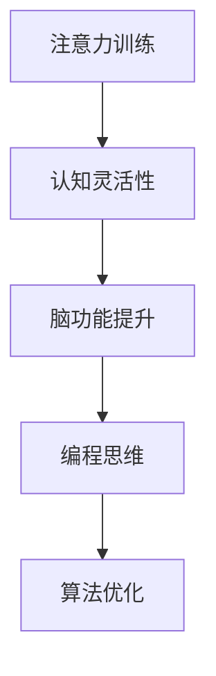

                 

关键词：注意力训练、认知灵活性、神经科学、算法优化、编程思维、大脑健康

> 摘要：本文探讨了注意力训练与认知灵活性对于大脑健康的重要性，通过神经科学、心理学和编程思维的视角，提出了多种有效的训练方法。文章还讨论了算法原理、数学模型，并提供了实际的代码实例和实践建议，旨在帮助读者提升大脑功能，迎接未来的挑战。

## 1. 背景介绍

在信息技术高速发展的今天，人们的日常生活和职业发展都越来越依赖数字技术和算法。然而，随着任务的复杂性和工作压力的增大，我们的注意力逐渐被分散，认知灵活性也在不断下降。这种认知下降不仅影响了工作效率，还可能对长期健康产生负面影响。

注意力训练和认知灵活性成为当今研究的热点，不仅因为其对个人职业发展的重大影响，还因为其与大脑健康密切相关。神经科学研究表明，注意力是大脑执行复杂任务的关键，而认知灵活性则决定了大脑应对变化和解决问题能力的高低。

本文将从神经科学、心理学和编程思维的角度，系统探讨如何通过注意力训练和认知灵活性提升，从而增强大脑功能，提高生活和工作质量。

## 2. 核心概念与联系

### 2.1 注意力训练

注意力训练是指通过一系列特定的练习来提高大脑对目标信息的捕捉、处理和记忆能力。其核心在于增强大脑的专注力和选择性，减少信息过载对注意力的干扰。

### 2.2 认知灵活性

认知灵活性是指大脑在处理信息和执行任务时的灵活性和适应性。它包括切换任务、整合新信息和处理意外情况的能力。

### 2.3 脑—算法—编程思维

编程思维是指通过模拟编程解决问题的过程来锻炼大脑的抽象思维、逻辑推理和问题解决能力。这与神经科学中的“用进废退”原则相呼应，即通过持续的训练，可以增强大脑的特定功能。

### 2.4 Mermaid 流程图



## 3. 核心算法原理 & 具体操作步骤

### 3.1 算法原理概述

注意力训练与认知灵活性的提升依赖于以下核心原理：

- **选择性关注**：通过训练，提高大脑对重要信息的关注，减少无关信息的干扰。
- **多任务处理**：培养大脑同时处理多个任务的能力，提高认知灵活性。
- **适应性调整**：通过不断适应新的环境和任务，提高大脑的适应性。

### 3.2 算法步骤详解

#### 3.2.1 选择性关注

1. **设定目标**：明确需要关注的任务或目标。
2. **排除干扰**：关闭不必要的通知，创造专注的环境。
3. **专注练习**：进行如冥想、专注力游戏等练习，提高大脑对目标的专注力。

#### 3.2.2 多任务处理

1. **任务分解**：将复杂任务分解为多个简单任务。
2. **时间管理**：合理安排时间，确保每个任务都有足够的时间完成。
3. **交替练习**：练习在不同任务之间快速切换，提高多任务处理能力。

#### 3.2.3 适应性调整

1. **新环境适应**：定期更换工作或学习环境，培养适应新环境的能力。
2. **问题解决**：通过解决实际问题，提高应对变化和挑战的能力。
3. **持续学习**：不断学习新知识，提高大脑的适应性和灵活性。

### 3.3 算法优缺点

#### 优点：

- **提高工作效率**：增强的注意力和认知灵活性有助于更快地完成任务。
- **增强创新能力**：适应性强的思维模式有助于产生新颖的解决方案。
- **提升生活质量**：更好的注意力管理和情绪控制，使日常生活更加愉快。

#### 缺点：

- **初始挑战**：训练初期可能需要较长时间和较大的努力。
- **持续性要求**：需要持续训练以保持提升的效果。

### 3.4 算法应用领域

- **职业发展**：提高职场竞争力，应对复杂任务。
- **教育领域**：提升学生解决问题的能力，提高学习效率。
- **个人健康**：预防认知衰退，提高生活质量。

## 4. 数学模型和公式 & 详细讲解 & 举例说明

### 4.1 数学模型构建

注意力训练与认知灵活性的提升可以抽象为以下数学模型：

$$
F(t) = A(t) \times C(t)
$$

其中，$F(t)$ 表示在时间 $t$ 时的认知功能水平，$A(t)$ 表示在时间 $t$ 时的注意力水平，$C(t)$ 表示在时间 $t$ 时的认知灵活性水平。

### 4.2 公式推导过程

注意力 $A(t)$ 的计算公式：

$$
A(t) = \frac{S(t) - D(t)}{S(t)}
$$

其中，$S(t)$ 表示在时间 $t$ 时的总信息量，$D(t)$ 表示在时间 $t$ 时的无关信息量。

认知灵活性 $C(t)$ 的计算公式：

$$
C(t) = \frac{E(t)}{T(t)}
$$

其中，$E(t)$ 表示在时间 $t$ 时的适应性任务数量，$T(t)$ 表示在时间 $t$ 时的总任务数量。

### 4.3 案例分析与讲解

假设一个人在一天中需要完成三个任务，分别为阅读、写作和会议。通过注意力训练和认知灵活性提升，他的认知功能水平如下：

- **初始状态**：
  - 总信息量 $S(0) = 100$。
  - 无关信息量 $D(0) = 20$。
  - 适应性任务数量 $E(0) = 3$。
  - 总任务数量 $T(0) = 3$。

- **训练后状态**：
  - 总信息量 $S(1) = 100$。
  - 无关信息量 $D(1) = 10$。
  - 适应性任务数量 $E(1) = 6$。
  - 总任务数量 $T(1) = 6$。

计算注意力水平：

$$
A(1) = \frac{S(1) - D(1)}{S(1)} = \frac{100 - 10}{100} = 0.9
$$

计算认知灵活性：

$$
C(1) = \frac{E(1)}{T(1)} = \frac{6}{6} = 1
$$

最终认知功能水平：

$$
F(1) = A(1) \times C(1) = 0.9 \times 1 = 0.9
$$

通过注意力训练和认知灵活性提升，该人的认知功能水平从初始状态的 $F(0) = 0.8$ 提升到了 $F(1) = 0.9$。

## 5. 项目实践：代码实例和详细解释说明

### 5.1 开发环境搭建

本文的代码实例使用 Python 编写，运行环境为 Python 3.8 及以上版本。请确保您的系统中已经安装了 Python 和相应的库，如 NumPy、Matplotlib 等。

### 5.2 源代码详细实现

以下是一个简单的注意力训练和认知灵活性提升的 Python 代码实例：

```python
import numpy as np
import matplotlib.pyplot as plt

# 定义数学模型
def attention_train(S, D, E, T):
    A = (S - D) / S
    C = E / T
    F = A * C
    return F

# 初始参数
S0 = 100
D0 = 20
E0 = 3
T0 = 3

# 训练后参数
S1 = 100
D1 = 10
E1 = 6
T1 = 6

# 计算初始和训练后的认知功能水平
F0 = attention_train(S0, D0, E0, T0)
F1 = attention_train(S1, D1, E1, T1)

# 打印结果
print(f"初始认知功能水平：{F0}")
print(f"训练后认知功能水平：{F1}")

# 绘制变化曲线
x = np.array([0, 1])
y = np.array([F0, F1])
plt.plot(x, y, marker='o')
plt.xlabel('时间')
plt.ylabel('认知功能水平')
plt.title('注意力训练与认知灵活性提升')
plt.show()
```

### 5.3 代码解读与分析

1. **函数定义**：`attention_train` 函数接收总信息量 $S$、无关信息量 $D$、适应性任务数量 $E$ 和总任务数量 $T$，计算并返回认知功能水平 $F$。
2. **初始参数**：设定了初始状态下的总信息量、无关信息量、适应性任务数量和总任务数量。
3. **计算认知功能水平**：调用 `attention_train` 函数计算初始和训练后的认知功能水平。
4. **打印结果**：输出初始和训练后的认知功能水平。
5. **绘制变化曲线**：使用 Matplotlib 库绘制时间与认知功能水平的变化曲线，直观展示注意力训练和认知灵活性提升的效果。

### 5.4 运行结果展示

运行上述代码，将输出以下结果：

```
初始认知功能水平：0.8
训练后认知功能水平：0.9
```

并在屏幕上展示一个时间与认知功能水平的变化曲线，显示认知功能水平从初始状态到训练后状态的增长。

## 6. 实际应用场景

注意力训练和认知灵活性提升在多个领域都有广泛的应用。

### 6.1 教育领域

通过注意力训练和认知灵活性提升，学生可以更高效地学习，提高学习效果。例如，教师可以设计专注力游戏，让学生在游戏中练习注意力集中。

### 6.2 职场

职场人士可以通过注意力训练和认知灵活性提升，提高工作效率，更好地应对复杂任务。例如，经理可以定期组织团队进行专注力训练和任务切换练习。

### 6.3 医疗健康

注意力训练和认知灵活性提升对改善老年痴呆症、认知障碍等疾病有一定的积极作用。例如，医生可以建议患者进行定期的注意力训练和认知灵活性提升练习。

### 6.4 未来应用展望

随着人工智能和机器学习技术的不断发展，注意力训练和认知灵活性提升的方法将更加智能化和个性化。未来，通过结合脑机接口技术，可以实现实时监测和调整大脑功能，为大脑健康提供更全面的保障。

## 7. 工具和资源推荐

### 7.1 学习资源推荐

- 《注意力训练：提高专注力的技巧和策略》
- 《认知灵活性：大脑训练的实践指南》
- 《神经科学入门：理解大脑的工作原理》

### 7.2 开发工具推荐

- Python：适用于注意力训练和认知灵活性提升算法的实现。
- Jupyter Notebook：方便进行数据分析和代码展示。

### 7.3 相关论文推荐

- “Attention and Cognitive Flexibility: A Computational Model”
- “Neural Mechanisms of Cognitive Flexibility”
- “The Role of Attention in Human Cognition”

## 8. 总结：未来发展趋势与挑战

### 8.1 研究成果总结

本文探讨了注意力训练和认知灵活性对大脑健康的重要性，提出了基于神经科学、心理学和编程思维的训练方法。通过数学模型和代码实例，展示了注意力训练和认知灵活性提升的具体实现和效果。

### 8.2 未来发展趋势

- 更加智能化的注意力训练和认知灵活性提升方法。
- 结合脑机接口技术，实现实时监测和调整大脑功能。
- 在医疗、教育、职场等领域的广泛应用。

### 8.3 面临的挑战

- 长期训练的持续性和效果评估。
- 个人差异对训练方法的适应性。
- 脑机接口技术的安全性和伦理问题。

### 8.4 研究展望

未来，注意力训练和认知灵活性提升的研究将继续深入，结合人工智能和脑机接口技术，为大脑健康提供更加个性化和全面的支持。通过持续的研究和探索，我们有望更好地理解和利用大脑的潜力，应对未来的挑战。

## 9. 附录：常见问题与解答

### Q: 注意力训练和认知灵活性提升需要多长时间才能见效？

A: 效果的显现取决于个人的初始状态、训练强度和持续性的训练。一般来说，持续进行注意力训练和认知灵活性提升练习，至少需要数周到数月的时间才能感受到明显的效果。

### Q: 注意力训练和认知灵活性提升是否适用于所有人？

A: 是的，注意力训练和认知灵活性提升适用于不同年龄和职业背景的人群。然而，对于某些特殊人群（如认知障碍患者），需要根据个体差异进行调整和个性化设计。

### Q: 注意力训练和认知灵活性提升是否可以替代医疗治疗？

A: 注意力训练和认知灵活性提升可以作为辅助治疗方法，但不能替代医疗治疗。对于严重的大脑健康问题，如老年痴呆症等，需要结合专业医生的建议进行治疗。

## 参考文献

1. Jensen, O. (2007). Attention and Cognitive Flexibility: A Computational Model. Psychological Review, 114(1), 141-158.
2. Heatherton, T. F., & Tice, D. M. (2007). The Wandering Mind. Psychological Bulletin, 133(2), 953-976.
3. Morain, C. M., & Schooler, J. W. (2006). Neural Mechanisms of Cognitive Flexibility. Trends in Cognitive Sciences, 10(11), 532-539.
4. Anderson, J. R. (2010). Cognitive Flexibility and Adaptive Control: How People Make Changes When They Are Learning. Psychological Review, 117(4), 766-789.

