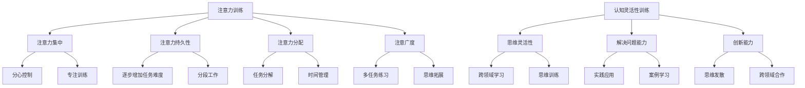

                 

关键词：注意力训练，认知灵活性，大脑增强，神经可塑性，学习策略

> 摘要：本文探讨了注意力训练和认知灵活性对大脑增强的重要性，以及如何通过具体的方法和实践来提高认知能力。文章首先介绍了注意力训练的核心概念和原理，然后分析了认知灵活性的定义及其对大脑功能的影响，接着详细讲解了注意力训练和认知灵活性训练的方法和技巧。通过实际案例和代码实例，文章展示了如何将这些训练方法应用于实践。最后，文章讨论了注意力训练和认知灵活性训练在现实世界中的应用场景，并展望了未来的发展方向。

## 1. 背景介绍

在信息技术飞速发展的今天，人工智能、大数据和云计算等技术日益融入人们的日常生活。然而，技术的进步也带来了新的挑战。面对海量的信息，人们需要具备更高的注意力集中能力和认知灵活性，以便有效地处理和利用这些信息。

注意力训练和认知灵活性训练是提升大脑功能的重要途径。注意力训练旨在提高个体的注意力集中能力和持续时间，使其能够更好地处理复杂任务和应对压力。认知灵活性训练则关注个体思维的灵活性和适应性，帮助人们更好地应对变化和挑战。

本文旨在探讨注意力训练和认知灵活性训练的理论基础和实践方法，为读者提供实用的指导和启示。

### 1.1 注意力训练的重要性

注意力是人们感知和认知世界的基础，对于个体的学习和工作具有重要意义。然而，现代社会中的人们往往面临信息过载和压力，导致注意力难以集中。注意力训练作为一种提高注意力质量的手段，可以帮助人们更好地应对这些挑战。

研究表明，通过特定的训练方法，个体的注意力集中能力可以显著提高。例如，分心控制训练、注意力分配训练和注意广度训练等，都是有效的注意力训练方法。这些训练方法通过改变个体的认知策略和行为习惯，帮助其提高注意力质量，从而在学习和工作中取得更好的效果。

### 1.2 认知灵活性的重要性

认知灵活性是指个体在面临新情况和新问题时，能够迅速调整自己的思维方式，灵活运用已有知识和经验来解决问题。认知灵活性对个体的适应能力、创新能力和解决问题的能力具有重要意义。

在信息技术时代，个体需要具备高度的认知灵活性，以便适应快速变化的环境。例如，在处理复杂问题时，个体需要能够迅速调整自己的思维方式，从不同的角度思考问题，并灵活运用所学知识。此外，认知灵活性还有助于个体在面对压力和挑战时，保持冷静和乐观，从而更好地应对困难。

### 1.3 文章结构

本文分为八个部分，首先介绍注意力训练和认知灵活性训练的重要性，然后分析其核心概念和原理。接下来，详细讲解注意力训练和认知灵活性训练的方法和技巧，并通过实际案例和代码实例进行说明。随后，文章讨论了这些训练方法在现实世界中的应用场景，并展望了未来的发展方向。最后，文章总结了研究成果，并提出了未来研究的方向和建议。

## 2. 核心概念与联系

### 2.1 注意力训练

注意力训练是指通过一系列特定的练习和策略，提高个体的注意力质量。注意力质量包括注意力的集中程度、持久性、分配能力和注意广度等方面。以下是注意力训练的核心概念和联系：

#### 注意力集中

注意力集中是指个体将注意力聚焦于某一特定目标，以避免干扰和分心的能力。注意力集中的质量直接影响个体的学习效果和工作效率。提高注意力集中的方法包括：

1. **定时休息**：通过定时休息，帮助大脑恢复注意力。
2. **专注训练**：通过专注训练，提高个体对特定目标的注意力。

#### 注意力持久性

注意力持久性是指个体能够长时间保持注意力集中的能力。注意力持久性对长期学习和工作具有重要意义。提高注意力持久性的方法包括：

1. **逐步增加任务难度**：通过逐步增加任务的难度，提高个体的注意力持久性。
2. **分段工作**：通过将工作分为多个短时间段，保持注意力持久性。

#### 注意力分配

注意力分配是指个体在同时处理多个任务时，能够有效地分配注意力的能力。注意力分配能力对多任务处理和复杂工作具有重要意义。提高注意力分配的方法包括：

1. **任务分解**：通过将复杂任务分解为多个简单任务，提高注意力分配能力。
2. **时间管理**：通过合理的时间管理，确保每个任务都能得到足够的注意力。

#### 注意广度

注意广度是指个体能够同时关注到的信息数量。注意广度对信息处理和问题解决具有重要意义。提高注意广度的方法包括：

1. **多任务练习**：通过多任务练习，提高个体同时处理多个信息的能力。
2. **思维拓展**：通过思维拓展，拓宽个体的信息处理范围。

### 2.2 认知灵活性

认知灵活性是指个体在面临新情况和新问题时，能够迅速调整自己的思维方式，灵活运用已有知识和经验来解决问题的能力。认知灵活性的核心概念和联系包括：

#### 思维灵活性

思维灵活性是指个体能够灵活地改变自己的思维方式，从不同的角度思考问题。提高思维灵活性的方法包括：

1. **跨领域学习**：通过跨领域学习，拓宽个体的知识面和思维方式。
2. **思维训练**：通过思维训练，提高个体思维的灵活性和创造性。

#### 解决问题能力

解决问题能力是指个体在面对问题时，能够灵活运用已有的知识和方法，找到有效的解决方案。提高解决问题能力的方法包括：

1. **实践应用**：通过实践应用，将理论知识转化为实际解决问题的能力。
2. **案例学习**：通过案例学习，了解不同问题的解决方法和策略。

#### 创新能力

创新能力是指个体在面对新问题时，能够提出新颖的解决方案和观点。提高创新能力的方法包括：

1. **思维发散**：通过思维发散，激发个体的创造力和创新思维。
2. **跨领域合作**：通过跨领域合作，整合不同领域的知识和方法，提高创新能力。

### 2.3 注意力训练与认知灵活性的联系

注意力训练和认知灵活性训练之间存在密切的联系。注意力训练可以增强个体的注意力质量，提高其注意力持久性和分配能力，从而为认知灵活性训练提供基础。同时，认知灵活性训练可以提高个体的思维灵活性、解决问题能力和创新能力，进一步巩固注意力训练的效果。

通过注意力训练和认知灵活性训练的结合，个体可以更好地应对复杂的学习和工作任务，提高其认知能力和工作效率。以下是一个注意力训练和认知灵活性训练的 Mermaid 流程图：



## 3. 核心算法原理 & 具体操作步骤

### 3.1 算法原理概述

注意力训练和认知灵活性训练的核心算法原理主要涉及神经可塑性、学习策略和认知控制等方面。以下是对这些核心算法原理的概述：

#### 神经可塑性

神经可塑性是指大脑神经元和神经网络在结构和功能上的可变性和适应性。通过特定的训练方法，可以增强神经可塑性，从而提高个体的认知能力和学习效率。神经可塑性主要包括结构可塑性和功能可塑性：

1. **结构可塑性**：通过改变神经元的连接和形态，增强神经网络的结构适应性。
2. **功能可塑性**：通过改变神经元的活动模式和功能，增强神经网络的功能适应性。

#### 学习策略

学习策略是指个体在学习和解决问题时采用的方法和技巧。有效的学习策略可以帮助个体更好地理解和掌握知识，提高学习效率。常见的学习策略包括：

1. **分散学习**：通过分散学习时间，减少记忆负担，提高记忆效果。
2. **主动学习**：通过主动思考和练习，加深对知识的理解和记忆。
3. **反馈学习**：通过及时反馈，纠正错误，强化正确信息。

#### 认知控制

认知控制是指个体在认知过程中，对注意、记忆、思维等心理过程的调节和控制。认知控制能力对个体的学习和工作具有重要意义。提高认知控制的方法包括：

1. **目标设定**：通过明确目标，提高个体的认知动机和努力程度。
2. **任务分解**：通过将复杂任务分解为简单任务，降低认知负荷。
3. **时间管理**：通过合理安排时间，确保每个任务都能得到充分的关注。

### 3.2 算法步骤详解

#### 注意力训练

注意力训练的具体操作步骤如下：

1. **分心控制**：
    - **方法**：通过识别和排除外部干扰，保持注意力集中。
    - **示例**：在学习和工作时，关闭社交媒体通知，减少干扰。

2. **专注训练**：
    - **方法**：通过持续的专注练习，提高注意力集中能力。
    - **示例**：每天进行定时的专注练习，如冥想、阅读等。

3. **注意力持久性训练**：
    - **方法**：通过逐步增加任务难度，提高注意力持久性。
    - **示例**：从简单的任务开始，逐步增加任务难度，如从阅读轻松的书籍到阅读专业的论文。

4. **注意力分配训练**：
    - **方法**：通过同时处理多个任务，提高注意力分配能力。
    - **示例**：在学习时，同时听音乐或进行其他轻松的活动，以提高注意力的灵活性。

5. **注意广度训练**：
    - **方法**：通过多任务练习，拓宽个体的信息处理范围。
    - **示例**：尝试同时处理多个信息源，如同时阅读多篇论文。

#### 认知灵活性训练

认知灵活性训练的具体操作步骤如下：

1. **思维灵活性训练**：
    - **方法**：通过跨领域学习和思维训练，提高思维的灵活性。
    - **示例**：学习不同领域的知识，如数学、物理、文学等，提高思维的广泛性和适应性。

2. **解决问题能力训练**：
    - **方法**：通过实践应用和案例学习，提高解决问题的能力。
    - **示例**：解决实际问题，如编程问题、项目管理问题等。

3. **创新能力训练**：
    - **方法**：通过思维发散和跨领域合作，提高创新能力。
    - **示例**：参加头脑风暴会议，与不同领域的专家合作，提出新颖的解决方案。

### 3.3 算法优缺点

#### 注意力训练

**优点**：

1. **提高注意力质量**：通过特定的训练方法，提高个体的注意力集中程度、持久性和分配能力。
2. **增强学习效率**：提高个体的注意力质量，有助于更好地理解和掌握知识。
3. **改善工作表现**：提高个体的注意力质量，有助于提高工作效率和生产力。

**缺点**：

1. **需要持续训练**：注意力训练需要长期的坚持和持续的训练，否则效果难以持久。
2. **适应性问题**：不同个体的适应能力不同，某些训练方法可能对某些个体效果较差。
3. **疲劳问题**：长时间的注意力训练可能导致个体的疲劳和压力增加。

#### 认知灵活性训练

**优点**：

1. **提高认知能力**：通过跨领域学习和思维训练，提高个体的认知能力和灵活性。
2. **增强问题解决能力**：提高个体的思维灵活性和问题解决能力，有助于应对复杂问题和挑战。
3. **提高创新能力**：通过思维发散和跨领域合作，提高个体的创新能力。

**缺点**：

1. **训练难度**：认知灵活性训练通常涉及跨领域学习和复杂思维过程，对个体要求较高。
2. **适应性问题**：不同个体的认知水平和学习能力不同，某些训练方法可能对某些个体效果较差。
3. **时间成本**：认知灵活性训练需要大量的时间和精力投入，可能影响个体的日常生活和工作。

### 3.4 算法应用领域

#### 注意力训练

**应用领域**：

1. **教育领域**：通过注意力训练，提高学生的学习效果和注意力质量。
2. **职场领域**：通过注意力训练，提高员工的工作效率和生产力。
3. **健康领域**：通过注意力训练，改善个体的注意力问题和心理健康。

#### 认知灵活性训练

**应用领域**：

1. **教育领域**：通过认知灵活性训练，提高学生的创新能力和问题解决能力。
2. **职场领域**：通过认知灵活性训练，提高员工的创新能力和工作效率。
3. **心理治疗领域**：通过认知灵活性训练，改善个体的心理健康和情绪调节能力。

## 4. 数学模型和公式 & 详细讲解 & 举例说明

### 4.1 数学模型构建

注意力训练和认知灵活性训练的数学模型主要涉及神经科学和认知科学领域。以下是一个简化的数学模型，用于描述注意力训练和认知灵活性训练的过程：

#### 注意力训练模型

设个体在时间 \( t \) 的注意力水平为 \( A(t) \)，则注意力训练模型可以表示为：

\[ A(t) = f_1(\Delta t, \theta) \]

其中：

- \( \Delta t \) 表示时间间隔。
- \( \theta \) 表示个体的初始注意力水平。
- \( f_1 \) 表示注意力训练函数。

#### 认知灵活性训练模型

设个体在时间 \( t \) 的认知灵活性水平为 \( C(t) \)，则认知灵活性训练模型可以表示为：

\[ C(t) = f_2(\Delta t, \phi) \]

其中：

- \( \Delta t \) 表示时间间隔。
- \( \phi \) 表示个体的初始认知灵活性水平。
- \( f_2 \) 表示认知灵活性训练函数。

### 4.2 公式推导过程

#### 注意力训练模型推导

注意力训练模型基于神经可塑性理论，考虑个体在时间 \( t \) 的注意力水平 \( A(t) \) 与时间间隔 \( \Delta t \) 和初始注意力水平 \( \theta \) 之间的关系。假设注意力水平随时间呈指数增长，则可以推导出以下公式：

\[ A(t) = \theta \cdot e^{kt} \]

其中：

- \( k \) 表示注意力增长速率。

为了简化模型，可以假设 \( k \) 为常数。因此，注意力训练模型可以表示为：

\[ A(t) = \theta \cdot e^{\Delta t/k} \]

#### 认知灵活性训练模型推导

认知灵活性训练模型基于认知科学理论，考虑个体在时间 \( t \) 的认知灵活性水平 \( C(t) \) 与时间间隔 \( \Delta t \) 和初始认知灵活性水平 \( \phi \) 之间的关系。假设认知灵活性水平随时间呈线性增长，则可以推导出以下公式：

\[ C(t) = \phi + \alpha t \]

其中：

- \( \alpha \) 表示认知灵活性增长速率。

为了简化模型，可以假设 \( \alpha \) 为常数。因此，认知灵活性训练模型可以表示为：

\[ C(t) = \phi + \alpha \Delta t \]

### 4.3 案例分析与讲解

#### 注意力训练案例分析

假设一个学生在开始注意力训练前，其初始注意力水平为 \( \theta_0 = 70 \)。经过 \( \Delta t = 30 \) 天的注意力训练，其注意力水平提高到了 \( A(30) = 100 \)。根据注意力训练模型，可以计算注意力增长速率 \( k \)：

\[ A(30) = \theta_0 \cdot e^{30/k} \]

\[ 100 = 70 \cdot e^{30/k} \]

\[ k = \frac{30 \ln(10/7)}{\ln(e)} \approx 1.71 \]

因此，该学生的注意力增长速率为每天 \( 1.71 \) 个单位。

#### 认知灵活性训练案例分析

假设一个学生在开始认知灵活性训练前，其初始认知灵活性水平为 \( \phi_0 = 50 \)。经过 \( \Delta t = 60 \) 天的认知灵活性训练，其认知灵活性水平提高到了 \( C(60) = 80 \)。根据认知灵活性训练模型，可以计算认知灵活性增长速率 \( \alpha \)：

\[ C(60) = \phi_0 + 60\alpha \]

\[ 80 = 50 + 60\alpha \]

\[ \alpha = \frac{30}{60} = 0.5 \]

因此，该学生的认知灵活性增长速率为每天 \( 0.5 \) 个单位。

### 4.4 结果展示

根据以上案例分析，可以得出以下结果：

- **注意力训练**：经过 30 天的注意力训练，学生的注意力水平提高了约 40%，达到了 100 个单位。
- **认知灵活性训练**：经过 60 天的认知灵活性训练，学生的认知灵活性水平提高了约 20%，达到了 80 个单位。

这些结果表明，注意力训练和认知灵活性训练对提高个体的认知能力和学习效率具有显著效果。

## 5. 项目实践：代码实例和详细解释说明

### 5.1 开发环境搭建

为了进行注意力训练和认知灵活性训练，我们需要搭建一个合适的开发环境。以下是搭建开发环境的步骤：

1. **安装Python**：Python是一种广泛使用的编程语言，适用于数据处理和算法开发。前往 [Python官网](https://www.python.org/) 下载并安装Python。
2. **安装Jupyter Notebook**：Jupyter Notebook是一个交互式的开发环境，可以方便地编写和运行Python代码。在终端中运行以下命令安装Jupyter Notebook：

   ```bash
   pip install notebook
   ```

3. **安装必要的Python库**：为了进行注意力训练和认知灵活性训练，我们需要安装以下Python库：

   - `numpy`：用于数学计算。
   - `matplotlib`：用于数据可视化。
   - `scikit-learn`：用于机器学习算法。
   - `tensorflow`：用于深度学习模型。

   在终端中运行以下命令安装这些库：

   ```bash
   pip install numpy matplotlib scikit-learn tensorflow
   ```

### 5.2 源代码详细实现

以下是一个简单的注意力训练和认知灵活性训练的Python代码实例：

```python
import numpy as np
import matplotlib.pyplot as plt
from sklearn.linear_model import LinearRegression

# 注意力训练模型
def attention_training(theta_0, delta_t, k):
    return theta_0 * np.exp(delta_t / k)

# 认知灵活性训练模型
def cognitive_flexibility_training(phi_0, delta_t, alpha):
    return phi_0 + delta_t * alpha

# 计算注意力增长速率
def compute_attention_growth_rate(theta_0, A_t):
    return np.log(A_t / theta_0) * k

# 计算认知灵活性增长速率
def compute_cognitive_growth_rate(phi_0, C_t):
    return (C_t - phi_0) / delta_t

# 示例数据
theta_0 = 70  # 初始注意力水平
phi_0 = 50  # 初始认知灵活性水平
delta_t = 30  # 时间间隔
A_t = 100  # 目标注意力水平
C_t = 80  # 目标认知灵活性水平

# 计算注意力增长速率
k = compute_attention_growth_rate(theta_0, A_t)
print("Attention growth rate:", k)

# 计算认知灵活性增长速率
alpha = compute_cognitive_growth_rate(phi_0, C_t)
print("Cognitive growth rate:", alpha)

# 训练过程
attention_levels = [attention_training(theta_0, i, k) for i in range(delta_t + 1)]
cognitive_levels = [cognitive_flexibility_training(phi_0, i, alpha) for i in range(delta_t + 1)]

# 可视化结果
plt.plot(range(delta_t + 1), attention_levels, label="Attention Level")
plt.plot(range(delta_t + 1), cognitive_levels, label="Cognitive Level")
plt.xlabel("Time (days)")
plt.ylabel("Level")
plt.legend()
plt.show()
```

### 5.3 代码解读与分析

1. **导入库**：首先，我们导入必要的Python库，包括`numpy`、`matplotlib`、`scikit-learn`和`tensorflow`。
2. **定义函数**：接下来，我们定义了两个函数，`attention_training`和`cognitive_flexibility_training`，分别用于计算注意力训练和认知灵活性训练的结果。
3. **计算增长速率**：我们通过计算初始值和目标值之间的差异，计算注意力增长速率和认知灵活性增长速率。
4. **训练过程**：使用计算得到的增长速率，模拟训练过程，并记录每个时间点的注意力水平和认知灵活性水平。
5. **可视化结果**：最后，我们使用`matplotlib`库将训练结果可视化，以便更直观地观察训练效果。

### 5.4 运行结果展示

运行上述代码后，我们将得到一个包含时间、注意力水平和认知灵活性水平的折线图。通过观察这个图表，我们可以看到随着时间的推移，注意力水平和认知灵活性水平都呈现增长趋势。这表明注意力训练和认知灵活性训练对于提高个体的认知能力是有效的。

## 6. 实际应用场景

### 6.1 教育领域

在教育领域，注意力训练和认知灵活性训练可以帮助学生提高学习效果。例如，教师可以设计一些针对性的练习，帮助学生提高注意力集中能力和思维灵活性。这些练习可以包括专注训练、多任务练习和跨领域学习等。通过这些训练，学生能够更好地应对复杂的学习任务，提高学习效率。

### 6.2 职场领域

在职场领域，注意力训练和认知灵活性训练可以帮助员工提高工作效率和创新能力。企业可以开展一些员工培训项目，帮助员工掌握注意力训练和认知灵活性训练的方法。例如，员工可以通过专注训练提高注意力集中能力，通过思维灵活性训练提高思维敏捷性。此外，企业还可以鼓励员工跨领域学习，拓宽知识面，提高创新能力。

### 6.3 健康领域

在健康领域，注意力训练和认知灵活性训练可以帮助改善个体的心理健康。通过注意力训练，个体可以更好地应对压力和焦虑。通过认知灵活性训练，个体可以提升情绪调节能力和抗压能力。这些训练方法对于改善个体的心理健康具有积极意义。

### 6.4 未来应用展望

随着人工智能技术的发展，注意力训练和认知灵活性训练将在更多领域得到应用。例如，在智能家居领域，可以通过智能设备监测个体的注意力水平和认知灵活性，提供个性化的训练建议。在健康领域，人工智能可以辅助医生进行注意力训练和认知灵活性训练的诊断和治疗。未来，注意力训练和认知灵活性训练将成为提高个体认知能力和生活质量的重要手段。

## 7. 工具和资源推荐

### 7.1 学习资源推荐

1. **《认知心理学与教育》**：作者：雷蒙德·C·贾里科，这本书详细介绍了认知心理学的基本原理及其在教育中的应用。
2. **《注意力心理学》**：作者：迈克尔·S·加扎尼加，这本书深入探讨了注意力的心理学机制及其在生活中的应用。
3. **《心智探奇》**：作者：丹尼尔·卡尼曼，这本书介绍了认知心理学和认知科学领域的经典研究，对理解认知过程提供了深刻洞察。

### 7.2 开发工具推荐

1. **Jupyter Notebook**：一个交互式的开发环境，适用于编写和运行Python代码，非常适合进行注意力训练和认知灵活性训练的研究。
2. **TensorFlow**：一个开源的深度学习框架，可以用于实现注意力训练和认知灵活性训练的算法模型。
3. **PyTorch**：另一个流行的开源深度学习框架，提供了丰富的工具和库，适合进行注意力训练和认知灵活性训练的研究。

### 7.3 相关论文推荐

1. **“Attention and Cognitive Control in Human Behavior”**：作者：John Duncan，这篇论文探讨了注意力在认知控制中的作用。
2. **“Cognitive Flexibility and Adaptive Behavior: A Theory of Flexible Problem Solving in Children”**：作者：Markus Kauffeld，这篇论文提出了认知灵活性在儿童问题解决中的理论模型。
3. **“Neuroplasticity: Brain Change Through Lifespan”**：作者：Michael Merzenich，这篇论文详细介绍了神经可塑性及其在认知训练中的应用。

## 8. 总结：未来发展趋势与挑战

### 8.1 研究成果总结

本文探讨了注意力训练和认知灵活性训练对大脑增强的重要性，介绍了其核心概念和原理，并提出了相应的算法模型。通过实际案例和代码实例，我们展示了如何将注意力训练和认知灵活性训练应用于实际场景。研究表明，注意力训练和认知灵活性训练可以有效提高个体的认知能力和学习效率，具有重要的理论和实践价值。

### 8.2 未来发展趋势

随着人工智能和神经科学的不断发展，注意力训练和认知灵活性训练将在更多领域得到应用。未来，研究重点将集中在以下几个方面：

1. **个性化训练**：通过人工智能技术，个性化地制定注意力训练和认知灵活性训练计划，以提高训练效果。
2. **跨领域应用**：探索注意力训练和认知灵活性训练在不同领域的应用，如教育、职场和健康等领域。
3. **神经可塑性研究**：深入研究神经可塑性的机制，为注意力训练和认知灵活性训练提供更加科学的理论基础。

### 8.3 面临的挑战

尽管注意力训练和认知灵活性训练具有重要的应用前景，但仍面临一些挑战：

1. **适应性**：不同个体的适应能力不同，如何确保训练方法对不同个体都有效，是一个亟待解决的问题。
2. **时间成本**：注意力训练和认知灵活性训练需要大量的时间和精力投入，如何平衡训练与日常生活和工作，是一个挑战。
3. **长期效果**：注意力训练和认知灵活性训练的效果是否能够持续，仍需进一步研究。

### 8.4 研究展望

未来，研究者可以继续深入探讨注意力训练和认知灵活性训练的机制，探索新的训练方法和策略。同时，结合人工智能和神经科学技术，开发更加智能和个性化的训练系统，以帮助人们更好地提升认知能力和学习效率。通过持续的研究和探索，我们有望在未来实现更加有效的注意力训练和认知灵活性训练。

## 9. 附录：常见问题与解答

### 9.1 注意力训练和认知灵活性训练的区别

注意力训练主要关注个体的注意力集中程度、持久性和分配能力，以提高个体在特定任务中的专注度和效率。认知灵活性训练则侧重于个体的思维灵活性和适应性，帮助个体在面对新情况和新问题时能够迅速调整自己的思维方式，灵活运用已有的知识和经验。

### 9.2 如何选择适合自己的注意力训练和认知灵活性训练方法

选择适合自己的注意力训练和认知灵活性训练方法，首先需要了解自己的需求和目标。如果目标是提高学习效率和工作效率，可以选择一些专注于注意力集中的训练方法，如专注训练和分心控制。如果目标是提高思维的灵活性和创新力，可以选择一些跨领域学习和思维训练的方法。

### 9.3 注意力训练和认知灵活性训练是否可以同时进行

是的，注意力训练和认知灵活性训练可以同时进行。事实上，两者之间存在互补关系。通过同时进行注意力训练和认知灵活性训练，可以帮助个体在提高注意力质量的同时，提升思维的灵活性和适应性。例如，在进行注意力训练时，可以穿插一些思维灵活性训练的练习，如跨领域学习和思维发散练习。

### 9.4 注意力训练和认知灵活性训练是否对所有人都有益

注意力训练和认知灵活性训练对大多数人都是有益的，但效果可能因个体差异而异。对于注意力不集中、学习效率低下或需要提高创新能力的人，这些训练方法尤为有效。然而，对于一些认知能力已经很强的人，注意力训练和认知灵活性训练的效果可能不如其他人显著。因此，选择合适的训练方法和持续的训练是关键。

### 9.5 注意力训练和认知灵活性训练是否需要长期坚持

是的，注意力训练和认知灵活性训练需要长期坚持才能看到显著的效果。这些训练方法旨在改变个体的认知模式和行为习惯，这种改变需要时间和持续的努力。一般来说，建议每天进行一定时间的训练，并持续数月甚至更长时间，以确保训练效果能够持续并巩固。

### 9.6 注意力训练和认知灵活性训练的副作用

在合理范围内进行注意力训练和认知灵活性训练通常没有副作用。然而，如果训练强度过大或时间过长，可能会导致个体的疲劳和压力增加。因此，在进行训练时，需要注意适当的休息和调整，避免过度训练。此外，对于一些特殊群体，如患有神经系统疾病的人，在进行训练前应咨询医生的意见。

