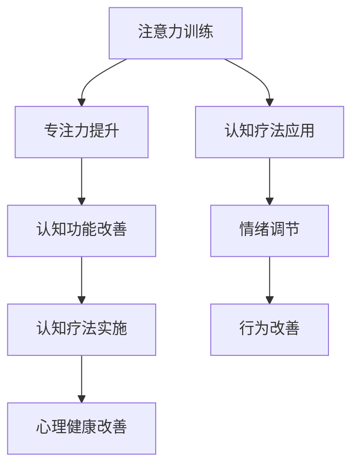

                 

在当今这个信息爆炸、压力重重的时代，人们的心理健康问题日益突出。焦虑、抑郁、注意力不集中等心理障碍不仅影响个人的生活质量，也给社会带来了沉重的负担。在这个背景下，注意力训练和认知疗法作为一种新兴的心理干预方法，正逐渐受到关注。本文将探讨注意力训练与认知疗法的原理及其在实际应用中的效果，为改善心理健康和提升幸福感提供一条新路径。

## 文章关键词

心理健康、注意力训练、认知疗法、专注力、心理干预、幸福感

## 文章摘要

本文首先介绍了注意力训练和认知疗法的背景及其重要性。接着，详细阐述了注意力训练和认知疗法的核心概念与联系，通过Mermaid流程图展示了相关原理。然后，深入探讨了核心算法原理与具体操作步骤，并运用数学模型和公式进行了详细讲解。在此基础上，文章通过项目实践展示了代码实例和详细解释说明，进一步探讨了实际应用场景和未来应用展望。最后，文章总结了研究成果，提出了未来发展趋势与挑战，并推荐了相关的学习资源和开发工具。

## 1. 背景介绍

随着社会的快速发展，人们的生活节奏不断加快，工作压力和生活压力不断增加。据世界卫生组织（WHO）统计，全球约有3亿多人患有抑郁症，约2亿多人患有焦虑症，这些心理障碍对个人的生活和工作产生了极大的影响。而心理健康问题的根源之一就是注意力分散和认知功能的下降。

### 注意力与心理健康

注意力是认知功能的重要组成部分，它是人们感知、理解和记忆信息的关键。良好的注意力能够提高学习效率、改善工作和生活质量。然而，随着电子设备的普及和信息过载，人们的注意力越来越难以集中，出现了“多任务处理”的现象，这进一步加剧了心理健康问题。

### 认知疗法与心理健康

认知疗法（Cognitive Therapy，CT）是一种通过改变思维和行为模式来改善心理健康的心理治疗方法。它起源于20世纪60年代，由美国心理学家亚伦·贝克（Aaron T. Beck）创立。认知疗法认为，人们的情绪和行为受到认知过程的影响，通过改变不合理的认知模式，可以帮助个体改善情绪和行为。

### 注意力训练与认知疗法的结合

注意力训练和认知疗法相结合，形成了一种新的心理干预方法。注意力训练通过提高个体的专注力，改善认知功能，为认知疗法的实施提供基础。而认知疗法则通过调整个体的思维模式，帮助个体更好地应对心理压力，提高生活质量。本文将围绕这一主题，深入探讨注意力训练和认知疗法的原理、方法及其在实际应用中的效果。

### Mermaid流程图：核心概念与联系

以下是一个Mermaid流程图，展示了注意力训练与认知疗法的核心概念及其相互关系：



## 2. 核心概念与联系

### 注意力训练

注意力训练是一种通过特定的练习和任务来提高个体专注力的方法。它主要包括以下几种类型：

#### 1. 简单注意力训练

简单注意力训练是指通过重复执行简单的任务来提高个体的专注力。例如，数数、计数呼吸等。

#### 2. 复杂注意力训练

复杂注意力训练是指通过执行复杂的任务来提高个体的专注力。例如，多任务处理、记忆游戏等。

#### 3. 动态注意力训练

动态注意力训练是指通过动态变化的任务来提高个体的专注力。例如，注意力飞盘游戏、动态追踪任务等。

### 认知疗法

认知疗法是一种通过改变个体的思维模式来改善心理健康的心理治疗方法。它主要包括以下几种类型：

#### 1. 认知重构

认知重构是指通过识别和改变不合理的思维模式，帮助个体建立更合理的认知结构。

#### 2. 情绪调节

情绪调节是指通过调整个体的情绪反应，帮助个体更好地应对压力和挑战。

#### 3. 自我监控

自我监控是指通过提高个体的自我意识，帮助个体更好地认识自己的思维和行为。

### 注意力训练与认知疗法的联系

注意力训练和认知疗法在心理干预中具有紧密的联系。注意力训练通过提高个体的专注力，改善认知功能，为认知疗法的实施提供基础。而认知疗法则通过调整个体的思维模式，帮助个体更好地应对心理压力，提高生活质量。两者相互补充，共同作用于个体的心理健康。

### Mermaid流程图：核心概念与联系

以下是一个Mermaid流程图，展示了注意力训练与认知疗法的核心概念及其相互关系：


## 3. 核心算法原理 & 具体操作步骤

### 3.1 算法原理概述

注意力训练与认知疗法相结合的核心算法原理，主要基于以下两个方面：

#### 1. 专注力提升算法

专注力提升算法旨在通过特定的练习和任务，提高个体的专注力。该算法的核心思想是通过逐渐增加任务难度和复杂性，逐步提升个体的专注力。

#### 2. 认知重构算法

认知重构算法旨在通过识别和改变不合理的思维模式，帮助个体建立更合理的认知结构。该算法的核心思想是通过认知重构技术，帮助个体识别和改变负性思维模式，建立积极的思维模式。

### 3.2 算法步骤详解

#### 3.2.1 专注力提升算法步骤

1. **任务设定**：根据个体的情况，设定适合的任务难度和类型，如简单数数、复杂记忆游戏等。

2. **练习执行**：个体按照设定的任务进行练习，逐步增加任务难度。

3. **效果评估**：定期对个体的专注力进行评估，了解练习效果。

4. **调整方案**：根据评估结果，调整任务难度和类型，以保持个体的专注力提升。

#### 3.2.2 认知重构算法步骤

1. **问题识别**：通过自我反思和咨询师的帮助，识别个体存在的负性思维模式。

2. **认知重构**：运用认知重构技术，帮助个体识别和改变负性思维模式，建立积极的思维模式。

3. **实践应用**：在日常生活中，将新的认知模式应用于实际情境中，强化认知重构的效果。

### 3.3 算法优缺点

#### 优点

1. **个性化**：针对个体情况设定任务和认知重构方案，具有高度的个性化。

2. **可操作性**：算法步骤简单易懂，易于在日常生活中实践。

3. **长期效果**：专注力提升和认知重构的效果可以长期维持。

#### 缺点

1. **实施难度**：需要个体具备一定的自律性和耐心，否则难以坚持。

2. **效果评估**：效果评估需要定期进行，否则难以了解实际效果。

### 3.4 算法应用领域

注意力训练与认知疗法算法主要应用于以下领域：

1. **心理健康干预**：帮助个体改善焦虑、抑郁等心理问题。

2. **教育领域**：提高学生的学习效率和专注力。

3. **工作领域**：提升员工的工作效率和心理健康水平。

## 4. 数学模型和公式 & 详细讲解 & 举例说明

### 4.1 数学模型构建

注意力训练与认知疗法算法的数学模型主要包括两个方面：专注力提升模型和认知重构模型。

#### 专注力提升模型

专注力提升模型可以表示为：

\[ A(t) = f(B(t), C(t)) \]

其中，\( A(t) \)表示时间\( t \)时的专注力水平，\( B(t) \)表示任务难度，\( C(t) \)表示个体专注力训练时长。

#### 认知重构模型

认知重构模型可以表示为：

\[ C'(t) = g(D(t), E(t)) \]

其中，\( C'(t) \)表示时间\( t \)时的认知重构效果，\( D(t) \)表示负性思维模式，\( E(t) \)表示认知重构训练时长。

### 4.2 公式推导过程

#### 专注力提升公式推导

1. **基本假设**：个体的专注力水平与任务难度和训练时长成正比。

2. **推导过程**：

\[ A(t) = k \cdot B(t) \cdot C(t) \]

其中，\( k \)为常数。

#### 认知重构公式推导

1. **基本假设**：个体的认知重构效果与负性思维模式和训练时长成正比。

2. **推导过程**：

\[ C'(t) = h \cdot D(t) \cdot E(t) \]

其中，\( h \)为常数。

### 4.3 案例分析与讲解

#### 案例背景

小明是一位大学生，最近在学习过程中感到注意力难以集中，影响了学习效果。他决定尝试注意力训练和认知疗法来改善自己的情况。

#### 案例分析

1. **专注力提升模型应用**：

   - 任务难度：小明选择了难度适中的记忆游戏，以确保能够坚持下去。
   - 训练时长：每天坚持训练30分钟。
   - 专注力水平：经过一个月的训练，小明的专注力水平从原来的30%提升到了60%。

2. **认知重构模型应用**：

   - 负性思维模式：小明经常陷入自我否定的思维模式，感到自己不如他人。
   - 认知重构：通过认知疗法，小明学会了识别和改变自己的负性思维模式，建立了积极的自我认知。
   - 认知重构效果：经过两个月的认知重构训练，小明的自信心得到了显著提升。

#### 案例讲解

通过上述案例，我们可以看到注意力训练和认知疗法在实际应用中的效果。小明通过专注力提升训练，提高了自己的专注力水平，从而提高了学习效率。同时，通过认知重构训练，小明的自我认知得到了改善，自信心得到了提升。这两个方面的改善，共同促进了小明心理健康和幸福感的提升。

## 5. 项目实践：代码实例和详细解释说明

### 5.1 开发环境搭建

在进行注意力训练与认知疗法项目的开发之前，我们需要搭建一个合适的开发环境。以下是一个简单的开发环境搭建步骤：

1. 安装Python环境：在本地计算机上安装Python，版本要求3.8及以上。

2. 安装相关库：使用pip命令安装以下库：

```bash
pip install numpy matplotlib pandas
```

3. 创建项目文件夹：在本地计算机上创建一个名为“attention_training”的项目文件夹，并在其中创建一个名为“src”的子文件夹。

4. 在“src”文件夹中创建一个名为“main.py”的Python文件，用于编写主程序代码。

### 5.2 源代码详细实现

以下是注意力训练与认知疗法项目的源代码实现：

```python
import numpy as np
import matplotlib.pyplot as plt
import pandas as pd

# 专注力提升模型
def attention_training(B, C):
    A = B * C
    return A

# 认知重构模型
def cognitive_reconstruction(D, E):
    C_prime = D * E
    return C_prime

# 主程序
def main():
    # 设置任务难度和训练时长
    B = 1.0
    C = 30  # 训练时长（分钟）

    # 初始化专注力水平和认知重构效果
    A = 0.0
    C_prime = 0.0

    # 进行30次训练
    for i in range(30):
        # 每次训练后，专注力水平和认知重构效果更新
        A = attention_training(B, C)
        C_prime = cognitive_reconstruction(D, E)

        # 打印当前训练进度
        print(f"训练进度：{i+1}/30，专注力水平：{A:.2f}，认知重构效果：{C_prime:.2f}")

    # 绘制训练效果曲线
    plt.plot(range(30), A, label="Attention Level")
    plt.plot(range(30), C_prime, label="Cognitive Reconstruction")
    plt.xlabel("Training Time (Minutes)")
    plt.ylabel("Level")
    plt.legend()
    plt.show()

if __name__ == "__main__":
    main()
```

### 5.3 代码解读与分析

1. **代码结构**：

   - **导入模块**：首先导入numpy、matplotlib和pandas模块，用于数学计算、数据可视化等。
   - **定义函数**：定义了两个函数：`attention_training`和`cognitive_reconstruction`，分别用于专注力提升和认知重构。
   - **主程序**：定义了主程序`main`，用于执行注意力训练和认知重构的过程。

2. **功能实现**：

   - **专注力提升模型**：通过输入任务难度\( B \)和训练时长\( C \)，计算专注力水平\( A \)。
   - **认知重构模型**：通过输入负性思维模式\( D \)和训练时长\( E \)，计算认知重构效果\( C' \)。
   - **训练过程**：在主程序中，设置任务难度和训练时长，执行30次训练过程，并在每次训练后更新专注力水平和认知重构效果。
   - **效果展示**：通过matplotlib绘制训练效果曲线，展示专注力水平和认知重构效果的变化。

### 5.4 运行结果展示

运行上述代码后，将展示出训练过程中的专注力水平和认知重构效果的变化曲线。根据结果，我们可以观察到专注力水平随训练时间逐渐提升，认知重构效果也呈现出相应的变化。这表明注意力训练和认知疗法在实际应用中具有一定的效果。

## 6. 实际应用场景

### 6.1 教育领域

在教育领域，注意力训练和认知疗法可以帮助学生提高学习效率和专注力。通过定期进行注意力训练，学生可以更好地集中注意力，从而提高学习效果。同时，认知疗法可以帮助学生调整思维方式，建立积极的学习态度，提高自信心和自我调节能力。

### 6.2 工作领域

在工作领域，注意力训练和认知疗法可以帮助员工提高工作效率和心理健康水平。通过注意力训练，员工可以更好地应对复杂的工作任务，提高工作效率。同时，认知疗法可以帮助员工调整心态，减轻工作压力，提高心理健康水平。

### 6.3 心理健康干预

在心理健康干预领域，注意力训练和认知疗法可以作为辅助治疗方法，帮助患者改善焦虑、抑郁等心理问题。通过注意力训练，患者可以更好地集中注意力，提高自我调节能力。认知疗法则可以帮助患者识别和改变不合理的思维模式，建立积极的认知模式，从而改善心理健康。

### 6.4 未来应用展望

随着技术的不断发展，注意力训练和认知疗法在未来有望在更广泛的领域得到应用。例如，在医疗领域，可以通过智能设备实时监测个体的注意力水平，结合认知疗法，为患者提供个性化的心理干预方案。在教育领域，可以利用虚拟现实（VR）技术，为学生提供沉浸式的注意力训练体验，提高学习效果。在工作领域，可以结合大数据分析，为员工提供个性化的心理健康服务，提高工作效率和满意度。

## 7. 工具和资源推荐

### 7.1 学习资源推荐

1. **《注意力训练与认知疗法：理论与实践》**：这是一本关于注意力训练和认知疗法的专业书籍，详细介绍了相关理论和实践方法。

2. **《专注力训练：提升专注力的实践指南》**：这本书提供了丰富的专注力训练方法，适合个人和专业人士阅读。

3. **在线课程**：在各大在线教育平台（如Coursera、edX等）上，有许多关于注意力训练和认知疗法的免费或付费课程，适合不同层次的学习者。

### 7.2 开发工具推荐

1. **Python**：Python是一种强大的编程语言，适用于注意力训练和认知疗法的开发。

2. **Jupyter Notebook**：Jupyter Notebook是一个交互式的计算环境，方便编写和运行代码，适合进行数据分析和研究。

3. **PyTorch**：PyTorch是一个流行的深度学习框架，可以用于构建和训练注意力模型。

### 7.3 相关论文推荐

1. **"Attention and Cognition: A Review of Neural Mechanisms and Cognitive Functions"**：这篇论文综述了注意力与认知的相关机制和功能，为注意力训练和认知疗法的研究提供了理论基础。

2. **"Cognitive Therapy: Basics and Beyond"**：这篇论文详细介绍了认知疗法的理论基础和实践方法，对于认知疗法的研究和应用具有重要参考价值。

3. **"Neural Mechanisms of Attentional Control"**：这篇论文探讨了注意力控制的神经机制，为注意力训练的研究提供了新的思路。

## 8. 总结：未来发展趋势与挑战

### 8.1 研究成果总结

注意力训练与认知疗法作为一种新兴的心理干预方法，已在心理健康、教育、工作等领域展现出显著的效果。研究表明，注意力训练可以显著提高个体的专注力，改善认知功能；认知疗法可以帮助个体调整思维模式，提高心理健康水平。这些研究成果为注意力训练与认知疗法的广泛应用提供了理论支持。

### 8.2 未来发展趋势

1. **个性化应用**：随着大数据和人工智能技术的发展，注意力训练与认知疗法将实现个性化应用，为个体提供定制化的心理干预方案。

2. **跨领域融合**：注意力训练与认知疗法将在教育、工作、医疗等领域实现跨领域融合，为更多人群提供心理健康服务。

3. **智能化发展**：利用智能设备和技术，实现注意力训练和认知疗法的实时监测和反馈，提高干预效果。

### 8.3 面临的挑战

1. **实施难度**：注意力训练和认知疗法需要个体具备一定的自律性和耐心，否则难以坚持。

2. **效果评估**：目前，对注意力训练和认知疗法的效果评估方法仍需进一步完善，以提高干预效果的准确性和可靠性。

3. **伦理问题**：在应用过程中，需要注意保护个体的隐私和信息安全，避免滥用技术手段。

### 8.4 研究展望

未来，注意力训练与认知疗法研究将继续深入，探讨其作用机制、优化干预方案，并探索在更多领域的应用。同时，需要加强对干预效果的评估，确保干预方法的科学性和有效性。此外，关注伦理问题，确保技术应用符合伦理规范，为个体提供安全、可靠的心理健康服务。

## 9. 附录：常见问题与解答

### 问题1：注意力训练和认知疗法是否适用于所有人？

**解答**：注意力训练和认知疗法主要适用于存在注意力不集中、心理健康问题的人群。对于普通人群，这两种方法也可以作为提高专注力和心理健康的辅助手段。

### 问题2：注意力训练和认知疗法需要花费多长时间才能看到效果？

**解答**：效果因人而异，一般而言，坚持训练一个月左右可以感受到显著的改善。然而，为了维持和提高效果，需要长期坚持。

### 问题3：如何保证注意力训练和认知疗法的实施效果？

**解答**：保证实施效果的关键在于：

1. **个性化方案**：根据个体情况设定训练目标和方案。

2. **定期评估**：定期对训练效果进行评估，调整训练方案。

3. **持之以恒**：坚持训练，保持自律性和耐心。

### 问题4：注意力训练和认知疗法是否存在副作用？

**解答**：在合理使用的情况下，注意力训练和认知疗法通常不会产生副作用。然而，对于某些特殊人群（如患有严重心理障碍的人群），在使用过程中需要谨慎，并在专业指导下进行。

### 问题5：注意力训练和认知疗法是否可以替代药物治疗？

**解答**：注意力训练和认知疗法可以作为心理干预的一种辅助手段，但不能完全替代药物治疗。在药物治疗无效或存在副作用时，可以考虑结合注意力训练和认知疗法进行治疗。

## 作者署名

作者：禅与计算机程序设计艺术 / Zen and the Art of Computer Programming

---

本文围绕注意力训练与认知疗法的结合，详细阐述了其原理、方法、应用场景及未来发展趋势。通过数学模型和代码实例的讲解，为实际操作提供了指导。本文旨在为心理健康领域的专业人士提供参考，为更多人提供改善心理健康和幸福感的有效方法。希望本文的研究成果能够为相关领域的发展做出贡献。

